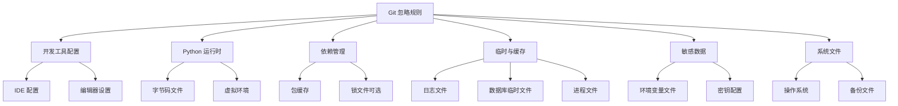

# 项目 .gitignore 配置设计

## 1. 概述

### 1.1 设计目标
为 sqlmapWebUI 后端项目添加规范的 Git 忽略文件配置，确保版本控制仅跟踪必要的源代码文件，排除自动生成、临时文件、敏感信息和环境依赖文件，同时保持对 Git 子模块的正常管理。

### 1.2 核心原则
- **保护敏感信息**：排除包含密钥、令牌、密码的配置文件
- **减少仓库体积**：忽略依赖包、编译产物、缓存文件
- **避免环境冲突**：排除开发工具特定配置和虚拟环境
- **保留子模块管理**：确保 `.gitmodules` 文件和子模块配置被正常追踪
- **团队协作友好**：确保不同开发环境下的一致性

### 1.3 适用范围
本配置适用于项目根目录和 `src/backEnd` 目录，覆盖 Python FastAPI 后端应用、UV 包管理工具环境以及集成的 sqlmap 第三方工具。

## 2. 忽略规则架构

### 2.1 分层忽略策略

忽略配置采用分层设计，分为**项目根目录级别**和**后端模块级别**两个层次：

| 配置文件位置 | 作用域 | 主要职责 |
|------------|--------|---------|
| `/.gitignore` | 全局项目 | 管理开发工具配置、文档草稿、全局临时文件 |
| `/src/backEnd/.gitignore` | 后端模块 | 管理 Python 运行时文件、虚拟环境、依赖缓存、数据库文件 |

### 2.2 忽略类别划分



## 3. 忽略规则详细定义

### 3.1 根目录忽略配置

**位置**：项目根目录 `/.gitignore`

#### 3.1.1 开发工具配置

| 规则模式 | 说明 | 影响文件示例 |
|---------|------|------------|
| `.idea/` | JetBrains IDE（PyCharm）配置 | `.idea/workspace.xml`, `.idea/misc.xml` |
| `.vscode/` | Visual Studio Code 配置 | `.vscode/settings.json` |
| `*.swp`, `*.swo` | Vim 编辑器临时文件 | `main.py.swp` |
| `.DS_Store` | macOS 目录元数据 | 各目录下的 `.DS_Store` |

**设计理由**：
- IDE 配置文件包含个人偏好和本地路径信息，不应共享
- 保留 `.idea/` 可选择性提交项目级配置（如代码风格），但个人工作区配置必须排除

#### 3.1.2 文档与临时文件

| 规则模式 | 说明 |
|---------|------|
| `*.tmp`, `*.temp` | 临时文件 |
| `*.bak`, `*.backup` | 备份文件 |
| `doc/drafts/` | 文档草稿目录 |

### 3.2 后端模块忽略配置

**位置**：`/src/backEnd/.gitignore`

#### 3.2.1 Python 字节码与缓存

| 规则模式 | 说明 | 生成场景 |
|---------|------|---------|
| `__pycache__/` | Python 字节码缓存目录 | 模块导入时自动生成 |
| `*.py[cod]` | 编译的 Python 文件 | `.pyc`, `.pyo`, `.pyd` |
| `*$py.class` | Java 互操作生成的类文件 | Jython 环境 |
| `.pytest_cache/` | Pytest 测试缓存 | 单元测试执行 |

**设计理由**：
- 字节码文件是由 Python 解释器自动生成的优化文件
- 不同 Python 版本生成的字节码不兼容，不应纳入版本控制
- 缓存文件可随时重新生成，无需备份

#### 3.2.2 虚拟环境

| 规则模式 | 说明 |
|---------|------|
| `.venv/` | UV/Virtualenv 虚拟环境 |
| `venv/` | 通用虚拟环境目录 |
| `env/` | 替代虚拟环境目录 |

**设计理由**：
- 虚拟环境包含完整的依赖包副本，体积庞大（通常 > 100MB）
- 依赖通过 `pyproject.toml` 和 `uv.lock` 声明，可随时重建
- 不同操作系统的虚拟环境不可移植

#### 3.2.3 UV 包管理工具

| 规则模式 | 说明 | 是否忽略 |
|---------|------|---------|
| `.uv/` | UV 本地缓存目录 | ✓ 忽略 |
| `uv.lock` | UV 依赖锁定文件 | ✗ 保留 |

**设计理由**：
- `uv.lock` 锁定精确依赖版本，确保团队环境一致性，**必须提交**
- `.uv/` 缓存目录包含下载的包文件，可从镜像源重新获取

#### 3.2.4 数据库与数据文件

| 规则模式 | 说明 | 数据类型 |
|---------|------|---------|
| `*.db` | SQLite 数据库文件 | IPC 数据库、任务数据库 |
| `*.sqlite` | SQLite 别名 | 持久化数据 |
| `*.log` | 日志文件 | 应用运行日志 |
| `*.pid` | 进程 ID 文件 | 运行时进程标识 |

**设计理由**：
- 根据 `main.py` 分析，项目使用 `tempfile.mkstemp` 创建临时数据库
- 数据库文件包含运行时状态，不应纳入版本控制
- 日志文件体积增长快，应通过日志管理系统处理

#### 3.2.5 敏感配置文件

| 规则模式 | 说明 | 包含信息 |
|---------|------|---------|
| `.env` | 环境变量配置 | 密钥、密码、Token |
| `.env.local` | 本地环境变量 | 开发者个人配置 |
| `config.local.py` | 本地配置覆盖 | 数据库连接信息 |
| `secrets.json` | 密钥存储 | API 密钥、OAuth 凭证 |

**设计理由**：
- 防止敏感信息泄露到公共仓库
- 使用 `.env.example` 作为模板文件，仅提供结构不包含真实值

#### 3.2.6 第三方工具生成文件

| 规则模式 | 说明 | 生成来源 |
|---------|------|---------|
| `third_lib/sqlmap/output/` | sqlmap 扫描结果 | SQL 注入检测输出 |
| `*.egg-info/` | Python 包元数据 | setuptools 构建 |
| `dist/` | 构建分发包 | 打包输出 |
| `build/` | 构建临时目录 | 编译过程 |

**设计理由**：
- sqlmap 输出包含扫描目标和漏洞信息，应单独备份而非版本控制
- 包构建产物可由源代码重新生成

### 3.3 子模块保护机制

#### 3.3.1 子模块文件状态

| 文件/目录 | Git 管理状态 | 说明 |
|----------|------------|------|
| `.gitmodules` | ✓ 追踪 | 子模块配置定义文件 |
| `src/backEnd/third_lib/sqlmap/` | ✓ 追踪（作为子模块） | Git 子模块指针 |
| `src/backEnd/thirdparty/sqlmap/` | 需确认 | 疑似重复的 sqlmap 副本 |

#### 3.3.2 子模块忽略规则

**确保以下规则不出现在 .gitignore 中**：
- `third_lib/`（不能整体忽略，会破坏子模块管理）
- `third_lib/sqlmap/`（子模块目录由 Git 自动管理）
- `.gitmodules`（必须追踪）

**仅忽略子模块内部生成的文件**：
```
third_lib/sqlmap/output/
third_lib/sqlmap/*.db
third_lib/sqlmap/*.log
```

## 4. 配置文件内容定义

### 4.1 根目录 .gitignore 内容

应包含以下分类规则：
- 操作系统特定文件（macOS、Windows、Linux）
- IDE 和编辑器配置（.idea/、.vscode/、*.swp）
- 全局临时文件（*.tmp、*.bak）
- 文档草稿目录

### 4.2 后端目录 .gitignore 内容

应包含以下分类规则：
- Python 字节码（__pycache__/、*.pyc）
- 虚拟环境（.venv/、venv/、env/）
- UV 缓存（.uv/）
- 数据库文件（*.db、*.sqlite）
- 日志文件（*.log）
- 敏感配置（.env、.env.local）
- 运行时文件（*.pid）
- 第三方工具输出（third_lib/sqlmap/output/）
- 构建产物（dist/、build/、*.egg-info/）
- 测试缓存（.pytest_cache/、.coverage）

## 5. 特殊场景处理

### 5.1 UV 锁文件策略

| 场景 | uv.lock 是否提交 | 理由 |
|------|----------------|------|
| 应用程序部署 | ✓ 提交 | 确保生产环境依赖版本一致 |
| 库/框架开发 | ✗ 忽略 | 允许依赖版本灵活更新 |
| **本项目决策** | **✓ 提交** | 后端应用需要确定性部署 |

### 5.2 配置文件版本控制策略

| 文件类型 | 示例 | 是否提交 | 替代方案 |
|---------|------|---------|---------|
| 默认配置 | `config.py` | ✓ | 提供通用默认值 |
| 环境配置模板 | `.env.example` | ✓ | 仅包含键名，值为占位符 |
| 本地配置 | `.env`、`.env.local` | ✗ | 由开发者自行创建 |
| 生产配置 | `.env.production` | ✗ | 通过 CI/CD 注入 |

### 5.3 数据库文件处理

根据 `main.py` 中的数据库初始化逻辑：


**处理原则**：
- 所有 `.db` 和 `.sqlite` 文件均忽略
- 数据库模式通过代码定义（`Database.init()`）
- 如需共享测试数据，使用 SQL 导出脚本而非二进制数据库文件

## 6. 验证与维护

### 6.1 配置验证流程

**步骤 1：检查现有文件状态**
- 列出当前 Git 追踪的所有文件
- 识别应被忽略但已追踪的文件

**步骤 2：清理已追踪的忽略文件**
- 对于已提交的敏感文件，需从历史记录中移除
- 对于已提交的生成文件，使用 `git rm --cached` 停止追踪

**步骤 3：测试忽略规则**
- 创建测试文件验证规则生效
- 确认子模块状态未受影响

### 6.2 团队协作检查清单

| 检查项 | 验证方法 | 预期结果 |
|--------|---------|---------|
| 虚拟环境未追踪 | `git status` 不显示 `.venv/` | 忽略生效 |
| 锁文件已提交 | 仓库包含 `uv.lock` | 确保依赖一致 |
| 子模块正常 | `git submodule status` | 显示正确提交哈希 |
| 敏感文件保护 | 搜索 `.env` 文件 | 未出现在仓库中 |
| 字节码未追踪 | 搜索 `.pyc` 文件 | 未出现在仓库中 |

### 6.3 维护建议

**定期审查**：
- 每季度检查新增的临时文件类型
- 关注团队成员反馈的忽略规则遗漏

**版本更新**：
- 当 Python 版本升级时，检查新的缓存机制
- 当引入新的工具链（如新的测试框架）时，更新忽略规则

**文档同步**：
- 在 README 中说明如何创建本地配置文件
- 提供 `.env.example` 模板并保持更新

## 7. 风险与约束

### 7.1 潜在风险

| 风险 | 影响 | 缓解措施 |
|------|------|---------|
| 忽略规则过于宽泛 | 误忽略重要配置文件 | 使用明确的路径而非通配符 |
| 子模块路径被忽略 | 子模块更新失败 | 在规则中明确排除子模块目录 |
| 敏感文件已提交 | 信息泄露 | 使用 git-filter-repo 清理历史 |
| 锁文件冲突 | 合并困难 | 建立锁文件更新规范 |

### 7.2 约束条件

**必须遵守**：
- `.gitmodules` 文件必须保持追踪
- 不得忽略 `third_lib/sqlmap/` 整个目录
- 不得忽略 `pyproject.toml` 和 `uv.lock`

**推荐实践**：
- 使用全局 `.gitignore` 处理个人工具配置
- 在项目级 `.gitignore` 中仅包含项目特定规则
- 为每个忽略规则添加注释说明用途
