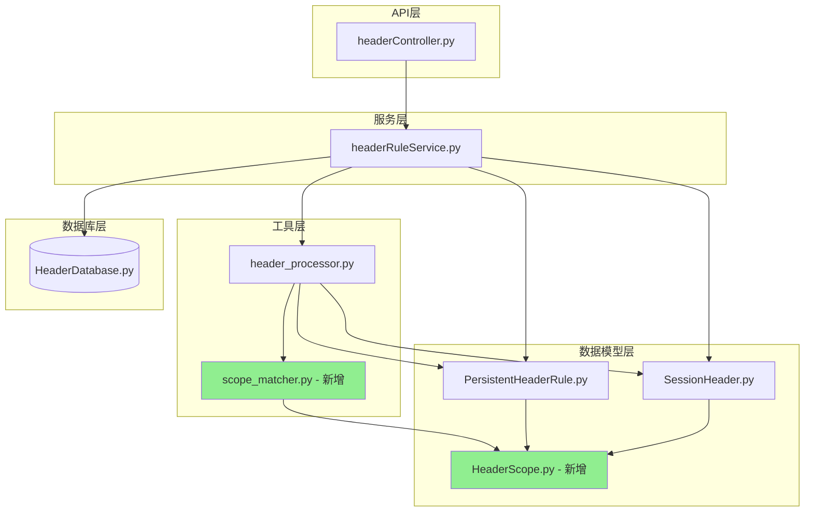
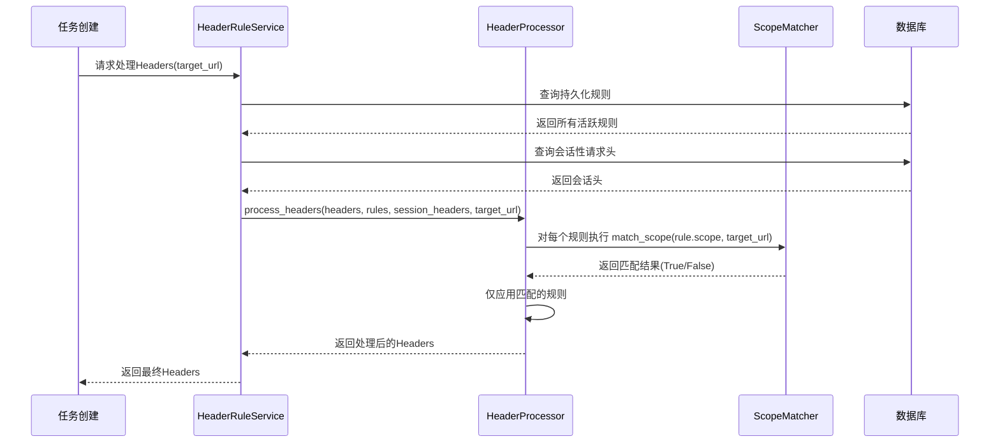
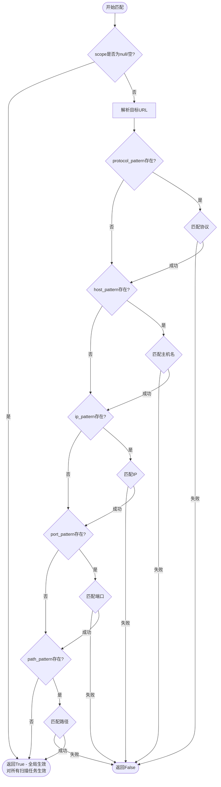
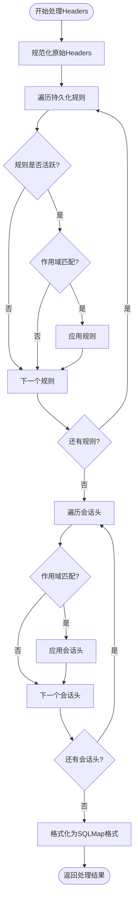

# 后端Header服务作用域扩展设计

## 概述

本设计旨在为现有的请求头管理服务（持久化规则和会话性请求头）添加**作用域匹配**功能，使规则可以选择性地对特定目标URL生效。**作用域为可选配置，默认不填写时表示全局生效，对所有扫描任务生效。**作用域包括协议（Protocol）、主机名（Host）、IP地址、端口（Port）和路径（Path），支持**关键字匹配（默认）**和**正则表达式匹配**两种模式。

### 业务价值

- **精细化控制**：不同的目标服务器应用不同的请求头规则
- **避免误注入**：防止将不相关的请求头注入到错误的目标
- **灵活性**：支持多种匹配模式（关键字、正则、组合）
- **性能优化**：通过作用域过滤减少不必要的请求头处理

### 核心需求

1. 为持久化规则（PersistentHeaderRule）和会话性请求头（SessionHeader）添加**可选的**作用域配置
2. **scope字段为可选字段，默认不填写（null）时表示全局生效，对所有扫描任务生效**
3. 当配置scope时，支持协议、主机名、IP、端口、路径五个维度的作用域定义
4. 默认使用关键字匹配，支持正则表达式匹配
5. 在请求头处理时根据任务的目标URL进行作用域匹配

## 架构设计

### 使用场景说明

#### 典型使用场景

| 场景 | scope配置 | 说明 |
|------|---------|------|
| 全局通用请求头 | **不填写scope字段(推荐)** | 适用于所有扫描任务的通用请求头,如User-Agent、Accept等 |
| 特定域名认证 | 配置host_pattern | 仅对特定域名添加Authorization等认证头 |
| 内网IP段 | 配置ip_pattern | 仅对内网IP段添加特定请求头 |
| API版本隔离 | 配置path_pattern | 对不同API版本路径使用不同的请求头 |
| HTTPS专属头 | 配置protocol_pattern | 仅对HTTPS请求添加特定安全头 |
| 生产/测试环境隔离 | 组合配置多个维度 | 精确控制不同环境使用不同的请求头 |

#### 推荐配置策略

1. **大多数情况下不需要配置scope**:如果请求头适用于所有扫描任务,保持scope为空即可
2. **按需配置scope**:只有当需要限制规则仅对特定目标生效时才配置scope
3. **优先使用关键字模式**:关键字模式性能更好,除非必要否则不使用正则表达式
4. **避免过度限制**:scope配置过于严格可能导致规则无法生效

### 整体架构变更



### 数据流设计



## 数据模型设计

### HeaderScope 数据模型

定义作用域的数据结构，支持多维度匹配。**该模型为可选配置，整个scope字段可以不填写。**

| 字段名 | 类型 | 必填 | 说明 | 示例 |
|--------|------|------|------|------|
| protocol_pattern | Optional[str] | 否 | 协议匹配模式 | `http`, `https`, `http,https` |
| host_pattern | Optional[str] | 否 | 主机名匹配模式 | `example.com`, `*.example.com` |
| ip_pattern | Optional[str] | 否 | IP地址匹配模式 | `192.168.1.100`, `192.168.*` |
| port_pattern | Optional[str] | 否 | 端口匹配模式 | `8080`, `80,443,8080` |
| path_pattern | Optional[str] | 否 | 路径匹配模式 | `/api/*`, `/admin/.*` |
| use_regex | bool | 否 | 是否使用正则表达式 | `false`(默认), `true` |

**匹配逻辑**：
- **scope字段为空（null或未提供）时，表示全局生效，对所有扫描任务生效**
- 当scope字段存在时，所有非空字段必须同时匹配（AND逻辑）
- scope内部空字段表示不限制该维度
- scope内部所有字段都为空，等同于scope为null，表示全局生效
- **protocol_pattern为空时，默认所有协议（http/https）都生效**

### PersistentHeaderRule 模型扩展

在现有模型基础上增加作用域字段。**scope字段为可选字段，不填写时默认为null，表示对所有扫描任务全局生效。**

| 原有字段 | 新增字段 |
|---------|---------|
| id | scope |
| name | |
| header_name | |
| header_value | |
| replace_strategy | |
| match_condition | |
| priority | |
| is_active | |
| created_at | |
| updated_at | |

**scope字段说明**：
- 类型：Optional[HeaderScope]
- 是否必填：否（可不填）
- 默认值：None/null（**不填写时默认为全局生效，对所有扫描任务生效**）
- 存储方式：JSON字符串序列化到数据库
- 使用场景：当需要限制规则仅对特定目标生效时才配置

### SessionHeader 模型扩展

与持久化规则类似，增加作用域字段。**scope字段为可选字段，不填写时默认为null，表示对所有扫描任务全局生效。**

| 原有字段 | 新增字段 |
|---------|---------|
| header_name | scope |
| header_value | |
| priority | |
| expires_at | |
| created_at | |
| source_ip | |

## 数据库设计

### persistent_header_rules 表结构扩展

| 列名 | 类型 | 说明 | 变更类型 |
|------|------|------|----------|
| scope_config | TEXT | 作用域配置（JSON） | **新增** |

**示例数据**：
```
scope_config: {
  "protocol_pattern": "https",
  "host_pattern": "*.example.com",
  "port_pattern": "443",
  "path_pattern": "/api/*",
  "use_regex": false
}
```

### session_headers 表结构扩展

| 列名 | 类型 | 说明 | 变更类型 |
|------|------|------|----------|
| scope_config | TEXT | 作用域配置（JSON） | **新增** |

## 业务逻辑设计

### 作用域匹配器（ScopeMatcher）

核心匹配逻辑的实现。

#### 职责定义
- 解析目标URL，提取主机名、IP、端口、路径
- 根据作用域配置执行匹配判断
- 支持关键字匹配和正则表达式匹配
- 处理通配符（关键字模式）

#### 匹配规则表

| 匹配维度 | 关键字模式 | 正则表达式模式 | 匹配示例 |
|---------|-----------|---------------|---------|
| 协议 | 逗号分隔列表 | 完整正则 | `https` 匹配 `https://...` |
| 协议 | 逗号分隔列表 | 完整正则 | `http,https` 匹配两者 |
| 主机名 | 支持通配符 `*` | 完整正则 | `*.example.com` 匹配 `api.example.com` |
| IP地址 | 支持通配符 `*` | 完整正则 | `192.168.*` 匹配 `192.168.1.100` |
| 端口 | 逗号分隔列表 | 完整正则 | `80,443` 匹配 `443` |
| 路径 | 支持通配符 `*` | 完整正则 | `/api/*` 匹配 `/api/users` |

#### 匹配流程



#### 核心方法定义

**match_scope(scope, target_url) -> bool**
- 功能：判断作用域是否匹配目标URL
- 输入：
  - scope: HeaderScope对象
  - target_url: 目标URL字符串
- 输出：布尔值（True表示匹配）

**parse_target_url(url) -> Dict**
- 功能：解析URL为各个组成部分
- 输入：URL字符串
- 输出：字典，包含protocol、host、ip、port、path

**match_pattern(value, pattern, use_regex) -> bool**
- 功能：执行单个维度的匹配
- 输入：
  - value: 实际值
  - pattern: 匹配模式
  - use_regex: 是否使用正则
- 输出：布尔值

### HeaderProcessor 增强

在现有请求头处理器中集成作用域匹配。

#### 处理流程变更



#### 方法签名变更

**process_headers 方法**

原签名：
```
process_headers(original_headers, persistent_rules, session_headers) -> (List[str], List[str])
```

新签名：
```
process_headers(original_headers, persistent_rules, session_headers, target_url) -> (List[str], List[str])
```

新增参数：
- target_url: 目标URL字符串（必填）

### HeaderRuleService 调整

服务层需要获取并传递目标URL信息。

#### 影响的方法

**preview_header_processing**
- 增加target_url参数
- 调用处理器时传递URL

**get_active_persistent_rules_for_processing**
- 保持现有逻辑，返回所有活跃规则
- 作用域匹配由处理器执行

## API 接口设计

### 请求模型扩展

#### PersistentHeaderRuleCreate 扩展

| 原有字段 | 新增字段 |
|---------|---------|
| name | scope |
| header_name | |
| header_value | |
| replace_strategy | |
| match_condition | |
| priority | |
| is_active | |

**scope字段结构**：
```
{
  "host_pattern": "*.example.com",
  "ip_pattern": null,
  "port_pattern": "443",
  "path_pattern": "/api/*",
  "use_regex": false
}
```

#### SessionHeaderCreate 扩展

| 原有字段 | 新增字段 |
|---------|---------|
| header_name | scope |
| header_value | |
| priority | |
| ttl | |

### API 端点影响分析

| 端点 | 影响 | 变更说明 |
|------|------|---------|
| POST /persistent-header-rules | **修改** | 请求体增加scope字段 |
| GET /persistent-header-rules | **修改** | 响应增加scope字段 |
| GET /persistent-header-rules/{id} | **修改** | 响应增加scope字段 |
| PUT /persistent-header-rules/{id} | **修改** | 请求体可更新scope字段 |
| POST /session-headers | **修改** | 请求体增加scope字段 |
| GET /session-headers | **修改** | 响应增加scope字段 |
| POST /header-processing/preview | **修改** | 请求体增加target_url字段 |

### 请求/响应示例

#### 示例1：创建全局规则（不配置作用域）

**最常见的使用场景**：创建对所有扫描任务生效的请求头规则，无需填写scope字段。

请求：
```
POST /commonApi/header/persistent-header-rules
```

请求体：
```
{
  "name": "全局User-Agent",
  "header_name": "User-Agent",
  "header_value": "Mozilla/5.0 (Security Scanner)",
  "replace_strategy": "REPLACE",
  "priority": 50,
  "is_active": true
  // 注意：不填写scope字段，默认为null，对所有扫描任务生效
}
```

响应：
```
{
  "data": {
    "id": 1,
    "name": "全局User-Agent",
    "header_name": "User-Agent",
    "header_value": "Mozilla/5.0 (Security Scanner)",
    "replace_strategy": "REPLACE",
    "priority": 50,
    "is_active": true,
    "scope": null,  // null表示全局生效
    "created_at": "2024-01-15 10:30:00",
    "updated_at": "2024-01-15 10:30:00"
  },
  "msg": "持久化请求头规则创建成功",
  "success": true,
  "code": 201
}
```

#### 示例2：创建带作用域的规则（仅对特定目标生效）

请求：
```
POST /commonApi/header/persistent-header-rules
```

请求体：
```
{
  "name": "API认证头 - 仅限生产环境",
  "header_name": "Authorization",
  "header_value": "Bearer prod-token-xxx",
  "replace_strategy": "REPLACE",
  "priority": 90,
  "is_active": true,
  "scope": {
    "protocol_pattern": "https",
    "host_pattern": "api.production.com",
    "port_pattern": "443",
    "path_pattern": "/v1/*",
    "use_regex": false
  }
}
```

响应：
```
{
  "data": {
    "id": 2,
    "name": "API认证头 - 仅限生产环境",
    "header_name": "Authorization",
    "header_value": "Bearer prod-token-xxx",
    "replace_strategy": "REPLACE",
    "priority": 90,
    "is_active": true,
    "scope": {
      "protocol_pattern": "https",
      "host_pattern": "api.production.com",
      "port_pattern": "443",
      "path_pattern": "/v1/*",
      "use_regex": false
    },
    "created_at": "2024-01-15 10:30:00",
    "updated_at": "2024-01-15 10:30:00"
  },
  "msg": "持久化请求头规则创建成功",
  "success": true,
  "code": 201
}
```

**说明**：
- 规则ID=1（全局规则）对所有扫描任务生效
- 规则ID=2（带作用域）仅对`https://api.production.com:443/v1/*`生效
- 扫描`https://test.example.com`时，只应用规则ID=1
- 扫描`https://api.production.com:443/v1/users`时，同时应用规则ID=1和ID=2

#### 示例3：预览请求头处理（带作用域）


请求：
```
POST /commonApi/header/header-processing/preview
```

请求体：
```
{
  "headers": [
    "Content-Type: application/json",
    "User-Agent: Mozilla/5.0"
  ],
  "target_url": "https://api.production.com:443/v1/users"
}
```

响应：
```
{
  "data": {
    "original_headers": [
      "Content-Type: application/json",
      "User-Agent: Mozilla/5.0"
    ],
    "processed_headers": [
      "Content-Type: application/json",
      "User-Agent: Mozilla/5.0",
      "Authorization: Bearer prod-token-xxx"
    ],
    "applied_rules": [
      "Persistent: API认证头 - 仅限生产环境"
    ],
    "changes_count": 1,
    "success": true
  },
  "msg": "预览成功",
  "success": true,
  "code": 200
}
```

## 作用域匹配详细规范

### 关键字匹配模式

#### 协议匹配

| 模式 | 匹配目标 | 是否匹配 |
|------|---------|---------|
| `http` | `http://example.com` | ✓ |
| `http` | `https://example.com` | ✗ |
| `https` | `https://example.com` | ✓ |
| `http,https` | `http://example.com` | ✓ |
| `http,https` | `https://example.com` | ✓ |
| 空/null | `http://example.com` | ✓（默认所有协议） |
| 空/null | `https://example.com` | ✓（默认所有协议） |

#### 主机名匹配

| 模式 | 匹配目标 | 是否匹配 |
|------|---------|---------|
| `example.com` | `example.com` | ✓ |
| `example.com` | `api.example.com` | ✗ |
| `*.example.com` | `api.example.com` | ✓ |
| `*.example.com` | `example.com` | ✗ |
| `*example.com` | `testexample.com` | ✓ |

#### IP地址匹配

| 模式 | 匹配目标 | 是否匹配 |
|------|---------|---------|
| `192.168.1.1` | `192.168.1.1` | ✓ |
| `192.168.*` | `192.168.1.100` | ✓ |
| `192.168.1.*` | `192.168.2.100` | ✗ |

#### 端口匹配

| 模式 | 匹配目标 | 是否匹配 |
|------|---------|---------|
| `80` | `80` | ✓ |
| `80,443,8080` | `443` | ✓ |
| `80,443` | `8080` | ✗ |

#### 路径匹配

| 模式 | 匹配目标 | 是否匹配 |
|------|---------|---------|
| `/api/users` | `/api/users` | ✓ |
| `/api/*` | `/api/users` | ✓ |
| `/api/*` | `/api/v1/users` | ✓ |
| `/api/*` | `/admin/users` | ✗ |
| `*/admin/*` | `/v1/admin/panel` | ✓ |

### 正则表达式匹配模式

当 `use_regex: true` 时，所有pattern字段被视为正则表达式。

#### 正则匹配示例

| 维度 | 正则模式 | 匹配目标 | 是否匹配 |
|------|---------|---------|---------|
| 维度 | 正则模式 | 匹配目标 | 是否匹配 |
|------|---------|---------|---------|
| 协议 | `^https$` | `https://example.com` | ✓ |
| 协议 | `^https$` | `http://example.com` | ✗ |
| 主机名 | `^api\..*\.com$` | `api.example.com` | ✓ |
| 主机名 | `^api\..*\.com$` | `api.test.org` | ✗ |
| 端口 | `^(80\|443\|8080)$` | `443` | ✓ |
| 路径 | `^/api/v[0-9]+/.*` | `/api/v2/users` | ✓ |
| IP | `^192\.168\.[0-9]+\.[0-9]+$` | `192.168.1.100` | ✓ |

### 组合匹配示例

多个维度同时配置时，必须全部匹配（AND逻辑）。

#### 示例1：仅HTTPS协议生效

作用域配置：
```
{
  "protocol_pattern": "https",
  "use_regex": false
}
```

匹配结果：
- `https://example.com` ✓
- `https://api.test.com:8443/path` ✓
- `http://example.com` ✗（协议不匹配）

#### 示例2：生产API访问

作用域配置：
```
{
  "protocol_pattern": "https",
  "host_pattern": "api.production.com",
  "port_pattern": "443",
  "path_pattern": "/v1/*",
  "use_regex": false
}
```

匹配结果：
- `https://api.production.com:443/v1/users` ✓
- `https://api.production.com:443/v2/users` ✗（路径不匹配）
- `http://api.production.com:443/v1/users` ✗（协议不匹配）
- `https://api.production.com:80/v1/users` ✗（端口不匹配）

#### 示例3：内网IP段

作用域配置：
```
{
  "ip_pattern": "192.168.1.*",
  "port_pattern": "8080",
  "use_regex": false
}
```

匹配结果：
- `http://192.168.1.100:8080/test` ✓
- `http://192.168.2.100:8080/test` ✗（IP不匹配）
- `http://192.168.1.100:8000/test` ✗（端口不匹配）

## 兼容性设计

### 向后兼容

**默认行为**：scope字段为可选字段，不填写时默认为null，表示规则对所有扫描任务全局生效。这确保了与现有系统的完全兼容。

| 场景 | 兼容策略 |
|------|---------|
| 现有持久化规则（无scope） | scope字段为NULL，视为全局生效，对所有扫描任务生效 |
| 现有会话头（无scope） | scope字段为NULL，视为全局生效，对所有扫描任务生效 |
| 旧版API调用（不传scope） | scope字段可选，不传则为NULL，默认全局生效 |
| 新规则不配置scope | scope字段为NULL，默认全局生效，对所有扫描任务生效 |
| 数据库迁移 | 新增列默认值为NULL，现有数据自动全局生效 |

### 降级策略

| 异常情况 | 处理方式 |
|---------|---------|
| scope字段为null/未填 | **正常情况，表示全局生效，对所有扫描任务生效** |
| scope配置解析失败 | 记录警告日志，将该规则视为全局生效 |
| 正则表达式错误 | 记录错误日志，跳过该规则，不应用 |
| URL解析失败 | 记录错误日志，跳过作用域匹配，全部规则生效 |
| target_url为空 | 视为全局场景，所有规则（包括有scope的）都生效 |

## 测试策略

### 单元测试覆盖

| 测试模块 | 测试场景 |
|---------|---------|
| ScopeMatcher | 关键字匹配各维度 |
| ScopeMatcher | 正则表达式匹配各维度 |
| ScopeMatcher | 组合匹配（多维度AND） |
| ScopeMatcher | 空scope处理 |
| ScopeMatcher | 异常输入处理 |
| HeaderProcessor | 作用域匹配集成 |
| HeaderProcessor | 多规则优先级+作用域 |

### 集成测试场景

| 测试场景 | 验证点 |
|---------|--------|
| 创建带作用域的规则 | 数据库正确存储scope_config |
| 查询规则时返回scope | API响应包含scope字段 |
| 更新规则的scope | 正确更新scope配置 |
| 作用域匹配过滤规则 | 只应用匹配的规则 |
| 无作用域规则全局生效 | 兼容现有逻辑 |

## 性能考虑

### 匹配性能优化

| 优化点 | 策略 |
|--------|------|
| URL解析缓存 | 同一URL多次匹配时复用解析结果 |
| 正则编译缓存 | 预编译正则表达式并缓存 |
| 早期退出 | 任一维度不匹配立即返回False |
| 关键字优先 | 关键字模式性能优于正则 |

### 性能指标预期

- 单次作用域匹配：< 1ms
- 100个规则的作用域过滤：< 10ms
- 正则表达式匹配：< 5ms

## 安全考虑

### 正则表达式安全

| 风险 | 防护措施 |
|------|---------|
| ReDoS攻击 | 限制正则表达式复杂度 |
| 恶意正则 | 设置匹配超时时间（100ms） |
| 资源消耗 | 限制正则表达式长度（500字符） |

### 数据验证

| 验证项 | 规则 |
|--------|------|
| host_pattern长度 | 最大500字符 |
| ip_pattern格式 | 符合IP地址格式或包含通配符 |
| port_pattern范围 | 端口号1-65535 |
| path_pattern长度 | 最大1000字符 |

## 数据迁移方案

### 实际使用场景示例

#### 场景1：仅对HTTPS请求添加安全头

规则配置：
```
{
  "name": "HTTPS安全头",
  "header_name": "Strict-Transport-Security",
  "header_value": "max-age=31536000",
  "scope": {
    "protocol_pattern": "https"
  }
}
```

效果：
- 扫描 `https://example.com` 时，添加该头
- 扫描 `http://example.com` 时，不添加该头

#### 场景2：对所有HTTP请求添加提示头

规则配置：
```
{
  "name": "HTTP不安全警告",
  "header_name": "X-Insecure-Warning",
  "header_value": "This is an insecure HTTP connection",
  "scope": {
    "protocol_pattern": "http"
  }
}
```

效果：
- 扫描 `http://example.com` 时，添加该头
- 扫描 `https://example.com` 时，不添加该头

#### 场景3：组合协议和域名

规则配置：
```
{
  "name": "生产HTTPS API认证",
  "header_name": "Authorization",
  "header_value": "Bearer production-token",
  "scope": {
    "protocol_pattern": "https",
    "host_pattern": "*.production.com",
    "port_pattern": "443"
  }
}
```

效果：
- `https://api.production.com:443/test` ✓ 应用规则
- `https://web.production.com:443/test` ✓ 应用规则
- `http://api.production.com:80/test` ✗ 协议不匹配
- `https://api.test.com:443/test` ✗ 域名不匹配

### 数据库表结构变更

**persistent_header_rules表**：
- 新增列：`scope_config TEXT DEFAULT NULL`
- 索引：无需新增索引

**session_headers表**：
- 新增列：`scope_config TEXT DEFAULT NULL`
- 索引：无需新增索引

### 迁移脚本执行逻辑

1. 检测数据库版本
2. 判断scope_config列是否存在
3. 不存在则执行ALTER TABLE添加列
4. 不影响现有数据（默认NULL）

### 迁移验证

- 验证现有规则仍可正常查询
- 验证新规则可正确创建
- 验证scope字段序列化/反序列化正确

## 监控与日志

### 日志记录点

| 事件 | 日志级别 | 内容 |
|------|---------|------|
| 作用域匹配成功 | DEBUG | 规则名称、目标URL、匹配维度（包括协议） |
| 作用域匹配失败 | DEBUG | 规则名称、目标URL、不匹配原因（如协议不匹配） |
| 正则表达式错误 | ERROR | 规则ID、错误的正则表达式 |
| URL解析失败 | WARNING | 目标URL、解析错误信息 |
| scope配置解析失败 | WARNING | 规则ID、配置内容 |

### 监控指标

- 作用域匹配总次数
- 作用域匹配成功率
- 正则表达式匹配耗时
- 作用域过滤掉的规则数量