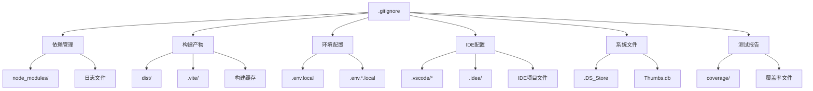
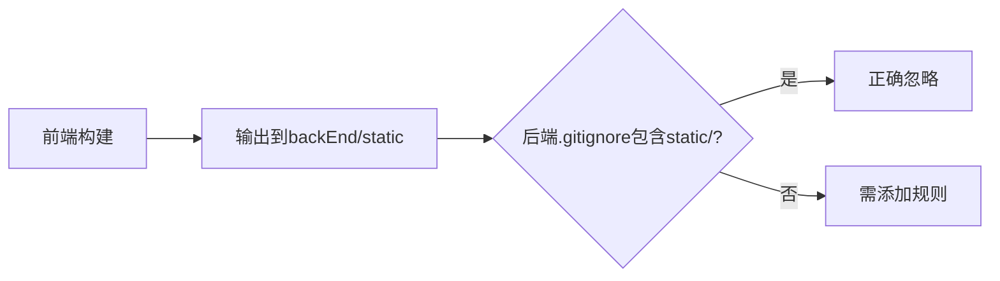

# 前端Git忽略文件配置设计

## 1. 概述

为前端项目（`src/frontEnd`）配置Git忽略文件（`.gitignore`），确保版本控制系统仅跟踪源代码和必要的配置文件，排除构建产物、依赖包、自动生成文件、IDE配置、操作系统文件及敏感信息。

### 核心目标

- **减少仓库体积**：排除node_modules等大型依赖目录
- **保护敏感信息**：忽略本地环境变量覆盖文件和API密钥
- **避免冲突**：排除自动生成的类型声明文件和构建缓存
- **提升协作效率**：忽略IDE和操作系统特定配置

## 2. 技术栈识别

基于项目分析，前端使用以下技术栈：

| 技术类别 | 具体技术 | 版本信息 |
|---------|---------|---------|
| 前端框架 | Vue 3 | ^3.5.22 |
| 构建工具 | Vite | ^7.1.7 |
| 类型系统 | TypeScript | ~5.9.3 |
| 包管理器 | pnpm | (通过pnpm-lock.yaml识别) |
| UI框架 | PrimeVue | ^4.4.1 |
| 状态管理 | Pinia | ^3.0.3 |
| 样式处理 | Sass/SCSS | ^1.93.2 |
| 自动化插件 | unplugin-auto-import, unplugin-vue-components | - |

## 3. 忽略规则分类设计

### 3.1 依赖与包管理

**策略说明**：
- 忽略所有包管理器下载的依赖包目录
- 保留锁文件（`pnpm-lock.yaml`）以确保依赖版本一致性
- 忽略包管理器的日志和调试文件

**忽略项**：

| 忽略模式 | 说明 | 影响范围 |
|---------|------|---------|
| `node_modules/` | npm/pnpm依赖包目录 | 所有子目录 |
| `pnpm-debug.log*` | pnpm调试日志 | 所有pnpm错误日志 |
| `npm-debug.log*` | npm调试日志（兼容性） | npm错误日志 |
| `yarn-debug.log*` | yarn调试日志（兼容性） | yarn错误日志 |
| `yarn-error.log*` | yarn错误日志（兼容性） | yarn错误日志 |

### 3.2 构建产物与缓存

**策略说明**：
- 忽略Vite构建生成的静态资源（已配置输出到`../backEnd/static`）
- 忽略TypeScript编译缓存
- 忽略Vite开发服务器缓存

**忽略项**：

| 忽略模式 | 说明 | 生成来源 |
|---------|------|---------|
| `dist/` | Vite默认构建输出目录 | vite build |
| `dist-ssr/` | SSR构建输出目录（预留） | vite build --ssr |
| `.vite/` | Vite开发服务器缓存 | vite dev |
| `*.local` | 本地构建产物 | 手动构建 |
| `*.tsbuildinfo` | TypeScript增量编译缓存 | vue-tsc |

**注意事项**：
虽然项目配置输出目录为`../backEnd/static`，但保留对`dist/`的忽略规则以适应配置变更场景。

### 3.3 自动生成的类型声明文件

**策略说明**：
项目使用unplugin-auto-import和unplugin-vue-components自动生成类型声明，这些文件应纳入版本控制以确保团队开发时类型提示一致。

**不忽略的文件**：
- `src/auto-imports.d.ts`（自动导入的Vue API类型声明）
- `src/components.d.ts`（自动注册的组件类型声明）

**忽略策略**：
不在.gitignore中排除这些文件，允许其纳入版本控制。

### 3.4 环境变量与敏感配置

**策略说明**：
- 保留环境变量模板文件（`.env.development`、`.env.production`）
- 忽略本地环境变量覆盖文件（`.env.local`、`.env.*.local`）
- 避免提交包含真实API密钥或敏感URL的配置

**忽略项**：

| 忽略模式 | 说明 | 用途 |
|---------|------|------|
| `.env.local` | 所有环境下的本地覆盖 | 开发者个人配置 |
| `.env.*.local` | 特定环境的本地覆盖 | 如.env.development.local |

**保留的文件**：
- `.env.development`（开发环境模板）
- `.env.production`（生产环境模板）

### 3.5 编辑器与IDE配置

**策略说明**：
- 忽略常见IDE的项目配置目录
- 保留团队共享的IDE配置（如果存在）

**忽略项**：

| 忽略模式 | 说明 | IDE类型 |
|---------|------|---------|
| `.vscode/*` | VS Code配置目录 | Visual Studio Code |
| `!.vscode/extensions.json` | 保留推荐扩展配置 | VS Code |
| `.idea/` | JetBrains IDE配置 | WebStorm/IntelliJ IDEA |
| `*.suo` | Visual Studio解决方案用户选项 | Visual Studio |
| `*.ntvs*` | Node.js Tools for Visual Studio | Visual Studio |
| `*.njsproj` | Node.js项目文件 | Visual Studio |
| `*.sln` | Visual Studio解决方案文件 | Visual Studio |
| `*.sw?` | Vim交换文件 | Vim/NeoVim |

**例外规则**：
保留`.vscode/extensions.json`以推荐团队统一使用的VS Code扩展（如Volar、TypeScript Vue Plugin）。

### 3.6 操作系统临时文件

**策略说明**：
忽略不同操作系统自动生成的元数据和缩略图文件。

**忽略项**：

| 忽略模式 | 说明 | 操作系统 |
|---------|------|---------|
| `.DS_Store` | 目录元数据 | macOS |
| `Thumbs.db` | 缩略图缓存 | Windows |
| `Desktop.ini` | 文件夹配置 | Windows |

### 3.7 测试与覆盖率报告

**策略说明**：
虽然当前项目未配置测试框架，但预留测试相关的忽略规则以支持未来扩展。

**忽略项**：

| 忽略模式 | 说明 | 工具 |
|---------|------|------|
| `coverage/` | 测试覆盖率报告 | Jest/Vitest |
| `*.lcov` | 覆盖率数据文件 | Istanbul |
| `.nyc_output/` | NYC覆盖率工具输出 | NYC |

## 4. 完整忽略规则层次结构



## 5. 忽略规则表

### 完整规则清单

| 分类 | 规则模式 | 优先级 | 说明 |
|-----|---------|--------|------|
| 依赖 | `node_modules/` | 高 | 依赖包目录 |
| 依赖 | `pnpm-debug.log*` | 中 | pnpm日志 |
| 依赖 | `npm-debug.log*` | 中 | npm日志 |
| 依赖 | `yarn-debug.log*` | 低 | yarn日志（兼容） |
| 依赖 | `yarn-error.log*` | 低 | yarn错误（兼容） |
| 构建 | `dist/` | 高 | 构建输出 |
| 构建 | `dist-ssr/` | 中 | SSR构建输出 |
| 构建 | `.vite/` | 高 | Vite缓存 |
| 构建 | `*.local` | 中 | 本地构建 |
| 构建 | `*.tsbuildinfo` | 中 | TS编译缓存 |
| 环境 | `.env.local` | 高 | 本地环境变量 |
| 环境 | `.env.*.local` | 高 | 特定环境本地配置 |
| IDE | `.vscode/*` | 中 | VS Code配置 |
| IDE | `!.vscode/extensions.json` | 高 | 保留扩展推荐 |
| IDE | `.idea/` | 中 | JetBrains配置 |
| IDE | `*.suo` | 低 | VS用户选项 |
| IDE | `*.ntvs*` | 低 | NTVS配置 |
| IDE | `*.njsproj` | 低 | Node.js项目 |
| IDE | `*.sln` | 低 | VS解决方案 |
| IDE | `*.sw?` | 低 | Vim交换文件 |
| 系统 | `.DS_Store` | 中 | macOS元数据 |
| 系统 | `Thumbs.db` | 中 | Windows缩略图 |
| 系统 | `Desktop.ini` | 中 | Windows配置 |
| 测试 | `coverage/` | 中 | 覆盖率报告 |
| 测试 | `*.lcov` | 中 | 覆盖率数据 |
| 测试 | `.nyc_output/` | 低 | NYC输出 |

## 6. 特殊场景处理

### 6.1 类型声明文件策略

**决策**：纳入版本控制

**原因**：
- `auto-imports.d.ts`和`components.d.ts`提供IDE类型提示
- 确保团队成员无需本地生成即可获得类型支持
- 文件体积小，变更频率低

### 6.2 构建输出目录策略

**项目配置**：
- Vite构建输出目录：`../backEnd/static`
- 构建前清空目录：`emptyOutDir: true`

**忽略策略**：
- 前端`.gitignore`中保留`dist/`规则（防御性配置）
- 后端`.gitignore`需忽略`static/`目录（由后端设计处理）

### 6.3 环境变量文件策略

**当前配置分析**：

| 文件 | 包含内容 | 是否敏感 | 版本控制 |
|-----|---------|---------|---------|
| `.env.development` | 开发环境模板配置 | 否 | 纳入 |
| `.env.production` | 生产环境模板配置 | 否 | 纳入 |
| `.env.local` | 本地覆盖配置 | 可能 | 忽略 |
| `.env.*.local` | 特定环境本地配置 | 可能 | 忽略 |

**最佳实践**：
- 模板文件使用占位符或默认值
- 真实配置通过`.local`文件覆盖
- 生产环境通过CI/CD注入环境变量

## 7. 与项目整体Git策略的协调

### 7.1 多级.gitignore配置

**项目结构**：
```
sqlmapWebUI/
├── .gitignore (根目录)
├── src/
│   ├── backEnd/
│   │   └── .gitignore (后端专用)
│   └── frontEnd/
│       └── .gitignore (前端专用)
```

**协调原则**：
- 根目录.gitignore：忽略IDE和系统级文件
- 前端.gitignore：忽略Node.js和前端构建相关
- 后端.gitignore：忽略Python和后端运行时相关

### 7.2 构建产物跨目录处理

**场景**：
前端构建输出到`src/backEnd/static`，需确保该目录被后端`.gitignore`忽略，避免双重配置。

**验证流程**：


## 8. 验证与维护

### 8.1 配置验证方法

**验证清单**：

| 验证项 | 验证命令 | 期望结果 |
|-------|---------|---------|
| node_modules被忽略 | `git check-ignore -v node_modules` | 匹配.gitignore规则 |
| .env.local被忽略 | `git check-ignore -v .env.local` | 匹配.gitignore规则 |
| .env.development未忽略 | `git check-ignore .env.development` | 无输出（未被忽略） |
| auto-imports.d.ts未忽略 | `git check-ignore src/auto-imports.d.ts` | 无输出 |
| .vite目录被忽略 | `git check-ignore -v .vite` | 匹配.gitignore规则 |

### 8.2 常见问题处理

**问题1：已提交的node_modules**
- 现象：历史提交包含node_modules
- 处理：使用`git rm -r --cached node_modules`从索引移除
- 预防：团队培训，强调初始化时配置.gitignore

**问题2：自动生成文件冲突**
- 现象：auto-imports.d.ts频繁冲突
- 处理：团队统一执行`pnpm install`生成一致的类型声明
- 预防：纳入版本控制，减少自动生成差异

**问题3：构建产物意外提交**
- 现象：dist目录或static目录被提交
- 处理：检查.gitignore配置，确认规则生效
- 预防：pre-commit钩子检测大文件

### 8.3 维护策略

**定期审查**：
- 新增依赖工具时检查是否需要新的忽略规则
- 每季度审查未追踪文件：`git status --ignored`
- 版本升级后验证构建产物路径变更

**文档同步**：
- 在项目README中说明环境变量配置流程
- 团队Wiki记录.gitignore设计决策

## 9. 安全考虑

### 9.1 敏感信息防护

**防护层级**：

| 层级 | 防护措施 | 覆盖范围 |
|-----|---------|---------|
| 一级 | .gitignore忽略.env.local | 开发环境 |
| 二级 | 环境变量注入（CI/CD） | 生产环境 |
| 三级 | 代码审查（pre-commit） | 所有提交 |

**敏感文件模式**：
- 包含真实API密钥的配置文件
- 包含数据库凭证的本地配置
- 包含第三方服务Token的文件

### 9.2 防护清单

**必须忽略的敏感模式**：

| 文件模式 | 风险级别 | 说明 |
|---------|---------|------|
| `*.key` | 高 | 私钥文件 |
| `*.pem` | 高 | 证书文件 |
| `.env.local` | 中 | 本地环境变量 |
| `*.local` | 中 | 本地配置 |
| `secrets.*` | 高 | 明确的秘密文件 |

**建议措施**：
- 使用git-secrets或类似工具扫描敏感信息
- 配置pre-commit钩子拦截敏感模式
- 定期审计仓库历史记录

## 10. 文件结构规范

### 10.1 规则组织顺序

**标准顺序**（自上而下）：
1. 依赖管理相关
2. 构建产物与缓存
3. 环境变量配置
4. 编辑器与IDE
5. 操作系统文件
6. 测试与覆盖率
7. 其他临时文件

**分隔符使用**：
- 使用注释行分隔不同类别
- 每个类别添加简要说明

### 10.2 注释规范

**注释格式**：
```
# ====================
# 依赖管理
# ====================
```

**注释原则**：
- 每个分类添加标题注释
- 复杂规则添加行内注释说明用途
- 例外规则（`!`开头）必须注释原因
