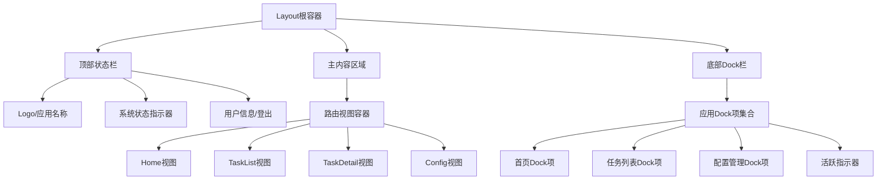
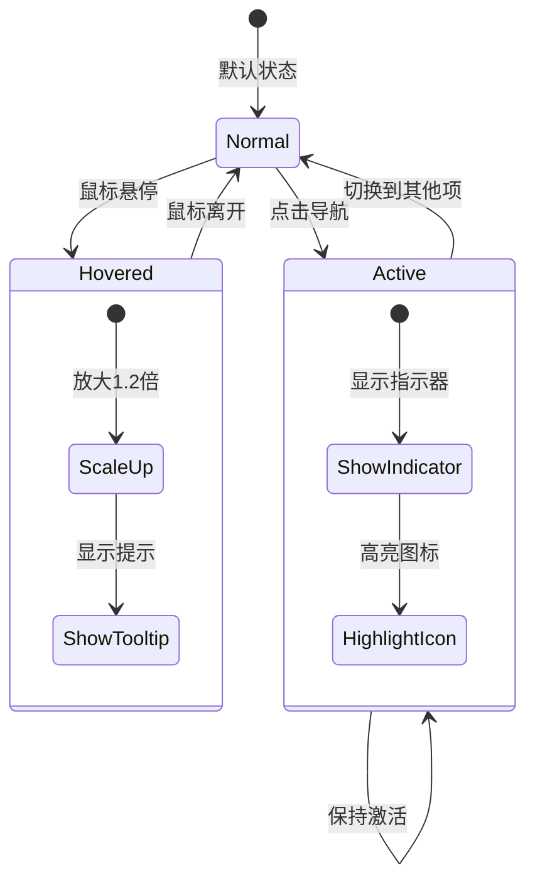
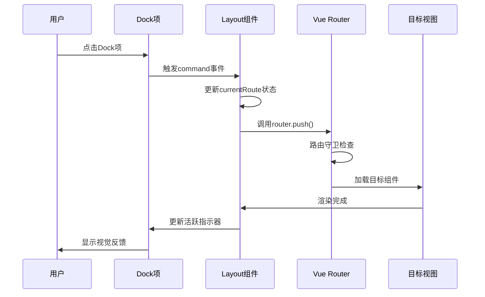
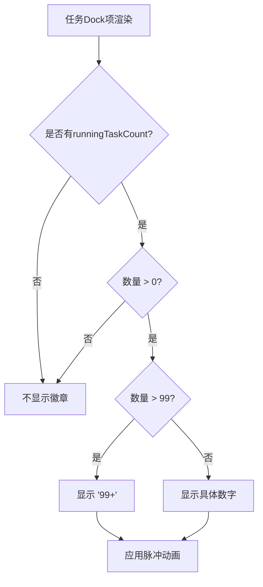

# 前端UI布局调整设计文档

## 1. 概述

### 1.1 设计目标
将当前SqlmapWebUI前端应用的传统上下+左右布局改造为类似macOS桌面的Dock风格布局，提升用户体验和界面美观度。

### 1.2 核心价值
- **现代化体验**：采用macOS风格的Dock导航，提供流畅、直观的操作体验
- **空间优化**：底部Dock布局充分释放垂直空间，内容区域更宽广
- **视觉一致性**：统一使用PrimeVue组件库，确保UI风格协调
- **交互优化**：悬停放大、活跃指示等动效增强交互反馈

### 1.3 设计范围
- Layout组件重构为Dock风格布局
- 顶部状态栏设计
- 底部Dock导航栏设计
- 路由视图容器调整
- 响应式适配策略

---

## 2. 技术栈与依赖

### 2.1 当前技术栈
| 技术 | 版本 | 用途 |
|------|------|------|
| Vue | 3.5.22 | 前端框架 |
| Vue Router | 4.6.3 | 路由管理 |
| PrimeVue | 4.4.1 | UI组件库 |
| PrimeIcons | 7.0.0 | 图标库 |
| TypeScript | 5.9.3 | 类型系统 |
| Pinia | 3.0.3 | 状态管理 |

### 2.2 需使用的PrimeVue组件
| 组件 | 用途 |
|------|------|
| Button | Dock导航按钮 |
| Badge | 任务数量提示 |
| Avatar | 用户头像显示 |
| OverlayPanel | Dock项悬停信息面板 |
| Tooltip | 简单提示信息 |

---

## 3. 布局架构设计

### 3.1 整体布局结构



### 3.2 布局层级关系

| 层级 | 区域名称 | 高度/宽度 | 定位方式 | z-index |
|------|----------|-----------|----------|---------|
| 顶层 | 顶部状态栏 | 56px | fixed top | 1000 |
| 中层 | 主内容区域 | calc(100vh - 136px) | relative | auto |
| 底层 | Dock栏 | 80px | fixed bottom | 1000 |

---

## 4. 组件架构设计

### 4.1 Layout组件重构

#### 4.1.1 组件职责
- 管理整体布局结构
- 控制Dock导航状态
- 处理路由跳转逻辑
- 维护当前活跃路由

#### 4.1.2 组件数据模型

| 数据项 | 类型 | 说明 | 初始值 |
|--------|------|------|--------|
| currentRoute | String | 当前激活路由路径 | '/home' |
| dockItems | Array<DockItem> | Dock导航项配置 | 见下表 |
| hoveredItem | String/null | 当前悬停项标识 | null |
| userMenuVisible | Boolean | 用户菜单显示状态 | false |

#### 4.1.3 DockItem数据结构

| 字段 | 类型 | 说明 | 示例 |
|------|------|------|------|
| id | String | 唯一标识符 | 'home' |
| label | String | 显示文本 | '首页' |
| icon | String | PrimeIcons图标类名 | 'pi pi-home' |
| route | String | 路由路径 | '/home' |
| badge | Number/null | 徽章数字 | null |
| badgeVariant | String | 徽章样式变体 | 'danger' |

#### 4.1.4 Dock导航项配置

| 项目 | 标签 | 图标 | 路由 | 徽章逻辑 |
|------|------|------|------|----------|
| 首页 | 首页 | pi-home | /home | 无 |
| 任务列表 | 任务 | pi-list | /tasks | 运行中任务数量 |
| 配置管理 | 配置 | pi-cog | /config | 无 |

### 4.2 状态栏组件设计

#### 4.2.1 左侧区域
- **Logo图标**：使用PrimeVue Avatar组件展示应用图标
- **应用名称**：SqlmapWebUI文本标识

#### 4.2.2 右侧区域
- **模式标签**：本地模式/远程模式指示器（使用Badge组件）
- **用户信息**：用户名称显示
- **登出按钮**：使用PrimeVue Button组件（仅非本地模式显示）

### 4.3 Dock栏组件设计

#### 4.3.1 容器特性
- **视觉效果**：毛玻璃背景（backdrop-filter）、圆角、阴影
- **定位方式**：固定在视口底部，水平居中
- **尺寸规格**：宽度自适应内容，最大宽度600px，高度80px
- **边距控制**：底部距视口20px

#### 4.3.2 Dock项交互效果



#### 4.3.3 Dock项视觉规范

| 状态 | 尺寸 | 背景色 | 图标颜色 | 特殊效果 |
|------|------|--------|----------|----------|
| 正常 | 56x56px | 透明 | #6c757d | 无 |
| 悬停 | 64x64px | rgba(255,255,255,0.1) | #3B82F6 | 平滑缩放动画0.2s |
| 激活 | 56x56px | rgba(59,130,246,0.15) | #3B82F6 | 底部指示器条 |

#### 4.3.4 活跃指示器设计
- **形状**：圆角矩形条
- **尺寸**：宽度32px，高度4px
- **位置**：Dock项底部下方8px
- **颜色**：主题色#3B82F6
- **动画**：激活时从底部淡入滑入，0.3s缓动

---

## 5. 路由与导航设计

### 5.1 路由结构保持不变

当前路由配置维持现有结构，仅调整Layout组件内部布局：

```mermaid
graph LR
    A[/] --> B[Layout]
    B --> C[/home - 首页]
    B --> D[/tasks - 任务列表]
    B --> E[/tasks/:id - 任务详情]
    B --> F[/config - 配置管理]
    G[/login] --> H[Login组件]
```

### 5.2 导航交互流程



### 5.3 路由切换状态管理

| 操作 | 状态更新 | UI反馈 |
|------|----------|--------|
| 点击Dock项 | currentRoute更新为目标路由 | 活跃指示器移动到目标项 |
| 浏览器前进/后退 | 监听route.path变化同步currentRoute | 活跃指示器自动跟随 |
| 直接URL访问 | onMounted时初始化currentRoute | 正确显示当前路由的活跃状态 |

---

## 6. 样式与动画设计

### 6.1 全局样式调整

#### 6.1.1 主内容区域
- **背景色**：渐变背景（从#f8f9fa到#e9ecef）
- **内边距**：上56px（状态栏高度） + 24px，下80px（Dock高度） + 24px，左右24px
- **最小高度**：确保内容撑满视口

#### 6.1.2 Dock容器样式特性
| 属性 | 值 | 说明 |
|------|-----|------|
| background | rgba(255,255,255,0.8) | 半透明白色背景 |
| backdrop-filter | blur(10px) | 背景模糊效果 |
| border-radius | 16px | 圆角 |
| box-shadow | 0 8px 32px rgba(0,0,0,0.1) | 浮起阴影 |
| padding | 12px 16px | 内边距 |

### 6.2 动画效果规范

#### 6.2.1 Dock项悬停动画
```
过渡属性：transform, background-color, color
持续时间：0.2s
缓动函数：cubic-bezier(0.4, 0, 0.2, 1)
变换：scale(1.15)
```

#### 6.2.2 活跃指示器动画
```
过渡属性：transform, opacity
持续时间：0.3s
缓动函数：ease-in-out
初始状态：opacity 0, translateY(4px)
激活状态：opacity 1, translateY(0)
```

#### 6.2.3 徽章脉冲动画（有新任务时）
```
关键帧动画：
0% → scale(1)
50% → scale(1.1)
100% → scale(1)
持续时间：1.5s
循环方式：infinite
```

---

## 7. 响应式适配策略

### 7.1 断点设计

| 断点 | 屏幕宽度 | 布局调整策略 |
|------|----------|--------------|
| 移动端 | < 768px | Dock项缩小至48px，间距减小，文字隐藏仅显示图标 |
| 平板 | 768px - 1024px | Dock项正常尺寸，内容区适当减少内边距 |
| 桌面 | > 1024px | 完整Dock效果，内容区宽松布局 |

### 7.2 移动端优化

#### 7.2.1 Dock调整
- 高度减小至64px
- Dock项尺寸减小至48x48px
- 悬停效果改为点击触发
- Tooltip改为长按显示

#### 7.2.2 状态栏调整
- 高度减小至48px
- Logo和应用名称合并显示
- 用户信息简化为头像

---

## 8. 状态管理集成

### 8.1 与Pinia Store交互

#### 8.1.1 需要的Store数据
| Store | 数据项 | 用途 |
|-------|--------|------|
| authStore | isLocalMode | 判断是否本地模式 |
| authStore | userName | 显示用户名称 |
| authStore | logout() | 登出方法 |
| taskStore（如有） | runningTaskCount | 任务列表徽章数量 |

#### 8.1.2 数据流向

```mermaid
graph LR
    A[authStore] -->|isLocalMode| B[状态栏模式标签]
    A -->|userName| C[状态栏用户信息]
    D[taskStore] -->|runningTaskCount| E[任务Dock项徽章]
    B --> F[Layout组件]
    C --> F
    E --> F
    F -->|logout()| A
```

---

## 9. 交互细节设计

### 9.1 Dock项交互规范

| 交互类型 | 触发条件 | 响应行为 | 持续时间 |
|----------|----------|----------|----------|
| 悬停 | 鼠标移入Dock项 | 图标放大、背景色变化、显示Tooltip | 立即响应 |
| 离开 | 鼠标移出Dock项 | 恢复原尺寸、背景透明、隐藏Tooltip | 0.2s |
| 点击 | 单击Dock项 | 路由跳转、活跃指示器移动 | 0.3s |
| 长按（移动端） | 按住Dock项>500ms | 显示详细提示信息 | 500ms后 |

### 9.2 徽章显示逻辑



### 9.3 Tooltip显示策略

| 场景 | 显示内容 | 显示位置 | 延迟时间 |
|------|----------|----------|----------|
| Dock项悬停 | 功能名称（如"首页"） | Dock项上方8px | 300ms |
| 有徽章时 | 功能名称 + 数量说明（如"任务 - 3个运行中"） | Dock项上方8px | 300ms |
| 移动端 | 不使用Tooltip，改用长按触发OverlayPanel | - | - |

---

## 10. 可访问性设计

### 10.1 键盘导航支持

| 操作 | 键盘快捷键 | 行为 |
|------|------------|------|
| 聚焦Dock项 | Tab / Shift+Tab | 在Dock项间循环切换焦点 |
| 激活Dock项 | Enter / Space | 触发当前焦点项的路由跳转 |
| 快速导航 | Alt+1/2/3 | 直接跳转到第1/2/3个Dock项 |

### 10.2 ARIA属性配置

| 元素 | ARIA属性 | 值示例 |
|------|----------|--------|
| Dock容器 | role | "navigation" |
| Dock容器 | aria-label | "主导航栏" |
| Dock项按钮 | role | "button" |
| Dock项按钮 | aria-label | "首页导航" |
| Dock项按钮 | aria-current | "page"（激活时） |
| 徽章 | aria-label | "3个运行中的任务" |

### 10.3 焦点可见性
- 所有可交互元素具有清晰的焦点指示器
- 焦点指示器样式：2px实线边框，颜色#3B82F6
- 焦点指示器偏移：外边距2px

---

## 11. 性能优化考虑

### 11.1 动画性能优化
- 使用transform和opacity属性实现动画（GPU加速）
- 避免使用影响布局的属性（width、height、margin）
- 为动画元素添加will-change提示（谨慎使用）

### 11.2 组件渲染优化
| 优化点 | 策略 | 预期效果 |
|--------|------|----------|
| Dock项状态计算 | 使用computed缓存活跃状态判断 | 减少重复计算 |
| 徽章数据 | 仅在数据变化时触发重渲染 | 避免无效更新 |
| 悬停状态 | 使用局部状态管理hoveredItem | 隔离组件更新范围 |
| 路由监听 | 使用watch监听route.path而非整个route对象 | 减少深度监听开销 |

---

## 12. 测试策略

### 12.1 单元测试重点

| 测试场景 | 测试目标 | 验证点 |
|----------|----------|--------|
| Dock项点击 | 路由跳转逻辑 | router.push被正确调用，参数正确 |
| 活跃状态计算 | currentRoute与route.path匹配 | 活跃指示器显示在正确位置 |
| 徽章显示 | 数量渲染逻辑 | 0不显示，1-99显示数字，>99显示'99+' |
| 登出功能 | authStore.logout调用 | 方法被调用且跳转到登录页 |

### 12.2 集成测试重点

| 测试场景 | 操作流程 | 预期结果 |
|----------|----------|----------|
| 完整导航流程 | 点击Dock项 → 路由跳转 → 视图加载 | 正确显示目标页面，活跃指示器更新 |
| 浏览器导航 | 使用浏览器前进/后退 | 活跃指示器自动同步当前路由 |
| 权限控制 | 未登录访问 → 重定向到登录 | 路由守卫正常工作 |

### 12.3 视觉回归测试

| 测试项 | 测试设备/分辨率 | 关键检查点 |
|--------|-----------------|------------|
| Dock布局 | 1920x1080桌面 | Dock居中对齐，间距均匀 |
| 响应式布局 | 375x667移动端 | Dock项自适应缩小，功能完整 |
| 动画流畅度 | 所有设备 | 60fps无卡顿，过渡自然 |
| 毛玻璃效果 | 支持backdrop-filter的浏览器 | 背景模糊效果正确显示 |

---

## 13. 兼容性考虑

### 13.1 浏览器兼容性

| 浏览器 | 最低版本 | 特殊处理 |
|--------|----------|----------|
| Chrome | 88+ | 完整支持 |
| Firefox | 85+ | 完整支持 |
| Safari | 14+ | 需添加-webkit-前缀（backdrop-filter） |
| Edge | 88+ | 完整支持 |

### 13.2 降级方案

| 功能 | 不支持时的降级策略 |
|------|-------------------|
| backdrop-filter | 使用纯色半透明背景替代 |
| CSS动画 | 移除动画效果，保持基础功能 |
| Flexbox gap | 使用margin替代 |

---

## 14. 实施影响范围

### 14.1 需要修改的文件

| 文件路径 | 修改类型 | 修改内容概述 |
|----------|----------|--------------|
| src/views/Layout.vue | 重构 | 完全重写模板和样式，调整脚本逻辑 |
| src/App.vue | 微调 | 可能需要调整全局样式 |
| src/assets/styles/*.scss | 新增/修改 | 添加Dock相关全局样式变量 |

### 14.2 不受影响的部分
- 路由配置（router/index.ts）保持不变
- 所有页面视图组件（Home、TaskList等）无需修改
- Store状态管理逻辑无需变更
- API调用层完全不受影响

---

## 15. 后续优化方向

### 15.1 高级交互特性
- **Dock项拖拽排序**：允许用户自定义Dock项顺序
- **收藏/固定功能**：支持将常用功能固定到Dock
- **最近使用列表**：Dock右侧显示最近访问的任务

### 15.2 视觉增强
- **主题切换**：支持浅色/深色Dock主题
- **自定义图标**：允许用户上传自定义Dock图标
- **磁吸效果**：鼠标靠近时Dock项产生放大磁吸动画（高级macOS效果）

### 15.3 功能扩展
- **Dock右键菜单**：提供快捷操作入口
- **通知中心集成**：在Dock添加通知图标并显示未读数
- **全局搜索**：在Dock添加搜索入口，快速访问任务

