# 前端主页统计扩展与用户体验优化设计

## 概述

本设计针对sqlmapWebUI前端界面进行功能扩展和用户体验优化，重点解决以下问题：
1. 主页统计数据不完整，缺少注入状态分类统计
2. 数据展示区域空间利用率低
3. 任务列表缺少搜索过滤和排序功能
4. 任务详情页功能缺失
5. 前端界面美化需求

## 技术栈

| 技术 | 说明 |
|------|------|
| Vue 3 | 前端框架，采用Composition API |
| PrimeVue | UI组件库，提供丰富的表格、卡片、输入控件 |
| TypeScript | 类型安全的开发语言 |
| Pinia | 状态管理 |
| Vue Router | 路由管理 |
| SCSS | 样式预处理器 |

## 架构概述

### 组件层级关系


### 数据流向


## 功能设计

### 1. 主页统计数据扩展

#### 1.1 扩展统计指标

在原有的总任务数、运行中、已完成基础上，新增以下统计维度：

| 统计项 | 说明 | 计算规则 |
|--------|------|----------|
| 可注入任务数 | 检测到SQL注入漏洞的任务 | 统计`injected=true`的任务 |
| 不可注入任务数 | 未检测到注入的已完成任务 | 统计`injected=false`且状态为已完成的任务 |
| 等待中任务数 | 排队等待执行的任务 | 统计状态为`PENDING`的任务 |
| 失败任务数 | 执行失败的任务 | 统计状态为`FAILED`的任务 |
| 已停止任务数 | 手动停止的任务 | 统计状态为`STOPPED`的任务 |
| 已终止任务数 | 已结束的任务 | 统计状态为`TERMINATED`的任务 |

#### 1.2 统计卡片布局优化

采用分类分组的响应式网格布局，按业务逻辑分为两大类：


**分类说明**：

| 分类 | 包含指标 | 业务含义 |
|------|----------|----------|
| 任务状态类 | 总任务数、运行中、等待中、已完成、失败、已停止、已终止 | 反映任务执行状态 |
| 注入结果类 | 可注入、不可注入 | 反映安全检测结果 |

**布局规格**：
- 任务状态类：采用网格布局，4列（≥1200px）/ 3列（768px-1199px）/ 2列（<768px）
- 注入结果类：独立分组，2列等宽布局
- 分组间距：32px
- 卡片间距：16px
- 容器最大宽度：1600px（替换原1200px）
- 内边距：24px

#### 1.3 数据模型扩展

前端统计数据结构：

| 字段名 | 类型 | 说明 |
|--------|------|------|
| total | number | 总任务数 |
| running | number | 运行中任务数 |
| success | number | 已完成任务数 |
| injectable | number | 可注入任务数 |
| nonInjectable | number | 不可注入任务数 |
| pending | number | 等待中任务数 |
| failed | number | 失败任务数 |
| stopped | number | 已停止任务数 |
| terminated | number | 已终止任务数 |

### 2. 任务列表搜索过滤功能

#### 2.1 搜索过滤器设计

在任务列表顶部添加综合搜索过滤面板，包含以下控件：

| 控件类型 | 功能 | 输入参数 |
|----------|------|----------|
| 文本输入框 | 搜索URL关键字 | 支持模糊匹配 |
| 文本输入框 | 搜索报文关键字 | 搜索headers和body |
| 下拉选择器 | 按状态筛选 | 所有状态/运行中/已完成等 |
| 日期范围选择器 | 按创建时间筛选 | 起始和结束时间 |
| 复选框 | 仅显示可注入 | 过滤injected=true |
| 重置按钮 | 清空所有过滤条件 | - |

#### 2.2 过滤逻辑流程


#### 2.3 搜索报文关键字实现策略

报文关键字搜索需要综合检索以下数据：

| 搜索范围 | 数据来源 | 匹配规则 |
|----------|----------|----------|
| 请求头 | Task.headers数组 | 遍历所有header字符串 |
| 请求体 | Task.body字符串 | 直接字符串匹配 |
| 主机名 | Task.host字符串 | 精确或模糊匹配 |

由于后端已提供`/api/chrome/admin/task/findByHeaderKeyWord`和`/api/chrome/admin/task/findByBodyKeyWord`接口，前端可选择：
- 方案A：本地过滤（从Store中过滤）- 适合数据量小
- 方案B：服务端过滤（调用后端API）- 适合数据量大

**推荐方案**：优先使用本地过滤，当任务数超过500时切换到服务端过滤

### 3. 任务列表排序功能

#### 3.1 可排序字段

| 字段 | 排序规则 | 默认方向 |
|------|----------|----------|
| 创建时间 | 时间戳比较 | 降序（最新在前） |
| 任务ID | 字符串字典序 | 升序 |
| 状态 | 状态枚举值 | 自定义顺序 |
| URL长度 | 字符串长度 | 降序 |
| 错误数量 | 数值比较 | 降序 |
| 日志数量 | 数值比较 | 降序 |

#### 3.2 状态排序优先级

状态排序优先级定义（从高到低）：


#### 3.3 排序交互设计

- 点击列头触发排序
- 首次点击：升序
- 再次点击：降序
- 第三次点击：恢复默认排序
- 显示排序指示图标（↑↓）

### 4. 任务列表批量操作功能

#### 4.1 多选功能设计

在任务列表表格中添加复选框列，支持多选任务:


**多选列规格**：

| 属性 | 设置 |
|------|------|
| 位置 | 表格最左侧 |
| 宽度 | 60px（固定） |
| 表头 | 复选框（全选/取消全选） |
| 行单元格 | 复选框（单选/取消） |
| 冻结 | 是（滚动时固定） |

#### 4.2 选中状态管理


**表头复选框状态**：

| 状态 | 显示 | 说明 |
|------|------|------|
| 未选中 | 空复选框 | 没有任务被选中 |
| 部分选中 | 半选复选框（-） | 部分任务被选中 |
| 全部选中 | 全选复选框（✓） | 所有任务被选中 |

#### 4.3 批量操作按钮栏

当有任务被选中时，在表格头部显示批量操作栏：


**按钮栏布局**：

| 元素 | 位置 | 样式 |
|------|------|------|
| 选中数量提示 | 左侧 | 蓝色文本，如"已选择 5 项" |
| 删除选中按钮 | 中间 | 危险按钮（红色） |
| 删除全部按钮 | 中间 | 危险按钮（深红色） |
| 取消选择按钮 | 右侧 | 次要按钮 |

#### 4.4 删除选中任务功能

删除当前选中的任务：

```mermaid
sequenceDiagram
    participant U as 用户
    participant B as 删除选中按钮
    participant D as 确认对话框
    participant C as 任务列表组件
    participant S as TaskStore
    participant A as API
    participant T as Toast提示

    U->>B: 点击删除选中
    B->>D: 显示确认对话框
    D-->>U: 显示警告信息
    
    alt 用户确认
        U->>D: 点击确认
        D->>C: 触发删除操作
        C->>S: batchDeleteTasks(selectedIds)
        
        loop 遍历选中任务
            S->>A: DELETE /task/delete?taskId=xxx
            A-->>S: 返回结果
        end
        
        S->>S: 更新任务列表
        S-->>C: 通知删除完成
        C->>C: 清空选中状态
        C->>T: 显示成功提示
        T-->>U: "已删除 X 个任务"
    else 用户取消
        U->>D: 点击取消
        D-->>U: 关闭对话框
    end
```



**确认对话框内容**：

| 元素 | 内容 |
|------|------|
| 标题 | 确认删除 |
| 图标 | 警告图标（黄色） |
| 消息 | 确定要删除选中的 {count} 个任务吗？此操作不可恢复。 |
| 确认按钮 | 删除（红色） |
| 取消按钮 | 取消（灰色） |

#### 4.5 删除全部任务功能

删除所有任务（危险操作）：


**危险确认对话框内容**：

| 元素 | 内容 |
|------|------|
| 标题 | 危险操作！删除所有任务 |
| 图标 | 危险图标（红色） |
| 警告消息 | 这将删除系统中的所有 {total} 个任务，包括正在运行的任务！ |
| 警告继续 | 此操作不可恢复，所有扫描结果和日志将永久丢失！ |
| 二次确认输入 | 请输入"删除全部"以确认此操作 |
| 确认按钮 | 确认删除（红色，默认禁用） |
| 取消按钮 | 取消（灰色） |

#### 4.6 批量操作限制

为保证系统稳定性，对批量操作进行限制：

| 限制项 | 规则 | 说明 |
|--------|------|------|
| 运行中任务保护 | 不允许删除 | 运行中的任务不能被选中删除 |
| 单次删除数量 | 最多100个 | 超过100个需分批删除 |
| 删除频率 | 5秒间隔 | 防止频繁操作 |
| 删除全部 | 必须二次确认 | 需输入确认文本 |

**运行中任务处理逻辑**：


#### 4.7 批量操作反馈

删除操作完成后的反馈机制：

| 场景 | 提示内容 | 类型 |
|------|----------|------|
| 全部成功 | 已成功删除 {count} 个任务 | 成功（绿色） |
| 部分成功 | 已删除 {success}/{total} 个任务，{failed} 个失败 | 警告（黄色） |
| 全部失败 | 删除失败，请重试 | 错误（红色） |
| 过滤运行中 | {running} 个运行中任务已跳过 | 信息（蓝色） |

### 5. 任务详情页设计

任务详情页是查看单个任务完整信息的专用页面，包含以下模块：

#### 4.1 页面布局结构


#### 4.2 基础信息卡片

展示任务的核心元数据：

| 信息项 | 数据源 | 格式 |
|--------|--------|------|
| 任务ID | Task.taskid | 16位字符串 |
| 引擎ID | Task.engineid | 数字 |
| 扫描URL | Task.scanUrl | 完整URL，支持复制 |
| 目标主机 | Task.host | 主机名或IP |
| 任务状态 | Task.status | 彩色标签 |
| 创建时间 | Task.createTime | 格式化时间字符串 |
| 更新时间 | Task.updateTime | 格式化时间字符串 |
| 来源IP | Task.remote_addr | IP地址 |
| 注入状态 | Task.injected | 是/否标识 |

#### 4.3 扫描配置卡片

显示SQLMap扫描参数：

| 配置项 | 字段 | 说明 |
|--------|------|------|
| 检测级别 | options.level | 1-5级别 |
| 风险级别 | options.risk | 1-3级别 |
| 注入技术 | options.technique | BEUSTQ |
| 数据库类型 | options.dbms | MySQL/MSSQL等 |
| 线程数 | options.threads | 并发线程数 |
| 超时时间 | options.timeout | 秒 |

**数据来源**：调用后端API `/api/chrome/admin/task/getScanOptionsByTaskId`

#### 4.4 HTTP请求信息卡片

展示原始HTTP请求详情：


**数据来源**：调用后端API `/api/chrome/admin/task/getHttpRequestInfo`

#### 4.5 扫描结果卡片

展示注入点检测结果：

| 结果项 | 说明 | 数据格式 |
|--------|------|----------|
| 是否可注入 | 整体结论 | 布尔值+醒目标识 |
| 注入参数 | 可注入的参数名 | 字符串列表 |
| 注入类型 | 注入技术类型 | Boolean/Time-based等 |
| 数据库信息 | DBMS类型和版本 | 文本 |
| 载荷详情 | 成功的Payload | 表格展示 |

**载荷详情表格结构**：

| 列名 | 说明 |
|------|------|
| 序号 | 索引 |
| 状态 | 成功/失败 |
| 内容类型 | Content-Type |
| 载荷内容 | Payload字符串 |

**数据来源**：调用后端API `/api/chrome/admin/task/getPayloadDetailByTaskId`

#### 4.6 日志面板

实时显示任务执行日志：


**日志级别颜色编码**：

| 级别 | 颜色 | 含义 |
|------|------|------|
| INFO | 蓝色 | 信息 |
| DEBUG | 灰色 | 调试 |
| WARN | 橙色 | 警告 |
| ERROR | 红色 | 错误 |

**数据来源**：调用后端API `/api/chrome/admin/task/logs/getLogsByTaskId`

#### 4.7 错误记录面板

展示任务执行过程中的错误：

| 字段 | 说明 |
|------|------|
| 错误时间 | 发生时间 |
| 错误类型 | 错误分类 |
| 错误消息 | 详细描述 |
| 堆栈跟踪 | 可展开查看 |

**数据来源**：调用后端API `/api/chrome/admin/task/getErrorsByTaskId`

#### 4.8 操作按钮组

页面头部提供的操作：

| 按钮 | 功能 | 条件 |
|------|------|------|
| 返回列表 | 导航回任务列表页 | 始终显示 |
| 刷新 | 重新加载任务数据 | 始终显示 |
| 停止任务 | 停止运行中的任务 | 状态=Running |
| 删除任务 | 删除任务记录 | 状态!=Running |
| 导出报告 | 导出扫描结果 | 有扫描结果时 |

#### 4.9 页面数据加载策略


**加载优化**：
- 基础信息优先加载并显示
- 其他模块采用骨架屏占位
- 各模块数据并行请求
- 支持单独刷新某个模块

### 5. 界面美化设计

在保持现有布局不变的前提下，从以下维度优化视觉效果：

#### 5.1 色彩系统优化

**主题色调**：

| 色彩角色 | 颜色值 | 应用场景 |
|----------|--------|----------|
| 主色调 | #3B82F6 | 按钮、链接、高亮 |
| 成功色 | #10B981 | 已完成、可注入 |
| 警告色 | #F59E0B | 等待中、停止 |
| 危险色 | #EF4444 | 失败、错误、删除 |
| 信息色 | #6366F1 | 运行中、提示 |
| 中性色 | #6B7280 | 文本、边框 |
| 背景色 | #F9FAFB | 页面背景 |
| 卡片背景 | #FFFFFF | 卡片、表格 |

**渐变增强**：
- 统计卡片使用渐变背景
- 状态标签使用半透明背景+边框
- 按钮支持悬停渐变效果

#### 5.2 卡片样式优化


**卡片规格**：
- 边框圆角：8px
- 阴影：`0 2px 8px rgba(0, 0, 0, 0.08)`
- 悬停阴影：`0 4px 16px rgba(0, 0, 0, 0.12)`
- 内边距：24px
- 标题字重：600
- 过渡动画：`all 0.3s ease`

#### 5.3 数据表格美化

| 优化项 | 方案 |
|--------|------|
| 斑马纹 | 启用交替行背景色 |
| 边框 | 淡色网格线 |
| 列宽 | 自适应+最小宽度限制 |
| 响应式 | 小屏幕自动开启横向滚动 |
| 悬停效果 | 行悬停高亮 |
| 加载状态 | 骨架屏替代空白 |

#### 5.4 图标系统

采用PrimeVue内置的PrimeIcons图标库：

| 功能 | 图标 | 说明 |
|------|------|------|
| 刷新 | pi-refresh | 旋转动画 |
| 查看 | pi-eye | 查看详情 |
| 删除 | pi-trash | 危险操作 |
| 停止 | pi-stop | 停止任务 |
| 搜索 | pi-search | 搜索输入框 |
| 过滤 | pi-filter | 过滤面板 |
| 排序 | pi-sort-up/down | 排序指示 |
| 返回 | pi-arrow-left | 导航返回 |
| 复制 | pi-copy | 复制文本 |
| 下载 | pi-download | 导出报告 |

#### 5.5 排版优化

**字体规范**：

| 层级 | 字号 | 字重 | 行高 |
|------|------|------|------|
| 页面标题 | 24px | 600 | 1.4 |
| 卡片标题 | 18px | 600 | 1.5 |
| 正文 | 14px | 400 | 1.6 |
| 辅助文字 | 12px | 400 | 1.5 |
| 数据展示 | 20px | 700 | 1.3 |

**间距系统**：
- 基础间距单位：4px
- 组件间距：16px（4倍单位）
- 卡片间距：24px（6倍单位）
- 区域间距：32px（8倍单位）

#### 5.6 动画与过渡

| 场景 | 动画效果 | 持续时间 |
|------|----------|----------|
| 页面切换 | 淡入淡出 | 300ms |
| 卡片悬停 | 阴影加深+位移 | 200ms |
| 按钮点击 | 波纹效果 | 400ms |
| 数据加载 | 骨架屏闪烁 | 1500ms循环 |
| 表格行悬停 | 背景色渐变 | 150ms |
| 弹窗显示 | 缩放+淡入 | 250ms |

**过渡曲线**：
- 标准：`cubic-bezier(0.4, 0.0, 0.2, 1)`
- 加速：`cubic-bezier(0.4, 0.0, 1, 1)`
- 减速：`cubic-bezier(0.0, 0.0, 0.2, 1)`

#### 5.7 响应式设计优化

断点定义：

| 断点 | 屏幕宽度 | 布局调整 |
|------|----------|----------|
| 小屏 | <768px | 统计卡片2列，表格横向滚动 |
| 中屏 | 768px-1199px | 统计卡片3列 |
| 大屏 | ≥1200px | 统计卡片4列，最大宽度1600px |
| 超大屏 | ≥1920px | 容器居中，两侧留白 |

## 数据模型设计

### 扩展后的Task接口

```
interface Task {
  engineid: number
  taskid: string
  scanUrl: string
  host: string
  status: TaskStatus
  createTime: string
  updateTime?: string
  headers?: string[]
  body?: string
  options?: TaskOptions
  remote_addr?: string
  injected?: boolean          // 新增：是否可注入
  errors?: number             // 新增：错误数量
  logs?: number               // 新增：日志数量
}
```

### 任务过滤条件接口

```
interface TaskFilters {
  urlKeyword?: string         // URL关键字
  messageKeyword?: string     // 报文关键字
  status?: TaskStatus         // 状态过滤
  startDate?: string          // 开始时间
  endDate?: string            // 结束时间
  injectableOnly?: boolean    // 仅显示可注入
}
```

### 任务详情数据模型

```
interface TaskDetail {
  basic: Task                           // 基础信息
  scanOptions: TaskOptions              // 扫描配置
  httpRequest: {                        // HTTP请求
    method: string
    url: string
    headers: string[]
    body: string
  }
  scanResult: {                         // 扫描结果
    injectable: boolean
    parameters: string[]
    injectionType: string[]
    dbms: string
    version: string
    payloads: PayloadDetail[]
  }
  logs: LogEntry[]                      // 日志
  errors: ErrorEntry[]                  // 错误
}
```

### 载荷详情模型

```
interface PayloadDetail {
  index: number
  status: string
  contentType: string
  value: string
}
```

### 日志条目模型

```
interface LogEntry {
  datetime: string
  level: 'INFO' | 'DEBUG' | 'WARN' | 'ERROR'
  message: string
}
```

### 错误条目模型

```
interface ErrorEntry {
  datetime: string
  type: string
  message: string
  stackTrace?: string
}
```

## 组件设计

### 主页统计组件增强


**统计计算逻辑**：
- 从TaskStore获取所有任务
- 遍历任务列表统计各项指标
- 响应式更新统计卡片

**刷新功能**：
- 页面头部显示刷新按钮
- 点击按钮重新拉取任务列表数据
- 刷新过程中按钮显示加载状态
- 刷新完成后自动重新计算统计数据

### 搜索过滤组件


**过滤应用策略**：
- 实时过滤（输入即过滤）
- 防抖处理（300ms延迟）
- 显示过滤结果数量

### 任务列表组件增强


**列表刷新功能**：
- 保持现有刷新按钮位置
- 刷新时显示加载状态
- 刷新失败显示错误提示
- 刷新成功显示Toast提示
- 防止重复点击

### 任务详情组件


**组件状态**：
- loading：数据加载中
- error：加载失败
- ready：数据就绪

## 刷新功能设计

### 主页刷新功能

#### 刷新按钮位置

在主页卡片头部右侧添加刷新按钮：

| 元素 | 位置 | 样式 |
|------|------|------|
| 页面标题 | 卡片头部左侧 | 欢迎使用 SqlmapWebUI |
| 刷新按钮 | 卡片头部右侧 | 图标按钮，带加载动画 |

#### 刷新交互流程

```mermaid
sequenceDiagram
    participant U as 用户
    participant B as 刷新按钮
    participant C as 主页组件
    participant S as TaskStore
    participant A as API

    U->>B: 点击刷新
    B->>B: 禁用按钮+显示加载图标
    B->>C: 触发刷新事件
    C->>S: fetchTaskList()
    S->>A: GET /task/list
    A-->>S: 返回任务数据
    S->>S: 更新任务列表
    S-->>C: 通知数据更新
    C->>C: 重新计算统计数据
    C-->>B: 刷新完成
    B->>B: 恢复按钮+隐藏加载图标
    B-->>U: 显示统计数据
```

#### 刷新按钮状态

| 状态 | 图标 | 禁用 | 提示文本 |
|------|------|------|----------|
| 空闲 | pi-refresh | 否 | 刷新数据 |
| 加载中 | pi-spin pi-spinner | 是 | 加载中... |
| 成功 | pi-refresh | 否 | 刷新成功 |
| 失败 | pi-refresh | 否 | 刷新失败 |

### 任务列表刷新功能

#### 刷新按钮位置

任务列表页已有刷新按钮，位于页面标题右侧，保持现有位置不变。

#### 刷新功能增强

在现有刷新功能基础上，增强以下特性：

| 增强项 | 说明 |
|--------|------|
| 加载状态 | 刷新时显示按钮加载动画 |
| 错误处理 | 刷新失败时显示错误提示 |
| 成功反馈 | 刷新成功后显示Toast提示 |
| 防重复点击 | 刷新过程中禁用按钮 |

#### 刷新交互流程

```mermaid
sequenceDiagram
    participant U as 用户
    participant B as 刷新按钮
    participant C as 任务列表组件
    participant S as TaskStore
    participant A as API
    participant T as Toast提示

    U->>B: 点击刷新
    B->>B: 禁用+显示加载
    B->>C: 触发fetchTasks()
    C->>S: fetchTaskList()
    S->>A: GET /task/list
    
    alt 请求成功
        A-->>S: 返回任务数据
        S->>S: 更新任务列表
        S-->>C: 通知更新
        C-->>B: 刷新完成
        B->>B: 恢复按钮
        B->>T: 显示成功提示
        T-->>U: "数据已刷新"
    else 请求失败
        A-->>S: 返回错误
        S-->>C: 通知错误
        C-->>B: 刷新失败
        B->>B: 恢复按钮
        B->>T: 显示错误提示
        T-->>U: "刷新失败，请重试"
    end
```

### 智能刷新策略

为提升用户体验，实现智能刷新机制：

#### 自动刷新规则

| 场景 | 刷新间隔 | 说明 |
|------|----------|------|
| 有运行中任务 | 5秒 | 自动轮询更新 |
| 无运行中任务 | 不自动刷新 | 仅手动刷新 |
| 页面不可见 | 暂停 | 切换标签页时暂停 |
| 网络离线 | 暂停 | 检测到离线时停止 |

#### 自动刷新流程

```mermaid
flowchart TD
    Start[组件挂载] --> CheckTasks{检查任务列表}
    CheckTasks -->|有运行中任务| StartTimer[启动5秒定时器]
    CheckTasks -->|无运行中任务| Wait[等待手动刷新]
    
    StartTimer --> CheckVisible{页面可见?}
    CheckVisible -->|是| CheckOnline{网络在线?}
    CheckVisible -->|否| Pause[暂停轮询]
    
    CheckOnline -->|是| Fetch[拉取数据]
    CheckOnline -->|否| Pause
    
    Fetch --> Update[更新列表]
    Update --> CheckTasksAgain{仍有运行中任务?}
    CheckTasksAgain -->|是| Continue[继续轮询]
    CheckTasksAgain -->|否| Stop[停止轮询]
    
    Continue --> Sleep[等待5秒]
    Sleep --> CheckVisible
    
    Pause --> Listen[监听页面可见性/网络状态]
    Listen --> Resume{恢复条件满足?}
    Resume -->|是| CheckVisible
    Resume -->|否| Listen
```

#### 刷新优化策略

| 优化项 | 实现方式 | 效果 |
|--------|----------|------|
| 防抖处理 | 1秒内多次点击只执行一次 | 避免重复请求 |
| 请求合并 | 同时触发的刷新请求合并 | 减少服务器负载 |
| 增量更新 | 仅更新变化的任务项 | 减少DOM操作 |
| 缓存复用 | 5秒内的数据直接使用缓存 | 提升响应速度 |

### 刷新按钮样式规范

| 属性 | 主页 | 任务列表 |
|------|------|----------|
| 按钮类型 | 文本按钮 | 默认按钮 |
| 图标 | pi-refresh | pi-refresh |
| 尺寸 | 默认 | 默认 |
| 严重程度 | secondary | primary |
| 圆角 | 否 | 否 |
| 文本 | "刷新" | "刷新" |

## API集成设计

### 已有API使用

| API端点 | 用途 | 调用位置 |
|---------|------|----------|
| GET /chrome/admin/task/list | 获取任务列表 | 主页、任务列表 |
| GET /chrome/admin/task/logs/getLogsByTaskId | 获取任务日志 | 任务详情页 |
| GET /chrome/admin/task/getPayloadDetailByTaskId | 获取载荷详情 | 任务详情页 |
| GET /chrome/admin/task/getHttpRequestInfo | 获取HTTP请求信息 | 任务详情页 |
| GET /chrome/admin/task/getScanOptionsByTaskId | 获取扫描配置 | 任务详情页 |
| GET /chrome/admin/task/getErrorsByTaskId | 获取错误记录 | 任务详情页 |
| DELETE /chrome/admin/task/delete | 删除任务 | 任务列表、详情页 |
| PUT /chrome/admin/task/stop | 停止任务 | 任务列表、详情页 |

### API响应数据处理

```mermaid
flowchart LR
    API[API响应] --> Check{检查状态码}
    Check -->|200| Parse[解析数据]
    Check -->|非200| Error[错误处理]
    
    Parse --> Transform[数据转换]
    Transform --> Update[更新Store]
    Update --> Render[组件渲染]
    
    Error --> Toast[显示错误提示]
    Toast --> Fallback[降级处理]
```

**错误处理策略**：
- 网络错误：显示重试提示
- 404错误：跳转回列表页
- 权限错误：跳转登录页
- 服务器错误：显示友好提示

## 状态管理设计

### TaskStore扩展

新增状态字段：

| 字段 | 类型 | 说明 |
|------|------|------|
| filters | TaskFilters | 当前过滤条件 |
| sortField | string | 当前排序字段 |
| sortOrder | 'asc' \| 'desc' | 排序方向 |
| currentTask | TaskDetail \| null | 当前查看的任务详情 |

新增方法：

| 方法名 | 参数 | 返回值 | 说明 |
|--------|------|--------|------|
| applyFilters | filters: TaskFilters | void | 应用过滤条件 |
| applySorting | field: string, order: string | void | 应用排序 |
| getFilteredTasks | - | Task[] | 获取过滤后的任务列表 |
| fetchTaskDetail | taskId: string | Promise\<TaskDetail\> | 获取任务详情 |
| refreshTaskDetail | taskId: string | Promise\<void\> | 刷新任务详情 |

### 数据流转

```mermaid
sequenceDiagram
    participant C as 组件
    participant S as TaskStore
    participant A as API

    C->>S: 调用action
    S->>A: 发起HTTP请求
    A-->>S: 返回数据
    S->>S: 更新state
    S-->>C: 响应式通知
    C->>C: 重新渲染
```

## 路由设计

任务详情页路由配置：

| 路由路径 | 组件 | 说明 |
|----------|------|------|
| /tasks/:id | TaskDetail | 任务详情页 |

路由守卫：
- 验证taskId格式
- 检查任务是否存在
- 不存在则重定向到任务列表

## 用户交互流程

### 主页统计查看流程

```mermaid
flowchart TD
    Start[用户访问主页] --> Load[加载任务列表]
    Load --> Calculate[计算统计数据]
    Calculate --> Display[显示统计卡片]
    Display --> Click{用户点击卡片}
    Click -->|是| Navigate[跳转到任务列表并应用过滤]
    Click -->|否| Wait[等待用户操作]

```

### 任务搜索过滤流程

```mermaid
flowchart TD
    Start[用户进入任务列表] --> Input[输入搜索条件]
    Input --> Validate{验证输入}
    Validate -->|有效| Apply[应用过滤]
    Validate -->|无效| Prompt[显示提示]
    
    Apply --> Filter[执行过滤逻辑]
    Filter --> Display[显示过滤结果]
    Display --> ShowCount[显示结果数量]
    ShowCount --> UserAction{用户操作}
    
    UserAction -->|修改条件| Input
    UserAction -->|重置| Clear[清空条件]
    UserAction -->|查看详情| Detail[跳转详情页]
    
    Clear --> ShowAll[显示全部任务]
    Prompt --> Input
```

### 任务详情查看流程


```mermaid
flowchart TD
    Start[用户点击任务] --> Route[路由跳转]
    Route --> LoadBasic[加载基础信息]
    LoadBasic --> ShowBasic[显示基础信息]
    ShowBasic --> LoadOther[并行加载其他数据]
    
    LoadOther --> ShowOptions[显示扫描配置]
    LoadOther --> ShowRequest[显示HTTP请求]
    LoadOther --> ShowResult[显示扫描结果]
    LoadOther --> ShowLogs[显示日志]
    LoadOther --> ShowErrors[显示错误]
    
    ShowErrors --> Ready[页面就绪]
    Ready --> UserAction{用户操作}
    
    UserAction -->|返回| Back[返回列表页]
    UserAction -->|刷新| Refresh[刷新数据]
    UserAction -->|停止| Stop[停止任务]
    UserAction -->|删除| Delete[删除任务]
    
    Refresh --> LoadBasic
    Stop --> Update[更新状态]
    Delete --> Confirm{确认删除}
    Confirm -->|是| DoDelete[执行删除]
    Confirm -->|否| Ready
    DoDelete --> Back
```

## 性能优化策略

### 列表渲染优化

| 优化手段 | 实现方式 | 效果 |
|----------|----------|------|
| 虚拟滚动 | PrimeVue DataTable虚拟滚动 | 大数据量流畅渲染 |
| 分页 | 每页20条，可选10/20/50/100 | 减少DOM节点 |
| 懒加载 | 滚动到底部加载更多 | 渐进式加载 |
| 防抖 | 搜索输入防抖300ms | 减少过滤次数 |

### 数据缓存策略

```mermaid
flowchart LR
    Request[发起请求] --> CheckCache{检查缓存}
    CheckCache -->|命中| Return[返回缓存]
    CheckCache -->|未命中| Fetch[请求API]
    Fetch --> Save[保存缓存]
    Save --> Return
    
    Return --> CheckExpire{检查过期}
    CheckExpire -->|过期| Fetch
    CheckExpire -->|未过期| Use[使用数据]
```

**缓存策略**：
- 任务列表：缓存5秒
- 任务详情：缓存10秒
- 日志数据：不缓存（实时性要求高）
- 扫描配置：缓存30秒

### 组件懒加载

```
// 路由懒加载
const TaskDetail = () => import('@/views/TaskDetail/index.vue')

// 组件异步加载
const LogPanel = defineAsyncComponent(() => 
  import('@/components/LogPanel.vue')
)
```

## 可访问性考虑

| 特性 | 实现方式 |
|------|----------|
| 键盘导航 | 支持Tab键切换焦点 |
| 焦点指示 | 清晰的焦点边框 |
| 语义化HTML | 使用正确的HTML标签 |
| ARIA标签 | 为动态内容添加aria属性 |
| 颜色对比度 | 符合WCAG 2.1 AA标准 |
| 屏幕阅读器 | 支持alt文本和标签 |

## 兼容性要求

| 浏览器 | 最低版本 |
|--------|----------|
| Chrome | 90+ |
| Firefox | 88+ |
| Safari | 14+ |
| Edge | 90+ |

**不支持IE浏览器**

## 测试策略

### 单元测试

测试范围：
- 过滤逻辑函数
- 排序逻辑函数
- 统计计算函数
- 数据格式化函数

### 集成测试

测试场景：
- 任务列表加载与过滤
- 任务详情页数据加载
- 状态变更与界面更新
- 路由导航

### 用户体验测试

验证项：
- 大数据量（1000+任务）渲染性能
- 多条件组合过滤准确性
- 详情页数据完整性
- 移动端响应式布局
