# 前端项目初始化设计文档

## 概述

本文档定义了sqlmapWebUI前端项目的初始化策略和技术架构设计。前端项目将采用Vue 3框架构建单页面应用(SPA),为用户提供SQL注入安全测试的Web界面。项目将使用现代化的前端工具链,包括Vite作为构建工具、pnpm作为包管理器,并集成必要的依赖包以实现网络请求、状态管理和UI组件化。

### 项目定位
- **项目类型**: 前端应用 (Frontend Application)
- **应用性质**: 安全测试工具的Web管理界面
- **用户群体**: 安全研究人员、渗透测试工程师
- **核心价值**: 提供可视化的sqlmap任务管理和监控界面,支持通过Chrome扩展和Burp Suite插件进行任务提交

### 设计目标
1. 建立标准化的Vue 3前端项目结构
2. 配置高效的开发和构建工具链
3. 集成核心依赖包以支持后续功能开发
4. 确保与后端API的无缝对接
5. 提供良好的开发体验和代码组织规范

## 技术栈与依赖

### 核心框架与工具

| 技术 | 版本要求 | 用途说明 |
|------|---------|---------|
| Vue | 3.x (最新稳定版) | 核心UI框架,采用Composition API |
| Vite | 5.x | 构建工具,提供快速的开发服务器和优化的生产构建 |
| pnpm | 8.x+ | 包管理器,高效的磁盘空间利用和依赖管理 |
| TypeScript | 5.x | 类型系统,提升代码质量和开发体验 |
| Node.js | 18.x+ | 运行时环境 |

### 必需依赖包分类

#### 网络请求层
| 依赖包 | 用途 | 选型理由 |
|--------|------|---------|
| axios | HTTP客户端 | 成熟稳定,支持拦截器、请求/响应转换,易于封装统一的API调用层 |

**网络请求设计要点**:
- 需要封装统一的请求拦截器处理认证Token
- 需要处理后端统一响应格式 `{code, success, message, data}`
- 需要支持请求/响应日志记录
- 需要处理请求超时和错误重试机制

#### 状态管理层
| 依赖包 | 用途 | 选型理由 |
|--------|------|---------|
| pinia | 状态管理 | Vue 3官方推荐,API简洁,TypeScript支持优秀,支持模块化组织 |

**状态管理设计要点**:
- 需要管理用户认证状态(Token、用户信息)
- 需要管理任务列表状态(运行中任务、历史任务)
- 需要管理全局配置(API Base URL、请求头规则)
- 需要支持状态持久化(如Token存储到localStorage)

#### 路由管理
| 依赖包 | 用途 | 选型理由 |
|--------|------|---------|
| vue-router | 前端路由 | Vue官方路由库,支持嵌套路由、路由守卫、动态路由 |

**路由设计要点**:
- 需要配置路由守卫进行权限验证
- 需要支持懒加载优化首屏性能
- 需要规划主要页面路由结构(任务列表、任务详情、配置管理等)

#### UI组件库
| 依赖包 | 用途 | 选型理由 |
|--------|------|---------|
| element-plus | UI组件库 | Vue 3生态成熟组件库,组件丰富,适合中后台应用 |
| @element-plus/icons-vue | 图标库 | Element Plus配套图标库 |

#### UI组件库
| 依赖包 | 用途 | 选型理由 |
|--------|------|---------|------|
| primevue | UI组件库 | Vue 3原生支持,组件丰富,主题系统强大,适合中后台应用 |
| primeicons | 图标库 | PrimeVue配套图标库 |

**UI组件使用策略**:
- 采用按需引入方式减少打包体积
- 需要配置主题定制(使用PrimeVue主题设计器或预设主题)
- 需要统一表单验证规则
- 支持多种主题切换(如Lara、Material、Bootstrap等)

#### 工具库
| 依赖包 | 用途 | 选型理由 |
|--------|------|---------|
| dayjs | 日期时间处理 | 轻量级,API简洁,支持插件扩展 |
| lodash-es | 工具函数库 | 提供丰富的数据处理函数,ES模块版本支持Tree Shaking |

#### 开发依赖
| 依赖包 | 用途 | 选型理由 |
|--------|------|---------|
| @vitejs/plugin-vue | Vite Vue插件 | Vite官方Vue支持插件 |
| vite-plugin-compression | 构建压缩 | 生成gzip/brotli压缩文件,优化加载性能 |
| unplugin-auto-import | 自动导入 | 自动导入Vue API和组件,简化开发 |
| unplugin-vue-components | 组件自动导入 | 自动按需导入UI组件,支持PrimeVue组件解析 |
| sass | CSS预处理器 | 支持变量、嵌套、混入等高级CSS特性 |
| eslint | 代码检查 | 保证代码质量和风格一致性 |
| prettier | 代码格式化 | 统一代码格式 |

## 项目结构设计

### 目录架构

```
src/frontEnd/
├── public/                      # 静态资源目录
│   └── favicon.ico              # 网站图标
├── src/                         # 源代码目录
│   ├── api/                     # API接口层
│   │   ├── index.ts             # API统一导出
│   │   ├── request.ts           # Axios封装和拦截器配置
│   │   ├── task.ts              # 任务相关API
│   │   ├── headerRule.ts        # 请求头规则API
│   │   └── auth.ts              # 认证相关API
│   ├── assets/                  # 资源文件
│   │   ├── styles/              # 全局样式
│   │   │   ├── index.scss       # 样式入口
│   │   │   ├── variables.scss   # SCSS变量
│   │   │   ├── reset.scss       # 样式重置
│   │   │   └── primevue-theme.scss  # PrimeVue主题定制
│   │   └── images/              # 图片资源
│   ├── components/              # 公共组件
│   │   ├── TaskTable/           # 任务列表表格组件
│   │   ├── TaskStatusTag/       # 任务状态标签组件
│   │   └── LogViewer/           # 日志查看器组件
│   ├── composables/             # 组合式函数(Composition API)
│   │   ├── useAuth.ts           # 认证逻辑
│   │   ├── useTask.ts           # 任务操作逻辑
│   │   └── useWebSocket.ts      # WebSocket连接逻辑
│   ├── router/                  # 路由配置
│   │   ├── index.ts             # 路由主文件
│   │   └── guards.ts            # 路由守卫
│   ├── stores/                  # Pinia状态管理
│   │   ├── index.ts             # Store统一导出
│   │   ├── auth.ts              # 认证状态
│   │   ├── task.ts              # 任务状态
│   │   └── config.ts            # 配置状态
│   ├── types/                   # TypeScript类型定义
│   │   ├── api.ts               # API相关类型
│   │   ├── task.ts              # 任务相关类型
│   │   └── common.ts            # 通用类型
│   ├── utils/                   # 工具函数
│   │   ├── storage.ts           # 本地存储封装
│   │   ├── format.ts            # 格式化工具
│   │   └── validator.ts         # 验证工具
│   ├── views/                   # 页面组件
│   │   ├── Home/                # 首页
│   │   ├── TaskList/            # 任务列表页
│   │   ├── TaskDetail/          # 任务详情页
│   │   ├── Config/              # 配置页面
│   │   └── Login/               # 登录页
│   ├── App.vue                  # 根组件
│   ├── main.ts                  # 应用入口
│   └── primevue.ts              # PrimeVue配置文件
├── .env.development             # 开发环境变量
├── .env.production              # 生产环境变量
├── .eslintrc.cjs                # ESLint配置
├── .prettierrc.json             # Prettier配置
├── index.html                   # HTML入口
├── package.json                 # 项目配置
├── tsconfig.json                # TypeScript配置
├── tsconfig.node.json           # Node环境TypeScript配置
└── vite.config.ts               # Vite配置
```

### 目录职责说明

| 目录 | 职责 | 设计原则 |
|------|------|---------|
| api/ | 封装所有后端API调用,按业务模块划分文件 | 单一职责,便于维护和Mock |
| components/ | 存放可复用的UI组件 | 组件化、高内聚低耦合 |
| composables/ | 存放可复用的组合式逻辑 | 逻辑复用、关注点分离 |
| stores/ | 集中管理应用状态 | 按业务域划分Store模块 |
| views/ | 存放路由页面组件 | 页面级组件,组合多个子组件 |
| types/ | TypeScript类型定义 | 类型集中管理,避免重复定义 |
| utils/ | 通用工具函数 | 纯函数设计,易于测试 |

### 工具函数设计

#### 认证检测工具 (utils/auth.ts)

**本地访问判断函数**:
| 函数名 | 参数 | 返回值 | 说明 |
|--------|------|--------|------|
| isLocalAccess | - | boolean | 判断当前是否为本地访问 |
| getHostname | - | string | 获取当前访问的主机名 |
| shouldSkipAuth | - | boolean | 是否应该跳过认证 |

**本地访问判断逻辑**:
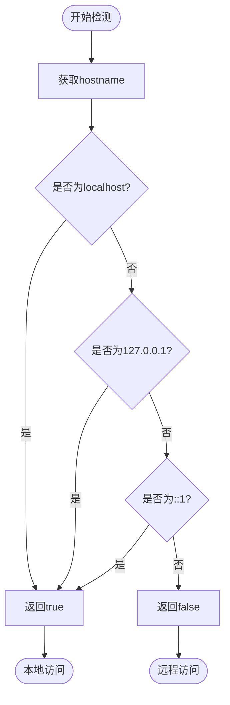

**判断条件**:
- `hostname === 'localhost'`
- `hostname === '127.0.0.1'`
- `hostname === '::1'` (IPv6回环地址)
- `hostname.startsWith('127.')` (所有127段地址)

## 配置文件设计

### 环境变量配置

**开发环境 (.env.development)**
```
VITE_API_BASE_URL=http://localhost:8000/api
VITE_APP_TITLE=SqlmapWebUI - 开发环境
VITE_ENABLE_MOCK=false
```

**生产环境 (.env.production)**
```
VITE_API_BASE_URL=/api
VITE_APP_TITLE=SqlmapWebUI
VITE_ENABLE_MOCK=false
```

### 构建输出配置

**构建目标目录**:
- 前端项目构建后的静态资源将输出到: `../../backEnd/static`
- 对应的绝对路径: `src/backEnd/static`
- 该目录将作为后端FastAPI的静态文件服务目录

**目录结构说明**:
```
sqlmapWebUI/
├── src/
│   ├── backEnd/
│   │   ├── static/              # 前端构建输出目录
│   │   │   ├── assets/          # 编译后的JS、CSS等资源
│   │   │   ├── index.html       # 入口HTML文件
│   │   │   └── favicon.ico      # 网站图标
│   │   ├── api/
│   │   ├── model/
│   │   └── ...
│   └── frontEnd/                # 前端源码目录
│       ├── src/
│       ├── public/
│       └── ...
```

**部署优势**:
- 前后端同域部署,无CORS跨域问题
- 统一的访问入口
- 简化生产环境配置
- 后端可直接托管前端静态资源

### Vite配置要点

| 配置项 | 目的 | 说明 |
|--------|------|------|
| 路径别名 | 简化导入路径 | 配置 `@` 指向 `src` 目录 |
| 代理配置 | 解决开发环境跨域 | 将 `/api` 代理到后端服务器 |
| 构建优化 | 提升生产性能 | 代码分割、压缩、Tree Shaking |
| 自动导入 | 简化开发 | 自动导入Vue API和组件 |
| CSS预处理 | 支持SCSS | 全局变量注入 |
| PrimeVue自动导入 | 按需加载组件 | 使用unplugin-vue-components自动解析PrimeVue组件 |
| 构建输出 | 指定输出目录 | 设置 `outDir` 为 `../../backEnd/static` |

### TypeScript配置要点

| 配置项 | 值 | 理由 |
|--------|---|------|
| strict | true | 启用严格类型检查 |
| moduleResolution | bundler | Vite推荐的模块解析策略 |
| isolatedModules | true | 确保每个文件可独立转译 |
| skipLibCheck | true | 跳过声明文件检查,加快编译 |

### PrimeVue配置说明

**primevue.ts 配置文件职责**:
- 导入PrimeVue插件并注册
- 配置PrimeVue全局选项(如ripple效果、输入样式等)
- 导入选定的主题CSS文件
- 导入PrimeIcons图标库CSS
- 导入核心CSS样式

**PrimeIcons图标库集成**:
- PrimeIcons是PrimeVue配套的图标字体库
- 包含250+常用图标,涵盖箭头、操作、状态、文件等类别
- 通过CSS类名方式使用,如 `pi pi-check`
- 支持图标大小调整、颜色自定义、旋转动画等
- 可与PrimeVue组件无缝集成(Button的icon属性等)

**主题选择策略**:
| 主题类型 | 推荐主题 | 特点 |
|---------|---------|------|
| 现代风格 | Lara | Material Design风格,默认主题 |
| 简洁风格 | Saga | 纯净简洁,适合中后台 |
| Bootstrap风格 | Bootstrap4 | 类似Bootstrap设计 |
| Material风格 | Material | Google Material Design |

**主题文件引入方式**:
- 核心样式: `primevue/resources/primevue.min.css`
- 主题样式: `primevue/resources/themes/[theme-name]/theme.css`
- 图标样式: `primeicons/primeicons.css`
- 自定义主题: 使用PrimeVue Theme Designer生成

## 网络请求架构

### 请求拦截器设计

**拦截器职责流程图(支持双模式)**:
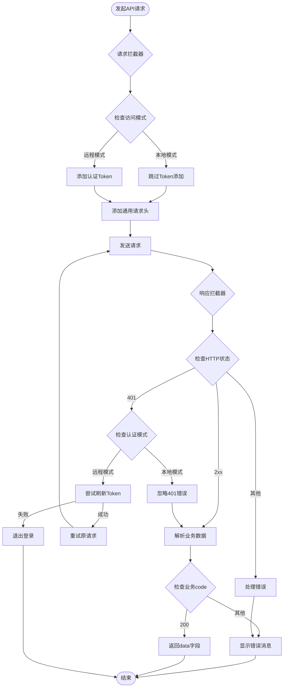

**请求拦截器处理逻辑**:
| 场景 | 本地模式 | 远程模式 |
|------|---------|----------|
| Token添加 | 不添加 | 添加到Authorization头 |
| 401响应 | 忽略,继续请求 | 尝试刷新Token或跳转登录 |
| 错误提示 | 直接显示 | 显示并可能跳转登录 |

### API响应格式映射

**后端响应结构**:
```
{
  "code": 200,
  "success": true,
  "message": "success",
  "data": { ... }
}
```

**前端处理策略**:
| 字段 | 处理方式 | 说明 |
|------|---------|------|
| code | 业务状态码判断 | 200表示成功,其他表示业务错误 |
| success | 辅助判断标识 | 与code配合使用 |
| message | 错误提示展示 | 失败时显示给用户 |
| data | 数据提取 | 成功时返回此字段内容 |

### API模块划分

#### 任务API (api/task.ts)

| API方法 | 后端端点 | HTTP方法 | 用途 |
|---------|---------|---------|------|
| getTaskList | /chrome/admin/task/list | GET | 获取所有任务列表 |
| addTask | /chrome/admin/task/add | POST | 创建新任务 |
| deleteTask | /chrome/admin/task/delete | DELETE | 删除指定任务 |
| stopTask | /chrome/admin/task/stop | PUT | 停止运行中的任务 |
| findTaskByUrl | /chrome/admin/task/findByUrlPath | POST | 根据URL搜索任务 |
| getTaskLogs | /chrome/admin/task/logs/getLogsByTaskId | GET | 获取任务日志 |

#### 请求头规则API (api/headerRule.ts)

| API方法 | 后端端点 | HTTP方法 | 用途 |
|---------|---------|---------|------|
| getPersistentRules | /chrome/admin/rule/list | GET | 获取持久化规则列表 |
| addPersistentRule | /chrome/admin/rule/add | POST | 添加持久化规则 |
| updatePersistentRule | /chrome/admin/rule/update | PUT | 更新持久化规则 |
| deletePersistentRule | /chrome/admin/rule/delete | DELETE | 删除持久化规则 |
| batchImportRules | /chrome/admin/rule/batch/import | POST | 批量导入规则 |

#### 认证API (api/auth.ts)

| API方法 | 后端端点 | HTTP方法 | 用途 |
|---------|---------|---------|------|
| login | /auth/login | POST | 用户登录获取Token |
| refreshToken | /auth/refresh | POST | 刷新访问令牌 |
| getVersion | /version | GET | 获取系统版本(无需认证) |
| checkAuthRequired | /auth/check-required | GET | 检查当前访问是否需要认证 |

**认证模式说明**:
- 本地访问(localhost/127.0.0.1)：自动跳过认证流程
- 远程访问：需要登录验证
- 前端通过检测访问域名判断认证模式

## 状态管理架构

### Store模块设计

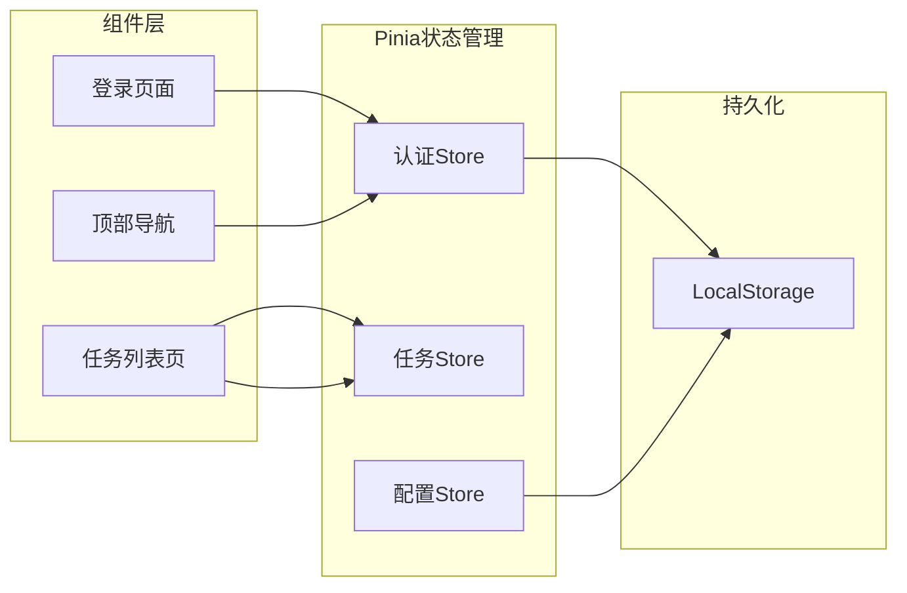

### 认证Store设计

**状态字段**:
| 字段名 | 类型 | 说明 |
|--------|------|------|
| token | string \| null | JWT访问令牌 |
| userInfo | UserInfo \| null | 用户基本信息 |
| isAuthenticated | boolean | 认证状态标识 |
| authRequired | boolean | 当前环境是否需要认证 |
| isLocalAccess | boolean | 是否为本地访问 |

**动作方法**:
| 方法名 | 参数 | 返回值 | 说明 |
|--------|------|--------|------|
| login | username, password | Promise\<void\> | 执行登录操作 |
| logout | - | void | 清除认证信息 |
| checkAuth | - | boolean | 验证Token有效性 |
| refreshToken | - | Promise\<void\> | 刷新访问令牌 |
| detectAuthMode | - | void | 检测认证模式(本地/远程) |
| initAuth | - | Promise\<void\> | 初始化认证状态 |

**计算属性**:
| 属性名 | 类型 | 说明 |
|--------|------|------|
| isLoggedIn | boolean | 是否已登录 |
| userName | string | 当前用户名 |
| needAuth | boolean | 当前访问是否需要认证 |

### 任务Store设计

**状态字段**:
| 字段名 | 类型 | 说明 |
|--------|------|------|
| taskList | Task[] | 任务列表 |
| currentTask | Task \| null | 当前查看的任务 |
| loading | boolean | 加载状态 |
| filters | TaskFilters | 任务筛选条件 |

**动作方法**:
| 方法名 | 参数 | 返回值 | 说明 |
|--------|------|--------|------|
| fetchTaskList | - | Promise\<void\> | 获取任务列表 |
| createTask | taskData | Promise\<Task\> | 创建新任务 |
| deleteTask | taskId | Promise\<void\> | 删除任务 |
| stopTask | taskId | Promise\<void\> | 停止任务 |
| updateTaskStatus | taskId, status | void | 更新任务状态(用于WebSocket) |

### 配置Store设计

**状态字段**:
| 字段名 | 类型 | 说明 |
|--------|------|------|
| apiBaseUrl | string | API基础URL |
| theme | 'light' \| 'dark' | 主题模式 |
| language | string | 界面语言 |
| headerRules | PersistentHeaderRule[] | 请求头规则缓存 |

**动作方法**:
| 方法名 | 参数 | 返回值 | 说明 |
|--------|------|--------|------|
| loadConfig | - | void | 从localStorage加载配置 |
| saveConfig | - | void | 保存配置到localStorage |
| updateTheme | theme | void | 切换主题 |

## 路由架构

### 路由层级设计

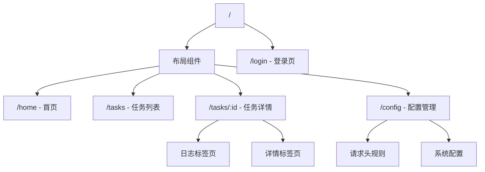

### 路由配置表

| 路径 | 组件 | 名称 | 元信息 | 说明 |
|------|------|------|--------|------|
| / | Layout | - | requiresAuth: true | 应用主布局 |
| /home | Home | home | requiresAuth: true | 首页仪表盘 |
| /tasks | TaskList | taskList | requiresAuth: true | 任务列表页 |
| /tasks/:id | TaskDetail | taskDetail | requiresAuth: true | 任务详情页 |
| /config | Config | config | requiresAuth: true | 配置管理页 |
| /login | Login | login | requiresAuth: false | 登录页 |

### 路由守卫策略

**全局前置守卫逻辑(支持双模式)**:
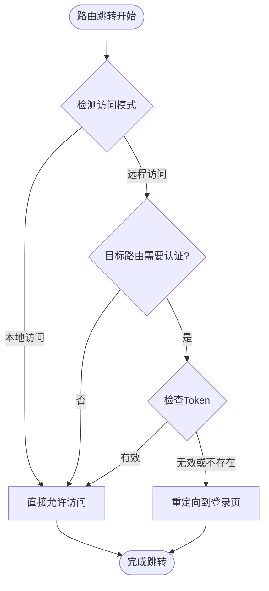

**守卫实现要点**:
- **本地访问检测**：通过 `window.location.hostname` 判断是否为 `localhost` 或 `127.0.0.1`
- **远程访问流程**：
  - 检查路由元信息中的 `requiresAuth` 字段
  - 从认证Store读取Token状态
  - 未登录用户访问受保护路由时跳转到 `/login`
- **登录页特殊处理**：
  - 本地访问：自动跳过登录页，重定向到首页
  - 远程访问且已登录：重定向到首页
  - 远程访问且未登录：显示登录页
- **原始路由保存**：登录成功后跳转回原目标路由

## 组件架构

### 核心组件设计

#### TaskTable组件(任务列表表格)

**组件职责**: 展示任务列表,支持排序、筛选、分页和操作

**使用PrimeVue组件**: DataTable、Column、Button、Tag

**Props定义**:
| Prop名 | 类型 | 默认值 | 说明 |
|--------|------|--------|------|
| tasks | Task[] | [] | 任务数据数组 |
| loading | boolean | false | 加载状态 |
| showActions | boolean | true | 是否显示操作列 |

**Events定义**:
| 事件名 | 参数 | 说明 |
|--------|------|------|
| delete | taskId: number | 删除任务 |
| stop | taskId: number | 停止任务 |
| view | task: Task | 查看任务详情 |

**列配置**:
| 列名 | 字段 | 类型 | 说明 |
|------|------|------|------|
| 任务ID | engineid | number | 任务唯一标识 |
| 扫描URL | scanUrl | string | 目标URL |
| 状态 | status | TaskStatus | 任务状态(使用TaskStatusTag组件) |
| 创建时间 | createTime | Date | 任务创建时间 |
| 操作 | - | slot | 操作按钮组(使用Button组件配合PrimeIcons) |

**操作按钮图标使用**:
| 操作 | PrimeIcons图标 | 说明 |
|------|---------------|------|
| 查看 | pi pi-eye | 查看任务详情 |
| 停止 | pi pi-stop | 停止运行中的任务 |
| 删除 | pi pi-trash | 删除任务 |
| 刷新 | pi pi-refresh | 刷新任务状态 |

#### TaskStatusTag组件(任务状态标签)

**组件职责**: 以标签形式展示任务状态,不同状态对应不同颜色

**使用PrimeVue组件**: Tag

**Props定义**:
| Prop名 | 类型 | 默认值 | 说明 |
|--------|------|--------|------|
| status | TaskStatus | - | 任务状态枚举值 |

**状态映射**:
| 状态值 | 标签文本 | PrimeVue severity | 说明 |
|--------|---------|----------------|------|
| PENDING | 等待中 | info | 任务已创建但未开始 |
| RUNNING | 运行中 | primary | 任务正在执行 |
| SUCCESS | 已完成 | success | 任务成功完成 |
| FAILED | 失败 | danger | 任务执行失败 |
| STOPPED | 已停止 | warning | 任务被手动停止 |

#### LogViewer组件(日志查看器)

**组件职责**: 实时展示任务执行日志,支持滚动加载和搜索

**使用PrimeVue组件**: Panel、InputText、Button、ScrollPanel、VirtualScroller

**Props定义**:
| Prop名 | 类型 | 默认值 | 说明 |
|--------|------|--------|------|
| taskId | number | - | 任务ID |
| autoScroll | boolean | true | 是否自动滚动到底部 |
| height | string | '400px' | 日志容器高度 |

**功能特性**:
- 支持日志关键词搜索和高亮
- 支持日志级别过滤(INFO/WARNING/ERROR)
- 支持导出日志为文本文件
- 支持实时滚动到最新日志
- 使用VirtualScroller优化大量日志性能

### 组件通信策略

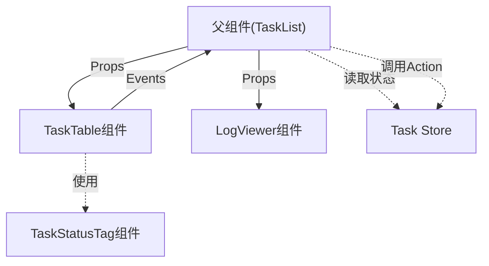

**通信原则**:
- 父子组件通过 Props/Events 通信
- 兄弟组件通过共享Store通信
- 跨层级组件通过 provide/inject 或 Store通信
- 避免过深的Props传递(超过3层考虑使用Store)

### PrimeVue常用组件选型

**数据展示类**:
| 组件名 | 用途 | 适用场景 |
|--------|------|----------|
| DataTable | 数据表格 | 任务列表、规则列表 |
| Tree | 树形结构 | 目录结构展示 |
| Timeline | 时间线 | 任务执行历史 |
| Card | 卡片容器 | 信息卡片展示 |
| Panel | 面板容器 | 内容分组 |

**表单类**:
| 组件名 | 用途 | 适用场景 |
|--------|------|----------|
| InputText | 文本输入 | URL输入、搜索 |
| Textarea | 多行文本 | 请求体输入 |
| Dropdown | 下拉选择 | 数据库类型选择 |
| MultiSelect | 多选下拉 | 注入技术选择 |
| InputNumber | 数字输入 | 级别、风险配置 |
| Checkbox | 复选框 | 规则启用/禁用 |
| RadioButton | 单选按钮 | 主题选择 |

**按钮和操作类**:
| 组件名 | 用途 | 适用场景 |
|--------|------|----------|
| Button | 按钮 | 通用操作按钮 |
| SplitButton | 分裂按钮 | 主操作+更多选项 |
| ToggleButton | 切换按钮 | 状态切换 |
| Menubar | 菜单栏 | 顶部导航 |
| Menu | 菜单 | 上下文菜单 |

**反馈类**:
| 组件名 | 用途 | 适用场景 |
|--------|------|----------|
| Toast | 消息提示 | 操作反馈 |
| ConfirmDialog | 确认对话框 | 删除确认 |
| Dialog | 对话框 | 表单弹窗 |
| ProgressBar | 进度条 | 任务进度 |
| ProgressSpinner | 加载动画 | 加载状态 |
| Tag | 标签 | 状态显示 |
| Badge | 徽章 | 未读数提示 |

**布局类**:
| 组件名 | 用途 | 适用场景 |
|--------|------|----------|
| Splitter | 分割面板 | 左右分栏布局 |
| TabView | 标签页 | 任务详情分页 |
| Accordion | 折叠面板 | 配置项分组 |
| ScrollPanel | 滚动面板 | 日志展示 |
| Divider | 分割线 | 内容分隔 |

### PrimeIcons图标使用指南

#### 图标库概述

PrimeIcons是专为PrimeVue设计的图标字体库,提供250+精美图标。所有图标均采用矢量格式,支持任意缩放不失真。

#### 图标分类

**常用操作图标**:
| 图标类名 | 显示 | 用途 |
|-----------|------|------|
| pi pi-plus | ➕ | 添加/新建 |
| pi pi-pencil | ✏️ | 编辑 |
| pi pi-trash | 🗑️ | 删除 |
| pi pi-check | ✔️ | 确认/成功 |
| pi pi-times | ❌ | 取消/关闭 |
| pi pi-save | 💾 | 保存 |
| pi pi-search | 🔍 | 搜索 |
| pi pi-refresh | 🔄 | 刷新 |
| pi pi-upload | ⬆️ | 上传 |
| pi pi-download | ⬇️ | 下载 |

**状态指示图标**:
| 图标类名 | 显示 | 用途 |
|-----------|------|------|
| pi pi-spin pi-spinner | ⏳ | 加载中(旋转动画) |
| pi pi-check-circle | ✅ | 成功状态 |
| pi pi-exclamation-triangle | ⚠️ | 警告状态 |
| pi pi-times-circle | ⛔ | 错误状态 |
| pi pi-info-circle | ℹ️ | 信息提示 |
| pi pi-play | ▶️ | 启动/运行 |
| pi pi-pause | ⏸️ | 暂停 |
| pi pi-stop | ⏹️ | 停止 |

**导航图标**:
| 图标类名 | 显示 | 用途 |
|-----------|------|------|
| pi pi-home | 🏠 | 首页 |
| pi pi-cog | ⚙️ | 设置 |
| pi pi-user | 👤 | 用户 |
| pi pi-sign-out | 🚪 | 退出登录 |
| pi pi-chevron-left | ❮ | 左箭头 |
| pi pi-chevron-right | ❯ | 右箭头 |
| pi pi-chevron-down | ▼ | 下箭头 |
| pi pi-chevron-up | ▲ | 上箭头 |
| pi pi-bars | ☰ | 菜单 |

**文件和数据图标**:
| 图标类名 | 显示 | 用途 |
|-----------|------|------|
| pi pi-file | 📄 | 文件 |
| pi pi-folder | 📁 | 文件夹 |
| pi pi-database | 🗄️ | 数据库 |
| pi pi-table | 📋 | 表格 |
| pi pi-chart-bar | 📊 | 统计图表 |
| pi pi-calendar | 📅 | 日历 |
| pi pi-clock | 🕐 | 时间 |

#### 图标使用方式

**在Button组件中使用**:
- 通过 `icon` 属性指定图标类名
- 通过 `iconPos` 属性设置图标位置(left/right/top/bottom)
- 可以创建纯图标按钮(不带文本)

**在InputText组件中使用**:
- 使用 `<i class="pi pi-search"></i>` 作为前缀或后缀
- 配合IconField和InputIcon组件使用

**在Menu/Menubar中使用**:
- 在菜单项配置中指定 `icon` 属性

**独立使用**:
- 直接使用 `<i class="pi pi-{icon-name}"></i>` 标签
- 可以通过CSS设置大小、颜色等样式

#### 图标样式自定义

**大小调整**:
| CSS类名 | 效果 | 说明 |
|----------|------|------|
| pi-sm | 0.875em | 小号图标 |
| pi-md | 1em | 默认大小 |
| pi-lg | 1.25em | 大号图标 |
| pi-xl | 2em | 特大图标 |

**颜色自定义**:
- 使用 `color` CSS属性设置图标颜色
- 继承父元素的文本颜色

**旋转动画**:
- 添加 `pi-spin` 类实现旋转动画
- 常用于加载状态显示

#### 项目中的图标使用规范

**任务管理相关**:
| 功能 | 推荐图标 | 说明 |
|------|-----------|------|
| 创建任务 | pi pi-plus | 新建按钮 |
| 查看任务 | pi pi-eye | 查看详情 |
| 编辑任务 | pi pi-pencil | 编辑按钮 |
| 删除任务 | pi pi-trash | 删除按钮 |
| 启动任务 | pi pi-play | 启动按钮 |
| 停止任务 | pi pi-stop | 停止按钮 |
| 任务日志 | pi pi-file-edit | 日志查看 |
| 刷新列表 | pi pi-refresh | 刷新按钮 |
| 搜索任务 | pi pi-search | 搜索输入框 |
| 导出报告 | pi pi-download | 导出按钮 |

**请求头规则管理**:
| 功能 | 推荐图标 | 说明 |
|------|-----------|------|
| 添加规则 | pi pi-plus-circle | 新增规则 |
| 编辑规则 | pi pi-pencil | 编辑按钮 |
| 删除规则 | pi pi-times | 删除按钮 |
| 启用/禁用 | pi pi-check / pi pi-ban | 切换状态 |
| 批量导入 | pi pi-upload | 导入按钮 |
| 优先级 | pi pi-sort-amount-up | 排序优先级 |

**系统功能**:
| 功能 | 推荐图标 | 说明 |
|------|-----------|------|
| 登录 | pi pi-sign-in | 登录按钮 |
| 退出 | pi pi-sign-out | 退出按钮 |
| 设置 | pi pi-cog | 设置入口 |
| 用户信息 | pi pi-user | 用户头像 |
| 主题切换 | pi pi-palette | 主题选择 |
| 语言切换 | pi pi-globe | 语言选择 |
| 帮助 | pi pi-question-circle | 帮助文档 |
| 通知 | pi pi-bell | 通知消息 |

## 样式架构

### SCSS组织策略

**全局变量定义**:
| 变量名 | 示例值 | 用途 |
|--------|--------|------|
| $primary-color | #3B82F6 | 主题色(PrimeVue默认蓝色) |
| $success-color | #22C55E | 成功状态色 |
| $warning-color | #F59E0B | 警告状态色 |
| $danger-color | #EF4444 | 危险状态色 |
| $text-color | #495057 | 主要文本色 |
| $border-color | #DEE2E6 | 边框颜色 |
| $border-radius | 6px | 圆角大小 |
| $spacing-unit | 8px | 间距基础单位 |

**样式组织原则**:
- 使用SCSS变量统一设计规范
- 避免内联样式,提升可维护性
- 采用BEM命名规范(Block__Element--Modifier)
- 组件样式使用 `<style scoped>` 避免污染
- 全局样式集中管理在 `assets/styles/` 目录
- 导入PrimeVue主题CSS和核心CSS文件
- 支持通过CSS变量动态切换主题

### 响应式设计断点

| 断点名称 | 屏幕宽度 | 目标设备 | 布局调整 |
|---------|---------|---------|---------|
| xs | < 768px | 手机 | 单列布局,隐藏部分功能 |
| sm | 768px ~ 992px | 平板 | 简化侧边栏 |
| md | 992px ~ 1200px | 小屏PC | 标准布局 |
| lg | 1200px ~ 1920px | 标准PC | 标准布局 |
| xl | > 1920px | 大屏 | 宽松布局 |

## 类型系统设计

### 核心类型定义

#### 任务相关类型 (types/task.ts)

**Task接口**:
| 字段名 | 类型 | 必填 | 说明 |
|--------|------|------|------|
| engineid | number | 是 | 任务引擎ID |
| taskid | string | 是 | 任务唯一标识符 |
| scanUrl | string | 是 | 扫描目标URL |
| host | string | 是 | 目标主机 |
| status | TaskStatus | 是 | 任务状态 |
| createTime | string | 是 | 创建时间(ISO格式) |
| headers | string[] | 否 | 请求头数组 |
| body | string | 否 | 请求体 |
| options | TaskOptions | 否 | 任务配置选项 |

**TaskStatus枚举**:
| 枚举值 | 数值 | 说明 |
|--------|------|------|
| PENDING | 0 | 等待中 |
| RUNNING | 1 | 运行中 |
| SUCCESS | 2 | 成功完成 |
| FAILED | 3 | 失败 |
| STOPPED | 4 | 已停止 |

**TaskOptions接口**:
| 字段名 | 类型 | 默认值 | 说明 |
|--------|------|--------|------|
| level | number | 1 | 检测级别(1-5) |
| risk | number | 1 | 风险级别(1-3) |
| technique | string | 'BEUSTQ' | 注入技术 |
| dbms | string | '' | 指定数据库类型 |

#### API响应类型 (types/api.ts)

**BaseResponse接口**:
| 字段名 | 类型 | 说明 |
|--------|------|------|
| code | number | 业务状态码 |
| success | boolean | 操作是否成功 |
| message | string | 响应消息 |
| data | T (泛型) | 响应数据 |

**使用示例**:
- `BaseResponse<Task>`: 单个任务响应
- `BaseResponse<Task[]>`: 任务列表响应
- `BaseResponse<{engineid: number, taskid: string}>`: 创建任务响应

#### 请求头规则类型 (types/headerRule.ts)

**PersistentHeaderRule接口**:
| 字段名 | 类型 | 必填 | 说明 |
|--------|------|------|------|
| id | number | 是 | 规则ID |
| headerName | string | 是 | 请求头名称 |
| matchCondition | string | 是 | 匹配条件(正则表达式) |
| replacementValue | string | 是 | 替换值 |
| priority | number | 是 | 优先级 |
| enabled | boolean | 是 | 是否启用 |

## 开发工作流

### 初始化步骤


### 包安装清单

**核心依赖**:
```
vue
vue-router
pinia
axios
primevue
primeicons
dayjs
lodash-es
```

**开发依赖**:
```
@vitejs/plugin-vue
vite
typescript
vite-plugin-compression
unplugin-auto-import
unplugin-vue-components
sass
eslint
prettier
```

### 开发命令定义

| 命令 | 脚本 | 说明 |
|------|------|------|
| pnpm dev | vite | 启动开发服务器(默认端口5173) |
| pnpm build | vite build | 构建生产版本,输出到src/backEnd/static |
| pnpm preview | vite preview | 预览生产构建结果 |
| pnpm lint | eslint . --ext .vue,.ts,.tsx | 代码检查 |
| pnpm format | prettier --write . | 代码格式化 |
| pnpm type-check | vue-tsc --noEmit | TypeScript类型检查 |

### 构建部署流程

**开发环境流程**:


**生产环境部署流程**:
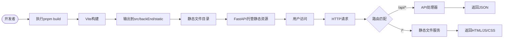

**构建输出结构**:
```
src/backEnd/static/
├── assets/
│   ├── index-[hash].js          # 主应用JS
│   ├── index-[hash].css         # 主应用CSS
│   ├── vendor-[hash].js         # 第三方库JS
│   └── [other-chunks].js        # 其他代码分块
├── index.html                   # 入口HTML
└── favicon.ico                  # 网站图标
```

### 环境配置检查清单

| 检查项 | 预期结果 | 验证方式 |
|--------|---------|---------|
| Node.js版本 | >= 18.x | 执行 `node -v` |
| pnpm安装 | 已安装 | 执行 `pnpm -v` |
| 端口可用性 | 5173端口未被占用 | 执行 `pnpm dev` |
| 后端连接 | 能访问后端API | 访问 http://localhost:8000/api/version |
| 代理配置 | `/api` 正确代理 | 浏览器Network面板检查 |
| PrimeVue样式 | 主题样式正常加载 | 检查网页样式显示 |

## 构建优化策略

### 打包优化配置

| 优化项 | 实现方式 | 预期效果 |
|--------|---------|---------|
| 代码分割 | Vite自动分割 + 手动配置 | 首屏加载体积减少50% |
| 路由懒加载 | `() => import()` 动态导入 | 按需加载页面组件 |
| 组件按需导入 | unplugin-vue-components | 只打包使用的UI组件 |
| Tree Shaking | ES Module + 生产模式 | 移除未使用代码 |
| 资源压缩 | vite-plugin-compression | 生成gzip文件,减少传输大小 |
| 图片优化 | 使用WebP格式 + 懒加载 | 减少图片资源体积 |
| 输出目录 | 配置outDir为../../backEnd/static | 直接输出到后端静态目录 |

### 构建配置细节

**Vite构建配置项**:
| 配置 | 值 | 说明 |
|------|-----|------|
| build.outDir | ../../backEnd/static | 输出目录路径 |
| build.emptyOutDir | true | 构建前清空输出目录 |
| build.assetsDir | assets | 静态资源子目录 |
| build.sourcemap | false | 生产环境不生成sourcemap |
| build.minify | terser | 使用terser压缩 |
| build.chunkSizeWarningLimit | 1000 | 块大小警告阈值(KB) |
| build.rollupOptions.output.manualChunks | 自定义 | 手动分割vendor块 |

**分块策略**:
- **vendor块**: vue, vue-router, pinia, axios
- **primevue块**: primevue, primeicons
- **utils块**: lodash-es, dayjs
- **页面组件**: 按路由懒加载分割

### 性能目标

| 指标 | 目标值 | 测量方法 |
|------|--------|---------|
| 首屏加载时间 | < 2秒 | Chrome DevTools Lighthouse |
| 首次内容绘制(FCP) | < 1.5秒 | Lighthouse |
| 最大内容绘制(LCP) | < 2.5秒 | Lighthouse |
| 首次输入延迟(FID) | < 100ms | Lighthouse |
| 累积布局偏移(CLS) | < 0.1 | Lighthouse |
| 打包体积(gzip) | < 500KB | 构建输出统计 |

## 安全考虑

### 前端安全策略

| 安全威胁 | 防御措施 | 实现方式 |
|---------|---------|---------|
| XSS攻击 | 输入输出转义 | Vue自动转义 + DOMPurify库 |
| CSRF攻击 | Token验证 | 请求头携带CSRF Token |
| 敏感信息泄露 | 避免前端存储敏感数据 | Token存储加密,不存储密码 |
| 中间人攻击 | HTTPS传输 | 生产环境强制HTTPS |
| 依赖漏洞 | 定期更新依赖 | 使用 `pnpm audit` 检查 |
| API注入 | 参数验证 | 前端验证 + 后端验证双重保障 |

### Token管理策略(双模式)

**远程访问模式Token流程**:
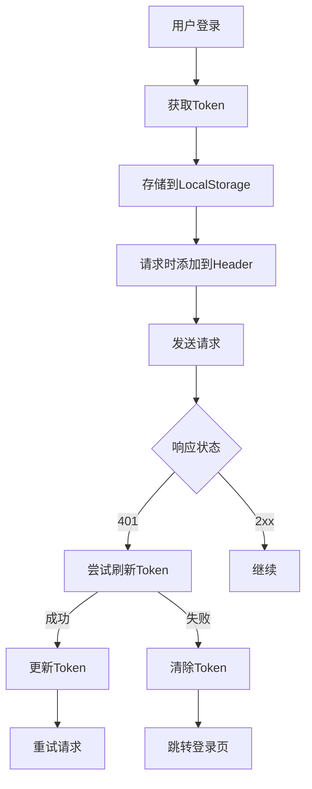

**本地访问模式Token流程**:
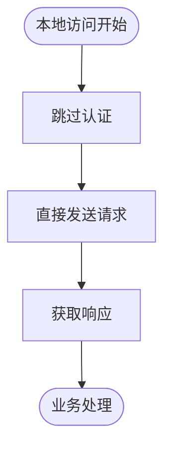

**Token存储原则**:
- **远程访问**：
  - 使用 `localStorage` 存储Token(支持跨标签页共享)
  - Token过期前5分钟自动刷新
  - 退出登录时清除所有认证信息
  - 401响应自动触发Token刷新或登录跳转
- **本地访问**：
  - 不存储Token
  - 不需要认证流程
  - 所有请求直接通过

## 测试策略

### 单元测试范围

| 测试对象 | 测试工具 | 覆盖率目标 | 重点测试内容 |
|---------|---------|-----------|-------------|
| 工具函数 | Vitest | 90% | utils目录下的纯函数 |
| API封装 | Vitest + MSW | 80% | 请求拦截器、响应处理 |
| Store | Vitest + Pinia Testing | 85% | 状态变更、异步Action |
| 组件 | Vitest + Vue Test Utils | 70% | 核心业务组件 |

### 测试工具配置

| 工具 | 用途 | 说明 |
|------|------|------|
| Vitest | 单元测试框架 | 与Vite集成,速度快 |
| @vue/test-utils | Vue组件测试 | 官方测试工具 |
| MSW | API Mock | 拦截网络请求进行Mock |
| @pinia/testing | Pinia测试工具 | 测试Store状态和Action |

### 测试命令

| 命令 | 说明 |
|------|------|
| pnpm test | 运行所有测试 |
| pnpm test:unit | 运行单元测试 |
| pnpm test:coverage | 生成覆盖率报告 |
| pnpm test:ui | 启动测试UI界面 |

## 与后端集成

### API对接流程

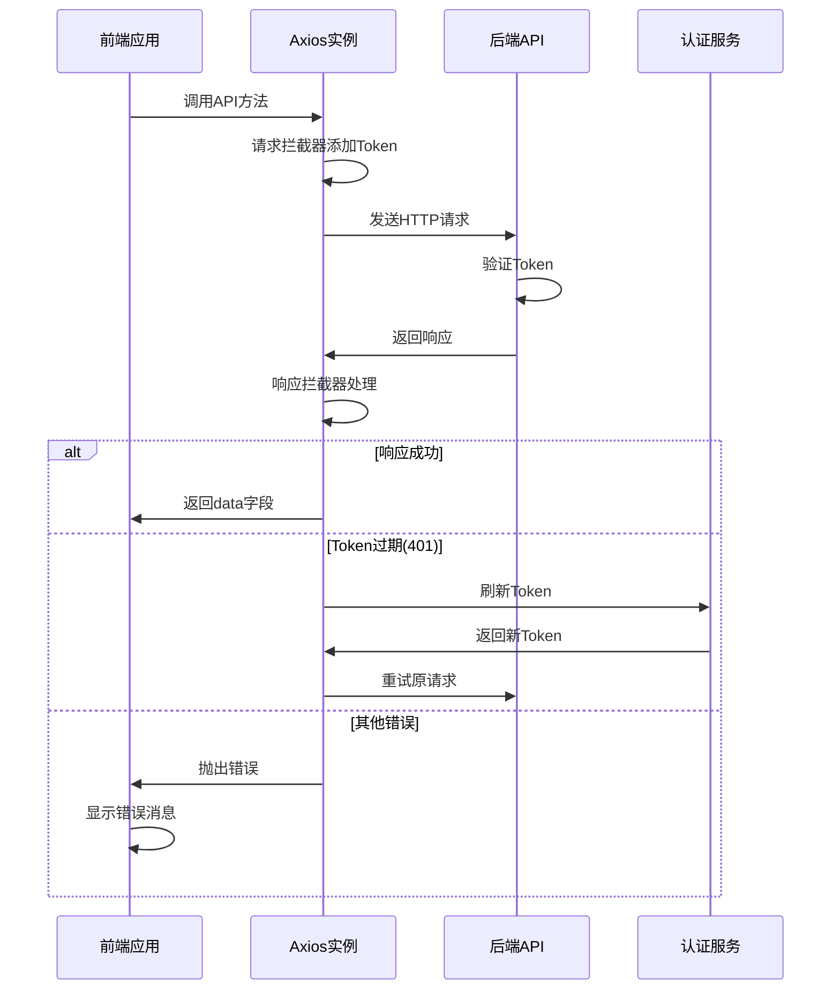

### 认证流程设计(双模式支持)

**本地访问模式**:
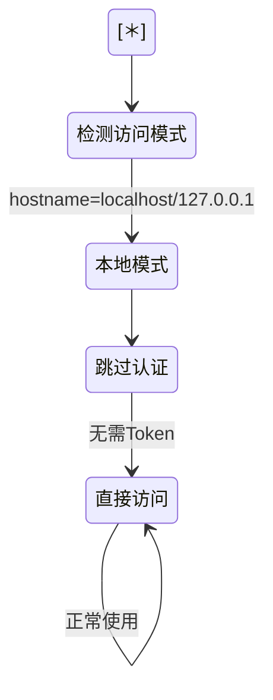

**远程访问模式**:
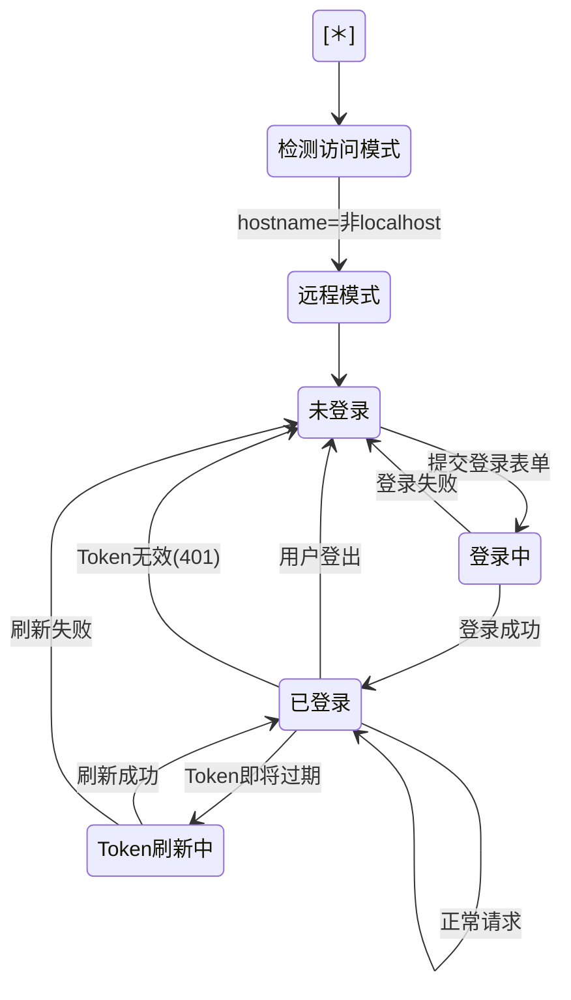

**认证模式检测流程**:
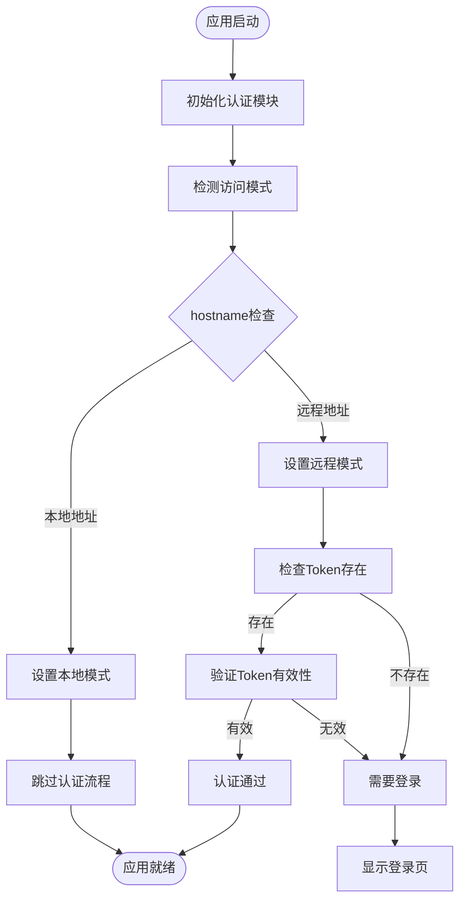

### 跨域处理方案

**开发环境**:
- Vite代理配置,将 `/api` 代理到 `http://localhost:8000/api`
- 避免在开发时配置CORS

**生产环境**:
- 前端打包部署到后端 `src/backEnd/static` 目录
- 后端FastAPI托管静态文件服务
- 前后端同域访问,无CORS问题
- API路由与静态文件路由分离处理

**后端静态文件配置要求**:
- 需要在FastAPI中挂载静态文件目录
- 配置路由优先级: API路由 > 静态文件路由
- 支持SPA路由回退: 所有非API请求返回index.html

**部署架构图**:
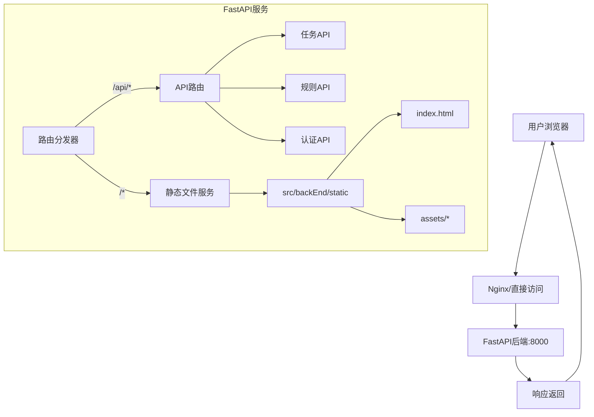

### 数据流向图

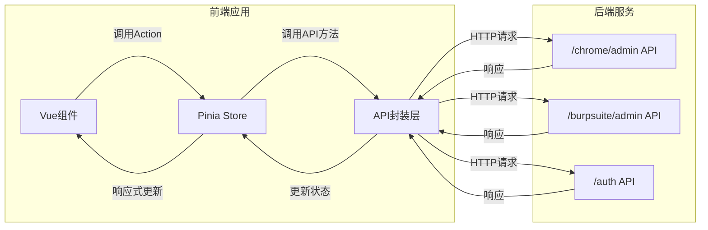

## 代码规范

### 命名规范

| 类型 | 命名风格 | 示例 | 说明 |
|------|---------|------|------|
| 组件文件 | PascalCase | TaskTable.vue | 多单词组件名 |
| 组合式函数 | camelCase + use前缀 | useAuth.ts | Composable约定 |
| Store文件 | camelCase | auth.ts | Store模块名 |
| 类型接口 | PascalCase | Task, BaseResponse | 类型定义 |
| 常量 | UPPER_SNAKE_CASE | API_BASE_URL | 全局常量 |
| 普通变量 | camelCase | taskList | 变量和函数 |
| CSS类名 | kebab-case / BEM | .task-table__header | 样式类名 |

### 代码组织规范

**Vue组件结构顺序**:
1. `<script setup>` 部分
   - import语句
   - 类型定义
   - Props定义
   - Emits定义
   - 响应式数据
   - 计算属性
   - 方法
   - 生命周期钩子
2. `<template>` 部分
3. `<style scoped>` 部分

**文件行数限制**:
| 文件类型 | 建议行数 | 超出时的处理 |
|---------|---------|------------|
| Vue组件 | < 300行 | 拆分子组件或提取Composable |
| TypeScript文件 | < 400行 | 拆分模块 |
| Store文件 | < 200行 | 按业务域拆分多个Store |

### ESLint规则要点

| 规则 | 配置 | 理由 |
|------|------|------|
| no-console | warn | 避免遗留调试代码 |
| no-debugger | error | 禁止生产环境debugger |
| vue/multi-word-component-names | error | 组件名必须多单词 |
| @typescript-eslint/no-explicit-any | warn | 减少any使用 |
| vue/component-name-in-template-casing | PascalCase | 统一组件使用风格 |

## 后续扩展规划

### 功能模块扩展点

| 功能模块 | 扩展方向 | 优先级 |
|---------|---------|--------|
| 实时通信 | 集成WebSocket实时推送任务状态 | 高 |
| 国际化 | vue-i18n多语言支持 | 中 |
| 主题切换 | PrimeVue多主题支持(亮/暗模式) | 中 |
| 数据可视化 | 集成ECharts展示扫描结果统计 | 高 |
| 导出功能 | 任务报告导出(PDF/HTML) | 中 |
| 批量操作 | 批量创建/删除/停止任务 | 高 |
| 拖拽上传 | PrimeVue FileUpload组件实现文件上传 | 中 |

### 性能优化方向

| 优化点 | 实现方案 | 预期收益 |
|--------|---------|---------|
| 虚拟滚动 | 使用PrimeVue VirtualScroller | 渲染性能提升80% |
| 请求缓存 | 实现请求结果缓存机制 | 减少重复请求 |
| 预加载 | 关键路由和数据预加载 | 提升交互响应速度 |
| Service Worker | PWA支持离线访问 | 提升用户体验 |
| CDN加速 | 静态资源CDN分发 | 加载速度提升50% |
| 按需加载 | PrimeVue组件按需引入 | 打包体积减少30% |

### 技术债务管理

| 技术债项 | 计划解决时间 | 优先级 |
|---------|------------|--------|
| 补充单元测试覆盖 | 开发中期 | 高 |
| 完善TypeScript类型定义 | 持续进行 | 中 |
| 性能监控接入 | 生产部署前 | 高 |
| 无障碍访问优化 | 后期迭代 | 低 |
