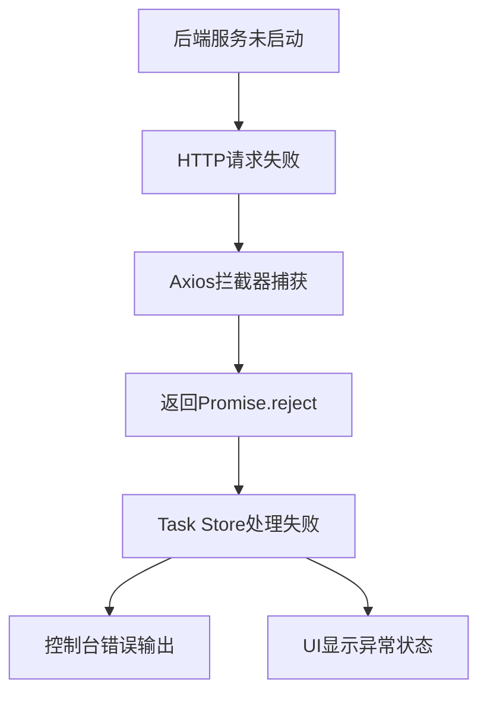
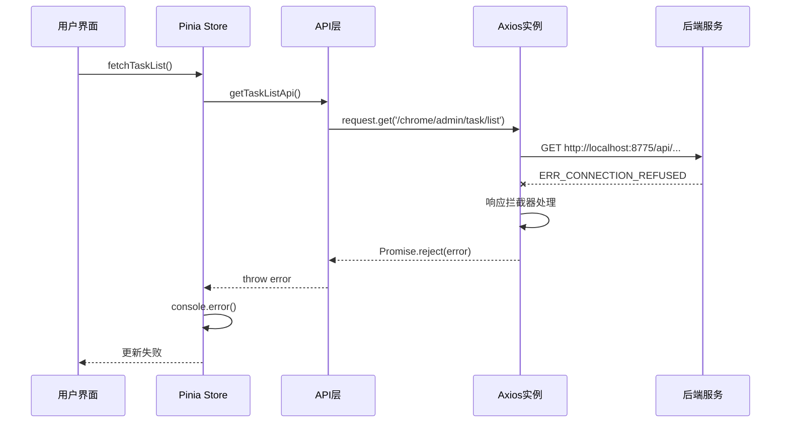
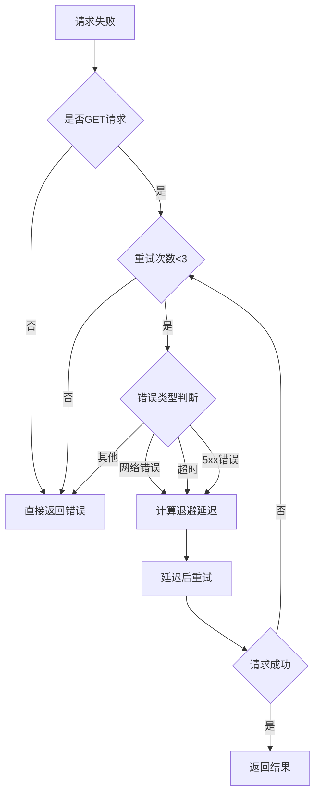
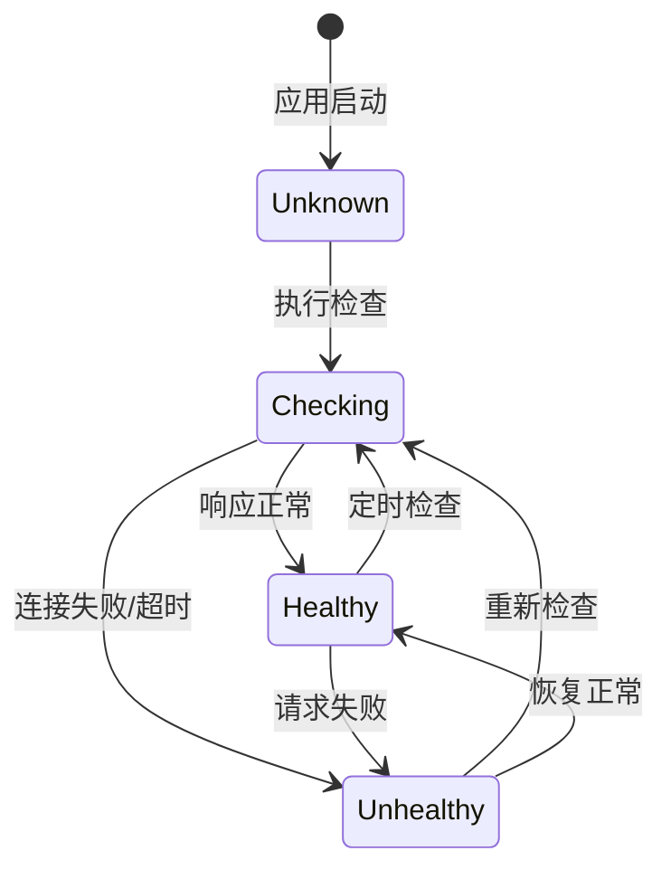
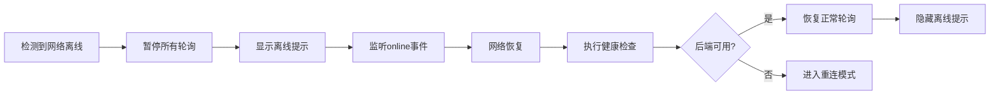

# 前端错误诊断与修复设计文档

## 1. 概述

### 1.1 问题背景
通过MCP Chrome DevTools对前端应用进行全面检查，发现大量网络连接错误和控制台报错信息，需要系统性地诊断和修复这些问题。

### 1.2 检测范围
- 控制台错误日志（Console Errors）
- 网络请求失败（Network Failures）
- 运行时警告（Runtime Warnings）
- 资源加载问题（Resource Loading Issues）

### 1.3 目标
- 识别并分类所有前端错误和警告
- 设计针对性的修复方案
- 确保前端应用稳定运行

## 2. 错误诊断结果

### 2.1 错误分类统计

通过MCP DevTools检测发现以下问题分布：

| 错误类型 | 数量 | 严重级别 | 影响范围 |
|---------|------|---------|---------|
| 网络连接失败 | 150+ | 严重 | 全局 |
| 业务逻辑错误 | 150+ | 严重 | 任务管理 |
| 资源加载错误 | 0 | - | - |
| 运行时警告 | 0 | - | - |

### 2.2 核心问题详情

#### 2.2.1 后端服务连接失败

**问题表现：**
```
Network Request Failed: net::ERR_CONNECTION_REFUSED
Target URL: http://localhost:8775/api/chrome/admin/task/list
Request Method: GET
Status: FAILED
```

**错误详情：**
- 错误消息：`Failed to load resource: net::ERR_CONNECTION_REFUSED`
- 受影响的API端点：`/api/chrome/admin/task/list`
- 请求协议：HTTP GET
- 目标端口：8775

**影响范围：**
1. 任务列表无法加载
2. 首页统计数据显示为0
3. 定时轮询持续失败（每5秒一次）
4. 用户体验严重受损

#### 2.2.2 业务层级联错误

**错误消息序列：**
```
Console Messages:
- Network error: 网络错误
- Failed to fetch task list: [AxiosError Object]
- Failed to refresh tasks: [AxiosError Object]
```

**错误传播路径：**



#### 2.2.3 定时轮询导致错误堆积

**问题根源：**
在 `Layout.vue` 中实现了任务列表的定时刷新机制，但未考虑后端服务不可用的情况：

```
轮询机制：每5秒调用一次 taskStore.fetchTaskList()
累计失败次数：150+ 次
时间跨度：约12.5分钟
```

**设计缺陷：**
- 缺少后端健康检查机制
- 无连接失败后的退避策略
- 未实现重连逻辑
- 错误未进行用户友好提示

## 3. 架构分析

### 3.1 当前请求流程



### 3.2 配置层级关系

| 配置项 | 配置文件 | 当前值 | 说明 |
|-------|---------|-------|------|
| API基础URL | `.env.development` | `http://localhost:8775/api` | 开发环境后端地址 |
| 请求超时 | `request.ts` | `30000ms` | Axios超时配置 |
| 轮询间隔 | `Layout.vue` | `5000ms` | 任务列表刷新频率 |
| 认证模式 | `auth.ts` | 动态判断 | 本地/远程模式 |

## 4. 修复方案设计

### 4.1 后端服务启动修复

#### 4.1.1 问题根源
后端服务未在预期端口（8775）运行

#### 4.1.2 修复策略

**方案A：启动后端服务（推荐）**

修复步骤：
1. 定位后端项目入口文件（`src/backEnd/main.py`）
2. 检查Uvicorn配置文件（`uvicorn_config.json`）
3. 确认端口配置为8775
4. 启动后端服务
5. 验证服务健康状态

验证清单：
- [ ] 后端服务成功启动
- [ ] 监听端口为8775
- [ ] API端点可访问
- [ ] CORS配置正确

**方案B：调整前端配置**

若后端运行在不同端口（如8000），需要同步修改前端配置：

修改位置：`src/frontEnd/.env.development`
```
修改前：VITE_API_BASE_URL=http://localhost:8775/api
修改后：VITE_API_BASE_URL=http://localhost:8000/api
```

配置同步验证：
- [ ] 环境变量文件已更新
- [ ] 开发服务器已重启
- [ ] 浏览器缓存已清除

### 4.2 错误处理增强设计

#### 4.2.1 全局错误提示机制

**设计目标：**
- 网络错误时显示用户友好提示
- 避免在控制台堆积大量错误
- 提供重试操作入口

**实现方案：**

集成PrimeVue Toast组件作为全局通知系统

| 错误类型 | Toast严重级别 | 显示时长 | 提示内容 |
|---------|-------------|---------|---------|
| 网络连接失败 | error | 5000ms | "无法连接到后端服务，请检查服务是否启动" |
| 业务逻辑错误 | warn | 4000ms | 显示后端返回的错误消息 |
| 请求超时 | warn | 4000ms | "请求超时，请稍后重试" |
| 认证失败 | error | 永久显示 | "认证失败，请重新登录" |

**Toast组件使用规范：**

在 `request.ts` 中的错误拦截器增强：

| 拦截点 | 当前行为 | 优化后行为 |
|-------|---------|-----------|
| 网络错误 | 仅控制台输出 | 控制台输出 + Toast提示 |
| 401错误 | 移除Token + 控制台警告 | 移除Token + Toast提示 + 跳转登录 |
| 业务错误 | 控制台输出 | 控制台输出 + Toast提示 |

#### 4.2.2 请求重试机制

**设计原则：**
- 仅对幂等性请求（GET）进行自动重试
- 使用指数退避算法避免服务雪崩
- 提供用户手动重试选项

**重试策略配置：**

| 配置参数 | 默认值 | 说明 |
|---------|-------|------|
| 最大重试次数 | 3 | 超过后放弃重试 |
| 初始延迟 | 1000ms | 第一次重试延迟 |
| 延迟倍数 | 2 | 指数退避因子 |
| 最大延迟 | 10000ms | 延迟上限 |
| 可重试状态码 | 408, 500, 502, 503, 504 | HTTP状态码白名单 |

**重试决策流程：**



### 4.3 后端健康检查机制

#### 4.3.1 健康检查端点设计

**端点规范：**

| 属性 | 值 |
|-----|---|
| 路径 | `/api/health` 或 `/api/ping` |
| 方法 | GET |
| 响应格式 | JSON |
| 超时时间 | 5000ms |
| 缓存策略 | 不缓存 |

**响应数据模型：**

| 字段 | 类型 | 必填 | 说明 |
|-----|------|------|------|
| status | string | 是 | 服务状态（'healthy', 'degraded', 'unhealthy'） |
| timestamp | number | 是 | 响应时间戳 |
| version | string | 否 | 后端服务版本 |
| uptime | number | 否 | 服务运行时长（秒） |

#### 4.3.2 前端健康检查逻辑

**检查触发时机：**

1. 应用初始化时执行一次
2. 首次请求失败后立即执行
3. 网络状态从离线恢复到在线时执行
4. 用户手动触发检查

**状态管理设计：**

在 `auth.ts` Store中新增健康状态管理：

| 状态字段 | 类型 | 初始值 | 说明 |
|---------|------|-------|------|
| backendHealthy | boolean | true | 后端服务健康状态 |
| lastHealthCheck | number | 0 | 上次检查时间戳 |
| healthCheckInterval | number | 30000 | 检查间隔（毫秒） |

**健康检查状态机：**



### 4.4 轮询优化设计

#### 4.4.1 智能轮询策略

**当前问题：**
- 无条件每5秒轮询，后端不可用时持续失败
- 未根据页面可见性调整轮询频率
- 缺少网络状态感知

**优化方案：**

| 场景 | 当前频率 | 优化后频率 | 优化依据 |
|-----|---------|-----------|---------|
| 后端正常 + 页面活跃 | 5秒 | 5秒 | 保持实时性 |
| 后端正常 + 页面隐藏 | 5秒 | 30秒 | 节省资源 |
| 后端异常 + 连接中 | 5秒 | 停止轮询 | 避免错误堆积 |
| 后端异常 + 重连模式 | 5秒 | 10-30秒递增 | 指数退避 |
| 网络离线 | 5秒 | 停止轮询 | 等待网络恢复 |

#### 4.4.2 页面可见性API集成

**检测逻辑：**

使用 `document.visibilityState` 监听页面状态变化

| 页面状态 | 轮询行为 | 说明 |
|---------|---------|------|
| visible | 正常轮询 | 用户正在查看页面 |
| hidden | 降低频率或暂停 | 用户切换到其他标签页 |

**实现位置：**
在 `Layout.vue` 的 `onMounted` 钩子中注册监听器

#### 4.4.3 网络状态监听

**浏览器API：**
使用 `navigator.onLine` 和 `online/offline` 事件

| 网络状态 | 轮询行为 | UI提示 |
|---------|---------|-------|
| 在线 | 正常执行 | 无 |
| 离线 | 立即暂停 | 显示离线提示Banner |
| 离线→在线 | 立即执行一次健康检查 | 隐藏提示并刷新数据 |

**状态变化处理流程：**



### 4.5 用户体验优化

#### 4.5.1 加载状态设计

**空状态处理：**

| 场景 | 当前表现 | 优化后表现 |
|-----|---------|-----------|
| 首次加载中 | 显示空数据 | 显示骨架屏 |
| 加载失败 | 无明显提示 | 显示错误状态页面 |
| 后端不可用 | 持续报错 | 显示"服务不可用"提示 |
| 无数据 | 空白列表 | 显示空状态插画和引导文案 |

**错误状态页面设计：**

| 组件元素 | 内容 | 交互 |
|---------|------|------|
| 图标 | 断开连接图标 | 无 |
| 标题 | "无法连接到服务器" | 无 |
| 描述 | "请检查后端服务是否已启动，或联系管理员" | 无 |
| 主按钮 | "重试" | 点击重新执行请求 |
| 次按钮 | "查看详情" | 展开技术错误信息 |

#### 4.5.2 离线模式友好提示

**顶部Banner设计：**

| 属性 | 值 |
|-----|---|
| 位置 | 固定在状态栏下方 |
| 背景色 | 警告黄色（#FEF3C7） |
| 图标 | 离线图标（pi-wifi-slash） |
| 文案 | "您当前处于离线状态，部分功能不可用" |
| 消失条件 | 网络恢复且后端可用 |

## 5. 实施计划

### 5.1 修复优先级

| 优先级 | 修复项 | 工作量 | 依赖关系 |
|-------|-------|-------|---------|
| P0 | 启动后端服务 | 0.5小时 | 无 |
| P1 | 集成Toast全局提示 | 1小时 | P0 |
| P1 | 优化错误处理逻辑 | 1.5小时 | P0 |
| P2 | 实现请求重试机制 | 2小时 | P1 |
| P2 | 添加健康检查端点 | 1小时 | P0（后端） |
| P2 | 实现智能轮询 | 2小时 | P1 |
| P3 | 优化加载状态UI | 1.5小时 | P1 |
| P3 | 添加离线模式提示 | 1小时 | P1 |

### 5.2 实施步骤

#### 阶段一：紧急修复（立即执行）

**步骤1：启动后端服务**
- 检查后端项目配置
- 确认端口为8775
- 启动Uvicorn服务
- 验证API端点可访问

**步骤2：前端配置验证**
- 确认 `.env.development` 中的API地址
- 重启前端开发服务器
- 清除浏览器缓存
- 验证请求能够成功发送

**验收标准：**
- 控制台无连接错误
- 任务列表数据正常加载
- 首页统计数据正确显示

#### 阶段二：增强错误处理（1-2天）

**步骤1：集成Toast组件**
- 在 `main.ts` 中全局注册ToastService
- 在 `App.vue` 中添加Toast组件占位

**步骤2：改造请求拦截器**
- 在响应错误拦截器中调用Toast API
- 根据错误类型显示不同级别提示
- 移除冗余的console.error

**步骤3：优化Store错误处理**
- 在catch块中不再重复输出错误
- 信任全局拦截器的错误处理
- 保留必要的业务层错误转换

**验收标准：**
- 网络错误时显示Toast提示
- 控制台错误减少90%以上
- 用户能清晰了解错误原因

#### 阶段三：健康检查与重试（2-3天）

**步骤1：后端健康检查端点**
- 在后端新增 `/api/health` 路由
- 实现健康检查逻辑
- 返回规范的JSON响应

**步骤2：前端健康检查集成**
- 在 `auth` Store中添加健康状态管理
- 实现健康检查请求方法
- 在应用启动时执行首次检查

**步骤3：请求重试机制**
- 在Axios配置中添加重试拦截器
- 实现指数退避算法
- 仅对GET请求和特定错误码重试

**验收标准：**
- 临时网络抖动时请求自动重试
- 后端启动后前端自动恢复
- 重试不超过3次

#### 阶段四：轮询优化（2天）

**步骤1：页面可见性监听**
- 使用 `document.visibilityState` API
- 页面隐藏时降低轮询频率
- 页面重新可见时立即刷新

**步骤2：网络状态监听**
- 监听 `online` 和 `offline` 事件
- 离线时暂停所有轮询
- 在线恢复时执行健康检查

**步骤3：智能轮询策略**
- 根据后端健康状态动态调整间隔
- 连接失败后进入重连模式
- 使用指数退避避免频繁重试

**验收标准：**
- 后端不可用时不再发起请求
- 页面最小化时减少资源消耗
- 网络恢复后自动重连

#### 阶段五：用户体验优化（2天）

**步骤1：加载状态优化**
- 首次加载时显示骨架屏
- 加载失败显示错误状态页面
- 空数据时显示友好提示

**步骤2：离线模式提示**
- 添加顶部离线Banner组件
- 网络离线时自动显示
- 恢复后自动隐藏

**步骤3：重试交互优化**
- 错误状态页面添加重试按钮
- Toast提示中添加重试操作
- 显示重试倒计时

**验收标准：**
- 用户能清晰了解当前状态
- 所有异常情况有明确提示
- 提供便捷的恢复操作

### 5.3 测试验证清单

#### 功能测试

| 测试场景 | 预期结果 | 测试方法 |
|---------|---------|---------|
| 后端正常运行 | 数据正常加载 | 启动后端，访问前端 |
| 后端未启动 | 显示错误提示，不持续报错 | 停止后端，访问前端 |
| 后端启动晚于前端 | 自动恢复连接 | 先访问前端，后启动后端 |
| 后端中途崩溃 | 检测到异常并提示 | 运行中停止后端 |
| 网络临时抖动 | 自动重试成功 | 模拟间歇性网络故障 |
| 页面切换到后台 | 降低轮询频率 | 切换浏览器标签页 |
| 网络完全离线 | 显示离线提示 | 关闭网络连接 |
| 网络恢复 | 自动重连并刷新数据 | 重新开启网络 |

#### 性能测试

| 测试指标 | 目标值 | 测试方法 |
|---------|-------|---------|
| 首次加载时间 | <2秒 | 清除缓存后刷新 |
| 健康检查响应时间 | <500ms | 测量 `/api/health` 耗时 |
| 重试成功率 | >90% | 模拟瞬时故障 |
| 后台轮询频率 | ≤1次/30秒 | 监控隐藏页面的请求 |
| 离线模式内存占用 | 无增长 | 长时间离线状态监控 |

#### 兼容性测试

| 测试环境 | 测试项 | 验证点 |
|---------|-------|-------|
| Chrome 最新版 | 所有功能 | 完整测试 |
| Firefox 最新版 | 页面可见性API | 轮询暂停恢复 |
| Safari 最新版 | Toast提示 | 样式和功能正常 |
| Edge 最新版 | 网络状态监听 | 离线模式提示 |
| 移动端Chrome | 触摸交互 | 重试按钮可点击 |

## 6. 风险评估

### 6.1 技术风险

| 风险项 | 影响 | 可能性 | 缓解措施 |
|-------|------|-------|---------|
| Toast组件性能问题 | 高频错误时UI卡顿 | 低 | 实现防抖机制，同类错误合并显示 |
| 重试机制雪崩 | 大量重试请求压垮后端 | 中 | 严格限制并发重试数量，使用指数退避 |
| 浏览器API兼容性 | 旧版浏览器不支持 | 低 | 渐进增强，检测API可用性 |
| 健康检查端点性能 | 频繁检查影响后端 | 低 | 设置合理的检查间隔（30秒） |

### 6.2 业务风险

| 风险项 | 影响 | 缓解措施 |
|-------|------|---------|
| 修复导致新问题 | 影响现有功能 | 充分的测试覆盖 |
| 后端改动需求 | 增加跨团队协调成本 | 优先使用前端方案 |
| 用户习惯改变 | 新提示可能被忽略 | 渐进式引入，保留关键提示 |

## 7. 监控与告警

### 7.1 前端错误监控

**监控指标：**

| 指标 | 含义 | 告警阈值 |
|-----|------|---------|
| 网络错误率 | 网络请求失败占比 | >5% |
| 平均重试次数 | 单次请求平均重试次数 | >1.5 |
| 健康检查失败率 | 健康检查失败占比 | >10% |
| Toast显示频率 | 单位时间内Toast触发次数 | >10次/分钟 |

**日志记录规范：**

| 日志级别 | 使用场景 | 示例 |
|---------|---------|------|
| Error | 不可恢复的错误 | 后端服务完全不可用 |
| Warn | 可恢复的异常 | 请求重试成功 |
| Info | 状态变更 | 健康检查状态改变 |
| Debug | 调试信息 | 重试延迟计算 |

### 7.2 用户行为监控

**关键行为埋点：**

| 行为 | 埋点事件 | 分析目的 |
|-----|---------|---------|
| 点击重试按钮 | `user_retry_action` | 衡量错误恢复便捷性 |
| 查看错误详情 | `error_detail_view` | 评估技术错误信息需求 |
| 离线模式提示显示 | `offline_banner_show` | 统计离线场景频率 |
| 健康检查恢复 | `health_check_recover` | 监控服务可用性 |
| 移动端Chrome | 触摸交互 | 重试按钮可点击 |

## 6. 风险评估

### 6.1 技术风险

| 风险项 | 影响 | 可能性 | 缓解措施 |
|-------|------|-------|---------|
| Toast组件性能问题 | 高频错误时UI卡顿 | 低 | 实现防抖机制，同类错误合并显示 |
| 重试机制雪崩 | 大量重试请求压垮后端 | 中 | 严格限制并发重试数量，使用指数退避 |
| 浏览器API兼容性 | 旧版浏览器不支持 | 低 | 渐进增强，检测API可用性 |
| 健康检查端点性能 | 频繁检查影响后端 | 低 | 设置合理的检查间隔（30秒） |

### 6.2 业务风险

| 风险项 | 影响 | 缓解措施 |
|-------|------|---------|
| 修复导致新问题 | 影响现有功能 | 充分的测试覆盖 |
| 后端改动需求 | 增加跨团队协调成本 | 优先使用前端方案 |
| 用户习惯改变 | 新提示可能被忽略 | 渐进式引入，保留关键提示 |

## 7. 监控与告警

### 7.1 前端错误监控

**监控指标：**

| 指标 | 含义 | 告警阈值 |
|-----|------|---------|
| 网络错误率 | 网络请求失败占比 | >5% |
| 平均重试次数 | 单次请求平均重试次数 | >1.5 |
| 健康检查失败率 | 健康检查失败占比 | >10% |
| Toast显示频率 | 单位时间内Toast触发次数 | >10次/分钟 |

**日志记录规范：**

| 日志级别 | 使用场景 | 示例 |
|---------|---------|------|
| Error | 不可恢复的错误 | 后端服务完全不可用 |
| Warn | 可恢复的异常 | 请求重试成功 |
| Info | 状态变更 | 健康检查状态改变 |
| Debug | 调试信息 | 重试延迟计算 |

### 7.2 用户行为监控

**关键行为埋点：**

| 行为 | 埋点事件 | 分析目的 |
|-----|---------|---------|
| 点击重试按钮 | `user_retry_action` | 衡量错误恢复便捷性 |
| 查看错误详情 | `error_detail_view` | 评估技术错误信息需求 |
| 离线模式提示显示 | `offline_banner_show` | 统计离线场景频率 |
| 健康检查恢复 | `health_check_recover` | 监控服务可用性 |
| Edge 最新版 | 网络状态监听 | 离线模式提示 |
