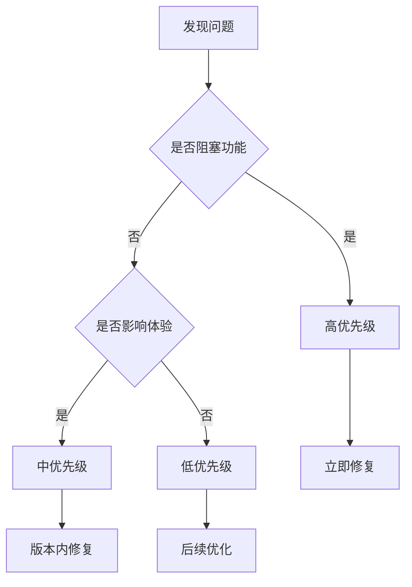
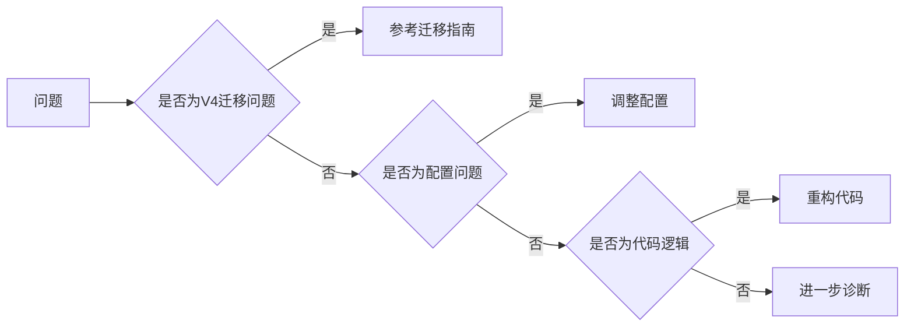
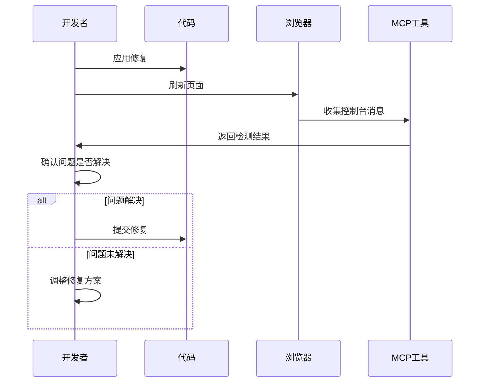
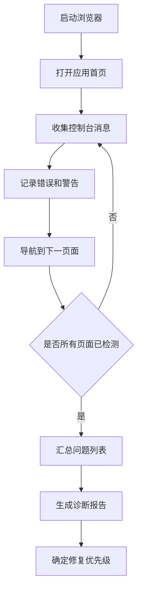
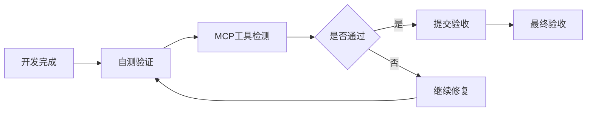

# PrimeVue V4 升级与前端问题修复设计

## 概述

本设计旨在完成两个核心目标：
1. 确保项目中PrimeVue已完全升级至V4版本，并解决版本迁移中的所有兼容性问题
2. 使用MCP浏览器工具检测并修复前端页面在运行时控制台中出现的所有警告和错误

### 当前状态分析

通过代码审查发现：
- PrimeVue已升级到v4.4.1版本（package.json已确认）
- 部分代码已适配V4（如使用`@primevue/themes`和新的主题系统）
- 存在潜在的V4迁移遗留问题和运行时问题需要排查

### 目标

- 确保所有PrimeVue组件使用V4规范的API和导入方式
- 消除浏览器控制台中的所有警告和错误
- 优化组件性能和用户体验
- 确保暗黑模式和主题切换功能正常工作

---

## PrimeVue V4 迁移核心变更

### 主题系统变更

#### 变更内容
PrimeVue V4引入全新的主题系统，使用`@primevue/themes`包替代旧的CSS文件导入方式。

#### 影响范围
- 主题配置文件：`primevue.ts`
- 应用入口：`main.ts`
- 样式文件：`index.scss`及相关样式

#### 迁移策略

**配置结构**
- 使用`theme.preset`替代旧的`theme`选项
- 配置`darkModeSelector`以支持暗黑模式切换
- 设置`cssLayer`确保样式优先级正确

**样式导入**
- 移除旧版本的`primevue/resources/themes/*/theme.css`导入
- 确保仅导入`primeicons/primeicons.css`
- 主题样式由配置自动生成，无需手动导入

### 组件API变更

#### InputSwitch → ToggleSwitch

**变更原因**
PrimeVue V4中，`InputSwitch`组件已重命名为`ToggleSwitch`以更好地反映其语义。

**影响文件**
- `Layout.vue`：主题切换开关
- 其他可能使用开关组件的页面

**迁移动作**
| 迁移项 | V3写法 | V4写法 |
|--------|--------|--------|
| 导入语句 | `import InputSwitch from 'primevue/inputswitch'` | `import ToggleSwitch from 'primevue/toggleswitch'` |
| 组件使用 | `<InputSwitch v-model="value" />` | `<ToggleSwitch v-model="value" />` |
| 自动导入 | `InputSwitch` | `ToggleSwitch` |

**验证点**
- Layout.vue中已正确使用ToggleSwitch
- components.d.ts中存在InputSwitch的自动导入声明（需清理）

#### Composables导入路径

**变更内容**
PrimeVue V4中，组合式API的导入路径统一规范化。

**受影响的Composables**
| Composable | V3路径 | V4路径 |
|------------|--------|--------|
| useToast | `primevue/usetoast` | `primevue/usetoast` |
| useConfirm | `primevue/useconfirm` | `primevue/useconfirm` |

**注意事项**
- 路径可能区分大小写，需确保统一使用小写
- 必须在组件的setup函数内调用，不可在模块顶层调用

### DataTable组件变更

#### v-model绑定

**变更内容**
DataTable的选择模型绑定从`v-model`变更为`v-model:selection`。

**影响文件**
- `TaskList/index.vue`：任务列表的多选功能

**迁移前后对比**
```
旧版本：v-model="selectedTasks"
新版本：v-model:selection="selectedTasks"
```

**验证点**
- TaskList.vue已使用v-model:selection（已完成迁移）

#### 虚拟滚动配置

**变更内容**
虚拟滚动的配置方式调整，使用`virtualScrollerOptions`对象。

**配置项**
- `itemSize`：每行高度（像素）
- `scrollHeight`：滚动容器高度
- 需配合`scrollable`属性使用

### 指令注册

#### Tooltip指令

**注册位置**
在`primevue.ts`中统一注册全局指令。

**注册方式**
```
导入：import Tooltip from 'primevue/tooltip'
注册：app.directive('tooltip', Tooltip)
```

**使用场景**
- Layout.vue：导航项和按钮提示
- TaskList.vue：操作按钮提示
- 其他需要悬停提示的组件

---

## 运行时问题诊断与修复策略

### 诊断流程

#### 阶段一：环境准备

**前端服务启动**
- 进入前端目录：`src/frontEnd`
- 执行开发服务器：`pnpm dev`
- 确认服务运行在配置端口（默认5173）

**后端服务启动**
- 进入后端目录：`src/backEnd`
- 激活虚拟环境：`.venv/Scripts/activate`
- 启动服务：`uvicorn main:app --host 0.0.0.0 --port 8775`

#### 阶段二：页面访问与检测

**使用MCP浏览器工具**

**导航到应用**
- 打开前端应用首页
- 等待页面完全加载
- 确保所有资源加载完成

**检测步骤**
1. 使用`list_console_messages`工具获取所有控制台消息
2. 筛选类型：error、warn、assert
3. 记录每条消息的详细信息（消息内容、堆栈跟踪、来源文件）

**页面覆盖范围**
| 页面路径 | 功能说明 | 检测重点 |
|----------|----------|----------|
| /login | 登录页 | 表单验证、认证流程 |
| /home | 首页 | 数据展示、图表渲染 |
| /tasks | 任务列表 | DataTable、分页、排序、筛选 |
| /tasks/:id | 任务详情 | 数据加载、状态更新 |
| /config | 配置页 | 表单组件、数据持久化 |

#### 阶段三：问题分类

**错误分类体系**
| 错误类型 | 严重性 | 示例 |
|----------|--------|------|
| API导入错误 | 高 | Cannot import 'useToast' |
| 组件属性警告 | 中 | Unknown custom element |
| 废弃API警告 | 中 | API is deprecated |
| 样式加载警告 | 低 | CSS import failed |
| 控制台警告 | 低 | Sass division deprecation |

### 常见问题与修复方案

#### 问题类型一：Composables使用错误

**问题表现**
```
错误信息：inject() can only be used inside setup()
原因：useToast/useConfirm在模块顶层调用
```

**影响文件**
- `request.ts`：Toast实例在模块顶层创建
- 其他服务文件

**修复方案**
- 采用延迟初始化模式
- 通过`initToast()`函数在应用启动后初始化
- 在App.vue的setup中调用初始化函数

**验证方式**
- 检查控制台无inject相关错误
- 测试Toast提示功能正常工作

#### 问题类型二：自动导入配置问题

**问题表现**
```
components.d.ts包含已废弃的组件类型声明
如：InputSwitch（应为ToggleSwitch）
```

**修复方案**
- 清理node_modules和缓存
- 重新运行开发服务器触发类型文件重新生成
- 手动删除废弃的类型声明（临时方案）

**文件路径**
- `src/components.d.ts`
- `src/auto-imports.d.ts`

#### 问题类型三：Sass废弃语法警告

**问题表现**
```
警告信息：Division using / is deprecated
涉及文件：node_modules中的PrimeVue样式文件
```

**修复方案**
| 方案 | 可行性 | 说明 |
|------|--------|------|
| 升级Sass版本 | 低 | 可能引入新问题 |
| 等待PrimeVue更新 | 中 | 依赖上游修复 |
| 抑制警告 | 高 | 配置Sass quietDeps选项 |

**Vite配置调整**
```
配置位置：vite.config.ts
配置项：css.preprocessorOptions.scss.quietDeps
作用：抑制依赖包中的警告
```

#### 问题类型四：主题切换问题

**潜在问题**
- 暗黑模式切换不生效
- 主题样式未正确应用
- CSS变量未定义

**检测方法**
1. 切换主题开关
2. 检查HTML根元素class变化
3. 验证CSS变量是否正确注入
4. 确认组件样式是否响应主题

**修复要点**
- 确保`darkModeSelector`配置正确
- 验证CSS class切换逻辑
- 检查全局样式中的主题变量引用

#### 问题类型五：API请求失败

**常见场景**
- 后端服务未启动
- CORS配置问题
- 认证Token失效

**诊断步骤**
1. 使用`list_network_requests`获取网络请求
2. 检查失败的请求状态码
3. 查看请求头和响应体

**修复检查清单**
- [ ] 后端健康检查端点可访问（/api/health）
- [ ] CORS允许前端开发端口
- [ ] 本地模式检测逻辑正确
- [ ] Token存储和读取正常

---

## 检测与修复执行流程

### 第一步：启动环境

**后端服务**
- 激活虚拟环境
- 启动Uvicorn服务器
- 验证健康检查端点

**前端服务**
- 安装依赖（如需要）
- 启动Vite开发服务器
- 等待编译完成

### 第二步：MCP工具检测

**工具使用序列**

**1. 创建浏览器页面**
```
工具：new_page
参数：url = http://localhost:5173
```

**2. 导航到各个页面**
```
页面序列：
- 登录页（/login）
- 首页（/home）
- 任务列表（/tasks）
- 配置页（/config）
```

**3. 收集控制台信息**
```
工具：list_console_messages
筛选：types = ['error', 'warn']
记录：所有警告和错误的详细信息
```

**4. 收集网络请求**
```
工具：list_network_requests
关注：失败的请求（状态码4xx/5xx）
```

**5. 截图记录**
```
工具：take_screenshot
场景：错误发生的页面状态
```

### 第三步：问题分析与归类

**分析维度**
| 维度 | 分析内容 |
|------|----------|
| 来源文件 | 错误来自哪个文件或组件 |
| 错误类型 | 属于哪个问题类别 |
| 影响范围 | 影响哪些功能或页面 |
| 优先级 | 根据严重性确定修复顺序 |

**优先级矩阵**


### 第四步：制定修复方案

**方案设计要素**
- 根本原因分析
- 具体修复步骤
- 涉及文件清单
- 验证测试方法
- 潜在风险评估

**修复策略选择**


### 第五步：修复执行

**修复原则**
1. 一次修复一类问题
2. 每次修复后验证
3. 记录修复前后对比
4. 确保不引入新问题

**修复验证流程**


### 第六步：全面回归测试

**测试范围**
- 所有主要页面路由
- 核心功能流程
- 主题切换功能
- 响应式布局
- 浏览器兼容性

**测试用例**
| 测试项 | 验证点 | 预期结果 |
|--------|--------|----------|
| 页面加载 | 无控制台错误 | 所有页面正常加载 |
| 组件渲染 | 无组件警告 | 组件正确显示 |
| 用户交互 | 功能正常 | 所有交互响应正确 |
| 主题切换 | 样式切换 | 明暗主题无缝切换 |
| 数据请求 | API调用成功 | 数据正常加载和更新 |

---

## 预期问题清单与修复指引

### 核心问题预测

基于代码分析，预计可能遇到以下问题：

#### 预测问题1：ToggleSwitch已正确使用但类型声明冲突

**现象**
- Layout.vue已使用ToggleSwitch
- components.d.ts包含InputSwitch声明
- 可能导致类型检查警告

**修复指引**
- 删除components.d.ts中的InputSwitch声明
- 或重新生成类型声明文件
- 验证TypeScript编译无错误

#### 预测问题2：useToast初始化时机问题

**现象**
- request.ts在模块顶层调用useToast
- 可能导致inject错误

**现状验证**
- 代码已实现initToast延迟初始化模式
- App.vue中已调用initToast()
- 理论上应无此问题，需实际验证

#### 预测问题3：DataTable性能警告

**现象**
- 大数据量时渲染性能问题
- 虚拟滚动配置不当

**优化方向**
- 验证virtualScrollerOptions配置
- 调整itemSize与实际行高匹配
- 启用分页减少单页数据量

#### 预测问题4：Sass除法运算警告

**现象**
```
Warning: Using / for division outside of calc() is deprecated
```

**来源**
- node_modules中的PrimeVue或依赖包
- 非项目代码，无法直接修改

**解决方案**
- 在vite.config.ts中配置quietDeps
- 或在package.json中添加Sass配置
- 抑制第三方包的警告

---

## 配置优化建议

### Vite配置增强

**Sass选项配置**
```
位置：vite.config.ts
新增配置项：
- css.preprocessorOptions.scss.quietDeps: true
- css.preprocessorOptions.scss.api: 'modern'

作用：
- quietDeps：抑制依赖包中的Sass警告
- api：使用现代Sass API
```

**开发体验优化**
```
配置项：
- server.open: true（自动打开浏览器）
- server.strictPort: false（端口被占用时自动切换）

优化效果：
- 提升开发启动体验
- 避免端口冲突问题
```

### PrimeVue配置完善

**Ripple效果**
- 当前已启用：`ripple: true`
- 适用于按钮点击效果

**输入框样式**
- 当前配置：`inputStyle: 'outlined'`
- 统一输入框外观

**主题配置验证**
- 确认preset正确设置为Lara
- darkModeSelector与代码中class切换一致
- cssLayer配置确保样式优先级

---

## 测试验证标准

### 控制台清洁标准

**零错误标准**
- 无JavaScript运行时错误
- 无未捕获的Promise异常
- 无组件渲染错误

**警告容忍度**
- 允许第三方库的废弃警告（已抑制）
- 不允许项目代码产生的警告
- 开发模式特有的提示可保留

### 功能完整性验证

**认证流程**
- 本地模式自动登录
- 远程模式Token认证
- 登出功能正常

**任务管理**
- 任务列表加载和刷新
- 任务筛选和排序
- 任务详情查看
- 任务创建和删除

**配置管理**
- 配置项读取和保存
- 刷新间隔调整生效
- 配置持久化

**主题切换**
- 亮色/暗色主题切换
- 主题状态持久化
- 所有组件主题适配

### 性能指标

**页面加载**
- 首屏加载时间 < 2秒
- 路由切换延迟 < 300ms

**交互响应**
- 按钮点击响应 < 100ms
- 表格排序/筛选 < 500ms

**资源优化**
- 代码分割合理
- 静态资源压缩
- 网络请求最小化

---

## 检测工具使用指南

### MCP Chrome DevTools工具

**关键工具函数**

**new_page**
- 用途：创建新的浏览器标签页
- 参数：url（应用地址）
- 返回：页面索引

**navigate_page**
- 用途：导航到指定URL
- 参数：url、timeout
- 适用：页面间跳转

**take_snapshot**
- 用途：获取页面可访问性树结构
- 返回：元素列表及uid
- 适用：定位页面元素

**list_console_messages**
- 用途：获取控制台消息
- 参数：types（过滤消息类型）、pageSize、pageIdx
- 返回：消息列表及详细信息

**get_console_message**
- 用途：获取单条消息详情
- 参数：msgid
- 返回：消息完整信息（含堆栈）

**list_network_requests**
- 用途：获取网络请求列表
- 参数：resourceTypes、pageSize
- 返回：请求列表

**get_network_request**
- 用途：获取单个请求详情
- 参数：reqid
- 返回：请求/响应完整信息

**take_screenshot**
- 用途：截取页面或元素截图
- 参数：format、quality、fullPage
- 返回：图片数据

### 检测脚本流程



### 问题记录模板

**问题记录结构**
| 字段 | 说明 |
|------|------|
| 问题ID | 唯一标识 |
| 页面路径 | 问题出现的页面 |
| 问题类型 | error/warn |
| 消息内容 | 完整错误或警告信息 |
| 堆栈跟踪 | 如果有的话 |
| 来源文件 | 触发问题的文件和行号 |
| 优先级 | 高/中/低 |
| 状态 | 待修复/修复中/已修复/已验证 |

---

## 风险控制

### 潜在风险

**依赖兼容性风险**
- PrimeVue V4与其他依赖的兼容性
- TypeScript版本要求
- Vite插件兼容性

**缓存问题**
- 浏览器缓存导致旧版本组件
- 开发服务器热更新失效
- Node modules缓存

**回归风险**
- 修复一个问题引入新问题
- 组件行为改变影响用户体验
- 性能优化导致功能异常

### 风险缓解措施

**版本锁定**
- 使用pnpm-lock.yaml锁定依赖版本
- 避免自动升级依赖
- 记录关键依赖版本号

**缓存清理**
```
清理步骤：
1. 停止开发服务器
2. 删除node_modules/.vite缓存
3. 清除浏览器缓存（硬性重新加载）
4. 重启开发服务器
```

**渐进式修复**
- 按优先级逐个修复
- 每次修复后充分测试
- 保留修复前的代码备份

**回滚机制**
- 使用Git分支进行修复
- 关键节点提交commit
- 问题严重时可快速回滚

---

## 成功标准

### 定义完成

当满足以下所有条件时，认为任务完成：

**1. PrimeVue V4迁移完成**
- [ ] 所有组件使用V4规范的API
- [ ] 主题系统配置正确
- [ ] 无V3遗留代码和配置

**2. 控制台清洁**
- [ ] 所有页面无JavaScript错误
- [ ] 无项目代码产生的警告
- [ ] 第三方警告已合理抑制

**3. 功能正常**
- [ ] 所有页面可正常访问
- [ ] 核心功能流程无障碍
- [ ] 主题切换功能正常
- [ ] 数据交互正常

**4. 性能达标**
- [ ] 页面加载性能符合指标
- [ ] 交互响应流畅
- [ ] 无明显性能警告

**5. 代码质量**
- [ ] TypeScript编译无错误
- [ ] 代码符合项目规范
- [ ] 注释和文档完整

### 验收流程



**验收检查点**
1. 在多个浏览器中测试（Chrome、Firefox、Edge）
2. 测试不同屏幕尺寸（桌面、平板、移动）
3. 验证暗黑模式和亮色模式
4. 模拟网络波动和后端错误
5. 长时间运行稳定性测试
