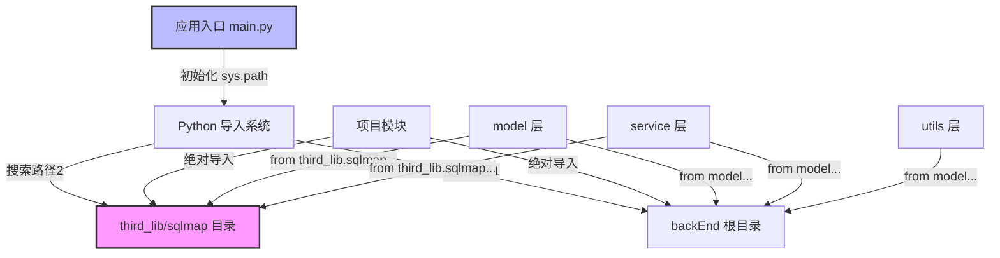
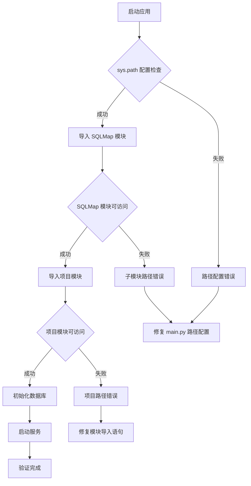
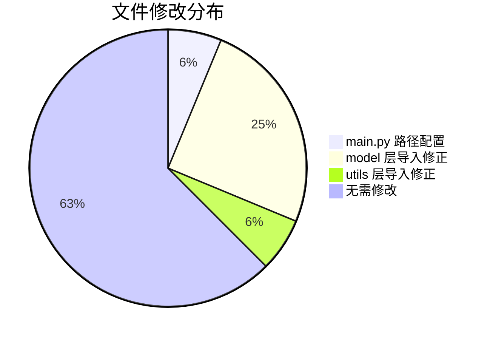

# SQLMap WebUI 导入路径修复设计

## 概述

本设计文档解决 SQLMap WebUI 项目中存在的 Python 模块导入路径问题。项目将 SQLMap 作为 Git 子模块集成在 `third_lib/sqlmap` 目录下,但当前导入路径混乱导致多处导入错误。设计目标是在不修改子模块代码的前提下,统一规范所有导入路径,确保项目正常运行。

### 问题现状

| 问题类别 | 具体表现 | 影响范围 |
|---------|---------|---------|
| 导入路径不一致 | 同时存在相对导入(`from ..third_lib.sqlmap`)和绝对导入(`from third_lib.sqlmap`) | 多个模块文件 |
| sys.path 配置混乱 | main.py 中存在多种路径配置尝试,包括注释掉的错误配置 | 启动入口 |
| 子模块约束 | SQLMap 作为 Git 子模块,其内部代码不能修改 | third_lib/sqlmap 目录 |
| 循环依赖风险 | 部分模块间存在潜在的相互引用 | model 和 service 层 |

### 设计目标

- 统一所有 SQLMap 相关导入路径为绝对导入形式
- 清理和规范 sys.path 配置,确保路径优先级正确
- 保持 Git 子模块代码完整性,不做任何修改
- 消除跨模块导入的歧义和潜在错误

## 架构设计

### 导入路径策略

系统采用分层导入策略,区分子模块导入和项目内部导入:



#### 路径配置规则

| 配置项 | 值 | 说明 |
|-------|-----|------|
| 项目根路径 | `e:\devs\python-devs\pycharm-devs\sqlmapWebUI\src\backEnd` | 所有项目模块的基准路径 |
| SQLMap 子模块路径 | `{项目根路径}\third_lib\sqlmap` | 子模块独立导入路径 |
| 路径插入位置 | sys.path[0] | 最高优先级,覆盖系统默认路径 |

### 导入路径分类与规范

#### 类别一: SQLMap 子模块导入

所有从 SQLMap 子模块导入的内容统一使用绝对导入:

**规范格式**:
```
from third_lib.sqlmap.lib.core.data import logger
from third_lib.sqlmap.lib.core.common import setPaths
from third_lib.sqlmap.lib.core.enums import MKSTEMP_PREFIX
```

**适用文件**:
- main.py
- model/Database.py
- model/Task.py
- model/StdDbOut.py
- model/LogRecorder.py

#### 类别二: 项目内部模块导入

项目内部模块间的导入也采用绝对导入:

**规范格式**:
```
from model.Database import Database
from model.DataStore import DataStore
from model.TaskStatus import TaskStatus
from service.headerRuleService import HeaderRuleService
from utils.header_processor import HeaderProcessor
```

**不使用相对导入** (如 `from ..model`, `from .Database`),避免路径解析歧义。

#### 类别三: 特殊导入处理

main.py 中的动态导入需特殊处理:

| 导入语句 | 作用 | 时机 |
|---------|------|------|
| `__import__("third_lib.sqlmap.lib.utils.versioncheck")` | 版本检查,必须最先执行 | 路径配置后立即执行 |
| `from third_lib.sqlmap.sqlmap import modulePath` | 获取 SQLMap 模块路径 | 需要时按需导入 |

## 修复方案

### main.py 路径初始化重构

#### 当前配置问题

```mermaid
graph LR
    A[注释掉的错误配置] -->|sys.path.insert| B[字符串路径]
    C[正确配置] -->|计算绝对路径| D[os.path.join 拼接]
    D -->|检查路径| E{路径是否已在 sys.path}
    E -->|否| F[插入到 sys.path[0]]
    E -->|是| G[跳过]
```

#### 重构后配置流程

| 步骤 | 操作 | 代码意图 |
|-----|------|---------|
| 1 | 获取当前文件绝对路径 | `os.path.abspath(__file__)` |
| 2 | 提取 backEnd 目录路径 | `os.path.dirname()` |
| 3 | 拼接 SQLMap 子模块路径 | `os.path.join(current_dir, "third_lib", "sqlmap")` |
| 4 | 插入到 sys.path 最前 | `sys.path.insert(0, sqlmap_path)` |
| 5 | 添加 backEnd 根目录 | `sys.path.insert(0, current_dir)` |

**配置清理要点**:
- 删除所有注释掉的旧路径配置代码
- 移除 sys.path.append() 形式的配置(优先级过低)
- 确保路径配置在任何非标准库导入之前完成

### 各模块导入路径修正

#### model/Task.py 修正

**问题导入** (第 5-13 行):
```
from TaskStatus import TaskStatus
from ..third_lib.sqlmap.lib.core.datatype import AttribDict
from Database import Database
```

**修正后**:
```
from third_lib.sqlmap.lib.core.datatype import AttribDict
from third_lib.sqlmap.lib.core.optiondict import optDict
from third_lib.sqlmap.lib.core.common import unArrayizeValue
from third_lib.sqlmap.lib.core.defaults import _defaults
from third_lib.sqlmap.lib.core.enums import MKSTEMP_PREFIX
from third_lib.sqlmap.lib.core.common import saveConfig
from third_lib.sqlmap.lib.core.subprocessng import Popen
from third_lib.sqlmap.lib.core.settings import IS_WIN
from third_lib.sqlmap.lib.core.data import logger

from model.TaskStatus import TaskStatus
from model.Database import Database
from model.DataStore import DataStore
```

| 导入类型 | 修正前 | 修正后 | 原因 |
|---------|-------|-------|------|
| SQLMap 模块 | `from ..third_lib.sqlmap.lib` | `from third_lib.sqlmap.lib` | 相对导入改绝对导入 |
| 项目模块 | `from TaskStatus` | `from model.TaskStatus` | 补全模块路径 |
| 项目模块 | `from Database` | `from model.Database` | 补全模块路径 |

#### model/Database.py 修正

**问题导入** (第 4-5 行):
```
from third_lib.sqlmap.lib.core.data import logger
from third_lib.sqlmap.lib.core.common import getSafeExString
```

**修正策略**:
该文件导入已是正确的绝对导入形式,无需修改,但需确保 main.py 的路径配置先于此文件加载。

#### utils/task_monitor.py 修正

**问题导入** (第 2-4 行):
```
from ..model.TaskStatus import TaskStatus
from ..third_lib.sqlmap.lib.core.data import logger
from ..model.DataStore import DataStore
```

**修正后**:
```
from model.TaskStatus import TaskStatus
from third_lib.sqlmap.lib.core.data import logger
from model.DataStore import DataStore
```

#### model/StdDbOut.py 修正

**问题导入** (第 2-8 行):
```
from ..third_lib.sqlmap.lib.core.enums import CONTENT_STATUS
from ..third_lib.sqlmap.lib.core.data import kb
```

**修正后**:
```
from third_lib.sqlmap.lib.core.enums import CONTENT_STATUS
from third_lib.sqlmap.lib.core.data import kb
from third_lib.sqlmap.lib.core.dicts import PART_RUN_CONTENT_TYPES
from third_lib.sqlmap.lib.core.data import conf
from third_lib.sqlmap.lib.core.compat import xrange
from third_lib.sqlmap.lib.core.convert import dejsonize
from third_lib.sqlmap.lib.core.convert import jsonize
```

#### model/LogRecorder.py 修正

**问题导入** (第 3 行):
```
from ..third_lib.sqlmap.lib.core.data import conf
```

**修正后**:
```
from third_lib.sqlmap.lib.core.data import conf
```

### 修正范围总结

| 文件路径 | 需要修正的导入数量 | 修正类型 |
|---------|------------------|---------|
| main.py | 路径配置清理 | 删除注释,规范配置 |
| model/Task.py | 13 行 | 相对改绝对,补全路径 |
| model/StdDbOut.py | 7 行 | 相对改绝对 |
| model/LogRecorder.py | 1 行 | 相对改绝对 |
| model/Database.py | 0 行 | 已正确 |
| utils/task_monitor.py | 3 行 | 相对改绝对 |

## 验证策略

### 导入验证流程



### 验证检查点

| 检查项 | 验证方法 | 预期结果 |
|-------|---------|---------|
| sys.path 配置 | 在 main.py 打印 sys.path | backEnd 目录和 sqlmap 目录在列表前两位 |
| SQLMap 导入 | 导入 logger 并输出日志 | 无 ImportError,日志正常输出 |
| 项目模块导入 | 导入 Database 并实例化 | 无 ImportError,对象创建成功 |
| 循环依赖检查 | 静态分析工具扫描 | 无循环依赖警告 |
| 应用启动 | 运行 main.py | 服务正常启动,监听 8775 端口 |

### 测试用例

#### 测试用例 1: 路径配置验证

**目标**: 确认 sys.path 配置正确

**验证步骤**:
1. 在 main.py 路径配置后添加打印语句
2. 检查 backEnd 目录路径是否在 sys.path[0]
3. 检查 sqlmap 目录路径是否在 sys.path[1]

**通过标准**: 两个路径都存在且顺序正确

#### 测试用例 2: SQLMap 模块导入验证

**目标**: 确认可以成功导入 SQLMap 子模块

**验证步骤**:
1. 尝试导入 `from third_lib.sqlmap.lib.core.data import logger`
2. 调用 logger.info() 输出测试日志
3. 检查是否有 ImportError 或 ModuleNotFoundError

**通过标准**: 导入成功,日志正常输出

#### 测试用例 3: 项目模块交叉导入验证

**目标**: 确认项目内部模块可以相互导入

**验证步骤**:
1. 从 Task 模块导入 DataStore
2. 从 DataStore 导入 SessionHeaderManager
3. 验证对象实例化成功

**通过标准**: 无导入错误,对象创建正常

#### 测试用例 4: 完整应用启动验证

**目标**: 确认应用可以完整启动

**验证步骤**:
1. 执行 `python main.py`
2. 检查日志输出是否包含 "IPC database initialized"
3. 检查服务是否监听在 127.0.0.1:8775
4. 访问 /version 接口获取版本信息

**通过标准**: 应用启动无错误,接口响应正常

## 风险评估

### 修改风险

| 风险项 | 风险等级 | 缓解措施 |
|-------|---------|---------|
| 修改后其他模块无法导入 | 中 | 全局搜索所有导入语句,统一修正 |
| 子模块路径在不同环境下失效 | 低 | 使用 os.path 动态计算绝对路径 |
| 循环依赖导致启动失败 | 低 | 使用延迟导入(在函数内部导入) |
| Git 子模块更新后路径失效 | 低 | 路径基于目录结构,与子模块版本无关 |

### 兼容性考虑

| 环境因素 | 兼容性策略 |
|---------|-----------|
| Windows/Linux 路径分隔符 | 使用 os.path.join() 自动适配 |
| Python 版本差异 | 绝对导入兼容 Python 3.x 所有版本 |
| 虚拟环境隔离 | sys.path 配置在虚拟环境内部生效 |
| IDE 静态检查 | 绝对导入可被 IDE 正确识别 |

## 实施影响

### 代码变更范围



### 变更影响分析

| 影响维度 | 影响描述 | 影响程度 |
|---------|---------|---------|
| 功能影响 | 修复导入错误,不改变业务逻辑 | 无 |
| 性能影响 | 导入路径优化后查找更快 | 正向提升 |
| 依赖影响 | 不涉及外部依赖变更 | 无 |
| 部署影响 | 需要更新部署文档说明路径结构 | 低 |

### 回滚方案

若修改后出现问题,回滚步骤:

1. 通过 Git 恢复修改前的文件版本
2. 检查 .gitmodules 确认子模块未被修改
3. 重新启动应用验证
4. 若问题仍存在,检查是否有环境变量或系统路径影响

## 后续维护

### 导入规范文档

建议在项目根目录创建 `IMPORT_GUIDELINES.md` 文档,明确规定:

| 规范项 | 规则 |
|-------|------|
| SQLMap 导入 | 必须使用 `from third_lib.sqlmap.lib...` 形式 |
| 项目导入 | 必须使用完整模块路径,如 `from model.xxx` |
| 禁止使用 | 相对导入 `from ..xxx` 或 `from .xxx` |
| 新增模块 | 必须在 backEnd 目录下,使用绝对导入 |

### IDE 配置建议

为确保开发环境一致,建议配置:

**PyCharm 配置**:
- 将 `src/backEnd` 标记为 Sources Root
- 将 `src/backEnd/third_lib/sqlmap` 添加到 Content Root
- 启用代码检查规则:禁止相对导入

**VSCode 配置**:
在 .vscode/settings.json 中添加:
```
{
  "python.analysis.extraPaths": [
    "src/backEnd",
    "src/backEnd/third_lib/sqlmap"
  ]
}
```

### 持续集成检查

建议在 CI/CD 流程中添加导入检查:

| 检查类型 | 工具 | 检查内容 |
|---------|------|---------|
| 静态导入分析 | pylint | 检测相对导入和循环依赖 |
| 导入路径验证 | 自定义脚本 | 确保所有导入使用绝对路径 |
| 子模块完整性 | git submodule status | 确认子模块未被修改 |