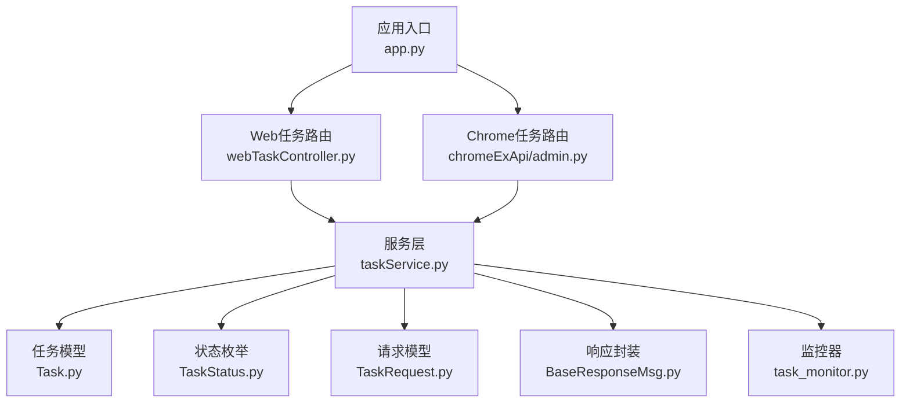
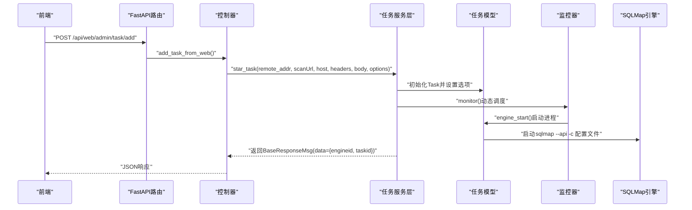
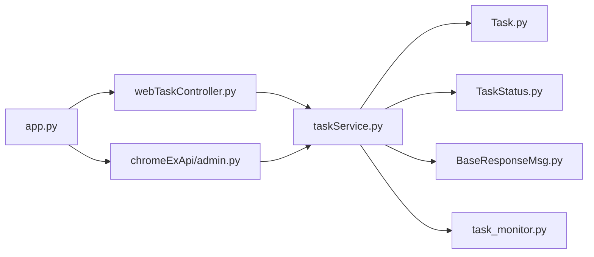

# Web任务API

<cite>
**本文引用的文件**
- [app.py](file://src/backEnd/app.py)
- [webTaskController.py](file://src/backEnd/api/commonApi/webTaskController.py)
- [admin.py](file://src/backEnd/api/chromeExApi/admin.py)
- [taskService.py](file://src/backEnd/service/taskService.py)
- [Task.py](file://src/backEnd/model/Task.py)
- [TaskStatus.py](file://src/backEnd/model/TaskStatus.py)
- [TaskRequest.py](file://src/backEnd/model/requestModel/TaskRequest.py)
- [BaseResponseMsg.py](file://src/backEnd/model/BaseResponseMsg.py)
- [task_monitor.py](file://src/backEnd/utils/task_monitor.py)
- [task.ts](file://src/frontEnd/src/types/task.ts)
- [README.md](file://src/backEnd/README.md)
</cite>

## 目录
1. [简介](#简介)
2. [项目结构](#项目结构)
3. [核心组件](#核心组件)
4. [架构总览](#架构总览)
5. [详细组件分析](#详细组件分析)
6. [依赖关系分析](#依赖关系分析)
7. [性能考量](#性能考量)
8. [故障排查指南](#故障排查指南)
9. [结论](#结论)
10. [附录](#附录)

## 简介
本文件为Web任务API的完整参考文档，聚焦于webTaskController.py中实现的任务管理接口，覆盖任务创建、启动、停止、删除、状态查询、日志与结果获取等能力，并对任务请求模型、状态机转换、实时监控机制及大规模任务管理最佳实践进行深入解析，帮助开发者构建高效稳定的自动化扫描系统。

## 项目结构
后端采用FastAPI框架，路由按功能模块划分：
- 应用入口与CORS：app.py
- Web任务控制器：webTaskController.py
- Chrome扩展任务控制器：chromeExApi/admin.py
- 服务层：taskService.py
- 模型层：Task.py、TaskStatus.py、TaskRequest.py、BaseResponseMsg.py
- 实时监控：task_monitor.py
- 前端类型定义：frontEnd/src/types/task.ts
- API端点概览：README.md

图表来源
- [app.py](file://src/backEnd/app.py#L1-L80)
- [webTaskController.py](file://src/backEnd/api/commonApi/webTaskController.py#L1-L91)
- [admin.py](file://src/backEnd/api/chromeExApi/admin.py#L1-L145)
- [taskService.py](file://src/backEnd/service/taskService.py#L1-L535)
- [Task.py](file://src/backEnd/model/Task.py#L1-L333)
- [TaskStatus.py](file://src/backEnd/model/TaskStatus.py#L1-L9)
- [TaskRequest.py](file://src/backEnd/model/requestModel/TaskRequest.py#L1-L57)
- [BaseResponseMsg.py](file://src/backEnd/model/BaseResponseMsg.py#L1-L21)
- [task_monitor.py](file://src/backEnd/utils/task_monitor.py#L1-L94)

章节来源
- [app.py](file://src/backEnd/app.py#L1-L80)
- [README.md](file://src/backEnd/README.md#L133-L163)

## 核心组件
- Web任务控制器：提供Web端任务创建接口，复用服务层逻辑，统一日志来源标记。
- Chrome任务控制器：提供完整的任务生命周期管理接口（创建、列表、停止、删除、清空、搜索、日志、结果、配置等）。
- 任务服务层：负责参数校验、任务池管理、状态转换、进程启动与终止、结果与日志查询。
- 任务模型：封装任务状态、选项、请求文件生成、SQLMap引擎交互。
- 状态机：New → Runnable → Running → Terminated/Blocked。
- 响应封装：统一返回结构，便于前后端对接。
- 实时监控：基于CPU负载与任务池大小的动态调度。

章节来源
- [webTaskController.py](file://src/backEnd/api/commonApi/webTaskController.py#L1-L91)
- [admin.py](file://src/backEnd/api/chromeExApi/admin.py#L1-L145)
- [taskService.py](file://src/backEnd/service/taskService.py#L1-L535)
- [Task.py](file://src/backEnd/model/Task.py#L1-L333)
- [TaskStatus.py](file://src/backEnd/model/TaskStatus.py#L1-L9)
- [BaseResponseMsg.py](file://src/backEnd/model/BaseResponseMsg.py#L1-L21)
- [task_monitor.py](file://src/backEnd/utils/task_monitor.py#L1-L94)

## 架构总览
Web任务API通过FastAPI路由暴露REST接口，请求经控制器进入服务层，服务层协调任务模型与外部SQLMap引擎，同时维护任务池与状态机，最终以统一响应封装返回。

图表来源
- [webTaskController.py](file://src/backEnd/api/commonApi/webTaskController.py#L19-L91)
- [taskService.py](file://src/backEnd/service/taskService.py#L58-L88)
- [Task.py](file://src/backEnd/model/Task.py#L258-L333)
- [task_monitor.py](file://src/backEnd/utils/task_monitor.py#L36-L94)

## 详细组件分析

### Web任务控制器（Web端任务创建）
- 路由前缀：/api/web/admin
- 接口：POST /task/add
- 输入：TaskAddRequest（scanUrl、host、headers、body、options）
- 行为：
  - 校验options必填
  - 记录Web来源日志
  - 复用taskService.star_task()创建任务
  - 返回BaseResponseMsg
- 异常：客户端地址缺失、内部异常转HTTP 500

章节来源
- [webTaskController.py](file://src/backEnd/api/commonApi/webTaskController.py#L19-L91)

### Chrome任务控制器（完整任务生命周期）
- 路由前缀：/api/chrome/admin
- 接口与用途：
  - POST /task/add：创建任务
  - DELETE /task/delete：删除任务
  - PUT /task/kill：强制终止任务
  - PUT /task/stop：暂停/阻塞任务
  - PUT /task/startBlocked：恢复被阻塞任务
  - PATCH /task/flush：清空所有任务
  - GET /task/list：列出任务
  - POST /task/findByUrlPath：按URL路径检索
  - POST /task/findByBodyKeyWord：按请求体关键字检索
  - POST /task/findByHeaderKeyWord：按请求头关键字检索
  - GET /task/logs/getLogsByTaskId：获取任务日志
  - GET /task/getPayloadDetailByTaskId：获取载荷详情
  - GET /task/getTaskHttpRequestInfoByTaskId：获取HTTP请求信息
  - GET /task/getTasksByKeyWord：按关键词聚合检索
  - GET /task/getTaskScanOptionsByTaskId：获取扫描选项
  - GET /task/getTaskErrorsByTaskId：获取错误列表

章节来源
- [admin.py](file://src/backEnd/api/chromeExApi/admin.py#L1-L145)
- [README.md](file://src/backEnd/README.md#L133-L163)

### 任务请求模型（TaskAddRequest）
- 字段说明：
  - scanUrl：扫描地址
  - host：扫描域名
  - headers：请求头列表
  - body：请求体
  - options：扫描参数配置（字典）
- 校验：options必填；TaskRequest中对各请求模型字段有长度与描述约束

章节来源
- [TaskRequest.py](file://src/backEnd/model/requestModel/TaskRequest.py#L31-L57)

### 任务服务层（taskService.py）
- 参数校验：validate_options()检查options类型与不支持选项
- 任务创建：star_task()生成taskid，写入DataStore.tasks，设置选项，置状态为Runnable
- 任务管理：
  - delete_task()：若运行中则engine_kill()，再移除
  - kill_task()：终止并置Terminated
  - stop_task()：阻塞任务或暂停运行中的任务
  - start_task_with_taskid()：将被阻塞任务置为Runnable
  - flush_task()：清空所有任务
  - list_task()：统计错误/日志/数据条数，映射状态
- 结果与日志：
  - find_task_log_by_taskid()：按任务ID查询日志
  - get_payload_detail_by_task_id()：载荷详情
  - get_task_http_request_info()：HTTP请求信息
  - get_task_scan_options()：扫描选项
  - get_task_errors_by_taskId()：错误列表

章节来源
- [taskService.py](file://src/backEnd/service/taskService.py#L23-L535)

### 任务模型（Task.py）
- 初始化：设置状态New、创建时间、解析options、应用请求头规则、生成请求文件
- 引擎交互：
  - engine_start()：应用头规则、生成请求文件、保存配置、启动sqlmap子进程
  - engine_stop()/engine_kill()：优雅/强制终止
  - engine_get_id()/engine_get_returncode()/engine_has_terminated()：进程状态查询
- 请求文件生成：根据headers/body构建HTTP原始报文，写入临时文件

章节来源
- [Task.py](file://src/backEnd/model/Task.py#L1-L333)

### 任务状态机（TaskStatus）
- 枚举：New、Runnable、Running、Blocked、Terminated
- 状态转换：
  - 新建：New
  - 启动：Runnable → Running（monitor调度）
  - 暂停：Running → Blocked
  - 恢复：Blocked → Runnable
  - 终止：Running → Terminated（engine_kill）

章节来源
- [TaskStatus.py](file://src/backEnd/model/TaskStatus.py#L1-L9)
- [task_monitor.py](file://src/backEnd/utils/task_monitor.py#L36-L94)
- [taskService.py](file://src/backEnd/service/taskService.py#L181-L216)

### 响应封装（BaseResponseMsg）
- 统一结构：code、success、message、data
- 控制器与服务层均返回该对象，便于前端统一处理

章节来源
- [BaseResponseMsg.py](file://src/backEnd/model/BaseResponseMsg.py#L1-L21)

### 实时监控（task_monitor.py）
- 动态计算最大并发任务数：结合CPU核心数与CPU使用率
- 调度策略：
  - 统计Running任务数
  - 将Runnable任务按时间窗口启动，直至达到上限
  - 对非Running任务更新为Terminated或Running

章节来源
- [task_monitor.py](file://src/backEnd/utils/task_monitor.py#L1-L94)

### 前端类型定义（task.ts）
- 定义了任务状态、任务结构、任务筛选、统计数据、载荷详情、日志与错误条目、HTTP请求信息、扫描结果等类型
- 便于前端正确展示与处理后端返回的数据

章节来源
- [task.ts](file://src/frontEnd/src/types/task.ts#L1-L122)

## 依赖关系分析
- 控制器依赖服务层：webTaskController与chromeExApi/admin均调用taskService
- 服务层依赖模型与工具：Task、TaskStatus、BaseResponseMsg、task_monitor
- 应用入口注册路由：app.py挂载web与chrome两类任务路由

图表来源
- [webTaskController.py](file://src/backEnd/api/commonApi/webTaskController.py#L1-L91)
- [admin.py](file://src/backEnd/api/chromeExApi/admin.py#L1-L145)
- [taskService.py](file://src/backEnd/service/taskService.py#L1-L535)
- [Task.py](file://src/backEnd/model/Task.py#L1-L333)
- [TaskStatus.py](file://src/backEnd/model/TaskStatus.py#L1-L9)
- [BaseResponseMsg.py](file://src/backEnd/model/BaseResponseMsg.py#L1-L21)
- [task_monitor.py](file://src/backEnd/utils/task_monitor.py#L1-L94)
- [app.py](file://src/backEnd/app.py#L1-L80)

章节来源
- [app.py](file://src/backEnd/app.py#L1-L80)
- [webTaskController.py](file://src/backEnd/api/commonApi/webTaskController.py#L1-L91)
- [admin.py](file://src/backEnd/api/chromeExApi/admin.py#L1-L145)
- [taskService.py](file://src/backEnd/service/taskService.py#L1-L535)

## 性能考量
- 并发控制：监控器根据CPU使用率与核心数动态确定最大并发任务数，避免资源争用导致性能下降
- 启动节流：monitor在启动Runnable任务时引入时间窗口，防止瞬时大量进程启动
- 数据库访问：list_task与日志查询涉及数据库读取，建议合理索引与分页
- 请求文件生成：HTTP原始报文写入磁盘，注意I/O开销；可考虑优化临时目录与清理策略
- 选项校验：服务层对不支持选项进行拦截，避免无效参数导致引擎异常

章节来源
- [task_monitor.py](file://src/backEnd/utils/task_monitor.py#L1-L94)
- [taskService.py](file://src/backEnd/service/taskService.py#L102-L179)

## 故障排查指南
- 任务创建失败（options缺失）：检查TaskAddRequest.options是否传入且非None
- 无法获取客户端地址：Web控制器会返回错误提示，确认反向代理或容器网络配置
- 任务未启动：确认monitor是否达到最大并发限制；查看任务状态是否仍为Runnable
- 任务被终止：若engine_has_terminated()为真，状态会被置为Terminated
- 日志为空：确认数据库连接初始化；检查任务是否存在
- 错误列表为空：确认数据库中errors表是否包含对应任务ID

章节来源
- [webTaskController.py](file://src/backEnd/api/commonApi/webTaskController.py#L42-L91)
- [taskService.py](file://src/backEnd/service/taskService.py#L102-L179)
- [Task.py](file://src/backEnd/model/Task.py#L318-L333)

## 结论
Web任务API通过清晰的控制器、服务层与模型层分工，提供了从任务创建到结果查询的全链路能力。借助统一响应封装与状态机管理，系统具备良好的可维护性与可观测性。配合实时监控与并发控制，可在大规模场景下稳定运行。

## 附录

### API规范与示例

- 基本约定
  - 路由前缀：
    - Web端：/api/web/admin
    - Chrome端：/api/chrome/admin
  - 统一响应：code、success、message、data
  - 认证：各接口均依赖用户认证中间件

- 任务创建（Web端）
  - 方法与路径：POST /api/web/admin/task/add
  - 请求体：TaskAddRequest
    - scanUrl：目标URL
    - host：目标域名
    - headers：请求头列表
    - body：请求体
    - options：扫描参数（字典，必填）
  - 成功响应：data包含engineid与taskid
  - 失败响应：options缺失或客户端地址不可用时返回错误

- 任务创建（Chrome端）
  - 方法与路径：POST /api/chrome/admin/task/add
  - 请求体：TaskAddRequest（同上）
  - 成功响应：data包含engineid与taskid

- 任务管理（Chrome端）
  - 列表：GET /api/chrome/admin/task/list
  - 删除：DELETE /api/chrome/admin/task/delete?taskid={taskId}
  - 强制终止：PUT /api/chrome/admin/task/kill?taskid={taskId}
  - 暂停：PUT /api/chrome/admin/task/stop?taskid={taskId}
  - 恢复：PUT /api/chrome/admin/task/startBlocked?taskid={taskId}
  - 清空：PATCH /api/chrome/admin/task/flush
  - 关键词检索：GET /api/chrome/admin/task/getTasksByKeyWord?keyword={keyword}

- 结果与日志（Chrome端）
  - 日志：GET /api/chrome/admin/task/logs/getLogsByTaskId?taskId={taskId}
  - 载荷详情：GET /api/chrome/admin/task/getPayloadDetailByTaskId?taskId={taskId}
  - HTTP请求信息：GET /api/chrome/admin/task/getTaskHttpRequestInfoByTaskId?taskId={taskId}
  - 扫描选项：GET /api/chrome/admin/task/getTaskScanOptionsByTaskId?taskId={taskId}
  - 错误列表：GET /api/chrome/admin/task/getTaskErrorsByTaskId?taskId={taskId}

- 请求模型字段说明
  - TaskAddRequest：scanUrl、host、headers、body、options
  - TaskDeleteRequest/TaskStopRequest：taskid（固定长度约束）
  - TaskUpdateRequest：taskid、options
  - TaskQueryRequest：taskid
  - TaskLogQueryRequest：taskId
  - 其他检索模型：urlPath、bodyKeyWord、headerKeyWord

- 任务状态映射
  - 后端状态：New、Runnable、Running、Blocked、Terminated
  - 前端状态：PENDING、RUNNING、SUCCESS、FAILED、STOPPED、TERMINATED
  - 映射逻辑：服务层在list_task时将非Running任务根据engine_has_terminated()映射为Running或Terminated

- 创建完整扫描任务的示例（概念流程）
  - cURL风格：构造包含scanUrl、host、headers、body、options的JSON，发送至POST /api/web/admin/task/add
  - 原始HTTP风格：直接构造POST请求，Content-Type: application/json，Body为TaskAddRequest对象
  - 注意事项：
    - options必须为字典且包含有效扫描参数
    - headers需为合法的“键: 值”形式列表
    - 若未提供options，接口将拒绝请求

章节来源
- [webTaskController.py](file://src/backEnd/api/commonApi/webTaskController.py#L19-L91)
- [admin.py](file://src/backEnd/api/chromeExApi/admin.py#L1-L145)
- [TaskRequest.py](file://src/backEnd/model/requestModel/TaskRequest.py#L1-L57)
- [taskService.py](file://src/backEnd/service/taskService.py#L102-L179)
- [task.ts](file://src/frontEnd/src/types/task.ts#L1-L122)
- [README.md](file://src/backEnd/README.md#L133-L163)