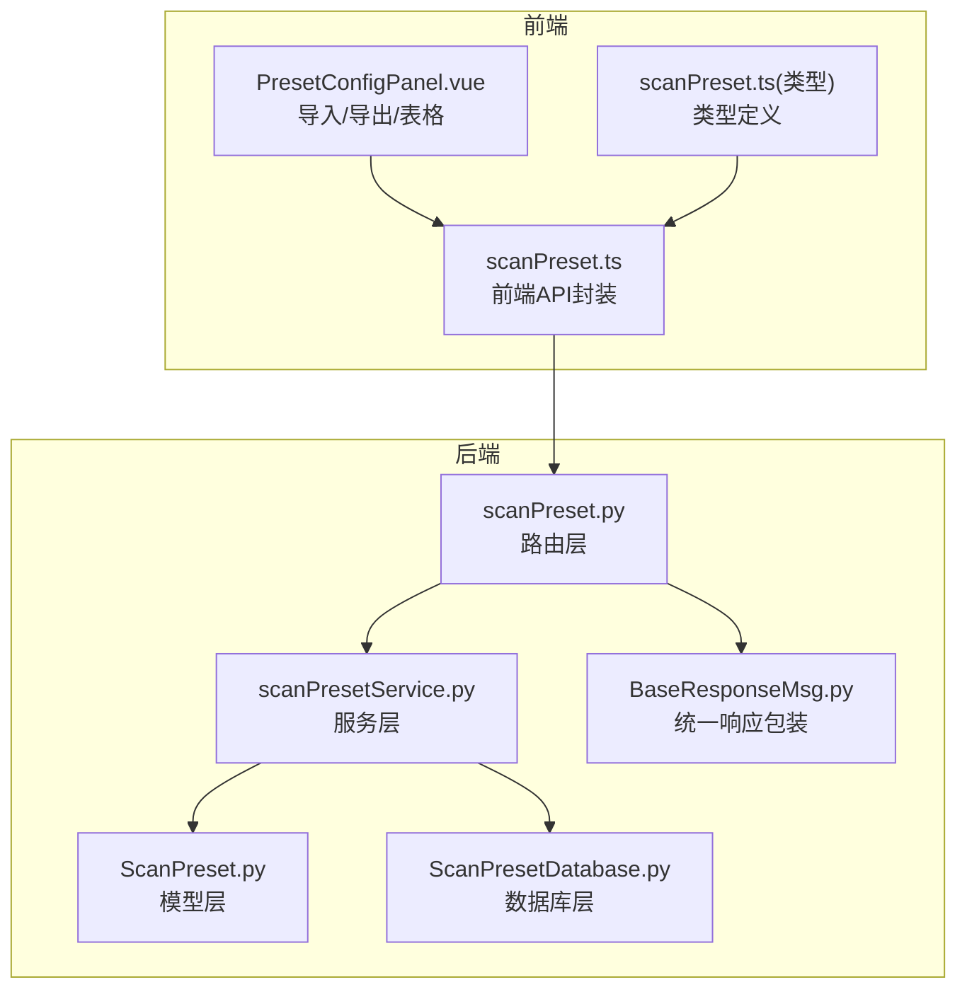
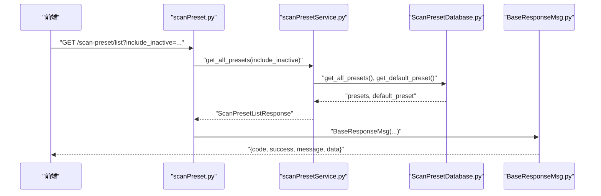
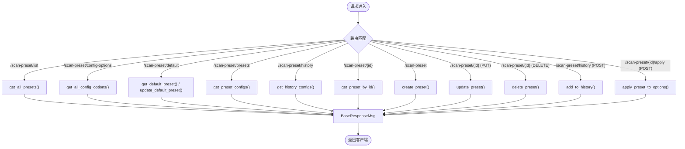
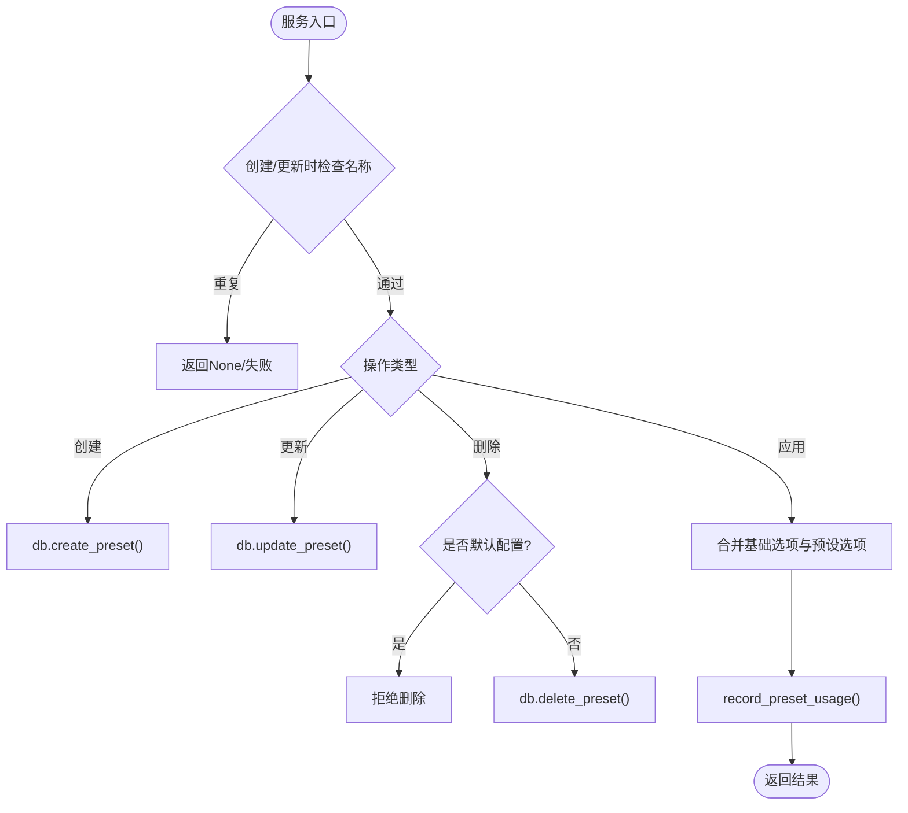
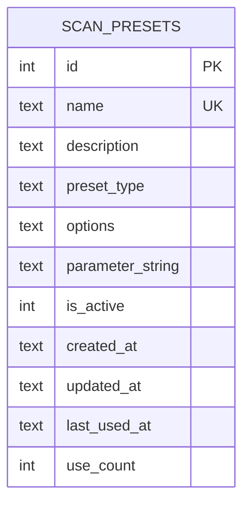
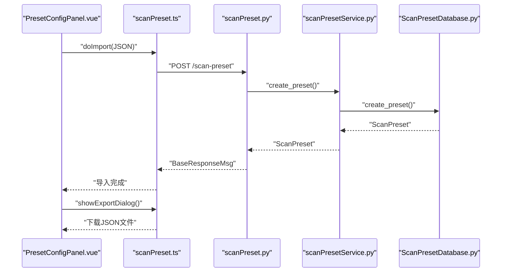
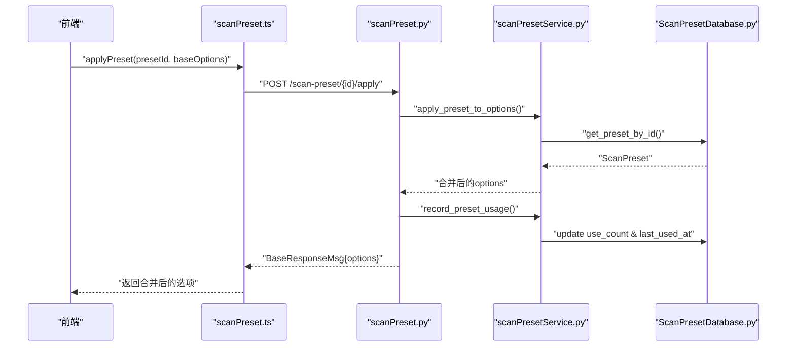
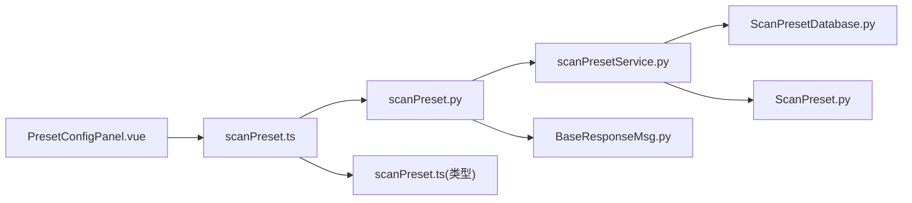

# 扫描预设API

<cite>
**本文引用的文件**
- [scanPreset.py](file://src/backEnd/api/commonApi/scanPreset.py)
- [scanPresetService.py](file://src/backEnd/service/scanPresetService.py)
- [ScanPreset.py](file://src/backEnd/model/ScanPreset.py)
- [ScanPresetDatabase.py](file://src/backEnd/model/ScanPresetDatabase.py)
- [scanPreset.ts](file://src/frontEnd/src/api/scanPreset.ts)
- [scanPreset.ts（类型定义）](file://src/frontEnd/src/types/scanPreset.ts)
- [PresetConfigPanel.vue](file://src/frontEnd/src/views/Config/components/PresetConfigPanel.vue)
- [BaseResponseMsg.py](file://src/backEnd/model/BaseResponseMsg.py)
- [README.md](file://README.md)
</cite>

## 目录
1. [简介](#简介)
2. [项目结构](#项目结构)
3. [核心组件](#核心组件)
4. [架构总览](#架构总览)
5. [详细组件分析](#详细组件分析)
6. [依赖关系分析](#依赖关系分析)
7. [性能考量](#性能考量)
8. [故障排查指南](#故障排查指南)
9. [结论](#结论)
10. [附录](#附录)

## 简介
本文件系统化梳理后端扫描预设API的实现与数据结构，覆盖默认配置、常用配置、历史配置的创建、查询、更新、删除与应用接口；详述预设配置与扫描任务的关联机制；提供导入导出接口说明与使用示例；解释预设冲突解决策略与版本管理建议。文档面向后端开发者与前端集成人员，兼顾非技术读者的理解需求。

## 项目结构
后端采用FastAPI路由层、服务层、模型层与数据库层分离的设计：
- 路由层：统一挂载在“/scan-preset”前缀下，提供REST接口
- 服务层：封装业务逻辑，协调数据库访问与校验
- 模型层：定义预设数据结构、枚举与序列化行为
- 数据库层：基于SQLite的持久化，提供CRUD、历史清理与默认配置初始化



图表来源
- [scanPreset.py](file://src/backEnd/api/commonApi/scanPreset.py#L1-L325)
- [scanPresetService.py](file://src/backEnd/service/scanPresetService.py#L1-L182)
- [ScanPreset.py](file://src/backEnd/model/ScanPreset.py#L1-L231)
- [ScanPresetDatabase.py](file://src/backEnd/model/ScanPresetDatabase.py#L1-L514)
- [BaseResponseMsg.py](file://src/backEnd/model/BaseResponseMsg.py#L1-L21)
- [scanPreset.ts](file://src/frontEnd/src/api/scanPreset.ts#L1-L145)
- [scanPreset.ts（类型定义）](file://src/frontEnd/src/types/scanPreset.ts#L1-L199)
- [PresetConfigPanel.vue](file://src/frontEnd/src/views/Config/components/PresetConfigPanel.vue#L420-L606)

章节来源
- [scanPreset.py](file://src/backEnd/api/commonApi/scanPreset.py#L1-L325)
- [scanPresetService.py](file://src/backEnd/service/scanPresetService.py#L1-L182)
- [ScanPreset.py](file://src/backEnd/model/ScanPreset.py#L1-L231)
- [ScanPresetDatabase.py](file://src/backEnd/model/ScanPresetDatabase.py#L1-L514)
- [BaseResponseMsg.py](file://src/backEnd/model/BaseResponseMsg.py#L1-L21)
- [scanPreset.ts](file://src/frontEnd/src/api/scanPreset.ts#L1-L145)
- [scanPreset.ts（类型定义）](file://src/frontEnd/src/types/scanPreset.ts#L1-L199)
- [PresetConfigPanel.vue](file://src/frontEnd/src/views/Config/components/PresetConfigPanel.vue#L420-L606)

## 核心组件
- 路由层（FastAPI）：提供预设管理与应用接口，统一返回结构
- 服务层：封装业务规则（名称唯一性、默认配置保护、历史记录上限）
- 模型层：定义预设类型、扫描选项、创建/更新/列表响应模型
- 数据库层：SQLite持久化，初始化默认预设，维护使用计数与最近使用时间
- 前端API封装：与后端接口一一对应，提供导入/导出与参数预览能力

章节来源
- [scanPreset.py](file://src/backEnd/api/commonApi/scanPreset.py#L1-L325)
- [scanPresetService.py](file://src/backEnd/service/scanPresetService.py#L1-L182)
- [ScanPreset.py](file://src/backEnd/model/ScanPreset.py#L1-L231)
- [ScanPresetDatabase.py](file://src/backEnd/model/ScanPresetDatabase.py#L1-L514)
- [BaseResponseMsg.py](file://src/backEnd/model/BaseResponseMsg.py#L1-L21)
- [scanPreset.ts](file://src/frontEnd/src/api/scanPreset.ts#L1-L145)
- [scanPreset.ts（类型定义）](file://src/frontEnd/src/types/scanPreset.ts#L1-L199)
- [PresetConfigPanel.vue](file://src/frontEnd/src/views/Config/components/PresetConfigPanel.vue#L420-L606)

## 架构总览
后端以“路由-服务-模型-数据库”四层解耦，前端通过API封装调用后端接口，并在UI中实现导入导出与参数预览。



图表来源
- [scanPreset.py](file://src/backEnd/api/commonApi/scanPreset.py#L23-L44)
- [scanPresetService.py](file://src/backEnd/service/scanPresetService.py#L36-L46)
- [ScanPresetDatabase.py](file://src/backEnd/model/ScanPresetDatabase.py#L217-L239)
- [BaseResponseMsg.py](file://src/backEnd/model/BaseResponseMsg.py#L1-L21)

## 详细组件分析

### 1. 预设数据模型与扫描选项
- 预设类型：默认(default)、常用(preset)、历史(history)
- 扫描选项涵盖检测、注入、技术、请求、优化、枚举、通用等类别，字段与SQLMap optiondict保持一致
- 选项模型提供“仅非默认值”的压缩序列化方法，便于传输与存储
- 预设模型包含元数据：名称、描述、类型、启用状态、时间戳、使用计数与最近使用时间

```mermaid
classDiagram
class PresetType {
<<enum>>
"default"
"preset"
"history"
}
class ScanOptions {
+level : int
+risk : int
+string : str
+notString : str
+regexp : str
+code : int
+smart : bool
+textOnly : bool
+titles : bool
+testParameter : str
+skip : str
+skipStatic : bool
+paramExclude : str
+dbms : str
+os : str
+prefix : str
+suffix : str
+tamper : str
+technique : str
+timeSec : int
+timeout : int
+retries : int
+delay : float
+randomAgent : bool
+proxy : str
+tor : bool
+optimize : bool
+predictOutput : bool
+keepAlive : bool
+nullConnection : bool
+threads : int
+getBanner : bool
+getCurrentUser : bool
+getCurrentDb : bool
+getHostname : bool
+isDba : bool
+getUsers : bool
+getPasswordHashes : bool
+getPrivileges : bool
+getRoles : bool
+getDbs : bool
+getTables : bool
+getColumns : bool
+dumpTable : bool
+dumpAll : bool
+db : str
+tbl : str
+col : str
+batch : bool
+forms : bool
+crawlDepth : int
+flushSession : bool
+freshQueries : bool
+verbose : int
+to_dict() Dict
+to_full_dict() Dict
}
class ScanPreset {
+id : int
+name : str
+description : str
+preset_type : PresetType
+options : ScanOptions
+parameter_string : str
+is_active : bool
+created_at : datetime
+updated_at : datetime
+last_used_at : datetime
+use_count : int
+model_dump() Dict
}
class ScanPresetCreate {
+name : str
+description : str
+preset_type : PresetType
+options : Dict
+parameter_string : str
}
class ScanPresetUpdate {
+name : str
+description : str
+options : Dict
+parameter_string : str
+is_active : bool
}
class ScanPresetListResponse {
+presets : ScanPreset[]
+total : int
+default_preset : ScanPreset
}
ScanPreset --> ScanOptions : "包含"
ScanPresetCreate --> ScanOptions : "包含"
ScanPresetUpdate --> ScanOptions : "可选"
ScanPresetListResponse --> ScanPreset : "列表"
```

图表来源
- [ScanPreset.py](file://src/backEnd/model/ScanPreset.py#L1-L231)

章节来源
- [ScanPreset.py](file://src/backEnd/model/ScanPreset.py#L1-L231)

### 2. 路由与接口清单
- 获取所有预设配置列表（含默认配置与总数）
- 获取配置选项（默认、常用、历史三类）
- 获取默认配置
- 更新默认配置
- 获取常用配置列表
- 获取历史配置列表（带limit）
- 根据ID获取指定预设
- 创建新预设
- 更新指定预设
- 删除指定预设
- 添加到历史记录
- 应用预设配置（合并基础选项）



图表来源
- [scanPreset.py](file://src/backEnd/api/commonApi/scanPreset.py#L23-L325)
- [BaseResponseMsg.py](file://src/backEnd/model/BaseResponseMsg.py#L1-L21)

章节来源
- [scanPreset.py](file://src/backEnd/api/commonApi/scanPreset.py#L23-L325)
- [BaseResponseMsg.py](file://src/backEnd/model/BaseResponseMsg.py#L1-L21)

### 3. 服务层业务逻辑
- 获取所有预设：聚合常用与历史列表，并附带默认配置
- 获取配置选项：返回默认、常用、历史三类集合
- 默认配置保护：禁止删除默认配置；更新默认配置时仅允许修改选项
- 名称唯一性：创建/更新时检查名称冲突
- 历史记录上限：添加历史时自动清理超出限制的旧记录
- 预设使用统计：每次应用预设都会增加使用计数并更新最近使用时间



图表来源
- [scanPresetService.py](file://src/backEnd/service/scanPresetService.py#L67-L178)
- [ScanPresetDatabase.py](file://src/backEnd/model/ScanPresetDatabase.py#L350-L408)

章节来源
- [scanPresetService.py](file://src/backEnd/service/scanPresetService.py#L1-L182)
- [ScanPresetDatabase.py](file://src/backEnd/model/ScanPresetDatabase.py#L350-L408)

### 4. 数据库层与持久化
- 初始化表结构与索引，迁移添加parameter_string列
- 初始化默认预设：默认、快速扫描、深度扫描、安全扫描
- 查询与更新：按类型、启用状态、最近使用时间排序
- 历史清理：保留最近使用的若干条历史记录
- 使用统计：应用预设后更新use_count与last_used_at



图表来源
- [ScanPresetDatabase.py](file://src/backEnd/model/ScanPresetDatabase.py#L56-L81)

章节来源
- [ScanPresetDatabase.py](file://src/backEnd/model/ScanPresetDatabase.py#L1-L514)

### 5. 前端API封装与导入导出
- 前端API封装：getAllPresets、getConfigOptions、getDefaultPreset、updateDefaultPreset、getPresetConfigs、getHistoryConfigs、getPresetById、createPreset、updatePreset、deletePreset、addToHistory、applyPreset
- 导入：解析JSON，逐条创建常用预设
- 导出：将选中预设导出为包含name/description/parameter_string的JSON文件
- 参数预览：将选项转换为命令行参数字符串供预览与复制



图表来源
- [scanPreset.ts](file://src/frontEnd/src/api/scanPreset.ts#L1-L145)
- [PresetConfigPanel.vue](file://src/frontEnd/src/views/Config/components/PresetConfigPanel.vue#L420-L606)
- [scanPreset.py](file://src/backEnd/api/commonApi/scanPreset.py#L191-L215)

章节来源
- [scanPreset.ts](file://src/frontEnd/src/api/scanPreset.ts#L1-L145)
- [scanPreset.ts（类型定义）](file://src/frontEnd/src/types/scanPreset.ts#L1-L199)
- [PresetConfigPanel.vue](file://src/frontEnd/src/views/Config/components/PresetConfigPanel.vue#L420-L606)

### 6. 预设与扫描任务的关联机制
- 应用预设：后端将预设选项与基础选项合并，返回合并后的选项字典
- 前端在创建任务时可先调用“应用预设”，再传入任务创建接口
- 历史配置：每次应用预设都会记录使用次数与最近使用时间，便于后续筛选



图表来源
- [scanPreset.py](file://src/backEnd/api/commonApi/scanPreset.py#L300-L325)
- [scanPresetService.py](file://src/backEnd/service/scanPresetService.py#L156-L178)
- [ScanPresetDatabase.py](file://src/backEnd/model/ScanPresetDatabase.py#L366-L376)

章节来源
- [scanPreset.py](file://src/backEnd/api/commonApi/scanPreset.py#L300-L325)
- [scanPresetService.py](file://src/backEnd/service/scanPresetService.py#L156-L178)
- [ScanPresetDatabase.py](file://src/backEnd/model/ScanPresetDatabase.py#L366-L376)

### 7. 预设冲突解决策略与版本管理建议
- 冲突解决
  - 名称唯一性：创建/更新时若名称已存在则拒绝
  - 默认配置保护：默认配置不可删除；更新默认配置时仅允许修改选项，禁止修改名称
  - 历史记录上限：超过阈值时自动清理旧历史，保留最近使用记录
- 版本管理建议
  - 选项字段与SQLMap保持一致，避免跨版本差异导致的兼容问题
  - 导入导出JSON应包含parameter_string，便于跨平台/跨版本复用
  - 建议在升级时对历史配置进行一次“清洗”，移除不再支持的选项字段

章节来源
- [scanPresetService.py](file://src/backEnd/service/scanPresetService.py#L82-L119)
- [ScanPresetDatabase.py](file://src/backEnd/model/ScanPresetDatabase.py#L377-L408)
- [ScanPreset.py](file://src/backEnd/model/ScanPreset.py#L172-L231)

## 依赖关系分析
- 路由依赖服务层，服务层依赖数据库层与模型层
- 前端API封装依赖后端路由，类型定义与UI组件依赖类型定义
- 统一响应包装用于标准化返回结构



图表来源
- [scanPreset.ts](file://src/frontEnd/src/api/scanPreset.ts#L1-L145)
- [scanPreset.py](file://src/backEnd/api/commonApi/scanPreset.py#L1-L325)
- [scanPresetService.py](file://src/backEnd/service/scanPresetService.py#L1-L182)
- [ScanPresetDatabase.py](file://src/backEnd/model/ScanPresetDatabase.py#L1-L514)
- [ScanPreset.py](file://src/backEnd/model/ScanPreset.py#L1-L231)
- [BaseResponseMsg.py](file://src/backEnd/model/BaseResponseMsg.py#L1-L21)
- [scanPreset.ts（类型定义）](file://src/frontEnd/src/types/scanPreset.ts#L1-L199)
- [PresetConfigPanel.vue](file://src/frontEnd/src/views/Config/components/PresetConfigPanel.vue#L420-L606)

章节来源
- [scanPreset.ts](file://src/frontEnd/src/api/scanPreset.ts#L1-L145)
- [scanPreset.py](file://src/backEnd/api/commonApi/scanPreset.py#L1-L325)
- [scanPresetService.py](file://src/backEnd/service/scanPresetService.py#L1-L182)
- [ScanPresetDatabase.py](file://src/backEnd/model/ScanPresetDatabase.py#L1-L514)
- [ScanPreset.py](file://src/backEnd/model/ScanPreset.py#L1-L231)
- [BaseResponseMsg.py](file://src/backEnd/model/BaseResponseMsg.py#L1-L21)
- [scanPreset.ts（类型定义）](file://src/frontEnd/src/types/scanPreset.ts#L1-L199)
- [PresetConfigPanel.vue](file://src/frontEnd/src/views/Config/components/PresetConfigPanel.vue#L420-L606)

## 性能考量
- 数据库查询：按类型与启用状态建立索引，减少全表扫描
- 历史清理：定期清理旧历史，避免表膨胀影响查询性能
- 选项序列化：仅传输非默认值，降低网络负载
- 并发访问：数据库层使用连接池与事务控制，避免竞态

章节来源
- [ScanPresetDatabase.py](file://src/backEnd/model/ScanPresetDatabase.py#L73-L80)
- [ScanPresetDatabase.py](file://src/backEnd/model/ScanPresetDatabase.py#L409-L432)
- [ScanPreset.py](file://src/backEnd/model/ScanPreset.py#L92-L105)

## 故障排查指南
- 404未找到：预设不存在或名称冲突
- 400错误：删除默认配置、名称冲突、历史记录添加失败
- 500错误：数据库异常、序列化异常
- 日志定位：后端路由层与服务层均记录错误日志，便于定位

章节来源
- [scanPreset.py](file://src/backEnd/api/commonApi/scanPreset.py#L171-L188)
- [scanPreset.py](file://src/backEnd/api/commonApi/scanPreset.py#L224-L241)
- [scanPreset.py](file://src/backEnd/api/commonApi/scanPreset.py#L244-L267)
- [scanPreset.py](file://src/backEnd/api/commonApi/scanPreset.py#L276-L297)
- [scanPreset.py](file://src/backEnd/api/commonApi/scanPreset.py#L308-L324)
- [scanPresetService.py](file://src/backEnd/service/scanPresetService.py#L82-L119)

## 结论
扫描预设API通过清晰的分层设计实现了默认/常用/历史三类配置的全生命周期管理，并提供了与SQLMap选项高度一致的数据结构。服务层在命名唯一性、默认配置保护与历史清理方面提供了稳健的业务保障。前端通过导入导出与参数预览增强了可用性。建议在版本升级时关注选项兼容性与历史配置清洗，确保跨版本稳定运行。

## 附录

### A. 接口一览与使用示例（路径参考）
- 获取所有预设配置列表
  - 路由：GET /scan-preset/list
  - 前端调用：getAllPresets(includeInactive)
  - 示例路径：[scanPreset.py](file://src/backEnd/api/commonApi/scanPreset.py#L23-L44)，[scanPreset.ts](file://src/frontEnd/src/api/scanPreset.ts#L17-L31)
- 获取配置选项（默认/常用/历史）
  - 路由：GET /scan-preset/config-options
  - 前端调用：getConfigOptions()
  - 示例路径：[scanPreset.py](file://src/backEnd/api/commonApi/scanPreset.py#L46-L69)，[scanPreset.ts](file://src/frontEnd/src/api/scanPreset.ts#L33-L48)
- 获取默认配置
  - 路由：GET /scan-preset/default
  - 前端调用：getDefaultPreset()
  - 示例路径：[scanPreset.py](file://src/backEnd/api/commonApi/scanPreset.py#L71-L94)，[scanPreset.ts](file://src/frontEnd/src/api/scanPreset.ts#L50-L56)
- 更新默认配置
  - 路由：PUT /scan-preset/default
  - 前端调用：updateDefaultPreset(options)
  - 示例路径：[scanPreset.py](file://src/backEnd/api/commonApi/scanPreset.py#L96-L120)，[scanPreset.ts](file://src/frontEnd/src/api/scanPreset.ts#L61-L64)
- 获取常用配置列表
  - 路由：GET /scan-preset/presets
  - 前端调用：getPresetConfigs()
  - 示例路径：[scanPreset.py](file://src/backEnd/api/commonApi/scanPreset.py#L122-L141)，[scanPreset.ts](file://src/frontEnd/src/api/scanPreset.ts#L66-L76)
- 获取历史配置列表
  - 路由：GET /scan-preset/history?limit=N
  - 前端调用：getHistoryConfigs(limit)
  - 示例路径：[scanPreset.py](file://src/backEnd/api/commonApi/scanPreset.py#L143-L163)，[scanPreset.ts](file://src/frontEnd/src/api/scanPreset.ts#L78-L90)
- 根据ID获取预设
  - 路由：GET /scan-preset/{preset_id}
  - 前端调用：getPresetById(presetId)
  - 示例路径：[scanPreset.py](file://src/backEnd/api/commonApi/scanPreset.py#L165-L189)，[scanPreset.ts](file://src/frontEnd/src/api/scanPreset.ts#L92-L98)
- 创建新预设
  - 路由：POST /scan-preset
  - 前端调用：createPreset(data)
  - 示例路径：[scanPreset.py](file://src/backEnd/api/commonApi/scanPreset.py#L191-L215)，[scanPreset.ts](file://src/frontEnd/src/api/scanPreset.ts#L100-L106)
- 更新预设
  - 路由：PUT /scan-preset/{preset_id}
  - 前端调用：updatePreset(presetId, data)
  - 示例路径：[scanPreset.py](file://src/backEnd/api/commonApi/scanPreset.py#L217-L242)，[scanPreset.ts](file://src/frontEnd/src/api/scanPreset.ts#L108-L114)
- 删除预设
  - 路由：DELETE /scan-preset/{preset_id}
  - 前端调用：deletePreset(presetId)
  - 示例路径：[scanPreset.py](file://src/backEnd/api/commonApi/scanPreset.py#L244-L268)，[scanPreset.ts](file://src/frontEnd/src/api/scanPreset.ts#L116-L122)
- 添加到历史记录
  - 路由：POST /scan-preset/history?name=...
  - 前端调用：addToHistory(name, options)
  - 示例路径：[scanPreset.py](file://src/backEnd/api/commonApi/scanPreset.py#L270-L298)，[scanPreset.ts](file://src/frontEnd/src/api/scanPreset.ts#L124-L134)
- 应用预设配置
  - 路由：POST /scan-preset/{preset_id}/apply
  - 前端调用：applyPreset(presetId, baseOptions?)
  - 示例路径：[scanPreset.py](file://src/backEnd/api/commonApi/scanPreset.py#L300-L325)，[scanPreset.ts](file://src/frontEnd/src/api/scanPreset.ts#L136-L145)

### B. 导入导出使用示例（路径参考）
- 导入
  - 前端：解析JSON并逐条调用createPreset
  - 示例路径：[PresetConfigPanel.vue](file://src/frontEnd/src/views/Config/components/PresetConfigPanel.vue#L433-L461)，[scanPreset.ts](file://src/frontEnd/src/api/scanPreset.ts#L100-L106)
- 导出
  - 前端：将选中预设导出为包含name/description/parameter_string的JSON文件
  - 示例路径：[PresetConfigPanel.vue](file://src/frontEnd/src/views/Config/components/PresetConfigPanel.vue#L463-L481)，[scanPreset.ts](file://src/frontEnd/src/api/scanPreset.ts#L124-L134)

### C. 预设与扫描任务关联（路径参考）
- 应用预设合并基础选项
  - 示例路径：[scanPresetService.py](file://src/backEnd/service/scanPresetService.py#L156-L178)，[scanPreset.py](file://src/backEnd/api/commonApi/scanPreset.py#L300-L325)

### D. 项目背景与功能概览（路径参考）
- 项目README概述了扫描配置管理、引导式编辑器与参数预览等特性
  - 示例路径：[README.md](file://README.md#L34-L40)