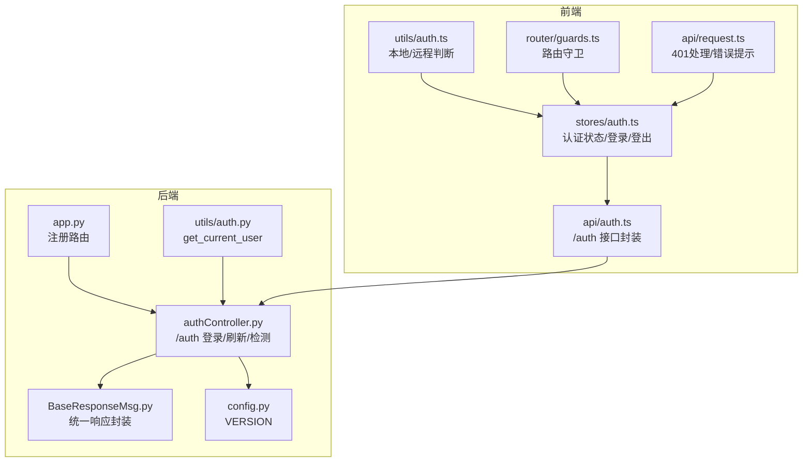
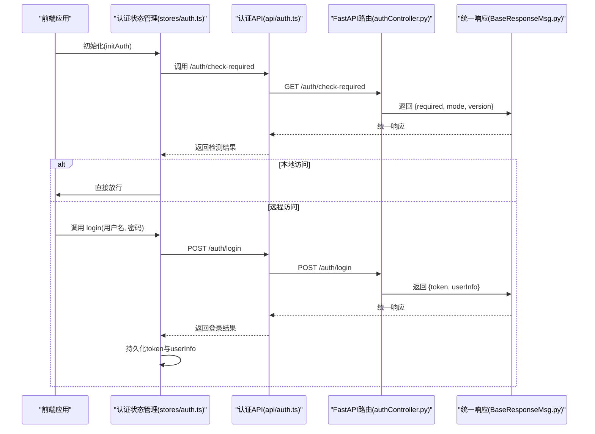
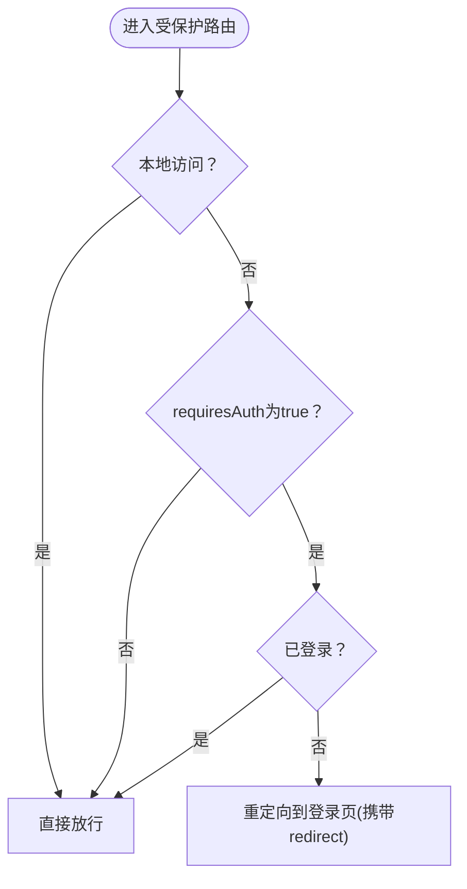
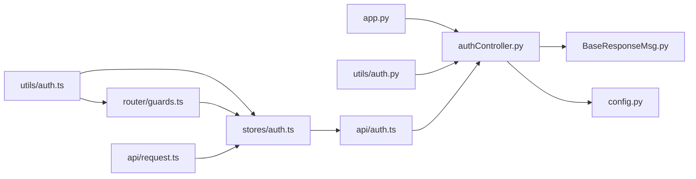

# 认证API

<cite>
**本文引用的文件**
- [authController.py](file://src/backEnd/api/commonApi/authController.py)
- [auth.py](file://src/backEnd/utils/auth.py)
- [BaseResponseMsg.py](file://src/backEnd/model/BaseResponseMsg.py)
- [app.py](file://src/backEnd/app.py)
- [auth.ts（前端工具）](file://src/frontEnd/src/utils/auth.ts)
- [auth.ts（前端store）](file://src/frontEnd/src/stores/auth.ts)
- [auth.ts（前端API）](file://src/frontEnd/src/api/auth.ts)
- [guards.ts](file://src/frontEnd/src/router/guards.ts)
- [request.ts](file://src/frontEnd/src/api/request.ts)
- [config.py](file://src/backEnd/config.py)
</cite>

## 目录
1. [简介](#简介)
2. [项目结构](#项目结构)
3. [核心组件](#核心组件)
4. [架构总览](#架构总览)
5. [详细组件分析](#详细组件分析)
6. [依赖关系分析](#依赖关系分析)
7. [性能考量](#性能考量)
8. [故障排查指南](#故障排查指南)
9. [结论](#结论)
10. [附录](#附录)

## 简介
本文件面向开发者，系统化梳理后端认证API与前端认证流程，覆盖登录、令牌刷新、认证需求检测等端点；说明当前实现的认证模式（本地单机模式与远程访问模式）、响应格式、错误码与最佳实践，并给出安全策略建议（如密码加密、防暴力破解、JWT集成建议）。

## 项目结构
认证相关代码主要分布在后端FastAPI路由模块、通用工具与前端Vue应用中：
- 后端
  - 认证路由与响应封装：authController.py、BaseResponseMsg.py
  - 认证中间件与客户端IP判定：utils/auth.py
  - 应用入口注册路由：app.py
  - 版本常量：config.py
- 前端
  - 认证工具与路由守卫：utils/auth.ts、router/guards.ts
  - 认证状态管理：stores/auth.ts
  - 认证API封装：api/auth.ts
  - 统一请求拦截与错误处理：api/request.ts

图表来源
- [app.py](file://src/backEnd/app.py#L1-L80)
- [authController.py](file://src/backEnd/api/commonApi/authController.py#L1-L150)
- [BaseResponseMsg.py](file://src/backEnd/model/BaseResponseMsg.py#L1-L21)
- [auth.py](file://src/backEnd/utils/auth.py#L1-L23)
- [config.py](file://src/backEnd/config.py#L1-L8)
- [auth.ts（前端工具）](file://src/frontEnd/src/utils/auth.ts#L1-L45)
- [auth.ts（前端store）](file://src/frontEnd/src/stores/auth.ts#L1-L175)
- [auth.ts（前端API）](file://src/frontEnd/src/api/auth.ts#L1-L34)
- [guards.ts](file://src/frontEnd/src/router/guards.ts#L1-L47)
- [request.ts](file://src/frontEnd/src/api/request.ts#L161-L205)

章节来源
- [app.py](file://src/backEnd/app.py#L1-L80)
- [authController.py](file://src/backEnd/api/commonApi/authController.py#L1-L150)
- [BaseResponseMsg.py](file://src/backEnd/model/BaseResponseMsg.py#L1-L21)
- [auth.py](file://src/backEnd/utils/auth.py#L1-L23)
- [config.py](file://src/backEnd/config.py#L1-L8)
- [auth.ts（前端工具）](file://src/frontEnd/src/utils/auth.ts#L1-L45)
- [auth.ts（前端store）](file://src/frontEnd/src/stores/auth.ts#L1-L175)
- [auth.ts（前端API）](file://src/frontEnd/src/api/auth.ts#L1-L34)
- [guards.ts](file://src/frontEnd/src/router/guards.ts#L1-L47)
- [request.ts](file://src/frontEnd/src/api/request.ts#L161-L205)

## 核心组件
- 认证路由与端点
  - /auth/login：POST，接收用户名与密码，返回token与用户信息
  - /auth/refresh：POST，刷新访问令牌
  - /auth/check-required：GET，检测当前访问是否需要认证（本地单机模式返回不需要）
- 统一响应封装
  - BaseResponseMsg：统一返回结构（code、success、message、data），便于前后端一致处理
- 认证中间件
  - get_current_user：根据客户端IP与可选token判定用户身份；本地回环地址直接放行，远程访问需提供有效token
- 前端认证流程
  - 本地访问：跳过认证，直接放行
  - 远程访问：登录成功后持久化token，路由守卫校验登录态，401时清空token并提示重新登录

章节来源
- [authController.py](file://src/backEnd/api/commonApi/authController.py#L1-L150)
- [BaseResponseMsg.py](file://src/backEnd/model/BaseResponseMsg.py#L1-L21)
- [auth.py](file://src/backEnd/utils/auth.py#L1-L23)
- [auth.ts（前端store）](file://src/frontEnd/src/stores/auth.ts#L1-L175)
- [auth.ts（前端API）](file://src/frontEnd/src/api/auth.ts#L1-L34)
- [guards.ts](file://src/frontEnd/src/router/guards.ts#L1-L47)
- [request.ts](file://src/frontEnd/src/api/request.ts#L161-L205)

## 架构总览
后端通过FastAPI注册认证路由，统一响应封装；前端根据访问模式（本地/远程）决定是否进行认证与登录态维护；路由守卫在进入受保护页面前进行校验。

图表来源
- [auth.ts（前端store）](file://src/frontEnd/src/stores/auth.ts#L1-L175)
- [auth.ts（前端API）](file://src/frontEnd/src/api/auth.ts#L1-L34)
- [authController.py](file://src/backEnd/api/commonApi/authController.py#L1-L150)
- [BaseResponseMsg.py](file://src/backEnd/model/BaseResponseMsg.py#L1-L21)

## 详细组件分析

### 认证路由与端点
- 路由前缀与注册
  - 路由器前缀为“/auth”，在应用入口中以“/api”前缀注册
- /auth/login
  - 方法：POST
  - 请求体：用户名、密码（字符串，长度限制见模型定义）
  - 响应：统一响应封装，data包含token与用户信息
  - 当前实现：本地单机模式，不进行真实用户校验，直接返回模拟token
- /auth/refresh
  - 方法：POST
  - 请求体：无
  - 响应：统一响应封装，data包含新token与过期时间（秒）
  - 当前实现：返回新的模拟token
- /auth/check-required
  - 方法：GET
  - 请求体：无
  - 响应：统一响应封装，data包含required（是否需要认证）、mode（访问模式）、version（版本）

章节来源
- [authController.py](file://src/backEnd/api/commonApi/authController.py#L1-L150)
- [app.py](file://src/backEnd/app.py#L1-L80)
- [BaseResponseMsg.py](file://src/backEnd/model/BaseResponseMsg.py#L1-L21)
- [config.py](file://src/backEnd/config.py#L1-L8)

### 统一响应封装
- 结构：code、success、message、data
- 用途：统一前后端交互格式，简化错误处理与调试

章节来源
- [BaseResponseMsg.py](file://src/backEnd/model/BaseResponseMsg.py#L1-L21)

### 认证中间件与客户端识别
- get_current_user
  - 逻辑要点：
    - 若无法获取客户端IP，返回400
    - 本地回环地址（127.0.0.1、localhost）直接放行
    - 远程访问需提供有效token，否则返回401并设置WWW-Authenticate头
- 适用场景：
  - 可作为FastAPI依赖注入的依赖项，用于受保护资源的鉴权

章节来源
- [auth.py](file://src/backEnd/utils/auth.py#L1-L23)

### 前端认证流程与路由守卫
- 本地/远程判断
  - 前端工具函数根据hostname判断是否本地访问
- 认证状态管理
  - 本地模式：始终视为已登录
  - 远程模式：登录成功后持久化token与用户信息；登出时清除
- 路由守卫
  - 本地模式：直接放行；若访问登录页且已登录，则重定向至首页
  - 远程模式：meta.requiresAuth默认为true；未登录访问受保护路由跳转登录页
- 401错误处理
  - 远程模式：收到401时清除token与用户信息，提示重新登录

图表来源
- [guards.ts](file://src/frontEnd/src/router/guards.ts#L1-L47)
- [auth.ts（前端store）](file://src/frontEnd/src/stores/auth.ts#L1-L175)
- [request.ts](file://src/frontEnd/src/api/request.ts#L161-L205)

章节来源
- [auth.ts（前端工具）](file://src/frontEnd/src/utils/auth.ts#L1-L45)
- [auth.ts（前端store）](file://src/frontEnd/src/stores/auth.ts#L1-L175)
- [guards.ts](file://src/frontEnd/src/router/guards.ts#L1-L47)
- [request.ts](file://src/frontEnd/src/api/request.ts#L161-L205)

### JWT认证机制与安全策略（建议）
- 当前实现现状
  - 后端：/auth/login与/refresh返回模拟token，未使用JWT
  - 前端：未对token进行JWT解析或签名验证
- 建议的JWT集成方案
  - 生成与验证
    - 使用标准库或第三方库生成JWT（含payload：用户标识、过期时间等），签名算法采用HS256或RS256
    - 验证流程：解析token、校验签名、检查过期时间、提取用户标识
  - 安全策略
    - 密码加密：使用强哈希（如bcrypt、argon2）存储用户密码，避免明文或弱哈希
    - 防暴力破解：登录失败计数与限流（如Redis计数+滑动窗口），失败超过阈值锁定账户或增加等待时间
    - Token安全：短有效期+刷新令牌；HTTPS传输；HttpOnly与SameSite Cookie策略；刷新令牌单独存储
    - CORS与安全头：严格CORS白名单；安全响应头（如X-Content-Type-Options、Strict-Transport-Security）
- 与现有代码的对接
  - 将模拟token替换为JWT；在get_current_user中改为解析JWT并校验；在前端store中持久化JWT并在请求头中携带

[本节为概念性建议，不直接对应具体源码文件]

## 依赖关系分析
- 后端
  - app.py注册auth路由（/api/auth）
  - authController.py依赖BaseResponseMsg与config.VERSION
  - utils/auth.py提供get_current_user供依赖注入使用
- 前端
  - stores/auth.ts依赖utils/auth.ts与api/auth.ts
  - guards.ts依赖stores/auth.ts
  - request.ts在401时清理认证信息并与stores/auth.ts配合

图表来源
- [app.py](file://src/backEnd/app.py#L1-L80)
- [authController.py](file://src/backEnd/api/commonApi/authController.py#L1-L150)
- [BaseResponseMsg.py](file://src/backEnd/model/BaseResponseMsg.py#L1-L21)
- [config.py](file://src/backEnd/config.py#L1-L8)
- [auth.py](file://src/backEnd/utils/auth.py#L1-L23)
- [auth.ts（前端工具）](file://src/frontEnd/src/utils/auth.ts#L1-L45)
- [auth.ts（前端store）](file://src/frontEnd/src/stores/auth.ts#L1-L175)
- [auth.ts（前端API）](file://src/frontEnd/src/api/auth.ts#L1-L34)
- [guards.ts](file://src/frontEnd/src/router/guards.ts#L1-L47)
- [request.ts](file://src/frontEnd/src/api/request.ts#L161-L205)

章节来源
- [app.py](file://src/backEnd/app.py#L1-L80)
- [authController.py](file://src/backEnd/api/commonApi/authController.py#L1-L150)
- [BaseResponseMsg.py](file://src/backEnd/model/BaseResponseMsg.py#L1-L21)
- [auth.py](file://src/backEnd/utils/auth.py#L1-L23)
- [auth.ts（前端工具）](file://src/frontEnd/src/utils/auth.ts#L1-L45)
- [auth.ts（前端store）](file://src/frontEnd/src/stores/auth.ts#L1-L175)
- [auth.ts（前端API）](file://src/frontEnd/src/api/auth.ts#L1-L34)
- [guards.ts](file://src/frontEnd/src/router/guards.ts#L1-L47)
- [request.ts](file://src/frontEnd/src/api/request.ts#L161-L205)

## 性能考量
- 登录与刷新接口为轻量级操作，主要开销在响应封装与日志记录
- 前端路由守卫与状态管理均为内存操作，性能开销极低
- 建议
  - 在生产环境引入缓存层（如Redis）存储会话与令牌，减少重复计算
  - 对频繁的认证检查（如check-required）进行短期缓存，降低后端压力

[本节为一般性建议，不直接对应具体源码文件]

## 故障排查指南
- 常见错误与处理
  - 400 Bad Request：客户端信息不可用（utils/auth.py）
  - 401 Unauthorized：远程访问缺少或无效token（utils/auth.py），前端收到401会清除token并提示重新登录
  - 500 Internal Server Error：后端异常（authController.py中捕获并返回统一响应）
- 前端常见问题
  - 本地访问模式：即使后端返回401也应被忽略（前端工具isLocalAccess）
  - 登录成功后未持久化token：检查stores/auth.ts的login流程与本地存储
  - 路由守卫未生效：确认路由meta.requiresAuth配置与guards.ts注册

章节来源
- [auth.py](file://src/backEnd/utils/auth.py#L1-L23)
- [request.ts](file://src/frontEnd/src/api/request.ts#L161-L205)
- [auth.ts（前端store）](file://src/frontEnd/src/stores/auth.ts#L1-L175)
- [guards.ts](file://src/frontEnd/src/router/guards.ts#L1-L47)

## 结论
- 当前认证实现支持本地单机模式与远程访问模式，远程模式下提供登录、刷新与认证需求检测端点
- 响应格式统一，便于前端处理；路由守卫与状态管理保证了用户体验
- 建议在生产环境中引入JWT、密码加密与防暴力破解等安全措施，并完善CORS与安全头策略

[本节为总结性内容，不直接对应具体源码文件]

## 附录

### API规范与示例

- /auth/login
  - 方法：POST
  - 请求体字段
    - username：字符串，长度范围见模型定义
    - password：字符串，长度范围见模型定义
  - 成功响应字段
    - code：200
    - success：true
    - message：字符串
    - data.token：访问令牌（当前为模拟token）
    - data.user：用户信息对象（包含用户名、邮箱、角色等）
  - 失败响应字段
    - code：500
    - success：false
    - message：错误描述
    - data：null
  - 示例
    - 请求：POST /api/auth/login
    - 成功示例：返回包含token与userInfo的对象
    - 失败示例：返回包含错误信息的对象

- /auth/refresh
  - 方法：POST
  - 请求体：无
  - 成功响应字段
    - code：200
    - success：true
    - message：字符串
    - data.token：新的访问令牌（当前为模拟token）
    - data.expires_in：过期时间（秒）
  - 失败响应字段
    - code：500
    - success：false
    - message：错误描述
    - data：null

- /auth/check-required
  - 方法：GET
  - 请求体：无
  - 成功响应字段
    - code：200
    - success：true
    - message：字符串
    - data.required：布尔值（本地单机模式返回false）
    - data.mode：字符串（本地）
    - data.version：版本号（来自config.VERSION）
  - 失败响应字段
    - code：500
    - success：false
    - message：错误描述
    - data：null

章节来源
- [authController.py](file://src/backEnd/api/commonApi/authController.py#L1-L150)
- [BaseResponseMsg.py](file://src/backEnd/model/BaseResponseMsg.py#L1-L21)
- [config.py](file://src/backEnd/config.py#L1-L8)

### 错误码说明
- 400 Bad Request：客户端信息不可用（utils/auth.py）
- 401 Unauthorized：远程访问缺少或无效token（utils/auth.py）
- 500 Internal Server Error：后端异常（authController.py）

章节来源
- [auth.py](file://src/backEnd/utils/auth.py#L1-L23)
- [authController.py](file://src/backEnd/api/commonApi/authController.py#L1-L150)

### 最佳实践建议
- 生产环境
  - 引入JWT：生成与验证令牌，设置合理过期时间与刷新策略
  - 密码安全：使用强哈希算法存储密码，避免明文或弱哈希
  - 防暴力破解：登录失败计数与限流，超过阈值锁定账户或增加等待
  - 安全传输：仅在HTTPS下传输，设置HttpOnly与SameSite Cookie
  - CORS与安全头：严格白名单与安全响应头
- 开发与测试
  - 使用本地单机模式进行快速开发，远程模式用于集成测试
  - 在前端模拟401场景，验证路由守卫与状态清理逻辑

[本节为一般性建议，不直接对应具体源码文件]