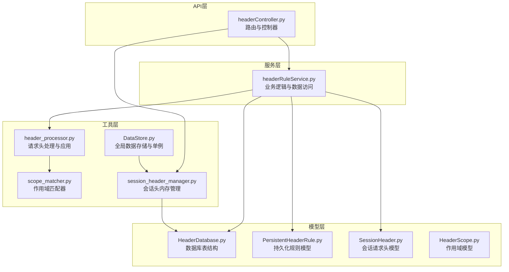
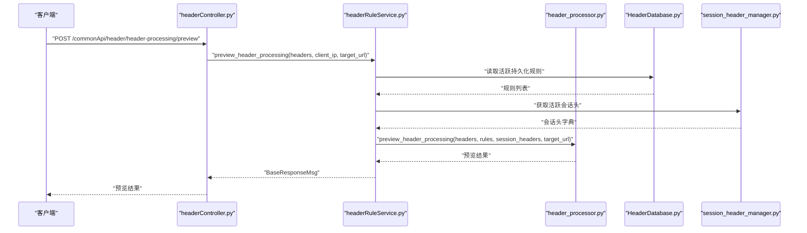
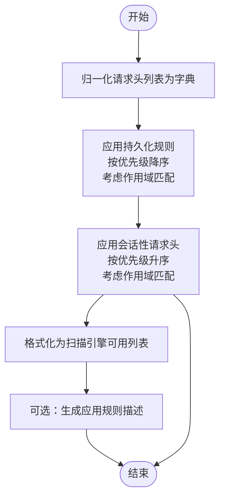
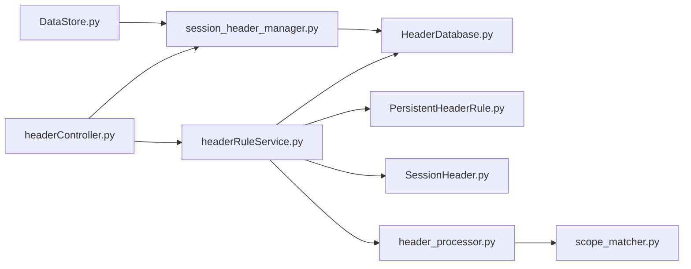

# 请求头API

<cite>
**本文引用的文件**
- [headerController.py](file://src/backEnd/api/commonApi/headerController.py)
- [headerRuleService.py](file://src/backEnd/service/headerRuleService.py)
- [HeaderDatabase.py](file://src/backEnd/model/HeaderDatabase.py)
- [PersistentHeaderRule.py](file://src/backEnd/model/PersistentHeaderRule.py)
- [SessionHeader.py](file://src/backEnd/model/SessionHeader.py)
- [HeaderScope.py](file://src/backEnd/model/HeaderScope.py)
- [header_processor.py](file://src/backEnd/utils/header_processor.py)
- [scope_matcher.py](file://src/backEnd/utils/scope_matcher.py)
- [DataStore.py](file://src/backEnd/model/DataStore.py)
- [session_header_manager.py](file://src/backEnd/utils/session_header_manager.py)
- [test_header_processor_scope.py](file://src/backEnd/tests/test_header_processor_scope.py)
- [HEADER_CONFIG_USER_GUIDE.md](file://doc/HEADER_CONFIG_USER_GUIDE.md)
- [HEADER_CONFIG_COMPLETE_SUMMARY.md](file://doc/HEADER_CONFIG_COMPLETE_SUMMARY.md)
</cite>

## 目录
1. [简介](#简介)
2. [项目结构](#项目结构)
3. [核心组件](#核心组件)
4. [架构总览](#架构总览)
5. [详细组件分析](#详细组件分析)
6. [依赖关系分析](#依赖关系分析)
7. [性能考量](#性能考量)
8. [故障排查指南](#故障排查指南)
9. [结论](#结论)
10. [附录](#附录)

## 简介
本文件面向“请求头API”的使用者与维护者，系统化梳理 headerController.py 中实现的请求头规则管理接口，涵盖持久化规则与会话级规则的 CRUD 操作、作用域（scope）匹配逻辑与优先级处理、复杂规则定义示例（含正则表达式与条件应用）、以及与扫描任务的集成方式与动态注入流程。文档同时提供常见使用场景与潜在问题的解决方案，帮助快速落地与稳定运行。

## 项目结构
请求头API位于后端服务的公共API层，采用 FastAPI 路由组织，配合服务层与工具层完成规则持久化、作用域匹配与请求头处理，并通过内存会话管理器实现临时会话级请求头的生命周期管理。

图表来源
- [headerController.py](file://src/backEnd/api/commonApi/headerController.py#L1-L120)
- [headerRuleService.py](file://src/backEnd/service/headerRuleService.py#L1-L120)
- [HeaderDatabase.py](file://src/backEnd/model/HeaderDatabase.py#L1-L126)
- [PersistentHeaderRule.py](file://src/backEnd/model/PersistentHeaderRule.py#L1-L104)
- [SessionHeader.py](file://src/backEnd/model/SessionHeader.py#L1-L97)
- [HeaderScope.py](file://src/backEnd/model/HeaderScope.py#L1-L187)
- [header_processor.py](file://src/backEnd/utils/header_processor.py#L1-L120)
- [scope_matcher.py](file://src/backEnd/utils/scope_matcher.py#L1-L120)
- [session_header_manager.py](file://src/backEnd/utils/session_header_manager.py#L1-L120)
- [DataStore.py](file://src/backEnd/model/DataStore.py#L1-L38)

章节来源
- [headerController.py](file://src/backEnd/api/commonApi/headerController.py#L1-L120)
- [headerRuleService.py](file://src/backEnd/service/headerRuleService.py#L1-L120)
- [HeaderDatabase.py](file://src/backEnd/model/HeaderDatabase.py#L1-L126)

## 核心组件
- 控制器层（FastAPI 路由）：提供持久化规则与会话头的 REST 接口，负责请求解析、上下文提取（客户端IP）、调用服务层并返回标准化响应。
- 服务层：封装业务逻辑，包括规则校验、数据库访问、批量解析与创建、预览处理等。
- 模型层：定义持久化规则、会话头、作用域的数据结构与序列化/反序列化。
- 工具层：请求头处理与作用域匹配，支持关键字与正则两种匹配模式，具备缓存优化。
- 数据存储：SQLite 数据库（独立表空间），持久化规则与会话头均落库；会话头也内存驻留并定期清理。

章节来源
- [headerController.py](file://src/backEnd/api/commonApi/headerController.py#L60-L210)
- [headerRuleService.py](file://src/backEnd/service/headerRuleService.py#L1-L120)
- [PersistentHeaderRule.py](file://src/backEnd/model/PersistentHeaderRule.py#L1-L104)
- [SessionHeader.py](file://src/backEnd/model/SessionHeader.py#L1-L97)
- [HeaderScope.py](file://src/backEnd/model/HeaderScope.py#L1-L187)
- [header_processor.py](file://src/backEnd/utils/header_processor.py#L1-L120)
- [scope_matcher.py](file://src/backEnd/utils/scope_matcher.py#L1-L120)
- [session_header_manager.py](file://src/backEnd/utils/session_header_manager.py#L1-L120)
- [DataStore.py](file://src/backEnd/model/DataStore.py#L1-L38)

## 架构总览
请求头处理的整体流程如下：扫描任务发起请求前，系统将原始请求头列表交给处理器；处理器先应用持久化规则（考虑作用域与优先级），再应用会话性请求头（同样考虑作用域与优先级），最终输出可用于扫描引擎的请求头列表。

图表来源
- [headerController.py](file://src/backEnd/api/commonApi/headerController.py#L354-L422)
- [headerRuleService.py](file://src/backEnd/service/headerRuleService.py#L584-L623)
- [header_processor.py](file://src/backEnd/utils/header_processor.py#L213-L292)
- [HeaderDatabase.py](file://src/backEnd/model/HeaderDatabase.py#L1-L126)
- [session_header_manager.py](file://src/backEnd/utils/session_header_manager.py#L1-L120)

## 详细组件分析

### 1) 持久化请求头规则（CRUD）
- 接口概览
  - 创建规则：POST /commonApi/header/persistent-header-rules
  - 查询规则：GET /commonApi/header/persistent-header-rules?active_only=布尔
  - 查询单条：GET /commonApi/header/persistent-header-rules/{rule_id}
  - 更新规则：PUT /commonApi/header/persistent-header-rules/{rule_id}
  - 删除规则：DELETE /commonApi/header/persistent-header-rules/{rule_id}
- 关键行为
  - 规则名称唯一性校验、请求头名称合法性校验、优先级范围校验。
  - scope 字段可选，未提供时视为全局生效；提供时序列化为 JSON 存储。
  - 更新时支持部分字段更新，自动更新更新时间。
  - 查询时支持仅返回活跃规则或全部规则，并按优先级降序排列。
- 数据模型
  - 持久化规则模型包含：名称、请求头名称、请求头值、替换策略、匹配条件、优先级、启用状态、作用域、创建/更新时间。
  - 替换策略枚举：完全替换、追加、前置、条件性替换、UPSERT。
- 数据库表
  - persistent_header_rules 表含 scope_config 字段，支持迁移与索引优化。

章节来源
- [headerController.py](file://src/backEnd/api/commonApi/headerController.py#L68-L133)
- [headerRuleService.py](file://src/backEnd/service/headerRuleService.py#L74-L176)
- [headerRuleService.py](file://src/backEnd/service/headerRuleService.py#L177-L260)
- [headerRuleService.py](file://src/backEnd/service/headerRuleService.py#L262-L336)
- [headerRuleService.py](file://src/backEnd/service/headerRuleService.py#L338-L480)
- [PersistentHeaderRule.py](file://src/backEnd/model/PersistentHeaderRule.py#L1-L104)
- [HeaderDatabase.py](file://src/backEnd/model/HeaderDatabase.py#L26-L51)

### 2) 会话性请求头（CRUD）
- 接口概览
  - 设置会话头：POST /commonApi/header/session-headers
  - 获取会话头：GET /commonApi/header/session-headers
  - 清除会话头：DELETE /commonApi/header/session-headers
  - 删除单个会话头：DELETE /commonApi/header/session-headers/{header_name}
  - 更新单个会话头：PUT /commonApi/header/session-headers/{header_name}
- 关键行为
  - 以客户端IP为维度隔离会话头，支持批量设置与更新。
  - 会话头具有生存时间（TTL），到期自动清理；内存与数据库双写同步。
  - 更新时支持替换策略、优先级、启用状态、TTL、作用域等字段。
- 数据模型
  - 会话头模型包含：请求头名称、值、替换策略、优先级、启用状态、过期时间、创建/更新时间、来源IP、作用域。
- 内存管理
  - 单例会话头管理器负责并发安全、过期清理、统计信息（客户端数、总数、活跃数）。

章节来源
- [headerController.py](file://src/backEnd/api/commonApi/headerController.py#L135-L269)
- [headerController.py](file://src/backEnd/api/commonApi/headerController.py#L271-L352)
- [session_header_manager.py](file://src/backEnd/utils/session_header_manager.py#L1-L313)
- [SessionHeader.py](file://src/backEnd/model/SessionHeader.py#L1-L97)
- [DataStore.py](file://src/backEnd/model/DataStore.py#L25-L38)

### 3) 请求头处理与作用域匹配
- 处理流程
  - 将原始请求头列表归一化为字典，应用持久化规则（按优先级降序），再应用会话性请求头（按优先级升序，后应用的覆盖低优先级）。
  - 每条规则/会话头均会尝试应用，即使值未变化，以保证用户意图得到满足。
- 作用域匹配
  - scope 字段可选；未提供或为空时视为全局生效。
  - 匹配维度：协议、主机名、IP、端口、路径；任一维度配置存在则需满足（AND 逻辑）。
  - 支持关键字匹配与正则表达式两种模式；提供 URL 解析与正则编译缓存，提升性能。
- 预览能力
  - 提供预览接口，支持传入 target_url 以进行作用域匹配预演，便于调试与可视化。

图表来源
- [header_processor.py](file://src/backEnd/utils/header_processor.py#L213-L292)
- [scope_matcher.py](file://src/backEnd/utils/scope_matcher.py#L35-L141)

章节来源
- [header_processor.py](file://src/backEnd/utils/header_processor.py#L1-L292)
- [scope_matcher.py](file://src/backEnd/utils/scope_matcher.py#L1-L346)

### 4) 与扫描任务的集成
- 集成方式
  - 扫描任务在发起请求前调用预览接口，传入原始请求头与目标URL，系统返回处理后的请求头列表与应用规则描述。
  - 实际扫描阶段直接使用处理后的请求头列表，确保持久化规则与会话头按作用域与优先级生效。
- 常见场景
  - 全局规则：为所有扫描任务添加统一的 User-Agent。
  - 环境区分：仅在生产环境API添加认证Token。
  - 临时测试：使用会话头在短期内为特定请求注入测试Header。

章节来源
- [headerController.py](file://src/backEnd/api/commonApi/headerController.py#L354-L422)
- [headerRuleService.py](file://src/backEnd/service/headerRuleService.py#L584-L623)
- [HEADER_CONFIG_USER_GUIDE.md](file://doc/HEADER_CONFIG_USER_GUIDE.md#L1-L120)

### 5) 复杂规则定义示例（概念性说明）
- 正则表达式匹配
  - 在规则的匹配条件或作用域中启用正则表达式，可实现更灵活的协议、主机名、路径匹配。
- 条件应用
  - 使用条件性替换策略，仅在请求头值为空或特定模式时替换，避免覆盖已有值。
- 优先级与覆盖
  - 高优先级规则先应用；会话头按优先级升序应用，后应用覆盖先前值。
- 作用域组合
  - 同时配置协议、主机名、端口、路径，形成严格的 AND 逻辑匹配；任一维度为空即不限制该维度。

章节来源
- [PersistentHeaderRule.py](file://src/backEnd/model/PersistentHeaderRule.py#L1-L104)
- [SessionHeader.py](file://src/backEnd/model/SessionHeader.py#L1-L97)
- [HeaderScope.py](file://src/backEnd/model/HeaderScope.py#L1-L187)
- [header_processor.py](file://src/backEnd/utils/header_processor.py#L58-L151)

## 依赖关系分析
- 控制器依赖服务层；服务层依赖数据库与工具层；会话头管理器依赖全局数据存储与数据库。
- 作用域匹配器与请求头处理器解耦，便于单元测试与性能优化。
- 数据库表结构支持 scope_config 字段，便于规则与会话头的序列化存储。

图表来源
- [headerController.py](file://src/backEnd/api/commonApi/headerController.py#L1-L120)
- [headerRuleService.py](file://src/backEnd/service/headerRuleService.py#L1-L120)
- [HeaderDatabase.py](file://src/backEnd/model/HeaderDatabase.py#L1-L126)
- [PersistentHeaderRule.py](file://src/backEnd/model/PersistentHeaderRule.py#L1-L104)
- [SessionHeader.py](file://src/backEnd/model/SessionHeader.py#L1-L97)
- [header_processor.py](file://src/backEnd/utils/header_processor.py#L1-L120)
- [scope_matcher.py](file://src/backEnd/utils/scope_matcher.py#L1-L120)
- [session_header_manager.py](file://src/backEnd/utils/session_header_manager.py#L1-L120)
- [DataStore.py](file://src/backEnd/model/DataStore.py#L1-L38)

章节来源
- [headerController.py](file://src/backEnd/api/commonApi/headerController.py#L1-L120)
- [headerRuleService.py](file://src/backEnd/service/headerRuleService.py#L1-L120)
- [session_header_manager.py](file://src/backEnd/utils/session_header_manager.py#L1-L120)

## 性能考量
- 缓存优化
  - URL 解析缓存与正则表达式编译缓存，限制最大容量并定期清理，降低重复计算成本。
- 查询优化
  - 数据库表为规则与会话头建立索引，提升活跃规则查询与会话头检索效率。
- 并发安全
  - 会话头管理器使用锁保护，确保多线程环境下的一致性与原子性。
- 处理顺序
  - 规则按优先级降序应用，会话头按优先级升序应用，减少不必要的覆盖与回溯。

章节来源
- [scope_matcher.py](file://src/backEnd/utils/scope_matcher.py#L1-L120)
- [HeaderDatabase.py](file://src/backEnd/model/HeaderDatabase.py#L94-L100)
- [session_header_manager.py](file://src/backEnd/utils/session_header_manager.py#L1-L120)

## 故障排查指南
- 规则创建失败
  - 可能原因：必填字段缺失、规则名称重复、数据库连接不可用。
  - 解决方法：检查必填字段与唯一性约束；确认服务运行与数据库可用。
- 规则不生效
  - 可能原因：规则被禁用、作用域配置不匹配、优先级被更高规则覆盖。
  - 解决方法：检查启用状态与作用域；调整优先级或移除冲突规则。
- 会话头不显示或过期
  - 可能原因：TTL 已过期、浏览器会话已清除、后端服务重启。
  - 解决方法：重新添加会话头并设置更长TTL；必要时使用持久化规则替代。
- 预览结果与预期不符
  - 可能原因：未提供 target_url 导致作用域检查缺失；作用域模式（关键字/正则）配置不当。
  - 解决方法：提供正确的 target_url；核对作用域字段与匹配模式。

章节来源
- [HEADER_CONFIG_USER_GUIDE.md](file://doc/HEADER_CONFIG_USER_GUIDE.md#L250-L345)
- [test_header_processor_scope.py](file://src/backEnd/tests/test_header_processor_scope.py#L1-L200)

## 结论
请求头API通过清晰的分层设计与完善的工具链，实现了持久化规则与会话头的全生命周期管理，并以作用域与优先级为核心机制，确保规则在不同环境与场景下精准生效。结合预览与统计接口，能够有效支撑扫描任务的动态注入与可观测性。建议在生产环境中充分利用作用域与优先级策略，配合会话头的短期测试能力，实现稳定、可控、可追溯的请求头治理。

## 附录

### A. API 端点一览（摘要）
- 持久化规则
  - POST /commonApi/header/persistent-header-rules
  - GET /commonApi/header/persistent-header-rules
  - GET /commonApi/header/persistent-header-rules/{rule_id}
  - PUT /commonApi/header/persistent-header-rules/{rule_id}
  - DELETE /commonApi/header/persistent-header-rules/{rule_id}
- 会话头
  - POST /commonApi/header/session-headers
  - GET /commonApi/header/session-headers
  - DELETE /commonApi/header/session-headers
  - DELETE /commonApi/header/session-headers/{header_name}
  - PUT /commonApi/header/session-headers/{header_name}
- 预览与统计
  - POST /commonApi/header/header-processing/preview
  - GET /commonApi/header/header-management/stats

章节来源
- [headerController.py](file://src/backEnd/api/commonApi/headerController.py#L68-L481)
- [HEADER_CONFIG_COMPLETE_SUMMARY.md](file://doc/HEADER_CONFIG_COMPLETE_SUMMARY.md#L170-L200)

### B. 作用域配置要点
- scope 字段可选；为空或未提供时视为全局生效。
- 匹配逻辑：所有配置维度均需满足（AND 逻辑）；任一维度为空表示不限制。
- 支持关键字匹配与正则表达式；正则表达式模式包含特殊字符时按正则处理。
- 默认端口：未显式指定端口时，http 默认 80，https 默认 443。

章节来源
- [HeaderScope.py](file://src/backEnd/model/HeaderScope.py#L1-L187)
- [scope_matcher.py](file://src/backEnd/utils/scope_matcher.py#L143-L200)