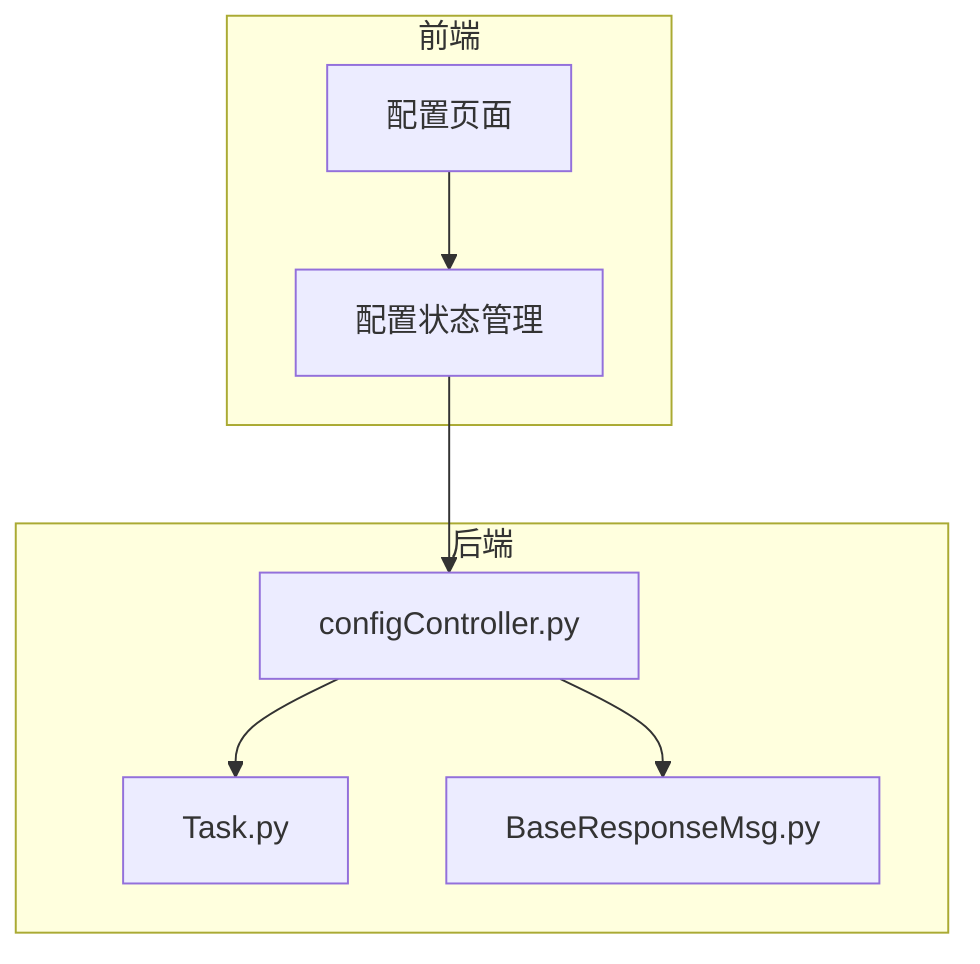
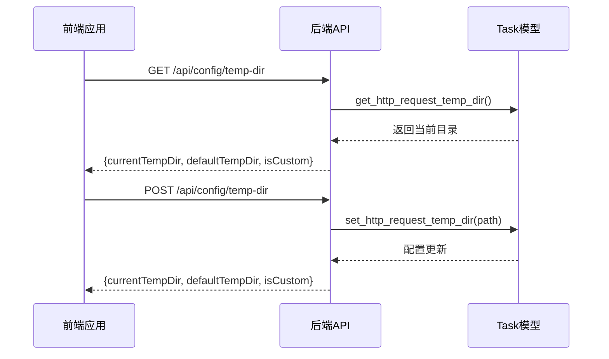
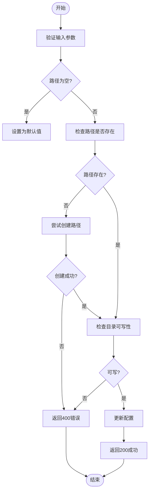
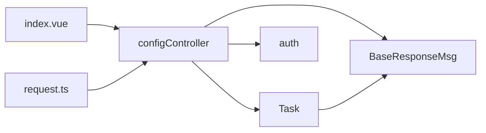

# 配置API

<cite>
**本文档引用的文件**
- [configController.py](file://src/backEnd/api/commonApi/configController.py)
- [Task.py](file://src/backEnd/model/Task.py)
- [BaseResponseMsg.py](file://src/backEnd/model/BaseResponseMsg.py)
- [auth.py](file://src/backEnd/utils/auth.py)
- [config.ts](file://src/frontEnd/src/stores/config.ts)
- [request.ts](file://src/frontEnd/src/api/request.ts)
- [index.vue](file://src/frontEnd/src/views/Config/index.vue)
- [app.py](file://src/backEnd/app.py)
</cite>

## 目录
1. [简介](#简介)
2. [项目结构](#项目结构)
3. [核心组件](#核心组件)
4. [架构概述](#架构概述)
5. [详细组件分析](#详细组件分析)
6. [依赖分析](#依赖分析)
7. [性能考虑](#性能考虑)
8. [故障排除指南](#故障排除指南)
9. [结论](#结论)
10. [附录](#附录)（如有必要）

## 简介
本文档详细介绍了SQLMapWebUI系统中的配置管理API，重点分析了`configController.py`中提供的所有配置管理接口。文档涵盖了系统配置的读取、更新操作，包括HTTP请求临时文件目录等参数的API调用方式。详细说明了配置数据的持久化机制、默认值处理逻辑、配置变更后的热加载机制以及对现有任务的影响。提供了完整的请求/响应示例、配置验证规则和错误处理策略，确保开发者能够正确地远程管理系统配置。

## 项目结构
本项目采用分层架构，前端和后端分离。后端API位于`src/backEnd/api/commonApi/`目录下，其中`configController.py`文件专门负责配置管理相关的API接口。配置数据的持久化和业务逻辑处理由`src/backEnd/model/Task.py`中的函数实现。前端通过`src/frontEnd/src/views/Config/`目录下的Vue组件与这些API进行交互。



**Diagram sources**
- [configController.py](file://src/backEnd/api/commonApi/configController.py)
- [Task.py](file://src/backEnd/model/Task.py)
- [config.ts](file://src/frontEnd/src/stores/config.ts)
- [index.vue](file://src/frontEnd/src/views/Config/index.vue)

**Section sources**
- [configController.py](file://src/backEnd/api/commonApi/configController.py)
- [Task.py](file://src/backEnd/model/Task.py)
- [app.py](file://src/backEnd/app.py)

## 核心组件
`configController.py`是配置管理的核心组件，提供了获取、设置和重置HTTP请求临时文件目录的API接口。该组件依赖于`Task.py`中的全局变量来存储和管理配置状态，通过`BaseResponseMsg`类统一API响应格式，并使用`auth.py`中的认证机制确保接口安全。

**Section sources**
- [configController.py](file://src/backEnd/api/commonApi/configController.py)
- [Task.py](file://src/backEnd/model/Task.py)
- [BaseResponseMsg.py](file://src/backEnd/model/BaseResponseMsg.py)

## 架构概述
系统配置API采用典型的RESTful架构，通过HTTP方法（GET、POST）对配置资源进行操作。前端通过Axios库发送请求，后端FastAPI框架处理请求并返回JSON格式的响应。配置数据存储在内存中的全局变量里，实现了配置的热加载，无需重启服务即可生效。



**Diagram sources**
- [configController.py](file://src/backEnd/api/commonApi/configController.py)
- [Task.py](file://src/backEnd/model/Task.py)
- [request.ts](file://src/frontEnd/src/api/request.ts)

## 详细组件分析

### 配置控制器分析
`configController.py`文件实现了三个主要的API端点，用于管理HTTP请求的临时文件目录。

#### API端点
- `GET /config/temp-dir`: 获取当前的临时文件目录配置。
- `POST /config/temp-dir`: 设置临时文件目录，支持自定义路径或恢复默认值。
- `POST /config/temp-dir/reset`: 重置临时文件目录为默认值。

#### 请求/响应示例
**获取配置请求**
```http
GET /api/config/temp-dir HTTP/1.1
Authorization: Bearer secret-token
```

**获取配置响应**
```json
{
  "code": 200,
  "success": true,
  "message": "success",
  "data": {
    "currentTempDir": "/path/to/custom/temp",
    "defaultTempDir": "/path/to/backend/temp/http_requests",
    "isCustom": true
  }
}
```

**设置配置请求**
```http
POST /api/config/temp-dir HTTP/1.1
Authorization: Bearer secret-token
Content-Type: application/json

{
  "tempDir": "/new/custom/path"
}
```

**设置配置响应**
```json
{
  "code": 200,
  "success": true,
  "message": "Temp directory set to /new/custom/path",
  "data": {
    "currentTempDir": "/new/custom/path",
    "defaultTempDir": "/path/to/backend/temp/http_requests",
    "isCustom": true
  }
}
```

#### 配置验证规则
- **路径存在性**: 如果提供的路径不存在，系统会尝试自动创建。
- **可写性**: 系统会检查目录是否可写，如果不可写则返回400错误。
- **空值处理**: 如果`tempDir`字段为空或null，系统会将其视为恢复默认值的请求。

#### 错误处理策略
- **500内部服务器错误**: 当发生未预期的异常时返回，如文件系统操作失败。
- **400错误请求**: 当目录不可写或创建失败时返回。
- **401未授权**: 当请求缺少有效认证令牌时返回。



**Diagram sources**
- [configController.py](file://src/backEnd/api/commonApi/configController.py#L67-L137)
- [Task.py](file://src/backEnd/model/Task.py#L35-L46)

**Section sources**
- [configController.py](file://src/backEnd/api/commonApi/configController.py)
- [Task.py](file://src/backEnd/model/Task.py)

### 配置数据模型分析
`Task.py`文件中的全局变量`_custom_temp_dir`和`_DEFAULT_TEMP_DIR`构成了配置数据的核心。`_DEFAULT_TEMP_DIR`在服务启动时基于当前工作目录确定，而`_custom_temp_dir`则用于存储用户自定义的配置。

#### 配置持久化机制
配置数据通过内存中的全局变量实现持久化。`set_http_request_temp_dir`函数负责更新`_custom_temp_dir`的值，而`get_http_request_temp_dir`函数则根据`_custom_temp_dir`是否为`None`来决定返回自定义路径还是默认路径。

#### 默认值处理逻辑
默认的临时文件目录为后端服务启动目录下的`temp/http_requests`子目录。当用户未设置自定义路径或执行重置操作时，系统将使用此默认路径。

#### 热加载机制
由于配置存储在内存变量中，任何通过API进行的配置更改都会立即生效，无需重启服务。这种热加载机制确保了配置变更的即时性，对现有任务的影响仅限于新创建的任务将使用新的临时文件目录。

**Section sources**
- [Task.py](file://src/backEnd/model/Task.py#L22-L46)

## 依赖分析
配置API依赖于多个核心组件，形成了清晰的依赖链。



**Diagram sources**
- [configController.py](file://src/backEnd/api/commonApi/configController.py)
- [Task.py](file://src/backEnd/model/Task.py)
- [BaseResponseMsg.py](file://src/backEnd/model/BaseResponseMsg.py)
- [auth.py](file://src/backEnd/utils/auth.py)
- [request.ts](file://src/frontEnd/src/api/request.ts)
- [index.vue](file://src/frontEnd/src/views/Config/index.vue)

**Section sources**
- [configController.py](file://src/backEnd/api/commonApi/configController.py)
- [Task.py](file://src/backEnd/model/Task.py)
- [BaseResponseMsg.py](file://src/backEnd/model/BaseResponseMsg.py)
- [auth.py](file://src/backEnd/utils/auth.py)

## 性能考虑
配置API的性能主要受文件系统操作的影响。在设置自定义目录时，系统会进行路径创建和可写性检查，这些操作在大多数情况下都非常快速。由于配置数据存储在内存中，读取操作几乎没有性能开销。建议避免频繁更改配置，以减少不必要的文件系统调用。

## 故障排除指南
当配置API出现问题时，可以按照以下步骤进行排查：

1. **检查认证**: 确保请求头中包含有效的`Authorization`令牌。
2. **验证路径**: 确认提供的路径格式正确，且应用有权限访问该目录。
3. **查看日志**: 检查后端日志文件，查找与配置操作相关的错误信息。
4. **权限问题**: 确保目标目录具有适当的读写权限。
5. **磁盘空间**: 检查目标磁盘是否有足够的可用空间。

**Section sources**
- [configController.py](file://src/backEnd/api/commonApi/configController.py)
- [Task.py](file://src/backEnd/model/Task.py)

## 结论
本文档全面介绍了SQLMapWebUI的配置管理API，涵盖了从接口定义到内部实现的各个方面。通过`configController.py`提供的API，开发者可以灵活地管理系统的临时文件目录配置。配置的热加载机制和内存持久化确保了高效率和即时生效。结合详细的错误处理和验证规则，该API为系统的稳定运行提供了有力保障。