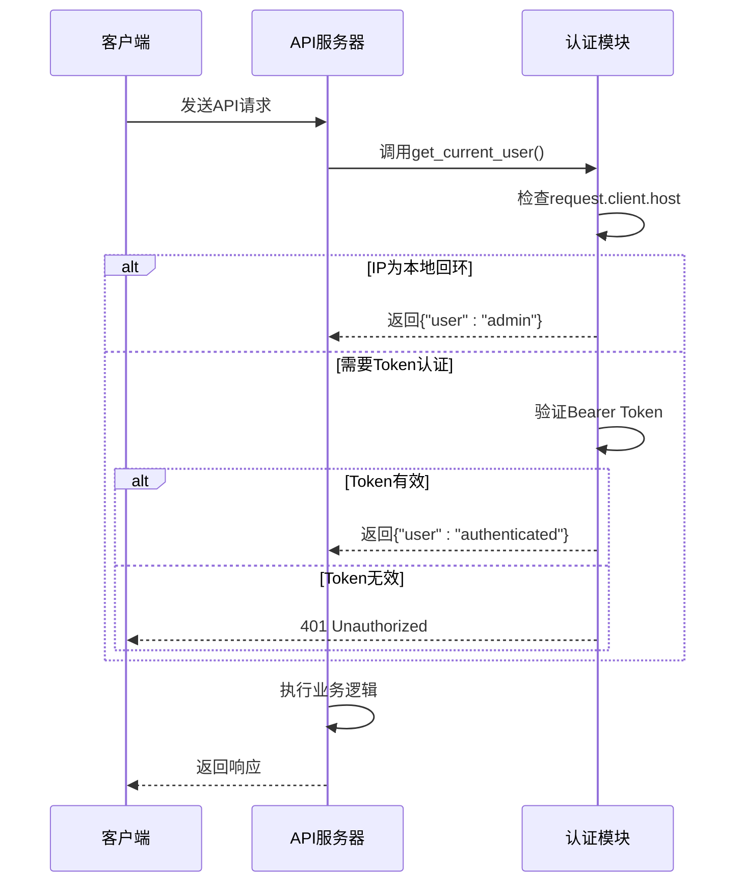
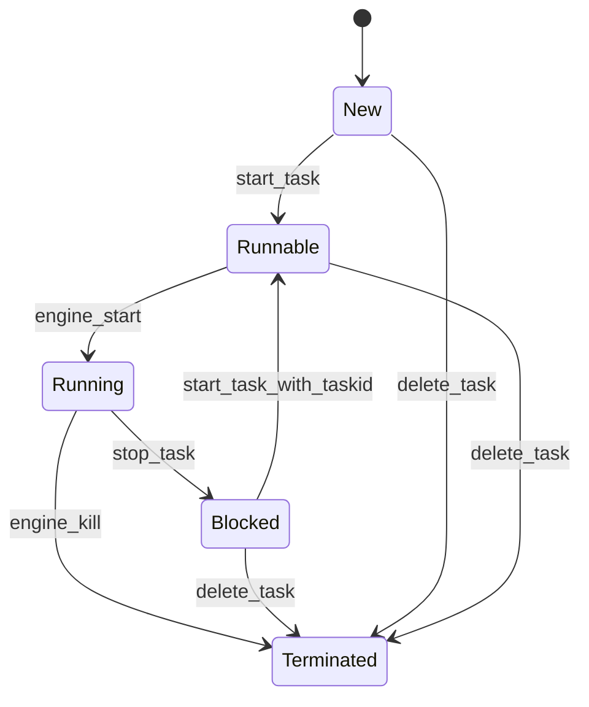
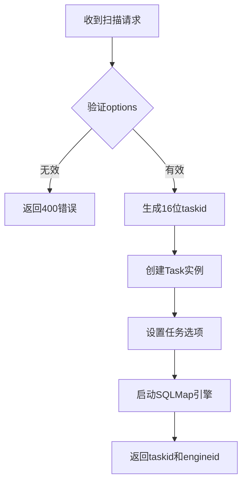

# API端点参考

<cite>
**本文档中引用的文件**  
- [app.py](file://src/backEnd/app.py)
- [config.py](file://src/backEnd/config.py)
- [admin.py](file://src/backEnd/api/chromeExApi/admin.py)
- [admin.py](file://src/backEnd/api/burpSuiteExApi/admin.py)
- [TaskRequest.py](file://src/backEnd/model/requestModel/TaskRequest.py)
- [BaseResponseMsg.py](file://src/backEnd/model/BaseResponseMsg.py)
- [taskService.py](file://src/backEnd/service/taskService.py)
- [Task.py](file://src/backEnd/model/Task.py)
- [TaskStatus.py](file://src/backEnd/model/TaskStatus.py)
- [auth.py](file://src/backEnd/utils/auth.py)
- [useSmartPolling.ts](file://src/frontEnd/src/utils/useSmartPolling.ts)
- [auth.ts](file://src/frontEnd/src/stores/auth.ts)
</cite>

## 更新摘要
**变更内容**  
- 新增了`/api/health`健康检查端点的详细文档
- 更新了API版本控制与速率限制章节，增加了健康检查机制说明
- 在使用示例中添加了健康检查的curl命令示例
- 更新了相关文件引用列表，新增了前端轮询工具文件

## 目录
1. [简介](#简介)
2. [通用API](#通用api)
3. [Chrome扩展API](#chrome扩展api)
4. [Burp Suite插件API](#burp-suite插件api)
5. [认证与安全](#认证与安全)
6. [错误响应结构](#错误响应结构)
7. [任务管理API](#任务管理api)
8. [请求头规则管理API](#请求头规则管理api)
9. [使用示例](#使用示例)
10. [API版本控制与速率限制](#api版本控制与速率限制)

## 简介
本API文档为`sqlmapWebUI`系统提供完整的RESTful端点参考，涵盖通用API、Chrome浏览器扩展专用API以及Burp Suite安全测试插件专用API。所有端点均基于FastAPI框架构建，通过`/api`前缀路由，并采用统一的响应格式。系统支持任务的创建、启动、停止、删除和查询操作，同时提供对请求头规则的CRUD管理功能。API设计遵循REST原则，使用JSON作为数据交换格式，并通过Bearer Token机制进行访问控制。

**Section sources**
- [app.py](file://src/backEnd/app.py#L1-L44)
- [config.py](file://src/backEnd/config.py#L1-L8)

## 通用API
通用API提供系统级功能，如版本查询和基础路由。

### 获取系统版本
返回当前系统的版本号。

- **HTTP方法**: `GET`
- **URL路径**: `/version`
- **认证要求**: 无
- **成功响应**:
  ```json
  {
    "code": 200,
    "success": true,
    "message": "",
    "data": {
      "version": "0.0.1"
    }
  }
  ```

**Section sources**
- [app.py](file://src/backEnd/app.py#L40-L44)
- [config.py](file://src/backEnd/config.py#L8)

### 健康检查
返回服务健康状态信息，用于前端监控后端服务可用性。

- **HTTP方法**: `GET`
- **URL路径**: `/api/health`
- **认证要求**: Bearer Token
- **成功响应**:
  ```json
  {
    "code": 200,
    "success": true,
    "message": "success",
    "data": {
      "status": "healthy",
      "timestamp": 1702252800000,
      "version": "0.0.1",
      "uptime": 3600
    }
  }
  ```
- **响应字段说明**:
  - `status`: 服务状态，当前固定为"healthy"
  - `timestamp`: 当前时间戳（毫秒）
  - `version`: 系统版本号
  - `uptime`: 服务运行时长（秒）

**Section sources**
- [app.py](file://src/backEnd/app.py#L46-L64)
- [useSmartPolling.ts](file://src/frontEnd/src/utils/useSmartPolling.ts#L1-L203)

## Chrome扩展API
Chrome扩展API位于`/api/chrome/admin`前缀下，提供任务管理、日志查询和结果检索等功能。

### 删除任务
根据任务ID删除指定任务。

- **HTTP方法**: `DELETE`
- **URL路径**: `/api/chrome/admin/task/delete`
- **认证要求**: Bearer Token
- **请求体模式**:
  ```json
  {
    "taskid": "string (16位长度)"
  }
  ```
- **状态码**:
  - `200`: 成功删除
  - `400`: 任务ID不存在

**Section sources**
- [admin.py](file://src/backEnd/api/chromeExApi/admin.py#L13-L18)
- [taskService.py](file://src/backEnd/service/taskService.py#L154-L174)

### 终止任务
强制终止正在运行的任务。

- **HTTP方法**: `PUT`
- **URL路径**: `/api/chrome/admin/task/kill`
- **认证要求**: Bearer Token
- **请求体模式**: 同`删除任务`
- **状态码**:
  - `200`: 成功终止
  - `404`: 任务不存在

**Section sources**
- [admin.py](file://src/backEnd/api/chromeExApi/admin.py#L20-L25)
- [taskService.py](file://src/backEnd/service/taskService.py#L176-L195)

### 列出所有任务
获取当前系统中所有任务的列表及其状态。

- **HTTP方法**: `GET`
- **URL路径**: `/api/chrome/admin/task/list`
- **认证要求**: Bearer Token
- **响应格式**:
  ```json
  {
    "code": 200,
    "success": true,
    "message": "success",
    "data": {
      "tasks": [
        {
          "index": 1,
          "start_datetime": "2023-11-10 10:00:00",
          "task_id": "a1b2c3d4e5f6g7h8",
          "scanUrl": "http://example.com/vuln",
          "errors": 2,
          "logs": 15,
          "status": "Running",
          "injected": true
        }
      ],
      "tasks_num": 1
    }
  }
  ```

**Section sources**
- [admin.py](file://src/backEnd/api/chromeExApi/admin.py#L27-L31)
- [taskService.py](file://src/backEnd/service/taskService.py#L197-L264)

### 启动被阻塞的任务
将状态为`Blocked`的任务重新设置为`Runnable`，准备执行。

- **HTTP方法**: `PUT`
- **URL路径**: `/api/chrome/admin/task/startBlocked`
- **认证要求**: Bearer Token
- **请求体模式**: 同`删除任务`
- **状态码**:
  - `200`: 成功启动
  - `400`: 任务不存在

**Section sources**
- [admin.py](file://src/backEnd/api/chromeExApi/admin.py#L33-L38)
- [taskService.py](file://src/backEnd/service/taskService.py#L358-L378)

### 停止任务
暂停正在运行的任务，将其状态设置为`Blocked`。

- **HTTP方法**: `PUT`
- **URL路径**: `/api/chrome/admin/task/stop`
- **认证要求**: Bearer Token
- **请求体模式**:
  ```json
  {
    "taskid": "string (16位长度)"
  }
  ```
- **状态码**:
  - `200`: 成功停止
  - `400`: 任务未运行或已阻塞

**Section sources**
- [admin.py](file://src/backEnd/api/chromeExApi/admin.py#L40-L45)
- [taskService.py](file://src/backEnd/service/taskService.py#L324-L356)

### 清空任务池
强制终止所有正在运行的任务并删除所有任务。

- **HTTP方法**: `PATCH`
- **URL路径**: `/api/chrome/admin/task/flush`
- **认证要求**: Bearer Token
- **状态码**: `200`

**Section sources**
- [admin.py](file://src/backEnd/api/chromeExApi/admin.py#L47-L51)
- [taskService.py](file://src/backEnd/service/taskService.py#L380-L394)

### 按URL路径查找任务
根据URL路径中的关键字查找相关任务。

- **HTTP方法**: `POST`
- **URL路径**: `/api/chrome/admin/task/findByUrlPath`
- **认证要求**: Bearer Token
- **请求体模式**:
  ```json
  {
    "urlPath": "string"
  }
  ```
- **响应**: 匹配的任务列表

**Section sources**
- [admin.py](file://src/backEnd/api/chromeExApi/admin.py#L53-L58)
- [taskService.py](file://src/backEnd/service/taskService.py#L396-L412)

### 按请求体关键字查找任务
根据请求体中的关键字查找任务。

- **HTTP方法**: `POST`
- **URL路径**: `/api/chrome/admin/task/findByBodyKeyWord`
- **认证要求**: Bearer Token
- **请求体模式**:
  ```json
  {
    "bodyKeyWord": "string"
  }
  ```

**Section sources**
- [admin.py](file://src/backEnd/api/chromeExApi/admin.py#L60-L65)
- [taskService.py](file://src/backEnd/service/taskService.py#L438-L454)

### 按请求头关键字查找任务
根据请求头中的关键字查找任务。

- **HTTP方法**: `POST`
- **URL路径**: `/api/chrome/admin/task/findByHeaderKeyWord`
- **认证要求**: Bearer Token
- **请求体模式**:
  ```json
  {
    "headerKeyWord": "string"
  }
  ```

**Section sources**
- [admin.py](file://src/backEnd/api/chromeExApi/admin.py#L67-L72)
- [taskService.py](file://src/backEnd/service/taskService.py#L474-L491)

### 获取任务日志
根据任务ID获取该任务的所有日志记录。

- **HTTP方法**: `GET`
- **URL路径**: `/api/chrome/admin/task/logs/getLogsByTaskId`
- **认证要求**: Bearer Token
- **查询参数**: `taskId` (string, 3-64位)
- **响应格式**:
  ```json
  {
    "code": 200,
    "success": true,
    "message": "success",
    "data": [
      {
        "datetime": "2023-11-10 10:01:00",
        "level": "INFO",
        "message": "Testing started"
      }
    ]
  }
  ```

**Section sources**
- [admin.py](file://src/backEnd/api/chromeExApi/admin.py#L74-L80)
- [taskService.py](file://src/backEnd/service/taskService.py#L493-L518)

### 获取任务载荷详情
获取指定任务的注入载荷详情。

- **HTTP方法**: `GET`
- **URL路径**: `/api/chrome/admin/task/getPayloadDetailByTaskId`
- **认证要求**: Bearer Token
- **查询参数**: `taskId` (string, 16位长度)
- **响应格式**:
  ```json
  {
    "data": [
      {
        "index": 1,
        "status": "success",
        "content_type": "text/html",
        "value": "<script>alert(1)</script>"
      }
    ],
    "msg": "success",
    "success": true,
    "code": 200
  }
  ```

**Section sources**
- [admin.py](file://src/backEnd/api/chromeExApi/admin.py#L82-L92)
- [taskService.py](file://src/backEnd/service/taskService.py#L520-L542)

### 获取任务HTTP请求信息
获取指定任务的原始HTTP请求信息。

- **HTTP方法**: `GET`
- **URL路径**: `/api/chrome/admin/task/getTaskHttpRequestInfoByTaskId`
- **认证要求**: Bearer Token
- **查询参数**: `taskId` (string, 16位长度)
- **响应格式**:
  ```json
  {
    "data": {
      "url": "http://example.com/vuln",
      "headers": ["User-Agent: Chrome", "Accept: text/html"],
      "body": "{\"key\": \"value\"}"
    },
    "msg": "success",
    "success": true,
    "code": 200
  }
  ```

**Section sources**
- [admin.py](file://src/backEnd/api/chromeExApi/admin.py#L94-L104)
- [taskService.py](file://src/backEnd/service/taskService.py#L544-L562)

### 按关键词搜索任务
在URL路径、主机名、请求头和请求体中搜索包含指定关键词的任务。

- **HTTP方法**: `GET`
- **URL路径**: `/api/chrome/admin/task/getTasksByKeyWord`
- **认证要求**: Bearer Token
- **查询参数**: `keyword` (string, 1-32位)
- **响应**: 匹配的任务列表

**Section sources**
- [admin.py](file://src/backEnd/api/chromeExApi/admin.py#L106-L116)
- [taskService.py](file://src/backEnd/service/taskService.py#L414-L472)

### 获取任务扫描选项
获取指定任务的所有扫描配置选项。

- **HTTP方法**: `GET`
- **URL路径**: `/api/chrome/admin/task/getTaskScanOptionsByTaskId`
- **认证要求**: Bearer Token
- **查询参数**: `taskId` (string, 16位长度)
- **响应格式**:
  ```json
  {
    "data": {
      "taskid": "a1b2c3d4e5f6g7h8",
      "options": [
        {"option": "level", "value": 3},
        {"option": "risk", "value": 2}
      ],
      "options_cnt": 2
    },
    "msg": "success",
    "success": true,
    "code": 200
  }
  ```

**Section sources**
- [admin.py](file://src/backEnd/api/chromeExApi/admin.py#L118-L128)
- [taskService.py](file://src/backEnd/service/taskService.py#L564-L592)

### 获取任务错误信息
获取指定任务的所有错误记录。

- **HTTP方法**: `GET`
- **URL路径**: `/api/chrome/admin/task/getTaskErrorsByTaskId`
- **认证要求**: Bearer Token
- **查询参数**: `taskId` (string, 16位长度)
- **响应格式**:
  ```json
  {
    "data": {
      "taskId": "a1b2c3d4e5f6g7h8",
      "errors": [
        {"index": 1, "id": 0, "error": "Network timeout"}
      ],
      "errors_cnt": 1
    },
    "msg": "success",
    "success": true,
    "code": 200
  }
  ```

**Section sources**
- [admin.py](file://src/backEnd/api/chromeExApi/admin.py#L130-L140)
- [taskService.py](file://src/backEnd/service/taskService.py#L594-L630)

## Burp Suite插件API
Burp Suite插件API位于`/api/burpsuite/admin`前缀下，主要用于接收来自Burp Suite的扫描任务请求。

### 添加扫描任务
从Burp Suite接收扫描请求并创建新任务。

- **HTTP方法**: `POST`
- **URL路径**: `/api/burpsuite/admin/task/add`
- **认证要求**: Bearer Token
- **请求体模式**:
  ```json
  {
    "scanUrl": "string",
    "host": "string",
    "headers": ["string"],
    "body": "string",
    "options": {
      "level": 3,
      "risk": 2
    }
  }
  ```
- **请求头**: 自动从`request.client.host`获取客户端IP
- **验证**: `options`字段为必填项
- **成功响应**:
  ```json
  {
    "code": 200,
    "success": true,
    "message": "success",
    "data": {
      "engineid": 12345,
      "taskid": "a1b2c3d4e5f6g7h8"
    }
  }
  ```
- **错误响应**:
  - `400`: `options`缺失
  - `500`: 服务器内部错误

**Section sources**
- [admin.py](file://src/backEnd/api/burpSuiteExApi/admin.py#L10-L36)
- [taskService.py](file://src/backEnd/service/taskService.py#L76-L152)
- [TaskRequest.py](file://src/backEnd/model/requestModel/TaskRequest.py#L38-L44)

## 认证与安全
所有API端点（除`/version`和`/api/health`外）均需要身份验证。

### 认证机制
系统采用基于IP地址和Bearer Token的双重认证机制：
- 本地回环地址（`127.0.0.1`或`localhost`）自动认证为管理员用户
- 其他客户端必须提供有效的Bearer Token（`secret-token`）

### 认证流程


**Diagram sources**
- [auth.py](file://src/backEnd/utils/auth.py#L1-L22)
- [admin.py](file://src/backEnd/api/chromeExApi/admin.py#L13)
- [admin.py](file://src/backEnd/api/burpSuiteExApi/admin.py#L10)

## 错误响应结构
所有错误响应均遵循统一的格式：

```json
{
  "code": 400,
  "success": false,
  "message": "错误描述信息",
  "data": null
}
```

- **code**: HTTP状态码或自定义错误码
- **success**: 布尔值，表示操作是否成功
- **message**: 错误的详细描述
- **data**: 错误相关的数据，通常为null

**Section sources**
- [BaseResponseMsg.py](file://src/backEnd/model/BaseResponseMsg.py#L1-L15)

## 任务管理API
任务管理是系统的核心功能，涵盖任务的全生命周期操作。

### 任务状态机


**Diagram sources**
- [TaskStatus.py](file://src/backEnd/model/TaskStatus.py#L1-L8)
- [Task.py](file://src/backEnd/model/Task.py#L1-L207)
- [taskService.py](file://src/backEnd/service/taskService.py#L76-L152)

### 任务创建流程


**Diagram sources**
- [taskService.py](file://src/backEnd/service/taskService.py#L76-L152)
- [Task.py](file://src/backEnd/model/Task.py#L1-L207)

## 请求头规则管理API
虽然API端点未直接暴露，但系统在任务创建时自动应用请求头规则。

### 请求头处理流程
```mermaid
flowchart TD
A[创建任务] --> B[调用apply_header_rules()]
B --> C{是否有headers?}
C --> |否| D[标记规则已应用]
C --> |是| E[获取持久化规则]
E --> F[获取会话性请求头]
F --> G[处理请求头]
G --> H[更新任务headers]
H --> I[标记规则已应用]
```

**Diagram sources**
- [Task.py](file://src/backEnd/model/Task.py#L100-L184)
- [headerRuleService.py](file://src/backEnd/service/headerRuleService.py)
- [HeaderProcessor.py](file://src/backEnd/utils/header_processor.py)

## 使用示例
### curl命令示例
```bash
# 添加Burp Suite扫描任务
curl -X POST "http://localhost:8000/api/burpsuite/admin/task/add" \
  -H "Authorization: Bearer secret-token" \
  -H "Content-Type: application/json" \
  -d '{
    "scanUrl": "http://testphp.vulnweb.com/artists.php?artist=1",
    "host": "testphp.vulnweb.com",
    "headers": ["User-Agent: Mozilla/5.0", "Accept: text/html"],
    "body": "",
    "options": {"level": 3, "risk": 2}
  }'

# 获取任务列表
curl -X GET "http://localhost:8000/api/chrome/admin/task/list" \
  -H "Authorization: Bearer secret-token"

# 健康检查
curl -X GET "http://localhost:8000/api/health" \
  -H "Authorization: Bearer secret-token"
```

### Python客户端代码片段
```python
import requests

# 配置
BASE_URL = "http://localhost:8000/api"
TOKEN = "secret-token"
HEADERS = {"Authorization": f"Bearer {TOKEN}"}

# 添加扫描任务
def add_scan_task(scan_url, host, headers, body, options):
    url = f"{BASE_URL}/burpsuite/admin/task/add"
    data = {
        "scanUrl": scan_url,
        "host": host,
        "headers": headers,
        "body": body,
        "options": options
    }
    response = requests.post(url, json=data, headers=HEADERS)
    return response.json()

# 获取任务列表
def get_task_list():
    url = f"{BASE_URL}/chrome/admin/task/list"
    response = requests.get(url, headers=HEADERS)
    return response.json()

# 健康检查
def health_check():
    url = "http://localhost:8000/api/health"
    response = requests.get(url, headers=HEADERS)
    return response.json()

# 使用示例
if __name__ == "__main__":
    result = add_scan_task(
        scan_url="http://example.com/vuln?id=1",
        host="example.com",
        headers=["User-Agent: TestClient"],
        body="",
        options={"level": 3, "risk": 1}
    )
    print(result)
```

**Section sources**
- [admin.py](file://src/backEnd/api/burpSuiteExApi/admin.py#L10-L36)
- [admin.py](file://src/backEnd/api/chromeExApi/admin.py#L27-L31)
- [app.py](file://src/backEnd/app.py#L46-L64)

## API版本控制与速率限制
### 版本控制策略
- 当前版本: `0.0.1`
- 版本号通过`/version`端点公开
- 未来将通过URL路径前缀（如`/v1/`）实现多版本共存

### 速率限制机制
- 当前未实现显式速率限制
- 通过`MAX_TASKS_COUNT`配置项限制并发任务数（默认3个）
- 实现了健康检查机制，前端通过`/api/health`端点监控后端服务状态
- 未来计划基于客户端IP实现请求频率限制

### 安全最佳实践
1. **Token保护**: 将`secret-token`存储在环境变量中，避免硬编码
2. **网络隔离**: 仅允许受信任的客户端（如Burp Suite、Chrome扩展）访问API
3. **输入验证**: 对所有请求参数进行严格验证
4. **日志审计**: 记录所有API调用和任务操作
5. **资源限制**: 限制单个任务的资源使用，防止DoS攻击
6. **健康监控**: 前端使用智能轮询机制，根据页面可见性和网络状态调整轮询频率

**Section sources**
- [config.py](file://src/backEnd/config.py#L1-L8)
- [app.py](file://src/backEnd/app.py#L10-L24)
- [auth.py](file://src/backEnd/utils/auth.py#L1-L22)
- [useSmartPolling.ts](file://src/frontEnd/src/utils/useSmartPolling.ts#L1-L203)