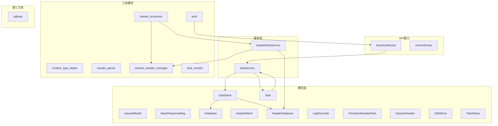
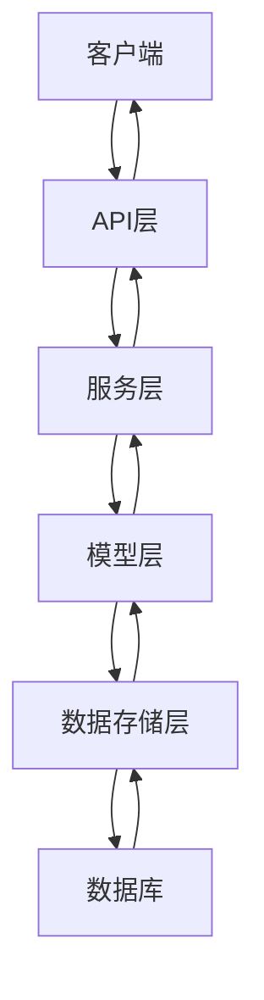
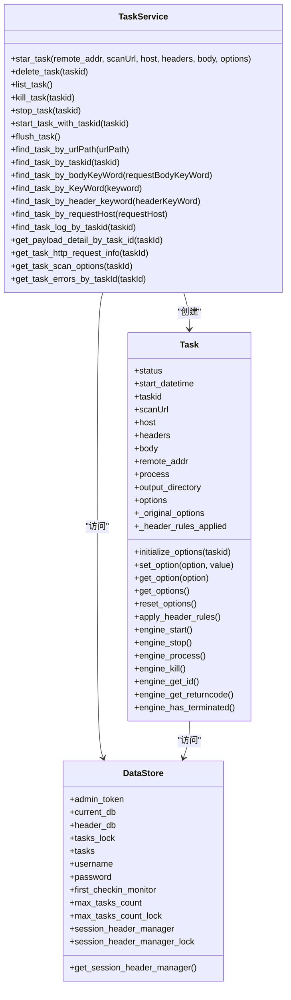
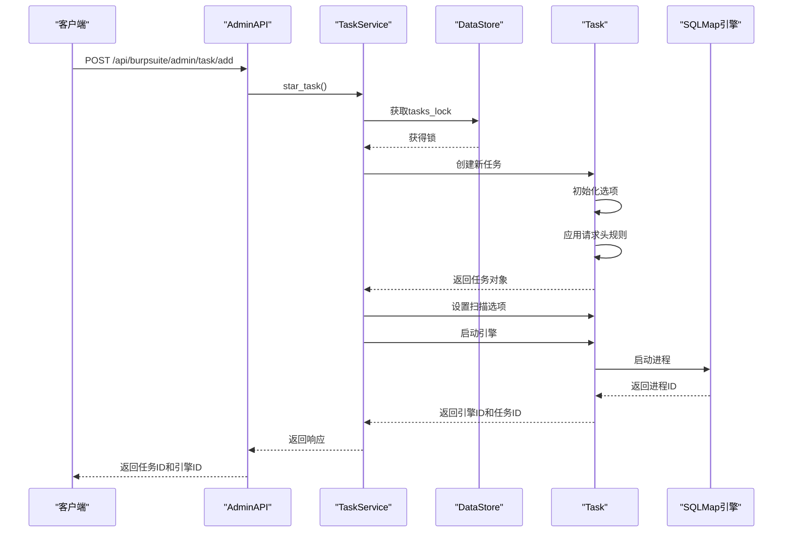
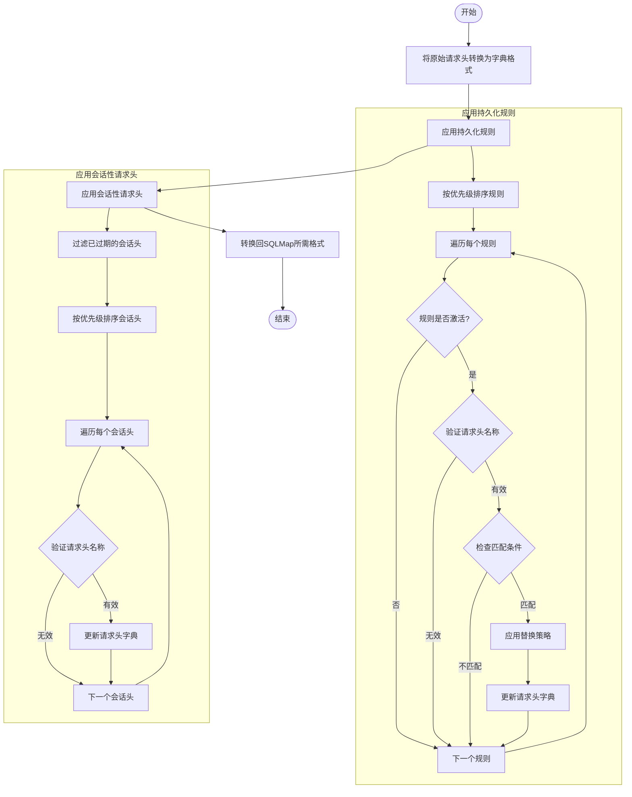
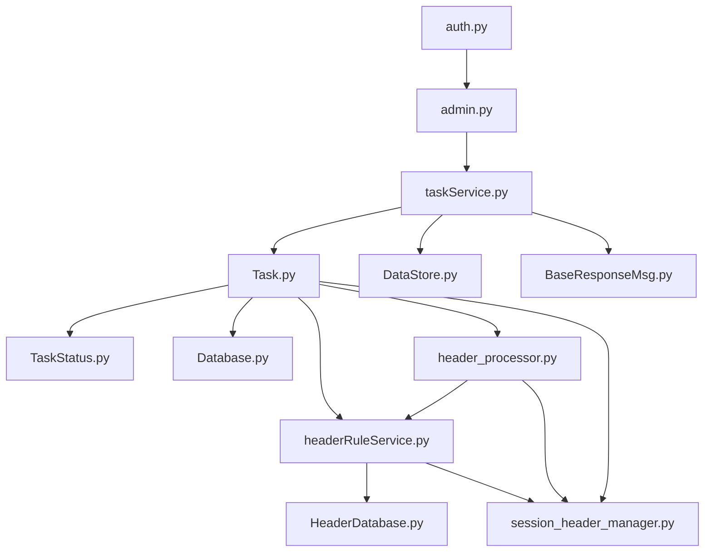

# Burp Suite插件API

<cite>
**本文档中引用的文件**   
- [admin.py](file://src/backEnd/api/burpSuiteExApi/admin.py)
- [TaskRequest.py](file://src/backEnd/model/requestModel/TaskRequest.py)
- [BaseResponseMsg.py](file://src/backEnd/model/BaseResponseMsg.py)
- [taskService.py](file://src/backEnd/service/taskService.py)
- [Task.py](file://src/backEnd/model/Task.py)
- [TaskStatus.py](file://src/backEnd/model/TaskStatus.py)
- [DataStore.py](file://src/backEnd/model/DataStore.py)
- [auth.py](file://src/backEnd/utils/auth.py)
- [headerRuleService.py](file://src/backEnd/service/headerRuleService.py)
- [header_processor.py](file://src/backEnd/utils/header_processor.py)
- [session_header_manager.py](file://src/backEnd/utils/session_header_manager.py)
</cite>

## 目录
1. [简介](#简介)
2. [项目结构](#项目结构)
3. [核心组件](#核心组件)
4. [架构概述](#架构概述)
5. [详细组件分析](#详细组件分析)
6. [依赖分析](#依赖分析)
7. [性能考虑](#性能考虑)
8. [故障排除指南](#故障排除指南)
9. [结论](#结论)
10. [附录](#附录) (如有必要)

## 简介
本文档详细描述了Burp Suite插件API，重点介绍在`burpSuiteExApi/admin.py`中定义的专用端点。该API旨在与Burp Suite安全测试工具集成，提供拦截请求转发、扫描任务创建和结果回传等功能。文档详细说明了`POST /api/burp/intercept`端点，该端点用于接收从Burp Suite插件发送的拦截请求，并触发SQL注入检测任务。此外，还涵盖了如何处理Burp Suite发送的会话数据、请求上下文和扫描配置。

## 项目结构
该项目是一个基于Python的后端服务，使用FastAPI框架构建。主要目录结构包括API接口、模型定义、服务逻辑和第三方库。API接口分为Burp Suite扩展API和Chrome扩展API，其中Burp Suite API是本文档的重点。模型层定义了请求和响应的数据结构，服务层实现了业务逻辑，而工具模块则提供了认证、请求头处理等辅助功能。

**图表来源**
- [admin.py](file://src/backEnd/api/burpSuiteExApi/admin.py)
- [taskService.py](file://src/backEnd/service/taskService.py)
- [Task.py](file://src/backEnd/model/Task.py)
- [DataStore.py](file://src/backEnd/model/DataStore.py)
- [headerRuleService.py](file://src/backEnd/service/headerRuleService.py)
- [header_processor.py](file://src/backEnd/utils/header_processor.py)
- [session_header_manager.py](file://src/backEnd/utils/session_header_manager.py)

**章节来源**
- [admin.py](file://src/backEnd/api/burpSuiteExApi/admin.py)
- [taskService.py](file://src/backEnd/service/taskService.py)
- [Task.py](file://src/backEnd/model/Task.py)
- [DataStore.py](file://src/backEnd/model/DataStore.py)

## 核心组件
核心组件包括API路由、任务服务、任务模型和数据存储。API路由负责接收外部请求并调用相应的服务方法。任务服务是业务逻辑的核心，负责创建、管理和监控扫描任务。任务模型定义了任务的状态和属性，而数据存储则提供了全局的数据访问和管理功能。

**章节来源**
- [admin.py](file://src/backEnd/api/burpSuiteExApi/admin.py#L1-L36)
- [taskService.py](file://src/backEnd/service/taskService.py#L1-L531)
- [Task.py](file://src/backEnd/model/Task.py#L1-L206)
- [DataStore.py](file://src/backEnd/model/DataStore.py#L1-L33)

## 架构概述
系统架构采用分层设计，包括API层、服务层、模型层和数据存储层。API层暴露RESTful接口，服务层处理业务逻辑，模型层定义数据结构，数据存储层管理全局状态。这种分层设计使得系统具有良好的可维护性和可扩展性。

**图表来源**
- [admin.py](file://src/backEnd/api/burpSuiteExApi/admin.py)
- [taskService.py](file://src/backEnd/service/taskService.py)
- [Task.py](file://src/backEnd/model/Task.py)
- [DataStore.py](file://src/backEnd/model/DataStore.py)

## 详细组件分析
### 任务服务分析
任务服务是系统的核心业务逻辑组件，负责管理所有扫描任务的生命周期。它提供了创建、删除、列出、停止和查询任务的方法。任务服务通过与数据存储层交互来持久化任务状态，并通过调用SQLMap引擎来执行实际的扫描任务。

#### 类图

**图表来源**
- [taskService.py](file://src/backEnd/service/taskService.py#L1-L531)
- [Task.py](file://src/backEnd/model/Task.py#L1-L206)
- [DataStore.py](file://src/backEnd/model/DataStore.py#L1-L33)

#### 序列图

**图表来源**
- [admin.py](file://src/backEnd/api/burpSuiteExApi/admin.py#L1-L36)
- [taskService.py](file://src/backEnd/service/taskService.py#L1-L531)
- [Task.py](file://src/backEnd/model/Task.py#L1-L206)

**章节来源**
- [admin.py](file://src/backEnd/api/burpSuiteExApi/admin.py#L1-L36)
- [taskService.py](file://src/backEnd/service/taskService.py#L1-L531)
- [Task.py](file://src/backEnd/model/Task.py#L1-L206)

### 请求头处理分析
请求头处理模块负责在扫描任务启动前应用持久化规则和会话性请求头。它通过`HeaderProcessor`类提供统一的接口，内部调用`HeaderRuleService`和`SessionHeaderManager`来获取规则和会话头，并根据优先级和替换策略应用这些规则。

#### 流程图

**图表来源**
- [header_processor.py](file://src/backEnd/utils/header_processor.py#L1-L241)
- [headerRuleService.py](file://src/backEnd/service/headerRuleService.py#L1-L799)
- [session_header_manager.py](file://src/backEnd/utils/session_header_manager.py#L1-L259)

**章节来源**
- [header_processor.py](file://src/backEnd/utils/header_processor.py#L1-L241)
- [headerRuleService.py](file://src/backEnd/service/headerRuleService.py#L1-L799)
- [session_header_manager.py](file://src/backEnd/utils/session_header_manager.py#L1-L259)

## 依赖分析
系统各组件之间的依赖关系清晰，遵循高内聚低耦合的原则。API层依赖于服务层，服务层依赖于模型层和数据存储层，而工具模块则被多个组件共享使用。这种依赖结构确保了系统的模块化和可维护性。

**图表来源**
- [admin.py](file://src/backEnd/api/burpSuiteExApi/admin.py)
- [taskService.py](file://src/backEnd/service/taskService.py)
- [Task.py](file://src/backEnd/model/Task.py)
- [DataStore.py](file://src/backEnd/model/DataStore.py)
- [headerRuleService.py](file://src/backEnd/service/headerRuleService.py)
- [header_processor.py](file://src/backEnd/utils/header_processor.py)
- [session_header_manager.py](file://src/backEnd/utils/session_header_manager.py)
- [auth.py](file://src/backEnd/utils/auth.py)

**章节来源**
- [admin.py](file://src/backEnd/api/burpSuiteExApi/admin.py)
- [taskService.py](file://src/backEnd/service/taskService.py)
- [Task.py](file://src/backEnd/model/Task.py)
- [DataStore.py](file://src/backEnd/model/DataStore.py)
- [headerRuleService.py](file://src/backEnd/service/headerRuleService.py)
- [header_processor.py](file://src/backEnd/utils/header_processor.py)
- [session_header_manager.py](file://src/backEnd/utils/session_header_manager.py)
- [auth.py](file://src/backEnd/utils/auth.py)

## 性能考虑
系统在设计时考虑了性能因素，采用了多种优化策略。首先，使用线程锁（`tasks_lock`）来确保多线程环境下的数据一致性，避免竞态条件。其次，通过批量操作和批处理机制减少数据库访问次数，提高效率。此外，系统还实现了会话性请求头的内存缓存，减少了对数据库的频繁读写。

## 故障排除指南
### 常见问题及解决方案
1. **任务创建失败**
   - 检查请求体中的`options`字段是否为空或格式不正确。
   - 确认请求头中包含有效的API令牌。
   - 查看服务器日志，确认是否有数据库连接问题。

2. **请求头规则未生效**
   - 确认规则的优先级设置是否正确。
   - 检查规则的匹配条件是否符合预期。
   - 验证请求头名称和值的格式是否合法。

3. **扫描任务卡住或无响应**
   - 检查SQLMap引擎进程是否正常启动。
   - 确认任务状态是否为`Running`。
   - 查看任务日志，定位具体错误信息。

4. **会话性请求头丢失**
   - 确认会话头的TTL（生存时间）设置是否合理。
   - 检查客户端IP地址是否正确传递。
   - 验证会话管理器是否正常工作。

**章节来源**
- [taskService.py](file://src/backEnd/service/taskService.py#L1-L531)
- [Task.py](file://src/backEnd/model/Task.py#L1-L206)
- [headerRuleService.py](file://src/backEnd/service/headerRuleService.py#L1-L799)
- [session_header_manager.py](file://src/backEnd/utils/session_header_manager.py#L1-L259)

## 结论
本文档详细介绍了Burp Suite插件API的设计和实现，涵盖了从API端点到内部组件的各个方面。通过分层架构和模块化设计，系统实现了高效、可靠的安全测试功能。未来可以进一步优化批处理机制，增强错误处理能力，并提供更丰富的监控和报告功能。