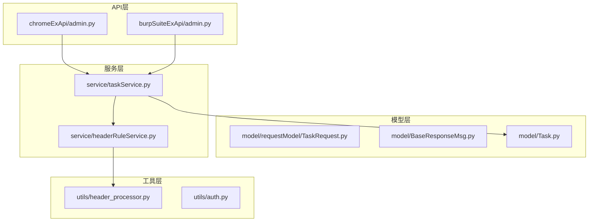
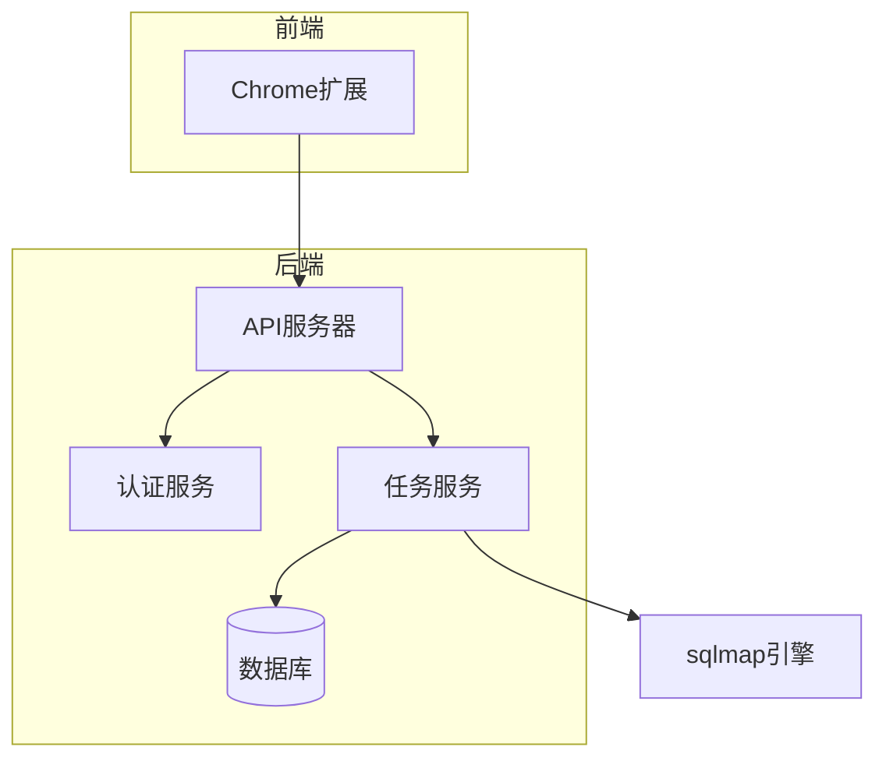
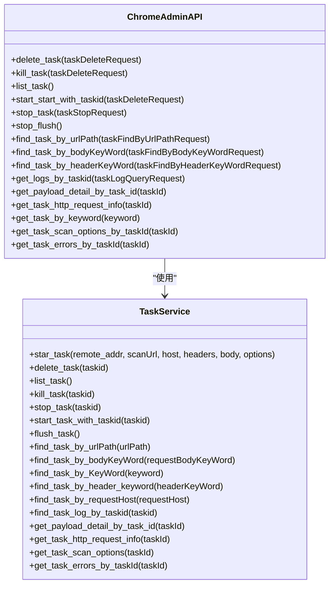
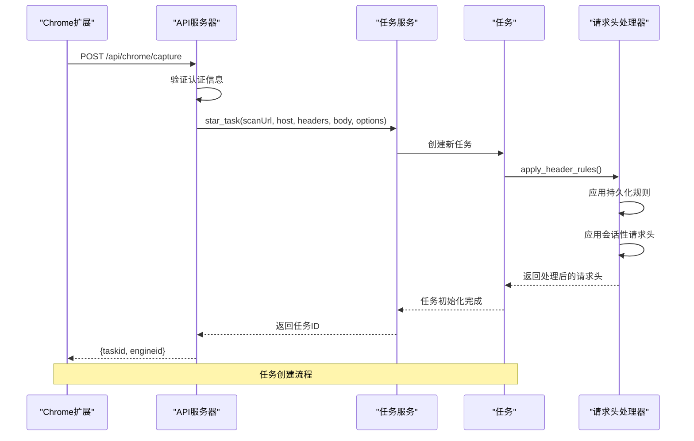
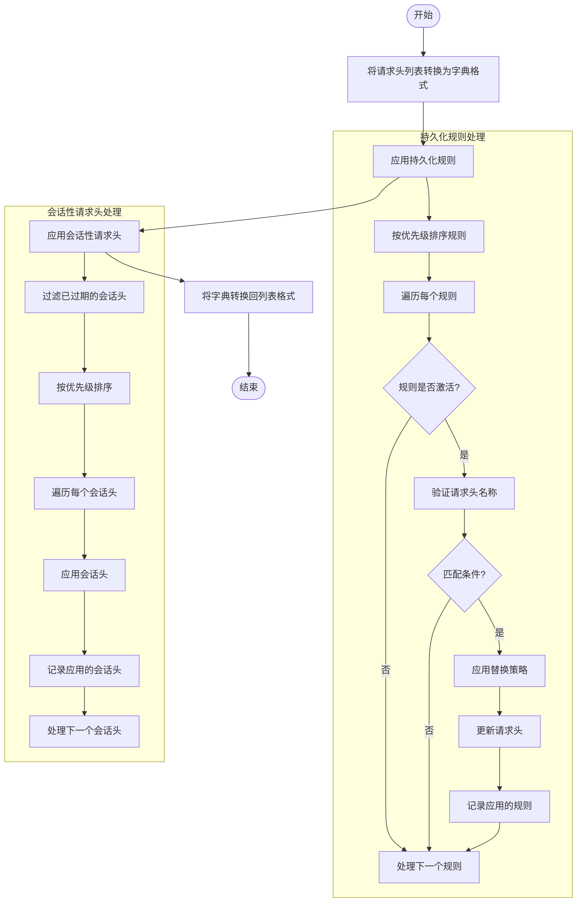
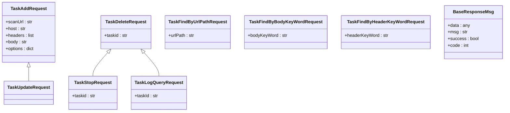
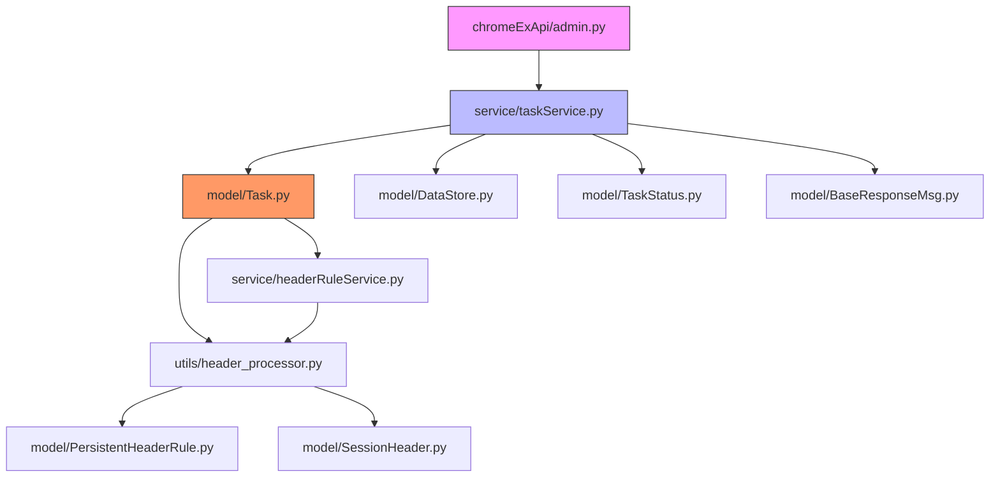

# Chrome扩展API

<cite>
**本文档引用的文件**
- [admin.py](file://src/backEnd/api/chromeExApi/admin.py)
- [TaskRequest.py](file://src/backEnd/model/requestModel/TaskRequest.py)
- [BaseResponseMsg.py](file://src/backEnd/model/BaseResponseMsg.py)
- [taskService.py](file://src/backEnd/service/taskService.py)
- [Task.py](file://src/backEnd/model/Task.py)
- [header_processor.py](file://src/backEnd/utils/header_processor.py)
</cite>

## 目录
1. [简介](#简介)
2. [项目结构](#项目结构)
3. [核心组件](#核心组件)
4. [架构概述](#架构概述)
5. [详细组件分析](#详细组件分析)
6. [依赖分析](#依赖分析)
7. [性能考虑](#性能考虑)
8. [故障排除指南](#故障排除指南)
9. [结论](#结论)
10. [附录](#附录)（如有必要）

## 简介
本文档详细说明了Chrome浏览器扩展与后端系统集成的API接口，重点介绍`chromeExApi/admin.py`中定义的专用端点。这些API支持请求捕获、请求头注入、任务创建和状态同步等功能。文档详细描述了`POST /api/chrome/capture`端点，该端点用于接收从Chrome扩展发送的HTTP请求数据并将其转换为扫描任务。同时说明了如何处理扩展发送的自定义请求头和认证信息，并提供了完整的HTTP方法、URL路径、请求体模式和响应格式说明。

## 项目结构
项目采用分层架构设计，主要分为API层、模型层和服务层。API层位于`src/backEnd/api`目录下，包含`chromeExApi`和`burpSuiteExApi`两个子模块，分别处理Chrome扩展和Burp Suite扩展的请求。模型层位于`src/backEnd/model`目录下，定义了数据结构和响应消息格式。服务层位于`src/backEnd/service`目录下，实现了核心业务逻辑。

**图示来源**
- [admin.py](file://src/backEnd/api/chromeExApi/admin.py)
- [TaskRequest.py](file://src/backEnd/model/requestModel/TaskRequest.py)
- [taskService.py](file://src/backEnd/service/taskService.py)

**本节来源**
- [admin.py](file://src/backEnd/api/chromeExApi/admin.py)
- [TaskRequest.py](file://src/backEnd/model/requestModel/TaskRequest.py)

## 核心组件
核心组件包括Chrome扩展API端点、任务服务和请求头处理器。Chrome扩展API提供了一系列管理任务的端点，如创建、删除、启动、停止任务等。任务服务负责协调任务的生命周期管理，包括任务创建、状态更新和结果查询。请求头处理器负责在扫描前应用持久化规则和会话性请求头，确保请求头规则立即生效。

**本节来源**
- [admin.py](file://src/backEnd/api/chromeExApi/admin.py)
- [taskService.py](file://src/backEnd/service/taskService.py)
- [header_processor.py](file://src/backEnd/utils/header_processor.py)

## 架构概述
系统采用FastAPI框架构建RESTful API，通过模块化设计实现了Chrome扩展与后端的无缝集成。Chrome扩展通过API端点发送HTTP请求数据，后端系统将其转换为sqlmap扫描任务。系统实现了完整的认证机制，所有敏感操作都需要Bearer Token或API Key认证。

**图示来源**
- [admin.py](file://src/backEnd/api/chromeExApi/admin.py)
- [taskService.py](file://src/backEnd/service/taskService.py)

## 详细组件分析

### Chrome扩展API分析
Chrome扩展API提供了丰富的端点来管理扫描任务，支持任务的全生命周期管理。

#### API端点类图

**图示来源**
- [admin.py](file://src/backEnd/api/chromeExApi/admin.py)
- [taskService.py](file://src/backEnd/service/taskService.py)

#### 任务创建序列图

**图示来源**
- [admin.py](file://src/backEnd/api/chromeExApi/admin.py)
- [taskService.py](file://src/backEnd/service/taskService.py)
- [Task.py](file://src/backEnd/model/Task.py)
- [header_processor.py](file://src/backEnd/utils/header_processor.py)

#### 请求头处理流程图

**图示来源**
- [header_processor.py](file://src/backEnd/utils/header_processor.py)
- [Task.py](file://src/backEnd/model/Task.py)

**本节来源**
- [admin.py](file://src/backEnd/api/chromeExApi/admin.py)
- [taskService.py](file://src/backEnd/service/taskService.py)
- [Task.py](file://src/backEnd/model/Task.py)
- [header_processor.py](file://src/backEnd/utils/header_processor.py)

### 请求模型分析
请求模型定义了API交互的数据结构，确保前后端数据的一致性。

#### 请求模型类图

**图示来源**
- [TaskRequest.py](file://src/backEnd/model/requestModel/TaskRequest.py)
- [BaseResponseMsg.py](file://src/backEnd/model/BaseResponseMsg.py)

**本节来源**
- [TaskRequest.py](file://src/backEnd/model/requestModel/TaskRequest.py)
- [BaseResponseMsg.py](file://src/backEnd/model/BaseResponseMsg.py)

## 依赖分析
系统各组件之间存在明确的依赖关系，确保了功能的模块化和可维护性。

**图示来源**
- [admin.py](file://src/backEnd/api/chromeExApi/admin.py)
- [taskService.py](file://src/backEnd/service/taskService.py)
- [Task.py](file://src/backEnd/model/Task.py)
- [header_processor.py](file://src/backEnd/utils/header_processor.py)

**本节来源**
- [admin.py](file://src/backEnd/api/chromeExApi/admin.py)
- [taskService.py](file://src/backEnd/service/taskService.py)
- [Task.py](file://src/backEnd/model/Task.py)
- [header_processor.py](file://src/backEnd/utils/header_processor.py)

## 性能考虑
系统在设计时充分考虑了性能因素，通过多种机制确保高效运行。任务管理使用线程锁确保数据一致性，避免并发访问问题。请求头处理在任务创建时一次性完成，避免了重复处理的开销。数据库查询优化了索引使用，确保任务列表和日志查询的高效性。系统还实现了任务池清理功能，定期清理已完成的任务，释放系统资源。

## 故障排除指南
当遇到API调用问题时，可以参考以下常见问题的解决方案：

1. **认证失败**：确保请求头中包含有效的Bearer Token或API Key
2. **任务创建失败**：检查请求体格式是否符合TaskAddRequest定义，特别是taskid长度必须为16位
3. **请求头处理异常**：检查持久化规则和会话性请求头的配置是否正确
4. **数据库连接问题**：确认数据库服务正常运行，连接字符串配置正确
5. **sqlmap引擎启动失败**：检查python环境和sqlmap依赖是否正确安装

**本节来源**
- [admin.py](file://src/backEnd/api/chromeExApi/admin.py)
- [taskService.py](file://src/backEnd/service/taskService.py)
- [Task.py](file://src/backEnd/model/Task.py)

## 结论
本文档详细介绍了Chrome扩展API的设计和实现，涵盖了从请求捕获到任务管理的完整流程。系统通过模块化设计实现了高内聚低耦合的架构，确保了代码的可维护性和可扩展性。API设计遵循RESTful原则，提供了清晰的端点和数据结构定义。安全方面实现了完整的认证机制，确保系统访问的安全性。整体架构能够有效支持Chrome扩展与后端系统的集成，为用户提供强大的扫描功能。

## 附录

### API端点表格
| 端点 | HTTP方法 | 描述 | 认证要求 |
|------|---------|------|---------|
| /api/chrome/admin/task/delete | DELETE | 删除任务 | Bearer Token |
| /api/chrome/admin/task/kill | PUT | 终止任务 | Bearer Token |
| /api/chrome/admin/task/list | GET | 列出所有任务 | Bearer Token |
| /api/chrome/admin/task/startBlocked | PUT | 启动被阻塞的任务 | Bearer Token |
| /api/chrome/admin/task/stop | PUT | 停止任务 | Bearer Token |
| /api/chrome/admin/task/flush | PATCH | 清理任务池 | Bearer Token |

### 状态码表格
| 状态码 | 含义 | 描述 |
|-------|------|------|
| 200 | OK | 请求成功 |
| 400 | Bad Request | 请求格式错误 |
| 404 | Not Found | 资源不存在 |
| 500 | Internal Server Error | 服务器内部错误 |
| 503 | Service Unavailable | 服务不可用 |

**本节来源**
- [admin.py](file://src/backEnd/api/chromeExApi/admin.py)
- [BaseResponseMsg.py](file://src/backEnd/model/BaseResponseMsg.py)