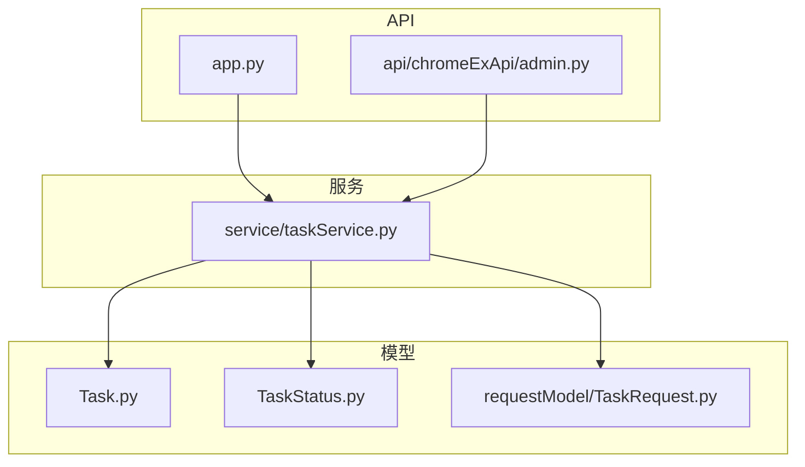
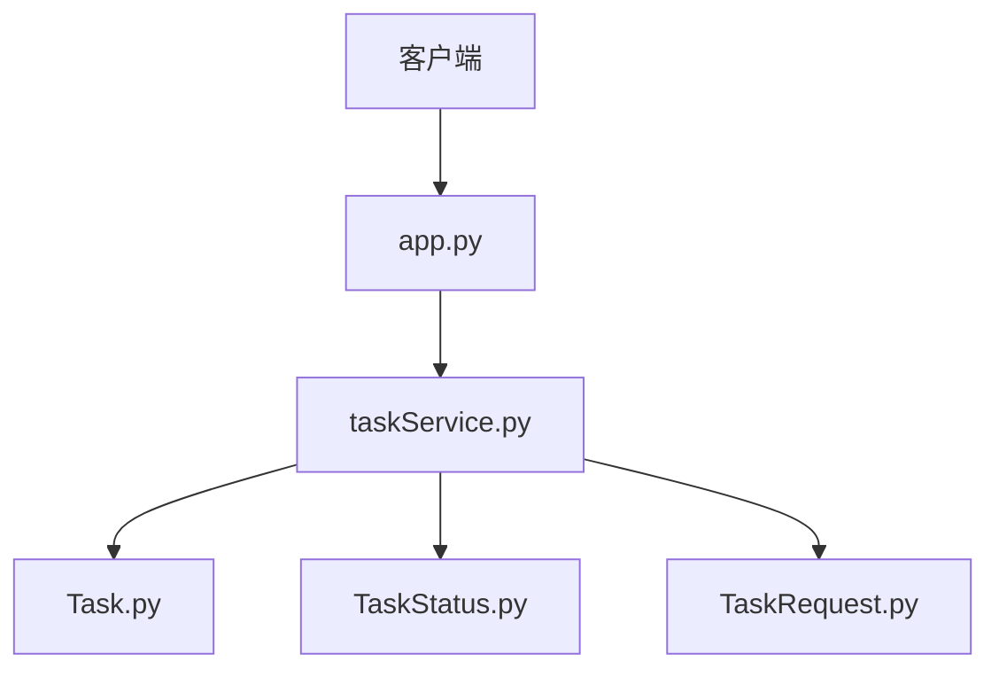
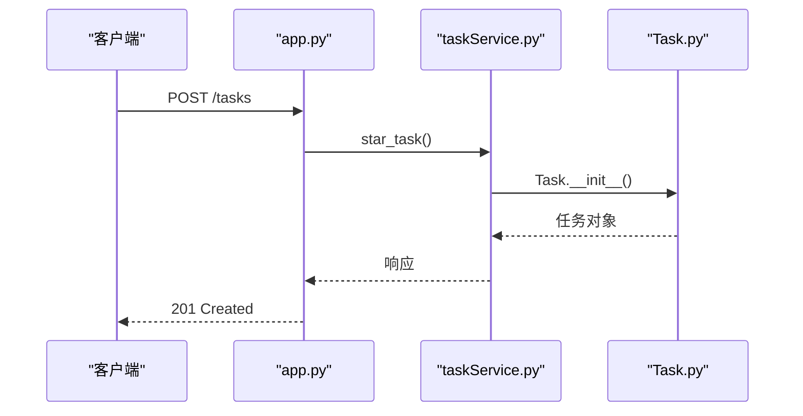
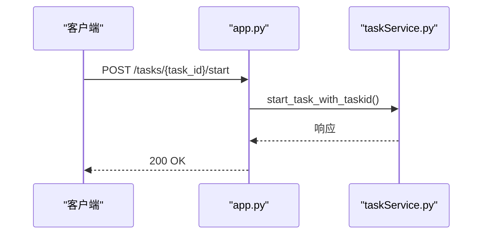
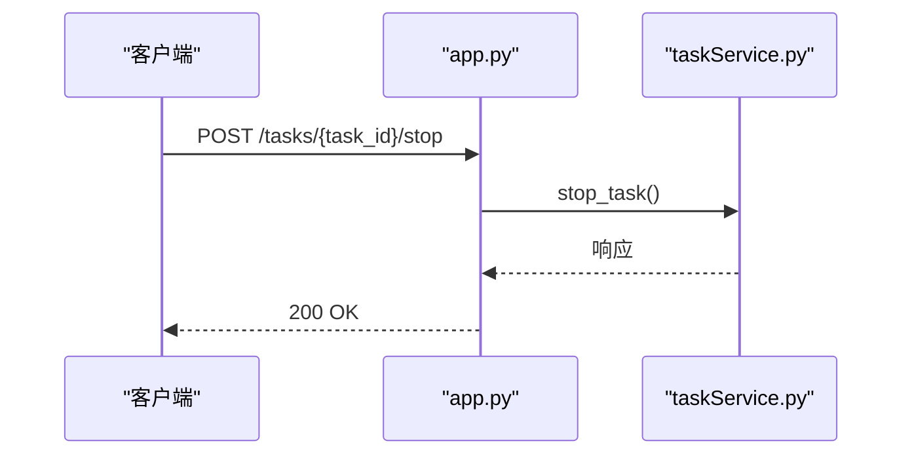
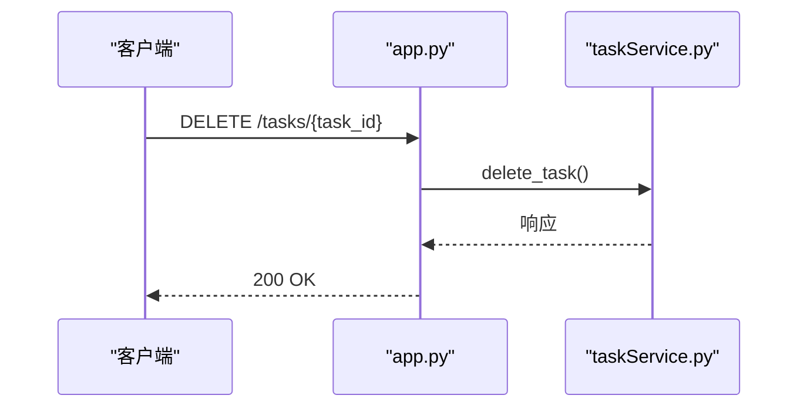
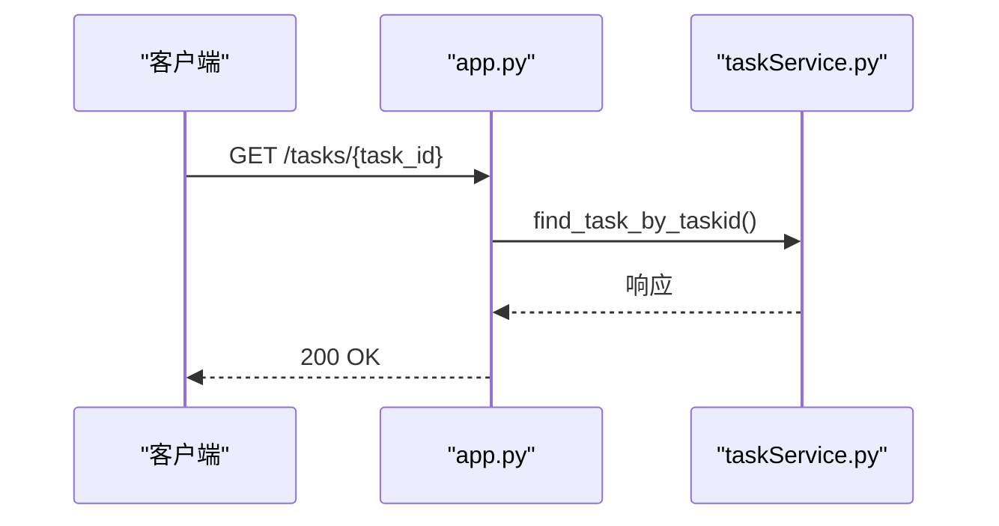
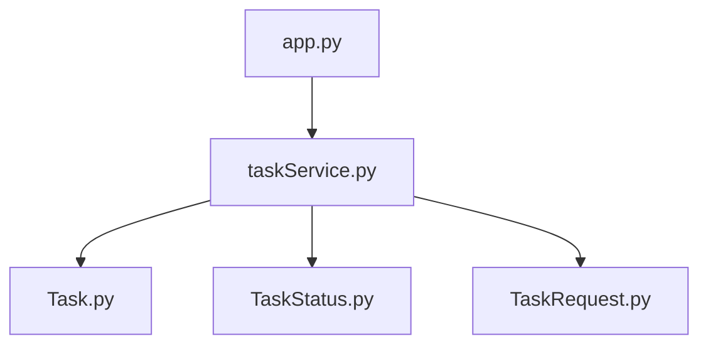
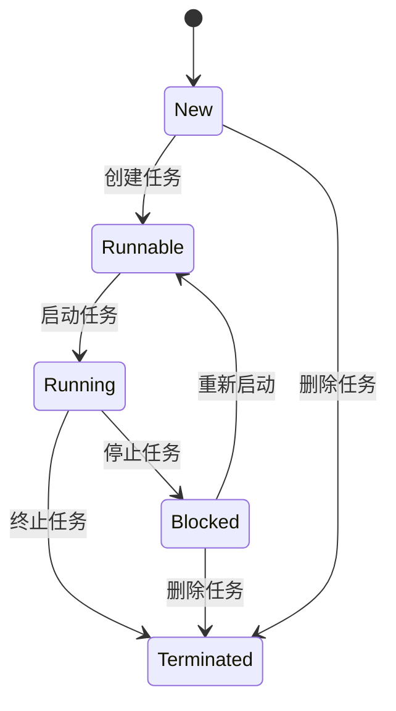

# 任务管理API

<cite>
**本文档引用的文件**  
- [app.py](file://src/backEnd/app.py)
- [taskService.py](file://src/backEnd/service/taskService.py)
- [Task.py](file://src/backEnd/model/Task.py)
- [TaskStatus.py](file://src/backEnd/model/TaskStatus.py)
- [TaskRequest.py](file://src/backEnd/model/requestModel/TaskRequest.py)
</cite>

## 目录
1. [简介](#简介)
2. [项目结构](#项目结构)
3. [核心组件](#核心组件)
4. [架构概述](#架构概述)
5. [详细组件分析](#详细组件分析)
6. [依赖分析](#依赖分析)
7. [性能考虑](#性能考虑)
8. [故障排除指南](#故障排除指南)
9. [结论](#结论)
10. [附录](#附录)（如有必要）

## 简介
本文档详细描述了任务管理API的实现，重点关注`app.py`中定义的任务相关RESTful端点。文档涵盖了任务创建、启动、停止、删除和查询的完整实现细节，以及`Task`模型的字段定义、状态转换流程（`TaskStatus`）和`taskService.py`中的业务逻辑处理。使用OpenAPI/Swagger规范精确描述每个端点的HTTP方法、URL路径、请求参数、请求体模式和响应格式，并提供详细的curl命令示例和Python客户端代码片段。

## 项目结构
项目结构清晰，主要分为API、模型、服务和第三方库等模块。任务管理相关的API端点定义在`app.py`中，业务逻辑处理在`service/taskService.py`中，任务模型和状态定义在`model`目录下。

**图示来源**  
- [app.py](file://src/backEnd/app.py#L1-L44)
- [taskService.py](file://src/backEnd/service/taskService.py#L1-L531)
- [Task.py](file://src/backEnd/model/Task.py#L1-L206)
- [TaskStatus.py](file://src/backEnd/model/TaskStatus.py#L1-L8)
- [TaskRequest.py](file://src/backEnd/model/requestModel/TaskRequest.py#L1-L56)

**章节来源**  
- [app.py](file://src/backEnd/app.py#L1-L44)
- [taskService.py](file://src/backEnd/service/taskService.py#L1-L531)

## 核心组件
核心组件包括任务管理API端点、任务服务、任务模型和任务状态枚举。这些组件协同工作，实现任务的全生命周期管理。

**章节来源**  
- [taskService.py](file://src/backEnd/service/taskService.py#L1-L531)
- [Task.py](file://src/backEnd/model/Task.py#L1-L206)
- [TaskStatus.py](file://src/backEnd/model/TaskStatus.py#L1-L8)

## 架构概述
系统架构采用分层设计，API层负责接收和响应HTTP请求，服务层处理业务逻辑，模型层定义数据结构和状态。

**图示来源**  
- [app.py](file://src/backEnd/app.py#L1-L44)
- [taskService.py](file://src/backEnd/service/taskService.py#L1-L531)
- [Task.py](file://src/backEnd/model/Task.py#L1-L206)
- [TaskStatus.py](file://src/backEnd/model/TaskStatus.py#L1-L8)
- [TaskRequest.py](file://src/backEnd/model/requestModel/TaskRequest.py#L1-L56)

## 详细组件分析
### 任务创建分析
任务创建通过`POST /tasks`端点实现，调用`taskService.star_task`方法创建新任务。

**图示来源**  
- [app.py](file://src/backEnd/app.py#L1-L44)
- [taskService.py](file://src/backEnd/service/taskService.py#L57-L86)
- [Task.py](file://src/backEnd/model/Task.py#L19-L40)

**章节来源**  
- [app.py](file://src/backEnd/app.py#L1-L44)
- [taskService.py](file://src/backEnd/service/taskService.py#L57-L86)
- [Task.py](file://src/backEnd/model/Task.py#L19-L40)

### 任务启动分析
任务启动通过`POST /tasks/{task_id}/start`端点实现，调用`taskService.start_task_with_taskid`方法启动任务。

**图示来源**  
- [app.py](file://src/backEnd/app.py#L1-L44)
- [taskService.py](file://src/backEnd/service/taskService.py#L213-L224)

**章节来源**  
- [app.py](file://src/backEnd/app.py#L1-L44)
- [taskService.py](file://src/backEnd/service/taskService.py#L213-L224)

### 任务停止分析
任务停止通过`POST /tasks/{task_id}/stop`端点实现，调用`taskService.stop_task`方法停止任务。

**图示来源**  
- [app.py](file://src/backEnd/app.py#L1-L44)
- [taskService.py](file://src/backEnd/service/taskService.py#L192-L211)

**章节来源**  
- [app.py](file://src/backEnd/app.py#L1-L44)
- [taskService.py](file://src/backEnd/service/taskService.py#L192-L211)

### 任务删除分析
任务删除通过`DELETE /tasks/{task_id}`端点实现，调用`taskService.delete_task`方法删除任务。

**图示来源**  
- [app.py](file://src/backEnd/app.py#L1-L44)
- [taskService.py](file://src/backEnd/service/taskService.py#L88-L99)

**章节来源**  
- [app.py](file://src/backEnd/app.py#L1-L44)
- [taskService.py](file://src/backEnd/service/taskService.py#L88-L99)

### 任务查询分析
任务查询通过`GET /tasks/{task_id}`端点实现，调用`taskService.find_task_by_taskid`方法查询任务。

**图示来源**  
- [app.py](file://src/backEnd/app.py#L1-L44)
- [taskService.py](file://src/backEnd/service/taskService.py#L247-L257)

**章节来源**  
- [app.py](file://src/backEnd/app.py#L1-L44)
- [taskService.py](file://src/backEnd/service/taskService.py#L247-L257)

## 依赖分析
系统依赖关系清晰，API层依赖服务层，服务层依赖模型层。各组件之间通过明确的接口进行交互。

**图示来源**  
- [app.py](file://src/backEnd/app.py#L1-L44)
- [taskService.py](file://src/backEnd/service/taskService.py#L1-L531)
- [Task.py](file://src/backEnd/model/Task.py#L1-L206)
- [TaskStatus.py](file://src/backEnd/model/TaskStatus.py#L1-L8)
- [TaskRequest.py](file://src/backEnd/model/requestModel/TaskRequest.py#L1-L56)

**章节来源**  
- [app.py](file://src/backEnd/app.py#L1-L44)
- [taskService.py](file://src/backEnd/service/taskService.py#L1-L531)

## 性能考虑
系统在任务管理过程中考虑了性能优化，如使用锁机制保护共享资源，避免并发访问导致的数据不一致问题。

**章节来源**  
- [taskService.py](file://src/backEnd/service/taskService.py#L1-L531)

## 故障排除指南
常见问题包括任务状态冲突、数据库连接失败等。处理策略包括检查任务状态、确保数据库连接正常等。

**章节来源**  
- [taskService.py](file://src/backEnd/service/taskService.py#L1-L531)
- [Task.py](file://src/backEnd/model/Task.py#L1-L206)

## 结论
本文档详细描述了任务管理API的实现，涵盖了任务的全生命周期管理。通过清晰的架构设计和合理的依赖管理，系统能够高效地处理任务管理请求。

## 附录
### 任务状态转换图

**图示来源**  
- [TaskStatus.py](file://src/backEnd/model/TaskStatus.py#L1-L8)
- [taskService.py](file://src/backEnd/service/taskService.py#L1-L531)