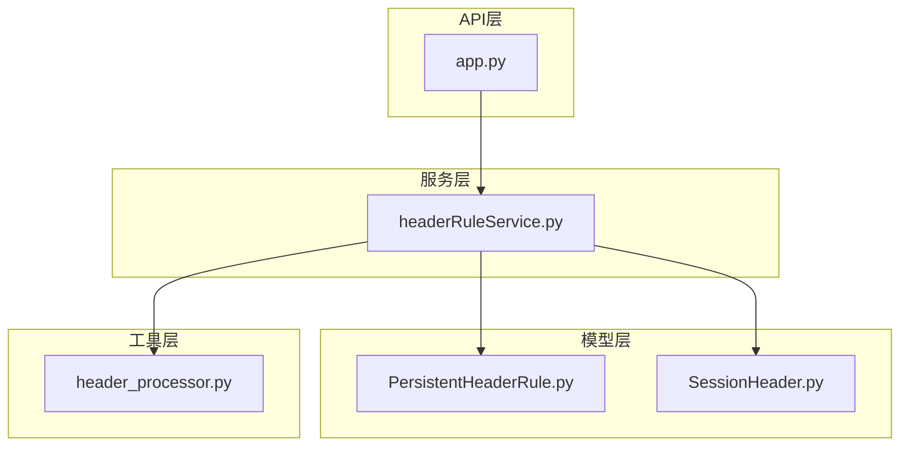
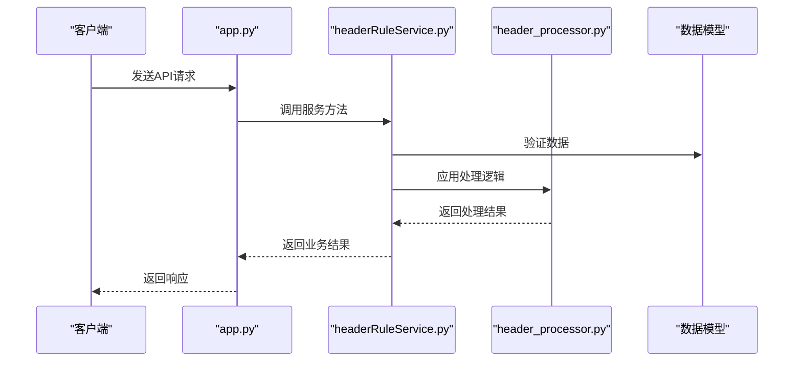
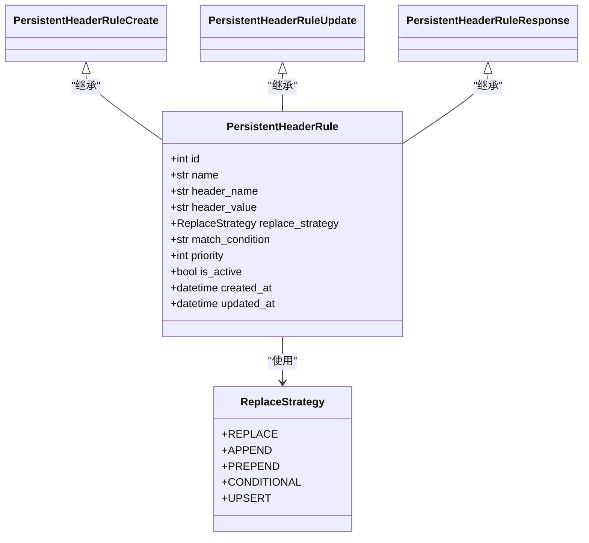
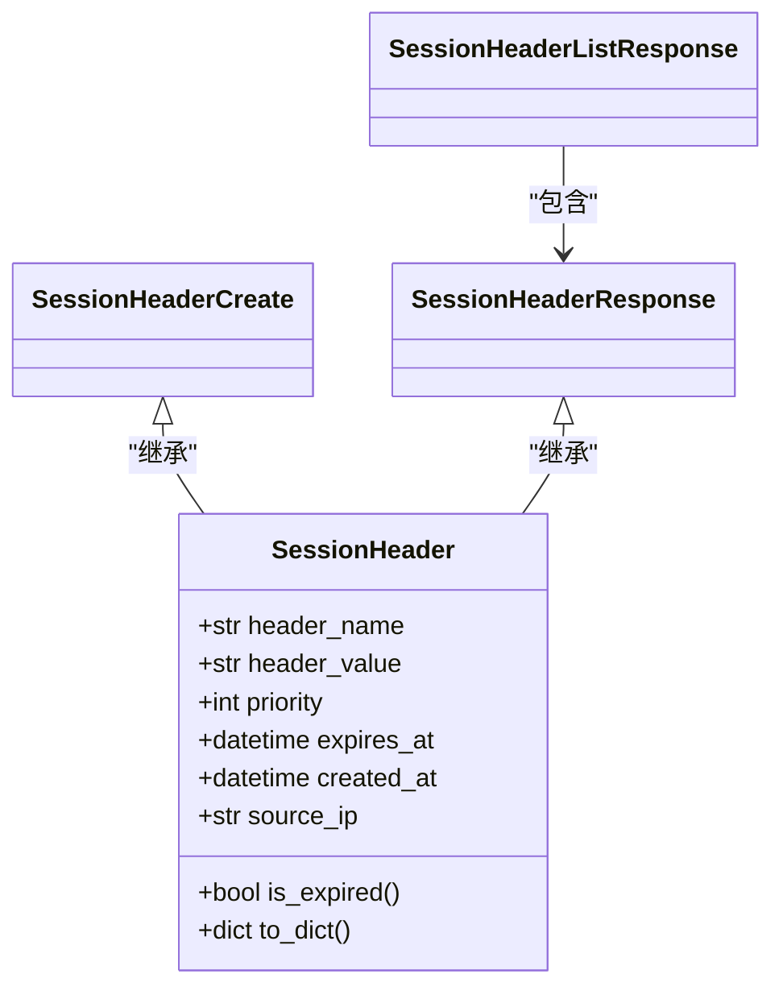
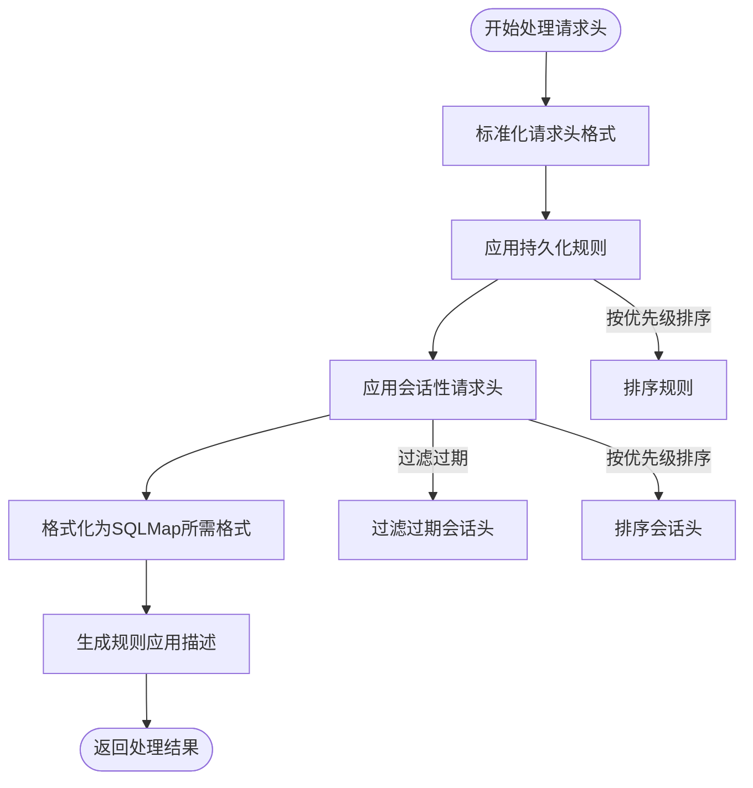
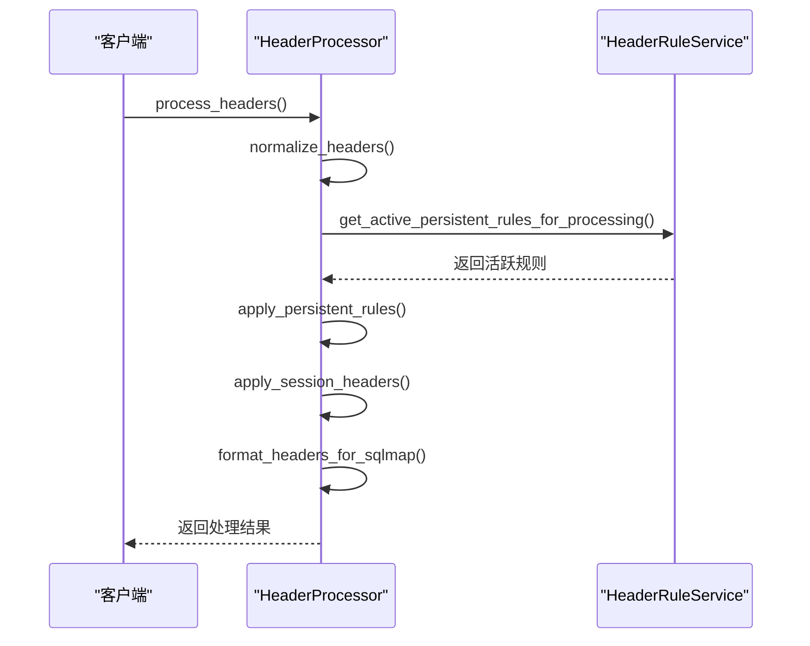
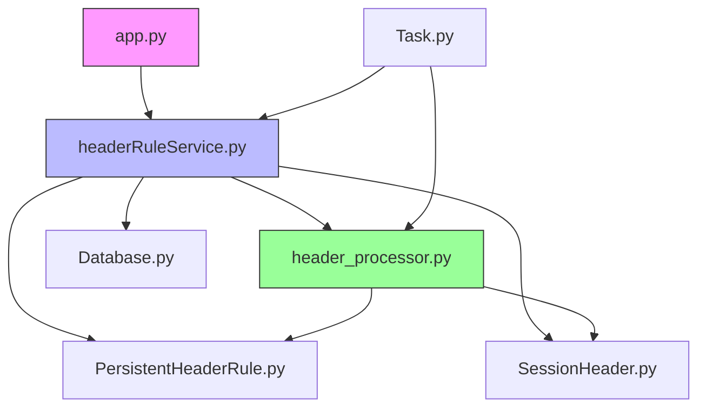

# 请求头规则管理API

<cite>
**本文档引用的文件**
- [app.py](file://src/backEnd/app.py)
- [headerRuleService.py](file://src/backEnd/service/headerRuleService.py)
- [header_processor.py](file://src/backEnd/utils/header_processor.py)
- [PersistentHeaderRule.py](file://src/backEnd/model/PersistentHeaderRule.py)
- [SessionHeader.py](file://src/backEnd/model/SessionHeader.py)
</cite>

## 目录
1. [简介](#简介)
2. [项目结构](#项目结构)
3. [核心组件](#核心组件)
4. [架构概述](#架构概述)
5. [详细组件分析](#详细组件分析)
6. [依赖分析](#依赖分析)
7. [性能考虑](#性能考虑)
8. [故障排除指南](#故障排除指南)
9. [结论](#结论)

## 简介
本文档详细描述了请求头规则管理API，聚焦于`app.py`中定义的RESTful端点，用于管理持久化和会话级别的请求头处理规则。文档涵盖了规则的CRUD操作、数据模型定义、业务逻辑处理流程以及完整的API规范。系统通过`headerRuleService.py`实现业务逻辑，利用`header_processor.py`进行规则匹配和优先级处理，为开发者提供了一套完整的请求头处理解决方案。

## 项目结构
项目采用分层架构设计，主要分为API接口层、服务层、模型层和工具层。API接口在`app.py`中定义，服务逻辑在`service`目录下实现，数据模型在`model`目录中定义，通用工具函数位于`utils`目录。

**图示来源**
- [app.py](file://src/backEnd/app.py)
- [headerRuleService.py](file://src/backEnd/service/headerRuleService.py)
- [PersistentHeaderRule.py](file://src/backEnd/model/PersistentHeaderRule.py)
- [SessionHeader.py](file://src/backEnd/model/SessionHeader.py)
- [header_processor.py](file://src/backEnd/utils/header_processor.py)

**章节来源**
- [app.py](file://src/backEnd/app.py)
- [headerRuleService.py](file://src/backEnd/service/headerRuleService.py)

## 核心组件
核心组件包括持久化请求头规则管理、会话性请求头管理、批量操作处理和规则预览功能。`PersistentHeaderRule`模型定义了持久化存储的规则结构，`SessionHeader`模型管理临时会话规则，`HeaderRuleService`类封装了所有业务逻辑，`HeaderProcessor`类负责实际的规则应用和处理。

**章节来源**
- [headerRuleService.py](file://src/backEnd/service/headerRuleService.py#L35-L36)
- [PersistentHeaderRule.py](file://src/backEnd/model/PersistentHeaderRule.py#L15-L32)
- [SessionHeader.py](file://src/backEnd/model/SessionHeader.py#L5-L32)

## 架构概述
系统采用典型的分层架构，从API接口到数据处理形成清晰的调用链。API接收请求后，由服务层处理业务逻辑，调用模型进行数据验证，并通过处理器应用规则。

**图示来源**
- [app.py](file://src/backEnd/app.py)
- [headerRuleService.py](file://src/backEnd/service/headerRuleService.py)
- [header_processor.py](file://src/backEnd/utils/header_processor.py)

## 详细组件分析

### 持久化规则管理分析
持久化规则管理提供了完整的CRUD操作接口，支持规则的创建、查询、更新和删除。规则存储在数据库中，具有持久性。

#### 持久化规则数据模型

**图示来源**
- [PersistentHeaderRule.py](file://src/backEnd/model/PersistentHeaderRule.py#L0-L68)

### 会话规则管理分析
会话性请求头管理提供了临时规则的创建和管理功能，这些规则存储在内存中，具有生命周期。

#### 会话规则数据模型

**图示来源**
- [SessionHeader.py](file://src/backEnd/model/SessionHeader.py#L0-L61)

### 规则处理流程分析
规则处理流程定义了如何应用持久化规则和会话性请求头到原始请求头列表。

#### 规则处理流程图

**图示来源**
- [header_processor.py](file://src/backEnd/utils/header_processor.py#L178-L214)

#### 规则应用序列图

**图示来源**
- [header_processor.py](file://src/backEnd/utils/header_processor.py#L178-L214)
- [headerRuleService.py](file://src/backEnd/service/headerRuleService.py#L488-L532)

## 依赖分析
系统各组件之间存在明确的依赖关系，形成了清晰的调用链。

**图示来源**
- [app.py](file://src/backEnd/app.py)
- [headerRuleService.py](file://src/backEnd/service/headerRuleService.py)
- [header_processor.py](file://src/backEnd/utils/header_processor.py)
- [PersistentHeaderRule.py](file://src/backEnd/model/PersistentHeaderRule.py)
- [SessionHeader.py](file://src/backEnd/model/SessionHeader.py)

**章节来源**
- [app.py](file://src/backEnd/app.py)
- [headerRuleService.py](file://src/backEnd/service/headerRuleService.py)
- [header_processor.py](file://src/backEnd/utils/header_processor.py)

## 性能考虑
系统在设计时考虑了性能优化，包括数据库连接检查、规则优先级排序和批量操作支持。持久化规则按优先级降序排序，确保高优先级规则先被应用。会话性请求头按优先级升序排序，后执行的高优先级规则可以覆盖先执行的低优先级规则。批量操作减少了数据库交互次数，提高了处理效率。

## 故障排除指南
常见问题包括数据库连接失败、规则名称冲突和请求头格式无效。系统提供了详细的错误消息和状态码，便于定位问题。预览功能可以帮助开发者在实际应用前验证规则效果。日志记录了关键操作，可用于问题追踪和调试。

**章节来源**
- [headerRuleService.py](file://src/backEnd/service/headerRuleService.py#L44-L55)
- [header_processor.py](file://src/backEnd/utils/header_processor.py#L47-L54)

## 结论
请求头规则管理API提供了一套完整的解决方案，支持持久化和会话级别的请求头处理。通过清晰的分层架构和模块化设计，系统实现了高内聚低耦合。丰富的API接口和批量操作功能满足了各种使用场景，为开发者提供了灵活的请求头管理能力。