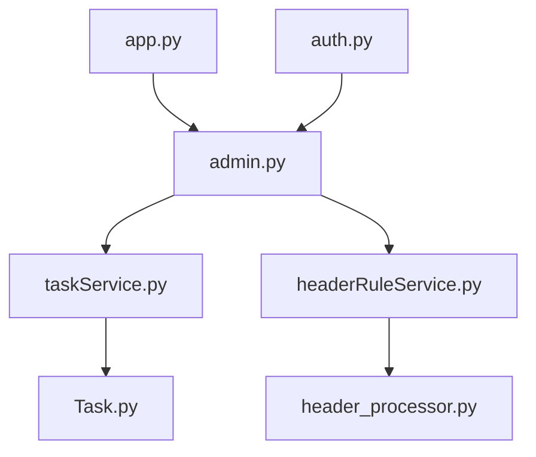
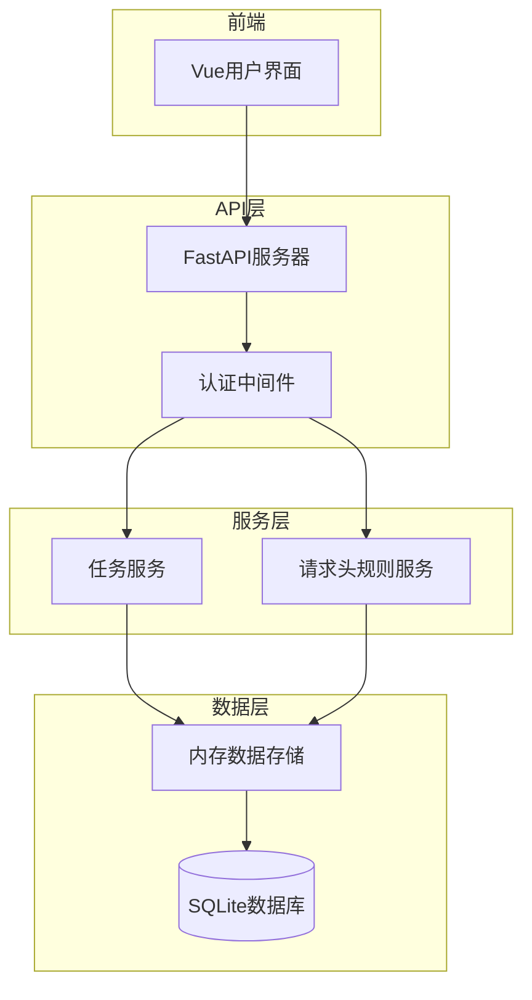

# 通用API

<cite>
**本文档引用的文件**
- [app.py](file://src/backEnd/app.py)
- [taskService.py](file://src/backEnd/service/taskService.py)
- [headerRuleService.py](file://src/backEnd/service/headerRuleService.py)
- [admin.py](file://src/backEnd/api/chromeExApi/admin.py)
- [Task.py](file://src/backEnd/model/Task.py)
- [header_processor.py](file://src/backEnd/utils/header_processor.py)
- [auth.py](file://src/backEnd/utils/auth.py)
</cite>

## 目录
1. [简介](#简介)
2. [项目结构](#项目结构)
3. [核心组件](#核心组件)
4. [架构概述](#架构概述)
5. [详细组件分析](#详细组件分析)
6. [依赖分析](#依赖分析)
7. [性能考虑](#性能考虑)
8. [故障排除指南](#故障排除指南)
9. [结论](#结论)

## 简介
本文档详细描述了基于FastAPI构建的通用API，重点介绍任务管理和请求头规则管理功能。API提供RESTful端点用于创建、启动、停止、删除和查询任务，同时支持持久化规则和会话级别规则的CRUD操作。系统集成了sqlmap安全测试工具，通过API接口实现自动化漏洞扫描功能。所有端点均要求Bearer Token认证，确保接口访问的安全性。

## 项目结构
该项目采用分层架构设计，包含API路由、业务服务、数据模型和工具模块。核心功能分布在`service`目录下的`taskService.py`和`headerRuleService.py`文件中，分别处理任务管理和请求头规则管理。API端点通过`api/chromeExApi/admin.py`文件定义，使用FastAPI框架实现RESTful接口。数据模型定义在`model`目录中，包括任务、请求头规则等核心实体。

**图示来源**
- [app.py](file://src/backEnd/app.py#L1-L44)
- [admin.py](file://src/backEnd/api/chromeExApi/admin.py#L1-L117)

## 核心组件
系统核心组件包括任务服务和请求头规则服务。任务服务负责管理sqlmap扫描任务的全生命周期，包括任务创建、启动、停止和状态查询。请求头规则服务提供持久化规则和会话级别规则的管理功能，支持规则的批量导入和预览处理效果。两个服务通过DataStore共享数据状态，确保多线程环境下的数据一致性。

**组件来源**
- [taskService.py](file://src/backEnd/service/taskService.py#L1-L531)
- [headerRuleService.py](file://src/backEnd/service/headerRuleService.py#L1-L799)

## 架构概述
系统采用微服务架构模式，前端通过Vue框架构建用户界面，后端使用FastAPI提供RESTful API。API层负责请求路由和认证，服务层实现业务逻辑，数据层管理任务状态和规则存储。请求头处理流程在任务创建时自动触发，依次应用持久化规则和会话级别规则，确保每次扫描都使用最新的请求头配置。

**图示来源**
- [app.py](file://src/backEnd/app.py#L1-L44)
- [taskService.py](file://src/backEnd/service/taskService.py#L1-L531)
- [headerRuleService.py](file://src/backEnd/service/headerRuleService.py#L1-L799)

## 详细组件分析
### 任务管理组件分析
任务管理组件提供完整的任务生命周期管理功能，包括创建、启动、停止、删除和查询操作。每个任务对应一个唯一的task_id，用于标识和管理特定的sqlmap扫描会话。任务状态机包含新建、可运行、运行中、阻塞和终止等状态，确保任务执行的有序性。

#### 任务管理类图

**图示来源**
- [taskService.py](file://src/backEnd/service/taskService.py#L1-L531)
- [Task.py](file://src/backEnd/model/Task.py#L1-L206)

### 请求头规则管理组件分析
请求头规则管理组件提供灵活的请求头处理机制，支持持久化规则和会话级别规则两种模式。持久化规则存储在数据库中，适用于全局生效的请求头配置；会话级别规则存储在内存中，适用于临时性的请求头修改。系统支持多种替换策略，包括替换、追加、前置和条件性替换。

#### 请求头处理流程图

**图示来源**
- [headerRuleService.py](file://src/backEnd/service/headerRuleService.py#L1-L799)
- [header_processor.py](file://src/backEnd/utils/header_processor.py#L1-L241)

## 依赖分析
系统各组件之间存在明确的依赖关系。API路由依赖于服务层实现业务逻辑，服务层依赖于数据模型和工具模块。任务服务和请求头规则服务通过DataStore共享数据状态，避免了直接耦合。认证模块作为独立组件，通过依赖注入方式集成到各个API端点中，确保认证逻辑的统一性。

**图示来源**
- [admin.py](file://src/backEnd/api/chromeExApi/admin.py#L1-L117)
- [taskService.py](file://src/backEnd/service/taskService.py#L1-L531)
- [headerRuleService.py](file://src/backEnd/service/headerRuleService.py#L1-L799)

## 性能考虑
系统在设计时充分考虑了性能因素。任务管理采用异步处理模式，避免阻塞主线程。请求头规则处理在任务创建时一次性完成，减少运行时开销。数据库操作使用连接池管理，提高数据访问效率。内存数据存储(DataStore)采用线程锁保护，确保多线程环境下的数据一致性，同时最小化锁竞争。

## 故障排除指南
常见问题包括认证失败、任务创建异常和请求头处理错误。认证失败通常由于缺少Bearer Token或IP地址不在白名单中。任务创建异常可能源于sqlmap配置错误或资源不足。请求头处理错误多由无效的请求头名称或格式引起。系统日志记录了详细的处理过程，有助于快速定位问题根源。

**故障排除来源**
- [auth.py](file://src/backEnd/utils/auth.py#L1-L22)
- [taskService.py](file://src/backEnd/service/taskService.py#L1-L531)
- [header_processor.py](file://src/backEnd/utils/header_processor.py#L1-L241)

## 结论
该通用API提供了完整的任务管理和请求头规则管理功能，通过清晰的分层架构和模块化设计，实现了高内聚低耦合的系统结构。API设计遵循RESTful原则，接口清晰易用。安全机制完善，通过认证和输入验证防止滥用。系统具备良好的扩展性，可方便地添加新的功能模块。