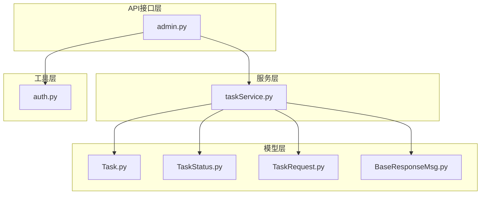
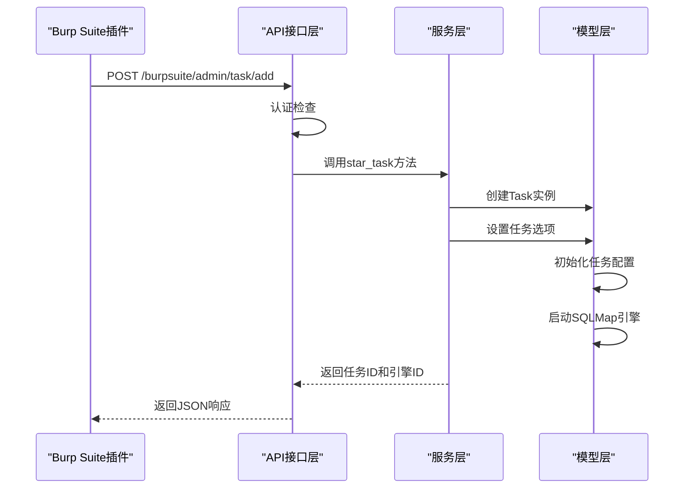
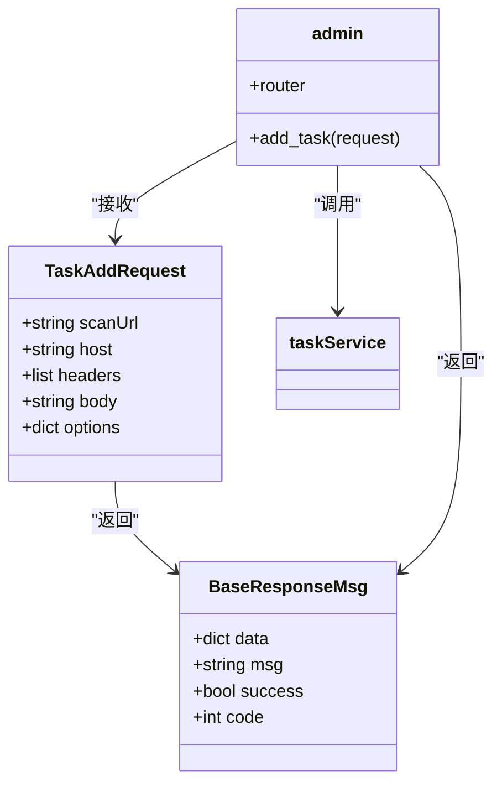
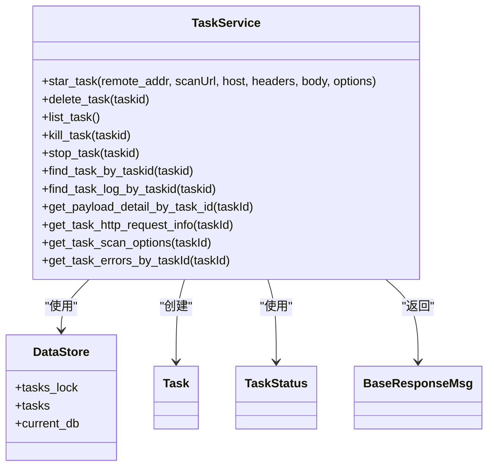
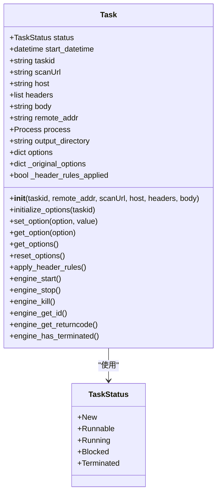
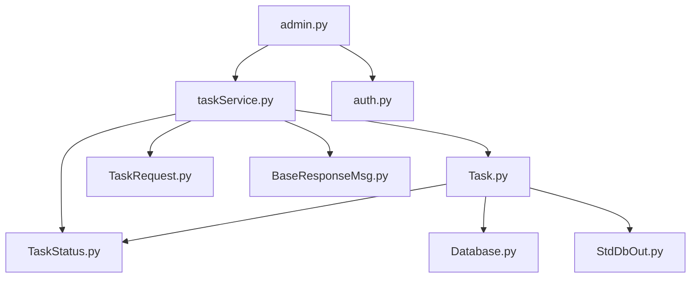

# Burp Suite任务管理

<cite>
**Referenced Files in This Document**   
- [admin.py](file://src/backEnd/api/burpSuiteExApi/admin.py)
- [Task.py](file://src/backEnd/model/Task.py)
- [TaskStatus.py](file://src/backEnd/model/TaskStatus.py)
- [TaskRequest.py](file://src/backEnd/model/requestModel/TaskRequest.py)
- [taskService.py](file://src/backEnd/service/taskService.py)
- [BaseResponseMsg.py](file://src/backEnd/model/BaseResponseMsg.py)
- [auth.py](file://src/backEnd/utils/auth.py)
</cite>

## 目录
1. [简介](#简介)
2. [项目结构](#项目结构)
3. [核心组件](#核心组件)
4. [架构概述](#架构概述)
5. [详细组件分析](#详细组件分析)
6. [依赖分析](#依赖分析)
7. [性能考虑](#性能考虑)
8. [故障排除指南](#故障排除指南)
9. [结论](#结论)

## 简介
本文档详细介绍了Burp Suite插件的任务管理功能，重点说明了与Burp Suite集成的任务创建、状态查询、结果回传等API端点、认证机制和使用示例。系统通过RESTful API提供任务管理功能，支持任务的创建、删除、停止、查询等操作，并通过统一的响应格式返回操作结果。

## 项目结构
Burp Suite任务管理功能主要位于`src/backEnd/api/burpSuiteExApi`目录下，相关模型和业务逻辑分布在`model`和`service`目录中。系统采用分层架构，包括API接口层、服务层、模型层和数据存储层。

**Diagram sources**
- [admin.py](file://src/backEnd/api/burpSuiteExApi/admin.py)
- [taskService.py](file://src/backEnd/service/taskService.py)
- [Task.py](file://src/backEnd/model/Task.py)
- [TaskStatus.py](file://src/backEnd/model/TaskStatus.py)
- [TaskRequest.py](file://src/backEnd/model/requestModel/TaskRequest.py)
- [BaseResponseMsg.py](file://src/backEnd/model/BaseResponseMsg.py)
- [auth.py](file://src/backEnd/utils/auth.py)

**Section sources**
- [admin.py](file://src/backEnd/api/burpSuiteExApi/admin.py)
- [taskService.py](file://src/backEnd/service/taskService.py)

## 核心组件
系统的核心组件包括任务管理API、任务服务、任务模型、任务状态枚举、任务请求模型、基础响应消息和认证工具。这些组件协同工作，实现了完整的任务管理功能。

**Section sources**
- [admin.py](file://src/backEnd/api/burpSuiteExApi/admin.py#L1-L36)
- [taskService.py](file://src/backEnd/service/taskService.py#L1-L532)
- [Task.py](file://src/backEnd/model/Task.py#L1-L207)

## 架构概述
系统采用典型的分层架构，API接口层负责接收和响应HTTP请求，服务层处理业务逻辑，模型层定义数据结构和状态，工具层提供辅助功能。各层之间通过清晰的接口进行通信，确保了系统的可维护性和可扩展性。

**Diagram sources**
- [admin.py](file://src/backEnd/api/burpSuiteExApi/admin.py#L18-L36)
- [taskService.py](file://src/backEnd/service/taskService.py#L45-L100)
- [Task.py](file://src/backEnd/model/Task.py#L18-L50)

## 详细组件分析

### 任务管理API分析
任务管理API提供RESTful接口，支持任务的创建、删除、停止、查询等操作。API接口通过FastAPI框架实现，使用标准的HTTP方法和状态码。

#### API组件分析

**Diagram sources**
- [TaskRequest.py](file://src/backEnd/model/requestModel/TaskRequest.py#L40-L56)
- [BaseResponseMsg.py](file://src/backEnd/model/BaseResponseMsg.py#L4-L14)
- [admin.py](file://src/backEnd/api/burpSuiteExApi/admin.py#L18-L36)
- [taskService.py](file://src/backEnd/service/taskService.py#L45-L532)

### 任务服务分析
任务服务是系统的核心业务逻辑层，负责处理任务的创建、管理、状态查询和结果获取等操作。服务层通过DataStore管理所有任务的生命周期。

#### 服务组件分析

**Diagram sources**
- [taskService.py](file://src/backEnd/service/taskService.py#L45-L532)
- [DataStore.py](file://src/backEnd/model/DataStore.py)
- [Task.py](file://src/backEnd/model/Task.py)
- [TaskStatus.py](file://src/backEnd/model/TaskStatus.py)
- [BaseResponseMsg.py](file://src/backEnd/model/BaseResponseMsg.py)

### 任务模型分析
任务模型定义了任务的数据结构和行为，包括任务状态管理、选项设置、引擎控制等。每个任务实例代表一个独立的SQLMap扫描进程。

#### 模型组件分析

**Diagram sources**
- [Task.py](file://src/backEnd/model/Task.py#L18-L205)
- [TaskStatus.py](file://src/backEnd/model/TaskStatus.py#L3-L8)

## 依赖分析
系统各组件之间的依赖关系清晰，API接口层依赖服务层，服务层依赖模型层和数据存储层。通过依赖注入和模块化设计，确保了系统的松耦合和高内聚。

**Diagram sources**
- [admin.py](file://src/backEnd/api/burpSuiteExApi/admin.py)
- [taskService.py](file://src/backEnd/service/taskService.py)
- [Task.py](file://src/backEnd/model/Task.py)
- [TaskStatus.py](file://src/backEnd/model/TaskStatus.py)
- [TaskRequest.py](file://src/backEnd/model/requestModel/TaskRequest.py)
- [BaseResponseMsg.py](file://src/backEnd/model/BaseResponseMsg.py)
- [auth.py](file://src/backEnd/utils/auth.py)
- [Database.py](file://src/backEnd/model/Database.py)
- [StdDbOut.py](file://src/backEnd/model/StdDbOut.py)

**Section sources**
- [admin.py](file://src/backEnd/api/burpSuiteExApi/admin.py)
- [taskService.py](file://src/backEnd/service/taskService.py)
- [Task.py](file://src/backEnd/model/Task.py)

## 性能考虑
系统在设计时考虑了性能因素，通过异步处理、线程锁和资源复用等技术提高效率。任务创建和状态查询操作都经过优化，确保在高并发场景下的响应速度。

## 故障排除指南
当遇到任务管理相关问题时，可以按照以下步骤进行排查：
1. 检查API认证是否正确
2. 验证请求参数是否符合要求
3. 查看系统日志获取详细错误信息
4. 检查数据库连接状态
5. 确认SQLMap引擎是否正常运行

**Section sources**
- [admin.py](file://src/backEnd/api/burpSuiteExApi/admin.py#L18-L36)
- [taskService.py](file://src/backEnd/service/taskService.py#L100-L200)
- [Task.py](file://src/backEnd/model/Task.py#L150-L200)

## 结论
Burp Suite任务管理功能提供了完整的API接口，支持任务的全生命周期管理。系统设计合理，代码结构清晰，易于维护和扩展。通过本文档的介绍，开发者可以快速理解和使用任务管理功能，实现与Burp Suite的无缝集成。