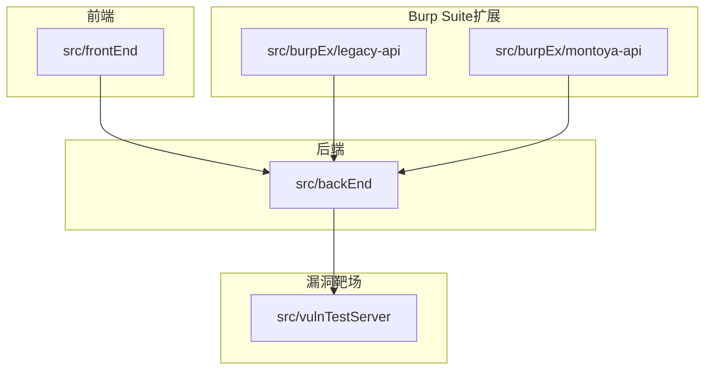
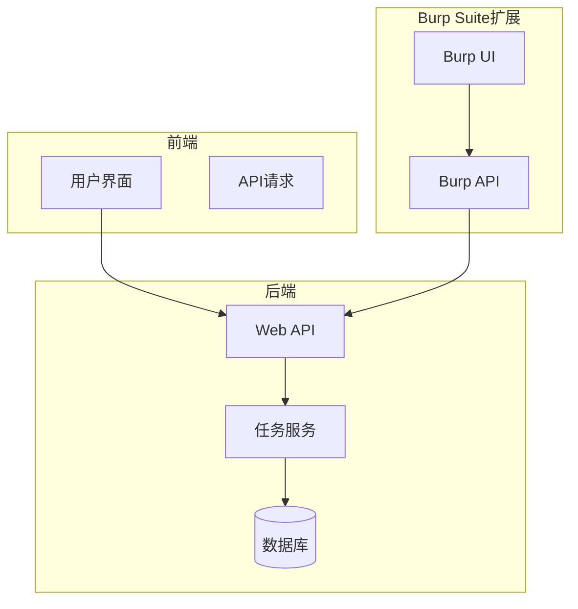
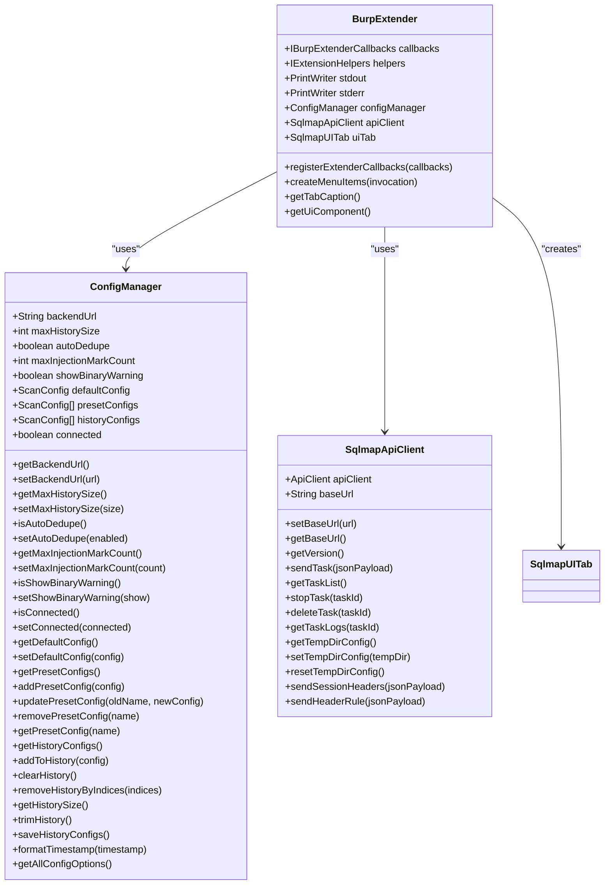
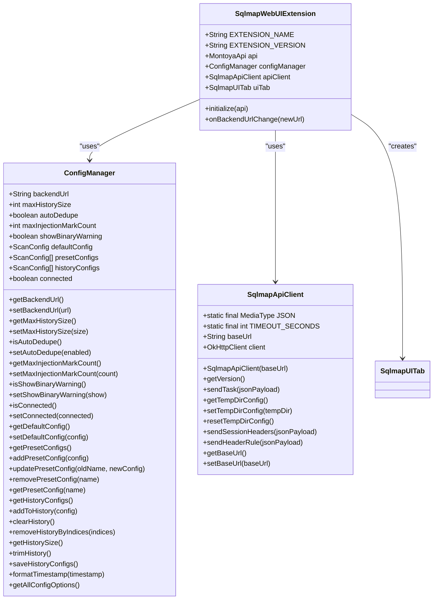
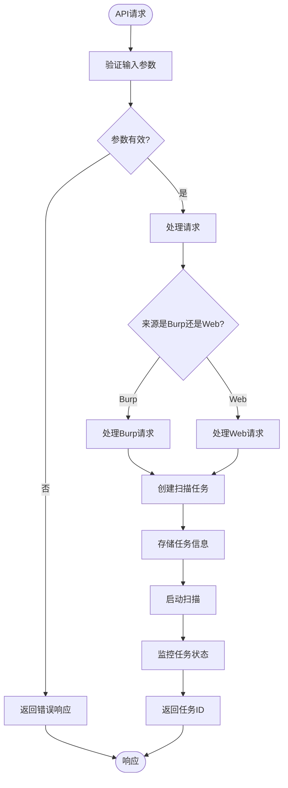
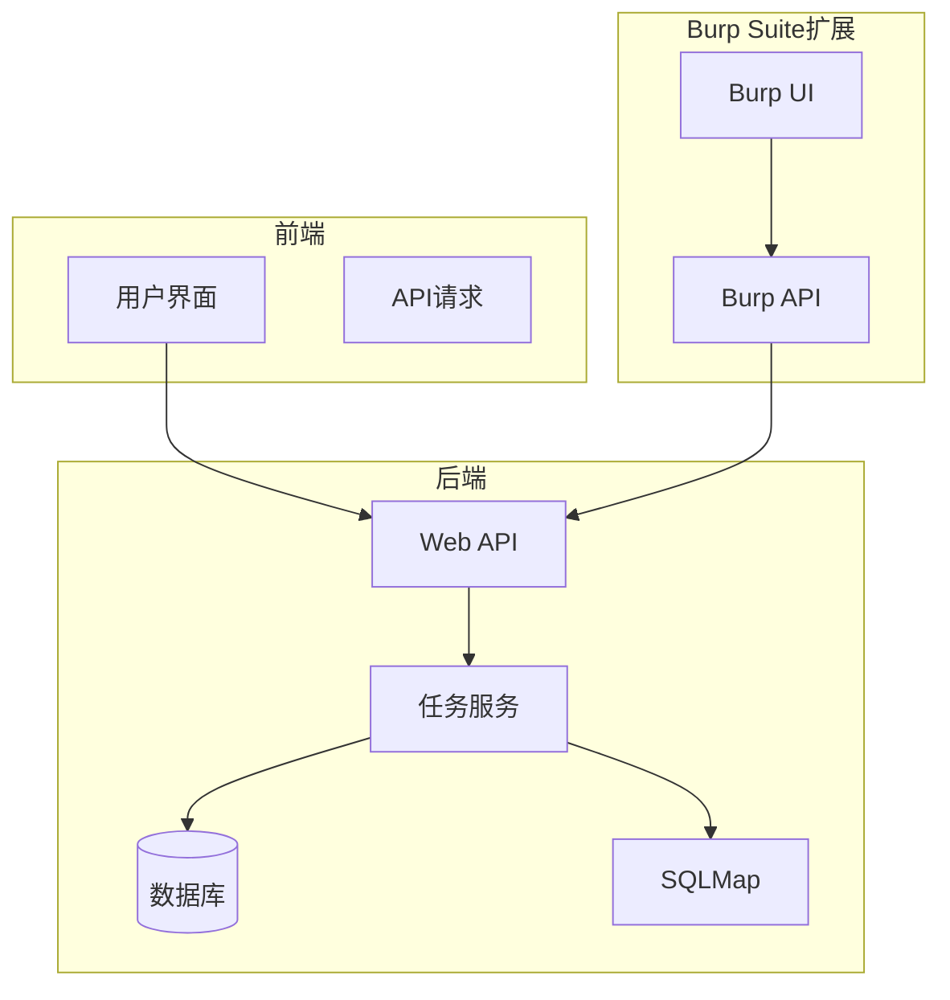

# Burp Suite插件

<cite>
**本文档引用文件**   
- [README.md](file://README.md)
- [src/burpEx/legacy-api/pom.xml](file://src/burpEx/legacy-api/pom.xml)
- [src/burpEx/montoya-api/pom.xml](file://src/burpEx/montoya-api/pom.xml)
- [src/burpEx/legacy-api/src/main/java/com/sqlmapwebui/burp/BurpExtender.java](file://src/burpEx/legacy-api/src/main/java/com/sqlmapwebui/burp/BurpExtender.java)
- [src/burpEx/montoya-api/src/main/java/com/sqlmapwebui/burp/SqlmapWebUIExtension.java](file://src/burpEx/montoya-api/src/main/java/com/sqlmapwebui/burp/SqlmapWebUIExtension.java)
- [src/burpEx/legacy-api/src/main/java/com/sqlmapwebui/burp/SqlmapApiClient.java](file://src/burpEx/legacy-api/src/main/java/com/sqlmapwebui/burp/SqlmapApiClient.java)
- [src/burpEx/montoya-api/src/main/java/com/sqlmapwebui/burp/SqlmapApiClient.java](file://src/burpEx/montoya-api/src/main/java/com/sqlmapwebui/burp/SqlmapApiClient.java)
- [src/burpEx/legacy-api/src/main/java/com/sqlmapwebui/burp/ConfigManager.java](file://src/burpEx/legacy-api/src/main/java/com/sqlmapwebui/burp/ConfigManager.java)
- [src/burpEx/montoya-api/src/main/java/com/sqlmapwebui/burp/ConfigManager.java](file://src/burpEx/montoya-api/src/main/java/com/sqlmapwebui/burp/ConfigManager.java)
- [src/backEnd/app.py](file://src/backEnd/app.py)
- [src/backEnd/api/burpSuiteExApi/admin.py](file://src/backEnd/api/burpSuiteExApi/admin.py)
- [src/backEnd/api/commonApi/webTaskController.py](file://src/backEnd/api/commonApi/webTaskController.py)
- [doc/USAGE_GUIDE.md](file://doc/USAGE_GUIDE.md)
</cite>

## 目录
1. [简介](#简介)
2. [项目结构](#项目结构)
3. [核心组件](#核心组件)
4. [架构概述](#架构概述)
5. [详细组件分析](#详细组件分析)
6. [依赖分析](#依赖分析)
7. [性能考虑](#性能考虑)
8. [故障排除指南](#故障排除指南)
9. [结论](#结论)

## 简介
sqlmapWebUI插件是一个现代化的SQL注入测试平台，为安全研究人员提供便捷的SQL注入测试环境。该插件支持Burp Suite的Legacy API和Montoya API两种版本，允许用户从Burp Suite直接发送HTTP请求到Web UI进行扫描。插件提供了丰富的功能，包括右键菜单集成、HTTP请求发送、配置管理、请求头规则管理等。通过与后端服务的交互，插件能够实现扫描任务的创建、监控和管理，同时支持默认配置和常用配置的管理，以及活动日志记录。

## 项目结构
项目结构清晰地分为前端、后端、Burp Suite扩展和漏洞靶场四个主要部分。前端使用Vue 3和TypeScript构建，提供现代化的用户界面。后端基于FastAPI框架，使用Python 3.13+开发，负责处理API请求和与SQLMap的交互。Burp Suite扩展分为Legacy API和Montoya API两个版本，分别支持不同版本的Burp Suite。漏洞靶场VulnShop提供了一个模拟的电商平台，包含多种SQL注入漏洞类型，用于测试和学习。

**图源**
- [README.md](file://README.md#L175-L208)

## 核心组件
sqlmapWebUI插件的核心组件包括Burp Suite扩展、后端API服务和前端用户界面。Burp Suite扩展负责与Burp Suite的集成，提供右键菜单功能，允许用户将HTTP请求发送到Web UI进行扫描。后端API服务处理来自Burp Suite扩展和前端的请求，管理扫描任务的创建、监控和结果获取。前端用户界面提供直观的任务管理、配置管理和结果展示功能。

**组件源**
- [src/burpEx/legacy-api/src/main/java/com/sqlmapwebui/burp/BurpExtender.java](file://src/burpEx/legacy-api/src/main/java/com/sqlmapwebui/burp/BurpExtender.java#L30-L390)
- [src/burpEx/montoya-api/src/main/java/com/sqlmapwebui/burp/SqlmapWebUIExtension.java](file://src/burpEx/montoya-api/src/main/java/com/sqlmapwebui/burp/SqlmapWebUIExtension.java#L19-L67)
- [src/backEnd/app.py](file://src/backEnd/app.py#L20-L80)

## 架构概述
sqlmapWebUI插件的架构设计遵循分层原则，将前端、后端和Burp Suite扩展分离，确保各组件的独立性和可维护性。前端负责用户交互和界面展示，后端处理业务逻辑和数据存储，Burp Suite扩展实现与Burp Suite的集成。插件通过RESTful API与后端服务通信，实现扫描任务的创建、监控和管理。

**图源**
- [README.md](file://README.md#L95-L115)
- [src/backEnd/app.py](file://src/backEnd/app.py#L20-L80)

## 详细组件分析

### Burp Suite扩展分析
Burp Suite扩展是sqlmapWebUI插件的核心部分，负责与Burp Suite的集成。扩展提供了右键菜单功能，允许用户将HTTP请求发送到Web UI进行扫描。扩展支持Legacy API和Montoya API两种版本，分别适用于不同版本的Burp Suite。

#### Legacy API版本
Legacy API版本的扩展使用Burp Suite的旧版API，支持Java 11+。扩展通过`IContextMenuFactory`接口实现右键菜单功能，允许用户选择"Send to SQLMap WebUI"选项。扩展还提供了配置管理功能，允许用户设置默认扫描参数和常用配置。

**图源**
- [src/burpEx/legacy-api/src/main/java/com/sqlmapwebui/burp/BurpExtender.java](file://src/burpEx/legacy-api/src/main/java/com/sqlmapwebui/burp/BurpExtender.java#L30-L390)
- [src/burpEx/legacy-api/src/main/java/com/sqlmapwebui/burp/ConfigManager.java](file://src/burpEx/legacy-api/src/main/java/com/sqlmapwebui/burp/ConfigManager.java#L16-L402)
- [src/burpEx/legacy-api/src/main/java/com/sqlmapwebui/burp/SqlmapApiClient.java](file://src/burpEx/legacy-api/src/main/java/com/sqlmapwebui/burp/SqlmapApiClient.java#L9-L107)

#### Montoya API版本
Montoya API版本的扩展使用Burp Suite的新版API，支持Java 17+和Burp 2023.1+。扩展通过`MontoyaApi`接口实现与Burp Suite的集成，提供了更现代化的API和更好的性能。扩展同样提供了右键菜单功能和配置管理功能。

**图源**
- [src/burpEx/montoya-api/src/main/java/com/sqlmapwebui/burp/SqlmapWebUIExtension.java](file://src/burpEx/montoya-api/src/main/java/com/sqlmapwebui/burp/SqlmapWebUIExtension.java#L19-L67)
- [src/burpEx/montoya-api/src/main/java/com/sqlmapwebui/burp/ConfigManager.java](file://src/burpEx/montoya-api/src/main/java/com/sqlmapwebui/burp/ConfigManager.java#L17-L405)
- [src/burpEx/montoya-api/src/main/java/com/sqlmapwebui/burp/SqlmapApiClient.java](file://src/burpEx/montoya-api/src/main/java/com/sqlmapwebui/burp/SqlmapApiClient.java#L15-L208)

### 后端API服务分析
后端API服务是sqlmapWebUI插件的核心，负责处理来自Burp Suite扩展和前端的请求，管理扫描任务的创建、监控和结果获取。服务基于FastAPI框架，使用Python 3.13+开发。

#### API路由
后端API服务提供了多个路由，用于处理不同的请求。主要路由包括：
- `/api/burpsuite/admin/task/add`：接收来自Burp Suite扩展的扫描任务请求
- `/api/web/admin/task/add`：接收来自前端的扫描任务请求
- `/api/version`：返回系统版本信息
- `/api/health`：健康检查端点

**图源**
- [src/backEnd/app.py](file://src/backEnd/app.py#L20-L80)
- [src/backEnd/api/burpSuiteExApi/admin.py](file://src/backEnd/api/burpSuiteExApi/admin.py#L16-L37)
- [src/backEnd/api/commonApi/webTaskController.py](file://src/backEnd/api/commonApi/webTaskController.py#L16-L91)

### 前端用户界面分析
前端用户界面使用Vue 3和TypeScript构建，提供现代化的用户界面。界面包括任务管理、配置管理、请求头规则管理等功能。

#### 任务管理
任务管理功能允许用户创建、监控和管理扫描任务。用户可以通过点击"新建任务"按钮创建新的扫描任务，填写目标URL、HTTP请求和扫描参数，然后点击"开始扫描"按钮启动扫描。

#### 配置管理
配置管理功能允许用户设置默认扫描参数和常用配置。用户可以在"默认配置"标签页设置全局默认参数，在"常用配置"标签页保存常用配置组合。

#### 请求头规则管理
请求头规则管理功能允许用户创建持久化规则和会话级规则。持久化规则长期有效，支持CRUD完整操作；会话级规则临时有效，支持TTL自动过期。

**组件源**
- [src/frontEnd/src/main.ts](file://src/frontEnd/src/main.ts#L1-L16)
- [doc/USAGE_GUIDE.md](file://doc/USAGE_GUIDE.md#L96-L164)

## 依赖分析
sqlmapWebUI插件的依赖关系清晰，各组件之间的依赖关系明确。Burp Suite扩展依赖于后端API服务，后端API服务依赖于SQLMap工具和数据库。前端用户界面依赖于后端API服务。

**图源**
- [src/burpEx/legacy-api/pom.xml](file://src/burpEx/legacy-api/pom.xml#L21-L76)
- [src/burpEx/montoya-api/pom.xml](file://src/burpEx/montoya-api/pom.xml#L22-L77)
- [src/backEnd/app.py](file://src/backEnd/app.py#L20-L80)

## 性能考虑
sqlmapWebUI插件在设计时考虑了性能优化。后端API服务使用异步框架FastAPI，能够高效处理大量并发请求。Burp Suite扩展在发送请求时会过滤二进制内容，只发送纯文本请求，减少不必要的网络传输。插件还支持批量操作，允许用户一次性发送多个请求，提高效率。

## 故障排除指南
### 常见问题
#### Q: 后端服务启动失败？
A: 检查Python版本（需要3.13+），确保依赖安装完整。使用`uv sync --extra thirdparty`安装依赖。

#### Q: 前端无法连接后端？
A: 检查跨域配置，确保后端服务正在运行。后端默认监听8775端口。

#### Q: VulnShop靶场无法访问？
A: 确保端口9527未被占用，使用127.0.0.1而非localhost。

#### Q: Burp Suite插件无法发送请求？
A: 检查后端服务器地址配置，确保网络连通。使用"测试连接"功能验证。

#### Q: 扫描任务一直Pending？
A: 检查SQLMap是否正确集成，查看后端日志获取详细信息。

#### Q: 请求头规则不生效？
A: 检查规则是否启用，作用域配置是否正确匹配目标URL。

#### Q: 会话Header过期了？
A: 会话Header有TTL限制，过期后需重新添加。可增大TTL或使用持久化规则。

**组件源**
- [doc/USAGE_GUIDE.md](file://doc/USAGE_GUIDE.md#L542-L564)

## 结论
sqlmapWebUI插件是一个功能强大的SQL注入测试工具，通过与Burp Suite的集成，为安全研究人员提供了便捷的测试环境。插件支持Legacy API和Montoya API两种版本，适应不同版本的Burp Suite。通过详细的配置管理和丰富的功能，插件能够满足各种测试需求。未来可以进一步优化性能，增加更多高级功能，提升用户体验。