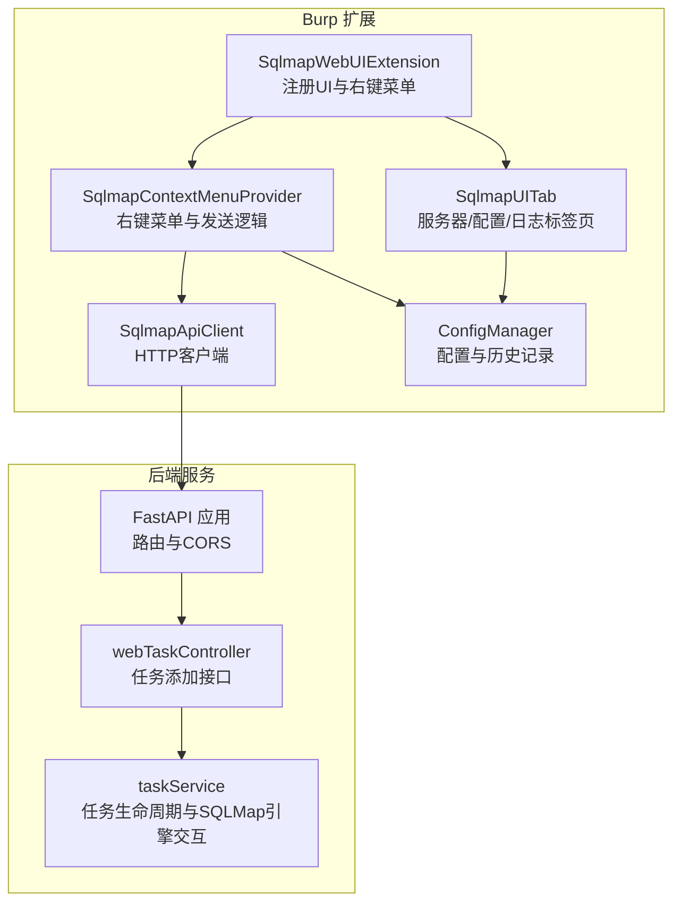
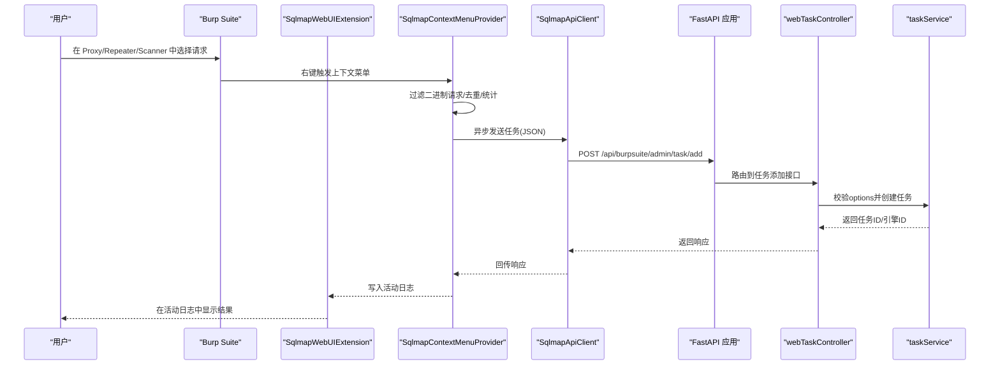
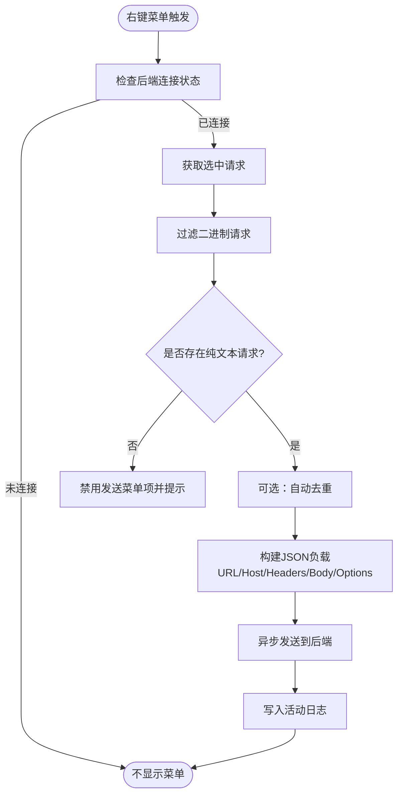
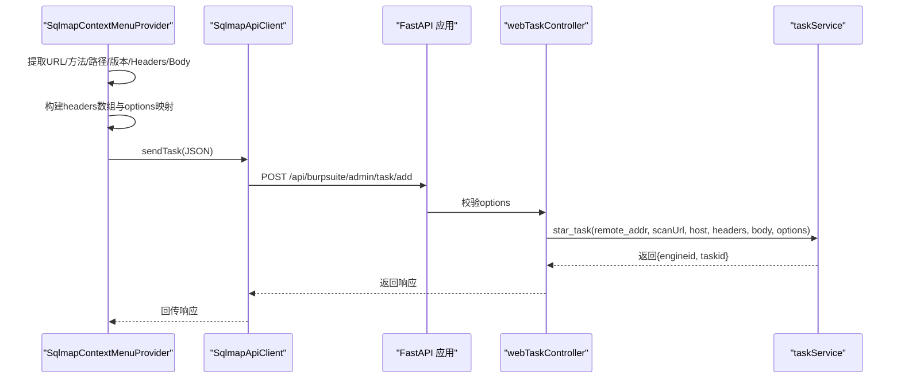
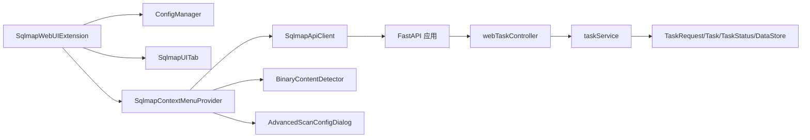

# 功能使用

<cite>
**本文引用的文件**
- [README.md](file://README.md)
- [SqlmapWebUIExtension.java](file://src/burpEx/montoya-api/src/main/java/com/sqlmapwebui/burp/SqlmapWebUIExtension.java)
- [SqlmapContextMenuProvider.java](file://src/burpEx/montoya-api/src/main/java/com/sqlmapwebui/burp/SqlmapContextMenuProvider.java)
- [SqlmapApiClient.java](file://src/burpEx/montoya-api/src/main/java/com/sqlmapwebui/burp/SqlmapApiClient.java)
- [SqlmapUITab.java](file://src/burpEx/montoya-api/src/main/java/com/sqlmapwebui/burp/SqlmapUITab.java)
- [ConfigManager.java](file://src/burpEx/montoya-api/src/main/java/com/sqlmapwebui/burp/ConfigManager.java)
- [AdvancedScanConfigDialog.java](file://src/burpEx/montoya-api/src/main/java/com/sqlmapwebui/burp/dialogs/AdvancedScanConfigDialog.java)
- [BinaryContentDetector.java](file://src/burpEx/montoya-api/src/main/java/com/sqlmapwebui/burp/BinaryContentDetector.java)
- [app.py](file://src/backEnd/app.py)
- [webTaskController.py](file://src/backEnd/api/commonApi/webTaskController.py)
- [taskService.py](file://src/backEnd/service/taskService.py)
- [TaskRequest.py](file://src/backEnd/model/requestModel/TaskRequest.py)
- [USAGE_GUIDE.md](file://doc/USAGE_GUIDE.md)
</cite>

## 目录
1. [简介](#简介)
2. [项目结构](#项目结构)
3. [核心组件](#核心组件)
4. [架构总览](#架构总览)
5. [详细组件分析](#详细组件分析)
6. [依赖关系分析](#依赖关系分析)
7. [性能考虑](#性能考虑)
8. [故障排查指南](#故障排查指南)
9. [结论](#结论)
10. [附录](#附录)

## 简介
本文件面向使用 Burp Suite 插件“SQLMap WebUI”的安全测试人员，系统性讲解插件如何从 Proxy、Repeater、Scanner 等工具中发送 HTTP 请求到 Web UI 平台进行扫描。内容覆盖：
- 右键菜单集成与使用方式
- 请求发送过程中的数据转换与参数处理
- 任务创建、进度监控与结果查看的完整工作流
- 实际使用场景示例（如从 Repeater 发送可疑请求进行深度扫描）
- 插件用户界面元素（自定义标签页与日志面板）
- 最佳实践与使用技巧

## 项目结构
该项目由三部分组成：后端 FastAPI 服务、前端 Vue 应用、Burp Suite 扩展插件。插件通过 Montoya API 提供右键菜单、配置管理与日志输出；后端负责接收请求、校验参数并启动扫描任务。

图表来源
- [SqlmapWebUIExtension.java](file://src/burpEx/montoya-api/src/main/java/com/sqlmapwebui/burp/SqlmapWebUIExtension.java#L1-L68)
- [SqlmapContextMenuProvider.java](file://src/burpEx/montoya-api/src/main/java/com/sqlmapwebui/burp/SqlmapContextMenuProvider.java#L1-L203)
- [SqlmapApiClient.java](file://src/burpEx/montoya-api/src/main/java/com/sqlmapwebui/burp/SqlmapApiClient.java#L1-L120)
- [app.py](file://src/backEnd/app.py#L1-L80)
- [webTaskController.py](file://src/backEnd/api/commonApi/webTaskController.py#L1-L91)
- [taskService.py](file://src/backEnd/service/taskService.py#L1-L120)

章节来源
- [README.md](file://README.md#L1-L120)
- [USAGE_GUIDE.md](file://doc/USAGE_GUIDE.md#L464-L512)

## 核心组件
- 扩展入口与UI：SqlmapWebUIExtension 负责初始化配置管理器、API 客户端与 UI 标签页，并注册右键菜单提供者。
- 右键菜单提供者：SqlmapContextMenuProvider 提供“发送到 WebUI”、“标记注入点并扫描”、“高级配置发送”等菜单项，并对二进制请求进行过滤与去重。
- API 客户端：SqlmapApiClient 封装 OkHttp，向后端发送任务请求与配置相关调用。
- 配置管理：ConfigManager 管理后端 URL、默认/常用/历史配置、自动去重、注入点标记数量限制等。
- UI 标签页：SqlmapUITab 提供服务器配置、默认配置、常用配置、历史配置与活动日志五个标签页。
- 后端 FastAPI：app.py 注册路由与 CORS，webTaskController.py 提供任务添加接口，taskService.py 负责任务生命周期与 SQLMap 引擎交互。

章节来源
- [SqlmapWebUIExtension.java](file://src/burpEx/montoya-api/src/main/java/com/sqlmapwebui/burp/SqlmapWebUIExtension.java#L1-L68)
- [SqlmapContextMenuProvider.java](file://src/burpEx/montoya-api/src/main/java/com/sqlmapwebui/burp/SqlmapContextMenuProvider.java#L1-L203)
- [SqlmapApiClient.java](file://src/burpEx/montoya-api/src/main/java/com/sqlmapwebui/burp/SqlmapApiClient.java#L1-L120)
- [ConfigManager.java](file://src/burpEx/montoya-api/src/main/java/com/sqlmapwebui/burp/ConfigManager.java#L1-L120)
- [SqlmapUITab.java](file://src/burpEx/montoya-api/src/main/java/com/sqlmapwebui/burp/SqlmapUITab.java#L1-L120)
- [app.py](file://src/backEnd/app.py#L1-L80)
- [webTaskController.py](file://src/backEnd/api/commonApi/webTaskController.py#L1-L91)
- [taskService.py](file://src/backEnd/service/taskService.py#L1-L120)

## 架构总览
从 Burp 发送请求到 Web UI 的整体流程如下：

图表来源
- [SqlmapContextMenuProvider.java](file://src/burpEx/montoya-api/src/main/java/com/sqlmapwebui/burp/SqlmapContextMenuProvider.java#L205-L347)
- [SqlmapApiClient.java](file://src/burpEx/montoya-api/src/main/java/com/sqlmapwebui/burp/SqlmapApiClient.java#L60-L120)
- [app.py](file://src/backEnd/app.py#L36-L60)
- [webTaskController.py](file://src/backEnd/api/commonApi/webTaskController.py#L19-L91)
- [taskService.py](file://src/backEnd/service/taskService.py#L58-L120)

## 详细组件分析

### 右键菜单集成与使用
- 菜单项能力
  - “发送到 SQLMap WebUI”：使用默认配置发送。
  - “标记注入点并扫描 (*)”：支持多选报文，对前 N 个报文进行注入点标记编辑。
  - “发送到 SQLMap WebUI (配置扫描)...”：打开高级配置对话框，支持选择/编辑配置、引导式参数编辑、注入点标记。
  - “提交会话Header”“提交Header规则”：仅在单条请求时显示，用于提交临时或持久化请求头规则。
- 过滤与去重
  - 二进制内容检测：基于 Content-Type、请求体魔数、NULL 字节与非可打印字符比例综合判断。
  - 自动去重：可配置开关，对多选请求进行去重处理，减少重复任务。
- 菜单显示条件
  - 仅在已连接后端时显示菜单。
  - 对二进制请求禁用发送菜单项，并给出提示。
- 发送流程
  - 从选中的请求中提取 URL、方法、路径、HTTP 版本、Headers 列表与 Body。
  - 将配置转换为 options 映射，拼装 JSON 负载。
  - 异步线程发送至后端 /api/burpsuite/admin/task/add。
  - 成功后记录到活动日志，失败记录错误信息。

图表来源
- [SqlmapContextMenuProvider.java](file://src/burpEx/montoya-api/src/main/java/com/sqlmapwebui/burp/SqlmapContextMenuProvider.java#L103-L203)
- [BinaryContentDetector.java](file://src/burpEx/montoya-api/src/main/java/com/sqlmapwebui/burp/BinaryContentDetector.java#L112-L151)
- [SqlmapApiClient.java](file://src/burpEx/montoya-api/src/main/java/com/sqlmapwebui/burp/SqlmapApiClient.java#L60-L120)

章节来源
- [SqlmapContextMenuProvider.java](file://src/burpEx/montoya-api/src/main/java/com/sqlmapwebui/burp/SqlmapContextMenuProvider.java#L103-L203)
- [BinaryContentDetector.java](file://src/burpEx/montoya-api/src/main/java/com/sqlmapwebui/burp/BinaryContentDetector.java#L1-L120)
- [SqlmapUITab.java](file://src/burpEx/montoya-api/src/main/java/com/sqlmapwebui/burp/SqlmapUITab.java#L130-L150)

### 请求发送过程的数据转换与参数处理
- 请求提取
  - 方法、路径、HTTP 版本、Headers 列表、Body 字符串。
- Headers 处理
  - 将首行（方法+路径+版本）加入头部列表，再遍历请求头，构造 JSON 数组。
- Options 处理
  - 将 ScanConfig 转换为 Map，逐项序列化为 JSON 对象，字符串值进行转义。
- Host 提取
  - 从 URL 中解析 Host，作为扫描域名标识。
- JSON 负载
  - 组装 scanUrl、host、headers、body、options 字段，发送到后端。
- 后端接收与校验
  - webTaskController 接收 TaskAddRequest，校验 options 是否存在，记录来源 IP 与目标 URL，调用 taskService.star_task。
- 任务创建
  - taskService.validate_options 校验不支持的选项，生成任务 ID，设置任务状态为可运行，返回引擎 ID 与任务 ID。

图表来源
- [SqlmapContextMenuProvider.java](file://src/burpEx/montoya-api/src/main/java/com/sqlmapwebui/burp/SqlmapContextMenuProvider.java#L258-L347)
- [SqlmapApiClient.java](file://src/burpEx/montoya-api/src/main/java/com/sqlmapwebui/burp/SqlmapApiClient.java#L60-L120)
- [webTaskController.py](file://src/backEnd/api/commonApi/webTaskController.py#L19-L91)
- [taskService.py](file://src/backEnd/service/taskService.py#L58-L120)

章节来源
- [SqlmapContextMenuProvider.java](file://src/burpEx/montoya-api/src/main/java/com/sqlmapwebui/burp/SqlmapContextMenuProvider.java#L258-L347)
- [webTaskController.py](file://src/backEnd/api/commonApi/webTaskController.py#L19-L91)
- [taskService.py](file://src/backEnd/service/taskService.py#L58-L120)

### 任务创建、进度监控与结果查看
- 任务创建
  - 通过右键菜单或高级配置对话框发送请求，后端返回任务 ID 与引擎 ID。
- 进度监控
  - 后端维护内存任务池，记录任务状态（New/Runnable/Blocked/Running/Terminated）。
  - 提供任务列表、按关键词/状态/日期范围过滤、批量停止/删除等接口。
- 结果查看
  - 任务详情页可查看原始 HTTP 请求、扫描配置、发现的注入点与 Payload、实时日志。
  - 支持按任务 ID 查询日志、错误、Payload 详情等。

章节来源
- [taskService.py](file://src/backEnd/service/taskService.py#L120-L240)
- [USAGE_GUIDE.md](file://doc/USAGE_GUIDE.md#L130-L172)

### 实际使用场景示例
- 从 Repeater 发送可疑请求进行深度扫描
  - 在 Repeater 中构造可疑请求，右键选择“发送到 SQLMap WebUI (配置扫描)...”，在高级配置对话框中：
    - 选择“默认配置”或“常用配置”，或使用“引导式配置”可视化编辑参数；
    - 如需手动控制注入点，切换到“标记注入点 (*)”标签，对请求进行注入点标记；
    - 点击“发送扫描”，插件异步发送请求，活动日志显示发送结果与响应。
  - 若请求包含二进制内容，插件会提示并跳过；若存在重复请求，可根据配置自动去重。

章节来源
- [AdvancedScanConfigDialog.java](file://src/burpEx/montoya-api/src/main/java/com/sqlmapwebui/burp/dialogs/AdvancedScanConfigDialog.java#L1-L120)
- [SqlmapContextMenuProvider.java](file://src/burpEx/montoya-api/src/main/java/com/sqlmapwebui/burp/SqlmapContextMenuProvider.java#L132-L203)

### 插件用户界面元素
- 自定义标签页
  - 服务器配置：设置后端 URL、测试连接、显示连接状态。
  - 默认配置：设置全局默认扫描参数。
  - 常用配置：保存常用配置组合，支持导入导出与编辑。
  - 历史配置：查看最近使用过的配置，支持复制为常用配置。
  - 活动日志：记录发送请求的结果与错误信息，支持帮助/关于弹窗。
- 日志面板
  - 用于显示过滤统计、发送统计与错误信息，便于调试与审计。

章节来源
- [SqlmapUITab.java](file://src/burpEx/montoya-api/src/main/java/com/sqlmapwebui/burp/SqlmapUITab.java#L60-L120)
- [ConfigManager.java](file://src/burpEx/montoya-api/src/main/java/com/sqlmapwebui/burp/ConfigManager.java#L160-L217)

## 依赖关系分析
- 扩展层依赖
  - SqlmapWebUIExtension 依赖 ConfigManager、SqlmapApiClient、SqlmapUITab。
  - SqlmapContextMenuProvider 依赖 ConfigManager、SqlmapApiClient、SqlmapUITab、BinaryContentDetector。
  - AdvancedScanConfigDialog 依赖 GuidedParamEditor、ConfigManager、SqlmapApiClient。
- 后端依赖
  - app.py 依赖各 API 路由模块，webTaskController.py 依赖 taskService.py 与 TaskRequest 模型。
  - taskService.py 依赖 DataStore、Task、TaskStatus、SQLMap 引擎设置与日志工具。

图表来源
- [SqlmapWebUIExtension.java](file://src/burpEx/montoya-api/src/main/java/com/sqlmapwebui/burp/SqlmapWebUIExtension.java#L1-L68)
- [SqlmapContextMenuProvider.java](file://src/burpEx/montoya-api/src/main/java/com/sqlmapwebui/burp/SqlmapContextMenuProvider.java#L1-L120)
- [SqlmapApiClient.java](file://src/burpEx/montoya-api/src/main/java/com/sqlmapwebui/burp/SqlmapApiClient.java#L1-L60)
- [app.py](file://src/backEnd/app.py#L1-L60)
- [webTaskController.py](file://src/backEnd/api/commonApi/webTaskController.py#L1-L40)
- [taskService.py](file://src/backEnd/service/taskService.py#L1-L60)
- [TaskRequest.py](file://src/backEnd/model/requestModel/TaskRequest.py#L1-L40)

章节来源
- [SqlmapWebUIExtension.java](file://src/burpEx/montoya-api/src/main/java/com/sqlmapwebui/burp/SqlmapWebUIExtension.java#L1-L68)
- [app.py](file://src/backEnd/app.py#L1-L60)

## 性能考虑
- 异步发送：右键菜单发送采用异步线程，避免阻塞 UI。
- 自动去重：对多选请求进行去重，减少重复任务与后端压力。
- 二进制过滤：提前过滤二进制请求，避免无效任务。
- 智能轮询：前端任务列表具备智能轮询策略，降低不必要的请求频率。
- 超时与重试：API 客户端设置连接/读/写超时，保证稳定性。

章节来源
- [SqlmapContextMenuProvider.java](file://src/burpEx/montoya-api/src/main/java/com/sqlmapwebui/burp/SqlmapContextMenuProvider.java#L205-L347)
- [SqlmapApiClient.java](file://src/burpEx/montoya-api/src/main/java/com/sqlmapwebui/burp/SqlmapApiClient.java#L1-L40)
- [USAGE_GUIDE.md](file://doc/USAGE_GUIDE.md#L165-L172)

## 故障排查指南
- 后端连接失败
  - 检查后端 URL 配置与网络连通性，使用“测试连接”验证。
  - 查看活动日志中的错误信息与后端健康检查响应。
- 二进制请求无法扫描
  - 插件会提示并跳过二进制请求；请改为纯文本请求或使用“提交Header规则/会话Header”功能。
- 重复请求被过滤
  - 若开启自动去重，重复请求会被跳过；关闭去重或调整去重策略。
- 配置不生效
  - 检查默认/常用/历史配置是否正确选择；确认作用域匹配与优先级设置。
- 任务状态异常
  - 使用任务列表查看状态；必要时停止/删除任务，清理任务池。

章节来源
- [SqlmapUITab.java](file://src/burpEx/montoya-api/src/main/java/com/sqlmapwebui/burp/SqlmapUITab.java#L130-L150)
- [SqlmapContextMenuProvider.java](file://src/burpEx/montoya-api/src/main/java/com/sqlmapwebui/burp/SqlmapContextMenuProvider.java#L205-L347)
- [USAGE_GUIDE.md](file://doc/USAGE_GUIDE.md#L542-L575)

## 结论
SQLMap WebUI 插件通过右键菜单实现了从 Burp 工具到 Web UI 的无缝集成，具备完善的请求过滤、配置管理与日志记录能力。结合后端的任务生命周期管理与前端的可视化界面，能够高效完成从可疑请求到注入结果的全流程测试。建议在实际使用中充分利用默认/常用/历史配置、注入点标记与会话Header功能，以提升扫描效率与准确性。

## 附录
- 快速开始与安装部署参考使用指南。
- VulnShop 靶场可用于练习不同类型的 SQL 注入场景。

章节来源
- [USAGE_GUIDE.md](file://doc/USAGE_GUIDE.md#L44-L93)
- [README.md](file://README.md#L116-L174)