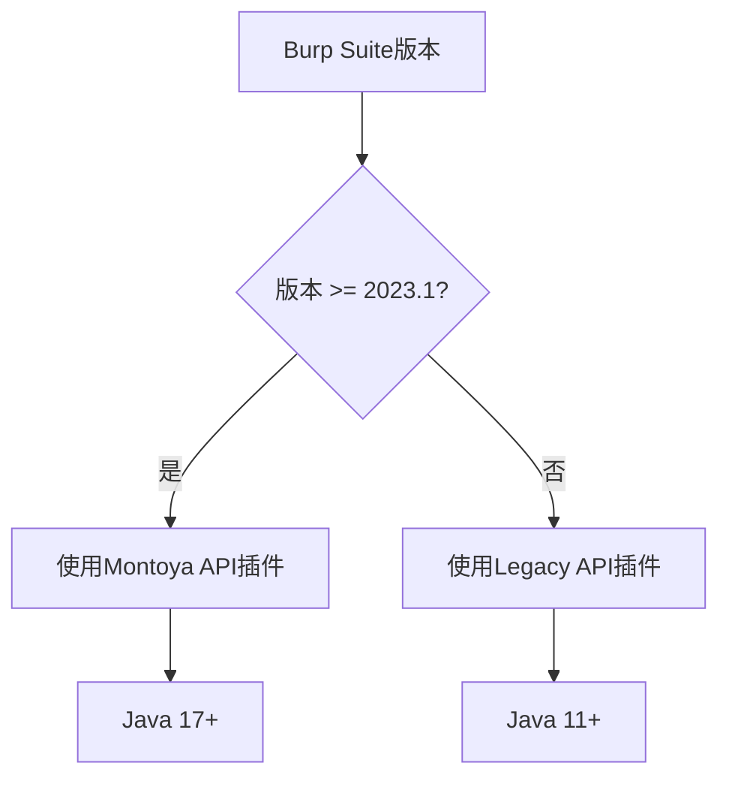
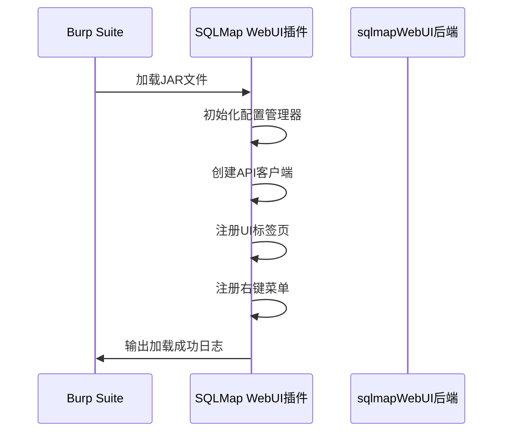
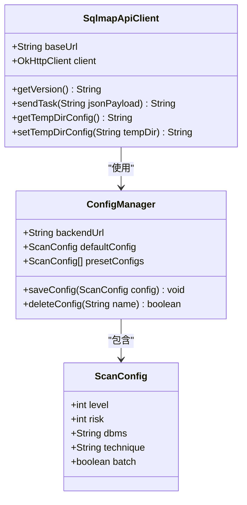

# 安装与配置

<cite>
**本文档引用的文件**  
- [README.md](file://README.md)
- [src/burpEx/README.md](file://src/burpEx/README.md)
- [src/burpEx/legacy-api/pom.xml](file://src/burpEx/legacy-api/pom.xml)
- [src/burpEx/montoya-api/pom.xml](file://src/burpEx/montoya-api/pom.xml)
- [src/burpEx/legacy-api/src/main/java/com/sqlmapwebui/burp/BurpExtender.java](file://src/burpEx/legacy-api/src/main/java/com/sqlmapwebui/burp/BurpExtender.java)
- [src/burpEx/montoya-api/src/main/java/com/sqlmapwebui/burp/SqlmapWebUIExtension.java](file://src/burpEx/montoya-api/src/main/java/com/sqlmapwebui/burp/SqlmapWebUIExtension.java)
- [src/backEnd/main.py](file://src/backEnd/main.py)
- [src/backEnd/app.py](file://src/backEnd/app.py)
- [src/backEnd/api/burpSuiteExApi/admin.py](file://src/backEnd/api/burpSuiteExApi/admin.py)
- [src/backEnd/config.py](file://src/backEnd/config.py)
</cite>

## 目录
1. [简介](#简介)
2. [插件版本与兼容性](#插件版本与兼容性)
3. [插件编译与构建](#插件编译与构建)
4. [Burp Suite中加载插件](#burp-suite中加载插件)
5. [插件配置参数说明](#插件配置参数说明)
6. [常见问题排查](#常见问题排查)
7. [安全性配置](#安全性配置)

## 简介

sqlmapWebUI是一款现代化的SQL注入测试平台，提供直观的Web界面用于管理SQL注入扫描任务。本插件允许用户从Burp Suite直接将HTTP请求发送到sqlmapWebUI后端进行自动化扫描，实现无缝集成。插件支持两种API版本：Legacy API和Montoya API，以适应不同版本的Burp Suite。

插件主要功能包括：
- 通过右键菜单快速发送请求到sqlmapWebUI
- 配置默认扫描参数（Level、Risk、DBMS、Technique等）
- 管理常用配置组合
- 查看历史扫描配置
- 记录操作日志

**注意**：插件仅负责发送请求，任务管理和结果查看需通过Web前端完成。

**Section sources**
- [README.md](file://README.md#L1-L321)
- [src/burpEx/README.md](file://src/burpEx/README.md#L1-L229)

## 插件版本与兼容性

sqlmapWebUI提供两个版本的Burp Suite插件，分别针对不同的API和Java版本要求：

### Legacy API版本
- **适用Burp Suite版本**：较老版本（2023.1之前）
- **Java版本要求**：Java 11+
- **项目路径**：`src/burpEx/legacy-api`
- **Maven配置**：`pom.xml`中指定编译版本为11
- **依赖库**：使用Burp Extender API (Legacy)

### Montoya API版本
- **适用Burp Suite版本**：2023.1及以上版本
- **Java版本要求**：Java 17+
- **项目路径**：`src/burpEx/montoya-api`
- **Maven配置**：`pom.xml`中指定编译版本为17
- **依赖库**：使用Montoya API

用户应根据自己的Burp Suite版本选择合适的插件。如果使用较新的Burp Suite（2023.1+），建议使用Montoya API版本以获得更好的性能和稳定性。



**Diagram sources**
- [src/burpEx/README.md](file://src/burpEx/README.md#L58-L64)
- [src/burpEx/legacy-api/pom.xml](file://src/burpEx/legacy-api/pom.xml#L16-L17)
- [src/burpEx/montoya-api/pom.xml](file://src/burpEx/montoya-api/pom.xml#L16-L17)

**Section sources**
- [src/burpEx/README.md](file://src/burpEx/README.md#L58-L64)
- [src/burpEx/legacy-api/pom.xml](file://src/burpEx/legacy-api/pom.xml#L16-L17)
- [src/burpEx/montoya-api/pom.xml](file://src/burpEx/montoya-api/pom.xml#L16-L17)

## 插件编译与构建

插件使用Maven进行构建，需要安装Maven和相应版本的JDK。

### 构建Montoya API版本（推荐）
```bash
cd src/burpEx/montoya-api
mvn clean package -DskipTests
```
生成文件：`target/sqlmap-webui-burp-montoya-*.jar`

### 构建Legacy API版本
```bash
cd src/burpEx/legacy-api
mvn clean package -DskipTests
```
生成文件：`target/sqlmap-webui-burp-legacy-*-jar-with-dependencies.jar`

构建过程会自动下载所需依赖并生成包含所有依赖的JAR文件（fat JAR）。Montoya API版本使用maven-shade-plugin创建重定位的依赖，而Legacy API版本使用maven-assembly-plugin创建包含依赖的JAR。

**重要提示**：
- 确保JAVA_HOME指向正确的JDK版本
- 网络连接正常以下载Maven依赖
- 构建完成后检查target目录下的JAR文件是否生成

**Section sources**
- [src/burpEx/README.md](file://src/burpEx/README.md#L66-L83)
- [src/burpEx/legacy-api/pom.xml](file://src/burpEx/legacy-api/pom.xml#L78-L115)
- [src/burpEx/montoya-api/pom.xml](file://src/burpEx/montoya-api/pom.xml#L80-L123)

## Burp Suite中加载插件

完成插件编译后，按照以下步骤在Burp Suite中加载：

1. 打开Burp Suite
2. 进入 **Extender** → **Extensions** 标签页
3. 点击 **Add** 按钮
4. 选择对应版本的JAR文件
5. 点击 **Next** 完成安装

成功加载后，会在Burp Suite界面中看到"SQLMap WebUI"标签页。同时，在Proxy、Repeater、Target等模块的右键菜单中会新增"Send to SQLMap WebUI"选项。

插件初始化时会自动创建配置管理器、API客户端和UI组件，并注册右键菜单提供者。Montoya API版本的入口类为`SqlmapWebUIExtension`，而Legacy API版本为`BurpExtender`。



**Diagram sources**
- [src/burpEx/README.md](file://src/burpEx/README.md#L86-L92)
- [src/burpEx/montoya-api/src/main/java/com/sqlmapwebui/burp/SqlmapWebUIExtension.java](file://src/burpEx/montoya-api/src/main/java/com/sqlmapwebui/burp/SqlmapWebUIExtension.java#L29-L58)
- [src/burpEx/legacy-api/src/main/java/com/sqlmapwebui/burp/BurpExtender.java](file://src/burpEx/legacy-api/src/main/java/com/sqlmapwebui/burp/BurpExtender.java)

**Section sources**
- [src/burpEx/README.md](file://src/burpEx/README.md#L86-L92)
- [src/burpEx/montoya-api/src/main/java/com/sqlmapwebui/burp/SqlmapWebUIExtension.java](file://src/burpEx/montoya-api/src/main/java/com/sqlmapwebui/burp/SqlmapWebUIExtension.java#L29-L58)

## 插件配置参数说明

插件提供多个配置参数，用户可以在UI标签页中进行设置。

### 服务器配置
- **后端URL**：sqlmapWebUI后端服务地址，默认为`http://localhost:8775`
- **连接测试**：通过访问`/api/health`端点验证连接状态

### 扫描参数配置
| 参数 | 说明 | 取值范围 |
|------|------|---------|
| Level | 检测级别 | 1-5 |
| Risk | 风险级别 | 1-3 |
| DBMS | 数据库类型 | MySQL, PostgreSQL, Oracle, SQLite, MSSQL等 |
| Technique | 注入技术 | B(布尔盲注), E(报错注入), U(联合查询), S(堆叠查询), T(时间盲注), Q(内联查询) |
| Batch | 批处理模式 | true/false |

### 配置管理
- **默认配置**：设置全局默认扫描参数
- **常用配置**：保存常用配置组合，支持CRUD操作
- **历史配置**：查看历史扫描使用的配置记录

后端提供以下接口供插件调用：
- `GET /api/version`：获取版本信息
- `GET /api/health`：健康检查
- `POST /burp/admin/scan`：提交扫描任务



**Diagram sources**
- [src/burpEx/README.md](file://src/burpEx/README.md#L159-L168)
- [src/burpEx/montoya-api/src/main/java/com/sqlmapwebui/burp/SqlmapApiClient.java](file://src/burpEx/montoya-api/src/main/java/com/sqlmapwebui/burp/SqlmapApiClient.java#L15-L208)
- [src/burpEx/montoya-api/src/main/java/com/sqlmapwebui/burp/ConfigManager.java](file://src/burpEx/montoya-api/src/main/java/com/sqlmapwebui/burp/ConfigManager.java)
- [src/burpEx/montoya-api/src/main/java/com/sqlmapwebui/burp/ScanConfig.java](file://src/burpEx/montoya-api/src/main/java/com/sqlmapwebui/burp/ScanConfig.java)

**Section sources**
- [src/burpEx/README.md](file://src/burpEx/README.md#L95-L158)
- [src/burpEx/montoya-api/src/main/java/com/sqlmapwebui/burp/SqlmapApiClient.java](file://src/burpEx/montoya-api/src/main/java/com/sqlmapwebui/burp/SqlmapApiClient.java#L15-L208)

## 常见问题排查

### 插件加载失败
**症状**：在Extender中添加插件时出现错误
**解决方案**：
1. 检查Java版本是否满足要求（Montoya需要Java 17+，Legacy需要Java 11+）
2. 确认JAR文件路径正确且文件完整
3. 查看Burp Suite的Extender → Output标签页中的详细错误日志

### 连接测试失败
**症状**：服务器配置中"测试连接"按钮返回失败
**解决方案**：
1. 确认sqlmapWebUI后端服务已启动
2. 检查后端URL是否正确（默认`http://localhost:8775`）
3. 验证网络连接是否正常
4. 检查防火墙设置是否阻止了端口访问

### 发送请求后看不到任务
**症状**：在Burp中发送请求后，Web前端没有显示新任务
**解决方案**：
1. 确认后端服务正常运行
2. 检查插件日志（Extender → Output）是否有错误信息
3. 验证请求是否成功发送到`/api/burpsuite/admin/task/add`接口
4. 在Web前端刷新任务列表

### 类加载错误
**症状**：出现ClassNotFoundException或NoClassDefFoundError
**解决方案**：
1. 确认构建时包含了所有依赖（fat JAR）
2. 检查Maven依赖是否下载完整
3. 清理并重新构建项目：`mvn clean package -DskipTests`

**Section sources**
- [src/burpEx/README.md](file://src/burpEx/README.md#L213-L225)
- [src/burpEx/montoya-api/src/main/java/com/sqlmapwebui/burp/SqlmapApiClient.java](file://src/burpEx/montoya-api/src/main/java/com/sqlmapwebui/burp/SqlmapApiClient.java#L36-L57)
- [src/backEnd/app.py](file://src/backEnd/app.py#L49-L59)

## 安全性配置

### HTTPS连接
虽然当前配置使用HTTP连接，但生产环境中建议配置HTTPS以加密通信。可以通过以下方式实现：
1. 在后端配置SSL证书
2. 修改插件中的后端URL为HTTPS地址
3. 配置OkHttp客户端信任证书

### 认证机制
当前系统通过以下方式实现认证：
- 后端使用基于Token的认证
- 管理员Token在启动时生成
- API接口通过`get_current_user`依赖项进行权限验证

### 超时设置
插件中配置了统一的超时设置：
- 连接超时：30秒
- 读取超时：30秒
- 写入超时：30秒

这些设置在`SqlmapApiClient`的OkHttpClient构建时指定，防止请求长时间挂起。

### 安全建议
1. 仅在授权的系统上使用本工具
2. 不要在生产环境或未授权系统上测试
3. 后端服务应绑定到本地地址（127.0.0.1），避免暴露到公网
4. 定期更新插件和后端到最新版本以获取安全修复

**Section sources**
- [src/burpEx/montoya-api/src/main/java/com/sqlmapwebui/burp/SqlmapApiClient.java](file://src/burpEx/montoya-api/src/main/java/com/sqlmapwebui/burp/SqlmapApiClient.java#L26-L30)
- [src/backEnd/utils/auth.py](file://src/backEnd/utils/auth.py)
- [src/backEnd/main.py](file://src/backEnd/main.py#L112-L116)