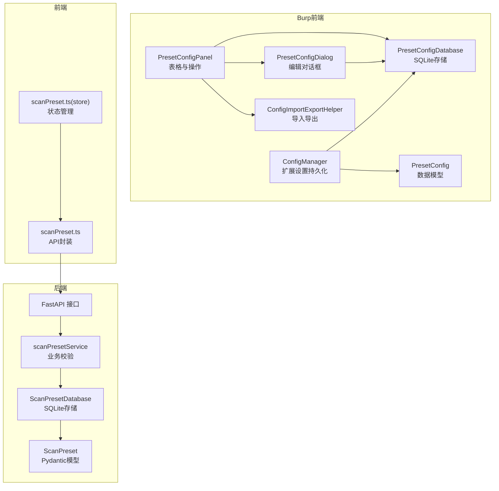
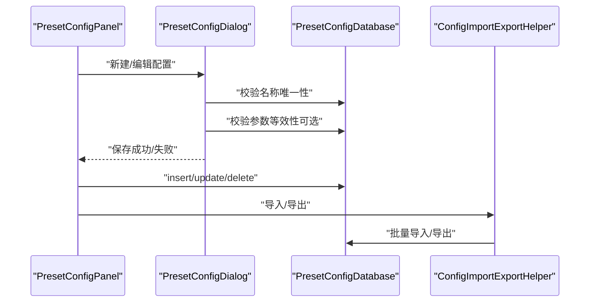
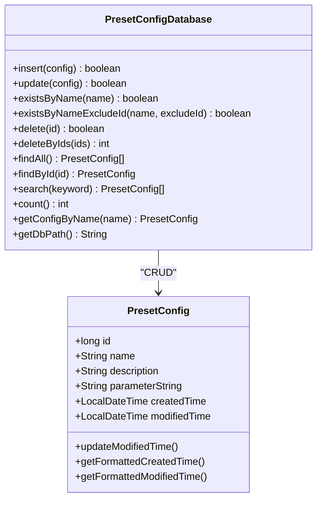
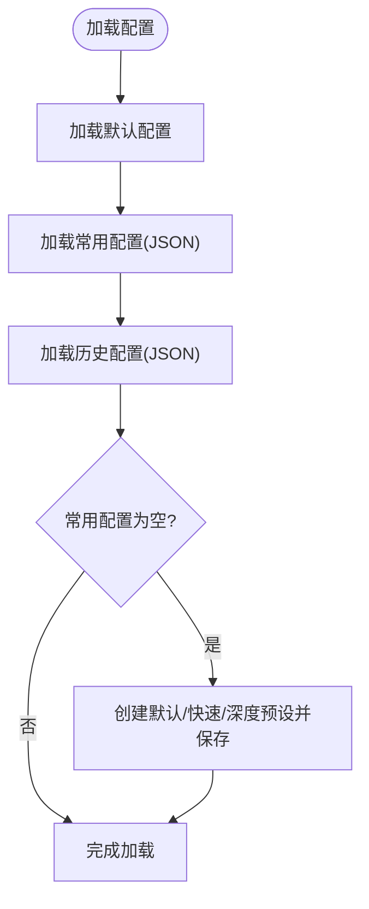
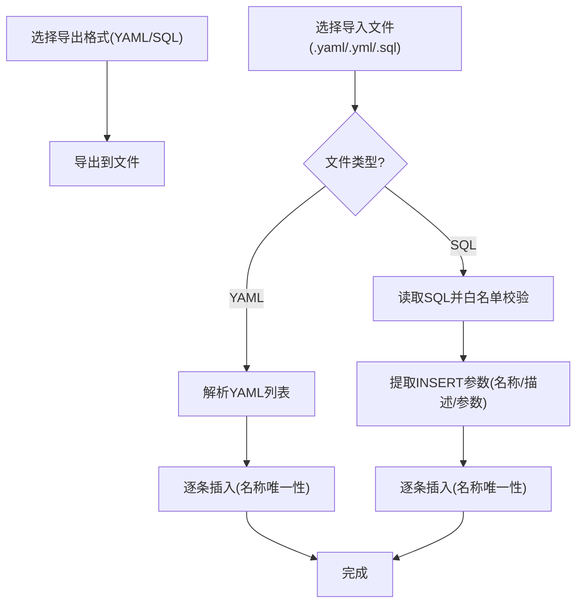
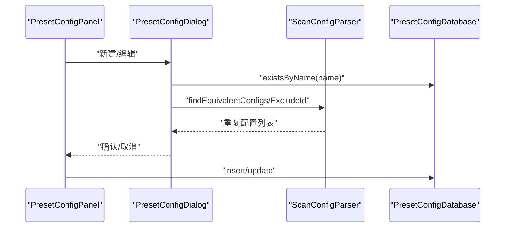
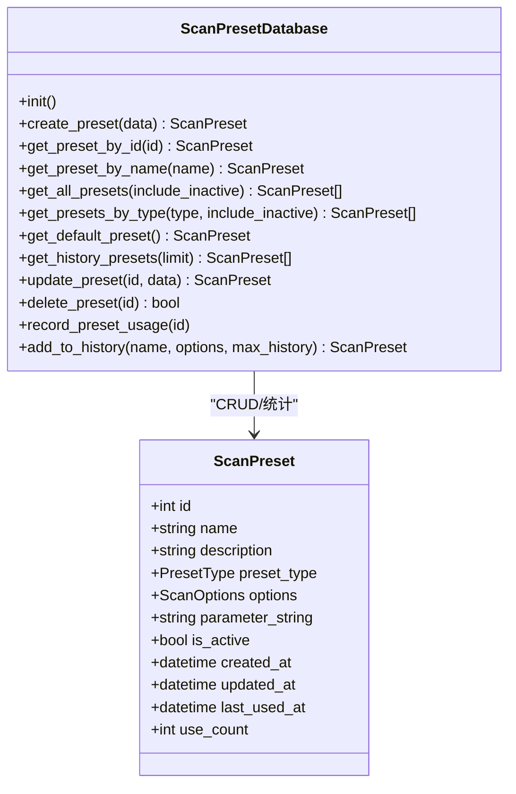
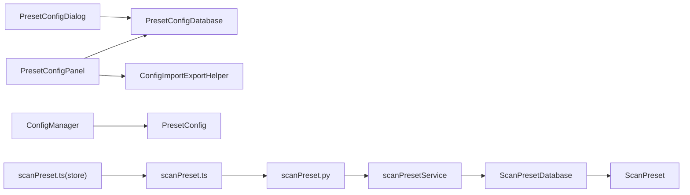

# 配置管理

<cite>
**本文引用的文件**
- [PresetConfig.java](file://src/burpEx/montoya-api/src/main/java/com/sqlmapwebui/burp/PresetConfig.java)
- [PresetConfigDatabase.java](file://src/burpEx/montoya-api/src/main/java/com/sqlmapwebui/burp/PresetConfigDatabase.java)
- [ConfigManager.java](file://src/burpEx/montoya-api/src/main/java/com/sqlmapwebui/burp/ConfigManager.java)
- [ConfigImportExportHelper.java](file://src/burpEx/montoya-api/src/main/java/com/sqlmapwebui/burp/panels/ConfigImportExportHelper.java)
- [PresetConfigPanel.java](file://src/burpEx/montoya-api/src/main/java/com/sqlmapwebui/burp/panels/PresetConfigPanel.java)
- [PresetConfigDialog.java](file://src/burpEx/montoya-api/src/main/java/com/sqlmapwebui/burp/panels/PresetConfigDialog.java)
- [ScanPreset.py](file://src/backEnd/model/ScanPreset.py)
- [ScanPresetDatabase.py](file://src/backEnd/model/ScanPresetDatabase.py)
- [scanPreset.py](file://src/backEnd/api/commonApi/scanPreset.py)
- [scanPresetService.py](file://src/backEnd/service/scanPresetService.py)
- [scanPreset.ts](file://src/frontEnd/src/api/scanPreset.ts)
- [scanPreset.ts（store）](file://src/frontEnd/src/stores/scanPreset.ts)
</cite>

## 目录
1. [简介](#简介)
2. [项目结构](#项目结构)
3. [核心组件](#核心组件)
4. [架构总览](#架构总览)
5. [详细组件分析](#详细组件分析)
6. [依赖关系分析](#依赖关系分析)
7. [性能考量](#性能考量)
8. [故障排查指南](#故障排查指南)
9. [结论](#结论)
10. [附录](#附录)

## 简介
本文件面向Burp Suite插件“SQLMap WebUI”的配置管理能力，系统性说明扫描配置的管理功能，包括：
- 如何在插件中设置默认扫描配置、创建和管理常用配置预设
- 配置的导入导出功能，支持团队协作和配置共享
- 历史配置的自动保存与检索机制
- PresetConfig与PresetConfigDatabase类的实现细节（序列化与持久化）
- 配置管理最佳实践（敏感信息保护、版本控制）
- 配置冲突解决策略与同步机制

## 项目结构
围绕“配置管理”，本项目在前后端分别提供了两套实现：
- Burp侧（Montoya API）：以本地SQLite存储常用配置，提供导入导出、搜索、增删改查、冲突校验等能力
- 后端（Python/FastAPI）：以SQLite存储扫描预设（默认/常用/历史），提供REST接口、服务层校验与约束、前端集成

图表来源
- [ConfigManager.java](file://src/burpEx/montoya-api/src/main/java/com/sqlmapwebui/burp/ConfigManager.java#L1-L406)
- [PresetConfigPanel.java](file://src/burpEx/montoya-api/src/main/java/com/sqlmapwebui/burp/panels/PresetConfigPanel.java#L1-L650)
- [PresetConfigDialog.java](file://src/burpEx/montoya-api/src/main/java/com/sqlmapwebui/burp/panels/PresetConfigDialog.java#L1-L245)
- [ConfigImportExportHelper.java](file://src/burpEx/montoya-api/src/main/java/com/sqlmapwebui/burp/panels/ConfigImportExportHelper.java#L1-L393)
- [PresetConfigDatabase.java](file://src/burpEx/montoya-api/src/main/java/com/sqlmapwebui/burp/PresetConfigDatabase.java#L1-L462)
- [PresetConfig.java](file://src/burpEx/montoya-api/src/main/java/com/sqlmapwebui/burp/PresetConfig.java#L1-L110)
- [scanPreset.ts](file://src/frontEnd/src/api/scanPreset.ts#L1-L58)
- [scanPreset.ts（store）](file://src/frontEnd/src/stores/scanPreset.ts#L140-L188)
- [scanPreset.py](file://src/backEnd/api/commonApi/scanPreset.py#L187-L228)
- [scanPresetService.py](file://src/backEnd/service/scanPresetService.py#L76-L108)
- [ScanPresetDatabase.py](file://src/backEnd/model/ScanPresetDatabase.py#L1-L514)
- [ScanPreset.py](file://src/backEnd/model/ScanPreset.py#L1-L231)

章节来源
- [ConfigManager.java](file://src/burpEx/montoya-api/src/main/java/com/sqlmapwebui/burp/ConfigManager.java#L1-L406)
- [PresetConfigPanel.java](file://src/burpEx/montoya-api/src/main/java/com/sqlmapwebui/burp/panels/PresetConfigPanel.java#L1-L650)
- [PresetConfigDatabase.java](file://src/burpEx/montoya-api/src/main/java/com/sqlmapwebui/burp/PresetConfigDatabase.java#L1-L462)
- [ScanPresetDatabase.py](file://src/backEnd/model/ScanPresetDatabase.py#L1-L514)

## 核心组件
- PresetConfig：Burp侧常用配置的数据模型，包含名称、描述、参数字符串及时间戳字段，并提供格式化时间输出与修改时间更新方法
- PresetConfigDatabase：Burp侧SQLite数据库管理器，负责建表、CRUD、搜索、去重校验、批量删除、导入导出支持等
- ConfigManager：Burp侧扩展设置管理器，负责默认配置、常用配置、历史配置的加载/保存、历史数量裁剪、连接状态等
- ConfigImportExportHelper：导入导出辅助类，支持YAML/SQL两种格式，内置SQL白名单与解析校验
- PresetConfigPanel：常用配置面板，提供表格展示、搜索过滤、增删改查、引导式编辑、导入导出、复制参数字符串等
- PresetConfigDialog：常用配置编辑对话框，支持名称/参数重复校验、引导式参数编辑
- 后端模型与数据库：ScanPreset（Pydantic）、ScanPresetDatabase（SQLite），提供REST接口、服务层校验与默认预设初始化
- 前端API与状态：scanPreset.ts（API封装）、scanPreset.ts（store，状态管理）

章节来源
- [PresetConfig.java](file://src/burpEx/montoya-api/src/main/java/com/sqlmapwebui/burp/PresetConfig.java#L1-L110)
- [PresetConfigDatabase.java](file://src/burpEx/montoya-api/src/main/java/com/sqlmapwebui/burp/PresetConfigDatabase.java#L1-L462)
- [ConfigManager.java](file://src/burpEx/montoya-api/src/main/java/com/sqlmapwebui/burp/ConfigManager.java#L1-L406)
- [ConfigImportExportHelper.java](file://src/burpEx/montoya-api/src/main/java/com/sqlmapwebui/burp/panels/ConfigImportExportHelper.java#L1-L393)
- [PresetConfigPanel.java](file://src/burpEx/montoya-api/src/main/java/com/sqlmapwebui/burp/panels/PresetConfigPanel.java#L1-L650)
- [PresetConfigDialog.java](file://src/burpEx/montoya-api/src/main/java/com/sqlmapwebui/burp/panels/PresetConfigDialog.java#L1-L245)
- [ScanPreset.py](file://src/backEnd/model/ScanPreset.py#L1-L231)
- [ScanPresetDatabase.py](file://src/backEnd/model/ScanPresetDatabase.py#L1-L514)
- [scanPreset.ts](file://src/frontEnd/src/api/scanPreset.ts#L1-L58)
- [scanPreset.ts（store）](file://src/frontEnd/src/stores/scanPreset.ts#L140-L188)

## 架构总览
Burp侧与后端侧的配置管理相互独立又互补：
- Burp侧：以扩展设置（扩展数据）与本地SQLite结合，管理常用配置与历史配置；提供导入导出与冲突校验
- 后端侧：以SQLite存储扫描预设（默认/常用/历史），提供REST接口、服务层校验与默认预设初始化；前端通过API与状态管理进行调用

图表来源
- [PresetConfigPanel.java](file://src/burpEx/montoya-api/src/main/java/com/sqlmapwebui/burp/panels/PresetConfigPanel.java#L356-L420)
- [PresetConfigDialog.java](file://src/burpEx/montoya-api/src/main/java/com/sqlmapwebui/burp/panels/PresetConfigDialog.java#L176-L235)
- [PresetConfigDatabase.java](file://src/burpEx/montoya-api/src/main/java/com/sqlmapwebui/burp/PresetConfigDatabase.java#L89-L160)
- [ConfigImportExportHelper.java](file://src/burpEx/montoya-api/src/main/java/com/sqlmapwebui/burp/panels/ConfigImportExportHelper.java#L141-L237)

## 详细组件分析

### PresetConfig 与 PresetConfigDatabase（Burp侧）
- 数据模型：包含主键、名称、描述、参数字符串、创建/修改时间；提供格式化时间输出与修改时间更新
- 数据库管理：建表、插入、更新、按名称/ID查询、搜索、统计、批量删除、驱动加载与异常日志；支持SQLite特有last_insert_rowid查询
- 冲突校验：新增/更新均校验名称唯一性；更新时支持排除自身ID
- 时间序列：创建/修改时间采用统一格式化，便于导入导出与展示

图表来源
- [PresetConfig.java](file://src/burpEx/montoya-api/src/main/java/com/sqlmapwebui/burp/PresetConfig.java#L1-L110)
- [PresetConfigDatabase.java](file://src/burpEx/montoya-api/src/main/java/com/sqlmapwebui/burp/PresetConfigDatabase.java#L1-L462)

章节来源
- [PresetConfig.java](file://src/burpEx/montoya-api/src/main/java/com/sqlmapwebui/burp/PresetConfig.java#L1-L110)
- [PresetConfigDatabase.java](file://src/burpEx/montoya-api/src/main/java/com/sqlmapwebui/burp/PresetConfigDatabase.java#L1-L462)

### ConfigManager（Burp侧扩展设置）
- 默认配置：从扩展设置加载/保存，默认值来自扫描配置工厂方法；若缺失则创建默认/快速/深度预设
- 常用配置：从扩展设置加载/保存，JSON序列化；支持去重覆盖同名配置
- 历史配置：每次使用时复制并追加时间戳，限制最大数量，自动裁剪
- 扩展设置键：后端地址、历史数量、自动去重、注入点标记数量、二进制警告等

图表来源
- [ConfigManager.java](file://src/burpEx/montoya-api/src/main/java/com/sqlmapwebui/burp/ConfigManager.java#L69-L157)

章节来源
- [ConfigManager.java](file://src/burpEx/montoya-api/src/main/java/com/sqlmapwebui/burp/ConfigManager.java#L1-L406)

### 导入导出与冲突校验（ConfigImportExportHelper）
- 支持格式：YAML/SQL
- YAML导入：解析列表，逐条校验名称与参数，避免重复名称
- SQL导入：白名单仅允许CREATE TABLE与INSERT；逐条解析INSERT，提取三列（名称/描述/参数），再校验名称唯一性
- SQL导出：生成建表语句与多条INSERT，转义单引号
- YAML导出：输出包含名称、描述、参数、创建/修改时间的结构化列表

图表来源
- [ConfigImportExportHelper.java](file://src/burpEx/montoya-api/src/main/java/com/sqlmapwebui/burp/panels/ConfigImportExportHelper.java#L141-L237)

章节来源
- [ConfigImportExportHelper.java](file://src/burpEx/montoya-api/src/main/java/com/sqlmapwebui/burp/panels/ConfigImportExportHelper.java#L1-L393)

### 常用配置面板与对话框（PresetConfigPanel / PresetConfigDialog）
- 面板功能：表格展示、搜索过滤（支持正则/大小写/反选）、批量删除、刷新、复制参数字符串、引导式编辑
- 对话框功能：名称/描述/参数编辑、名称唯一性校验、参数等效性校验（可忽略）
- 引导式参数编辑：与解析器配合，识别等效参数组合，避免重复保存

图表来源
- [PresetConfigPanel.java](file://src/burpEx/montoya-api/src/main/java/com/sqlmapwebui/burp/panels/PresetConfigPanel.java#L356-L420)
- [PresetConfigDialog.java](file://src/burpEx/montoya-api/src/main/java/com/sqlmapwebui/burp/panels/PresetConfigDialog.java#L176-L235)

章节来源
- [PresetConfigPanel.java](file://src/burpEx/montoya-api/src/main/java/com/sqlmapwebui/burp/panels/PresetConfigPanel.java#L1-L650)
- [PresetConfigDialog.java](file://src/burpEx/montoya-api/src/main/java/com/sqlmapwebui/burp/panels/PresetConfigDialog.java#L1-L245)

### 后端扫描预设（ScanPreset / ScanPresetDatabase）
- 模型：ScanPreset（含枚举类型PresetType、ScanOptions、时间戳、使用计数等），支持序列化为JSON（ISO时间）
- 数据库：建表、索引、迁移（新增parameter_string列）、默认预设初始化（默认/快速/深度/安全）
- 服务层：创建/更新/删除预设，名称唯一性校验，禁止修改默认预设名称
- API：提供列表、默认预设、配置选项（默认/常用/历史）等接口

图表来源
- [ScanPreset.py](file://src/backEnd/model/ScanPreset.py#L1-L231)
- [ScanPresetDatabase.py](file://src/backEnd/model/ScanPresetDatabase.py#L1-L514)

章节来源
- [ScanPreset.py](file://src/backEnd/model/ScanPreset.py#L1-L231)
- [ScanPresetDatabase.py](file://src/backEnd/model/ScanPresetDatabase.py#L1-L514)
- [scanPreset.py](file://src/backEnd/api/commonApi/scanPreset.py#L187-L228)
- [scanPresetService.py](file://src/backEnd/service/scanPresetService.py#L76-L108)
- [scanPreset.ts](file://src/frontEnd/src/api/scanPreset.ts#L1-L58)
- [scanPreset.ts（store）](file://src/frontEnd/src/stores/scanPreset.ts#L140-L188)

## 依赖关系分析
- Burp侧：PresetConfigPanel依赖PresetConfigDatabase与ConfigImportExportHelper；PresetConfigDialog依赖PresetConfigDatabase与解析器；ConfigManager依赖扩展设置与ScanConfig（未在本文展开）
- 后端侧：API路由依赖scanPresetService；服务层依赖ScanPresetDatabase；模型依赖Pydantic
- 前端侧：scanPreset.ts封装REST调用；scanPreset.ts（store）维护默认预设与当前选项

图表来源
- [PresetConfigPanel.java](file://src/burpEx/montoya-api/src/main/java/com/sqlmapwebui/burp/panels/PresetConfigPanel.java#L1-L650)
- [PresetConfigDialog.java](file://src/burpEx/montoya-api/src/main/java/com/sqlmapwebui/burp/panels/PresetConfigDialog.java#L1-L245)
- [ConfigImportExportHelper.java](file://src/burpEx/montoya-api/src/main/java/com/sqlmapwebui/burp/panels/ConfigImportExportHelper.java#L1-L393)
- [ConfigManager.java](file://src/burpEx/montoya-api/src/main/java/com/sqlmapwebui/burp/ConfigManager.java#L1-L406)
- [scanPreset.py](file://src/backEnd/api/commonApi/scanPreset.py#L187-L228)
- [scanPresetService.py](file://src/backEnd/service/scanPresetService.py#L76-L108)
- [ScanPresetDatabase.py](file://src/backEnd/model/ScanPresetDatabase.py#L1-L514)
- [ScanPreset.py](file://src/backEnd/model/ScanPreset.py#L1-L231)
- [scanPreset.ts](file://src/frontEnd/src/api/scanPreset.ts#L1-L58)
- [scanPreset.ts（store）](file://src/frontEnd/src/stores/scanPreset.ts#L140-L188)

## 性能考量
- SQLite驱动加载：显式加载驱动，避免SPI机制不可用导致初始化失败
- 查询与索引：后端数据库建立类型/激活/名称索引，提升查询效率
- 历史记录裁剪：Burp侧历史配置数量上限裁剪，避免无限增长
- JSON序列化：Burp侧使用Gson，后端使用Pydantic模型dump，注意时间字段格式化一致性
- 导入导出：SQL导入采用白名单与分步验证，避免一次性执行潜在危险语句

[本节为通用指导，无需列出具体文件来源]

## 故障排查指南
- SQLite驱动问题：若出现驱动加载失败，需确保插件JAR包含sqlite-jdbc依赖
- 导入失败：检查SQL文件是否仅包含允许的操作（CREATE TABLE/INSERT），并确认语句完整性
- 名称冲突：新增/更新时若提示名称已存在，更换名称或删除冲突项
- 参数重复：编辑对话框提供“无视参数重复”选项；建议保留默认校验以避免重复配置
- 历史记录过多：Burp侧可通过设置最大历史数量并触发裁剪；后端侧历史记录按最后使用时间排序并限制数量

章节来源
- [PresetConfigDatabase.java](file://src/burpEx/montoya-api/src/main/java/com/sqlmapwebui/burp/PresetConfigDatabase.java#L36-L54)
- [ConfigImportExportHelper.java](file://src/burpEx/montoya-api/src/main/java/com/sqlmapwebui/burp/panels/ConfigImportExportHelper.java#L177-L237)
- [PresetConfigDialog.java](file://src/burpEx/montoya-api/src/main/java/com/sqlmapwebui/burp/panels/PresetConfigDialog.java#L194-L235)
- [ConfigManager.java](file://src/burpEx/montoya-api/src/main/java/com/sqlmapwebui/burp/ConfigManager.java#L172-L183)

## 结论
本项目在Burp侧与后端侧分别实现了扫描配置的管理闭环：
- Burp侧提供常用配置的本地持久化、导入导出、冲突校验与历史记录管理
- 后端侧提供REST接口、服务层校验与默认预设初始化，前端通过API与状态管理进行调用
- 通过白名单SQL导入、名称/参数重复校验、历史记录裁剪等机制，保障配置的安全性与可用性

[本节为总结，无需列出具体文件来源]

## 附录

### 配置导入导出格式说明
- YAML格式：包含name、description、parameters、created_time、modified_time字段
- SQL格式：包含建表语句与INSERT语句，参数字符串进行单引号转义

章节来源
- [ConfigImportExportHelper.java](file://src/burpEx/montoya-api/src/main/java/com/sqlmapwebui/burp/panels/ConfigImportExportHelper.java#L313-L391)

### 历史配置自动保存与检索
- Burp侧：使用addToHistory复制配置并追加时间戳，限制最大数量并自动裁剪
- 后端侧：使用add_to_history创建/更新历史记录，按最后使用时间排序并限制数量

章节来源
- [ConfigManager.java](file://src/burpEx/montoya-api/src/main/java/com/sqlmapwebui/burp/ConfigManager.java#L286-L337)
- [ScanPresetDatabase.py](file://src/backEnd/model/ScanPresetDatabase.py#L377-L408)

### 冲突解决策略与同步机制
- 名称冲突：新增/更新前检查名称唯一性，必要时提示用户更换
- 参数冲突：编辑对话框可选择忽略参数重复，或通过解析器识别等效参数组合
- 同步机制：Burp侧通过扩展设置与本地SQLite同步；后端侧通过REST接口与数据库同步；前端通过store与API同步

章节来源
- [PresetConfigDatabase.java](file://src/burpEx/montoya-api/src/main/java/com/sqlmapwebui/burp/PresetConfigDatabase.java#L162-L203)
- [PresetConfigDialog.java](file://src/burpEx/montoya-api/src/main/java/com/sqlmapwebui/burp/panels/PresetConfigDialog.java#L194-L235)
- [scanPresetService.py](file://src/backEnd/service/scanPresetService.py#L76-L108)
- [scanPreset.ts（store）](file://src/frontEnd/src/stores/scanPreset.ts#L140-L188)

### 最佳实践
- 敏感信息保护：避免在参数字符串中硬编码敏感信息；如需代理/认证，优先使用环境变量或外部配置管理
- 版本控制：将YAML/SQL导出文件纳入版本控制，便于团队协作与审计
- 配置命名规范：统一命名规则，便于搜索与识别
- 定期清理：定期清理无效/重复配置，保持配置库整洁

[本节为通用指导，无需列出具体文件来源]