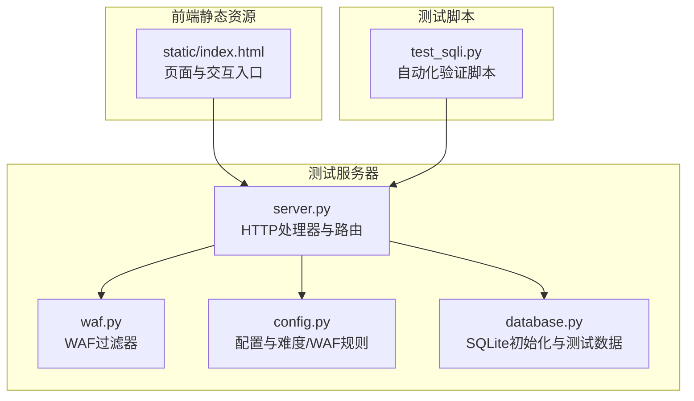
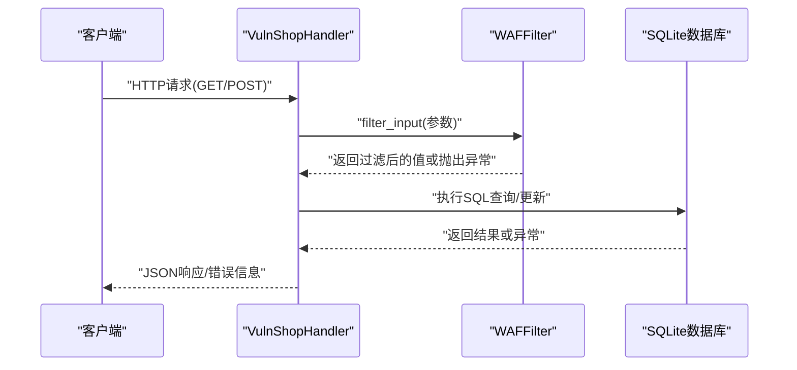
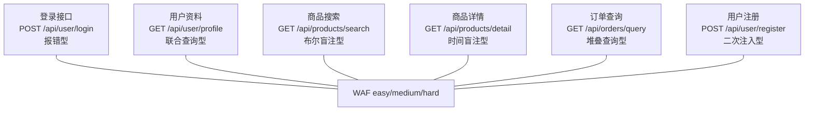
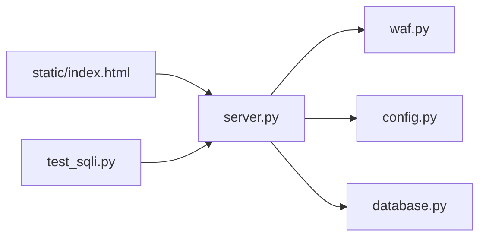

# 漏洞类型与难度级别

<cite>
**本文引用的文件**
- [server.py](file://src/vulnTestServer/server.py)
- [waf.py](file://src/vulnTestServer/waf.py)
- [config.py](file://src/vulnTestServer/config.py)
- [database.py](file://src/vulnTestServer/database.py)
- [test_sqli.py](file://src/vulnTestServer/test_sqli.py)
- [index.html](file://src/vulnTestServer/static/index.html)
- [USAGE_GUIDE.md](file://doc/USAGE_GUIDE.md)
- [README.md](file://src/vulnTestServer/README.md)
</cite>

## 目录
1. [引言](#引言)
2. [项目结构](#项目结构)
3. [核心组件](#核心组件)
4. [架构总览](#架构总览)
5. [详细组件分析](#详细组件分析)
6. [依赖关系分析](#依赖关系分析)
7. [性能考量](#性能考量)
8. [故障排查指南](#故障排查指南)
9. [结论](#结论)
10. [附录](#附录)

## 引言
本文件系统性梳理 VulnShop 靶场中的 SQL 注入漏洞类型与难度级别，覆盖数字型、字符型、搜索型、报错型、布尔盲注、时间盲注、堆叠查询与二次注入等。同时解析 WAF（Web 应用防火墙）的实现机制、检测规则与绕过挑战，并按难度级别（初级、中级、高级）给出技术特点与利用难度说明。最后提供漏洞分布图与代码片段路径，帮助读者快速定位与对比安全实现与漏洞实现。

## 项目结构
VulnShop 由“测试服务器”与“前端静态页面”组成，核心逻辑集中在 Python HTTP 服务器中，通过路由分发到各 API 处理器；WAF 以独立模块提供输入过滤；数据库初始化与测试数据插入在数据库模块中完成。

图表来源
- [server.py](file://src/vulnTestServer/server.py#L151-L218)
- [waf.py](file://src/vulnTestServer/waf.py#L14-L121)
- [config.py](file://src/vulnTestServer/config.py#L9-L58)
- [database.py](file://src/vulnTestServer/database.py#L15-L193)
- [index.html](file://src/vulnTestServer/static/index.html#L1-L120)
- [test_sqli.py](file://src/vulnTestServer/test_sqli.py#L1-L270)

章节来源
- [server.py](file://src/vulnTestServer/server.py#L151-L218)
- [config.py](file://src/vulnTestServer/config.py#L9-L58)

## 核心组件
- HTTP 请求处理器与路由：统一处理 GET/POST 请求，按路径分发到对应 API 处理函数，内置静态文件服务与 CORS 支持。
- API 处理器：分别实现登录、用户资料、商品搜索、商品详情、订单查询、用户注册等业务接口，其中多处存在 SQL 注入漏洞。
- WAF 过滤器：根据难度级别对输入进行关键字匹配、URL 解码、长度限制等检查，必要时抛出拦截异常。
- 配置与规则：定义主机、端口、调试、难度、WAF 规则、注入类型映射、日志等。
- 数据库模块：初始化 SQLite 表结构与测试数据，包含用户、商品、订单、秘密标记等。
- 自动化测试脚本：对各注入点进行验证，输出结果汇总。

章节来源
- [server.py](file://src/vulnTestServer/server.py#L151-L218)
- [waf.py](file://src/vulnTestServer/waf.py#L14-L121)
- [config.py](file://src/vulnTestServer/config.py#L9-L58)
- [database.py](file://src/vulnTestServer/database.py#L15-L193)
- [test_sqli.py](file://src/vulnTestServer/test_sqli.py#L1-L270)

## 架构总览
以下序列图展示一次典型请求的处理流程，包括 WAF 过滤与数据库访问。

图表来源
- [server.py](file://src/vulnTestServer/server.py#L240-L283)
- [server.py](file://src/vulnTestServer/server.py#L284-L328)
- [server.py](file://src/vulnTestServer/server.py#L329-L444)
- [server.py](file://src/vulnTestServer/server.py#L445-L505)
- [server.py](file://src/vulnTestServer/server.py#L506-L561)
- [waf.py](file://src/vulnTestServer/waf.py#L91-L121)
- [database.py](file://src/vulnTestServer/database.py#L15-L193)

## 详细组件分析

### SQL 注入类型与实现要点

- 报错型（Error-based）
  - 接口：POST /api/user/login
  - 实现要点：直接将用户输入拼接到 SQL 字符串中，导致数据库返回详细错误信息，便于基于错误的注入。
  - 触发条件：构造使 SQL 语法错误或类型转换异常的输入，从而触发错误回显。
  - 代码片段路径：
    - [handle_user_login](file://src/vulnTestServer/server.py#L240-L283)
    - [README.md 示例](file://src/vulnTestServer/README.md#L93-L110)

- 联合查询型（Union-based）
  - 接口：GET /api/user/profile
  - 实现要点：将用户 ID 直接拼接至 SQL 查询，未使用参数化查询，可被 UNION 注入。
  - 触发条件：构造 UNION SELECT 获取其他列或敏感表数据。
  - 代码片段路径：
    - [handle_user_profile](file://src/vulnTestServer/server.py#L284-L328)
    - [README.md 示例](file://src/vulnTestServer/README.md#L108-L112)

- 布尔盲注型（Boolean-blind）
  - 接口：GET /api/products/search
  - 实现要点：将关键词与类别直接拼接，通过布尔真假控制返回记录数，从而判断注入结果。
  - 触发条件：构造闭合与布尔表达式，观察返回数量变化。
  - 代码片段路径：
    - [handle_products_search](file://src/vulnTestServer/server.py#L329-L388)
    - [USAGE_GUIDE.md 示例](file://doc/USAGE_GUIDE.md#L411-L418)

- 时间盲注型（Time-based）
  - 接口：GET /api/products/detail
  - 实现要点：将商品 ID 直接拼接，通过构造耗时函数（如随机大块数据）影响响应时间。
  - 触发条件：构造 CASE WHEN 等条件，观察响应时间差异。
  - 代码片段路径：
    - [handle_product_detail](file://src/vulnTestServer/server.py#L389-L444)
    - [USAGE_GUIDE.md 示例](file://doc/USAGE_GUIDE.md#L419-L426)

- 堆叠查询型（Stacked Queries）
  - 接口：GET /api/orders/query
  - 实现要点：当 SQL 包含分号时，使用脚本执行器执行多条语句，可插入/更新/删除等。
  - 触发条件：传入包含分号的 order_no 或 user_id。
  - 代码片段路径：
    - [handle_orders_query](file://src/vulnTestServer/server.py#L445-L505)
    - [USAGE_GUIDE.md 示例](file://doc/USAGE_GUIDE.md#L427-L434)

- 二次注入型（Second-order）
  - 接口：POST /api/user/register
  - 实现要点：注册阶段安全入库（参数化），但恶意用户名被存储；在后续查询中再次直接拼接该用户名，形成二次注入。
  - 触发条件：先提交包含注入的用户名，再触发读取该用户名的查询。
  - 代码片段路径：
    - [handle_user_register](file://src/vulnTestServer/server.py#L506-L561)

- 数字型与字符型
  - 数字型：用户资料接口的 id 参数为整数拼接，属于数字型注入。
  - 字符型：登录接口的 username 为字符串拼接，属于字符型注入。
  - 代码片段路径：
    - [handle_user_profile](file://src/vulnTestServer/server.py#L284-L328)
    - [handle_user_login](file://src/vulnTestServer/server.py#L240-L283)

- 搜索型
  - 商品搜索接口的 keyword 与 category 参数直接拼接，构成搜索型注入。
  - 代码片段路径：
    - [handle_products_search](file://src/vulnTestServer/server.py#L329-L388)

章节来源
- [server.py](file://src/vulnTestServer/server.py#L240-L561)
- [README.md](file://src/vulnTestServer/README.md#L93-L142)
- [USAGE_GUIDE.md](file://doc/USAGE_GUIDE.md#L411-L434)

### WAF 实现机制与绕过挑战

- 难度等级
  - easy：无防护，所有注入类型均可直接利用。
  - medium：简单过滤，允许大小写、编码等绕过，适合初学者练习基础绕过。
  - hard：严格过滤，需高级绕过技术，包含长度限制、十六进制编码检测、注释与 OR/AND 模式检测等。

- 关键检测规则
  - 输入长度限制（hard 模式）
  - 关键字匹配（UNION、SELECT、INSERT、UPDATE、DELETE、DROP、注释、OR/AND/XOR、SLEEP/BENCHMARK、WAITFOR/DELAY、十六进制等）
  - URL 解码检测（多次解码防止双重编码绕过）
  - 大小写与变形检测（根据 bypass_allowed 控制）

- 防御策略与绕过挑战
  - 绕过策略：大小写混合、URL 编码、双写绕过、注释与空字符、十六进制、字符变形、逻辑替换等。
  - 防御策略：参数化查询、白名单校验、输入长度限制、关键字黑名单、深度解码与变形检测、响应差异化处理等。

- 代码片段路径：
  - [WAFFilter.check](file://src/vulnTestServer/waf.py#L21-L89)
  - [WAFFilter.filter_input](file://src/vulnTestServer/waf.py#L91-L99)
  - [WAF_RULES 配置](file://src/vulnTestServer/config.py#L36-L49)

章节来源
- [waf.py](file://src/vulnTestServer/waf.py#L14-L121)
- [config.py](file://src/vulnTestServer/config.py#L36-L49)

### 难度级别与技术特点

- 初级（Easy）
  - 特点：无任何防护，直接注入即可成功。
  - 利用难度：低，适合入门学习 SQL 注入基本原理与工具使用。
  - 适用场景：教学演示、新手练习。

- 中级（Medium）
  - 特点：存在简单过滤，可通过大小写混合、URL 编码等方式绕过。
  - 利用难度：中等，需要掌握基础绕过技巧。
  - 适用场景：提升绕过能力、熟悉常见 WAF 规则。

- 高级（Hard）
  - 特点：严格过滤，包含长度限制、十六进制检测、注释与 OR/AND 模式检测等。
  - 利用难度：高，需要深入理解编码、变形、逻辑替换等高级绕过技术。
  - 适用场景：高级渗透测试、WAF 高级绕过研究。

章节来源
- [config.py](file://src/vulnTestServer/config.py#L19-L24)
- [USAGE_GUIDE.md](file://doc/USAGE_GUIDE.md#L440-L447)

### 漏洞分布图与访问路径

图表来源
- [server.py](file://src/vulnTestServer/server.py#L240-L561)
- [waf.py](file://src/vulnTestServer/waf.py#L14-L121)

章节来源
- [server.py](file://src/vulnTestServer/server.py#L240-L561)
- [index.html](file://src/vulnTestServer/static/index.html#L52-L61)

### 代码片段分析：漏洞与安全实现对比

- 报错型注入（登录接口）
  - 漏洞实现：直接拼接用户名与密码哈希到 SQL 字符串，数据库错误信息可用于注入。
  - 安全实现建议：使用参数化查询，避免字符串拼接。
  - 代码片段路径：
    - [handle_user_login](file://src/vulnTestServer/server.py#L240-L283)

- 联合查询注入（用户资料）
  - 漏洞实现：用户 ID 直接拼接，未做参数化。
  - 安全实现建议：使用参数化查询绑定用户 ID。
  - 代码片段路径：
    - [handle_user_profile](file://src/vulnTestServer/server.py#L284-L328)

- 布尔盲注（商品搜索）
  - 漏洞实现：关键词与类别直接拼接，通过布尔真假控制返回数量。
  - 安全实现建议：参数化查询 + 白名单校验类别。
  - 代码片段路径：
    - [handle_products_search](file://src/vulnTestServer/server.py#L329-L388)

- 时间盲注（商品详情）
  - 漏洞实现：商品 ID 直接拼接，构造耗时函数影响响应时间。
  - 安全实现建议：参数化查询 + 限制超时与资源消耗。
  - 代码片段路径：
    - [handle_product_detail](file://src/vulnTestServer/server.py#L389-L444)

- 堆叠查询注入（订单查询）
  - 漏洞实现：检测分号后使用脚本执行器执行多条语句。
  - 安全实现建议：禁用多语句执行；若必须使用，严格参数化与权限控制。
  - 代码片段路径：
    - [handle_orders_query](file://src/vulnTestServer/server.py#L445-L505)

- 二次注入（用户注册）
  - 漏洞实现：注册阶段参数化存储，但后续查询再次直接拼接存储的用户名。
  - 安全实现建议：避免将用户输入持久化到可再次执行的上下文中；若必须使用，严格转义与参数化。
  - 代码片段路径：
    - [handle_user_register](file://src/vulnTestServer/server.py#L506-L561)

章节来源
- [server.py](file://src/vulnTestServer/server.py#L240-L561)

## 依赖关系分析

图表来源
- [server.py](file://src/vulnTestServer/server.py#L151-L218)
- [waf.py](file://src/vulnTestServer/waf.py#L14-L121)
- [config.py](file://src/vulnTestServer/config.py#L9-L58)
- [database.py](file://src/vulnTestServer/database.py#L15-L193)
- [index.html](file://src/vulnTestServer/static/index.html#L1-L120)
- [test_sqli.py](file://src/vulnTestServer/test_sqli.py#L1-L270)

章节来源
- [server.py](file://src/vulnTestServer/server.py#L151-L218)
- [waf.py](file://src/vulnTestServer/waf.py#L14-L121)
- [config.py](file://src/vulnTestServer/config.py#L9-L58)
- [database.py](file://src/vulnTestServer/database.py#L15-L193)
- [index.html](file://src/vulnTestServer/static/index.html#L1-L120)
- [test_sqli.py](file://src/vulnTestServer/test_sqli.py#L1-L270)

## 性能考量
- 布尔盲注与时间盲注对响应时间敏感，建议在测试环境中合理设置超时与并发，避免误判。
- 堆叠查询可能引发数据库资源占用，应限制执行频率与语句复杂度。
- WAF 过滤在 hard 模式下增加 CPU 开销，建议结合缓存与限流策略。
- 前端页面与静态资源通过静态文件服务提供，注意 MIME 类型与路径规范化，防止目录穿越。

## 故障排查指南
- WAF 拦截
  - 现象：请求被拒绝并返回拦截原因。
  - 排查：检查输入是否超过长度限制、是否包含被阻断的关键字或编码模式。
  - 代码片段路径：
    - [WAFBlockedException](file://src/vulnTestServer/waf.py#L101-L106)
    - [set_difficulty](file://src/vulnTestServer/waf.py#L113-L121)

- 数据库错误
  - 现象：报错信息泄露或查询失败。
  - 排查：确认 SQL 拼接是否正确闭合；在调试模式下查看 SQL 执行语句。
  - 代码片段路径：
    - [handle_user_login 错误处理](file://src/vulnTestServer/server.py#L278-L282)
    - [handle_user_profile 错误处理](file://src/vulnTestServer/server.py#L324-L326)

- 自动化测试失败
  - 现象：某些注入点未被识别。
  - 排查：检查测试脚本中的 payload 是否符合接口参数要求；确认难度设置与 WAF 规则。
  - 代码片段路径：
    - [test_sqli 主流程](file://src/vulnTestServer/test_sqli.py#L210-L267)

章节来源
- [waf.py](file://src/vulnTestServer/waf.py#L101-L121)
- [server.py](file://src/vulnTestServer/server.py#L278-L282)
- [server.py](file://src/vulnTestServer/server.py#L324-L326)
- [test_sqli.py](file://src/vulnTestServer/test_sqli.py#L210-L267)

## 结论
VulnShop 靶场通过多种 SQL 注入类型与难度分级，为不同层次的学习者提供了完整的实践场景。WAF 在不同难度下提供渐进式的防护体验，既有助于教学，也便于研究绕过技术。建议在实际使用中遵循最小权限原则与参数化查询，避免真实生产环境出现类似漏洞。

## 附录

### 漏洞类型与难度对照表
- 报错型：POST /api/user/login（易/中/高）
- 联合查询型：GET /api/user/profile（易/中/高）
- 布尔盲注型：GET /api/products/search（易/中/高）
- 时间盲注型：GET /api/products/detail（易/中/高）
- 堆叠查询型：GET /api/orders/query（易/中/高）
- 二次注入型：POST /api/user/register（易/中/高）

章节来源
- [server.py](file://src/vulnTestServer/server.py#L240-L561)
- [config.py](file://src/vulnTestServer/config.py#L25-L34)