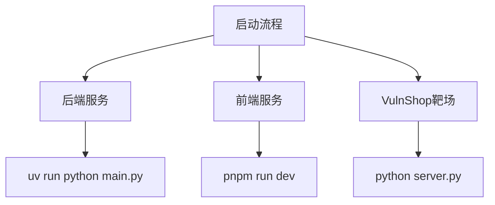
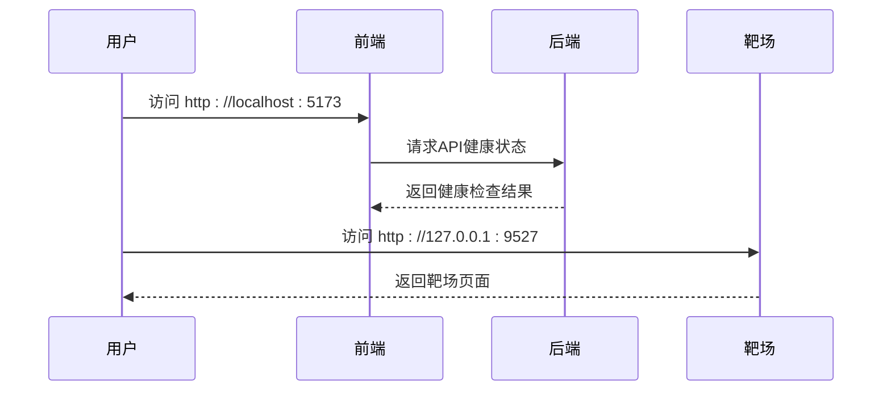

# 环境搭建与配置

<cite>
**本文档引用的文件**  
- [config.py](file://src/backEnd/config.py)
- [main.py](file://src/backEnd/main.py)
- [app.py](file://src/backEnd/app.py)
- [pyproject.toml](file://src/backEnd/pyproject.toml)
- [.env.example](file://src/backEnd/.env.example)
- [Database.py](file://src/backEnd/model/Database.py)
- [DataStore.py](file://src/backEnd/model/DataStore.py)
- [task_monitor.py](file://src/backEnd/utils/task_monitor.py)
- [server.py](file://src/vulnTestServer/server.py)
- [database.py](file://src/vulnTestServer/database.py)
- [waf.py](file://src/vulnTestServer/waf.py)
- [README.md](file://README.md)
</cite>

## 目录
1. [简介](#简介)
2. [系统要求](#系统要求)
3. [依赖安装](#依赖安装)
4. [配置文件详解](#配置文件详解)
5. [源码部署与服务启动](#源码部署与服务启动)
6. [跨平台安装差异](#跨平台安装差异)
7. [配置验证与健康检查](#配置验证与健康检查)
8. [故障排除指南](#故障排除指南)
9. [结论](#结论)

## 简介
本文档详细说明了VulnShop靶场环境的搭建与配置过程。VulnShop是一个内置在SQLMap Web UI项目中的漏洞测试靶场，包含8种SQL注入漏洞类型，支持3种难度级别和WAF防护。文档涵盖了从系统要求、依赖安装、配置文件设置到服务启动的完整流程，并提供了详细的故障排除指南。

## 系统要求
VulnShop靶场的运行需要满足以下系统要求：

- **Python 3.13+**：后端服务运行环境
- **Node.js 20+**：前端构建环境
- **pnpm 9+**：前端包管理器
- **Java 17+**（Burp Montoya API）或 **Java 11+**（Legacy API）：Burp Suite插件支持
- **至少2GB内存**：推荐4GB以上
- **至少1GB磁盘空间**：用于代码库和依赖包

**Section sources**
- [README.md](file://README.md#L118-L124)

## 依赖安装
### 后端依赖安装
后端使用uv作为现代Python包管理器，安装步骤如下：

```bash
# 进入后端目录
cd src/backEnd

# 使用uv安装依赖
uv sync --extra thirdparty
```

该命令会根据pyproject.toml文件安装所有必需的依赖包，包括FastAPI、APScheduler和psutil等。

### 前端依赖安装
前端使用pnpm作为包管理器，安装步骤如下：

```bash
# 进入前端目录
cd src/frontEnd

# 安装依赖
pnpm install
```

### 靶场依赖安装
VulnShop靶场基于Flask框架，需要单独安装依赖：

```bash
# 进入靶场目录
cd src/vulnTestServer

# 安装Flask依赖
pip install flask
```

**Section sources**
- [pyproject.toml](file://src/backEnd/pyproject.toml#L1-L17)
- [package.json](file://src/frontEnd/package.json#L1-L50)
- [README.md](file://README.md#L125-L165)

## 配置文件详解
### config.py配置参数
位于src/backEnd/config.py的配置文件包含以下关键参数：

- **MAX_TASKS_COUNT**：最大并发任务数，默认值为3
- **MAX_TASKS_COUNT_LOCK**：线程锁，用于保护最大任务数的并发访问
- **VERSION**：系统版本号，当前为"1.7.9"

这些配置参数控制着系统的并发能力和版本信息。

### .env环境变量配置
后端支持通过.env文件进行环境变量配置，主要参数包括：

- **APP_ENV**：应用运行环境（development/production/test）
- **DEBUG**：调试模式开关
- **HOST**：应用主机地址
- **PORT**：应用端口
- **SECRET_KEY**：JWT密钥
- **DATABASE_PATH**：SQLite数据库文件路径
- **SQLMAP_API_URL**：SQLMap API服务地址
- **SQLMAP_OUTPUT_DIR**：SQLMap输出目录
- **LOG_LEVEL**：日志级别
- **CORS_ORIGINS**：允许的跨域来源

用户需要复制.env.example文件并重命名为.env，然后根据实际需求修改配置值。

### VulnShop靶场配置
VulnShop靶场的配置主要通过以下文件实现：

- **config.py**：包含靶场的基本配置
- **waf.py**：WAF规则配置文件
- **database.py**：数据库初始化和管理

WAF规则配置支持不同难度级别，通过修改waf.py中的规则强度来实现Easy、Medium、Hard三种难度的切换。

**Section sources**
- [config.py](file://src/backEnd/config.py#L1-L8)
- [.env.example](file://src/backEnd/.env.example#L1-L71)
- [README.md](file://README.md#L76-L93)

## 源码部署与服务启动
### 后端服务启动
后端服务的启动步骤如下：

```bash
# 进入后端目录
cd src/backEnd

# 启动服务
uv run python main.py
```

main.py是后端的入口文件，负责初始化数据库、启动任务监控器和运行FastAPI应用。服务默认在http://127.0.0.1:8775上运行。

### 前端服务启动
前端服务的启动步骤如下：

```bash
# 进入前端目录
cd src/frontEnd

# 开发模式启动
pnpm run dev
```

开发模式下，前端服务运行在http://localhost:5173。生产环境需要使用`pnpm run build`命令构建静态文件。

### 靶场服务启动
VulnShop靶场的启动步骤如下：

```bash
# 进入靶场目录
cd src/vulnTestServer

# 启动服务
python server.py
```

靶场服务默认在http://127.0.0.1:9527上运行，仅绑定本地地址，禁止暴露到公网。



**Diagram sources**
- [main.py](file://src/backEnd/main.py#L165-L168)
- [server.py](file://src/vulnTestServer/server.py)
- [README.md](file://README.md#L154-L165)

**Section sources**
- [main.py](file://src/backEnd/main.py#L1-L168)
- [app.py](file://src/backEnd/app.py#L1-L80)
- [server.py](file://src/vulnTestServer/server.py)

## 跨平台安装差异
### Windows系统
在Windows系统上安装时需要注意：

- 确保Python和Node.js已正确添加到系统PATH
- 使用管理员权限运行命令提示符或PowerShell
- 注意路径分隔符的差异，使用反斜杠`\`而不是斜杠`/`

### Linux/macOS系统
在Linux和macOS系统上安装时需要注意：

- 可能需要使用`sudo`权限安装全局包
- 确保有适当的文件读写权限
- 使用标准的斜杠`/`作为路径分隔符
- 在某些Linux发行版上可能需要先安装开发工具包

所有平台的安装命令基本相同，主要差异在于环境配置和权限管理。

**Section sources**
- [README.md](file://README.md#L116-L165)

## 配置验证与健康检查
### 健康检查端点
系统提供了健康检查API端点，用于验证服务是否正常运行：

```bash
curl http://127.0.0.1:8775/api/health
```

该端点返回包含服务状态、时间戳、版本号和运行时长的JSON响应。

### 配置验证步骤
1. 启动所有服务后，访问前端地址http://localhost:5173
2. 检查是否能正常加载页面
3. 访问健康检查端点http://127.0.0.1:8775/api/health
4. 验证返回的JSON响应中status为"healthy"
5. 访问VulnShop靶场http://127.0.0.1:9527
6. 验证靶场页面是否正常显示

### 数据库初始化验证
通过检查以下内容验证数据库是否正确初始化：

- 检查DataStore.current_db是否成功连接
- 验证数据库中是否创建了logs、data、errors等表
- 确认persistent_header_rules表及其索引已正确创建



**Diagram sources**
- [app.py](file://src/backEnd/app.py#L61-L80)
- [README.md](file://README.md#L167-L174)

**Section sources**
- [app.py](file://src/backEnd/app.py#L61-L80)
- [Database.py](file://src/backEnd/model/Database.py#L72-L99)

## 故障排除指南
### 端口冲突
如果遇到端口冲突问题，可以：

1. 检查8775、5173、9527端口是否已被占用
2. 使用`netstat -an | grep <port>`（Linux/macOS）或`netstat -an | findstr <port>`（Windows）查看端口占用情况
3. 修改相应服务的配置文件中的端口号
4. 重启服务

### 依赖缺失
如果出现依赖缺失错误：

1. 确认已正确安装所有依赖包
2. 检查Python和Node.js版本是否符合要求
3. 重新运行依赖安装命令
4. 检查网络连接是否正常，特别是使用国内镜像源时

### 数据库初始化问题
如果数据库初始化失败：

1. 检查临时文件目录是否有写权限
2. 确认SQLite3模块已正确安装
3. 查看日志文件中的错误信息
4. 手动删除可能存在的损坏数据库文件后重试

### 常见错误解决方案
- **ImportError**: 确保所有依赖已正确安装，检查Python路径
- **Port in use**: 更改服务端口或关闭占用端口的进程
- **Module not found**: 使用正确的虚拟环境，重新安装依赖
- **Permission denied**: 以管理员权限运行或检查文件权限

**Section sources**
- [main.py](file://src/backEnd/main.py#L135-L136)
- [Database.py](file://src/backEnd/model/Database.py#L18-L31)
- [task_monitor.py](file://src/backEnd/utils/task_monitor.py#L36-L94)

## 结论
本文档详细介绍了VulnShop靶场环境的搭建与配置过程。通过遵循文档中的步骤，用户可以成功部署并运行包含8种SQL注入漏洞类型的测试靶场。系统采用现代化的技术栈，包括FastAPI、Vue 3和SQLMap，提供了完整的安全测试平台。建议用户在授权环境中使用本工具进行安全研究和学习。