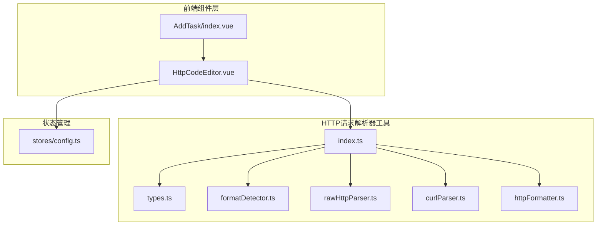
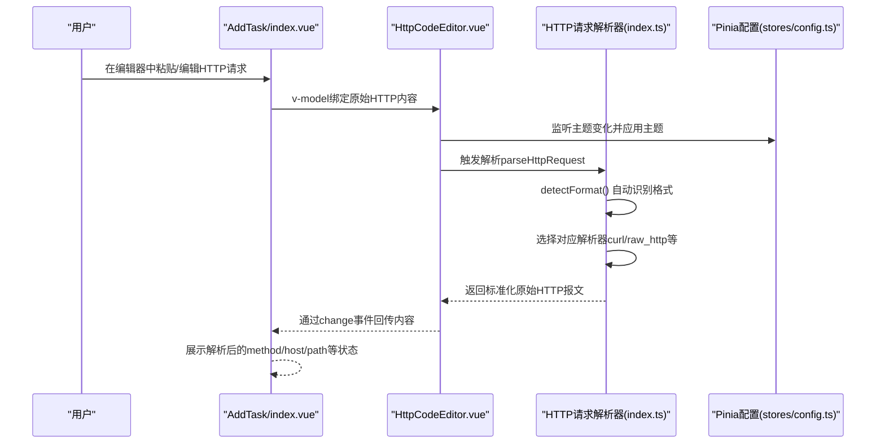
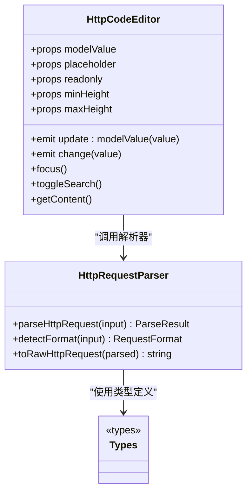
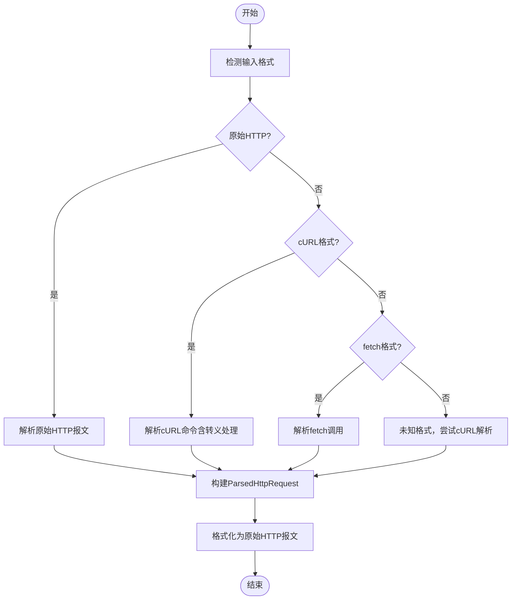
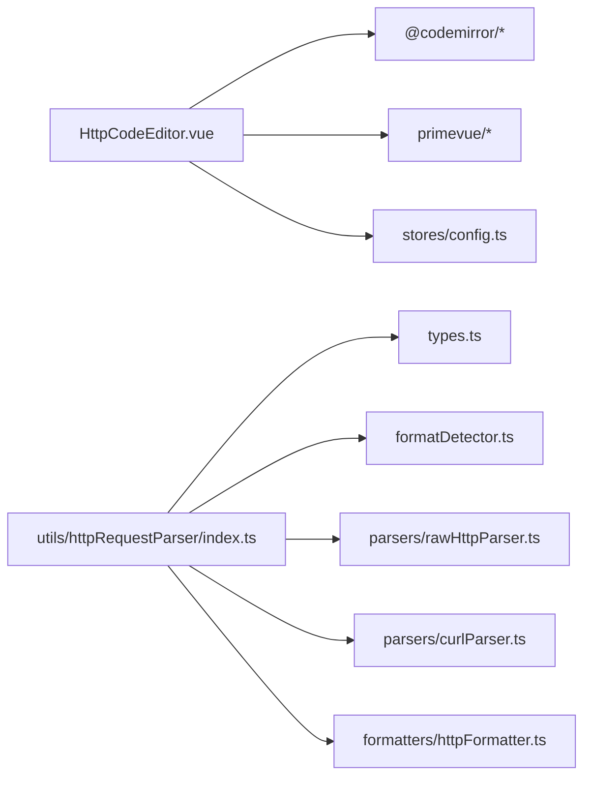

# HTTP代码编辑器组件

<cite>
**本文引用的文件**
- [HttpCodeEditor.vue](file://src/frontEnd/src/components/HttpCodeEditor.vue)
- [index.ts](file://src/frontEnd/src/utils/httpRequestParser/index.ts)
- [types.ts](file://src/frontEnd/src/utils/httpRequestParser/types.ts)
- [formatDetector.ts](file://src/frontEnd/src/utils/httpRequestParser/formatDetector.ts)
- [rawHttpParser.ts](file://src/frontEnd/src/utils/httpRequestParser/parsers/rawHttpParser.ts)
- [curlParser.ts](file://src/frontEnd/src/utils/httpRequestParser/parsers/curlParser.ts)
- [httpFormatter.ts](file://src/frontEnd/src/utils/httpRequestParser/formatters/httpFormatter.ts)
- [config.ts](file://src/frontEnd/src/stores/config.ts)
- [index.vue](file://src/frontEnd/src/views/AddTask/index.vue)
</cite>

## 目录
1. [简介](#简介)
2. [项目结构](#项目结构)
3. [核心组件](#核心组件)
4. [架构总览](#架构总览)
5. [详细组件分析](#详细组件分析)
6. [依赖关系分析](#依赖关系分析)
7. [性能考量](#性能考量)
8. [故障排查指南](#故障排查指南)
9. [结论](#结论)
10. [附录](#附录)

## 简介
本文件系统性地梳理了前端“HTTP代码编辑器”组件的设计与实现，覆盖其与HTTP请求解析器的集成方式、主题与搜索功能、注入点标记高亮、以及在任务创建页面中的使用场景。文档以渐进复杂度的方式呈现，既适合初学者快速上手，也为开发者提供深入的技术细节与可视化图示。

## 项目结构
该组件位于前端工程的组件目录，并与HTTP请求解析器工具模块紧密协作，最终服务于“添加任务”视图。

图表来源
- [HttpCodeEditor.vue](file://src/frontEnd/src/components/HttpCodeEditor.vue#L1-L120)
- [index.ts](file://src/frontEnd/src/utils/httpRequestParser/index.ts#L1-L168)
- [types.ts](file://src/frontEnd/src/utils/httpRequestParser/types.ts#L1-L72)
- [formatDetector.ts](file://src/frontEnd/src/utils/httpRequestParser/formatDetector.ts#L1-L133)
- [rawHttpParser.ts](file://src/frontEnd/src/utils/httpRequestParser/parsers/rawHttpParser.ts#L1-L170)
- [curlParser.ts](file://src/frontEnd/src/utils/httpRequestParser/parsers/curlParser.ts#L1-L180)
- [httpFormatter.ts](file://src/frontEnd/src/utils/httpRequestParser/formatters/httpFormatter.ts#L1-L128)
- [config.ts](file://src/frontEnd/src/stores/config.ts#L1-L74)
- [index.vue](file://src/frontEnd/src/views/AddTask/index.vue#L40-L120)

章节来源
- [HttpCodeEditor.vue](file://src/frontEnd/src/components/HttpCodeEditor.vue#L1-L120)
- [index.ts](file://src/frontEnd/src/utils/httpRequestParser/index.ts#L1-L168)

## 核心组件
- HttpCodeEditor.vue：基于CodeMirror的HTTP专用编辑器，提供语法高亮、搜索、只读切换、主题适配、注入点标记高亮等功能。
- HTTP请求解析器工具：统一入口模块，负责格式检测、解析与格式化，输出标准化的原始HTTP报文，便于后续提交给后端。

章节来源
- [HttpCodeEditor.vue](file://src/frontEnd/src/components/HttpCodeEditor.vue#L120-L220)
- [index.ts](file://src/frontEnd/src/utils/httpRequestParser/index.ts#L70-L168)

## 架构总览
编辑器组件通过Pinia状态管理感知主题变化，动态应用浅色/深色主题；同时，它与HTTP请求解析器工具解耦协作，解析用户输入的多种格式（cURL、PowerShell、fetch、原始HTTP），并将其转换为统一的原始HTTP报文，供任务创建流程使用。

图表来源
- [index.vue](file://src/frontEnd/src/views/AddTask/index.vue#L40-L120)
- [HttpCodeEditor.vue](file://src/frontEnd/src/components/HttpCodeEditor.vue#L329-L408)
- [index.ts](file://src/frontEnd/src/utils/httpRequestParser/index.ts#L103-L168)
- [config.ts](file://src/frontEnd/src/stores/config.ts#L1-L74)

## 详细组件分析

### HttpCodeEditor 组件
- 功能要点
  - 语法高亮：针对HTTP请求行、Header键、URL路径、版本号、数字及注入点标记进行高亮。
  - 搜索工具栏：支持正则/大小写敏感/反转匹配，实时统计匹配数量与当前索引。
  - 主题适配：根据Pinia配置的主题（浅色/深色）动态切换CodeMirror主题。
  - 只读控制：通过Compartment按需切换只读状态。
  - 事件与暴露方法：双向绑定modelValue，触发change事件；暴露focus、toggleSearch、getContent等方法。
  - 尺寸控制：通过minHeight/maxHeight控制编辑器高度范围。

- 关键实现位置
  - 语法高亮与主题：见[HttpCodeEditor.vue](file://src/frontEnd/src/components/HttpCodeEditor.vue#L163-L319)
  - 搜索逻辑与计数：见[HttpCodeEditor.vue](file://src/frontEnd/src/components/HttpCodeEditor.vue#L399-L476)
  - 状态监听与主题切换：见[HttpCodeEditor.vue](file://src/frontEnd/src/components/HttpCodeEditor.vue#L493-L523)
  - 初始化与销毁：见[HttpCodeEditor.vue](file://src/frontEnd/src/components/HttpCodeEditor.vue#L368-L534)

- 注入点标记高亮
  - 编辑器自定义语言流对“*”进行识别并以deleted标签高亮，便于用户直观标记注入点。
  - 该高亮在语法样式中被赋予红色字体与半透明背景，突出显示。

- 与解析器的协作
  - 编辑器不直接解析请求，而是将变更通过事件传递给父组件；父组件可调用解析器工具进行格式检测与转换，再回填到编辑器或提交任务。

章节来源
- [HttpCodeEditor.vue](file://src/frontEnd/src/components/HttpCodeEditor.vue#L120-L220)
- [HttpCodeEditor.vue](file://src/frontEnd/src/components/HttpCodeEditor.vue#L399-L476)
- [HttpCodeEditor.vue](file://src/frontEnd/src/components/HttpCodeEditor.vue#L493-L523)
- [HttpCodeEditor.vue](file://src/frontEnd/src/components/HttpCodeEditor.vue#L368-L534)

#### 类图：编辑器组件与解析器工具的关系

图表来源
- [HttpCodeEditor.vue](file://src/frontEnd/src/components/HttpCodeEditor.vue#L120-L160)
- [index.ts](file://src/frontEnd/src/utils/httpRequestParser/index.ts#L70-L168)
- [types.ts](file://src/frontEnd/src/utils/httpRequestParser/types.ts#L1-L72)

### HTTP请求解析器工具
- 入口函数：parseHttpRequest(input)
  - 自动检测输入格式（cURL、PowerShell、fetch、原始HTTP），选择对应解析器，返回标准化的原始HTTP报文。
- 格式检测：detectFormat(input)
  - 依据规则优先级判断格式类型，必要时使用判别器区分cURL/cmd与cURL/bash、fetch/js与fetch/nodejs。
- 原始HTTP解析：parseRawHttp(input)
  - 解析请求行、Headers、Body，构建ParsedHttpRequest对象。
- cURL解析：parseCurlBash/parseCurlCmd
  - 处理续行符与Windows CMD转义字符，提取URL、Headers、Body，修复库解析在含引号Body时的缺陷。
- 格式化：toRawHttpRequest(parsed)
  - 将解析结果转换为原始HTTP报文字符串，便于提交或展示。

- 关键实现位置
  - 入口与返回结构：见[index.ts](file://src/frontEnd/src/utils/httpRequestParser/index.ts#L103-L168)
  - 格式检测规则与判别器：见[formatDetector.ts](file://src/frontEnd/src/utils/httpRequestParser/formatDetector.ts#L23-L111)
  - 原始HTTP解析与校验：见[rawHttpParser.ts](file://src/frontEnd/src/utils/httpRequestParser/parsers/rawHttpParser.ts#L101-L170)
  - cURL解析与转义处理：见[curlParser.ts](file://src/frontEnd/src/utils/httpRequestParser/parsers/curlParser.ts#L104-L180)
  - 格式化与Headers转换：见[httpFormatter.ts](file://src/frontEnd/src/utils/httpRequestParser/formatters/httpFormatter.ts#L29-L128)

章节来源
- [index.ts](file://src/frontEnd/src/utils/httpRequestParser/index.ts#L70-L168)
- [formatDetector.ts](file://src/frontEnd/src/utils/httpRequestParser/formatDetector.ts#L23-L111)
- [rawHttpParser.ts](file://src/frontEnd/src/utils/httpRequestParser/parsers/rawHttpParser.ts#L101-L170)
- [curlParser.ts](file://src/frontEnd/src/utils/httpRequestParser/parsers/curlParser.ts#L104-L180)
- [httpFormatter.ts](file://src/frontEnd/src/utils/httpRequestParser/formatters/httpFormatter.ts#L29-L128)

#### 流程图：解析器工作流

图表来源
- [index.ts](file://src/frontEnd/src/utils/httpRequestParser/index.ts#L103-L168)
- [formatDetector.ts](file://src/frontEnd/src/utils/httpRequestParser/formatDetector.ts#L23-L111)
- [rawHttpParser.ts](file://src/frontEnd/src/utils/httpRequestParser/parsers/rawHttpParser.ts#L101-L170)
- [curlParser.ts](file://src/frontEnd/src/utils/httpRequestParser/parsers/curlParser.ts#L104-L180)
- [httpFormatter.ts](file://src/frontEnd/src/utils/httpRequestParser/formatters/httpFormatter.ts#L29-L55)

### 在“添加任务”视图中的使用
- 视图通过v-model绑定编辑器内容，实时展示解析后的method/host/path等状态信息。
- 用户可在编辑器中使用“*”标记注入点，便于后续扫描策略聚焦。
- 编辑器支持清空、复制、搜索等快捷操作，提升编辑效率。

章节来源
- [index.vue](file://src/frontEnd/src/views/AddTask/index.vue#L40-L120)

## 依赖关系分析
- 组件依赖
  - HttpCodeEditor依赖PrimeVue组件（InputText、Button、ToggleButton）与Pinia配置store。
  - 解析器工具依赖类型定义、格式检测、具体解析器与格式化模块。
- 外部库
  - CodeMirror：编辑器核心、主题、语法高亮、搜索扩展。
  - @scrape-do/curl-parser：cURL解析库，配合自定义Body提取修复其缺陷。

图表来源
- [HttpCodeEditor.vue](file://src/frontEnd/src/components/HttpCodeEditor.vue#L120-L160)
- [index.ts](file://src/frontEnd/src/utils/httpRequestParser/index.ts#L1-L168)
- [types.ts](file://src/frontEnd/src/utils/httpRequestParser/types.ts#L1-L72)
- [formatDetector.ts](file://src/frontEnd/src/utils/httpRequestParser/formatDetector.ts#L1-L133)
- [rawHttpParser.ts](file://src/frontEnd/src/utils/httpRequestParser/parsers/rawHttpParser.ts#L1-L170)
- [curlParser.ts](file://src/frontEnd/src/utils/httpRequestParser/parsers/curlParser.ts#L1-L180)
- [httpFormatter.ts](file://src/frontEnd/src/utils/httpRequestParser/formatters/httpFormatter.ts#L1-L128)
- [config.ts](file://src/frontEnd/src/stores/config.ts#L1-L74)

## 性能考量
- 编辑器渲染
  - 使用Compartment按需重配置（只读、主题），避免重建整个编辑器实例，降低开销。
  - 语法高亮与搜索匹配在文档变更时触发，建议在高频输入场景下结合节流/防抖策略（当前实现未显式节流，可按需优化）。
- 解析器性能
  - 格式检测采用优先级规则，匹配到即返回，时间复杂度近似O(n)（n为规则数量）。
  - cURL解析对Windows CMD转义字符进行多步替换，注意超长输入的性能影响；可考虑分段处理或异步化。
  - 原始HTTP解析按行扫描，时间复杂度O(m)（m为行数）。
- 主题切换
  - 通过主题Compartment重配置，避免全量重绘，响应迅速。

[本节为通用性能讨论，无需列出具体文件来源]

## 故障排查指南
- 编辑器无法聚焦或搜索无效
  - 检查是否正确初始化EditorView与容器ref，确认mounted钩子已执行。
  - 确认键盘快捷键未被其他组件拦截。
  - 参考：[HttpCodeEditor.vue](file://src/frontEnd/src/components/HttpCodeEditor.vue#L368-L534)
- 注入点标记未高亮
  - 确认编辑器语言流中对“*”的识别逻辑生效，且高亮样式已加载。
  - 参考：[HttpCodeEditor.vue](file://src/frontEnd/src/components/HttpCodeEditor.vue#L163-L220)
- 主题切换不生效
  - 确认Pinia配置store的theme变更已触发watch回调，且主题Compartment已reconfigure。
  - 参考：[HttpCodeEditor.vue](file://src/frontEnd/src/components/HttpCodeEditor.vue#L516-L523)，[config.ts](file://src/frontEnd/src/stores/config.ts#L1-L74)
- 解析器返回未知格式
  - 检查输入是否符合任一格式规则；必要时手动指定格式或修正输入。
  - 参考：[formatDetector.ts](file://src/frontEnd/src/utils/httpRequestParser/formatDetector.ts#L23-L111)，[index.ts](file://src/frontEnd/src/utils/httpRequestParser/index.ts#L103-L168)
- cURL解析Body异常
  - Windows CMD输入需注意转义字符处理；若仍异常，检查Body提取逻辑与库解析结果。
  - 参考：[curlParser.ts](file://src/frontEnd/src/utils/httpRequestParser/parsers/curlParser.ts#L104-L180)
- 原始HTTP解析失败
  - 确认请求行格式、Headers与空行分隔符正确；必要时使用格式化工具生成标准报文。
  - 参考：[rawHttpParser.ts](file://src/frontEnd/src/utils/httpRequestParser/parsers/rawHttpParser.ts#L101-L170)

章节来源
- [HttpCodeEditor.vue](file://src/frontEnd/src/components/HttpCodeEditor.vue#L368-L534)
- [config.ts](file://src/frontEnd/src/stores/config.ts#L1-L74)
- [formatDetector.ts](file://src/frontEnd/src/utils/httpRequestParser/formatDetector.ts#L23-L111)
- [index.ts](file://src/frontEnd/src/utils/httpRequestParser/index.ts#L103-L168)
- [curlParser.ts](file://src/frontEnd/src/utils/httpRequestParser/parsers/curlParser.ts#L104-L180)
- [rawHttpParser.ts](file://src/frontEnd/src/utils/httpRequestParser/parsers/rawHttpParser.ts#L101-L170)

## 结论
HttpCodeEditor组件以CodeMirror为核心，提供了HTTP专用的语法高亮、搜索与主题适配能力；通过与HTTP请求解析器工具的解耦协作，实现了对多种输入格式的自动识别与标准化输出。该设计兼顾易用性与可维护性，适合在任务创建等场景中高效编辑与提交HTTP请求。

[本节为总结性内容，无需列出具体文件来源]

## 附录
- 使用建议
  - 在编辑器中使用“*”标记注入点，便于后续扫描聚焦。
  - 对于cURL输入，优先使用bash格式；Windows CMD输入请确保转义字符正确。
  - 利用搜索工具栏快速定位关键信息，提高调试效率。
- 相关文件路径
  - 组件：[HttpCodeEditor.vue](file://src/frontEnd/src/components/HttpCodeEditor.vue)
  - 解析器入口：[index.ts](file://src/frontEnd/src/utils/httpRequestParser/index.ts)
  - 类型定义：[types.ts](file://src/frontEnd/src/utils/httpRequestParser/types.ts)
  - 格式检测：[formatDetector.ts](file://src/frontEnd/src/utils/httpRequestParser/formatDetector.ts)
  - 原始HTTP解析：[rawHttpParser.ts](file://src/frontEnd/src/utils/httpRequestParser/parsers/rawHttpParser.ts)
  - cURL解析：[curlParser.ts](file://src/frontEnd/src/utils/httpRequestParser/parsers/curlParser.ts)
  - 格式化工具：[httpFormatter.ts](file://src/frontEnd/src/utils/httpRequestParser/formatters/httpFormatter.ts)
  - 配置状态：[config.ts](file://src/frontEnd/src/stores/config.ts)
  - 使用视图：[index.vue](file://src/frontEnd/src/views/AddTask/index.vue)