# HTTP请求解析器架构

<cite>
**本文档引用的文件**  
- [index.ts](file://src/frontEnd/src/utils/httpRequestParser/index.ts)
- [types.ts](file://src/frontEnd/src/utils/httpRequestParser/types.ts)
- [formatDetector.ts](file://src/frontEnd/src/utils/httpRequestParser/formatDetector.ts)
- [urlParser.ts](file://src/frontEnd/src/utils/httpRequestParser/urlParser.ts)
- [curlParser.ts](file://src/frontEnd/src/utils/httpRequestParser/parsers/curlParser.ts)
- [fetchParser.ts](file://src/frontEnd/src/utils/httpRequestParser/parsers/fetchParser.ts)
- [powershellParser.ts](file://src/frontEnd/src/utils/httpRequestParser/parsers/powershellParser.ts)
- [rawHttpParser.ts](file://src/frontEnd/src/utils/httpRequestParser/parsers/rawHttpParser.ts)
- [httpFormatter.ts](file://src/frontEnd/src/utils/httpRequestParser/formatters/httpFormatter.ts)
</cite>

## 目录
1. [简介](#简介)
2. [项目结构](#项目结构)
3. [核心组件](#核心组件)
4. [架构概述](#架构概述)
5. [详细组件分析](#详细组件分析)
6. [依赖分析](#依赖分析)
7. [性能考虑](#性能考虑)
8. [故障排除指南](#故障排除指南)
9. [结论](#结论)

## 简介
HTTP请求解析器是sqlmapWebUI项目中的一个关键前端工具模块，负责将多种格式的HTTP请求输入（如cURL、PowerShell、fetch API等）统一解析为标准的HTTP报文格式。该模块为用户提供了一个便捷的接口，使其能够从浏览器开发者工具或其他来源复制请求并直接在WebUI中使用。

## 项目结构
HTTP请求解析器位于前端代码库的工具模块中，采用分层架构设计，各组件职责分明。

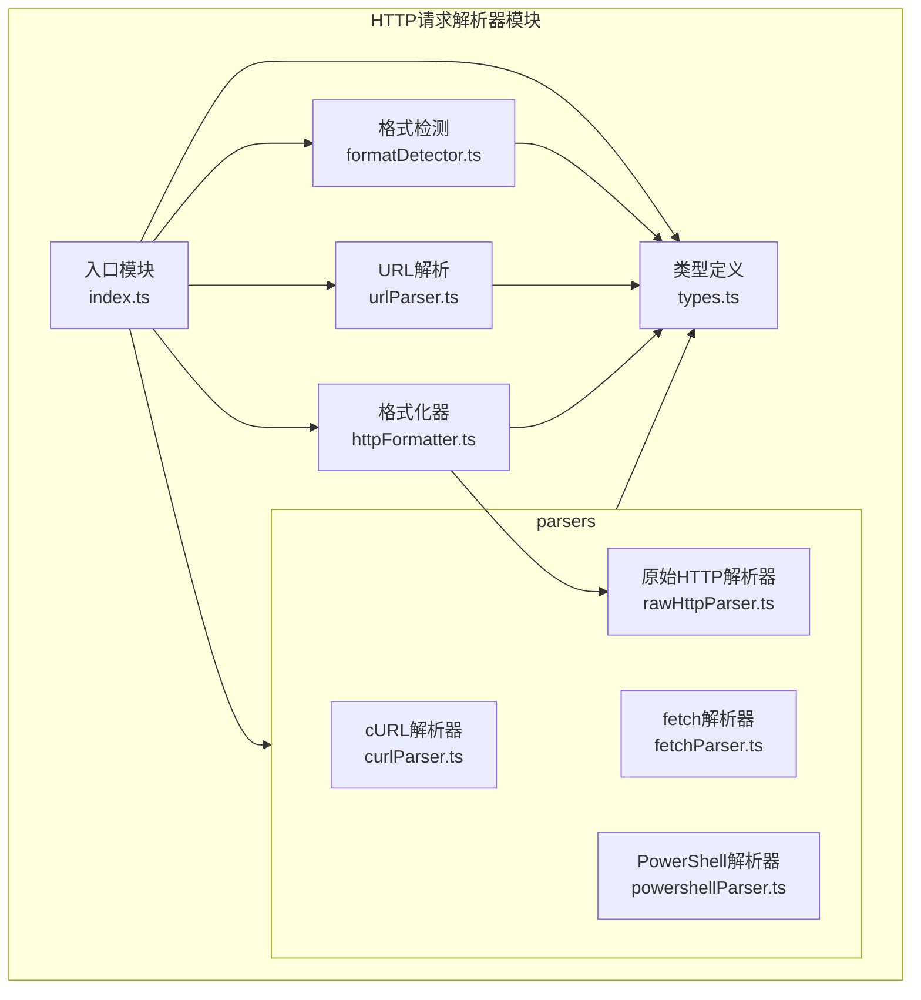

**图示来源**  
- [index.ts](file://src/frontEnd/src/utils/httpRequestParser/index.ts)
- [types.ts](file://src/frontEnd/src/utils/httpRequestParser/types.ts)
- [formatDetector.ts](file://src/frontEnd/src/utils/httpRequestParser/formatDetector.ts)
- [urlParser.ts](file://src/frontEnd/src/utils/httpRequestParser/urlParser.ts)
- [curlParser.ts](file://src/frontEnd/src/utils/httpRequestParser/parsers/curlParser.ts)
- [fetchParser.ts](file://src/frontEnd/src/utils/httpRequestParser/parsers/fetchParser.ts)
- [powershellParser.ts](file://src/frontEnd/src/utils/httpRequestParser/parsers/powershellParser.ts)
- [rawHttpParser.ts](file://src/frontEnd/src/utils/httpRequestParser/parsers/rawHttpParser.ts)
- [httpFormatter.ts](file://src/frontEnd/src/utils/httpRequestParser/formatters/httpFormatter.ts)

**章节来源**  
- [index.ts](file://src/frontEnd/src/utils/httpRequestParser/index.ts)

## 核心组件
HTTP请求解析器的核心组件包括格式检测器、多种格式解析器、URL解析工具和格式化器。这些组件协同工作，实现从多种输入格式到标准HTTP报文的转换。

**章节来源**  
- [index.ts](file://src/frontEnd/src/utils/httpRequestParser/index.ts)
- [types.ts](file://src/frontEnd/src/utils/httpRequestParser/types.ts)

## 架构概述
HTTP请求解析器采用模块化设计，通过统一的入口函数`parseHttpRequest`协调各个子模块的工作。架构分为四个主要层次：入口层、检测层、解析层和格式化层。

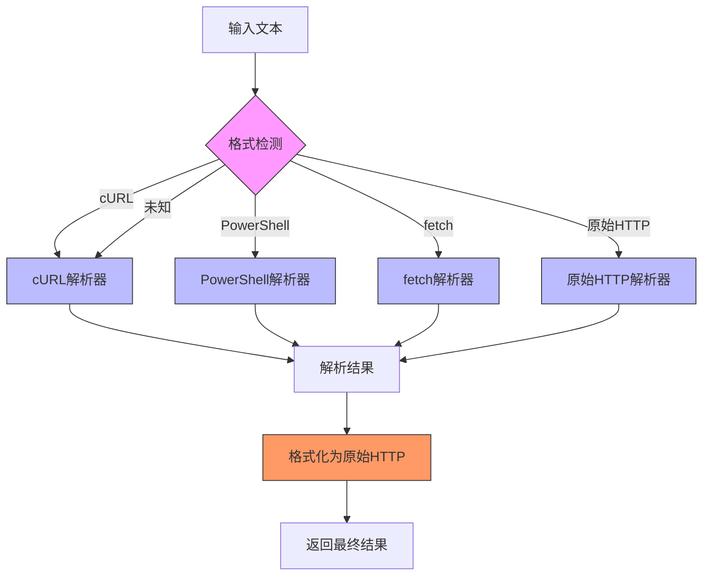

**图示来源**  
- [index.ts](file://src/frontEnd/src/utils/httpRequestParser/index.ts)
- [formatDetector.ts](file://src/frontEnd/src/utils/httpRequestParser/formatDetector.ts)
- [curlParser.ts](file://src/frontEnd/src/utils/httpRequestParser/parsers/curlParser.ts)
- [powershellParser.ts](file://src/frontEnd/src/utils/httpRequestParser/parsers/powershellParser.ts)
- [fetchParser.ts](file://src/frontEnd/src/utils/httpRequestParser/parsers/fetchParser.ts)
- [rawHttpParser.ts](file://src/frontEnd/src/utils/httpRequestParser/parsers/rawHttpParser.ts)
- [httpFormatter.ts](file://src/frontEnd/src/utils/httpRequestParser/formatters/httpFormatter.ts)

## 详细组件分析
### 主解析函数分析
主解析函数`parseHttpRequest`是整个模块的入口点，负责协调格式检测和具体解析工作。

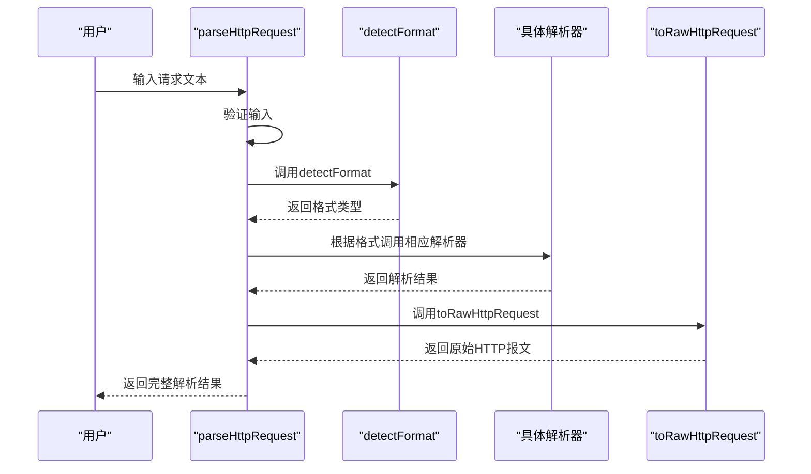

**图示来源**  
- [index.ts](file://src/frontEnd/src/utils/httpRequestParser/index.ts)
- [formatDetector.ts](file://src/frontEnd/src/utils/httpRequestParser/formatDetector.ts)
- [httpFormatter.ts](file://src/frontEnd/src/utils/httpRequestParser/formatters/httpFormatter.ts)

**章节来源**  
- [index.ts](file://src/frontEnd/src/utils/httpRequestParser/index.ts)

### 类型定义分析
类型定义模块为整个解析器提供了统一的数据结构规范。

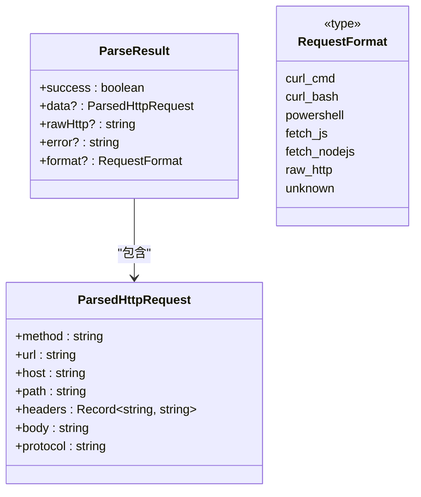

**图示来源**  
- [types.ts](file://src/frontEnd/src/utils/httpRequestParser/types.ts)

**章节来源**  
- [types.ts](file://src/frontEnd/src/utils/httpRequestParser/types.ts)

### 格式检测分析
格式检测模块通过正则表达式和特定规则识别输入文本的格式类型。

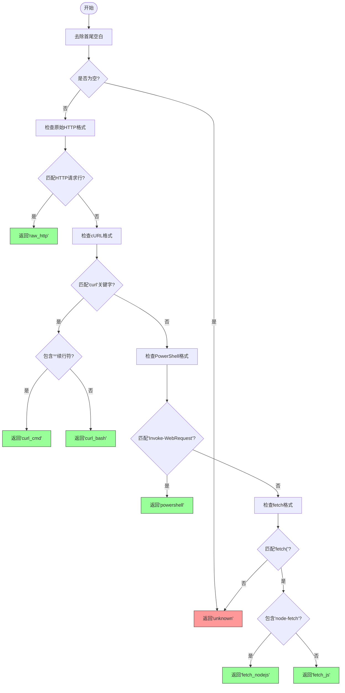

**图示来源**  
- [formatDetector.ts](file://src/frontEnd/src/utils/httpRequestParser/formatDetector.ts)

**章节来源**  
- [formatDetector.ts](file://src/frontEnd/src/utils/httpRequestParser/formatDetector.ts)

### URL解析分析
URL解析工具提供了一系列辅助函数来处理URL相关的操作。

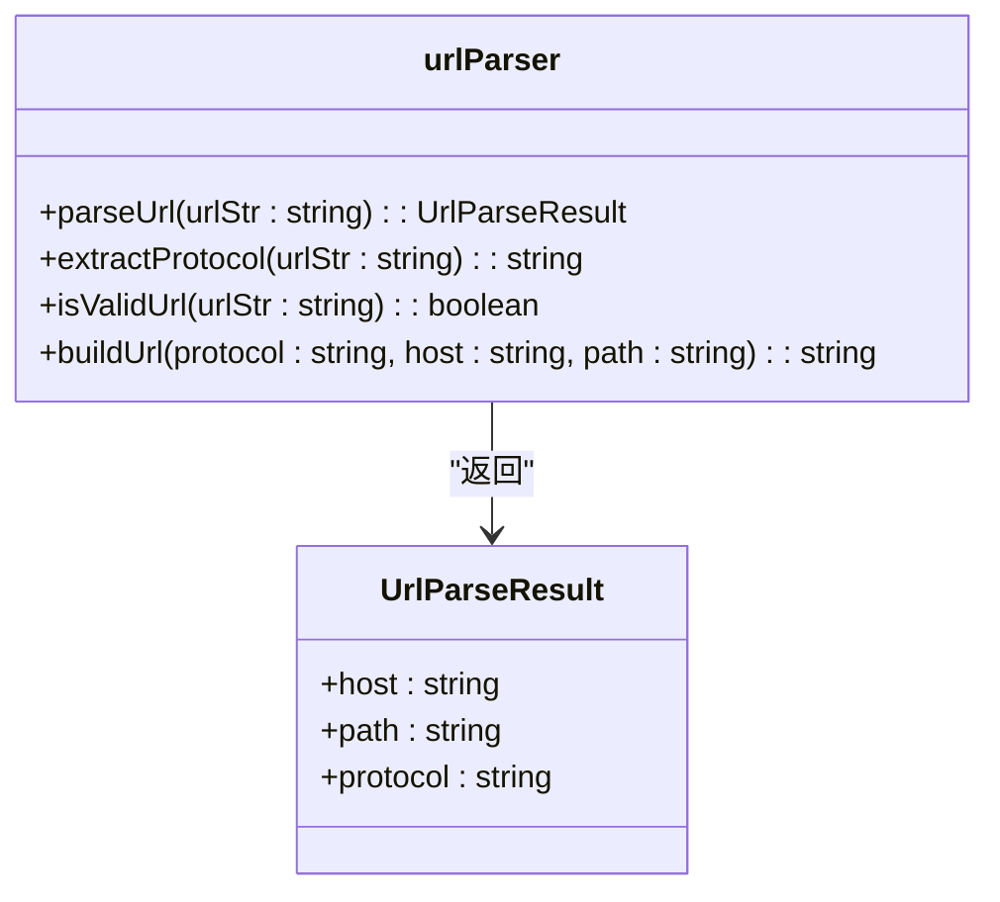

**图示来源**  
- [urlParser.ts](file://src/frontEnd/src/utils/httpRequestParser/urlParser.ts)

**章节来源**  
- [urlParser.ts](file://src/frontEnd/src/utils/httpRequestParser/urlParser.ts)

### cURL解析器分析
cURL解析器处理两种主要的cURL格式：Bash格式和Windows CMD格式。

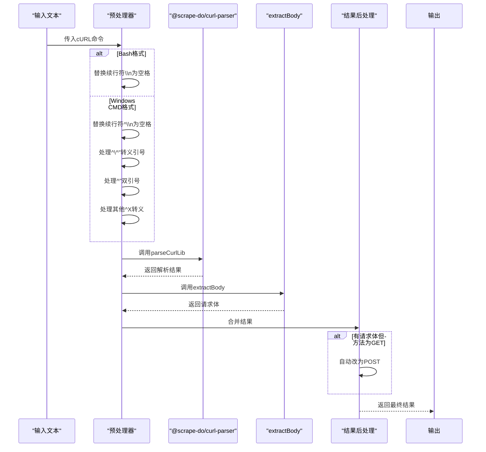

**图示来源**  
- [curlParser.ts](file://src/frontEnd/src/utils/httpRequestParser/parsers/curlParser.ts)

**章节来源**  
- [curlParser.ts](file://src/frontEnd/src/utils/httpRequestParser/parsers/curlParser.ts)

### fetch解析器分析
fetch解析器处理浏览器和Node.js环境下的fetch API调用。

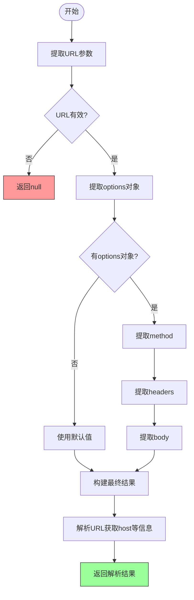

**图示来源**  
- [fetchParser.ts](file://src/frontEnd/src/utils/httpRequestParser/parsers/fetchParser.ts)

**章节来源**  
- [fetchParser.ts](file://src/frontEnd/src/utils/httpRequestParser/parsers/fetchParser.ts)

### PowerShell解析器分析
PowerShell解析器专门处理PowerShell命令中的HTTP请求。

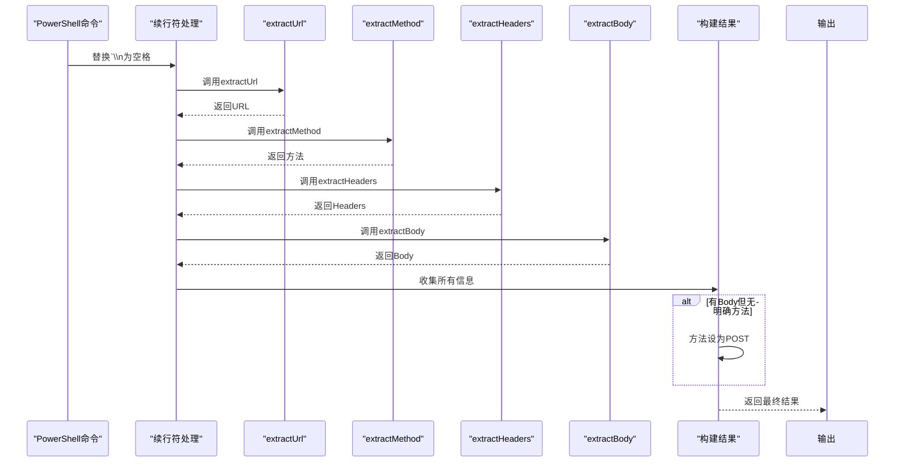

**图示来源**  
- [powershellParser.ts](file://src/frontEnd/src/utils/httpRequestParser/parsers/powershellParser.ts)

**章节来源**  
- [powershellParser.ts](file://src/frontEnd/src/utils/httpRequestParser/parsers/powershellParser.ts)

### 原始HTTP解析器分析
原始HTTP解析器处理标准的HTTP报文格式。

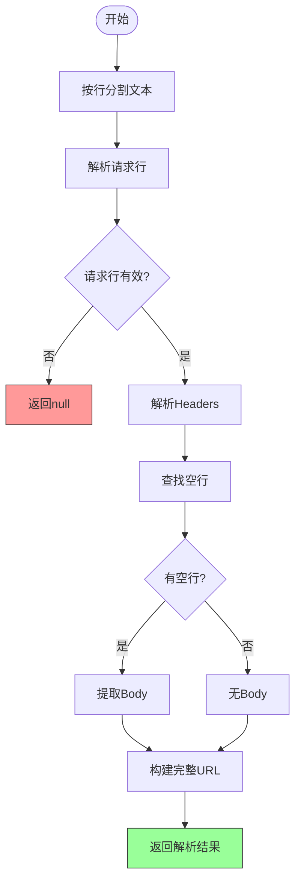

**图示来源**  
- [rawHttpParser.ts](file://src/frontEnd/src/utils/httpRequestParser/parsers/rawHttpParser.ts)

**章节来源**  
- [rawHttpParser.ts](file://src/frontEnd/src/utils/httpRequestParser/parsers/rawHttpParser.ts)

### 格式化器分析
格式化器模块负责将解析结果转换为各种输出格式。

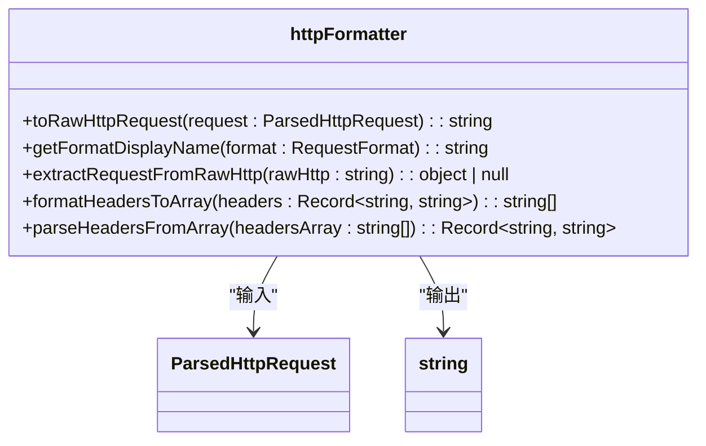

**图示来源**  
- [httpFormatter.ts](file://src/frontEnd/src/utils/httpRequestParser/formatters/httpFormatter.ts)

**章节来源**  
- [httpFormatter.ts](file://src/frontEnd/src/utils/httpRequestParser/formatters/httpFormatter.ts)

## 依赖分析
HTTP请求解析器模块的依赖关系清晰，各组件之间的耦合度较低。

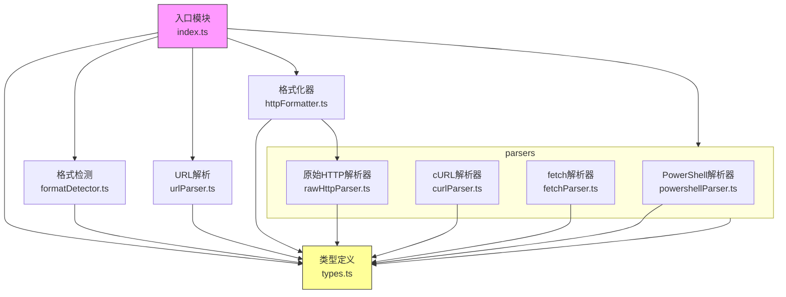

**图示来源**  
- [index.ts](file://src/frontEnd/src/utils/httpRequestParser/index.ts)
- [types.ts](file://src/frontEnd/src/utils/httpRequestParser/types.ts)
- [formatDetector.ts](file://src/frontEnd/src/utils/httpRequestParser/formatDetector.ts)
- [urlParser.ts](file://src/frontEnd/src/utils/httpRequestParser/urlParser.ts)
- [curlParser.ts](file://src/frontEnd/src/utils/httpRequestParser/parsers/curlParser.ts)
- [fetchParser.ts](file://src/frontEnd/src/utils/httpRequestParser/parsers/fetchParser.ts)
- [powershellParser.ts](file://src/frontEnd/src/utils/httpRequestParser/parsers/powershellParser.ts)
- [rawHttpParser.ts](file://src/frontEnd/src/utils/httpRequestParser/parsers/rawHttpParser.ts)
- [httpFormatter.ts](file://src/frontEnd/src/utils/httpRequestParser/formatters/httpFormatter.ts)

**章节来源**  
- [index.ts](file://src/frontEnd/src/utils/httpRequestParser/index.ts)

## 性能考虑
HTTP请求解析器在设计时考虑了性能因素，通过以下方式优化性能：
- 使用正则表达式进行快速格式检测
- 采用流式处理避免不必要的内存占用
- 对复杂的解析任务进行模块化分解
- 在可能的情况下使用原生JavaScript API（如URL）

## 故障排除指南
当HTTP请求解析失败时，可以参考以下常见问题及解决方案：
- 输入为空或格式不正确：确保输入内容不为空且符合支持的格式之一
- 特殊字符处理问题：检查输入中的引号、转义字符是否正确处理
- 复杂JSON体解析失败：确保JSON格式正确，避免嵌套引号问题
- URL解析失败：检查URL格式是否正确

**章节来源**  
- [index.ts](file://src/frontEnd/src/utils/httpRequestParser/index.ts)
- [formatDetector.ts](file://src/frontEnd/src/utils/httpRequestParser/formatDetector.ts)
- [curlParser.ts](file://src/frontEnd/src/utils/httpRequestParser/parsers/curlParser.ts)
- [fetchParser.ts](file://src/frontEnd/src/utils/httpRequestParser/parsers/fetchParser.ts)
- [powershellParser.ts](file://src/frontEnd/src/utils/httpRequestParser/parsers/powershellParser.ts)
- [rawHttpParser.ts](file://src/frontEnd/src/utils/httpRequestParser/parsers/rawHttpParser.ts)

## 结论
HTTP请求解析器是一个功能强大且设计良好的前端工具模块，能够处理多种格式的HTTP请求输入。其模块化设计使得代码易于维护和扩展，为sqlmapWebUI项目提供了重要的基础功能。