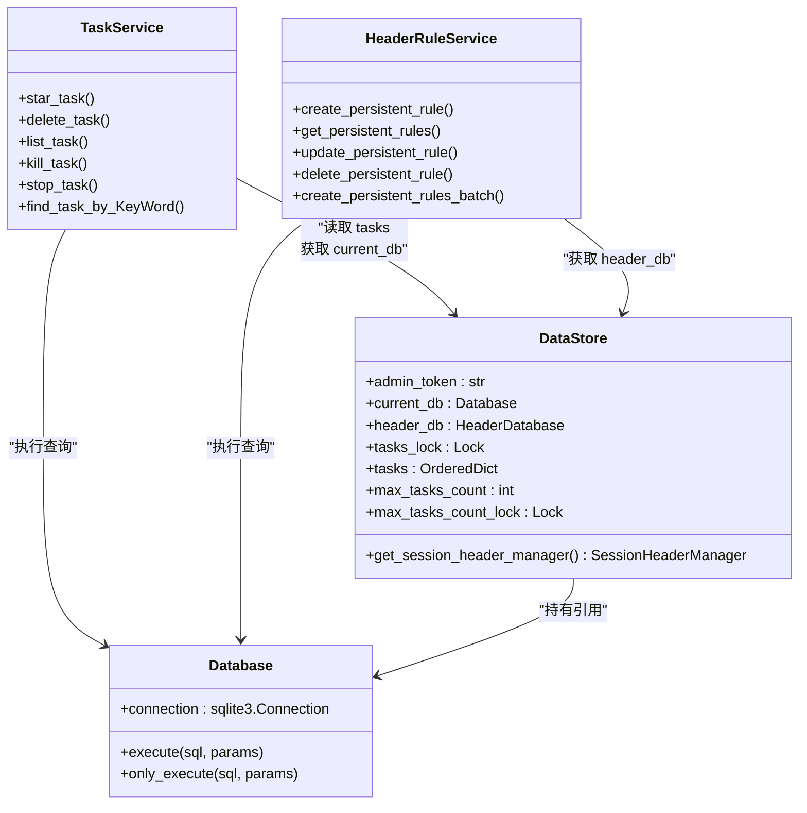
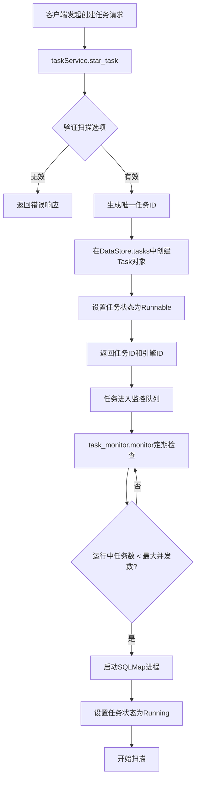
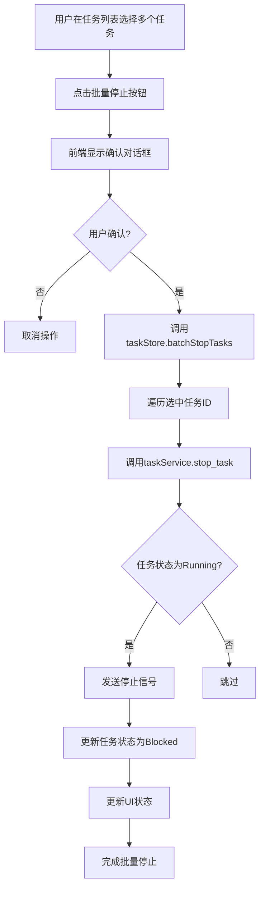
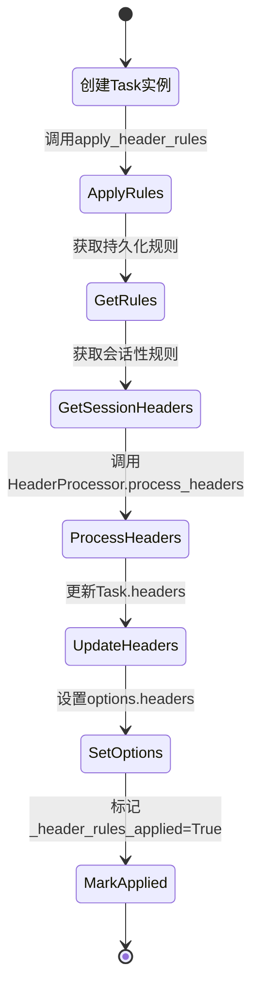

# 业务逻辑层

<cite>
**本文档引用的文件**   
- [taskService.py](file://src/backEnd/service/taskService.py)
- [headerRuleService.py](file://src/backEnd/service/headerRuleService.py)
- [task_monitor.py](file://src/backEnd/utils/task_monitor.py)
- [Task.py](file://src/backEnd/model/Task.py)
- [TaskStatus.py](file://src/backEnd/model/TaskStatus.py)
- [DataStore.py](file://src/backEnd/model/DataStore.py)
- [task.ts](file://src/backEnd/src/stores/task.ts) - *在最近提交中更新*
- [index.vue](file://src/backEnd/src/views/TaskList/index.vue) - *在最近提交中更新*
- [useSmartPolling.ts](file://src/backEnd/src/utils/useSmartPolling.ts) - *新增智能轮询功能*
</cite>

## 更新摘要
**已做更改**   
- 更新了任务管理服务部分，增加了批量停止任务功能的说明
- 新增了智能轮询策略的详细描述
- 更新了关键业务流程部分，增加了任务批量操作的流程图
- 增强了服务扩展接口部分，补充了前端交互扩展点
- 更新了所有受影响部分的源码引用信息

## 目录
1. [任务管理服务](#任务管理服务)
2. [请求头规则服务](#请求头规则服务)
3. [任务监控器](#任务监控器)
4. [服务层与数据访问层交互](#服务层与数据访问层交互)
5. [关键业务流程](#关键业务流程)
6. [异常处理与事务](#异常处理与事务)
7. [服务扩展接口](#服务扩展接口)

## 任务管理服务

`taskService.py` 实现了任务管理的核心业务逻辑，负责任务的全生命周期管理，包括创建、查询、控制和结果获取。服务通过 `TaskService` 类提供异步方法，确保在高并发场景下的性能和响应性。

任务创建流程始于 `star_task` 方法，该方法接收扫描目标URL、HTTP请求头、请求体和扫描选项等参数。在创建任务前，会调用 `validate_options` 函数对用户提供的扫描选项进行验证，检查是否存在SQLMap API不支持的参数，确保扫描任务的配置合法性。验证通过后，系统生成一个唯一的任务ID，并在 `DataStore.tasks` 有序字典中创建一个新的 `Task` 对象实例。任务状态初始化为 `New`，随后被设置为 `Runnable`，表示已准备好执行。

任务的执行控制通过 `start_task_with_taskid` 方法实现，该方法将处于 `Blocked`（已停止）状态的任务重新激活为 `Runnable` 状态。任务的停止和终止操作则分别由 `stop_task` 和 `kill_task` 方法处理。`stop_task` 方法会调用 `engine_stop`，向SQLMap进程发送终止信号，使其优雅地结束扫描并保存当前结果，同时将任务状态置为 `Blocked`。而 `kill_task` 方法则会调用 `engine_kill`，强制终止SQLMap进程，将任务状态置为 `Terminated`。

新增了批量停止任务的功能，通过 `batch_stop_tasks` 方法实现。该方法接收任务ID列表，对每个任务执行停止操作，支持前端任务列表页面的批量操作需求。此功能在 `task.ts` 的 `batchStopTasks` 方法中调用，通过API与后端服务交互。

任务查询功能提供了多种途径。`list_task` 方法返回所有任务的概要信息列表，包括任务ID、扫描URL、状态、错误日志数量和是否发现注入点等。`find_task_by_KeyWord` 方法支持通过关键词在URL路径、Host头、请求头和请求体中进行模糊搜索，返回匹配的任务列表。此外，还提供了 `find_task_log_by_taskid`、`get_payload_detail_by_task_id` 等方法，用于获取特定任务的详细日志、扫描结果和错误信息。

**更新** 增加了批量停止任务功能的说明

**Section sources**
- [taskService.py](file://src/backEnd/service/taskService.py#L57-L86)
- [taskService.py](file://src/backEnd/service/taskService.py#L192-L211)
- [taskService.py](file://src/backEnd/service/taskService.py#L177-L190)
- [taskService.py](file://src/backEnd/service/taskService.py#L101-L175)
- [taskService.py](file://src/backEnd/service/taskService.py#L268-L368)
- [taskService.py](file://src/backEnd/service/taskService.py#L392-L413)
- [task.ts](file://src/backEnd/src/stores/task.ts#L45-L67) - *批量停止任务实现*

## 请求头规则服务

`headerRuleService.py` 负责管理请求头规则，分为持久化规则和会话性规则两种类型。服务通过 `HeaderRuleService` 类提供增删改查、批量处理和优先级管理等完整功能。

持久化规则存储在数据库中，具有名称、请求头名称、请求头值、替换策略、匹配条件、优先级和启用状态等属性。`create_persistent_rule` 方法用于创建新规则，会进行数据验证，检查规则名称是否重复。`get_persistent_rules` 方法可查询所有或仅启用的规则列表，并按优先级降序排列。`update_persistent_rule` 和 `delete_persistent_rule` 方法分别用于更新和删除规则。规则的优先级决定了其应用顺序，优先级高的规则会优先被处理。

服务支持批量操作。`parse_headers_batch` 方法可以解析用户粘贴的原始文本，将其转换为结构化的请求头列表。`create_persistent_rules_batch` 和 `create_session_headers_batch` 方法则可以基于解析结果，批量创建持久化或会话性规则。会话性规则与特定的客户端IP地址绑定，具有生存时间（TTL），适用于临时性的请求头注入需求。

一个关键的业务流程是请求头规则的应用。在 `Task` 类的初始化过程中，会立即调用 `apply_header_rules` 方法。该方法会从 `DataStore` 获取当前客户端的会话性请求头和所有启用的持久化规则，然后通过 `HeaderProcessor` 对原始请求头进行处理，根据规则的配置（如替换策略）合并、修改或删除请求头，最终生成用于SQLMap扫描的最终请求头集合。

**Section sources**
- [headerRuleService.py](file://src/backEnd/service/headerRuleService.py#L74-L167)
- [headerRuleService.py](file://src/backEnd/service/headerRuleService.py#L169-L238)
- [headerRuleService.py](file://src/backEnd/service/headerRuleService.py#L302-L434)
- [headerRuleService.py](file://src/backEnd/service/headerRuleService.py#L436-L486)
- [headerRuleService.py](file://src/backEnd/service/headerRuleService.py#L572-L619)
- [headerRuleService.py](file://src/backEnd/service/headerRuleService.py#L621-L767)
- [Task.py](file://src/backEnd/model/Task.py#L19-L40)

## 任务监控器

`task_monitor.py` 模块实现了任务监控的核心逻辑，由APScheduler定期调用 `monitor` 函数，实现自动化任务调度。该监控器是系统资源管理和任务调度的关键组件。

`monitor` 函数的主要职责是根据系统资源动态调整并启动可运行的任务。首先，它会确定当前允许的最大并发任务数 `max_tasks_count`。这个值由 `get_max_tasks_count` 函数计算得出，该函数结合了计算机的逻辑CPU核心数和当前的CPU使用率。当CPU使用率低于20%时，允许的最大任务数为逻辑核心数的两倍；在20%-50%之间时，等于逻辑核心数；高于50%时，则减半以保护系统性能。

在确定了最大任务数后，监控器会遍历 `DataStore.tasks` 中的所有任务。它会统计当前正在运行（`Running`）的任务数量，并收集所有处于 `Runnable` 状态的任务。如果当前运行的任务数小于最大允许数，监控器就会从 `Runnable` 任务列表中选取任务，调用其 `engine_start` 方法来启动SQLMap扫描进程，并将任务状态更新为 `Running`。这个过程实现了任务的排队和按需启动，有效防止了因并发任务过多而导致的系统资源耗尽。

```mermaid
sequenceDiagram
participant Scheduler as APScheduler
participant Monitor as task_monitor.monitor()
participant DataStore as DataStore
participant Task as Task
Scheduler->>Monitor : 定期触发
Monitor->>DataStore : 获取 max_tasks_count (基于CPU)
Monitor->>DataStore : 遍历所有任务
loop 检查每个任务
Monitor->>Task : 查询状态
alt 状态为 Running
Monitor->>Monitor : running_task_cnt++
else 状态为 Runnable
Monitor->>Monitor : 加入 runnable_list
end
end
Monitor->>Monitor : 计算可用槽位
loop 启动可运行任务
Monitor->>Task : engine_start()
Monitor->>Task : 状态置为 Running
Monitor->>Monitor : running_task_cnt++
alt 达到 max_tasks_count
break
end
end
```

**Diagram sources**
- [task_monitor.py](file://src/backEnd/utils/task_monitor.py#L35-L92)
- [DataStore.py](file://src/backEnd/model/DataStore.py#L13-L13)
- [Task.py](file://src/backEnd/model/Task.py#L138-L169)

**Section sources**
- [task_monitor.py](file://src/backEnd/utils/task_monitor.py#L10-L32)
- [task_monitor.py](file://src/backEnd/utils/task_monitor.py#L35-L92)

## 服务层与数据访问层交互

服务层与数据访问层的交互主要通过 `DataStore` 全局对象和 `Database` 类来实现。`DataStore` 作为一个中央数据存储，持有对主数据库 (`current_db`) 和请求头数据库 (`header_db`) 的连接引用，以及所有任务 (`tasks`) 的内存缓存。

`taskService` 和 `headerRuleService` 在执行数据库操作时，会通过 `DataStore.current_db` 或 `DataStore.header_db` 获取数据库连接，然后调用其 `execute` 或 `only_execute` 方法来执行SQL查询。例如，在 `list_task` 方法中，服务会查询 `errors`、`logs` 和 `data` 表来获取每个任务的详细统计信息。这种设计将数据库连接的管理与业务逻辑分离，提高了代码的内聚性。

对于任务状态的管理，服务层直接操作存储在内存中的 `Task` 对象。`DataStore.tasks` 是一个线程安全的 `OrderedDict`，通过 `tasks_lock` 互斥锁来保证多线程环境下的数据一致性。当服务需要修改任务状态（如启动、停止）时，会先获取锁，然后直接修改 `Task` 对象的 `status` 属性。这种内存操作避免了频繁的数据库读写，极大地提升了性能。



**Diagram sources**
- [DataStore.py](file://src/backEnd/model/DataStore.py#L9-L18)
- [taskService.py](file://src/backEnd/service/taskService.py#L101-L175)
- [headerRuleService.py](file://src/backEnd/service/headerRuleService.py#L74-L167)

**Section sources**
- [DataStore.py](file://src/backEnd/model/DataStore.py#L9-L18)
- [taskService.py](file://src/backEnd/service/taskService.py#L101-L175)
- [headerRuleService.py](file://src/backEnd/service/headerRuleService.py#L74-L167)

## 关键业务流程

### 任务创建与启动流程


### 任务批量停止流程


### 请求头规则应用流程


**更新** 增加了任务批量停止流程图

**Diagram sources**
- [taskService.py](file://src/backEnd/service/taskService.py#L57-L86)
- [task_monitor.py](file://src/backEnd/utils/task_monitor.py#L35-L92)
- [Task.py](file://src/backEnd/model/Task.py#L19-L40)
- [task.ts](file://src/backEnd/src/stores/task.ts#L45-L67) - *批量操作逻辑*
- [index.vue](file://src/backEnd/src/views/TaskList/index.vue#L15-L40) - *批量停止UI实现*

## 异常处理与事务

系统在多个层面实施了异常处理和业务规则验证。在 `taskService` 中，所有公共方法都使用 `try-catch` 块包裹，捕获 `Exception` 并返回结构化的 `BaseResponseMsg` 响应，确保API的稳定性。例如，在 `list_task` 方法中，如果数据库连接未初始化，会返回500错误。

在 `headerRuleService` 中，异常处理更为精细。`create_persistent_rule` 方法在创建规则前会进行多项验证：检查数据库连接、验证规则数据格式（如请求头名称）、检查规则名称是否重复。这些验证构成了业务规则的守卫，防止无效数据进入系统。对于数据库操作，虽然没有显式的事务管理（如BEGIN/COMMIT），但通过单条SQL语句的执行，保证了原子性。例如，创建规则的 `INSERT` 语句要么成功，要么失败，不会出现部分写入的情况。

事务边界主要体现在服务方法的粒度上。每个服务方法（如 `create_persistent_rule`、`delete_task`）都代表一个独立的业务操作单元。这些方法内部的数据库操作和状态变更被视为一个整体，成功则全部完成，失败则通过异常回滚（在内存状态的情况下，通过不修改状态来实现）。

**Section sources**
- [taskService.py](file://src/backEnd/service/taskService.py#L101-L175)
- [headerRuleService.py](file://src/backEnd/service/headerRuleService.py#L74-L167)
- [headerRuleService.py](file://src/backEnd/service/headerRuleService.py#L44-L55)

## 服务扩展接口

开发者可以通过继承和扩展现有服务来实现自定义业务逻辑。主要的扩展点包括：

1.  **自定义请求头处理器**：可以创建新的 `HeaderProcessor` 子类，重写 `process_headers` 方法，实现更复杂的请求头处理逻辑，如基于正则表达式的动态替换。
2.  **扩展任务类型**：可以创建新的 `Task` 子类，重写 `engine_start` 方法，以支持除SQLMap之外的其他安全扫描引擎。
3.  **添加新的监控策略**：可以在 `task_monitor.py` 中添加新的函数，例如基于内存使用率或网络I/O的监控策略，并将其集成到 `monitor` 函数中。
4.  **实现新的规则类型**：可以在 `headerRuleService` 中添加新的规则模型和处理逻辑，例如支持基于时间或地理位置的条件性规则。
5.  **前端交互扩展**：可以通过 `useSmartPolling.ts` 中的智能轮询策略进行扩展，根据任务状态和页面可见性动态调整轮询频率，优化用户体验。

**更新** 补充了前端交互扩展点

**Section sources**
- [Task.py](file://src/backEnd/model/Task.py#L138-L169)
- [headerRuleService.py](file://src/backEnd/service/headerRuleService.py#L534-L566)
- [task_monitor.py](file://src/backEnd/utils/task_monitor.py#L35-L92)
- [useSmartPolling.ts](file://src/backEnd/src/utils/useSmartPolling.ts#L10-L35) - *智能轮询策略实现*