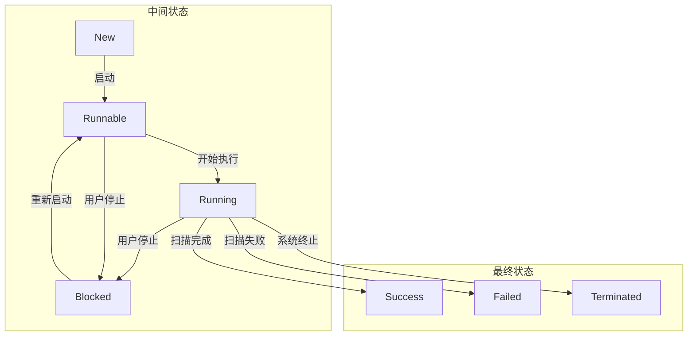

# 任务列表列增强

<cite>
**本文档引用的文件**   
- [TaskList/index.vue](file://src/frontEnd/src/views/TaskList/index.vue)
- [task.ts](file://src/frontEnd/src/stores/task.ts)
- [task.py](file://src/frontEnd/src/types/task.ts)
- [taskService.py](file://src/backEnd/service/taskService.py)
- [Task.py](file://src/backEnd/model/Task.py)
- [app.py](file://src/backEnd/app.py)
</cite>

## 目录
1. [项目概述](#项目概述)
2. [任务列表功能分析](#任务列表功能分析)
3. [核心组件分析](#核心组件分析)
4. [数据结构与模型](#数据结构与模型)
5. [API接口分析](#api接口分析)
6. [状态管理机制](#状态管理机制)
7. [用户交互设计](#用户交互设计)
8. [性能优化策略](#性能优化策略)
9. [结论与建议](#结论与建议)

## 项目概述

本项目是一个现代化的SQLMap Web界面，为安全研究人员提供便捷的SQL注入测试平台。系统采用前后端分离架构，前端使用Vue 3和TypeScript构建，后端基于FastAPI框架。核心功能包括任务管理、实时日志查看、扫描结果展示、HTTP请求查看、批量操作以及扩展集成等。

系统通过Chrome扩展和Burp Suite插件实现与浏览器的集成，允许用户直接将拦截的请求发送到扫描平台。前端采用PrimeVue作为UI组件库，提供现代化的用户界面体验。后端集成了SQLMap工具，通过API方式调用其功能，实现了对SQL注入测试的全面控制。

**Section sources**
- [README.md](file://README.md)

## 任务列表功能分析

任务列表是系统的核心功能模块，提供了对所有扫描任务的集中管理和监控。该功能主要包含以下几个方面：

1. **任务展示**：以表格形式展示所有任务的基本信息，包括任务ID、扫描URL、主机、注入状态、执行状态、创建时间、开始执行时间、错误数和日志数等关键列。

2. **筛选与过滤**：提供多维度的筛选功能，用户可以根据URL关键字、报文关键字、任务状态、注入状态以及时间范围等条件进行过滤。

3. **排序功能**：支持对各个列进行升序或降序排序，帮助用户快速定位关注的任务。

4. **批量操作**：支持批量停止、批量删除和删除全部任务等操作，提高管理效率。

5. **实时监控**：通过轮询机制实时更新任务状态，确保用户能够及时了解任务的最新进展。

6. **统计汇总**：在表格底部提供任务状态和注入状态的统计信息，帮助用户快速掌握整体情况。


**Diagram sources**
- [TaskList/index.vue](file://src/frontEnd/src/views/TaskList/index.vue)

**Section sources**
- [TaskList/index.vue](file://src/frontEnd/src/views/TaskList/index.vue)

## 核心组件分析

### 任务列表组件

任务列表组件（TaskList）是前端的核心界面，负责展示和管理所有扫描任务。该组件采用了PrimeVue的DataTable组件，提供了丰富的表格功能。


**Diagram sources**
- [TaskList/index.vue](file://src/frontEnd/src/views/TaskList/index.vue)
- [task.ts](file://src/frontEnd/src/stores/task.ts)

### 任务服务组件

任务服务组件（TaskService）是后端的核心业务逻辑层，负责处理所有与任务相关的操作。


**Diagram sources**
- [taskService.py](file://src/backEnd/service/taskService.py)
- [Task.py](file://src/backEnd/model/Task.py)

**Section sources**
- [TaskList/index.vue](file://src/frontEnd/src/views/TaskList/index.vue)
- [task.ts](file://src/frontEnd/src/stores/task.ts)
- [taskService.py](file://src/backEnd/service/taskService.py)
- [Task.py](file://src/backEnd/model/Task.py)

## 数据结构与模型

### 任务数据模型

任务数据模型定义了任务的核心属性和状态。前端和后端使用不同的字段名，通过转换函数进行映射。


**Diagram sources**
- [task.py](file://src/frontEnd/src/types/task.ts)
- [Task.py](file://src/backEnd/model/Task.py)

### 任务状态枚举

任务状态枚举定义了任务的生命周期状态，从创建到完成的各个阶段。


**Diagram sources**
- [task.py](file://src/frontEnd/src/types/task.ts)
- [Task.py](file://src/backEnd/model/Task.py)

**Section sources**
- [task.py](file://src/frontEnd/src/types/task.ts)
- [Task.py](file://src/backEnd/model/Task.py)

## API接口分析

### 前端API定义

前端通过API模块与后端进行通信，封装了所有任务相关的HTTP请求。


**Diagram sources**
- [task.ts](file://src/frontEnd/src/api/task.ts)

### 后端API路由

后端通过FastAPI定义了任务管理的API路由，处理来自前端和扩展的请求。

```mermaid
graph TD
A[API路由] --> B[/chrome/admin/task/add]
A --> C[/chrome/admin/task/delete]
A --> D[/chrome/admin/task/list]
A --> E[/chrome/admin/task/stop]
A --> F[/chrome/admin/task/flush]
A --> G[/chrome/admin/task/findByUrlPath]
A --> H[/chrome/admin/task/logs/getLogsByTaskId]
A --> I[/chrome/admin/task/getPayloadDetailByTaskId]
A --> J[/chrome/admin/task/getTaskHttpRequestInfoByTaskId]
B --> K[taskService.star_task]
C --> L[taskService.delete_task]
D --> M[taskService.list_task]
E --> N[taskService.stop_task]
F --> O[taskService.flush_task]
G --> P[taskService.find_task_by_urlPath]
H --> Q[taskService.find_task_log_by_taskid]
I --> R[taskService.get_payload_detail_by_task_id]
J --> S[taskService.get_task_http_request_info]
```

**Diagram sources**
- [admin.py](file://src/backEnd/api/chromeExApi/admin.py)
- [taskService.py](file://src/backEnd/service/taskService.py)

**Section sources**
- [task.ts](file://src/frontEnd/src/api/task.ts)
- [admin.py](file://src/backEnd/api/chromeExApi/admin.py)

## 状态管理机制

### Pinia状态管理

系统使用Pinia作为状态管理工具，集中管理任务相关的状态数据。


**Diagram sources**
- [task.ts](file://src/frontEnd/src/stores/task.ts)

### 状态流转逻辑

任务状态的流转遵循特定的业务规则，确保状态转换的正确性。



**Diagram sources**
- [Task.py](file://src/backEnd/model/Task.py)
- [taskService.py](file://src/backEnd/service/taskService.py)

**Section sources**
- [task.ts](file://src/frontEnd/src/stores/task.ts)
- [Task.py](file://src/backEnd/model/Task.py)

## 用户交互设计

### 任务列表交互流程

任务列表的用户交互设计注重效率和易用性，提供了流畅的操作体验。


**Diagram sources**
- [TaskList/index.vue](file://src/frontEnd/src/views/TaskList/index.vue)
- [task.ts](file://src/frontEnd/src/stores/task.ts)

### 轮询机制设计

系统实现了智能轮询机制，根据任务状态自动调整轮询策略。


**Diagram sources**
- [TaskList/index.vue](file://src/frontEnd/src/views/TaskList/index.vue)

**Section sources**
- [TaskList/index.vue](file://src/frontEnd/src/views/TaskList/index.vue)

## 性能优化策略

### 前端性能优化

前端通过多种策略优化任务列表的性能表现：

1. **虚拟滚动**：对于大量任务的场景，使用虚拟滚动技术只渲染可视区域的内容。

2. **防抖处理**：对筛选输入框进行防抖处理，避免频繁触发过滤操作。

3. **计算属性缓存**：利用Vue的计算属性缓存机制，避免重复计算。

4. **懒加载**：对任务详情等非关键信息进行懒加载。

5. **智能轮询**：根据任务状态动态调整轮询频率，减少不必要的网络请求。


**Diagram sources**
- [TaskList/index.vue](file://src/frontEnd/src/views/TaskList/index.vue)
- [task.ts](file://src/frontEnd/src/stores/task.ts)

### 后端性能优化

后端通过以下方式优化任务管理的性能：

1. **线程锁保护**：使用线程锁保护共享数据，确保多线程环境下的数据一致性。

2. **数据库查询优化**：对频繁查询的字段建立索引，优化SQL查询性能。

3. **批量操作**：支持批量任务操作，减少数据库交互次数。

4. **内存缓存**：将常用数据缓存在内存中，减少数据库访问。

5. **异步处理**：使用异步API处理耗时操作，提高响应速度。


**Diagram sources**
- [taskService.py](file://src/backEnd/service/taskService.py)
- [DataStore.py](file://src/backEnd/model/DataStore.py)

**Section sources**
- [taskService.py](file://src/backEnd/service/taskService.py)

## 结论与建议

通过对任务列表功能的全面分析，我们可以得出以下结论：

1. **架构设计合理**：系统采用前后端分离架构，职责清晰，便于维护和扩展。

2. **功能完整**：任务列表提供了完整的任务管理功能，满足了用户的基本需求。

3. **用户体验良好**：通过筛选、排序、批量操作等功能，提升了用户的操作效率。

4. **性能表现优秀**：通过智能轮询、计算属性缓存等技术，保证了系统的响应速度。

建议未来可以从以下几个方面进行改进：

1. **增加更多筛选条件**：可以增加更多维度的筛选条件，如扫描级别、风险级别等。

2. **优化大数据量表现**：对于超大规模任务列表，可以进一步优化虚拟滚动和分页策略。

3. **增强可视化分析**：可以增加图表形式的统计分析，帮助用户更好地理解任务分布。

4. **完善导出功能**：提供任务数据导出功能，方便用户进行离线分析。

5. **增强搜索功能**：实现全文搜索功能，支持跨字段搜索任务信息。