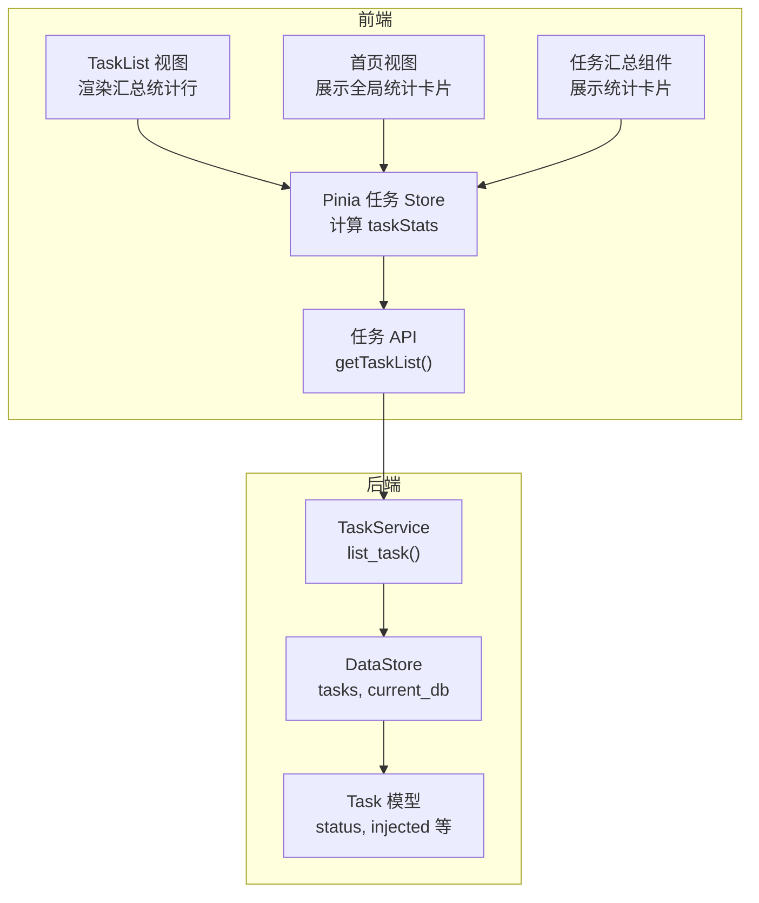
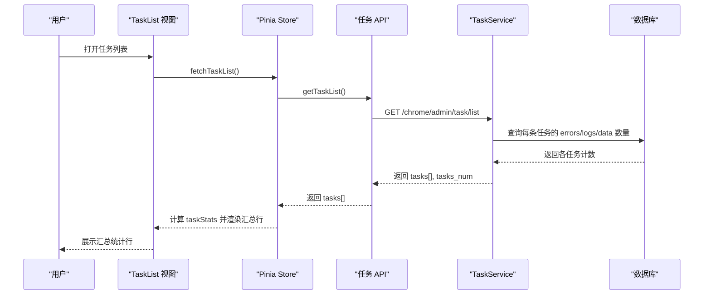
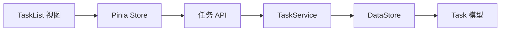

# 任务列表汇总统计行

<cite>
**本文引用的文件**
- [src/frontEnd/src/views/TaskList/index.vue](file://src/frontEnd/src/views/TaskList/index.vue)
- [src/frontEnd/src/stores/task.ts](file://src/frontEnd/src/stores/task.ts)
- [src/frontEnd/src/types/task.ts](file://src/frontEnd/src/types/task.ts)
- [src/backEnd/service/taskService.py](file://src/backEnd/service/taskService.py)
- [src/backEnd/model/Task.py](file://src/backEnd/model/Task.py)
- [src/backEnd/model/TaskStatus.py](file://src/backEnd/model/TaskStatus.py)
- [src/backEnd/model/DataStore.py](file://src/backEnd/model/DataStore.py)
- [src/frontEnd/src/api/task.ts](file://src/frontEnd/src/api/task.ts)
- [src/frontEnd/src/views/Home/index.vue](file://src/frontEnd/src/views/Home/index.vue)
- [src/frontEnd/src/components/TaskSummary.vue](file://src/frontEnd/src/components/TaskSummary.vue)
</cite>

## 目录
1. [简介](#简介)
2. [项目结构](#项目结构)
3. [核心组件](#核心组件)
4. [架构总览](#架构总览)
5. [详细组件分析](#详细组件分析)
6. [依赖关系分析](#依赖关系分析)
7. [性能考量](#性能考量)
8. [故障排查指南](#故障排查指南)
9. [结论](#结论)
10. [附录](#附录)

## 简介
本文件聚焦于“任务列表汇总统计行”的实现与交互流程，解释前端如何在表格底部渲染汇总统计、如何计算并展示“存在注入/无注入/未知”以及“运行中/已完成/失败/已停止/已终止/等待中”等状态统计，并说明这些统计值的来源与更新机制。同时给出后端任务列表接口如何提供统计所需数据的说明，帮助读者快速理解从前端到后端的完整链路。

## 项目结构
- 前端采用 Vue 3 + Pinia，通过 Store 计算任务统计；列表页通过 PrimeVue 的 DataTable 渲染并添加汇总行。
- 后端基于 FastAPI 提供任务列表接口，返回每条任务的错误数、日志数、注入标记等，前端据此计算汇总统计。

图表来源
- [src/frontEnd/src/views/TaskList/index.vue](file://src/frontEnd/src/views/TaskList/index.vue#L124-L190)
- [src/frontEnd/src/stores/task.ts](file://src/frontEnd/src/stores/task.ts#L129-L177)
- [src/frontEnd/src/api/task.ts](file://src/frontEnd/src/api/task.ts#L30-L42)
- [src/backEnd/service/taskService.py](file://src/backEnd/service/taskService.py#L102-L177)
- [src/backEnd/model/DataStore.py](file://src/backEnd/model/DataStore.py#L8-L34)
- [src/backEnd/model/Task.py](file://src/backEnd/model/Task.py#L1-L207)
- [src/frontEnd/src/views/Home/index.vue](file://src/frontEnd/src/views/Home/index.vue#L21-L170)
- [src/frontEnd/src/components/TaskSummary.vue](file://src/frontEnd/src/components/TaskSummary.vue#L1-L127)

章节来源
- [src/frontEnd/src/views/TaskList/index.vue](file://src/frontEnd/src/views/TaskList/index.vue#L124-L190)
- [src/frontEnd/src/stores/task.ts](file://src/frontEnd/src/stores/task.ts#L129-L177)
- [src/backEnd/service/taskService.py](file://src/backEnd/service/taskService.py#L102-L177)

## 核心组件
- 前端任务列表页：在 DataTable 底部使用 ColumnGroup 定义汇总行，展示“任务总数”“注入统计”“状态统计”等。
- Pinia 任务 Store：定义 taskStats 计算属性，按任务状态与注入标记进行聚合统计。
- 后端任务服务：list_task() 查询数据库，统计每条任务的错误数、日志数、数据条数，并根据任务状态与引擎终止状态推导最终状态，返回包含统计字段的列表。

章节来源
- [src/frontEnd/src/views/TaskList/index.vue](file://src/frontEnd/src/views/TaskList/index.vue#L124-L190)
- [src/frontEnd/src/stores/task.ts](file://src/frontEnd/src/stores/task.ts#L129-L177)
- [src/backEnd/service/taskService.py](file://src/backEnd/service/taskService.py#L102-L177)

## 架构总览
从前端到后端的任务列表与汇总统计流程如下：

图表来源
- [src/frontEnd/src/views/TaskList/index.vue](file://src/frontEnd/src/views/TaskList/index.vue#L124-L190)
- [src/frontEnd/src/stores/task.ts](file://src/frontEnd/src/stores/task.ts#L29-L41)
- [src/frontEnd/src/api/task.ts](file://src/frontEnd/src/api/task.ts#L30-L42)
- [src/backEnd/service/taskService.py](file://src/backEnd/service/taskService.py#L102-L177)

## 详细组件分析

### 前端汇总统计行实现
- 汇总行位置：使用 ColumnGroup 定义表格底部汇总行，包含“任务总数”“注入统计”“状态统计”三列区域。
- 注入统计：展示“存在注入/无注入/未知”，点击“更多”按钮弹出 Popover 查看完整统计。
- 状态统计：展示“等待中/运行中/已完成/失败/已停止/已终止”，点击“更多”按钮弹出 Popover 查看完整统计。
- 数据来源：由 Store 的 taskStats 计算属性提供，该属性遍历 taskList，按状态与注入标记累加计数。

章节来源
- [src/frontEnd/src/views/TaskList/index.vue](file://src/frontEnd/src/views/TaskList/index.vue#L124-L190)
- [src/frontEnd/src/stores/task.ts](file://src/frontEnd/src/stores/task.ts#L129-L177)

### Store 中的统计计算逻辑
- 总任务数：直接等于 taskList.length。
- 状态统计：对每个任务的状态进行分类计数（等待中、运行中、已完成、失败、已停止、已终止）。
- 注入统计：对每个任务的 injected 字段进行分类计数（存在注入、无注入、未知）。
- 计算方式：使用 computed 计算属性，当 taskList 变化时自动重新计算。

章节来源
- [src/frontEnd/src/stores/task.ts](file://src/frontEnd/src/stores/task.ts#L129-L177)
- [src/frontEnd/src/types/task.ts](file://src/frontEnd/src/types/task.ts#L21-L61)

### 后端任务列表接口与统计字段
- 接口：GET /chrome/admin/task/list
- 返回结构：包含 tasks[] 和 tasks_num。每条任务包含 index、start_datetime、task_id、scanUrl、errors、logs、status、injected 等字段。
- 统计字段来源：
  - errors：来自 errors 表按 taskid 计数。
  - logs：来自 logs 表按 taskid 计数。
  - data：来自 data 表按 taskid 计数，用于判断 injected（当 data_count > 0 时视为存在注入）。
  - status：对于非 New/Runnable/Blocked 的任务，根据引擎是否终止推导为 Running 或 Terminated。

章节来源
- [src/backEnd/service/taskService.py](file://src/backEnd/service/taskService.py#L102-L177)

### 任务状态与注入标记的映射
- 状态映射：
  - New/Runnable/Blocked：直接使用任务对象的 status 值。
  - 其他状态：若引擎已终止则为 Terminated，否则为 Running。
- 注入标记：
  - 当 data_count > 0 时，injected 为 true；否则为 false 或 undefined。

章节来源
- [src/backEnd/service/taskService.py](file://src/backEnd/service/taskService.py#L146-L167)
- [src/backEnd/model/Task.py](file://src/backEnd/model/Task.py#L1-L207)
- [src/backEnd/model/TaskStatus.py](file://src/backEnd/model/TaskStatus.py#L1-L9)

### 前端首页与组件中的统计展示
- 首页视图：提供“任务状态统计”和“注入结果统计”的卡片式展示，便于全局概览。
- 任务汇总组件：提供独立的统计卡片布局，复用相同的统计逻辑。

章节来源
- [src/frontEnd/src/views/Home/index.vue](file://src/frontEnd/src/views/Home/index.vue#L21-L170)
- [src/frontEnd/src/components/TaskSummary.vue](file://src/frontEnd/src/components/TaskSummary.vue#L1-L127)

## 依赖关系分析
- 前端依赖关系：
  - TaskList 视图依赖 Store 的 taskStats。
  - Store 依赖 API 的 getTaskList 返回的任务列表。
  - API 依赖后端接口返回 tasks[]。
- 后端依赖关系：
  - TaskService.list_task() 依赖 DataStore.tasks 与 current_db。
  - TaskService 依赖 Task 模型的状态与注入标记逻辑。

图表来源
- [src/frontEnd/src/views/TaskList/index.vue](file://src/frontEnd/src/views/TaskList/index.vue#L124-L190)
- [src/frontEnd/src/stores/task.ts](file://src/frontEnd/src/stores/task.ts#L29-L41)
- [src/frontEnd/src/api/task.ts](file://src/frontEnd/src/api/task.ts#L30-L42)
- [src/backEnd/service/taskService.py](file://src/backEnd/service/taskService.py#L102-L177)
- [src/backEnd/model/DataStore.py](file://src/backEnd/model/DataStore.py#L8-L34)
- [src/backEnd/model/Task.py](file://src/backEnd/model/Task.py#L1-L207)

章节来源
- [src/frontEnd/src/stores/task.ts](file://src/frontEnd/src/stores/task.ts#L29-L41)
- [src/backEnd/service/taskService.py](file://src/backEnd/service/taskService.py#L102-L177)
- [src/backEnd/model/DataStore.py](file://src/backEnd/model/DataStore.py#L8-L34)

## 性能考量
- 前端计算：taskStats 使用 computed，仅在 taskList 变更时重新计算，避免重复遍历。
- 列表刷新：TaskList 支持轮询刷新，但仅在存在运行中任务且页面可见时启动轮询，减少不必要的请求。
- 后端查询：list_task() 对每条任务分别执行三次计数查询，建议在数据库层面优化索引或合并查询以降低延迟。

章节来源
- [src/frontEnd/src/views/TaskList/index.vue](file://src/frontEnd/src/views/TaskList/index.vue#L238-L319)
- [src/backEnd/service/taskService.py](file://src/backEnd/service/taskService.py#L114-L145)

## 故障排查指南
- 汇总统计不更新：
  - 确认 Store 的 fetchTaskList 已被调用且返回了 tasks[]。
  - 检查 API 返回的 tasks[] 是否包含 errors、logs、injected、status 等字段。
- 状态显示异常：
  - 若任务处于非 New/Runnable/Blocked，需确认 Task.engine_has_terminated() 的返回值是否正确。
- 注入标记异常：
  - 确认 data 表中是否存在对应 taskid 的记录，以及 injected 的计算逻辑是否符合预期。
- 数据库连接问题：
  - 若返回“数据库未初始化”，需检查 DataStore.current_db 的初始化状态。

章节来源
- [src/frontEnd/src/stores/task.ts](file://src/frontEnd/src/stores/task.ts#L29-L41)
- [src/backEnd/service/taskService.py](file://src/backEnd/service/taskService.py#L112-L113)
- [src/backEnd/model/Task.py](file://src/backEnd/model/Task.py#L1-L207)

## 结论
“任务列表汇总统计行”由前端 Store 计算并渲染，数据来源于后端任务列表接口返回的每条任务的错误数、日志数、数据条数与状态信息。通过 ColumnGroup 的汇总行设计，用户可以在列表底部直观看到注入与状态的聚合统计，并通过 Popover 查看更完整的统计明细。整体流程清晰、职责分离明确，具备良好的扩展性与可维护性。

## 附录
- 关键字段说明：
  - errors：错误计数（来自 errors 表按 taskid 计数）
  - logs：日志计数（来自 logs 表按 taskid 计数）
  - injected：是否存在注入（来自 data 表按 taskid 计数，>0 为存在注入）
  - status：任务状态（根据 TaskStatus 与引擎终止状态推导）

章节来源
- [src/backEnd/service/taskService.py](file://src/backEnd/service/taskService.py#L114-L167)
- [src/frontEnd/src/types/task.ts](file://src/frontEnd/src/types/task.ts#L21-L61)