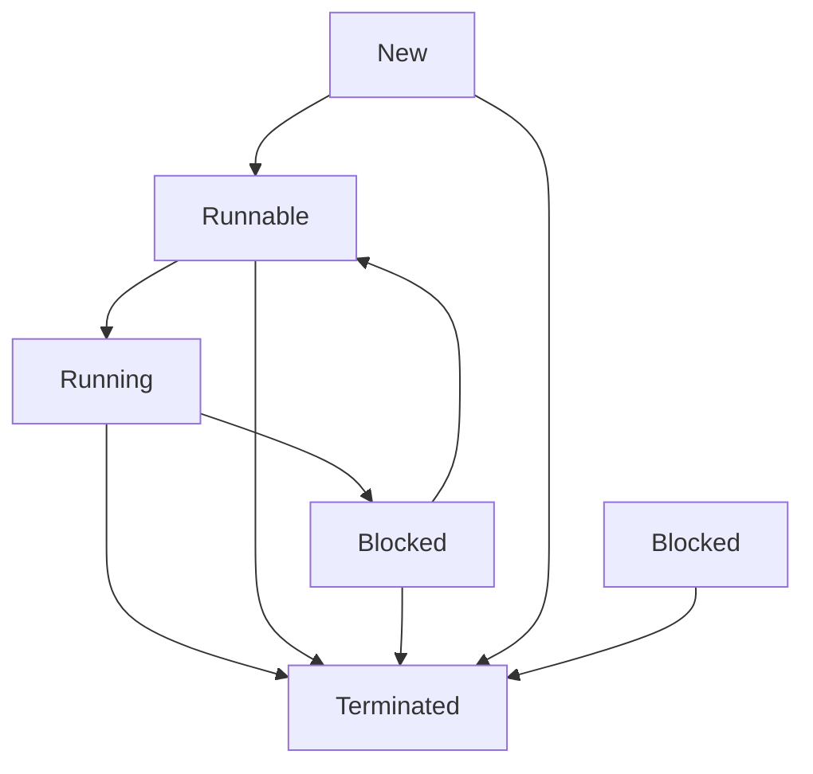

# 任务状态机设计

<cite>
**本文档引用的文件**
- [TaskStatus.py](file://src/backEnd/model/TaskStatus.py)
- [Task.py](file://src/backEnd/model/Task.py)
- [taskService.py](file://src/backEnd/service/taskService.py)
- [DataStore.py](file://src/backEnd/model/DataStore.py)
- [LogRecorder.py](file://src/backEnd/model/LogRecorder.py)
</cite>

## 目录
1. [引言](#引言)
2. [任务状态定义](#任务状态定义)
3. [状态转换规则](#状态转换规则)
4. [状态转换守卫与操作](#状态转换守卫与操作)
5. [状态持久化与审计](#状态持久化与审计)
6. [状态转换图](#状态转换图)
7. [扩展机制](#扩展机制)
8. [结论](#结论)

## 引言
本项目中的任务状态机设计用于管理SQLMap扫描任务的生命周期。通过定义清晰的状态和转换规则，系统能够准确跟踪任务的执行状态，支持用户对任务进行启动、停止、查询等操作。状态机的设计确保了任务状态的完整性与一致性，为系统的稳定运行提供了保障。

## 任务状态定义
任务状态由`TaskStatus`枚举类定义，包含以下状态：

- **New**：任务已创建但尚未准备运行。这是任务的初始状态。
- **Runnable**：任务已准备好可以启动，等待执行。
- **Running**：任务正在执行中。
- **Blocked**：任务已被暂停或停止，不再执行。
- **Terminated**：任务已终止，可能由于用户操作或执行失败。

这些状态覆盖了任务从创建到结束的完整生命周期。

**Section sources**
- [TaskStatus.py](file://src/backEnd/model/TaskStatus.py#L3-L8)

## 状态转换规则
任务状态之间的转换由业务逻辑驱动，主要转换路径如下：

- **New → Runnable**：当新任务被创建并完成初始化后，状态从`New`变为`Runnable`，表示任务已准备好可以启动。
- **Runnable → Running**：当任务开始执行时，状态从`Runnable`变为`Running`。
- **Running → Blocked**：当用户请求暂停任务时，调用`stop_task`方法，任务状态从`Running`变为`Blocked`。
- **Blocked → Runnable**：当用户请求恢复任务时，调用`start_task_with_taskid`方法，任务状态从`Blocked`变为`Runnable`，等待再次执行。
- **Running → Terminated**：当任务被强制终止时，调用`kill_task`方法，任务状态变为`Terminated`。
- **New/Runnable/Blocked → Terminated**：在删除任务时，无论当前状态如何，最终都会变为`Terminated`。

这些转换规则确保了任务状态的有序变迁。

**Section sources**
- [taskService.py](file://src/backEnd/service/taskService.py#L57-L86)
- [taskService.py](file://src/backEnd/service/taskService.py#L192-L211)
- [taskService.py](file://src/backEnd/service/taskService.py#L213-L224)
- [taskService.py](file://src/backEnd/service/taskService.py#L177-L190)

## 状态转换守卫与操作
状态转换过程中包含守卫条件和前置/后置操作，以确保状态变更的正确性和系统的稳定性。

### 守卫条件
- 在执行`stop_task`时，会检查任务是否存在于任务池中，若不存在则返回错误。
- 在执行`start_task_with_taskid`时，仅允许从`Blocked`状态恢复任务，其他状态将被拒绝。
- 在执行`kill_task`时，若任务正在运行，则先调用`engine_kill`终止进程。

### 前置/后置操作
- **前置操作**：在任务启动前，调用`apply_header_rules`方法处理请求头规则，确保扫描前的配置正确。
- **后置操作**：
  - 状态变更后，记录日志信息，便于审计和调试。
  - 使用`BaseResponseMsg`返回操作结果，包含成功与否的状态码和消息。
  - 在`list_task`中，根据任务的实际运行情况动态计算状态（如通过`engine_has_terminated`判断是否真正结束）。

这些操作确保了状态转换的安全性和可追溯性。

**Section sources**
- [Task.py](file://src/backEnd/model/Task.py#L76-L136)
- [taskService.py](file://src/backEnd/service/taskService.py#L101-L175)
- [LogRecorder.py](file://src/backEnd/model/LogRecorder.py#L6-L17)

## 状态持久化与审计
任务状态的持久化通过内存中的`DataStore.tasks`有序字典实现，结合数据库记录任务的扫描结果、日志和错误信息。

### 状态存储
- 所有任务对象存储在`DataStore.tasks`中，以`taskid`为键。
- 使用`threading.Lock()`（`tasks_lock`）保证多线程环境下的数据一致性。

### 审计日志
- 日志记录通过`LogRecorder`类实现，继承自`logging.StreamHandler`。
- 每条日志被插入到数据库的`logs`表中，包含时间、级别和消息内容。
- 错误信息同样被记录在`errors`表中，便于后续分析。

这种设计实现了轻量级的状态管理与完整的操作审计。

**Section sources**
- [DataStore.py](file://src/backEnd/model/DataStore.py#L10-L15)
- [LogRecorder.py](file://src/backEnd/model/LogRecorder.py#L6-L17)
- [taskService.py](file://src/backEnd/service/taskService.py#L101-L175)

## 状态转换图
以下Mermaid图展示了任务状态之间的所有可能转换路径：



**Diagram sources**
- [TaskStatus.py](file://src/backEnd/model/TaskStatus.py#L3-L8)
- [taskService.py](file://src/backEnd/service/taskService.py#L57-L86)
- [taskService.py](file://src/backEnd/service/taskService.py#L192-L211)

## 扩展机制
当前状态机设计具有良好的扩展性，支持未来功能的添加。

### 添加新状态
要添加新状态（如`PAUSED`），只需在`TaskStatus`枚举中增加新的枚举值：
```python
class TaskStatus(Enum):
    # ... existing states
    PAUSED = "Paused"
```

### 添加新转换规则
新增转换规则需要在`taskService`中添加相应的服务方法，并更新状态检查逻辑。例如，添加`pause_task`方法来支持暂停功能。

### 扩展审计功能
可通过扩展`LogRecorder.emit`方法，将日志同步到外部系统（如ELK、Prometheus），实现更强大的监控能力。

这种模块化设计使得系统易于维护和升级。

**Section sources**
- [TaskStatus.py](file://src/backEnd/model/TaskStatus.py#L3-L8)
- [taskService.py](file://src/backEnd/service/taskService.py#L45-L527)

## 结论
本任务状态机设计通过清晰的状态定义、严格的转换规则、完善的守卫机制和持久化策略，有效管理了SQLMap扫描任务的整个生命周期。系统具备良好的可读性、可维护性和扩展性，能够满足当前及未来的业务需求。通过进一步集成监控和告警机制，可进一步提升系统的健壮性和用户体验。