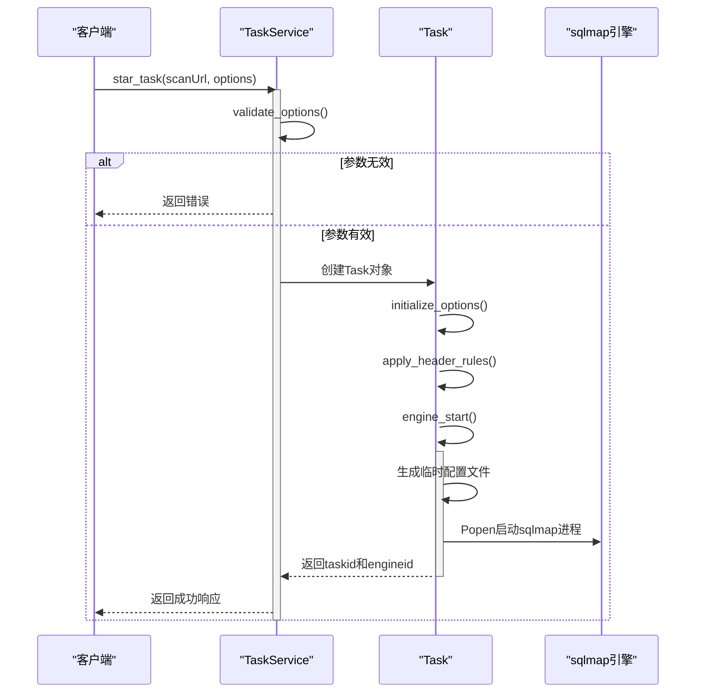
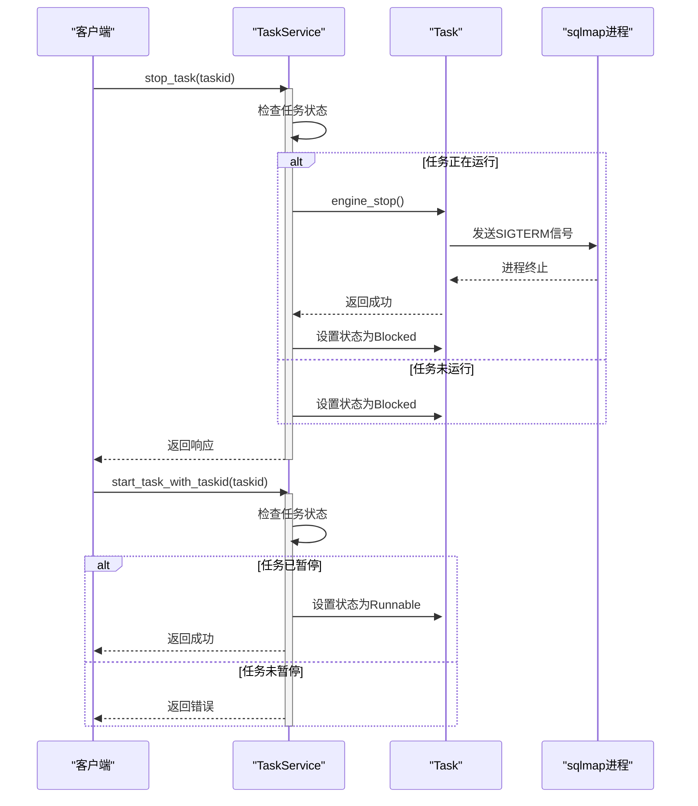

# 任务生命周期管理

<cite>
**本文档引用的文件**  
- [taskService.py](file://src/backEnd/service/taskService.py)
- [Task.py](file://src/backEnd/model/Task.py)
- [TaskStatus.py](file://src/backEnd/model/TaskStatus.py)
- [TaskRequest.py](file://src/backEnd/model/requestModel/TaskRequest.py)
- [sqlmap.py](file://src/backEnd/third_lib/sqlmap/sqlmap.py)
</cite>

## 目录
1. [任务创建](#任务创建)  
2. [任务启动](#任务启动)  
3. [任务暂停与恢复](#任务暂停与恢复)  
4. [任务停止与删除](#任务停止与删除)  
5. [异常处理机制](#异常处理机制)

## 任务创建

任务创建流程由 `taskService.py` 中的 `star_task` 方法实现。该方法接收远程地址、扫描URL、主机、请求头、请求体和扫描选项等参数，首先通过 `validate_options` 函数验证传入的扫描参数是否符合要求，排除不支持的选项。验证通过后，系统生成一个唯一的任务ID，并在 `DataStore.tasks` 字典中创建一个新的 `Task` 对象。

在 `Task` 类的初始化过程中，会执行以下关键步骤：
- 初始化任务状态为 `TaskStatus.New`。
- 调用 `initialize_options` 方法，从 `sqlmap` 的默认配置中加载所有可能的选项，并设置为初始值。
- 设置 `api`、`taskid` 和 `database` 等关键选项，以确保 `sqlmap` 引擎知道它是由API调用的。
- 强制启用批处理模式 (`batch`)，禁用颜色输出 (`disableColoring`) 和进度预估 (`eta`)。
- 调用 `apply_header_rules` 方法，在任务创建时立即应用持久化和会话性的请求头规则，确保扫描请求的准确性。

**Section sources**  
- [taskService.py](file://src/backEnd/service/taskService.py#L57-L86)
- [Task.py](file://src/backEnd/model/Task.py#L19-L40)
- [Task.py](file://src/backEnd/model/Task.py#L42-L62)
- [Task.py](file://src/backEnd/model/Task.py#L76-L136)

## 任务启动

任务启动由 `star_task` 方法在创建任务后触发。当任务状态被设置为 `TaskStatus.Runnable` 后，`sqlmap` 扫描引擎将在一个独立的进程中启动。

启动过程的核心是 `Task` 类的 `engine_start` 方法：
1.  **应用请求头规则**：在启动引擎前，再次调用 `apply_header_rules`，确保任何动态变化的请求头规则都能生效。
2.  **生成配置文件**：使用 `tempfile.mkstemp` 创建一个临时的配置文件，并通过 `saveConfig` 函数将当前任务的所有选项（包括用户自定义的 `options`）写入该文件。
3.  **启动进程**：使用 `Popen` 函数创建一个子进程来执行 `sqlmap.py` 脚本。命令行参数包括 `--api`（指示以API模式运行）和 `-c`（指定配置文件路径）。进程对象被存储在 `Task` 的 `process` 属性中，以便后续控制。
4.  **状态变更**：成功启动后，任务状态被更新为 `TaskStatus.Running`。

`star_task` 方法最终返回一个包含 `taskid` 和 `engineid`（即进程ID）的响应，供客户端使用。



**Diagram sources**  
- [taskService.py](file://src/backEnd/service/taskService.py#L57-L86)
- [Task.py](file://src/backEnd/model/Task.py#L138-L161)

**Section sources**  
- [taskService.py](file://src/backEnd/service/taskService.py#L57-L86)
- [Task.py](file://src/backEnd/model/Task.py#L138-L161)

## 任务暂停与恢复

### 任务暂停
任务暂停由 `taskService.py` 中的 `stop_task` 方法实现。该方法根据任务的当前状态采取不同的操作：
-   **运行中 (Running)**：调用 `Task` 对象的 `engine_stop` 方法，向 `sqlmap` 进程发送终止信号（`SIGTERM`），请求其优雅地停止。随后，任务状态被设置为 `TaskStatus.Blocked`。
-   **新建或可运行 (New/Runnable)**：如果任务尚未启动，直接将其状态设置为 `TaskStatus.Blocked`。
-   **已暂停或已终止**：返回相应的错误信息。

### 任务恢复
任务恢复由 `taskService.py` 中的 `start_task_with_taskid` 方法实现。该方法检查指定任务ID的状态：
-   **已暂停 (Blocked)**：将任务状态从 `Blocked` 重新设置为 `Runnable`。当任务调度器发现任务处于 `Runnable` 状态时，会自动调用 `engine_start` 方法来重启扫描。
-   **其他状态**：返回错误信息，说明任务无法恢复。



**Diagram sources**  
- [taskService.py](file://src/backEnd/service/taskService.py#L192-L211)
- [taskService.py](file://src/backEnd/service/taskService.py#L213-L224)
- [Task.py](file://src/backEnd/model/Task.py#L171-L176)

**Section sources**  
- [taskService.py](file://src/backEnd/service/taskService.py#L192-L211)
- [taskService.py](file://src/backEnd/service/taskService.py#L213-L224)

## 任务停止与删除

### 任务停止
`stop_task` 方法用于暂停任务，其行为如上一节所述。它旨在让任务能够被恢复。

### 任务删除
任务删除由 `taskService.py` 中的 `delete_task` 方法实现，这是一个不可逆的操作，会彻底清除任务的所有资源：
1.  **检查任务状态**：首先检查任务ID是否存在。
2.  **终止运行中的进程**：如果任务正在运行（`Running` 状态），调用 `engine_kill` 方法。该方法会向 `sqlmap` 进程发送 `SIGKILL` 信号，强制其立即终止。
3.  **清理资源**：从 `DataStore.tasks` 字典中移除该任务对象。
4.  **数据库清理**：虽然 `delete_task` 方法本身不直接清理数据库，但 `sqlmap` 引擎在被终止后，其相关的日志、错误和扫描结果数据会保留在数据库中，但因任务对象已删除，这些数据将被视为孤立数据。通常，这些数据会由其他机制（如定期清理任务）处理。

```mermaid
flowchart TD
A[开始: delete_task(taskid)] --> B{任务存在?}
B --> |否| C[返回错误: 任务不存在]
B --> |是| D{状态为Running?}
D --> |是| E[调用 engine_kill() 强制终止进程]
D --> |否| F[跳过进程终止]
E --> G
F --> G
G[从DataStore.tasks中移除任务] --> H[返回成功]
```

**Diagram sources**  
- [taskService.py](file://src/backEnd/service/taskService.py#L88-L99)
- [Task.py](file://src/backEnd/model/Task.py#L181-L189)

**Section sources**  
- [taskService.py](file://src/backEnd/service/taskService.py#L88-L99)

## 异常处理机制

系统在多个层面实现了异常处理，以确保服务的稳定性和数据的完整性。

### 服务层异常处理
在 `taskService.py` 的各个方法中，广泛使用了 `try-except` 块和 `with DataStore.tasks_lock:` 上下文管理器。
-   **并发安全**：`tasks_lock` 锁确保了对共享资源 `DataStore.tasks` 的访问是线程安全的，防止了竞态条件。
-   **数据库操作**：在查询数据库（如获取日志、错误计数）时，代码会检查 `cursor` 是否为 `None`，并进行相应的错误处理，避免因数据库连接问题导致服务崩溃。
-   **进程操作**：在调用 `engine_kill` 时，捕获了可能的异常，确保即使进程操作失败，任务删除流程也能继续。

### 任务层异常处理
`Task` 类中的 `apply_header_rules` 方法是异常处理的关键点。
-   **请求头规则应用**：此方法被设计为“失败开放”（fail-open）。如果在应用持久化或会话性请求头规则时发生任何异常（如导入模块失败、规则处理错误），系统会记录错误日志，但不会中断任务的创建或启动流程。任务将使用原始的请求头继续执行，保证了核心扫描功能的可用性。

### 进程通信与监控
系统通过 `Popen` 对象与 `sqlmap` 子进程进行交互。
-   **状态检测**：`engine_has_terminated` 方法通过检查 `process.returncode` 是否为整数来判断进程是否已结束。这使得服务层能够准确地反映任务的真实状态（例如，当进程意外崩溃时，状态会变为 `Terminated`）。
-   **资源回收**：在任务删除时，强制终止进程并清理内存中的任务对象，防止了资源泄漏。

**Section sources**  
- [taskService.py](file://src/backEnd/service/taskService.py#L57-L86)
- [taskService.py](file://src/backEnd/service/taskService.py#L101-L175)
- [Task.py](file://src/backEnd/model/Task.py#L76-L136)
- [Task.py](file://src/backEnd/model/Task.py#L204-L205)