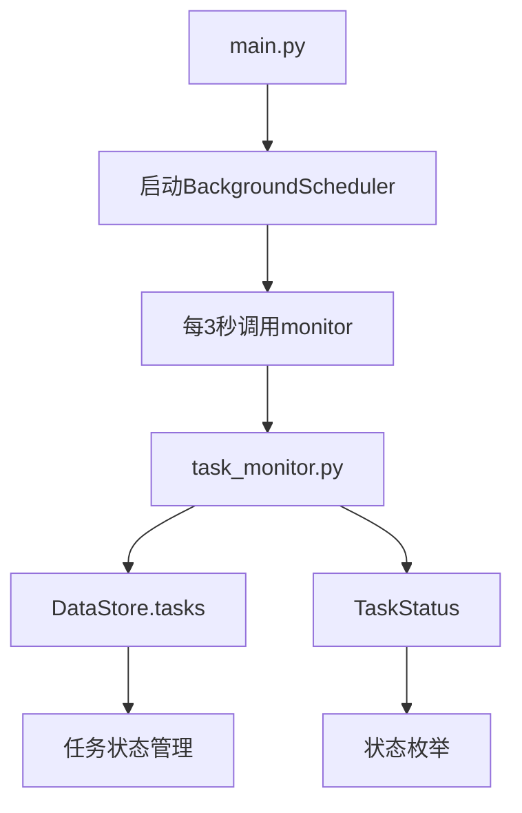
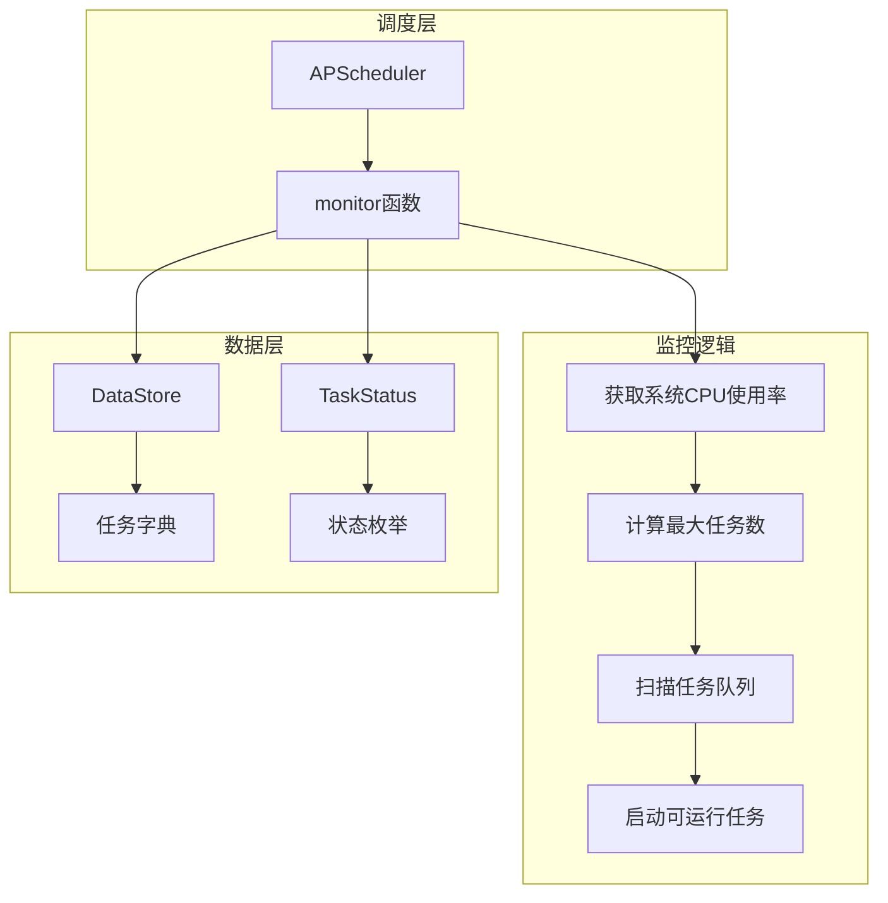
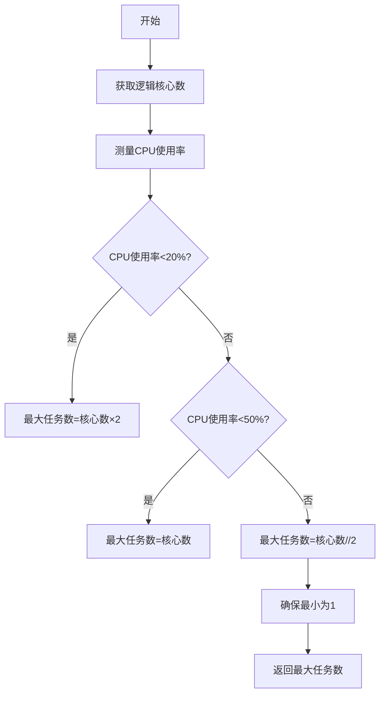
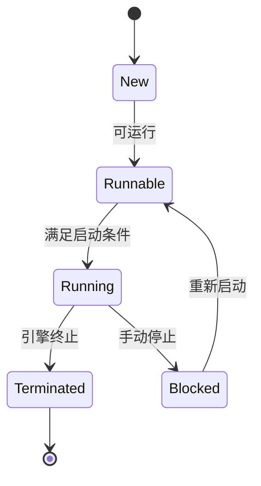
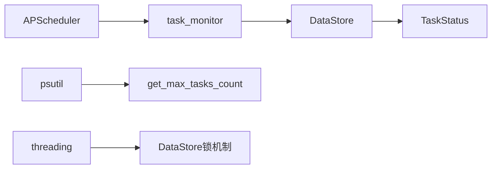

# 任务监控与调度

<cite>
**本文档引用文件**  
- [task_monitor.py](file://src/backEnd/utils/task_monitor.py)
- [main.py](file://src/backEnd/main.py)
- [DataStore.py](file://src/backEnd/model/DataStore.py)
- [TaskStatus.py](file://src/backEnd/model/TaskStatus.py)
</cite>

## 目录
1. [简介](#简介)
2. [项目结构](#项目结构)
3. [核心组件](#核心组件)
4. [架构概述](#架构概述)
5. [详细组件分析](#详细组件分析)
6. [依赖分析](#依赖分析)
7. [性能考量](#性能考量)
8. [故障排查指南](#故障排查指南)
9. [结论](#结论)

## 简介
本文档深入分析基于APScheduler实现的任务监控与调度机制。系统通过`task_monitor.py`中的`monitor`函数实现定时轮询，检测任务状态并动态调度执行。监控器结合CPU使用率和逻辑核心数动态调整最大并发任务数，确保系统资源合理利用。任务状态管理基于`TaskStatus`枚举，涵盖新建、可运行、运行中、阻塞和终止等状态。整个监控流程由APScheduler驱动，每3秒执行一次，实现对任务生命周期的全面管控。

## 项目结构
本项目采用分层架构设计，主要模块包括API接口、模型定义、服务逻辑和第三方库集成。任务监控功能位于`utils`目录下的`task_monitor.py`文件中，通过APScheduler定时调用。任务状态和数据存储由`model`目录下的`DataStore`和`TaskStatus`类管理。主程序入口`main.py`负责初始化调度器并启动服务。

**图示来源**  
- [main.py](file://src/backEnd/main.py#L140-L155)
- [task_monitor.py](file://src/backEnd/utils/task_monitor.py#L0-L93)
- [DataStore.py](file://src/backEnd/model/DataStore.py#L0-L33)

**本节来源**  
- [main.py](file://src/backEnd/main.py#L140-L155)
- [task_monitor.py](file://src/backEnd/utils/task_monitor.py#L0-L93)

## 核心组件
核心组件包括任务监控器、任务状态管理器和数据存储中心。`task_monitor.py`中的`monitor`函数是核心调度逻辑，负责检查任务状态并启动可运行任务。`DataStore`类提供线程安全的任务存储和状态管理，使用`OrderedDict`维护任务队列。`TaskStatus`枚举定义了任务的完整生命周期状态。`get_max_tasks_count`函数根据系统CPU使用率动态计算最大并发任务数，实现资源感知的调度策略。

**本节来源**  
- [task_monitor.py](file://src/backEnd/utils/task_monitor.py#L0-L93)
- [DataStore.py](file://src/backEnd/model/DataStore.py#L0-L33)
- [TaskStatus.py](file://src/backEnd/model/TaskStatus.py#L0-L8)

## 架构概述
系统采用基于APScheduler的定时监控架构，通过周期性检查任务队列实现调度。监控器每3秒运行一次，评估系统负载并调整最大并发数，然后扫描任务队列，将处于"Runnable"状态且满足启动条件的任务转为"Running"状态。整个架构依赖`DataStore`的线程锁机制保证多线程环境下的数据一致性。

**图示来源**  
- [main.py](file://src/backEnd/main.py#L140-L155)
- [task_monitor.py](file://src/backEnd/utils/task_monitor.py#L0-L93)

## 详细组件分析

### 任务监控器分析
`monitor`函数是任务调度的核心，通过APScheduler定时触发。函数首先根据系统负载动态计算最大并发任务数，然后遍历任务队列，识别处于"New"或"Runnable"状态的任务。对于已开始但未标记运行的任务，检查是否已过1秒延迟期，满足条件则启动任务执行。

#### 并发控制机制

**图示来源**  
- [task_monitor.py](file://src/backEnd/utils/task_monitor.py#L15-L37)

#### 任务状态流转

**图示来源**  
- [TaskStatus.py](file://src/backEnd/model/TaskStatus.py#L3-L8)
- [task_monitor.py](file://src/backEnd/utils/task_monitor.py#L67-L92)

**本节来源**  
- [task_monitor.py](file://src/backEnd/utils/task_monitor.py#L0-L93)
- [TaskStatus.py](file://src/backEnd/model/TaskStatus.py#L0-L8)

### 任务健康检查实现
系统通过`engine_has_terminated()`方法检测任务是否异常终止。监控器定期检查每个任务的运行状态，若发现任务实际已终止但状态仍为"Running"，则将其状态更新为"Terminated"。对于新创建的任务，系统记录`start_datetime`，确保任务有至少1秒的准备时间后再标记为运行状态，避免频繁状态切换。

**本节来源**  
- [task_monitor.py](file://src/backEnd/utils/task_monitor.py#L67-L92)

## 依赖分析
系统依赖APScheduler实现定时调度，psutil库用于系统资源监控，threading模块提供线程同步机制。核心依赖关系如下：

**图示来源**  
- [main.py](file://src/backEnd/main.py#L140-L155)
- [task_monitor.py](file://src/backEnd/utils/task_monitor.py#L0-L93)
- [DataStore.py](file://src/backEnd/model/DataStore.py#L0-L33)

**本节来源**  
- [main.py](file://src/backEnd/main.py#L140-L155)
- [task_monitor.py](file://src/backEnd/utils/task_monitor.py#L0-L93)

## 性能考量
系统采用动态并发控制策略，根据实时CPU使用率调整最大任务数。当CPU使用率低于20%时，允许最大任务数为逻辑核心数的2倍；使用率在20%-50%时，等于逻辑核心数；高于50%时，减半至核心数的一半（至少为1）。这种自适应机制确保在低负载时充分利用多核性能，在高负载时避免系统过载。监控间隔设置为3秒，平衡了响应速度和系统开销。

## 故障排查指南
常见问题包括任务无法启动、状态更新延迟和资源竞争。检查`DataStore.tasks_lock`和`max_tasks_count_lock`的使用确保线程安全。监控日志中`monitor`函数的执行频率应稳定在每3秒一次。若任务长时间处于"Runnable"状态，检查`start_datetime`逻辑和并发限制。系统资源不足时，`get_max_tasks_count`会自动降低并发数，避免雪崩效应。

**本节来源**  
- [task_monitor.py](file://src/backEnd/utils/task_monitor.py#L0-L93)
- [DataStore.py](file://src/backEnd/model/DataStore.py#L0-L33)

## 结论
该任务监控与调度系统实现了基于系统负载的自适应并发控制，通过APScheduler定时轮询机制有效管理任务生命周期。系统设计考虑了线程安全、资源利用率和故障恢复，为sqlmapWebUI提供了稳定可靠的任务执行环境。未来可扩展告警机制和更精细的资源监控，进一步提升系统健壮性。