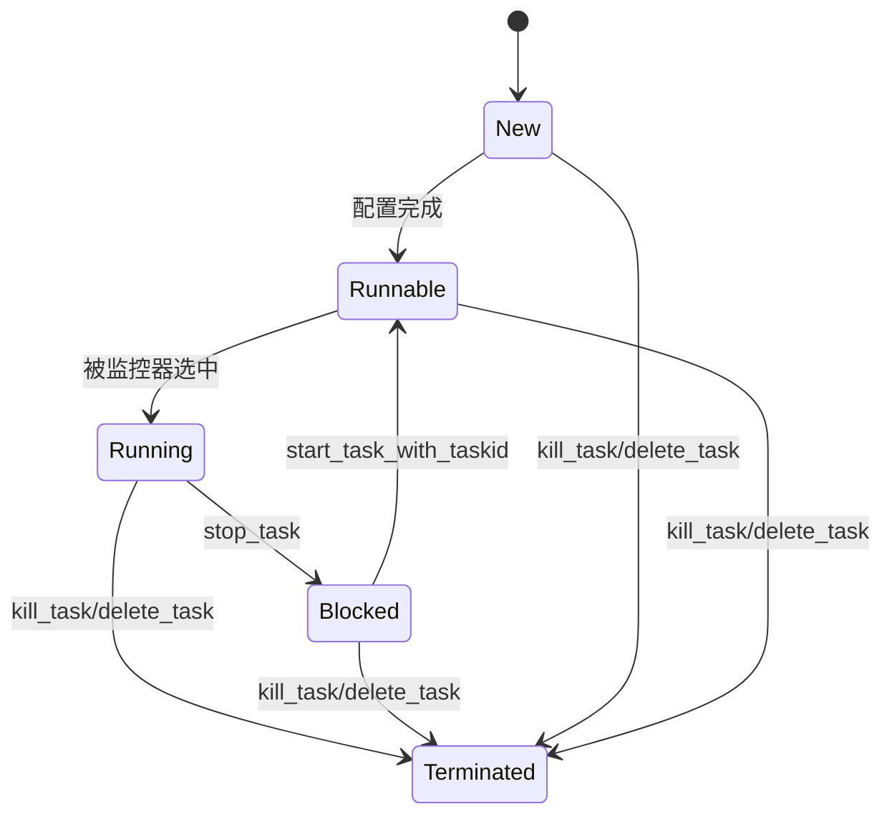
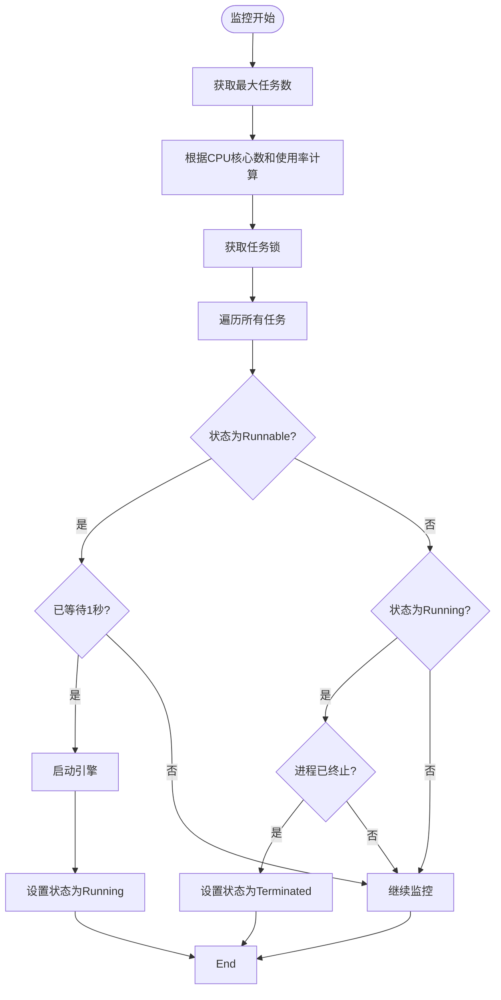
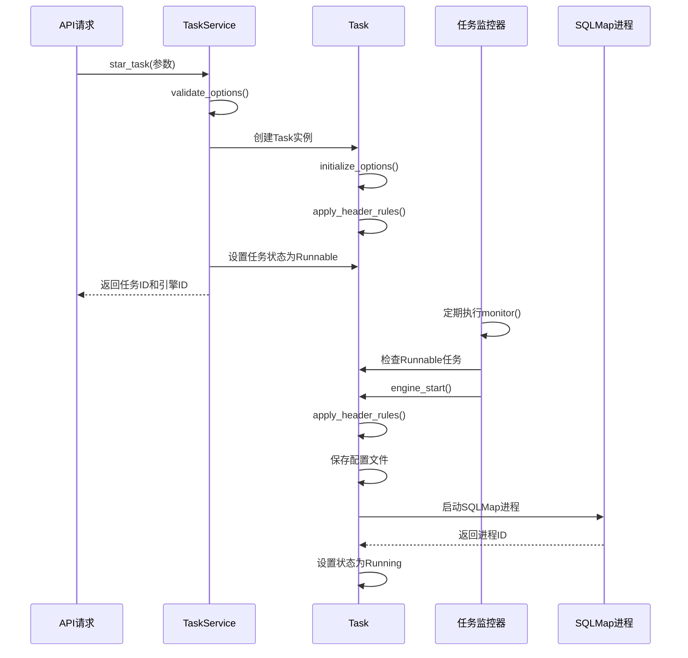

# 任务管理

<cite>
**本文档引用的文件**
- [taskService.py](file://src/backEnd/service/taskService.py)
- [Task.py](file://src/backEnd/model/Task.py)
- [TaskStatus.py](file://src/backEnd/model/TaskStatus.py)
- [task_monitor.py](file://src/backEnd/utils/task_monitor.py)
- [TaskRequest.py](file://src/backEnd/model/requestModel/TaskRequest.py)
- [task.ts](file://src/frontEnd/src/stores/task.ts) - *新增批量停止功能*
- [TaskList.vue](file://src/frontEnd/src/views/TaskList/index.vue) - *新增批量操作界面*
- [useSmartPolling.ts](file://src/frontEnd/src/utils/useSmartPolling.ts) - *智能轮询策略实现*
- [TaskDetail.vue](file://src/frontEnd/src/views/TaskDetail/index.vue) - *任务详情页实现*
</cite>

## 更新摘要
**主要变更**
- 新增任务批量停止功能及前端交互支持
- 实现任务详情页，支持查看HTTP请求、扫描配置等详细信息
- 引入智能轮询策略，根据任务状态动态调整轮询频率
- 优化任务列表性能和用户体验
- 更新相关文档内容以反映最新功能

## 目录
1. [任务生命周期管理](#任务生命周期管理)
2. [任务状态机设计](#任务状态机设计)
3. [任务配置参数验证与默认值处理](#任务配置参数验证与默认值处理)
4. [任务监控与自动清理机制](#任务监控与自动清理机制)
5. [任务执行流程序列图](#任务执行流程序列图)
6. [并发控制与资源隔离](#并发控制与资源隔离)
7. [错误恢复与扩展接口](#错误恢复与扩展接口)
8. [任务批量操作功能](#任务批量操作功能)
9. [任务详情与智能轮询](#任务详情与智能轮询)

## 任务生命周期管理

`taskService.py`中的`TaskService`类提供了完整的任务生命周期管理功能，包括任务创建、启动、暂停、恢复、停止和删除操作。任务创建通过`star_task`方法实现，该方法接收远程地址、扫描URL、主机、请求头、请求体和选项等参数，生成唯一任务ID并初始化任务对象。任务状态转换通过`stop_task`和`start_task_with_taskid`方法实现，分别用于暂停和恢复任务。任务删除通过`delete_task`方法实现，该方法会检查任务状态并在必要时终止正在运行的任务进程。任务终止通过`kill_task`方法实现，直接终止任务进程并标记为终止状态。

**Section sources**
- [taskService.py](file://src/backEnd/service/taskService.py#L45-L527)

## 任务状态机设计

任务状态由`TaskStatus`枚举类定义，包含五种状态：New（新建）、Runnable（可运行）、Running（运行中）、Blocked（已阻塞）和Terminated（已终止）。状态转换遵循严格的规则：新建任务在配置完成后变为可运行状态；可运行任务在被任务监控器选中后变为运行中状态；运行中任务可通过`stop_task`方法变为已阻塞状态；已阻塞任务可通过`start_task_with_taskid`方法恢复为可运行状态；任何状态的任务都可通过`kill_task`或`delete_task`方法变为已终止状态。状态查询时，系统会结合任务对象状态和进程实际状态进行判断，确保状态信息的准确性。

**Diagram sources**
- [TaskStatus.py](file://src/backEnd/model/TaskStatus.py#L3-L8)
- [Task.py](file://src/backEnd/model/Task.py#L18-L205)

## 任务配置参数验证与默认值处理

任务配置参数的验证在`validate_options`函数中实现，该函数检查参数格式是否为字典类型，并验证是否存在SQLMap API不支持的选项。验证通过后，参数会被设置到任务对象的`options`属性中。默认值处理在`Task`类的`initialize_options`方法中实现，该方法遍历SQLMap的选项定义，为每个选项设置适当的默认值。系统还设置了API专用的默认选项，包括启用API模式、指定任务ID和数据库路径、强制批处理模式、禁用颜色输出和禁用ETA显示等。这些默认值确保了任务在API环境下能够正确运行。

**Section sources**
- [taskService.py](file://src/backEnd/service/taskService.py#L15-L43)
- [Task.py](file://src/backEnd/model/Task.py#L50-L80)

## 任务监控与自动清理机制

任务监控由`task_monitor.py`中的`monitor`函数实现，该函数通过APScheduler定期执行。监控器首先根据CPU核心数和当前CPU使用率动态计算最大并发任务数，然后遍历所有任务，将状态为Runnable且满足启动条件的任务启动。任务超时检测通过比较`start_datetime`和当前时间实现，确保任务不会无限期等待。自动清理策略包括：在任务删除时自动终止运行中的任务进程；在系统刷新时终止所有任务进程；通过`engine_has_terminated`方法检测已结束的进程并更新任务状态。这种机制确保了系统资源的有效利用和任务状态的准确同步。

**Diagram sources**
- [task_monitor.py](file://src/backEnd/utils/task_monitor.py#L67-L92)
- [Task.py](file://src/backEnd/model/Task.py#L180-L205)

## 任务执行流程序列图

**Diagram sources**
- [taskService.py](file://src/backEnd/service/taskService.py#L80-L120)
- [Task.py](file://src/backEnd/model/Task.py#L130-L180)

## 并发控制与资源隔离

系统通过多种机制实现任务并发控制和资源隔离。并发控制通过`DataStore.tasks_lock`锁和动态计算的最大任务数限制实现，确保同时运行的任务数不会超过系统承载能力。每个任务在启动时会创建独立的配置文件和进程，实现资源隔离。任务间通过唯一的任务ID进行区分，所有任务数据（日志、结果、错误等）都按任务ID存储在数据库中，避免数据混淆。请求头处理机制确保每个任务的请求头修改不会影响其他任务。这种设计既保证了任务的独立性，又实现了系统资源的合理分配。

**Section sources**
- [task_monitor.py](file://src/backEnd/utils/task_monitor.py#L38-L68)
- [Task.py](file://src/backEnd/model/Task.py#L18-L205)

## 错误恢复与扩展接口

系统提供了完善的错误恢复机制，包括任务状态异常检测、进程终止检测和数据库连接异常处理。当任务执行失败时，系统会记录错误日志并清理相关资源。对于可恢复的错误，系统支持通过`start_task_with_taskid`方法重新启动任务。扩展接口方面，系统设计了清晰的模块化结构，开发者可以通过继承`Task`类创建新的任务类型，或通过实现自定义处理器来扩展功能。请求头处理机制也支持通过`headerRuleService`和`header_processor`模块进行扩展，允许开发者添加新的请求头处理规则。

**Section sources**
- [taskService.py](file://src/backEnd/service/taskService.py#L125-L150)
- [Task.py](file://src/backEnd/model/Task.py#L90-L130)

## 任务批量操作功能

系统新增了任务批量停止功能，该功能在前端`task.ts`存储中实现了批量停止任务的方法，并在UI上添加了相应的按钮和确认对话框。批量操作功能允许用户同时选择多个任务进行统一管理，提高了操作效率。后端通过遍历选中的任务ID列表，依次调用`stop_task`方法实现批量暂停。该功能特别适用于需要同时管理多个扫描任务的场景，减少了重复操作。前端实现中包含了确认对话框以防止误操作，确保了操作的安全性。

**Section sources**
- [task.ts](file://src/frontEnd/src/stores/task.ts#L45-L80) - *批量停止功能实现*
- [TaskList.vue](file://src/frontEnd/src/views/TaskList/index.vue#L120-L150) - *批量操作界面实现*

## 任务详情与智能轮询

系统实现了完整的任务详情页功能，支持查看HTTP请求、扫描配置、日志信息等详细内容。任务详情页通过`TaskDetail.vue`组件实现，能够并行加载各项数据，优化了页面加载性能。同时，系统引入了智能轮询策略，通过`useSmartPolling.ts`工具实现，根据任务状态动态调整轮询频率。对于运行中的任务，采用较短的轮询间隔以实时获取最新状态；对于已完成或已停止的任务，则采用较长的轮询间隔以减少服务器负载。这种智能轮询机制在保证用户体验的同时，有效降低了系统资源消耗。

**Section sources**
- [TaskDetail.vue](file://src/frontEnd/src/views/TaskDetail/index.vue) - *任务详情页实现*
- [useSmartPolling.ts](file://src/frontEnd/src/utils/useSmartPolling.ts#L15-L60) - *智能轮询策略实现*
- [task.ts](file://src/frontEnd/src/stores/task.ts#L85-L120) - *任务详情数据获取*