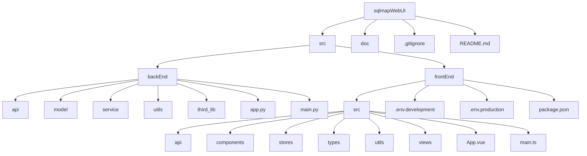
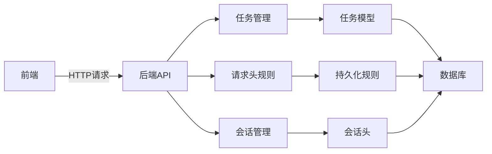
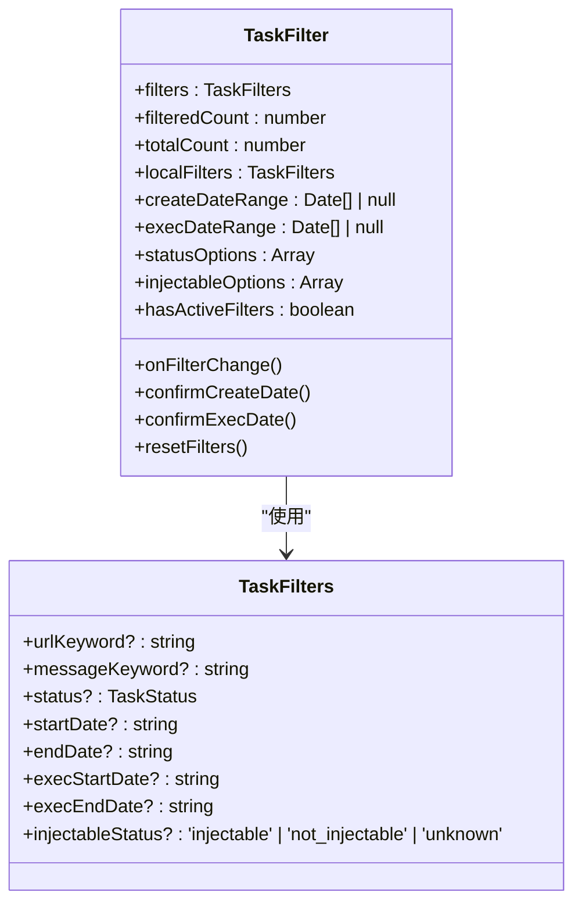
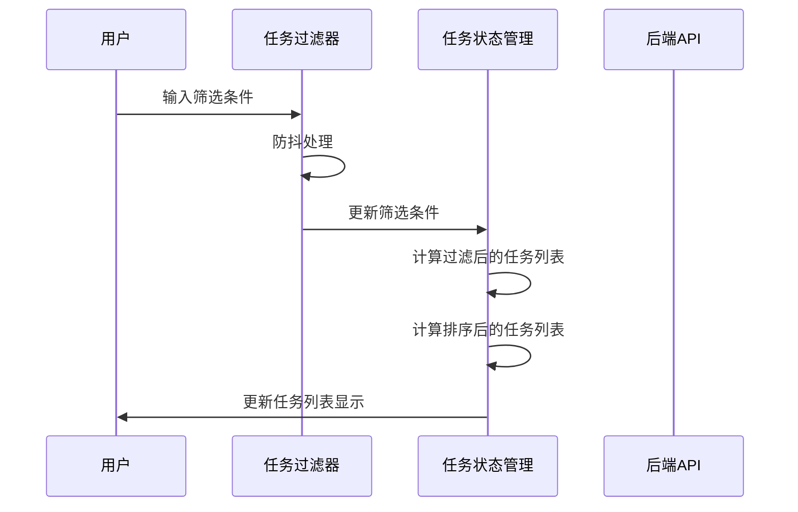
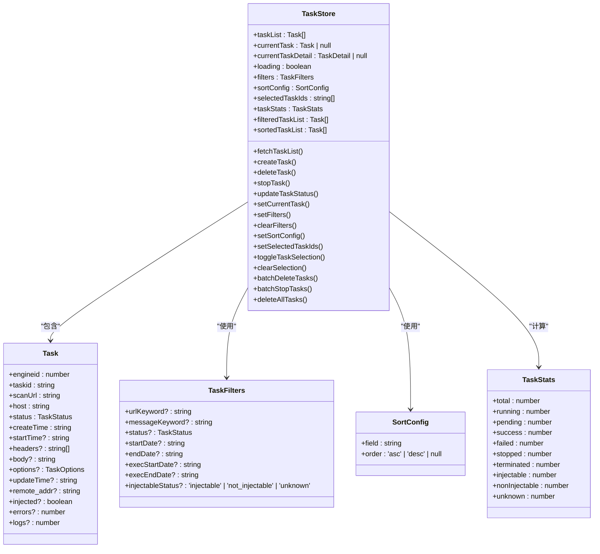
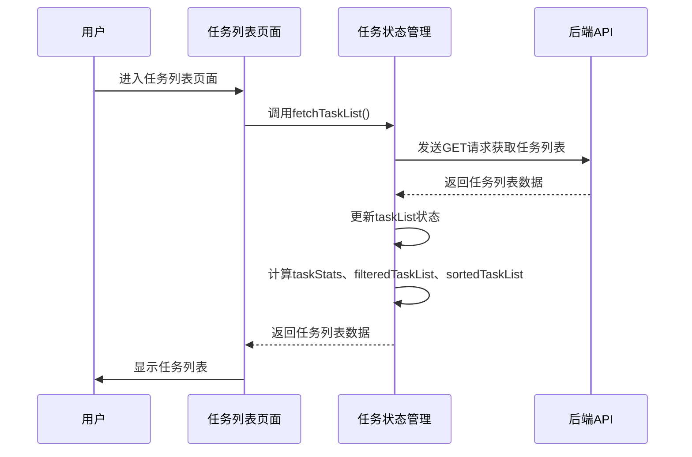
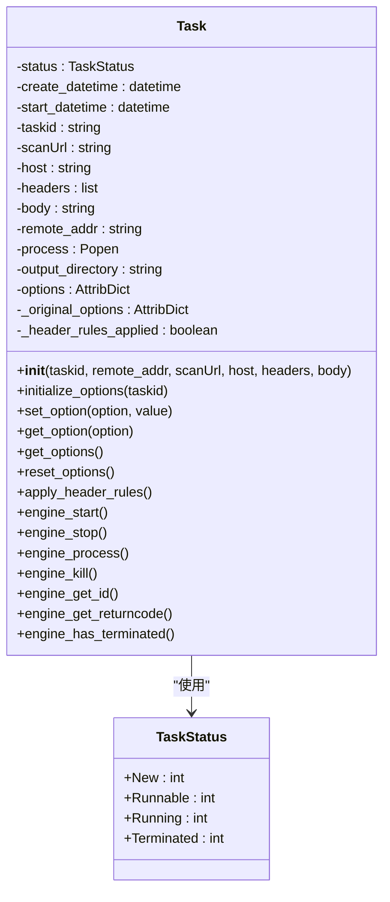
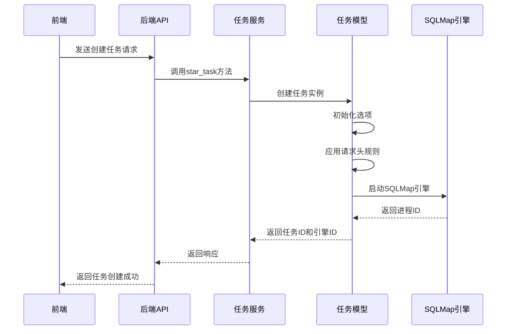
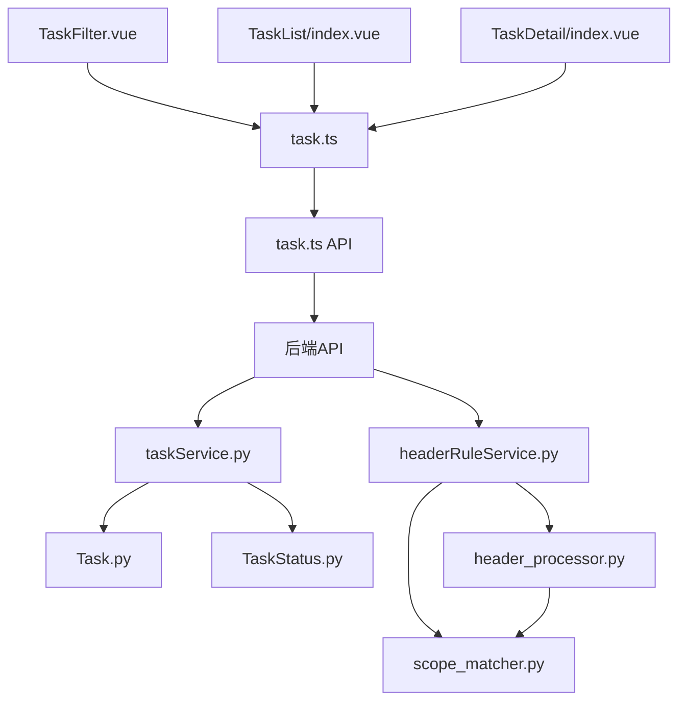

# 任务过滤器增强

<cite>
**本文档引用的文件**   
- [TaskFilter.vue](file://src/frontEnd/src/components/TaskFilter.vue)
- [task.ts](file://src/frontEnd/src/stores/task.ts)
- [TaskList/index.vue](file://src/frontEnd/src/views/TaskList/index.vue)
- [task.ts](file://src/frontEnd/src/types/task.ts)
- [Task.py](file://src/backEnd/model/Task.py)
- [headerController.py](file://src/backEnd/api/commonApi/headerController.py)
- [headerRuleService.py](file://src/backEnd/service/headerRuleService.py)
- [header_processor.py](file://src/backEnd/utils/header_processor.py)
- [scope_matcher.py](file://src/backEnd/utils/scope_matcher.py)
- [TaskStatus.py](file://src/backEnd/model/TaskStatus.py)
</cite>

## 目录
1. [简介](#简介)
2. [项目结构](#项目结构)
3. [核心组件](#核心组件)
4. [架构概述](#架构概述)
5. [详细组件分析](#详细组件分析)
6. [依赖分析](#依赖分析)
7. [性能考虑](#性能考虑)
8. [故障排除指南](#故障排除指南)
9. [结论](#结论)

## 简介
本项目是一个现代化的 SQLMap Web 界面，为安全研究人员提供便捷的 SQL 注入测试平台。核心功能包括任务管理、实时日志查看、扫描结果展示、HTTP 请求查看、批量操作以及扩展集成。本文档重点分析任务过滤器的增强功能，该功能允许用户根据多种条件对任务进行筛选和排序，提高任务管理的效率。

## 项目结构
项目采用前后端分离的架构，前端使用 Vue 3 和 TypeScript 构建，后端使用 FastAPI 和 Python 3.10+。项目结构清晰，分为前端和后端两个主要部分，每个部分都有明确的目录划分。

**Diagram sources**
- [src/frontEnd/src/components/TaskFilter.vue](file://src/frontEnd/src/components/TaskFilter.vue)
- [src/backEnd/model/Task.py](file://src/backEnd/model/Task.py)

**Section sources**
- [src/frontEnd/src/components/TaskFilter.vue](file://src/frontEnd/src/components/TaskFilter.vue)
- [src/backEnd/model/Task.py](file://src/backEnd/model/Task.py)

## 核心组件
任务过滤器是前端任务管理界面的核心组件之一，它允许用户根据多种条件对任务进行筛选和排序。任务过滤器组件与任务状态管理 store 紧密协作，实现高效的任务管理。

**Section sources**
- [src/frontEnd/src/components/TaskFilter.vue](file://src/frontEnd/src/components/TaskFilter.vue)
- [src/frontEnd/src/stores/task.ts](file://src/frontEnd/src/stores/task.ts)

## 架构概述
系统架构采用前后端分离模式，前端通过 API 与后端进行通信。后端提供 RESTful API 接口，处理任务的创建、查询、更新和删除等操作。前端通过 Pinia 状态管理 store 管理任务状态，并通过组件化的方式实现用户界面。

**Diagram sources**
- [src/frontEnd/src/stores/task.ts](file://src/frontEnd/src/stores/task.ts)
- [src/backEnd/service/headerRuleService.py](file://src/backEnd/service/headerRuleService.py)

## 详细组件分析
### 任务过滤器组件分析
任务过滤器组件提供了多种筛选条件，包括URL关键字、报文关键字、任务状态、创建时间、执行时间等。用户可以通过这些条件快速找到所需的任务。

#### 任务过滤器类图

**Diagram sources**
- [src/frontEnd/src/components/TaskFilter.vue](file://src/frontEnd/src/components/TaskFilter.vue)
- [src/frontEnd/src/types/task.ts](file://src/frontEnd/src/types/task.ts)

#### 任务过滤器序列图

**Diagram sources**
- [src/frontEnd/src/components/TaskFilter.vue](file://src/frontEnd/src/components/TaskFilter.vue)
- [src/frontEnd/src/stores/task.ts](file://src/frontEnd/src/stores/task.ts)

### 任务状态管理分析
任务状态管理 store 负责管理所有任务的状态，包括任务列表、当前任务、筛选条件、排序配置等。它还提供了计算属性来统计任务的各种状态。

#### 任务状态管理类图

**Diagram sources**
- [src/frontEnd/src/stores/task.ts](file://src/frontEnd/src/stores/task.ts)
- [src/frontEnd/src/types/task.ts](file://src/frontEnd/src/types/task.ts)

#### 任务状态管理序列图

**Diagram sources**
- [src/frontEnd/src/stores/task.ts](file://src/frontEnd/src/stores/task.ts)
- [src/frontEnd/src/views/TaskList/index.vue](file://src/frontEnd/src/views/TaskList/index.vue)

### 后端任务处理分析
后端负责处理任务的创建、查询、更新和删除等操作。任务模型定义了任务的基本属性，任务服务提供了业务逻辑处理。

#### 任务模型类图

**Diagram sources**
- [src/backEnd/model/Task.py](file://src/backEnd/model/Task.py)
- [src/backEnd/model/TaskStatus.py](file://src/backEnd/model/TaskStatus.py)

#### 任务处理序列图

**Diagram sources**
- [src/backEnd/service/taskService.py](file://src/backEnd/service/taskService.py)
- [src/backEnd/model/Task.py](file://src/backEnd/model/Task.py)

## 依赖分析
系统各组件之间存在紧密的依赖关系。前端组件依赖于 Pinia 状态管理 store，store 又依赖于后端 API。后端 API 依赖于服务层，服务层依赖于数据模型和工具类。

**Diagram sources**
- [src/frontEnd/src/components/TaskFilter.vue](file://src/frontEnd/src/components/TaskFilter.vue)
- [src/frontEnd/src/stores/task.ts](file://src/frontEnd/src/stores/task.ts)
- [src/backEnd/service/taskService.py](file://src/backEnd/service/taskService.py)
- [src/backEnd/service/headerRuleService.py](file://src/backEnd/service/headerRuleService.py)

## 性能考虑
任务过滤器的设计考虑了性能优化。前端通过计算属性实现了响应式的任务列表过滤和排序，避免了重复计算。后端通过数据库查询优化和缓存机制提高了任务查询的效率。

## 故障排除指南
### 任务过滤器不生效
1. 检查筛选条件是否正确输入
2. 检查任务状态管理 store 的筛选条件是否正确更新
3. 检查后端 API 是否返回正确的任务列表

### 任务列表加载缓慢
1. 检查网络连接是否正常
2. 检查后端数据库查询是否优化
3. 检查任务数量是否过多，考虑分页加载

**Section sources**
- [src/frontEnd/src/components/TaskFilter.vue](file://src/frontEnd/src/components/TaskFilter.vue)
- [src/frontEnd/src/stores/task.ts](file://src/frontEnd/src/stores/task.ts)

## 结论
任务过滤器增强功能显著提高了任务管理的效率。通过多种筛选条件和排序选项，用户可以快速找到所需的任务。系统架构设计合理，前后端分离，组件化开发，便于维护和扩展。未来可以考虑增加更多筛选条件，如按扫描结果、按错误数量等，进一步提升用户体验。