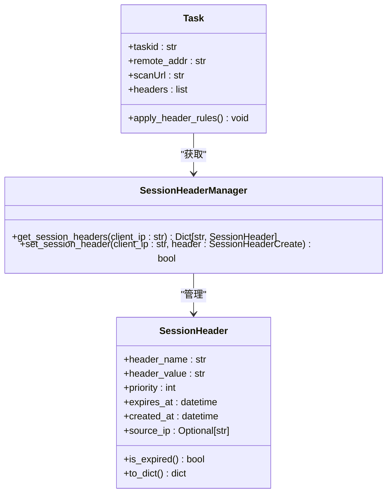
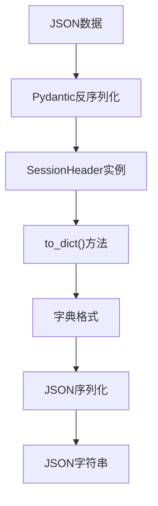
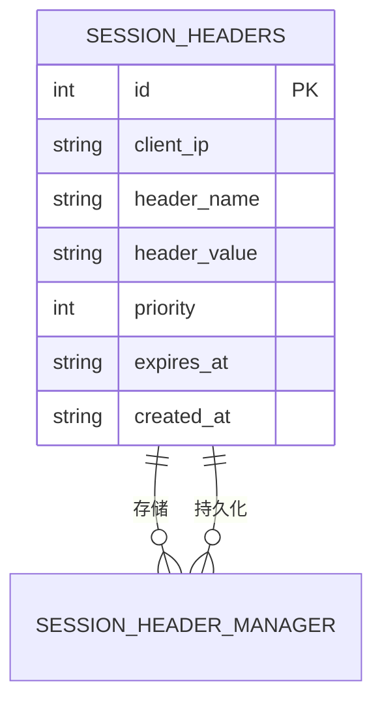
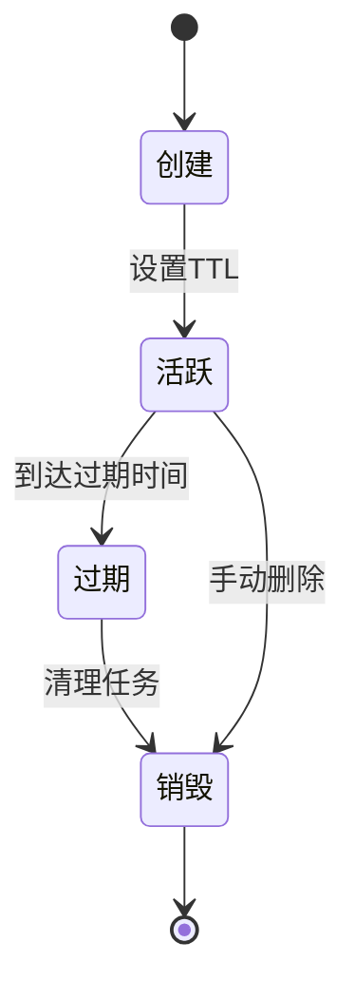
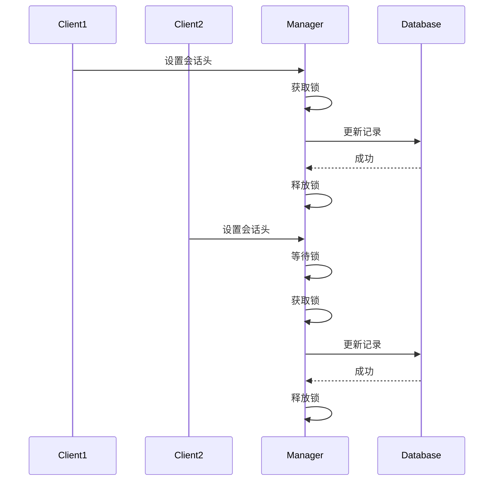
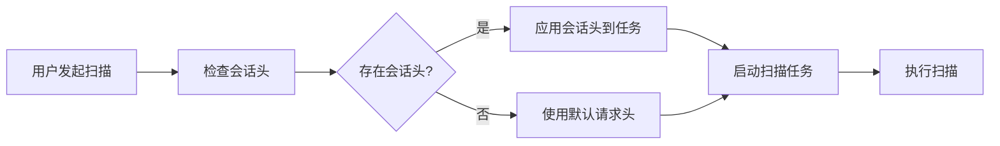

# 会话头数据模型

<cite>
**本文档引用的文件**
- [SessionHeader.py](file://src/backEnd/model/SessionHeader.py)
- [Task.py](file://src/backEnd/model/Task.py)
- [session_header_manager.py](file://src/backEnd/utils/session_header_manager.py)
- [DataStore.py](file://src/backEnd/model/DataStore.py)
- [HeaderDatabase.py](file://src/backEnd/model/HeaderDatabase.py)
- [header_processor.py](file://src/backEnd/utils/header_processor.py)
</cite>

## 目录
1. [简介](#简介)
2. [核心属性结构](#核心属性结构)
3. [与任务模型的关联关系](#与任务模型的关联关系)
4. [数据序列化与反序列化机制](#数据序列化与反序列化机制)
5. [内存存储与持久化](#内存存储与持久化)
6. [生命周期管理](#生命周期管理)
7. [高并发场景下的数据一致性](#高并发场景下的数据一致性)
8. [实际应用示例](#实际应用示例)
9. [总结](#总结)

## 简介
会话头数据模型（SessionHeader）是系统中用于管理临时性HTTP请求头的核心组件。该模型设计用于在内存中存储和管理会话级别的请求头信息，支持动态添加、更新和删除操作。每个会话头包含请求头名称、值、优先级、过期时间等关键属性，并通过与任务模型的绑定，确保在扫描过程中能够正确应用这些请求头。该模型在高并发环境下通过线程安全机制和数据库持久化保障数据完整性。

**Section sources**
- [SessionHeader.py](file://src/backEnd/model/SessionHeader.py#L1-L10)

## 核心属性结构
会话头数据模型定义了多个关键属性，每个属性都有明确的约束和用途：

- **header_name**: 请求头名称，长度限制为1-200个字符，不能为空。
- **header_value**: 请求头值，长度限制为1-2000个字符，不能为空。
- **priority**: 优先级，取值范围为0-100，用于决定请求头的应用顺序。
- **expires_at**: 过期时间，表示该会话头的有效期限。
- **created_at**: 创建时间，自动记录会话头的创建时刻。
- **source_ip**: 来源IP地址，可选字段，用于标识请求来源。

这些属性通过Pydantic模型进行验证，确保数据的完整性和一致性。

**Section sources**
- [SessionHeader.py](file://src/backEnd/model/SessionHeader.py#L7-L12)

## 与任务模型的关联关系
会话头模型与任务模型（Task）通过客户端IP地址建立关联。当创建新任务时，系统会根据客户端IP从会话头管理器中获取所有有效的会话头，并将其应用到任务的请求头中。这种关联关系确保了每个任务都能继承其创建者的会话状态。

在任务初始化过程中，`apply_header_rules`方法会被调用，该方法负责从`DataStore`中获取会话头管理器，并根据客户端IP获取相应的会话头。获取到的会话头会与任务原有的请求头合并，优先级较高的会话头会覆盖同名的原有请求头。

**Diagram sources**
- [SessionHeader.py](file://src/backEnd/model/SessionHeader.py#L5-L32)
- [Task.py](file://src/backEnd/model/Task.py#L76-L136)
- [session_header_manager.py](file://src/backEnd/utils/session_header_manager.py#L97-L117)

## 数据序列化与反序列化机制
会话头模型实现了完整的序列化和反序列化机制，确保数据能够在不同格式之间无缝转换。模型使用Pydantic的`Field`和`Config`类来定义序列化规则。

在序列化过程中，`to_dict`方法将模型实例转换为字典格式，所有`datetime`类型的字段都会被格式化为字符串。同时，`Config`类中的`json_encoders`配置确保了JSON序列化的正确性。

反序列化则通过Pydantic的自动验证机制完成。当从JSON数据创建`SessionHeader`实例时，Pydantic会自动验证所有字段的类型和约束，并将字符串格式的日期时间转换为`datetime`对象。

**Diagram sources**
- [SessionHeader.py](file://src/backEnd/model/SessionHeader.py#L18-L27)
- [SessionHeader.py](file://src/backEnd/model/SessionHeader.py#L30-L32)

## 内存存储与持久化
会话头数据采用内存存储与数据库持久化相结合的方式。内存中使用嵌套字典结构`{client_ip: {header_name: SessionHeader}}`来组织数据，确保快速访问。同时，所有会话头数据都会持久化到SQLite数据库中，防止系统重启导致数据丢失。

`SessionHeaderManager`类负责管理内存中的会话头，并通过`HeaderDatabase`类与数据库交互。当设置新的会话头时，系统会同时更新内存数据和数据库记录。数据库表`session_headers`包含客户端IP、请求头名称、值、优先级、过期时间等字段，并建立了适当的索引以提高查询性能。

**Diagram sources**
- [session_header_manager.py](file://src/backEnd/utils/session_header_manager.py#L16-L20)
- [HeaderDatabase.py](file://src/backEnd/model/HeaderDatabase.py#L40-L45)

## 生命周期管理
会话头的生命周期由创建、更新、过期和销毁四个阶段组成。创建时，系统会根据TTL（生存时间）计算过期时间；更新时，会同时更新内存和数据库中的记录；过期检查通过`is_expired`方法实现；销毁则通过`remove_session_header`或`clear_session_headers`方法完成。

系统还实现了定期清理机制，通过`cleanup_expired_headers`方法扫描并删除所有已过期的会话头。这个过程在后台线程中定期执行，确保内存中只保留有效的会话头数据。

**Diagram sources**
- [SessionHeader.py](file://src/backEnd/model/SessionHeader.py#L14-L16)
- [session_header_manager.py](file://src/backEnd/utils/session_header_manager.py#L187-L236)

## 高并发场景下的数据一致性
在高并发环境下，会话头管理器通过线程锁（`threading.Lock`）确保数据操作的原子性。所有对会话头的读写操作都在锁的保护下进行，防止竞态条件。

此外，数据库操作使用了重试机制，当遇到"locked"异常时会自动重试，确保在高并发写入时的数据完整性。`DataStore`类中的单例模式也保证了全局数据的一致性视图。

**Diagram sources**
- [session_header_manager.py](file://src/backEnd/utils/session_header_manager.py#L19-L19)
- [session_header_manager.py](file://src/backEnd/utils/session_header_manager.py#L26-L85)

## 实际应用示例
在实际扫描流程中，会话头模型的应用贯穿整个任务生命周期。当用户发起扫描请求时，系统会先检查是否存在相关的会话头，然后在任务创建时自动应用这些请求头。

例如，在Burp Suite插件集成中，用户可以预先配置一些认证相关的请求头（如Authorization头），这些请求头会被存储为会话头。当通过插件发起扫描时，系统会自动将这些认证头应用到扫描请求中，确保扫描能够通过身份验证。

**Diagram sources**
- [Task.py](file://src/backEnd/model/Task.py#L19-L40)
- [taskService.py](file://src/backEnd/service/taskService.py#L30-L50)

## 总结
会话头数据模型是一个功能完整、设计合理的数据结构，它不仅满足了临时请求头管理的基本需求，还通过与任务模型的深度集成，为系统提供了灵活的请求头处理能力。其内存+持久化的存储策略、线程安全的操作机制以及清晰的生命周期管理，确保了在各种使用场景下的稳定性和可靠性。

**Section sources**
- [SessionHeader.py](file://src/backEnd/model/SessionHeader.py#L1-L61)
- [Task.py](file://src/backEnd/model/Task.py#L1-L206)