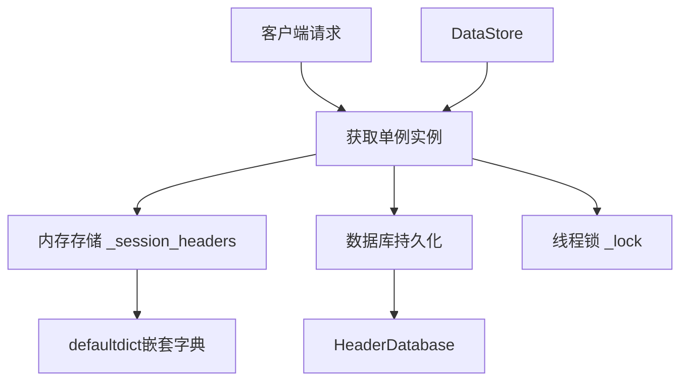
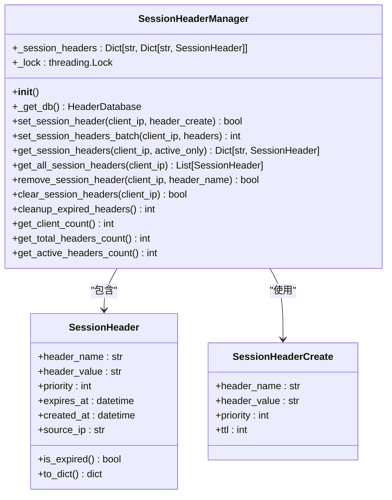
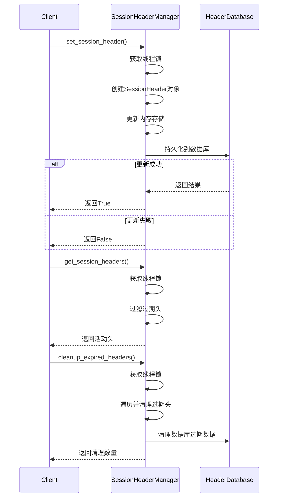
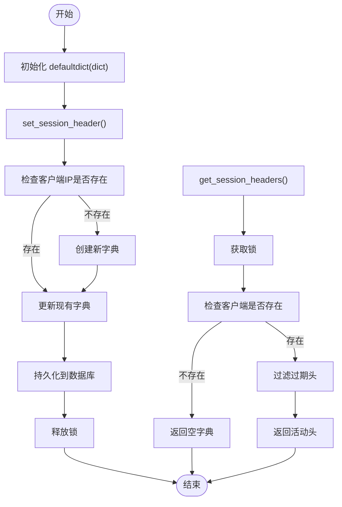
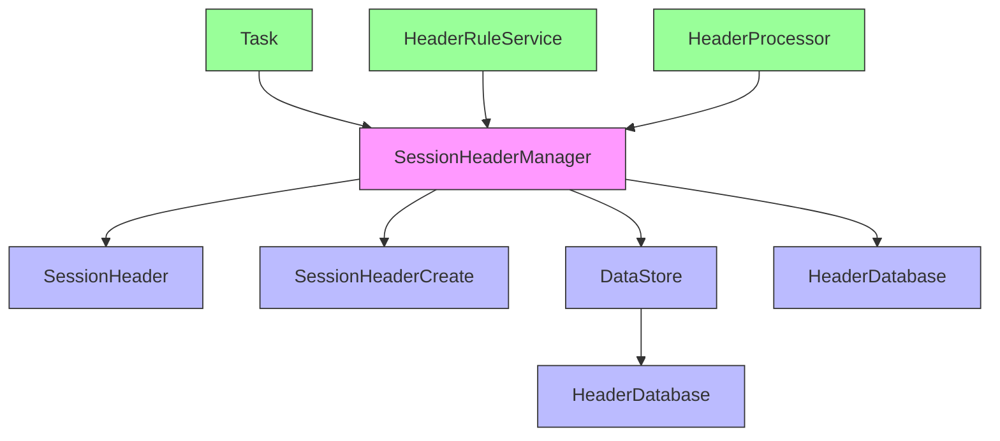

# 会话头管理器

<cite>
**本文档引用的文件**   
- [session_header_manager.py](file://src/backEnd/utils/session_header_manager.py)
- [SessionHeader.py](file://src/backEnd/model/SessionHeader.py)
- [HeaderDatabase.py](file://src/backEnd/model/HeaderDatabase.py)
- [DataStore.py](file://src/backEnd/model/DataStore.py)
</cite>

## 目录
1. [简介](#简介)
2. [核心组件](#核心组件)
3. [架构概述](#架构概述)
4. [详细组件分析](#详细组件分析)
5. [依赖分析](#依赖分析)
6. [性能考虑](#性能考虑)
7. [故障排除指南](#故障排除指南)
8. [结论](#结论)

## 简介
会话头管理器是一个用于管理临时会话性请求头的内存存储系统。该系统为每个客户端IP地址维护一组会话性请求头，支持设置、查询、更新和删除操作。所有会话头都具有过期时间（TTL），并会自动清理过期条目。管理器通过单例模式提供全局访问点，并确保在多线程环境下的线程安全。

## 核心组件

会话头管理器的核心功能包括会话规则的注册、查询、更新和删除操作，内存缓存机制，作用域隔离，动态加载流程以及多线程环境下的线程安全实现。

**Section sources**
- [session_header_manager.py](file://src/backEnd/utils/session_header_manager.py#L13-L259)
- [SessionHeader.py](file://src/backEnd/model/SessionHeader.py#L5-L32)

## 架构概述

会话头管理器采用分层架构设计，包含内存存储层、持久化层和访问控制层。内存存储使用嵌套字典结构实现高效的键值查找，持久化层负责将数据同步到SQLite数据库，访问控制层通过锁机制保证线程安全。

**Diagram sources **
- [session_header_manager.py](file://src/backEnd/utils/session_header_manager.py#L18-L19)
- [HeaderDatabase.py](file://src/backEnd/model/HeaderDatabase.py#L10-L64)

## 详细组件分析

### 会话头管理器分析

#### 类结构分析

**Diagram sources **
- [session_header_manager.py](file://src/backEnd/utils/session_header_manager.py#L13-L259)
- [SessionHeader.py](file://src/backEnd/model/SessionHeader.py#L5-L40)

#### 操作流程分析

**Diagram sources **
- [session_header_manager.py](file://src/backEnd/utils/session_header_manager.py#L26-L85)
- [session_header_manager.py](file://src/backEnd/utils/session_header_manager.py#L97-L117)
- [session_header_manager.py](file://src/backEnd/utils/session_header_manager.py#L187-L236)

#### 内存缓存机制分析

**Diagram sources **
- [session_header_manager.py](file://src/backEnd/utils/session_header_manager.py#L18-L20)
- [session_header_manager.py](file://src/backEnd/utils/session_header_manager.py#L26-L85)

## 依赖分析

会话头管理器与其他组件存在明确的依赖关系，确保系统的模块化和可维护性。

**Diagram sources **
- [session_header_manager.py](file://src/backEnd/utils/session_header_manager.py#L13-L259)
- [DataStore.py](file://src/backEnd/model/DataStore.py#L8-L32)

**Section sources**
- [session_header_manager.py](file://src/backEnd/utils/session_header_manager.py#L13-L259)
- [DataStore.py](file://src/backEnd/model/DataStore.py#L8-L32)

## 性能考虑

会话头管理器在设计时充分考虑了性能因素，采用多种优化策略确保高效运行。

- **内存存储**: 使用嵌套字典结构实现O(1)时间复杂度的查找操作
- **批量操作**: 提供批量设置接口减少锁竞争
- **索引优化**: 数据库表建立适当索引提高查询性能
- **定期清理**: 自动清理过期条目防止内存泄漏
- **连接复用**: 通过DataStore单例管理数据库连接

**Section sources**
- [session_header_manager.py](file://src/backEnd/utils/session_header_manager.py#L243-L259)
- [HeaderDatabase.py](file://src/backEnd/model/HeaderDatabase.py#L45-L64)

## 故障排除指南

### 常见问题及解决方案

| 问题现象 | 可能原因 | 解决方案 |
|---------|--------|---------|
| 会话头设置失败 | 数据库连接问题 | 检查HeaderDatabase初始化状态 |
| 会话头未持久化 | 权限不足 | 确认数据库文件写权限 |
| 内存泄漏 | 过期头未清理 | 调用cleanup_expired_headers定期清理 |
| 线程阻塞 | 锁竞争严重 | 优化批量操作，减少锁持有时间 |
| 数据不一致 | 并发修改 | 确保所有操作都通过Manager接口 |

### 监控指标
- `get_client_count()`: 客户端数量
- `get_total_headers_count()`: 总头数量
- `get_active_headers_count()`: 活动头数量
- 日志记录: 所有操作均有详细日志输出

**Section sources**
- [session_header_manager.py](file://src/backEnd/utils/session_header_manager.py#L238-L259)
- [session_header_manager.py](file://src/backEnd/utils/session_header_manager.py#L26-L259)

## 结论

会话头管理器成功实现了会话性请求头的全生命周期管理，具备以下优势：
- 完整的CRUD操作支持
- 高效的内存缓存机制
- 严格的作用域隔离
- 可靠的持久化保障
- 安全的线程并发控制
- 完善的性能监控体系

该组件为系统提供了灵活的会话头管理能力，支持动态配置和实时更新，满足了复杂应用场景下的需求。