# 会话级头规则

<cite>
**Referenced Files in This Document**   
- [SessionHeader.py](file://src/backEnd/model/SessionHeader.py)
- [PersistentHeaderRule.py](file://src/backEnd/model/PersistentHeaderRule.py)
- [HeaderDatabase.py](file://src/backEnd/model/HeaderDatabase.py)
- [headerRuleService.py](file://src/backEnd/service/headerRuleService.py)
- [session_header_manager.py](file://src/backEnd/utils/session_header_manager.py)
- [header_processor.py](file://src/backEnd/utils/header_processor.py)
- [DataStore.py](file://src/backEnd/model/DataStore.py)
- [Task.py](file://src/backEnd/model/Task.py)
- [Database.py](file://src/backEnd/model/Database.py)
</cite>

## 目录
1. [引言](#引言)
2. [会话头模型设计](#会话头模型设计)
3. [会话头管理器工作流程](#会话头管理器工作流程)
4. [规则优先级与继承机制](#规则优先级与继承机制)
5. [性能优化方案](#性能优化方案)
6. [实际应用时序图](#实际应用时序图)
7. [结论](#结论)

## 引言

会话级头规则系统是SQLMapWebUI中的核心功能模块，负责管理HTTP请求头的动态配置和应用。该系统通过持久化规则和会话性请求头的双重机制，实现了灵活的请求头管理策略。持久化规则提供全局性的、长期有效的请求头配置，而会话性请求头则支持临时的、基于客户端IP的作用域隔离配置。这种设计既保证了配置的持久性，又提供了足够的灵活性来满足不同扫描任务的需求。

本技术文档将深入剖析会话级头规则的设计原理和实现机制，重点阐述SessionHeader模型的生命周期管理、会话头管理器的工作流程、规则优先级处理逻辑以及在并发场景下的线程安全保证。通过详细的代码分析和架构图解，为开发者提供全面的技术参考。

**Section sources**
- [SessionHeader.py](file://src/backEnd/model/SessionHeader.py#L5-L32)
- [PersistentHeaderRule.py](file://src/backEnd/model/PersistentHeaderRule.py#L15-L32)
- [HeaderDatabase.py](file://src/backEnd/model/HeaderDatabase.py#L10-L64)

## 会话头模型设计

### SessionHeader模型

SessionHeader模型是会话级头规则的核心数据结构，定义了临时请求头的各项属性。该模型继承自Pydantic的BaseModel，确保了数据验证和类型安全。

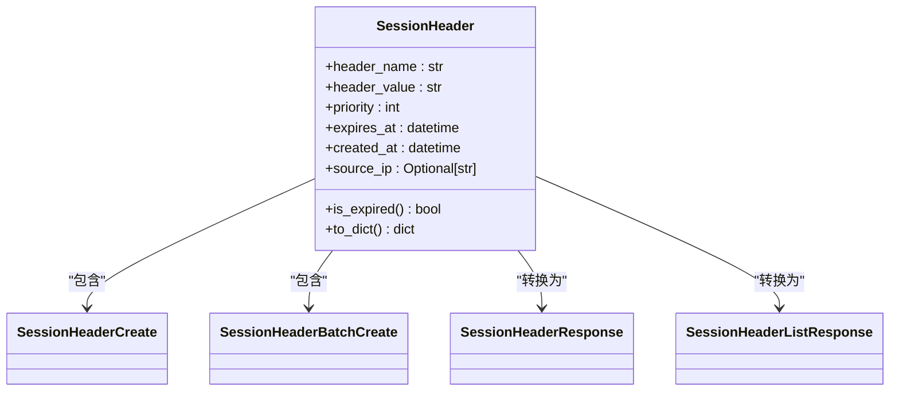

**Diagram sources**
- [SessionHeader.py](file://src/backEnd/model/SessionHeader.py#L5-L32)

**Section sources**
- [SessionHeader.py](file://src/backEnd/model/SessionHeader.py#L5-L32)

### 持久化规则模型

PersistentHeaderRule模型定义了持久化请求头规则的数据结构，与SessionHeader形成互补。持久化规则存储在数据库中，具有更丰富的配置选项。

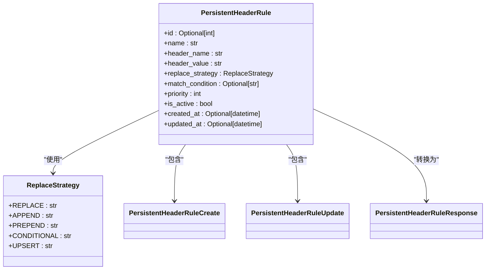

**Diagram sources**
- [PersistentHeaderRule.py](file://src/backEnd/model/PersistentHeaderRule.py#L15-L32)

**Section sources**
- [PersistentHeaderRule.py](file://src/backEnd/model/PersistentHeaderRule.py#L15-L32)

### 数据库存储设计

HeaderDatabase类负责管理请求头相关的数据库操作，采用SQLite作为存储引擎。数据库设计包含两个核心表：persistent_header_rules和session_headers，分别存储持久化规则和会话性请求头。

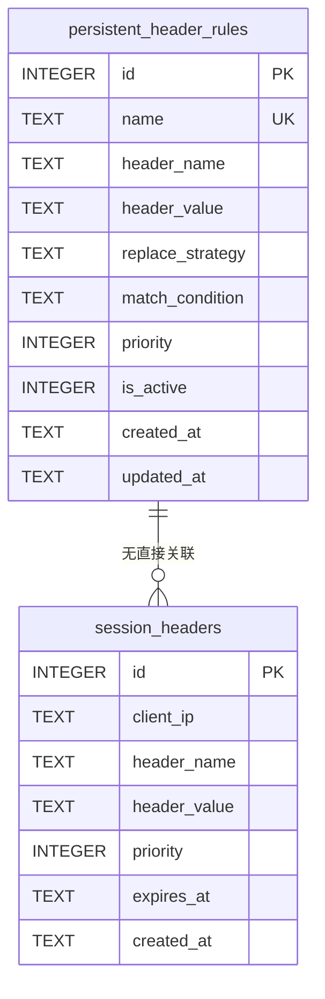

**Diagram sources**
- [HeaderDatabase.py](file://src/backEnd/model/HeaderDatabase.py#L10-L64)

**Section sources**
- [HeaderDatabase.py](file://src/backEnd/model/HeaderDatabase.py#L10-L64)

## 会话头管理器工作流程

### 管理器架构

SessionHeaderManager是会话头管理的核心组件，采用内存存储与数据库持久化相结合的策略。管理器使用defaultdict和threading.Lock实现线程安全的内存存储，同时通过HeaderDatabase实现数据持久化。

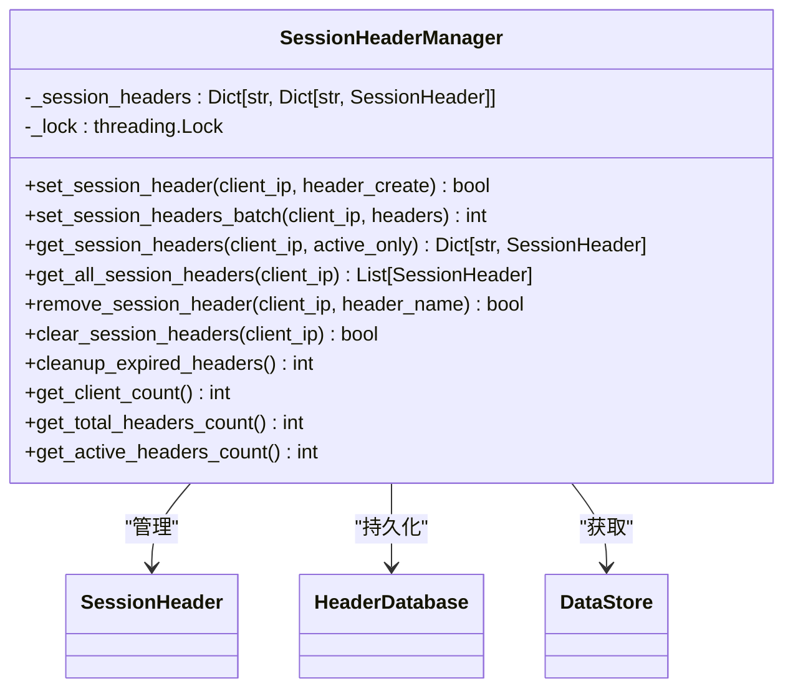

**Diagram sources**
- [session_header_manager.py](file://src/backEnd/utils/session_header_manager.py#L13-L259)

**Section sources**
- [session_header_manager.py](file://src/backEnd/utils/session_header_manager.py#L13-L259)

### 动态加载与缓存策略

会话头管理器实现了高效的动态加载和内存缓存策略。当设置会话头时，管理器首先在内存中更新数据，然后异步持久化到数据库。这种设计确保了读取操作的高性能，同时保证了数据的持久性。

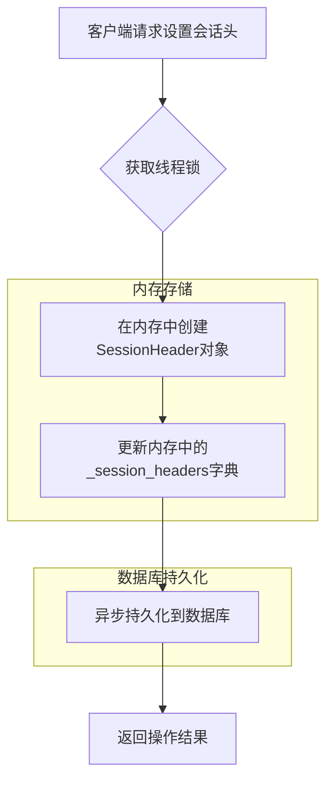

**Diagram sources**
- [session_header_manager.py](file://src/backEnd/utils/session_header_manager.py#L13-L259)

**Section sources**
- [session_header_manager.py](file://src/backEnd/utils/session_header_manager.py#L13-L259)

### 作用域隔离机制

会话头管理器通过客户端IP实现作用域隔离，确保不同客户端的请求头配置相互独立。这种设计支持多用户并发使用，每个用户的会话头配置不会影响其他用户。

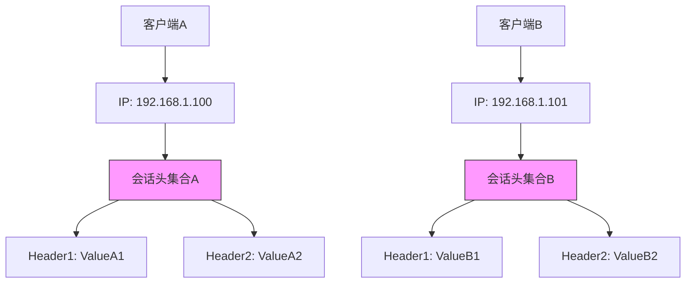

**Diagram sources**
- [session_header_manager.py](file://src/backEnd/utils/session_header_manager.py#L13-L259)

**Section sources**
- [session_header_manager.py](file://src/backEnd/utils/session_header_manager.py#L13-L259)

## 规则优先级与继承机制

### 临时规则与持久化规则优先级

系统采用明确的优先级处理逻辑，确保规则应用的一致性。会话性请求头（临时规则）具有更高的优先级，可以覆盖持久化规则的配置。这种设计允许用户在特定会话中临时修改请求头，而不影响全局配置。

```mermaid
flowchart TD
A[原始请求头] --> B[应用持久化规则]
B --> C[应用会话性请求头]
C --> D[最终请求头]
style B fill:#f96,stroke:#333
style C fill:#6f9,stroke:#333
note right of B
按优先级降序应用
高优先级规则先执行
end note
note right of C
按优先级升序应用
高优先级规则后执行
实现覆盖效果
end note
```

**Diagram sources**
- [header_processor.py](file://src/backEnd/utils/header_processor.py#L10-L241)

**Section sources**
- [header_processor.py](file://src/backEnd/utils/header_processor.py#L10-L241)

### 线程安全保证

在并发任务场景下，会话头管理器通过threading.Lock确保线程安全。所有对共享数据结构的操作都必须获取锁，防止数据竞争和不一致状态。

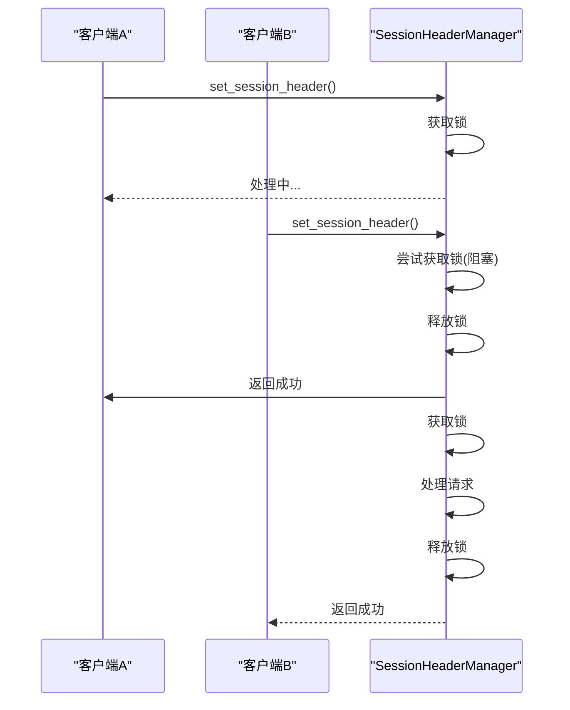

**Diagram sources**
- [session_header_manager.py](file://src/backEnd/utils/session_header_manager.py#L13-L259)

**Section sources**
- [session_header_manager.py](file://src/backEnd/utils/session_header_manager.py#L13-L259)

### 继承机制与覆盖策略

会话规则支持从全局配置继承默认值，并允许任务级覆盖。DataStore类作为全局数据存储中心，通过get_session_header_manager()方法提供会话头管理器的单例实例，确保配置的一致性。

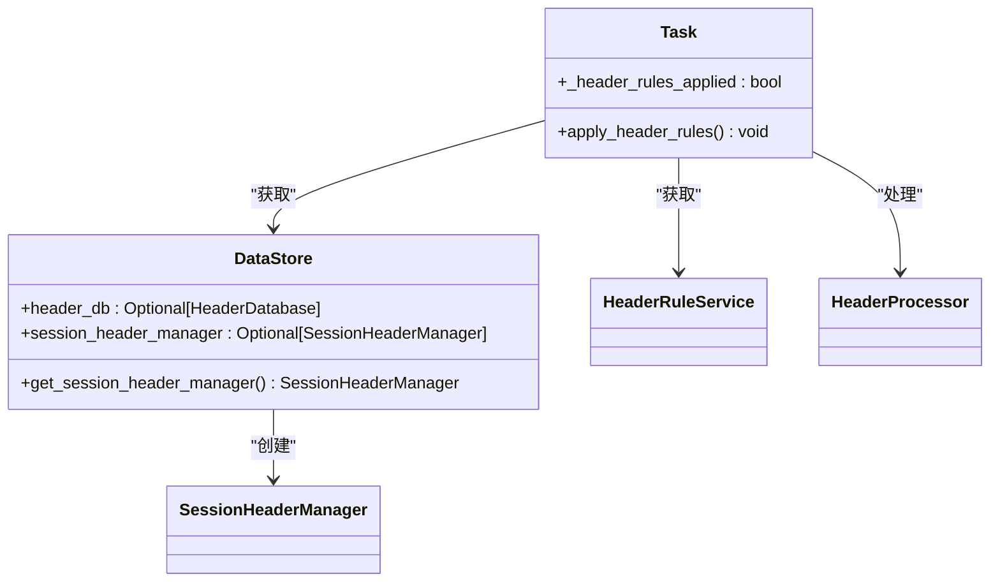

**Diagram sources**
- [DataStore.py](file://src/backEnd/model/DataStore.py#L8-L32)
- [Task.py](file://src/backEnd/model/Task.py#L18-L205)

**Section sources**
- [DataStore.py](file://src/backEnd/model/DataStore.py#L8-L32)
- [Task.py](file://src/backEnd/model/Task.py#L18-L205)

## 性能优化方案

### 快速查找算法

系统采用多种优化策略提升规则匹配性能。数据库层面创建了多个索引，包括idx_header_rules_active、idx_header_rules_priority和idx_header_rules_name，显著提高了查询效率。

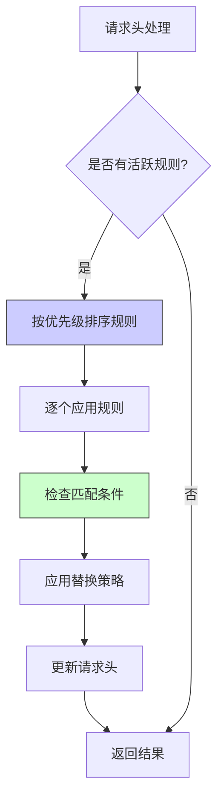

**Diagram sources**
- [headerRuleService.py](file://src/backEnd/service/headerRuleService.py#L10-L799)

**Section sources**
- [headerRuleService.py](file://src/backEnd/service/headerRuleService.py#L10-L799)

### 缓存失效策略

会话头管理器实现了智能的缓存失效策略，定期清理已过期的会话头。cleanup_expired_headers()方法同时清理内存和数据库中的过期数据，确保数据一致性。

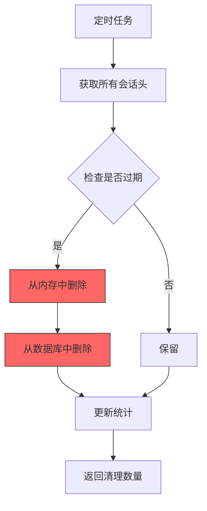

**Diagram sources**
- [session_header_manager.py](file://src/backEnd/utils/session_header_manager.py#L13-L259)

**Section sources**
- [session_header_manager.py](file://src/backEnd/utils/session_header_manager.py#L13-L259)

## 实际应用时序图

### 扫描流程中的应用

会话规则在扫描流程中的应用时序展示了从任务创建到规则应用的完整过程。规则在任务初始化时立即应用，确保扫描过程使用正确的请求头配置。

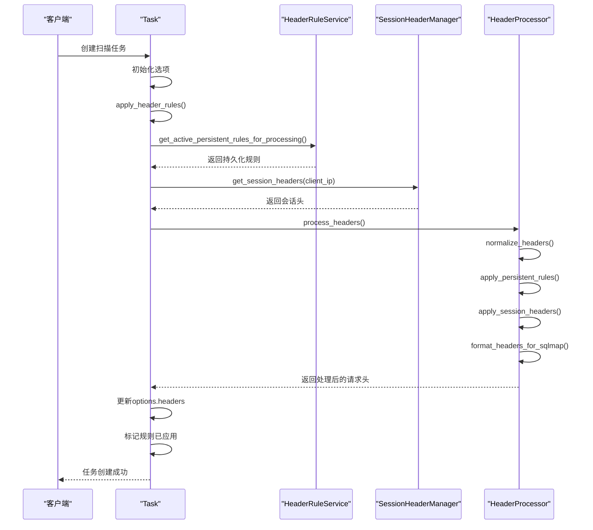

**Diagram sources**
- [Task.py](file://src/backEnd/model/Task.py#L18-L205)
- [header_processor.py](file://src/backEnd/utils/header_processor.py#L10-L241)

**Section sources**
- [Task.py](file://src/backEnd/model/Task.py#L18-L205)
- [header_processor.py](file://src/backEnd/utils/header_processor.py#L10-L241)

## 结论

会话级头规则系统通过精心设计的模型和高效的管理机制，实现了灵活、安全、高性能的请求头管理。SessionHeader模型与PersistentHeaderRule模型的协同工作，提供了临时和持久两种配置方式，满足了不同场景的需求。会话头管理器的内存存储与数据库持久化结合策略，在保证数据持久性的同时提供了卓越的性能表现。

系统的优先级处理逻辑和继承机制设计合理，确保了规则应用的一致性和可预测性。在并发场景下，通过线程锁机制保证了数据的安全性。性能优化方面，数据库索引和缓存失效策略的运用，使得系统能够高效处理大量规则匹配请求。

该系统的设计充分考虑了实际应用场景，从任务创建到扫描执行的完整流程中，会话规则都能及时、准确地应用，为SQLMap扫描提供了可靠的请求头配置支持。未来可以考虑增加更复杂的匹配条件和更精细的优先级控制，进一步提升系统的灵活性和实用性。