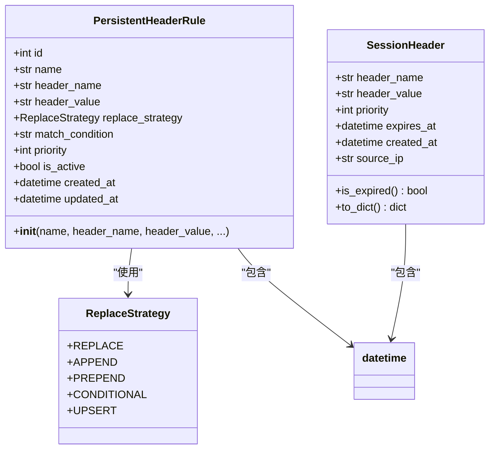
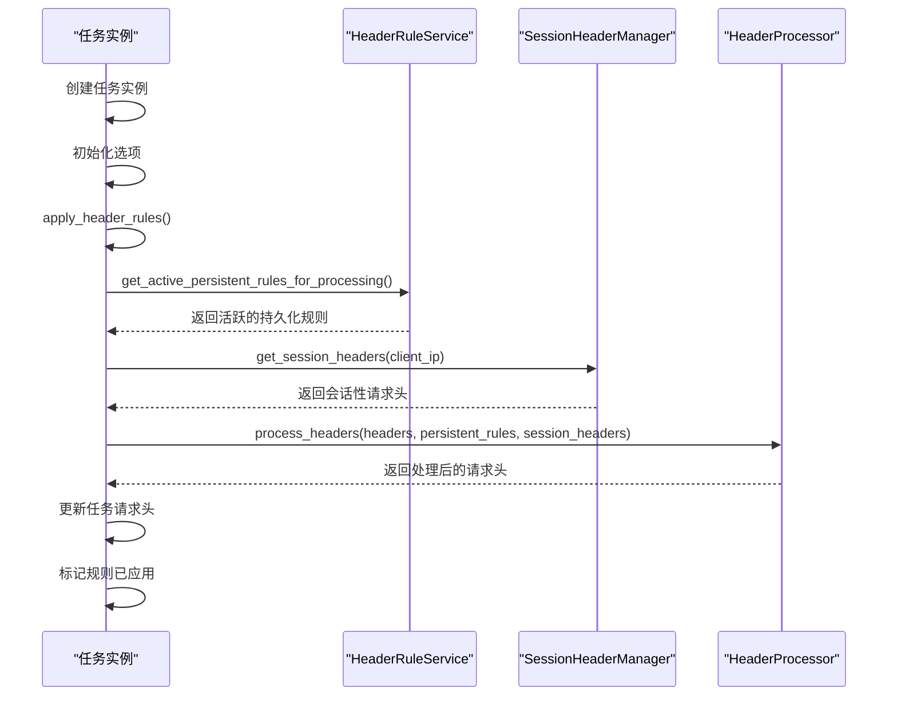
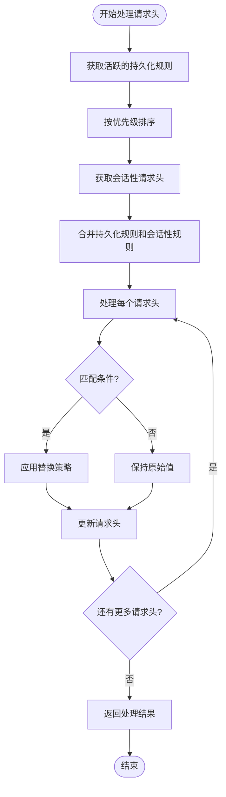
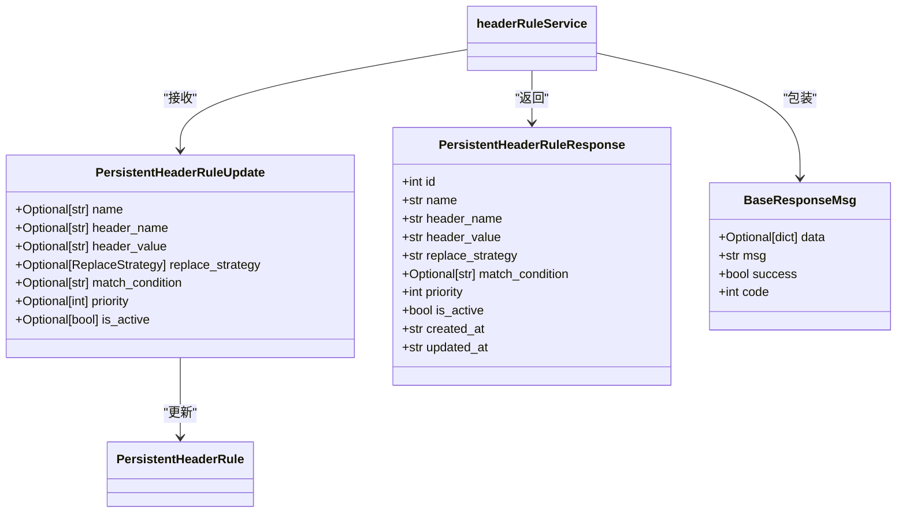
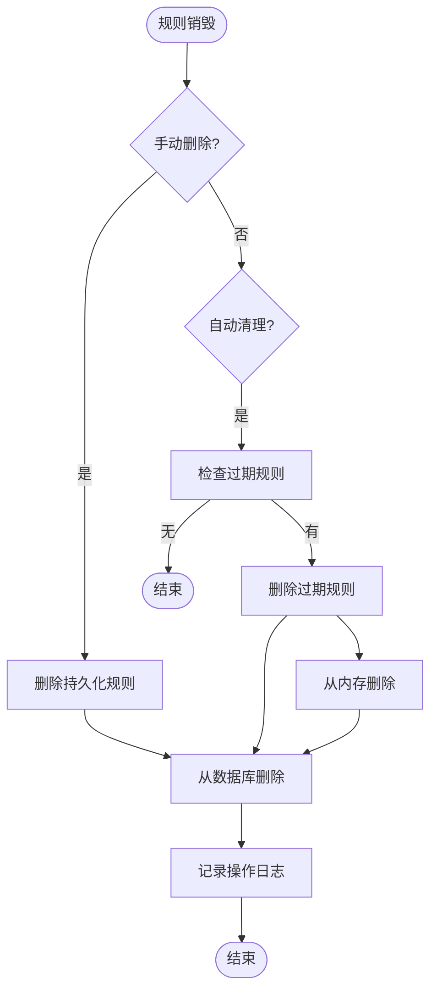
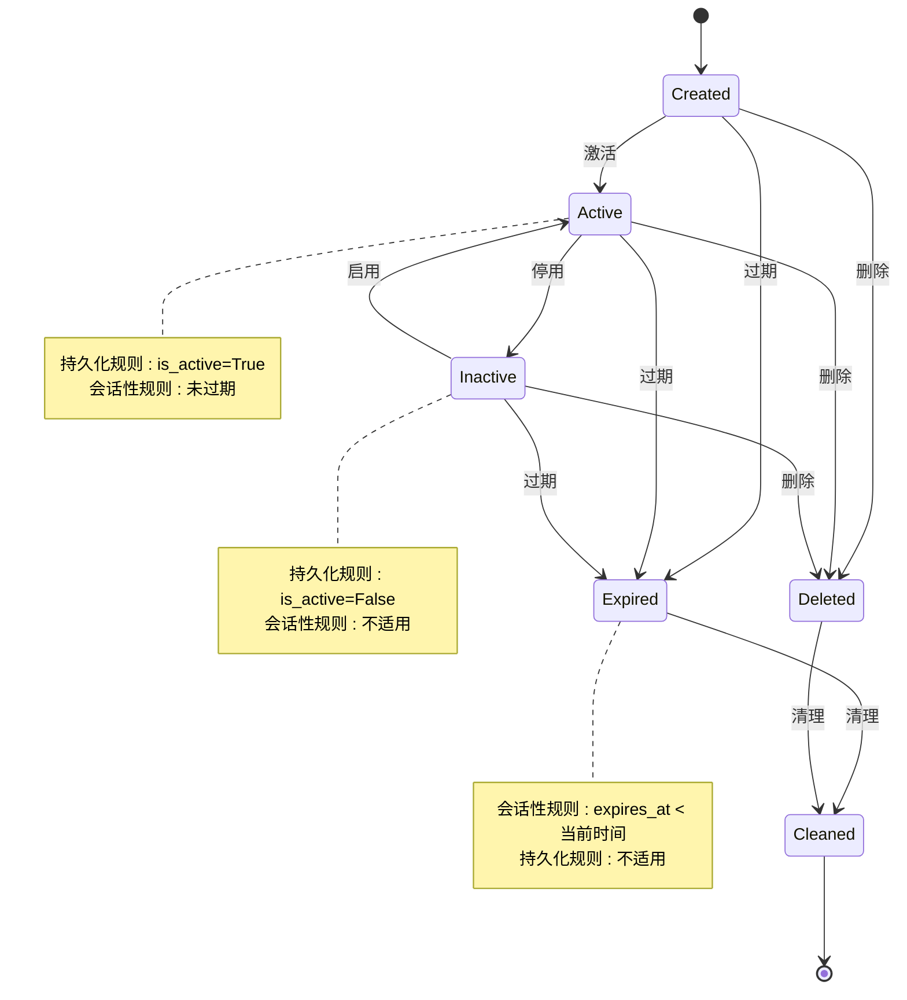
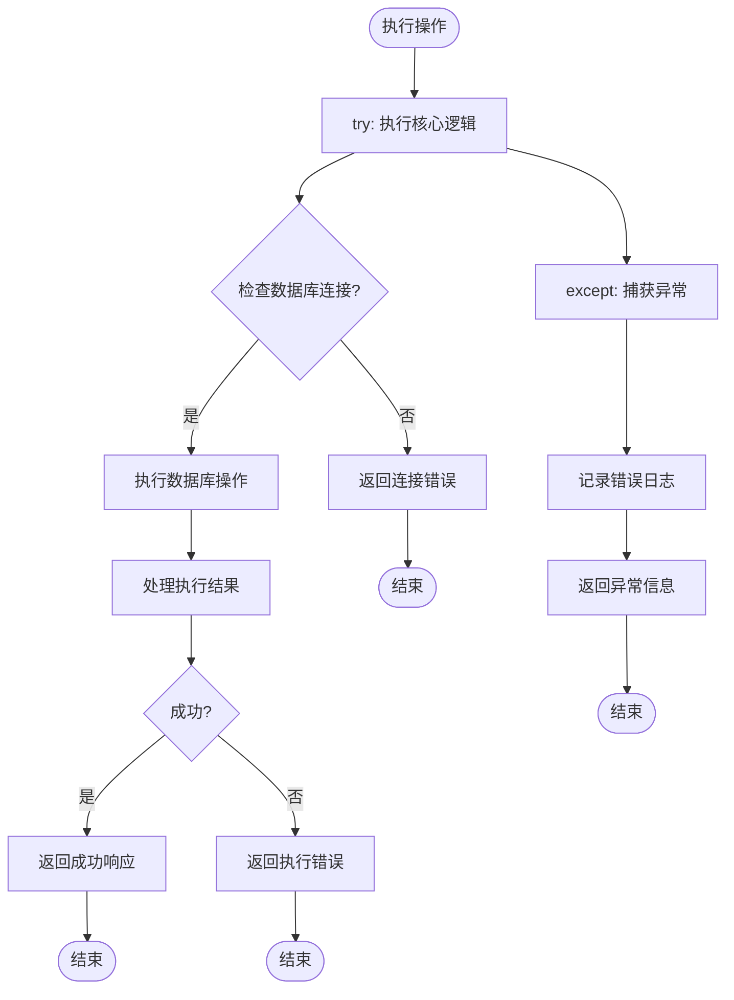

# 会话规则生命周期

<cite>
**本文档引用文件**   
- [PersistentHeaderRule.py](file://src/backEnd/model/PersistentHeaderRule.py)
- [SessionHeader.py](file://src/backEnd/model/SessionHeader.py)
- [headerRuleService.py](file://src/backEnd/service/headerRuleService.py)
- [session_header_manager.py](file://src/backEnd/utils/session_header_manager.py)
- [Task.py](file://src/backEnd/model/Task.py)
</cite>

## 目录
1. [引言](#引言)
2. [会话规则创建](#会话规则创建)
3. [规则激活机制](#规则激活机制)
4. [规则应用与匹配](#规则应用与匹配)
5. [规则更新策略](#规则更新策略)
6. [规则销毁与清理](#规则销毁与清理)
7. [生命周期状态转换](#生命周期状态转换)
8. [异常处理与资源回收](#异常处理与资源回收)

## 引言
本文档详细阐述会话级头规则从创建到销毁的完整生命周期管理流程。系统分析了规则的创建、激活、应用、更新和销毁等各个阶段的实现机制，重点说明了持久化规则和会话性规则的生命周期管理，以及在SQLMap扫描任务中的应用流程。

**Section sources**
- [PersistentHeaderRule.py](file://src/backEnd/model/PersistentHeaderRule.py#L1-L68)
- [SessionHeader.py](file://src/backEnd/model/SessionHeader.py#L1-L61)

## 会话规则创建

会话规则分为持久化规则和会话性规则两种类型。持久化规则存储在数据库中，具有长期有效性；会话性规则存储在内存中，具有时效性。

持久化规则通过`headerRuleService.create_persistent_rule`方法创建，需要提供规则名称、请求头名称、请求头值、替换策略、匹配条件、优先级等信息。系统会验证数据的有效性，并检查规则名称是否已存在。

会话性规则通过`session_header_manager.SessionHeaderManager.set_session_header`方法创建，除了基本的请求头信息外，还需要指定生存时间(TTL)，系统会根据TTL计算过期时间。

**Diagram sources **
- [PersistentHeaderRule.py](file://src/backEnd/model/PersistentHeaderRule.py#L15-L32)
- [SessionHeader.py](file://src/backEnd/model/SessionHeader.py#L5-L32)

**Section sources**
- [headerRuleService.py](file://src/backEnd/service/headerRuleService.py#L74-L167)
- [session_header_manager.py](file://src/backEnd/utils/session_header_manager.py#L26-L85)

## 规则激活机制

规则在任务启动时动态绑定会话头。当创建新的扫描任务时，系统会自动应用相关的请求头规则。`Task.apply_header_rules`方法负责在SQLMap扫描启动前应用请求头规则。

该方法首先检查是否已经应用过规则，避免重复处理。然后获取所有活跃的持久化规则和当前客户端的会话性规则，通过`HeaderProcessor.process_headers`方法处理原始请求头，生成最终的请求头列表。

**Diagram sources **
- [Task.py](file://src/backEnd/model/Task.py#L76-L136)
- [headerRuleService.py](file://src/backEnd/service/headerRuleService.py#L488-L532)
- [session_header_manager.py](file://src/backEnd/utils/session_header_manager.py#L97-L117)

**Section sources**
- [Task.py](file://src/backEnd/model/Task.py#L76-L136)

## 规则应用与匹配

规则在扫描过程中通过优先级和匹配条件进行应用。系统按照优先级从高到低的顺序处理规则，优先级相同的规则按创建时间排序。

持久化规则的匹配策略包括：完全替换(REPLACE)、追加(APPEND)、前置(PREPEND)、条件性替换(CONDITIONAL)和UPSERT。系统根据配置的策略对请求头进行相应处理。

会话性规则与持久化规则合并处理，会话性规则具有更高的优先级。在处理请求头时，系统会同时考虑两种规则，确保会话性规则能够覆盖持久化规则。

**Diagram sources **
- [headerRuleService.py](file://src/backEnd/service/headerRuleService.py#L488-L532)
- [session_header_manager.py](file://src/backEnd/utils/session_header_manager.py#L97-L117)
- [Task.py](file://src/backEnd/model/Task.py#L76-L136)

**Section sources**
- [headerRuleService.py](file://src/backEnd/service/headerRuleService.py#L488-L532)
- [Task.py](file://src/backEnd/model/Task.py#L76-L136)

## 规则更新策略

系统支持持久化规则的热更新机制。通过`headerRuleService.update_persistent_rule`方法可以更新规则的各个属性，包括名称、请求头名称、请求头值、替换策略、匹配条件、优先级和启用状态。

更新操作会自动更新规则的`updated_at`时间戳，并在数据库中持久化更改。系统会检查新规则名称是否与其他规则冲突，确保数据的一致性。

会话性规则的更新通过重新设置实现，新的会话性规则会覆盖同名的旧规则。由于会话性规则存储在内存中，更新操作具有即时生效的特点。

**Diagram sources **
- [headerRuleService.py](file://src/backEnd/service/headerRuleService.py#L302-L434)
- [PersistentHeaderRule.py](file://src/backEnd/model/PersistentHeaderRule.py#L45-L60)

**Section sources**
- [headerRuleService.py](file://src/backEnd/service/headerRuleService.py#L302-L434)

## 规则销毁与清理

规则销毁包括手动删除和自动清理两种方式。持久化规则通过`headerRuleService.delete_persistent_rule`方法手动删除，系统会从数据库中移除对应的记录。

会话性规则的销毁有多种方式：`remove_session_header`删除单个规则，`clear_session_headers`清除指定客户端的所有规则，`cleanup_expired_headers`清理所有已过期的规则。

系统会定期执行过期规则清理，确保内存中不会积累无效的会话性规则。清理操作会同时从内存和数据库中删除过期的记录，保持数据一致性。

**Diagram sources **
- [headerRuleService.py](file://src/backEnd/service/headerRuleService.py#L436-L486)
- [session_header_manager.py](file://src/backEnd/utils/session_header_manager.py#L131-L185)
- [session_header_manager.py](file://src/backEnd/utils/session_header_manager.py#L187-L236)

**Section sources**
- [headerRuleService.py](file://src/backEnd/service/headerRuleService.py#L436-L486)
- [session_header_manager.py](file://src/backEnd/utils/session_header_manager.py#L131-L236)

## 生命周期状态转换

会话规则的生命周期包含创建、激活、应用、更新和销毁等状态。持久化规则的状态主要由`is_active`字段控制，而会话性规则的状态由过期时间决定。

系统通过状态转换图管理规则的生命周期，确保规则在不同状态间的转换符合业务逻辑。例如，已删除的规则不能被重新激活，过期的会话性规则会被自动清理。

**Diagram sources **
- [PersistentHeaderRule.py](file://src/backEnd/model/PersistentHeaderRule.py#L24-L24)
- [SessionHeader.py](file://src/backEnd/model/SessionHeader.py#L10-L10)
- [session_header_manager.py](file://src/backEnd/utils/session_header_manager.py#L14-L16)

**Section sources**
- [PersistentHeaderRule.py](file://src/backEnd/model/PersistentHeaderRule.py#L1-L68)
- [SessionHeader.py](file://src/backEnd/model/SessionHeader.py#L1-L61)

## 异常处理与资源回收

系统在各个关键环节都实现了完善的异常处理机制。在规则创建、更新、删除和应用过程中，任何操作失败都会被捕获并记录日志，同时返回适当的错误信息。

资源回收主要针对会话性规则，系统通过`cleanup_expired_headers`方法定期清理过期的规则，防止内存泄漏。该方法使用线程锁确保操作的原子性，避免并发访问导致的数据不一致。

对于数据库操作，系统实现了连接有效性检查，确保在执行数据库操作前连接处于可用状态。如果数据库连接不可用，相关操作会返回服务不可用的错误。

**Diagram sources **
- [headerRuleService.py](file://src/backEnd/service/headerRuleService.py#L74-L167)
- [headerRuleService.py](file://src/backEnd/service/headerRuleService.py#L38-L55)
- [session_header_manager.py](file://src/backEnd/utils/session_header_manager.py#L26-L85)

**Section sources**
- [headerRuleService.py](file://src/backEnd/service/headerRuleService.py#L74-L486)
- [session_header_manager.py](file://src/backEnd/utils/session_header_manager.py#L26-L236)