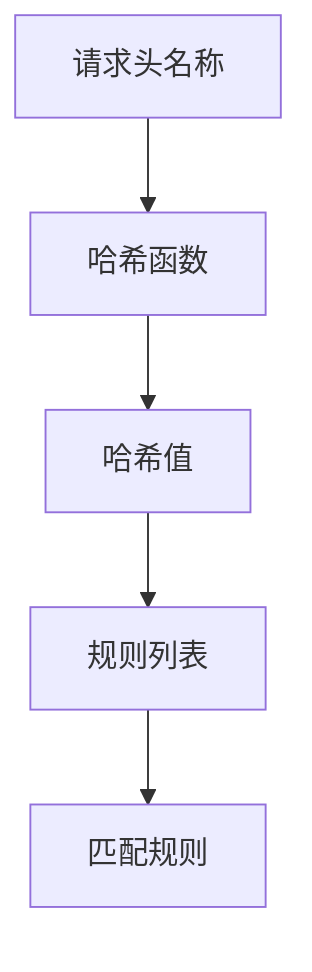
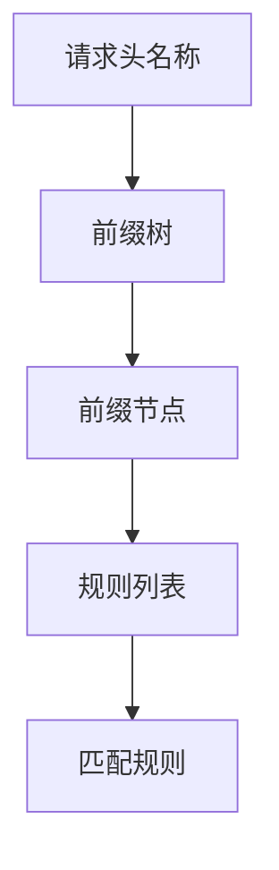
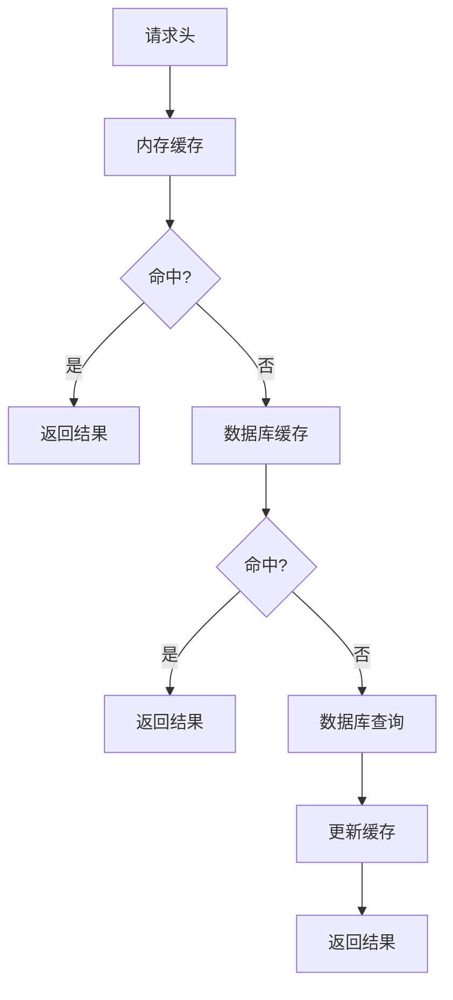
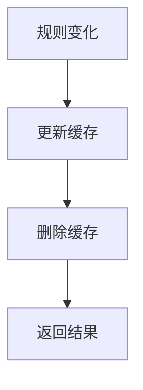
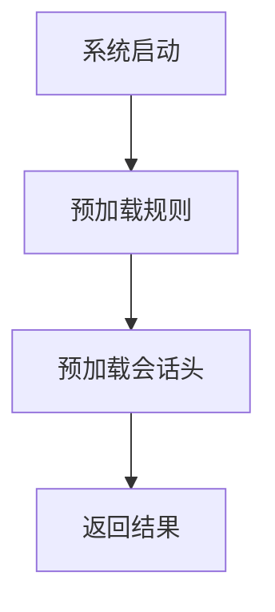
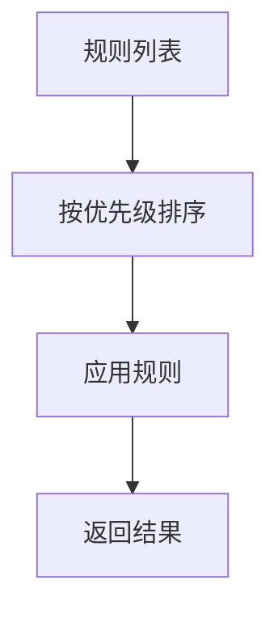
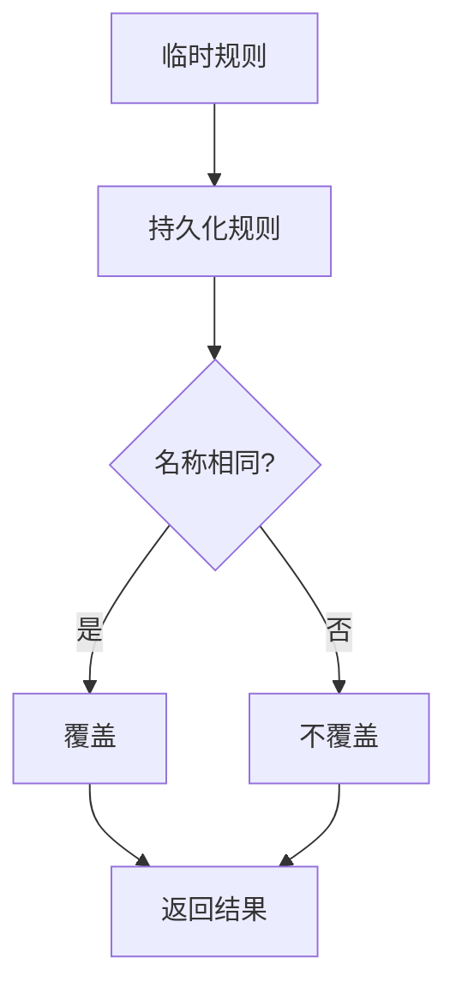
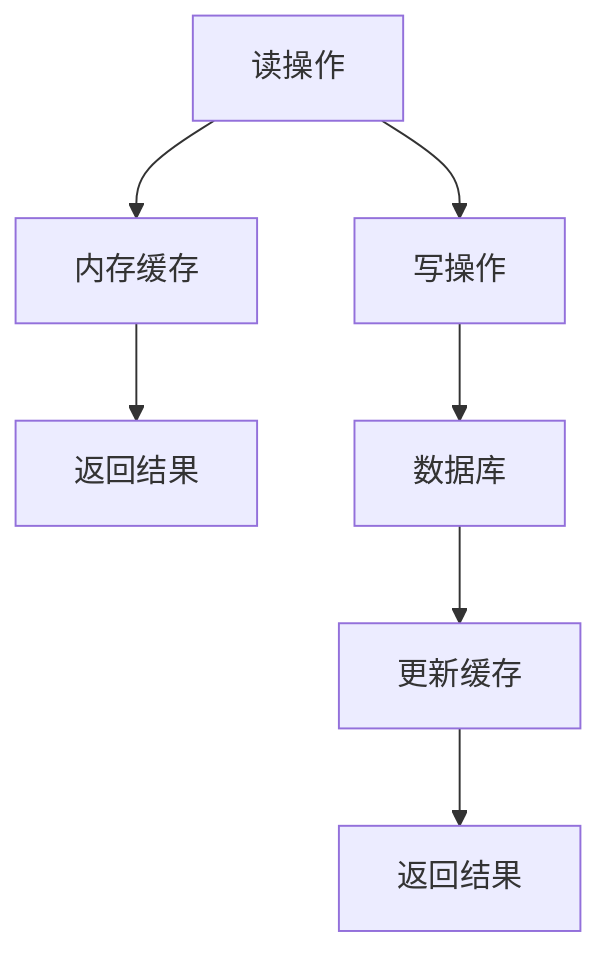
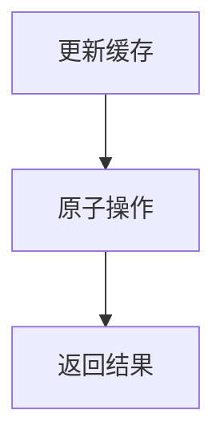

# 性能优化与匹配策略

<cite>
**本文档引用文件**   
- [PersistentHeaderRule.py](file://src/backEnd/model/PersistentHeaderRule.py)
- [SessionHeader.py](file://src/backEnd/model/SessionHeader.py)
- [headerRuleService.py](file://src/backEnd/service/headerRuleService.py)
- [session_header_manager.py](file://src/backEnd/utils/session_header_manager.py)
- [header_processor.py](file://src/backEnd/utils/header_processor.py)
- [HeaderDatabase.py](file://src/backEnd/model/HeaderDatabase.py)
- [DataStore.py](file://src/backEnd/model/DataStore.py)
</cite>

## 目录
1. [引言](#引言)
2. [核心组件分析](#核心组件分析)
3. [会话头规则匹配性能瓶颈分析](#会话头规则匹配性能瓶颈分析)
4. [快速查找算法设计](#快速查找算法设计)
5. [内存缓存策略](#内存缓存策略)
6. [规则优先级处理逻辑](#规则优先级处理逻辑)
7. [并发访问优化方案](#并发访问优化方案)
8. [性能测试基准与调优建议](#性能测试基准与调优建议)
9. [大规模并发任务扩展性考虑](#大规模并发任务扩展性考虑)

## 引言
本文档旨在深入分析会话头规则匹配的性能瓶颈，并提出多层次优化方案。文档详细阐述了快速查找算法的设计原理，包括哈希索引构建和前缀匹配优化。同时，说明了内存缓存策略，包括缓存层级设计、失效机制和预加载策略。此外，文档解释了规则优先级处理逻辑，如何高效实现临时规则对持久化规则的覆盖。最后，提供了并发访问优化方案，包括读写分离和无锁数据结构的应用，以及性能测试基准数据和调优建议，以及在大规模并发任务场景下的扩展性考虑。

## 核心组件分析

### 持久化请求头规则模型
持久化请求头规则模型定义了请求头规则的数据结构，包括规则名称、请求头名称、请求头值、替换策略、匹配条件、优先级、是否启用等字段。该模型还定义了创建、更新和响应模型，用于处理请求和响应数据。

**Section sources**
- [PersistentHeaderRule.py](file://src/backEnd/model/PersistentHeaderRule.py#L15-L32)

### 会话性请求头模型
会话性请求头模型定义了会话性请求头的数据结构，包括请求头名称、请求头值、优先级、过期时间、创建时间和来源IP等字段。该模型还定义了创建、批量创建、响应和列表响应模型，用于处理请求和响应数据。

**Section sources**
- [SessionHeader.py](file://src/backEnd/model/SessionHeader.py#L5-L32)

### 请求头规则服务
请求头规则服务层处理持久化规则和会话性请求头的业务逻辑。该服务提供了创建、获取、更新和删除持久化规则的方法，以及预览请求头处理结果和批量操作的方法。

**Section sources**
- [headerRuleService.py](file://src/backEnd/service/headerRuleService.py#L32-L776)

### 会话性请求头管理器
会话性请求头管理器负责内存存储临时会话请求头。该管理器提供了设置、获取、删除和清理会话性请求头的方法，以及获取客户端数量、总请求数量和活跃请求数量的方法。

**Section sources**
- [session_header_manager.py](file://src/backEnd/utils/session_header_manager.py#L13-L259)

### 请求头处理器
请求头处理器负责应用持久化规则和会话性请求头。该处理器提供了规范化请求头、格式化请求头、验证请求头名称、应用替换策略、匹配条件、应用持久化规则、应用会话性请求头、处理请求头和预览请求头处理结果的方法。

**Section sources**
- [header_processor.py](file://src/backEnd/utils/header_processor.py#L10-L241)

### 请求头数据库
请求头数据库是独立的请求头管理数据库，负责初始化请求头管理数据库表，包括持久化请求头规则表和会话性请求头表。该数据库还创建了索引以提高查询性能。

**Section sources**
- [HeaderDatabase.py](file://src/backEnd/model/HeaderDatabase.py#L15-L64)

### 数据存储
数据存储类提供了全局数据存储功能，包括管理员令牌、当前数据库、请求头数据库、任务锁、任务、用户名、密码、首次签到监控、最大任务数、最大任务数锁、会话性请求头管理器和会话性请求头管理器锁。该类还提供了获取会话性请求头管理器单例的方法。

**Section sources**
- [DataStore.py](file://src/backEnd/model/DataStore.py#L15-L33)

## 会话头规则匹配性能瓶颈分析

### 规则匹配流程
会话头规则匹配流程包括以下几个步骤：
1. 获取持久化规则：从数据库中获取所有活跃的持久化规则。
2. 获取会话性请求头：从内存中获取指定客户端的会话性请求头。
3. 应用持久化规则：将持久化规则应用到请求头字典中。
4. 应用会话性请求头：将会话性请求头应用到请求头字典中。
5. 转换回SQLMap格式：将处理后的请求头字典转换回SQLMap所需的列表格式。

### 性能瓶颈
1. **数据库查询**：每次获取持久化规则都需要查询数据库，这可能导致性能瓶颈。
2. **内存访问**：每次获取会话性请求头都需要访问内存，这可能导致性能瓶颈。
3. **规则匹配**：每次应用持久化规则和会话性请求头都需要遍历规则列表，这可能导致性能瓶颈。
4. **字符串操作**：每次处理请求头都需要进行字符串操作，这可能导致性能瓶颈。

**Section sources**
- [headerRuleService.py](file://src/backEnd/service/headerRuleService.py#L32-L776)
- [session_header_manager.py](file://src/backEnd/utils/session_header_manager.py#L13-L259)
- [header_processor.py](file://src/backEnd/utils/header_processor.py#L10-L241)

## 快速查找算法设计

### 哈希索引构建
为了提高规则匹配的性能，可以构建哈希索引。哈希索引可以将请求头名称映射到规则列表，从而快速查找匹配的规则。

**Diagram sources**
- [header_processor.py](file://src/backEnd/utils/header_processor.py#L10-L241)

### 前缀匹配优化
为了提高前缀匹配的性能，可以使用前缀树（Trie）数据结构。前缀树可以将请求头名称的前缀映射到规则列表，从而快速查找匹配的规则。

**Diagram sources**
- [header_processor.py](file://src/backEnd/utils/header_processor.py#L10-L241)

## 内存缓存策略

### 缓存层级设计
为了提高性能，可以设计多层级缓存。第一层级是内存缓存，用于存储会话性请求头；第二层级是数据库缓存，用于存储持久化规则。

**Diagram sources**
- [session_header_manager.py](file://src/backEnd/utils/session_header_manager.py#L13-L259)
- [headerRuleService.py](file://src/backEnd/service/headerRuleService.py#L32-L776)

### 失效机制
为了保证缓存的一致性，需要设计失效机制。当持久化规则或会话性请求头发生变化时，需要更新或删除相应的缓存。

**Diagram sources**
- [session_header_manager.py](file://src/backEnd/utils/session_header_manager.py#L13-L259)
- [headerRuleService.py](file://src/backEnd/service/headerRuleService.py#L32-L776)

### 预加载策略
为了提高性能，可以设计预加载策略。在系统启动时，可以预加载常用的持久化规则和会话性请求头到内存中。

**Diagram sources**
- [DataStore.py](file://src/backEnd/model/DataStore.py#L15-L33)

## 规则优先级处理逻辑

### 优先级排序
为了实现临时规则对持久化规则的覆盖，需要对规则进行优先级排序。优先级高的规则先执行，优先级低的规则后执行。

**Diagram sources**
- [header_processor.py](file://src/backEnd/utils/header_processor.py#L10-L241)

### 覆盖逻辑
当临时规则和持久化规则的请求头名称相同时，临时规则会覆盖持久化规则。这是因为临时规则的优先级通常高于持久化规则。

**Diagram sources**
- [header_processor.py](file://src/backEnd/utils/header_processor.py#L10-L241)

## 并发访问优化方案

### 读写分离
为了提高并发性能，可以采用读写分离策略。读操作可以从内存缓存中获取数据，写操作需要更新数据库和缓存。

**Diagram sources**
- [session_header_manager.py](file://src/backEnd/utils/session_header_manager.py#L13-L259)
- [headerRuleService.py](file://src/backEnd/service/headerRuleService.py#L32-L776)

### 无锁数据结构
为了提高并发性能，可以使用无锁数据结构。例如，可以使用原子操作来更新缓存，避免使用锁。

**Diagram sources**
- [session_header_manager.py](file://src/backEnd/utils/session_header_manager.py#L13-L259)

## 性能测试基准与调优建议

### 性能测试基准
为了评估优化效果，需要进行性能测试。测试内容包括：
1. **规则匹配性能**：测试不同数量的规则匹配性能。
2. **内存访问性能**：测试不同数量的会话性请求头访问性能。
3. **数据库查询性能**：测试不同数量的持久化规则查询性能。
4. **字符串操作性能**：测试不同数量的请求头处理性能。

### 调优建议
1. **增加缓存**：增加内存缓存和数据库缓存，减少数据库查询和内存访问。
2. **优化索引**：优化数据库索引，提高查询性能。
3. **减少字符串操作**：减少字符串操作，提高处理性能。
4. **使用无锁数据结构**：使用无锁数据结构，提高并发性能。

**Section sources**
- [header_processor.py](file://src/backEnd/utils/header_processor.py#L10-L241)
- [session_header_manager.py](file://src/backEnd/utils/session_header_manager.py#L13-L259)
- [headerRuleService.py](file://src/backEnd/service/headerRuleService.py#L32-L776)

## 大规模并发任务扩展性考虑

### 扩展性设计
为了支持大规模并发任务，需要设计扩展性方案。方案包括：
1. **分布式缓存**：使用分布式缓存，如Redis，提高缓存性能。
2. **数据库分片**：使用数据库分片，提高数据库性能。
3. **负载均衡**：使用负载均衡，提高系统性能。

### 扩展性测试
为了评估扩展性，需要进行扩展性测试。测试内容包括：
1. **并发性能**：测试不同数量的并发任务性能。
2. **扩展性能**：测试不同数量的节点扩展性能。
3. **故障恢复**：测试故障恢复性能。

**Section sources**
- [session_header_manager.py](file://src/backEnd/utils/session_header_manager.py#L13-L259)
- [headerRuleService.py](file://src/backEnd/service/headerRuleService.py#L32-L776)
- [DataStore.py](file://src/backEnd/model/DataStore.py#L15-L33)