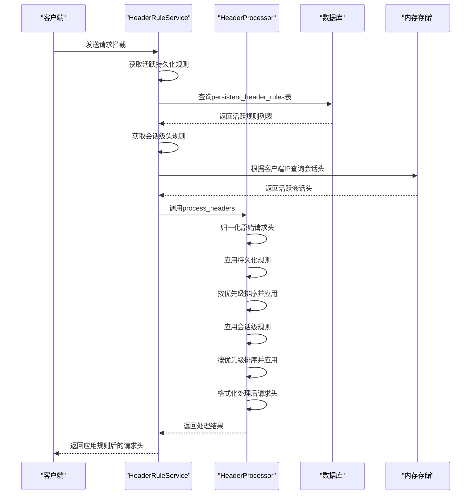

# 头规则管理

<cite>
**本文档引用文件**   
- [headerRuleService.py](file://src/backEnd/service/headerRuleService.py)
- [PersistentHeaderRule.py](file://src/backEnd/model/PersistentHeaderRule.py)
- [SessionHeader.py](file://src/backEnd/model/SessionHeader.py)
- [session_header_manager.py](file://src/backEnd/utils/session_header_manager.py)
- [header_processor.py](file://src/backEnd/utils/header_processor.py)
- [header_parser.py](file://src/backEnd/utils/header_parser.py)
- [HeaderBatch.py](file://src/backEnd/model/HeaderBatch.py)
</cite>

## 目录
1. [引言](#引言)
2. [持久化头规则管理](#持久化头规则管理)
3. [会话级头规则管理](#会话级头规则管理)
4. [规则匹配引擎](#规则匹配引擎)
5. [批量导入导出功能](#批量导入导出功能)
6. [会话头管理器](#会话头管理器)
7. [规则匹配流程时序图](#规则匹配流程时序图)
8. [规则语法与性能优化](#规则语法与性能优化)
9. [扩展接口说明](#扩展接口说明)

## 引言
头规则管理功能是系统中用于处理HTTP请求头的核心模块，主要包含持久化头规则和会话级头规则的管理。该功能通过`headerRuleService.py`中的`HeaderRuleService`类实现，提供了对请求头规则的增删改查操作、规则匹配引擎、批量导入导出以及动态应用规则到具体任务请求中的能力。本技术文档将深入剖析该功能的实现机制和工作原理。

## 持久化头规则管理

头规则服务提供了完整的持久化头规则管理机制，包括创建、读取、更新和删除（CRUD）操作。这些规则存储在数据库中，具有持久性，适用于需要长期生效的请求头配置。

### 创建持久化规则
创建持久化规则时，系统会执行以下步骤：
1. 验证数据库连接有效性
2. 检查规则数据的完整性（规则名称、请求头名称、请求头值不能为空）
3. 验证请求头名称格式的合法性
4. 检查规则名称是否已存在
5. 将新规则插入数据库

规则创建过程中使用了事务处理，确保数据的一致性。每个规则包含名称、请求头名称、请求头值、替换策略、匹配条件、优先级和启用状态等属性。

### 读取持久化规则
系统提供了多种读取持久化规则的方法：
- 获取所有持久化规则列表
- 根据ID获取特定规则
- 获取用于处理的活跃规则列表

读取操作支持按优先级降序排序，确保高优先级规则优先处理。查询结果包含规则的完整信息，并可选择只返回启用状态的规则。

### 更新持久化规则
更新持久化规则时，系统会：
1. 验证数据库连接
2. 检查规则是否存在
3. 构建动态更新SQL语句，只更新提供的字段
4. 执行更新操作
5. 返回更新后的规则信息

更新操作支持部分字段更新，未提供的字段保持原值不变。系统还会检查新规则名称是否与其他规则冲突。

### 删除持久化规则
删除操作会：
1. 验证数据库连接
2. 检查规则是否存在
3. 从数据库中删除指定ID的规则
4. 记录删除日志

删除操作是不可逆的，因此在执行前会进行存在性验证。

**Section sources**
- [headerRuleService.py](file://src/backEnd/service/headerRuleService.py#L74-L486)

## 会话级头规则管理

会话级头规则是临时性的请求头配置，存储在内存中，具有生存时间（TTL）限制，适用于特定会话或临时需求。

### 会话头管理器
`SessionHeaderManager`类负责管理会话级头规则，其主要特性包括：
- 使用线程锁保证并发安全
- 内存存储结构为嵌套字典：`{client_ip: {header_name: SessionHeader}}`
- 支持按客户端IP管理会话头
- 提供过期检查机制

### 会话头操作
会话头管理器提供以下操作：
- `set_session_header`：设置单个会话头
- `set_session_headers_batch`：批量设置会话头
- `get_session_headers`：获取指定客户端的会话头
- `remove_session_header`：删除指定会话头
- `clear_session_headers`：清除指定客户端的所有会话头
- `cleanup_expired_headers`：清理所有已过期的会话头

会话头在设置时会同时持久化到数据库，确保服务重启后仍能恢复部分状态。

**Section sources**
- [session_header_manager.py](file://src/backEnd/utils/session_header_manager.py#L13-L259)
- [SessionHeader.py](file://src/backEnd/model/SessionHeader.py#L5-L32)

## 规则匹配引擎

规则匹配引擎负责将持久化规则和会话级规则应用到原始请求头中，生成最终的请求头配置。

### 规则优先级处理
规则处理遵循以下优先级顺序：
1. 按优先级数值降序排序持久化规则
2. 按优先级数值升序排序会话头（高优先级后执行，可覆盖低优先级）
3. 先应用持久化规则，再应用会话头

这种处理顺序确保了高优先级规则能够覆盖低优先级规则。

### 作用域控制
规则的作用域通过以下方式控制：
- 持久化规则：全局作用域，对所有请求生效
- 会话级规则：基于客户端IP的作用域，只对特定客户端生效
- 匹配条件：通过正则表达式匹配请求头值，实现条件性应用

### 冲突解决策略
当多个规则影响同一请求头时，系统采用以下策略解决冲突：
1. 优先级高的规则覆盖优先级低的规则
2. 会话级规则覆盖持久化规则（因为会话头处理在后）
3. 根据替换策略决定具体行为

### 替换策略
系统支持多种替换策略：
- **REPLACE**：完全替换现有值
- **APPEND**：追加到现有值后面
- **PREPEND**：前置到现有值前面
- **CONDITIONAL**：条件性替换
- **UPSERT**：如果存在则替换，如果不存在则新增

**Section sources**
- [header_processor.py](file://src/backEnd/utils/header_processor.py#L10-L241)

## 批量导入导出功能

系统提供了强大的批量导入导出功能，支持多种格式的请求头数据处理。

### CSV/JSON格式解析
批量操作支持以下格式：
- **HTTP格式**：`Header-Name: Header-Value`
- **键值对格式**：`Header-Name=Header-Value`
- **JSON格式**：`{"Header-Name": "Header-Value"}`
- **cURL命令格式**：`-H "Header-Name: Header-Value"`

`HeaderParser`类负责解析这些格式，能够自动检测输入格式或根据提示进行解析。

### 数据验证流程
批量操作包含严格的数据验证流程：
1. 格式解析验证
2. 请求头名称合法性验证
3. 重复请求头检查
4. 请求头数量限制（最大100个）
5. 请求头值长度检查

验证失败时会返回详细的错误信息和警告，帮助用户修正输入数据。

### 批量创建实现
批量创建功能通过以下步骤实现：
1. 解析原始文本为请求头项列表
2. 验证解析结果
3. 逐个处理每个请求头项
4. 生成规则名称（包含时间戳避免冲突）
5. 执行单个创建操作
6. 汇总成功和失败结果

批量操作采用部分成功策略，即使某些项目失败，其他成功项目仍会被创建。

**Section sources**
- [header_parser.py](file://src/backEnd/utils/header_parser.py#L10-L342)
- [headerRuleService.py](file://src/backEnd/service/headerRuleService.py#L572-L861)

## 会话头管理器

会话头管理器是内存中的会话级请求头存储和管理组件，负责动态应用规则到具体任务请求中。

### 内存存储结构
管理器使用`defaultdict(dict)`数据结构，形成两级映射：
- 第一级：客户端IP地址
- 第二级：请求头名称

这种结构支持高效的按客户端和按请求头名称的查找操作。

### 动态应用机制
当处理具体任务请求时，会话头管理器：
1. 根据客户端IP获取对应的会话头
2. 过滤掉已过期的会话头
3. 按优先级排序活跃会话头
4. 将会话头应用到请求头中

应用过程遵循UPSERT语义：如果请求头已存在则替换，如果不存在则新增。

### 清理机制
系统定期执行清理任务：
- 内存清理：移除已过期的会话头
- 数据库清理：同步删除数据库中的过期记录
- 空客户端清理：移除没有任何会话头的客户端条目

清理操作通过`cleanup_expired_headers`方法实现，确保内存使用效率。

**Section sources**
- [session_header_manager.py](file://src/backEnd/utils/session_header_manager.py#L13-L259)

## 规则匹配流程时序图



**Diagram sources**
- [headerRuleService.py](file://src/backEnd/service/headerRuleService.py#L534-L566)
- [header_processor.py](file://src/backEnd/utils/header_processor.py#L10-L241)

## 规则语法与性能优化

### 规则语法定义
持久化头规则包含以下语法元素：
- **规则名称**：唯一标识符，长度1-100字符
- **请求头名称**：HTTP头字段名，符合RFC 7230规范
- **请求头值**：头字段值，长度1-1000字符
- **替换策略**：五种预定义策略之一
- **匹配条件**：可选的正则表达式条件
- **优先级**：0-100的整数，数值越大优先级越高
- **启用状态**：布尔值，控制规则是否生效

### 正则表达式处理
匹配条件使用Python的`re`模块进行正则表达式匹配：
- 支持完整的正则表达式语法
- 不区分大小写匹配
- 异常处理：无效正则表达式被视为匹配成功
- 性能考虑：使用编译后的正则表达式模式

### 性能优化策略
系统采用多种性能优化策略：
1. **数据库连接复用**：通过`DataStore.header_db`全局管理数据库连接
2. **内存缓存**：会话头存储在内存中，减少数据库查询
3. **批量操作**：支持批量创建和处理，减少I/O开销
4. **索引优化**：数据库表建立适当索引（如按优先级排序）
5. **并发控制**：使用线程锁保护共享资源
6. **预编译SQL**：使用参数化查询防止SQL注入并提高执行效率

**Section sources**
- [PersistentHeaderRule.py](file://src/backEnd/model/PersistentHeaderRule.py#L15-L32)
- [header_processor.py](file://src/backEnd/utils/header_processor.py#L10-L241)

## 扩展接口说明

### 自定义规则类型
开发者可以通过继承`PersistentHeaderRule`类创建自定义规则类型：
```python
class CustomHeaderRule(PersistentHeaderRule):
    custom_field: str = Field(..., description="自定义字段")
    validation_rule: str = Field(default="", description="验证规则")
```

### 扩展匹配条件
可以通过重写`HeaderProcessor.match_condition`方法扩展匹配条件逻辑：
```python
@staticmethod
def match_condition(header_value: str, condition: Optional[str]) -> bool:
    if condition and condition.startswith("CUSTOM:"):
        # 实现自定义匹配逻辑
        return custom_match_logic(header_value, condition[7:])
    return super().match_condition(header_value, condition)
```

### 扩展替换策略
可以通过扩展`ReplaceStrategy`枚举添加新的替换策略：
```python
class ExtendedReplaceStrategy(ReplaceStrategy):
    MERGE_JSON = "MERGE_JSON"  # 合并JSON对象
    REPLACE_IF_EMPTY = "REPLACE_IF_EMPTY"  # 仅当为空时替换
```

### 扩展解析格式
可以通过在`HeaderParser`中添加新的解析方法支持更多格式：
```python
@classmethod
def parse_custom_format(cls, text: str) -> List[ParsedHeaderItem]:
    # 实现自定义格式解析逻辑
    pass
```

这些扩展接口为系统提供了良好的可扩展性，允许开发者根据特定需求定制头规则管理功能。

**Section sources**
- [PersistentHeaderRule.py](file://src/backEnd/model/PersistentHeaderRule.py#L0-L68)
- [header_processor.py](file://src/backEnd/utils/header_processor.py#L10-L241)
- [header_parser.py](file://src/backEnd/utils/header_parser.py#L10-L342)