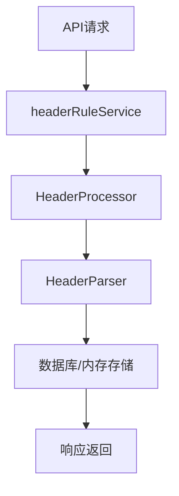
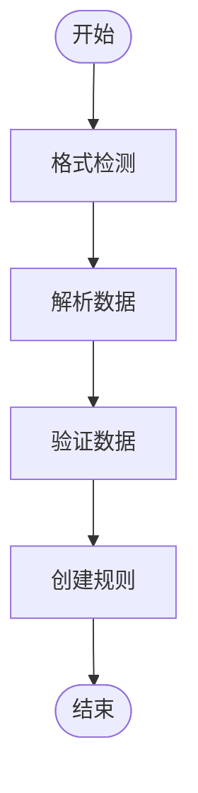
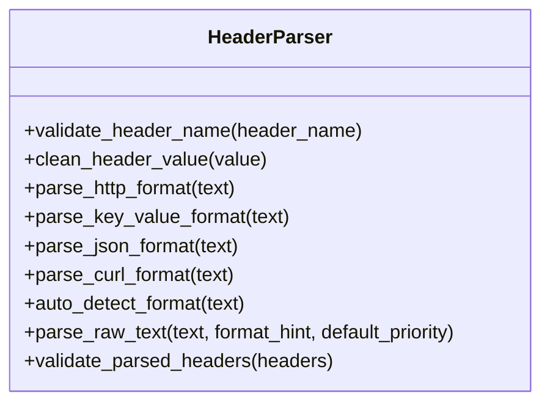
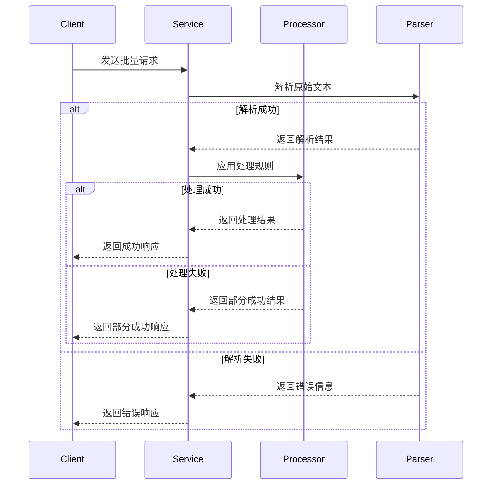
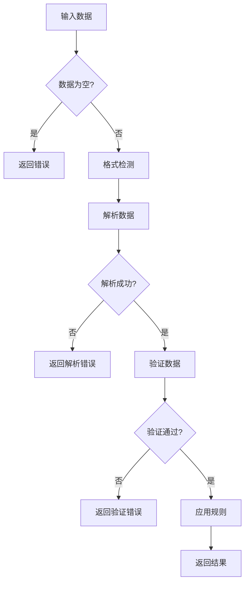
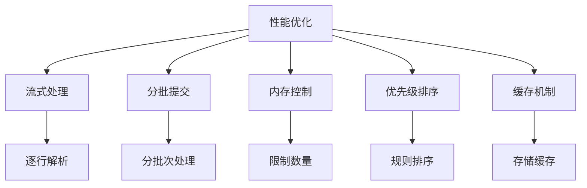
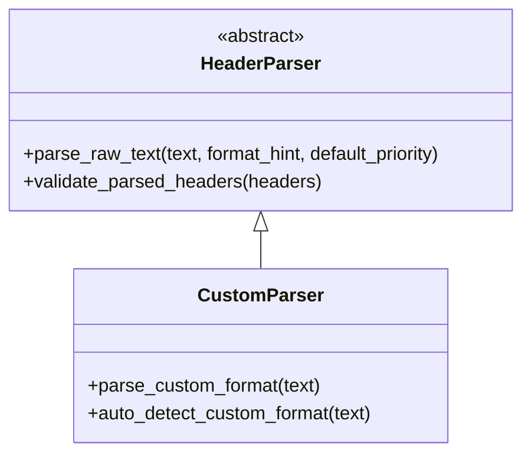
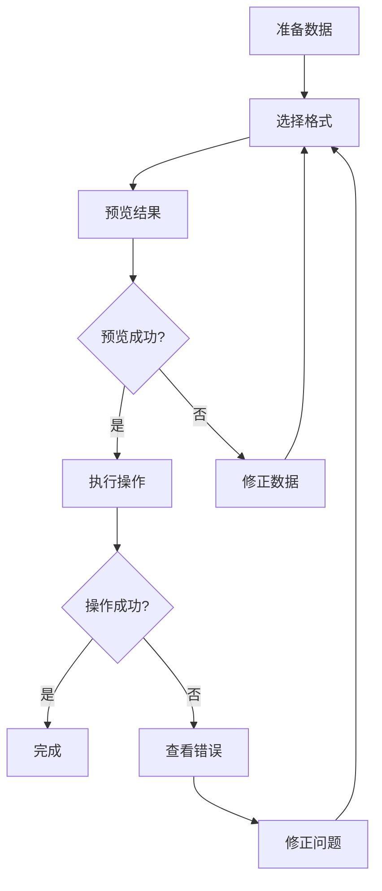

# 批量头处理

<cite>
**本文档引用的文件**   
- [header_processor.py](file://src/backEnd/utils/header_processor.py)
- [HeaderBatch.py](file://src/backEnd/model/HeaderBatch.py)
- [PersistentHeaderRule.py](file://src/backEnd/model/PersistentHeaderRule.py)
- [SessionHeader.py](file://src/backEnd/model/SessionHeader.py)
- [header_parser.py](file://src/backEnd/utils/header_parser.py)
- [headerRuleService.py](file://src/backEnd/service/headerRuleService.py)
</cite>

## 目录
1. [批量头处理功能概述](#批量头处理功能概述)
2. [核心组件与架构](#核心组件与架构)
3. [批量规则导入导出机制](#批量规则导入导出机制)
4. [CSV/JSON格式解析器设计](#csvjson格式解析器设计)
5. [事务性保证与错误处理](#事务性保证与错误处理)
6. [数据验证流程](#数据验证流程)
7. [性能优化方案](#性能优化方案)
8. [扩展接口与自定义格式](#扩展接口与自定义格式)
9. [操作示例与最佳实践](#操作示例与最佳实践)

## 批量头处理功能概述

批量头处理功能是系统中用于高效管理HTTP请求头的核心模块。该功能支持通过多种格式（HTTP、键值对、JSON、cURL）批量导入和导出请求头规则，满足用户在渗透测试场景下的复杂需求。系统通过`header_processor.py`中的`HeaderProcessor`类实现核心处理逻辑，结合`header_parser.py`中的`HeaderParser`类完成多格式解析，确保了功能的灵活性和可靠性。

该功能主要服务于两类请求头管理：持久化规则和会话性请求头。持久化规则存储在数据库中，具有持久性和全局性；会话性请求头则存储在内存中，具有时效性和客户端关联性。两种类型的请求头都支持批量操作，包括导入、导出、预览和应用。

**Section sources**
- [header_processor.py](file://src/backEnd/utils/header_processor.py#L1-L242)
- [HeaderBatch.py](file://src/backEnd/model/HeaderBatch.py#L1-L86)

## 核心组件与架构

批量头处理功能由多个核心组件协同工作，形成清晰的分层架构。最上层是服务层`headerRuleService.py`，负责处理API请求和业务逻辑协调；中间是处理层`header_processor.py`，负责请求头的实际处理；底层是解析层`header_parser.py`，负责多格式数据的解析和验证。

**Diagram sources**
- [headerRuleService.py](file://src/backEnd/service/headerRuleService.py#L1-L920)
- [header_processor.py](file://src/backEnd/utils/header_processor.py#L1-L242)
- [header_parser.py](file://src/backEnd/utils/header_parser.py#L1-L343)

**Section sources**
- [headerRuleService.py](file://src/backEnd/service/headerRuleService.py#L1-L920)
- [header_processor.py](file://src/backEnd/utils/header_processor.py#L1-L242)

## 批量规则导入导出机制

批量规则导入导出机制通过`HeaderBatchCreateRequest`和`HeaderBatchResult`数据模型实现。导入操作首先通过`parse_raw_text`方法解析原始文本，然后根据目标类型（持久化规则或会话头）分别处理。导出操作则通过查询数据库或内存存储，将数据序列化为指定格式。

导入流程包括三个主要步骤：格式检测、数据解析和规则创建。系统支持自动格式检测，能够识别HTTP、键值对、JSON和cURL四种格式。用户也可以通过`format_hint`参数指定格式。解析后的数据会经过严格的验证，包括请求头名称合法性、值长度限制和重复检测。

**Diagram sources**
- [HeaderBatch.py](file://src/backEnd/model/HeaderBatch.py#L60-L66)
- [header_parser.py](file://src/backEnd/utils/header_parser.py#L225-L303)

**Section sources**
- [HeaderBatch.py](file://src/backEnd/model/HeaderBatch.py#L60-L66)
- [header_parser.py](file://src/backEnd/utils/header_parser.py#L225-L303)

## CSV/JSON格式解析器设计

CSV/JSON格式解析器的设计基于`HeaderParser`类，采用模块化方法处理不同格式。对于JSON格式，系统使用Python标准库`json`模块进行解析，确保了兼容性和安全性。对于键值对格式（类似CSV），系统按行分割并使用等号作为分隔符进行解析。

解析器设计的关键特性包括：格式自动检测、错误容忍机制和数据清理。格式自动检测通过分析文本特征（如大括号、等号、-H参数）来判断最可能的格式。错误容忍机制允许解析器在遇到无效行时继续处理其他有效行，而不是完全失败。数据清理功能会移除首尾空白字符和包围的引号，确保数据的一致性。

**Diagram sources**
- [header_parser.py](file://src/backEnd/utils/header_parser.py#L10-L342)

**Section sources**
- [header_parser.py](file://src/backEnd/utils/header_parser.py#L10-L342)

## 事务性保证与错误处理

批量操作的事务性保证通过分步处理和结果聚合机制实现。虽然系统没有使用传统数据库事务，但通过原子性操作和状态跟踪确保了数据一致性。每个批量操作都会生成详细的处理结果，包括成功计数、失败计数和具体错误信息。

错误处理策略采用分级响应机制。对于解析错误，系统会返回400 Bad Request响应，并提供详细的错误描述。对于系统错误，返回500 Internal Server Error响应。在部分失败的情况下，系统采用206 Partial Content响应，明确告知用户哪些操作成功，哪些失败。

回滚机制通过操作预览功能实现。用户可以在实际应用前预览处理结果，确认无误后再执行。这种"预览-确认"模式有效防止了错误配置的传播。错误报告包含源文本行号、错误类型和具体原因，便于用户快速定位和修正问题。

**Diagram sources**
- [headerRuleService.py](file://src/backEnd/service/headerRuleService.py#L555-L590)
- [header_processor.py](file://src/backEnd/utils/header_processor.py#L100-L150)

**Section sources**
- [headerRuleService.py](file://src/backEnd/service/headerRuleService.py#L555-L590)
- [header_processor.py](file://src/backEnd/utils/header_processor.py#L100-L150)

## 数据验证流程

数据验证流程贯穿于批量处理的各个环节，确保数据的完整性和安全性。验证分为三个层次：格式验证、语义验证和业务验证。格式验证检查请求头名称是否符合RFC 7230规范，只允许字母、数字、连字符和下划线。语义验证检查值的长度和内容，防止过长或恶意数据。业务验证检查规则名称的唯一性和优先级的有效性。

重复检测机制通过维护一个已见请求头名称的集合来实现。系统在解析过程中会跟踪所有已处理的请求头名称（不区分大小写），当发现重复时会生成警告。冲突预警机制则通过匹配条件实现，允许用户定义正则表达式来检测潜在的冲突配置。

验证结果以结构化方式返回，包含错误列表和警告列表。错误表示阻止操作继续的严重问题，而警告表示需要注意但不影响操作的潜在问题。这种区分有助于用户区分问题的严重程度，优先处理关键错误。

**Diagram sources**
- [header_parser.py](file://src/backEnd/utils/header_parser.py#L306-L342)
- [HeaderBatch.py](file://src/backEnd/model/HeaderBatch.py#L49-L49)

**Section sources**
- [header_parser.py](file://src/backEnd/utils/header_parser.py#L306-L342)
- [HeaderBatch.py](file://src/backEnd/model/HeaderBatch.py#L49-L49)

## 性能优化方案

性能优化方案主要包括流式处理、分批提交和内存使用控制。流式处理通过逐行解析文本实现，避免了一次性加载大文件到内存。分批提交将大批量操作分解为多个小批次，减少单次操作的资源消耗和锁定时间。内存使用控制通过限制单次操作的请求数量（最大100个）来防止内存溢出。

系统采用优先级排序机制优化处理效率。持久化规则按优先级降序排序，确保高优先级规则先应用。会话性请求头按优先级升序排序，确保高优先级请求头后应用，从而覆盖低优先级的值。这种排序策略减少了不必要的覆盖操作，提高了处理效率。

缓存机制用于存储活跃的持久化规则和会话性请求头，避免重复查询数据库。预览功能也起到了性能优化的作用，允许用户在应用前验证配置，减少因错误配置导致的重复处理。

**Diagram sources**
- [header_processor.py](file://src/backEnd/utils/header_processor.py#L50-L80)
- [headerRuleService.py](file://src/backEnd/service/headerRuleService.py#L524-L559)

**Section sources**
- [header_processor.py](file://src/backEnd/utils/header_processor.py#L50-L80)
- [headerRuleService.py](file://src/backEnd/service/headerRuleService.py#L524-L559)

## 扩展接口与自定义格式

扩展接口通过`HeaderParser`类的模块化设计实现，允许开发者轻松添加新的格式支持。自定义格式的实现需要遵循统一的接口规范：接收原始文本，返回`ParseResult`对象。开发者可以通过继承`HeaderParser`类或直接实现解析方法来添加新格式。

系统提供了清晰的扩展点，包括格式检测、数据解析和数据验证。开发者可以重写`auto_detect_format`方法来识别新格式，实现新的`parse_xxx_format`方法来解析数据，以及扩展`validate_parsed_headers`方法来添加自定义验证规则。这种设计确保了扩展的灵活性和系统的稳定性。

为了支持自定义格式，系统定义了标准的数据模型`ParsedHeaderItem`，所有解析器都必须将数据转换为此格式。这保证了上层处理逻辑的统一性，无论数据来源如何，处理方式都保持一致。

**Diagram sources**
- [header_parser.py](file://src/backEnd/utils/header_parser.py#L10-L342)
- [HeaderBatch.py](file://src/backEnd/model/HeaderBatch.py#L30-L30)

**Section sources**
- [header_parser.py](file://src/backEnd/utils/header_parser.py#L10-L342)
- [HeaderBatch.py](file://src/backEnd/model/HeaderBatch.py#L30-L30)

## 操作示例与最佳实践

操作示例展示了如何使用批量头处理功能。最佳实践建议用户在导入大量规则前先使用预览功能验证配置，分批处理大文件以避免超时，以及定期清理过期的会话性请求头。对于JSON格式的导入，建议使用标准的字典结构，确保键值对的正确性。

在导出操作中，最佳实践是选择合适的格式以便后续处理。HTTP格式适合直接复制到工具中使用，JSON格式适合程序化处理，键值对格式适合简单的配置文件。用户应根据具体场景选择最合适的格式。

错误处理的最佳实践是仔细阅读错误报告，特别是源文本行号，这有助于快速定位问题。对于重复的请求头，系统会生成警告而非错误，用户应根据业务需求决定是否需要修正。在生产环境中，建议启用详细的日志记录，以便于问题排查和审计。

**Diagram sources**
- [headerRuleService.py](file://src/backEnd/service/headerRuleService.py#L846-L879)
- [header_processor.py](file://src/backEnd/utils/header_processor.py#L180-L200)

**Section sources**
- [headerRuleService.py](file://src/backEnd/service/headerRuleService.py#L846-L879)
- [header_processor.py](file://src/backEnd/utils/header_processor.py#L180-L200)