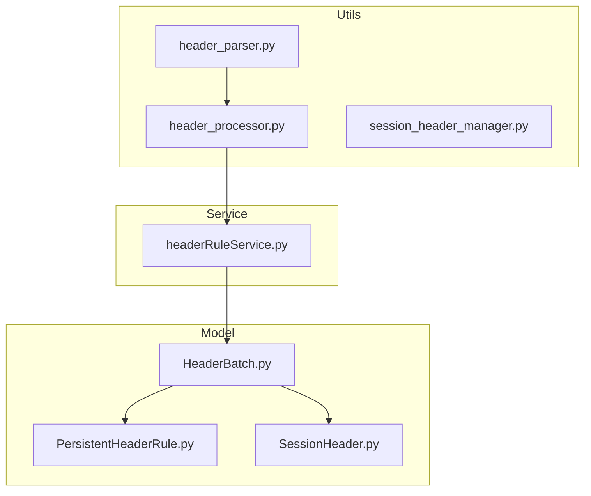
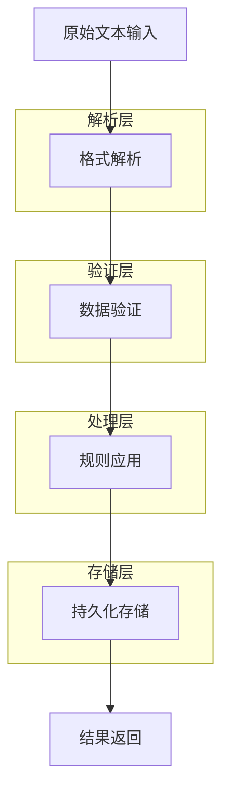
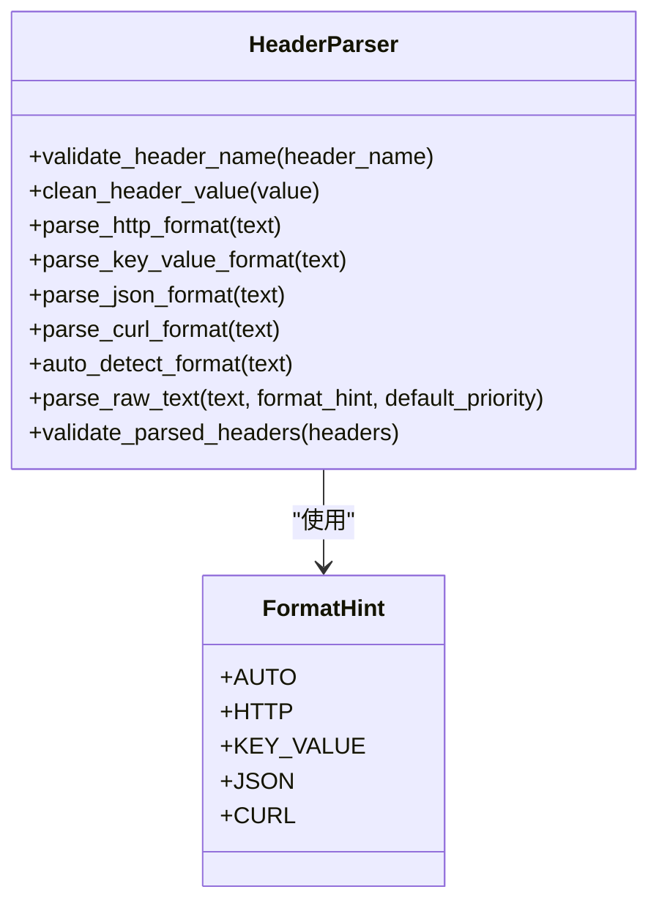
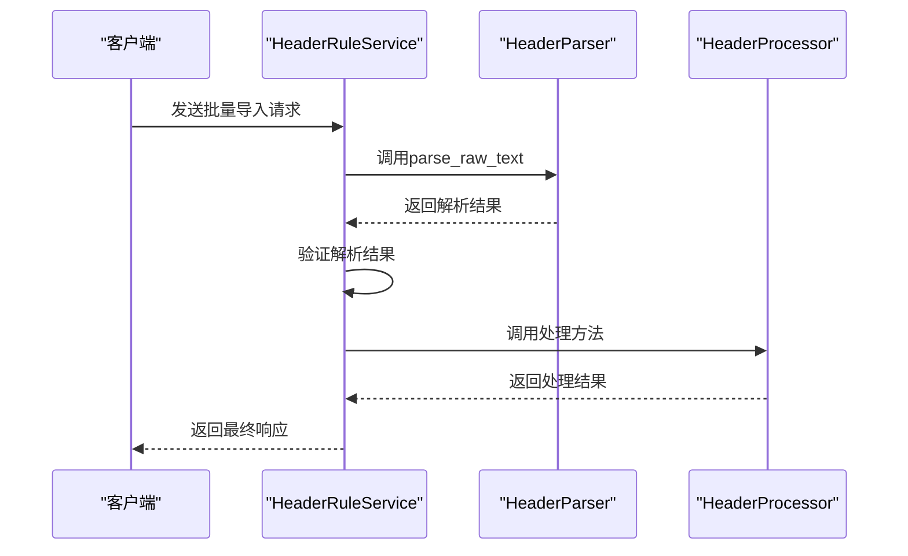
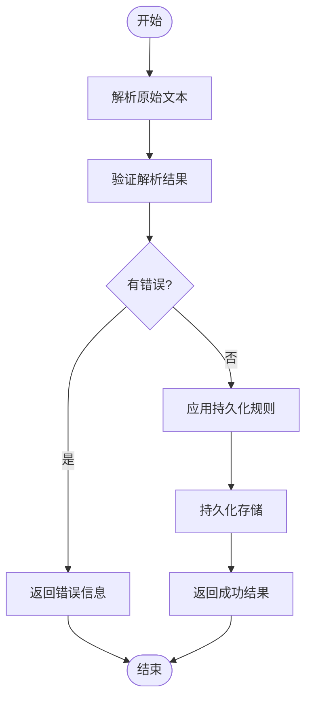
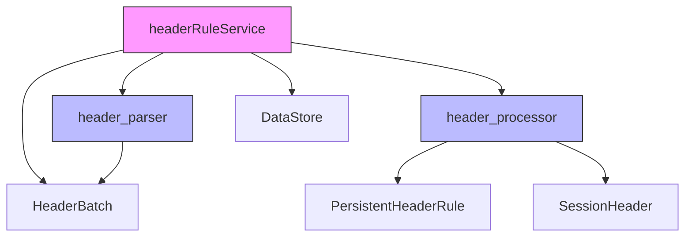

# 批量头导入

<cite>
**本文档引用的文件**   
- [header_processor.py](file://src/backEnd/utils/header_processor.py)
- [header_parser.py](file://src/backEnd/utils/header_parser.py)
- [headerRuleService.py](file://src/backEnd/service/headerRuleService.py)
- [HeaderBatch.py](file://src/backEnd/model/HeaderBatch.py)
- [PersistentHeaderRule.py](file://src/backEnd/model/PersistentHeaderRule.py)
- [SessionHeader.py](file://src/backEnd/model/SessionHeader.py)
</cite>

## 目录
1. [简介](#简介)
2. [项目结构](#项目结构)
3. [核心组件](#核心组件)
4. [架构概述](#架构概述)
5. [详细组件分析](#详细组件分析)
6. [依赖分析](#依赖分析)
7. [性能考虑](#性能考虑)
8. [故障排除指南](#故障排除指南)
9. [结论](#结论)

## 简介
批量头导入功能是系统中用于处理HTTP请求头的核心模块，支持多种格式的请求头数据批量导入和处理。该功能通过解析器将不同格式的请求头数据转换为统一格式，应用持久化规则和会话性规则，并提供完整的错误处理和事务性导入机制。系统支持HTTP、键值对、JSON和cURL等多种输入格式，能够自动检测格式并进行相应的解析处理。

## 项目结构
批量头导入功能主要分布在utils和service两个目录下，通过model定义数据结构，形成完整的处理链条。核心处理逻辑位于header_processor.py和header_parser.py中，而业务服务层由headerRuleService.py提供。

**图源**
- [header_processor.py](file://src/backEnd/utils/header_processor.py#L1-L241)
- [header_parser.py](file://src/backEnd/utils/header_parser.py#L1-L342)
- [headerRuleService.py](file://src/backEnd/service/headerRuleService.py#L1-L919)

**节源**
- [header_processor.py](file://src/backEnd/utils/header_processor.py#L1-L241)
- [header_parser.py](file://src/backEnd/utils/header_parser.py#L1-L342)

## 核心组件
批量头导入功能的核心组件包括请求头解析器、处理器和服务层。解析器负责将不同格式的原始文本转换为结构化数据，处理器应用各种规则进行数据转换，服务层协调整个导入流程并处理业务逻辑。系统采用分层架构，各组件职责分明，便于维护和扩展。

**节源**
- [header_processor.py](file://src/backEnd/utils/header_processor.py#L10-L241)
- [header_parser.py](file://src/backEnd/utils/header_parser.py#L10-L342)

## 架构概述
批量头导入功能采用分层架构设计，从数据输入到处理再到存储，形成清晰的处理流水线。系统首先通过解析器将原始文本转换为结构化数据，然后经过验证层确保数据质量，最后由服务层执行具体的导入操作。

**图源**
- [header_parser.py](file://src/backEnd/utils/header_parser.py#L10-L342)
- [headerRuleService.py](file://src/backEnd/service/headerRuleService.py#L555-L919)

## 详细组件分析

### 解析器组件分析
请求头解析器支持多种格式的输入，包括HTTP标准格式、键值对格式、JSON格式和cURL命令格式。解析器能够自动检测输入格式，或根据提示进行特定格式的解析。

**图源**
- [header_parser.py](file://src/backEnd/utils/header_parser.py#L10-L342)
- [HeaderBatch.py](file://src/backEnd/model/HeaderBatch.py#L1-L85)

### 处理器组件分析
请求头处理器负责应用持久化规则和会话性规则，将解析后的数据转换为最终的请求头格式。处理器支持多种替换策略，确保数据处理的灵活性和准确性。

**图源**
- [header_processor.py](file://src/backEnd/utils/header_processor.py#L10-L241)
- [headerRuleService.py](file://src/backEnd/service/headerRuleService.py#L555-L919)

### 服务组件分析
服务层组件协调整个批量导入流程，处理业务逻辑，包括数据验证、事务管理、错误处理等。服务层提供统一的API接口，简化客户端的使用。

**图源**
- [headerRuleService.py](file://src/backEnd/service/headerRuleService.py#L555-L919)
- [header_parser.py](file://src/backEnd/utils/header_parser.py#L225-L303)

## 依赖分析
批量头导入功能依赖多个核心组件，形成复杂的依赖关系网络。各组件之间通过明确定义的接口进行交互，确保系统的可维护性和可扩展性。

**图源**
- [headerRuleService.py](file://src/backEnd/service/headerRuleService.py#L1-L919)
- [header_parser.py](file://src/backEnd/utils/header_parser.py#L1-L342)
- [header_processor.py](file://src/backEnd/utils/header_processor.py#L1-L241)

**节源**
- [headerRuleService.py](file://src/backEnd/service/headerRuleService.py#L1-L919)
- [header_parser.py](file://src/backEnd/utils/header_parser.py#L1-L342)

## 性能考虑
批量头导入功能在设计时充分考虑了性能因素，采用流式处理和分批处理机制，有效控制内存占用。系统对输入数据大小进行限制，防止内存溢出，同时通过索引优化数据库查询性能。

**节源**
- [header_parser.py](file://src/backEnd/utils/header_parser.py#L306-L342)
- [HeaderBatch.py](file://src/backEnd/model/HeaderBatch.py#L1-L85)

## 故障排除指南
当批量头导入功能出现问题时，可参考以下常见问题及解决方案：

1. **解析失败**：检查输入格式是否正确，确保请求头名称符合规范
2. **验证错误**：确认请求头数量未超过限制（100个），值长度未超过限制（2000字符）
3. **数据库连接问题**：检查数据库服务是否正常运行
4. **权限问题**：确保有足够的权限执行相关操作

**节源**
- [header_parser.py](file://src/backEnd/utils/header_parser.py#L306-L342)
- [headerRuleService.py](file://src/backEnd/service/headerRuleService.py#L587-L621)

## 结论
批量头导入功能提供了完整的请求头数据处理解决方案，支持多种格式的输入，具备完善的错误处理和验证机制。系统架构清晰，组件职责分明，易于维护和扩展。通过合理的性能优化措施，确保了在处理大量数据时的稳定性和效率。