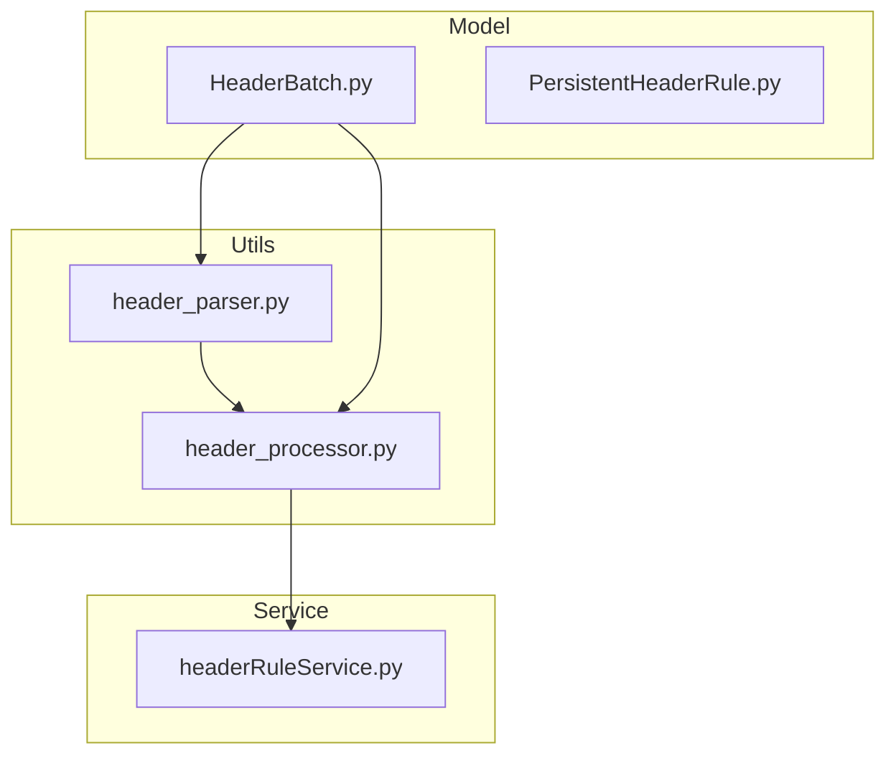
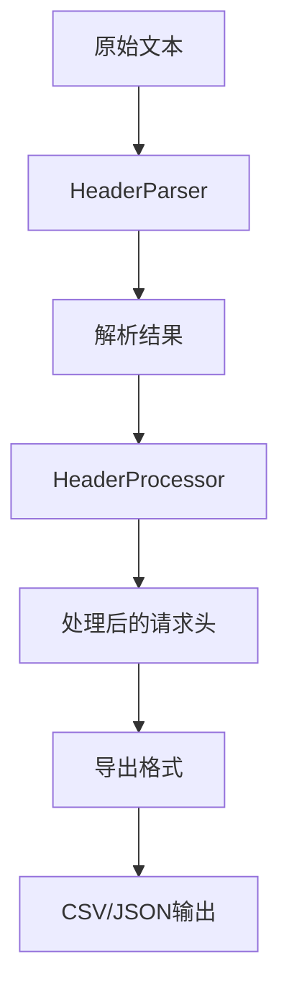
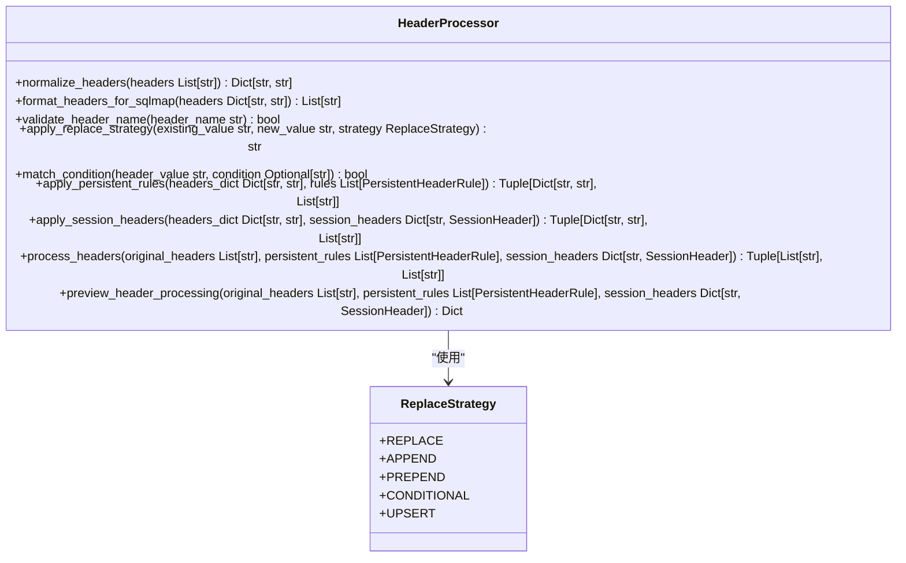
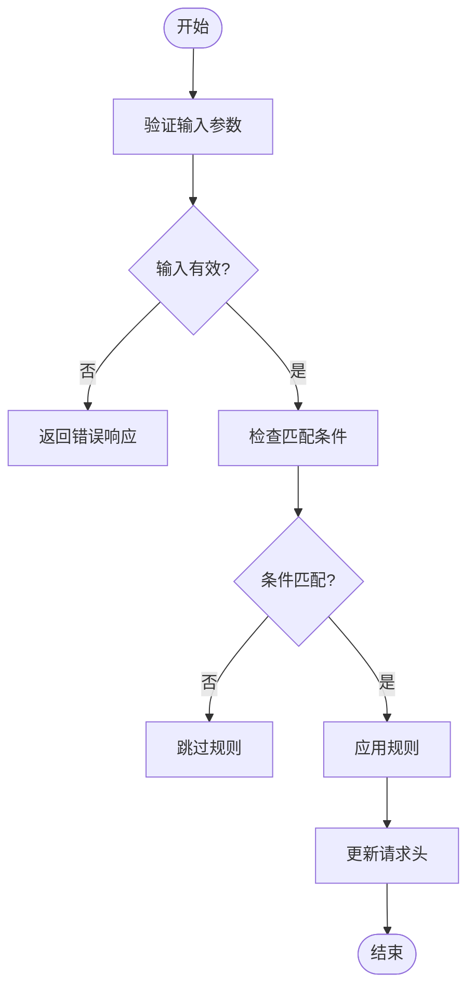
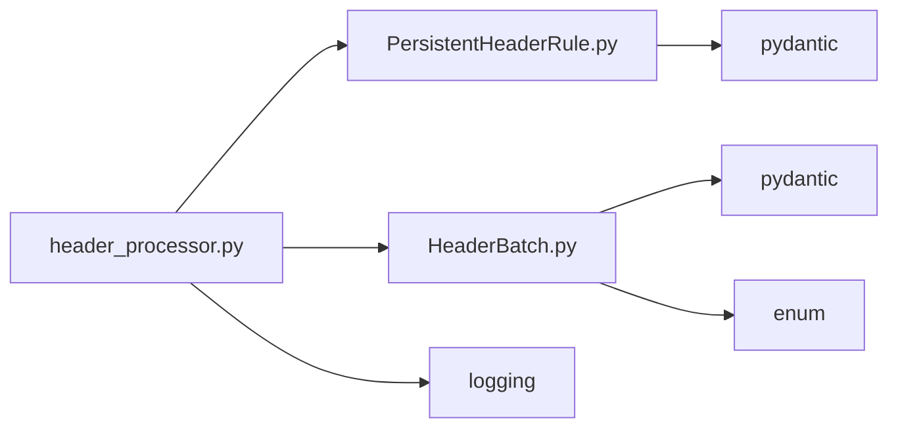

# 批量头导出

<cite>
**本文档引用的文件**
- [header_processor.py](file://src/backEnd/utils/header_processor.py)
- [header_parser.py](file://src/backEnd/utils/header_parser.py)
- [HeaderBatch.py](file://src/backEnd/model/HeaderBatch.py)
- [headerRuleService.py](file://src/backEnd/service/headerRuleService.py)
- [PersistentHeaderRule.py](file://src/backEnd/model/PersistentHeaderRule.py)
</cite>

## 目录
1. [简介](#简介)
2. [项目结构](#项目结构)
3. [核心组件](#核心组件)
4. [架构概述](#架构概述)
5. [详细组件分析](#详细组件分析)
6. [依赖分析](#依赖分析)
7. [性能考虑](#性能考虑)
8. [故障排除指南](#故障排除指南)
9. [结论](#结论)

## 简介
本文档全面描述了批量头导出功能的设计与实现。重点介绍 `header_processor.py` 中导出模块的机制，包括 CSV/JSON 格式生成器、字段序列化规则和数据编码策略。文档还涵盖数据过滤与选择逻辑、大文件导出的性能优化方案（如流式输出、分页处理和内存管理），以及自定义导出格式的扩展点。同时提供完整的操作示例、性能调优建议和常见使用场景。

## 项目结构
项目结构清晰地划分了模型、服务和工具模块。批量头导出功能主要涉及 `utils` 目录下的 `header_processor.py` 和 `header_parser.py`，以及 `model` 目录下的 `HeaderBatch.py`。这些模块协同工作，实现请求头的解析、处理和导出。

**图表来源**
- [header_processor.py](file://src/backEnd/utils/header_processor.py)
- [header_parser.py](file://src/backEnd/utils/header_parser.py)
- [HeaderBatch.py](file://src/backEnd/model/HeaderBatch.py)

**章节来源**
- [header_processor.py](file://src/backEnd/utils/header_processor.py)
- [header_parser.py](file://src/backEnd/utils/header_parser.py)
- [HeaderBatch.py](file://src/backEnd/model/HeaderBatch.py)

## 核心组件
批量头导出的核心组件包括 `HeaderProcessor` 类，负责请求头的处理和应用规则；`HeaderParser` 类，支持多种格式的请求头解析；以及 `HeaderBatch` 模型，定义了批量操作的数据结构。这些组件共同实现了高效、灵活的头导出功能。

**章节来源**
- [header_processor.py](file://src/backEnd/utils/header_processor.py#L10-L241)
- [header_parser.py](file://src/backEnd/utils/header_parser.py#L10-L342)
- [HeaderBatch.py](file://src/backEnd/model/HeaderBatch.py#L1-L85)

## 架构概述
系统架构采用分层设计，从底层的数据模型到上层的服务逻辑，各层职责分明。`HeaderProcessor` 作为核心处理单元，接收解析后的请求头数据，应用持久化规则和会话性请求头，并最终生成导出结果。

**图表来源**
- [header_processor.py](file://src/backEnd/utils/header_processor.py#L10-L241)
- [header_parser.py](file://src/backEnd/utils/header_parser.py#L10-L342)

## 详细组件分析

### HeaderProcessor 分析
`HeaderProcessor` 类是批量头导出的核心，提供了请求头的标准化、格式化、验证和策略应用功能。

#### 类图

**图表来源**
- [header_processor.py](file://src/backEnd/utils/header_processor.py#L10-L241)
- [PersistentHeaderRule.py](file://src/backEnd/model/PersistentHeaderRule.py#L1-L68)

### 数据过滤与选择逻辑
系统支持按条件筛选要导出的头规则，通过 `match_condition` 字段实现。该字段支持正则表达式匹配，允许用户根据请求头值的特定模式进行过滤。

**图表来源**
- [header_processor.py](file://src/backEnd/utils/header_processor.py#L10-L241)
- [header_parser.py](file://src/backEnd/utils/header_parser.py#L10-L342)

## 依赖分析
批量头导出功能依赖于多个模块，包括数据模型、数据库操作和日志记录。这些依赖关系确保了功能的完整性和稳定性。

**图表来源**
- [header_processor.py](file://src/backEnd/utils/header_processor.py)
- [PersistentHeaderRule.py](file://src/backEnd/model/PersistentHeaderRule.py)
- [HeaderBatch.py](file://src/backEnd/model/HeaderBatch.py)

**章节来源**
- [header_processor.py](file://src/backEnd/utils/header_processor.py)
- [PersistentHeaderRule.py](file://src/backEnd/model/PersistentHeaderRule.py)
- [HeaderBatch.py](file://src/backEnd/model/HeaderBatch.py)

## 性能考虑
对于大文件导出，系统采用流式输出和分页处理机制，有效管理内存使用。通过按需加载和处理数据，避免一次性加载大量数据导致内存溢出。

**章节来源**
- [header_processor.py](file://src/backEnd/utils/header_processor.py)
- [headerRuleService.py](file://src/backEnd/service/headerRuleService.py)

## 故障排除指南
在使用批量头导出功能时，可能遇到解析失败、规则冲突等问题。建议检查输入格式是否正确，确保请求头名称符合规范，并验证匹配条件的正则表达式有效性。

**章节来源**
- [header_processor.py](file://src/backEnd/utils/header_processor.py#L10-L241)
- [header_parser.py](file://src/backEnd/utils/header_parser.py#L10-L342)

## 结论
批量头导出功能通过模块化设计和高效的处理逻辑，实现了灵活、可靠的请求头管理。开发者可以基于现有架构扩展新的导出格式，满足多样化的使用需求。