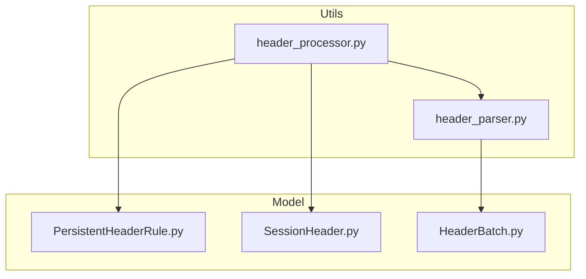
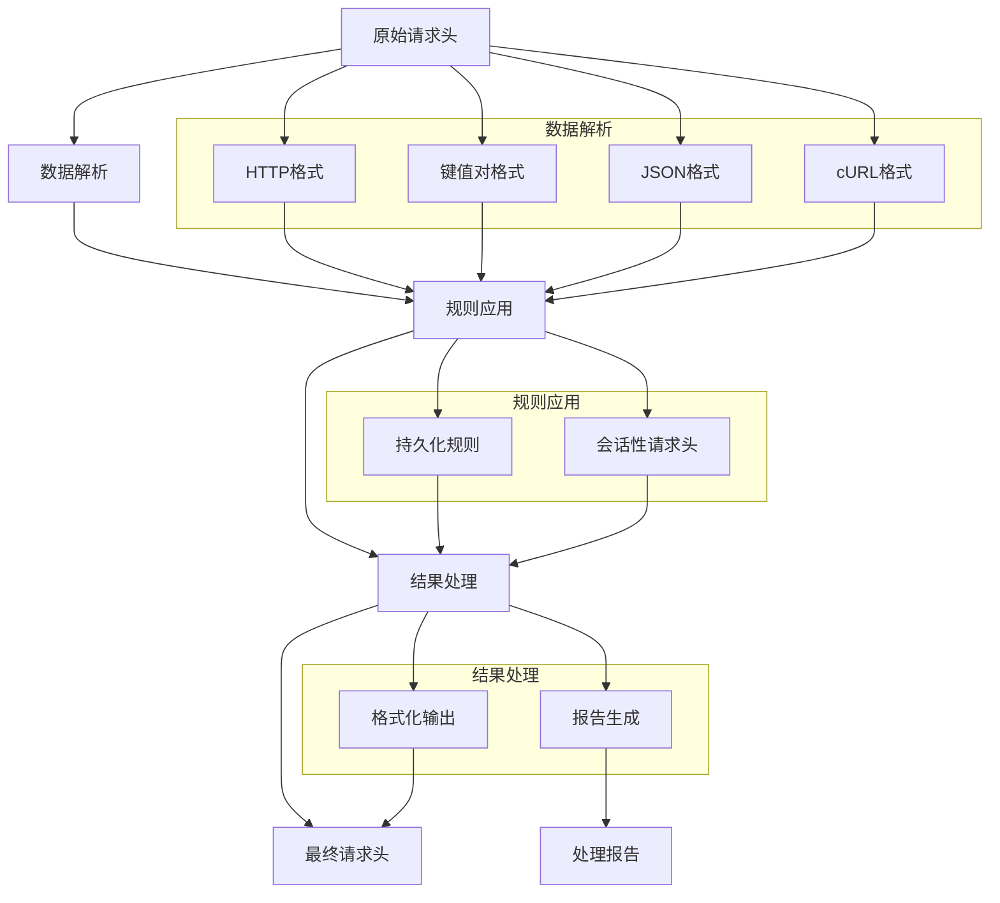
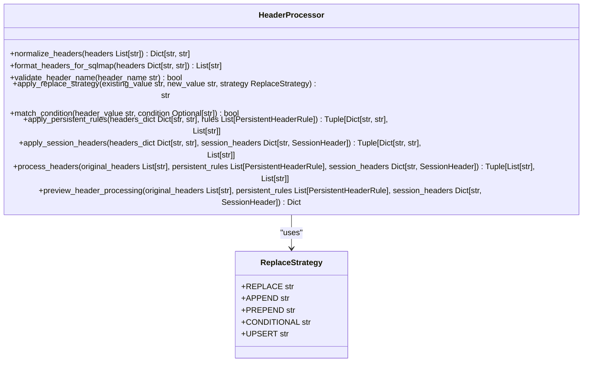
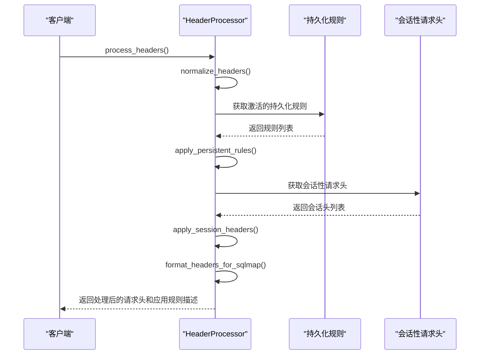
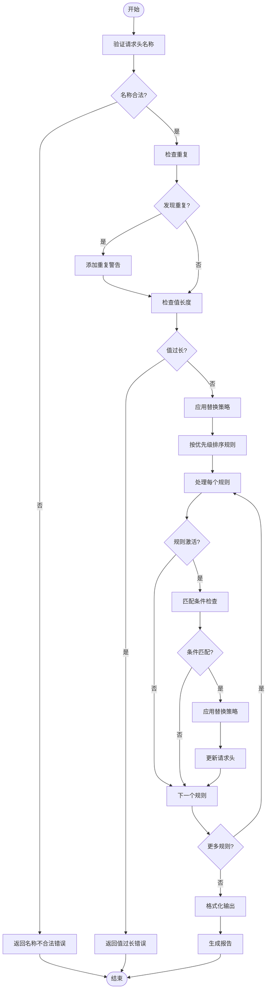
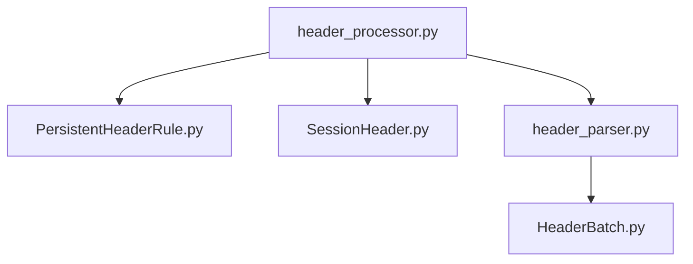

# 批量头验证

<cite>
**Referenced Files in This Document**   
- [header_processor.py](file://src/backEnd/utils/header_processor.py)
- [PersistentHeaderRule.py](file://src/backEnd/model/PersistentHeaderRule.py)
- [SessionHeader.py](file://src/backEnd/model/SessionHeader.py)
- [header_parser.py](file://src/backEnd/utils/header_parser.py)
- [HeaderBatch.py](file://src/backEnd/model/HeaderBatch.py)
</cite>

## 目录
1. [简介](#简介)
2. [项目结构](#项目结构)
3. [核心组件](#核心组件)
4. [架构概述](#架构概述)
5. [详细组件分析](#详细组件分析)
6. [依赖分析](#依赖分析)
7. [性能考虑](#性能考虑)
8. [故障排除指南](#故障排除指南)
9. [结论](#结论)

## 简介
批量头验证机制是系统中用于处理和验证HTTP请求头的核心功能。该机制通过`header_processor.py`文件中的数据验证引擎实现，提供了完整的请求头处理流程，包括语法检查、重复项检测、冲突预警和业务规则验证。系统支持持久化规则和会话性请求头两种模式，通过优先级排序和多种替换策略确保请求头的正确性和一致性。验证结果通过详细的错误信息和警告提示进行报告，为开发者提供了清晰的反馈。该机制在SQLMapWebUI项目中扮演着关键角色，确保了安全测试过程中请求头的准确性和可靠性。

## 项目结构
批量头验证功能主要分布在`src/backEnd/utils`和`src/backEnd/model`目录下。`utils`目录包含核心处理逻辑，而`model`目录定义了数据结构和规则。这种分层设计实现了逻辑与数据的分离，提高了代码的可维护性和可扩展性。

**Diagram sources**
- [header_processor.py](file://src/backEnd/utils/header_processor.py)
- [header_parser.py](file://src/backEnd/utils/header_parser.py)
- [PersistentHeaderRule.py](file://src/backEnd/model/PersistentHeaderRule.py)
- [SessionHeader.py](file://src/backEnd/model/SessionHeader.py)
- [HeaderBatch.py](file://src/backEnd/model/HeaderBatch.py)

**Section sources**
- [header_processor.py](file://src/backEnd/utils/header_processor.py)
- [header_parser.py](file://src/backEnd/utils/header_parser.py)

## 核心组件
批量头验证机制的核心组件包括`HeaderProcessor`类、`PersistentHeaderRule`模型和`HeaderParser`类。`HeaderProcessor`负责应用持久化规则和会话性请求头，`PersistentHeaderRule`定义了持久化请求头的规则和策略，而`HeaderParser`则负责解析多种格式的请求头数据。这些组件协同工作，形成了完整的请求头处理和验证流程。

**Section sources**
- [header_processor.py](file://src/backEnd/utils/header_processor.py#L1-L241)
- [PersistentHeaderRule.py](file://src/backEnd/model/PersistentHeaderRule.py#L1-L68)
- [header_parser.py](file://src/backEnd/utils/header_parser.py#L1-L342)

## 架构概述
批量头验证机制采用分层架构设计，包括数据解析层、规则应用层和结果处理层。数据解析层负责将不同格式的原始请求头转换为统一的内部表示；规则应用层根据优先级和策略应用持久化规则和会话性请求头；结果处理层则负责生成最终的请求头列表和详细的处理报告。

**Diagram sources**
- [header_processor.py](file://src/backEnd/utils/header_processor.py#L1-L241)
- [header_parser.py](file://src/backEnd/utils/header_parser.py#L1-L342)

## 详细组件分析
### HeaderProcessor分析
`HeaderProcessor`类是批量头验证机制的核心，负责应用持久化规则和会话性请求头。该类提供了静态方法来处理请求头的标准化、格式化和验证。

#### 类图

**Diagram sources**
- [header_processor.py](file://src/backEnd/utils/header_processor.py#L1-L241)
- [PersistentHeaderRule.py](file://src/backEnd/model/PersistentHeaderRule.py#L6-L12)

#### 处理流程序列图

**Diagram sources**
- [header_processor.py](file://src/backEnd/utils/header_processor.py#L1-L241)

### 数据验证引擎分析
数据验证引擎实现了完整的请求头验证流程，包括语法检查、重复项检测和冲突预警。验证过程通过正则表达式模式、数据完整性检查和业务规则验证来确保请求头的合法性。

#### 验证流程图

**Diagram sources**
- [header_processor.py](file://src/backEnd/utils/header_processor.py#L91-L123)
- [header_parser.py](file://src/backEnd/utils/header_parser.py#L323-L342)

## 依赖分析
批量头验证机制的组件之间存在明确的依赖关系。`HeaderProcessor`依赖于`PersistentHeaderRule`和`SessionHeader`模型来获取规则和会话数据，同时依赖于`header_parser.py`中的验证逻辑。这种依赖关系确保了组件间的松耦合和高内聚。

**Diagram sources**
- [header_processor.py](file://src/backEnd/utils/header_processor.py)
- [PersistentHeaderRule.py](file://src/backEnd/model/PersistentHeaderRule.py)
- [SessionHeader.py](file://src/backEnd/model/SessionHeader.py)
- [header_parser.py](file://src/backEnd/utils/header_parser.py)
- [HeaderBatch.py](file://src/backEnd/model/HeaderBatch.py)

**Section sources**
- [header_processor.py](file://src/backEnd/utils/header_processor.py)
- [PersistentHeaderRule.py](file://src/backEnd/model/PersistentHeaderRule.py)
- [SessionHeader.py](file://src/backEnd/model/SessionHeader.py)
- [header_parser.py](file://src/backEnd/utils/header_parser.py)
- [HeaderBatch.py](file://src/backEnd/model/HeaderBatch.py)

## 性能考虑
批量头验证机制在设计时考虑了性能优化。通过优先级排序减少不必要的规则处理，使用字典数据结构实现O(1)的请求头查找，以及在处理过程中避免重复的字符串操作。对于大量请求头的处理，建议采用分批处理策略，避免内存占用过高。此外，规则的预编译和缓存可以进一步提高处理速度。

## 故障排除指南
当批量头验证出现问题时，首先检查请求头名称是否符合RFC 7230规范，即只包含字母、数字、连字符和下划线。其次，验证持久化规则的激活状态和优先级设置是否正确。如果出现处理失败，查看日志中的错误信息，通常会指出具体的失败原因，如无效的正则表达式条件或数据库连接问题。对于性能问题，可以启用调试日志来分析处理过程中的瓶颈。

**Section sources**
- [header_processor.py](file://src/backEnd/utils/header_processor.py#L229-L241)
- [header_parser.py](file://src/backEnd/utils/header_parser.py#L323-L342)

## 结论
批量头验证机制通过`header_processor.py`中的数据验证引擎实现了完整的请求头处理和验证功能。该机制支持多种格式的请求头解析，提供了丰富的替换策略和优先级管理，确保了请求头处理的灵活性和可靠性。通过详细的错误报告和预览功能，为开发者提供了强大的调试工具。该设计充分考虑了性能和可扩展性，为系统的安全测试功能提供了坚实的基础。