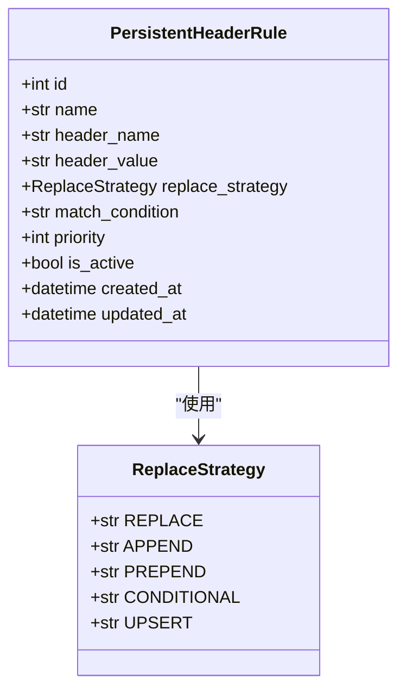
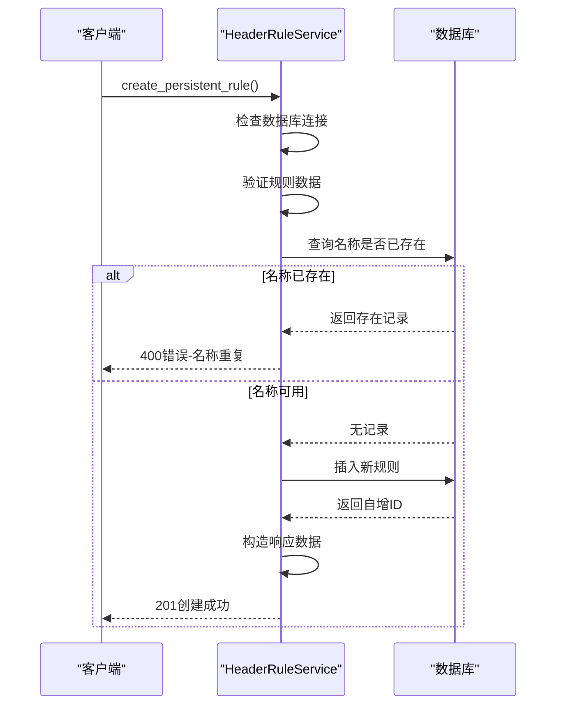
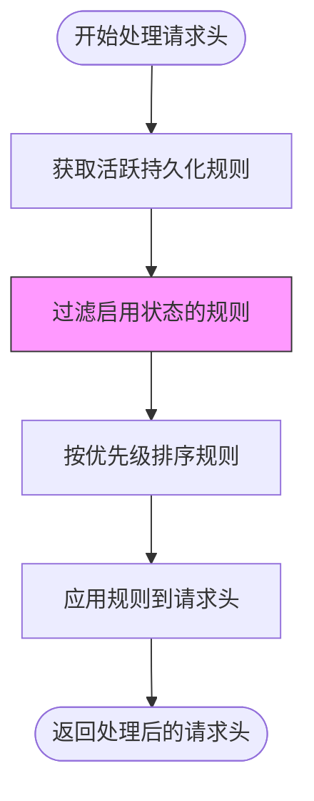
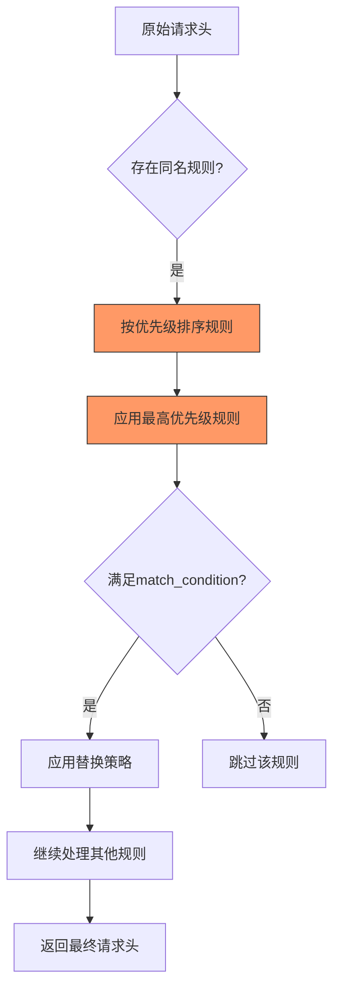
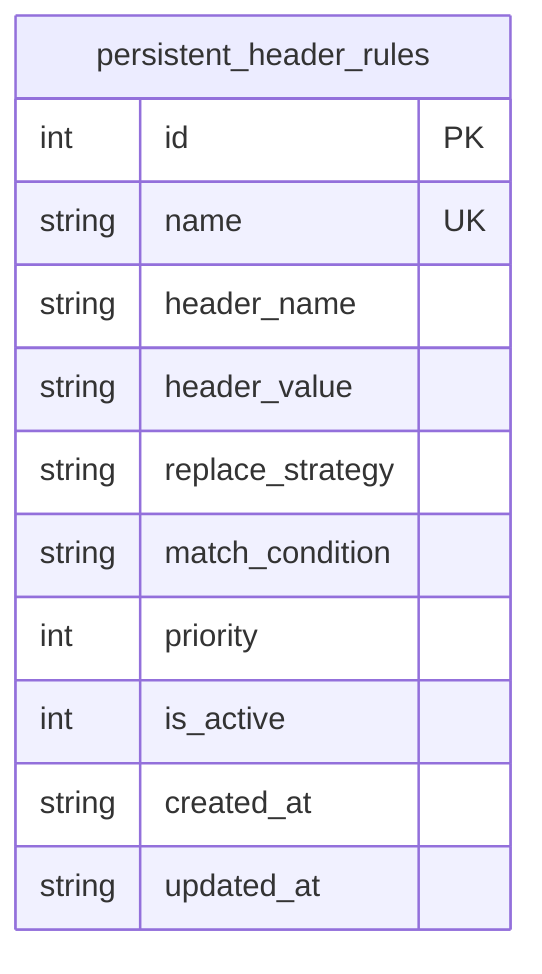
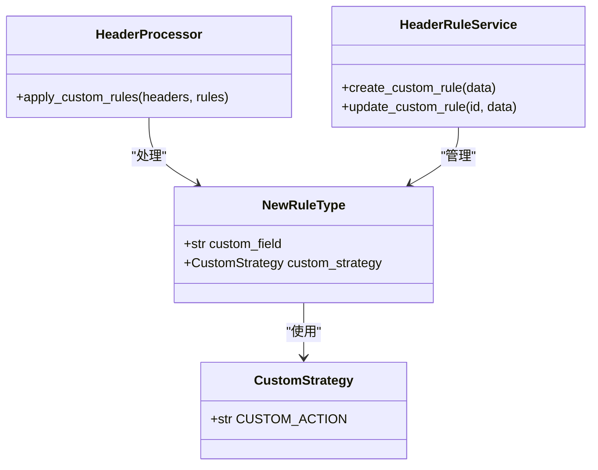

# 持久化头规则

<cite>
**本文档引用的文件**   
- [PersistentHeaderRule.py](file://src/backEnd/model/PersistentHeaderRule.py)
- [headerRuleService.py](file://src/backEnd/service/headerRuleService.py)
- [Database.py](file://src/backEnd/model/Database.py)
- [HeaderDatabase.py](file://src/backEnd/model/HeaderDatabase.py)
- [header_processor.py](file://src/backEnd/utils/header_processor.py)
- [header_parser.py](file://src/backEnd/utils/header_parser.py)
- [SessionHeader.py](file://src/backEnd/model/SessionHeader.py)
- [session_header_manager.py](file://src/backEnd/utils/session_header_manager.py)
</cite>

## 目录
1. [引言](#引言)
2. [数据模型定义](#数据模型定义)
3. [CRUD操作实现](#crud操作实现)
4. [状态管理机制](#状态管理机制)
5. [优先级排序与冲突解决](#优先级排序与冲突解决)
6. [数据库表结构设计](#数据库表结构设计)
7. [扩展接口设计](#扩展接口设计)
8. [总结](#总结)

## 引言

持久化头规则是系统中用于管理和应用HTTP请求头的核心功能模块。该功能允许用户创建、更新和删除持久化的请求头规则，这些规则在扫描任务执行时自动应用于目标请求。通过灵活的替换策略、匹配条件和优先级设置，系统能够精确控制请求头的生成和修改过程。本技术文档将深入解析持久化头规则的各个技术层面，包括数据模型、服务实现、数据库设计以及扩展机制。

**持久化头规则**功能主要由`PersistentHeaderRule`数据模型和`headerRuleService`服务类构成，通过SQLite数据库实现持久化存储，并结合会话性请求头管理器提供完整的请求头处理解决方案。系统支持批量导入、预览处理结果等高级功能，满足复杂的安全测试需求。

## 数据模型定义

持久化头规则的数据模型定义在`PersistentHeaderRule.py`文件中，基于Pydantic库构建，确保了数据验证和类型安全。模型包含多个相关类，分别用于创建、更新和响应持久化规则。

### 核心数据模型

`PersistentHeaderRule`类定义了持久化请求头规则的核心属性，每个字段都有明确的验证规则和业务含义：



**字段定义说明**：

- **id**: 规则的唯一标识符，由数据库自动生成，类型为可选整数
- **name**: 规则名称，必填字段，长度限制在1-100个字符之间
- **header_name**: 请求头名称，必填字段，长度限制在1-200个字符之间，需符合HTTP头名称规范
- **header_value**: 请求头值，必填字段，长度限制在1-1000个字符之间
- **replace_strategy**: 替换策略，枚举类型，默认值为REPLACE，定义了如何处理现有请求头
- **match_condition**: 匹配条件，可选字段，最大长度500字符，支持正则表达式匹配
- **priority**: 优先级，整数类型，范围0-100，数值越大优先级越高
- **is_active**: 是否启用，布尔类型，默认值为True，控制规则是否参与处理
- **created_at**: 创建时间，可选datetime类型，记录规则创建时间戳
- **updated_at**: 更新时间，可选datetime类型，记录规则最后修改时间戳

**验证规则**：

1. 所有必填字段（name, header_name, header_value）不能为空字符串
2. header_name需通过正则表达式`^[a-zA-Z0-9\-_]+$`验证，确保符合HTTP标准
3. priority值必须在0-100范围内
4. name字段在数据库层面有唯一性约束，防止重复规则

**替换策略枚举**：

`ReplaceStrategy`枚举定义了五种不同的请求头处理策略：

- **REPLACE**: 完全替换现有值
- **APPEND**: 将新值追加到现有值后面，用逗号分隔
- **PREPEND**: 将新值前置到现有值前面，用逗号分隔
- **CONDITIONAL**: 条件性替换，仅当原值为空或为特定值（如"none"、"null"）时替换
- **UPSERT**: 如果请求头已存在则替换，如果不存在则新增

**Section sources**
- [PersistentHeaderRule.py](file://src/backEnd/model/PersistentHeaderRule.py#L0-L68)

## CRUD操作实现

`headerRuleService.py`文件中的`HeaderRuleService`类提供了完整的CRUD（创建、读取、更新、删除）操作实现，封装了业务逻辑和数据库交互。

### 创建操作

`create_persistent_rule`方法实现了规则创建功能，包含以下关键步骤：

1. **数据库连接检查**：确保数据库连接有效，否则返回503服务不可用错误
2. **数据验证**：调用`_validate_rule_data`方法验证输入数据的完整性
3. **唯一性检查**：查询数据库确认规则名称未被使用
4. **数据插入**：执行SQL插入语句，生成新规则
5. **响应构造**：返回包含新规则详细信息的成功响应



**唯一性检查机制**：在插入新规则前，系统会执行`SELECT id FROM persistent_header_rules WHERE name = ?`查询，确保规则名称的唯一性。如果发现同名规则，则返回400错误，提示用户修改名称。

**Section sources**
- [headerRuleService.py](file://src/backEnd/service/headerRuleService.py#L0-L799)

### 读取操作

系统提供了多种读取操作，满足不同场景的需求：

- `get_persistent_rules`: 获取规则列表，支持仅查询启用状态的规则
- `get_persistent_rule_by_id`: 根据ID获取单个规则的详细信息
- `get_active_persistent_rules_for_processing`: 内部使用，获取用于处理的活跃规则列表

读取操作均按照优先级降序和创建时间降序排序，确保高优先级规则优先处理。

### 更新操作

`update_persistent_rule`方法实现了规则更新功能，包含版本控制和依赖检查：

1. **存在性验证**：首先检查要更新的规则是否存在
2. **名称冲突检查**：如果更新名称，需确保新名称未被其他规则使用
3. **字段级更新**：只更新提供的字段，未提供的字段保持原值
4. **时间戳更新**：自动更新`updated_at`字段为当前时间
5. **响应处理**：获取更新后的完整规则信息返回给客户端

更新操作采用部分更新模式，允许用户只修改特定字段，提高了API的灵活性和效率。

### 删除操作

`delete_persistent_rule`方法实现了规则删除功能：

1. **存在性检查**：验证要删除的规则是否存在
2. **依赖清理**：删除规则时无需清理其他依赖，因为规则是独立的
3. **日志记录**：记录删除操作的详细信息，包括规则名称和ID
4. **响应返回**：成功删除后返回200状态码和成功消息

删除操作是物理删除，直接从数据库中移除记录，不保留软删除标记。

**Section sources**
- [headerRuleService.py](file://src/backEnd/service/headerRuleService.py#L0-L799)

## 状态管理机制

持久化头规则的状态管理通过`is_active`字段实现，该机制直接影响扫描任务的行为和规则的处理流程。

### 启用/禁用状态

`is_active`字段是布尔类型，默认值为True，表示规则启用。当规则被禁用时（is_active=False），该规则不会参与任何请求头处理过程。

**状态切换影响**：
- **启用状态**：规则包含在活跃规则列表中，参与请求头处理
- **禁用状态**：规则从处理流程中排除，不影响请求头生成

状态管理通过`update_persistent_rule`方法实现，用户可以随时切换规则的启用状态，无需删除和重新创建规则。

### 对扫描任务的影响

规则状态直接影响扫描任务的请求头处理结果：

1. **规则过滤**：`get_active_persistent_rules_for_processing`方法只返回启用状态的规则
2. **性能优化**：禁用的规则不参与处理，减少不必要的计算开销
3. **动态调整**：用户可以在扫描过程中动态启用或禁用规则，实时调整测试策略



**Section sources**
- [headerRuleService.py](file://src/backEnd/service/headerRuleService.py#L0-L799)
- [header_processor.py](file://src/backEnd/utils/header_processor.py#L0-L241)

## 优先级排序与冲突解决

系统采用基于优先级的规则处理机制，确保规则应用的确定性和可预测性。

### 优先级排序算法

规则按照`priority`字段进行排序，数值越大优先级越高。排序算法在`get_active_persistent_rules_for_processing`方法中实现：

```python
sorted_rules = sorted(rules, key=lambda x: x.priority, reverse=True)
```

排序后，高优先级规则先于低优先级规则应用，确保重要规则的设置不会被后续规则覆盖。

### 冲突解决策略

当多个规则针对同一请求头时，系统通过以下策略解决冲突：

1. **优先级优先**：高优先级规则的结果覆盖低优先级规则
2. **策略组合**：不同替换策略按规则定义的方式组合结果
3. **顺序应用**：规则按优先级顺序依次应用，后应用的规则可能修改前规则的结果

### 匹配处理顺序

系统支持三种匹配方式，处理顺序如下：

1. **精确匹配**：直接匹配请求头名称，优先级最高
2. **通配符匹配**：通过`match_condition`字段的正则表达式匹配请求头值
3. **正则表达式匹配**：复杂的条件匹配，用于动态判断是否应用规则



**Section sources**
- [header_processor.py](file://src/backEnd/utils/header_processor.py#L0-L241)
- [headerRuleService.py](file://src/backEnd/service/headerRuleService.py#L0-L799)

## 数据库表结构设计

持久化头规则的数据库表结构在`HeaderDatabase.py`文件中定义，采用SQLite作为存储引擎。

### 表结构定义

`persistent_header_rules`表结构如下：

| 字段名 | 类型 | 约束 | 说明 |
|-------|------|------|------|
| id | INTEGER | PRIMARY KEY AUTOINCREMENT | 主键，自增 |
| name | TEXT | NOT NULL UNIQUE | 规则名称，唯一 |
| header_name | TEXT | NOT NULL | 请求头名称 |
| header_value | TEXT | NOT NULL | 请求头值 |
| replace_strategy | TEXT | NOT NULL DEFAULT 'REPLACE' | 替换策略 |
| match_condition | TEXT | | 匹配条件 |
| priority | INTEGER | DEFAULT 0 | 优先级 |
| is_active | INTEGER | DEFAULT 1 | 是否启用 |
| created_at | TEXT | NOT NULL | 创建时间 |
| updated_at | TEXT | NOT NULL | 更新时间 |



### 索引优化

为提高查询性能，系统创建了多个索引：

- **idx_header_rules_active**: 在`is_active`字段上的索引，加速启用状态过滤
- **idx_header_rules_priority**: 在`priority`字段上的索引，加速优先级排序
- **idx_header_rules_name**: 在`header_name`字段上的索引，加速按名称查询

这些索引显著提升了规则列表查询、活跃规则获取等高频操作的性能。

### 查询性能考量

系统在查询设计上考虑了以下性能优化：

1. **选择性查询**：根据`active_only`参数决定是否查询所有规则
2. **排序优化**：在数据库层面进行排序，避免内存排序开销
3. **连接池**：使用线程锁和连接池管理数据库连接，提高并发性能
4. **批量操作**：支持批量创建规则，减少数据库交互次数

**Section sources**
- [HeaderDatabase.py](file://src/backEnd/model/HeaderDatabase.py#L0-L64)
- [Database.py](file://src/backEnd/model/Database.py#L0-L98)

## 扩展接口设计

系统提供了清晰的扩展接口，允许开发者添加新的持久化规则类型和处理逻辑。

### 接口设计原则

1. **单一职责**：每个类和方法有明确的职责边界
2. **依赖注入**：通过构造函数注入依赖，提高可测试性
3. **接口隔离**：定义清晰的API接口，隐藏内部实现细节
4. **开闭原则**：对扩展开放，对修改关闭

### 扩展实现示例

要添加新的规则类型，开发者可以遵循以下步骤：

1. **定义新模型**：在`PersistentHeaderRule.py`中添加新的Pydantic模型
2. **扩展枚举**：在`ReplaceStrategy`中添加新的替换策略
3. **实现处理逻辑**：在`header_processor.py`中添加新的处理方法
4. **更新服务层**：在`headerRuleService.py`中添加相应的CRUD方法



通过这种模块化设计，系统能够轻松支持未来的新功能需求，同时保持代码的可维护性和稳定性。

**Section sources**
- [PersistentHeaderRule.py](file://src/backEnd/model/PersistentHeaderRule.py#L0-L68)
- [header_processor.py](file://src/backEnd/utils/header_processor.py#L0-L241)
- [headerRuleService.py](file://src/backEnd/service/headerRuleService.py#L0-L799)

## 总结

持久化头规则系统通过精心设计的数据模型、完整的CRUD操作、灵活的状态管理和高效的数据库设计，为安全测试提供了强大的请求头管理功能。系统采用优先级排序和冲突解决策略，确保规则应用的确定性和可预测性。通过清晰的扩展接口设计，系统具备良好的可扩展性，能够适应未来的需求变化。

核心优势包括：
- **数据完整性**：严格的字段验证和唯一性约束确保数据质量
- **性能优化**：合理的索引设计和查询优化保证系统响应速度
- **灵活性**：多种替换策略和匹配条件满足复杂场景需求
- **可扩展性**：模块化设计便于功能扩展和维护

该系统为安全测试人员提供了精确控制HTTP请求头的能力，是安全测试工具链中的重要组成部分。