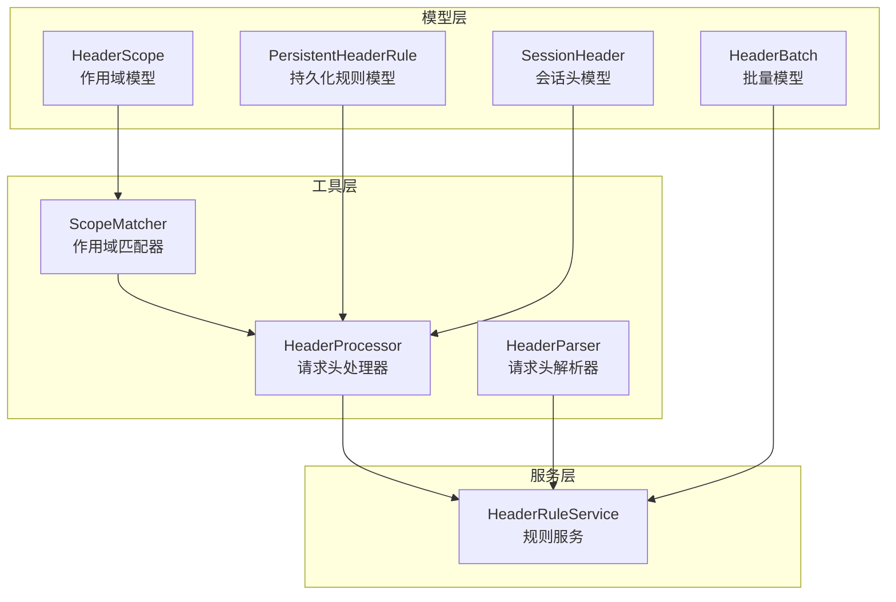
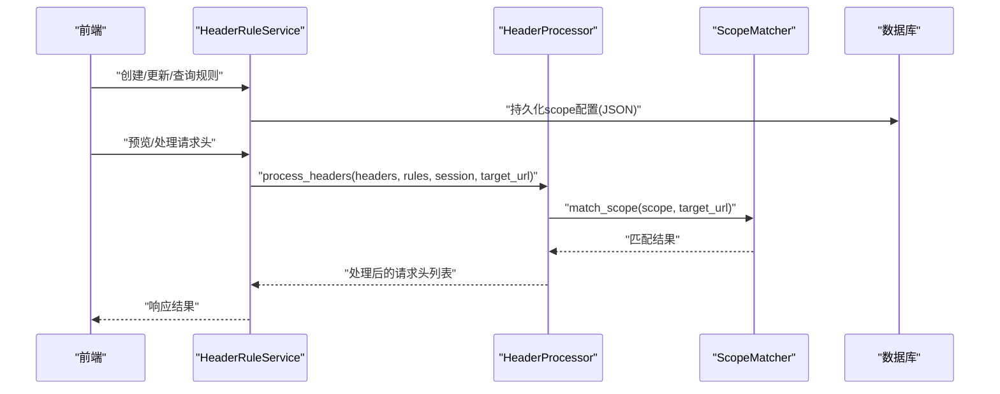
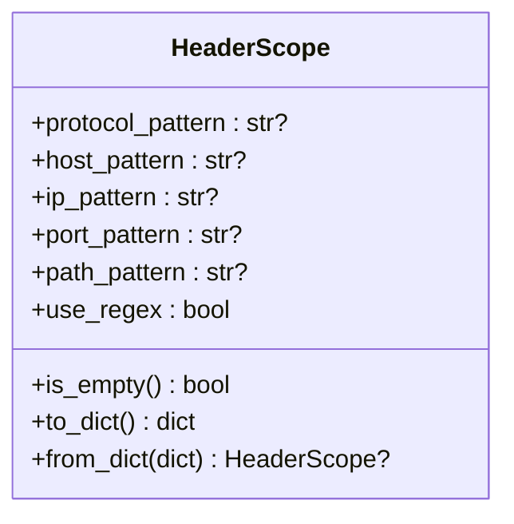
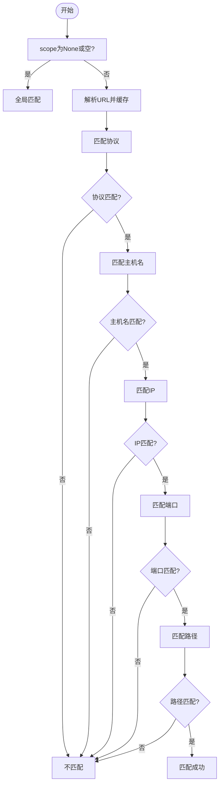
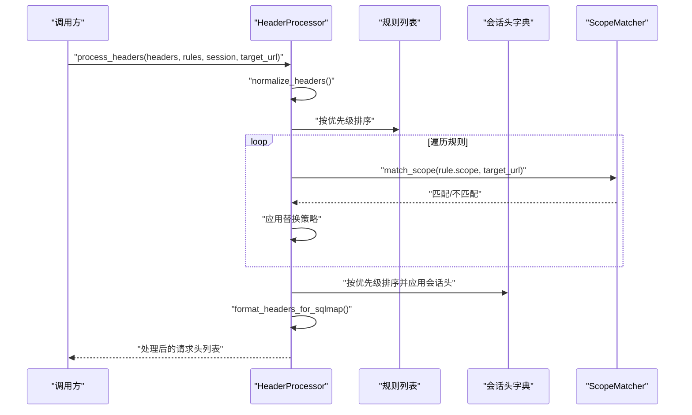
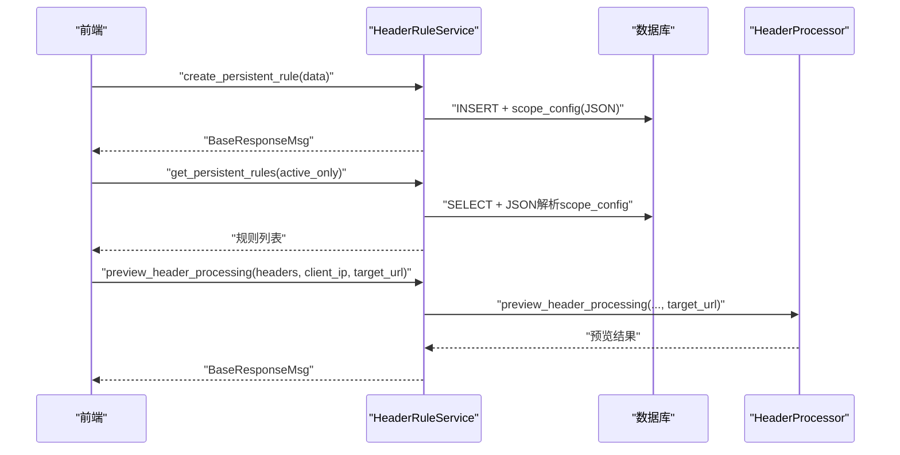
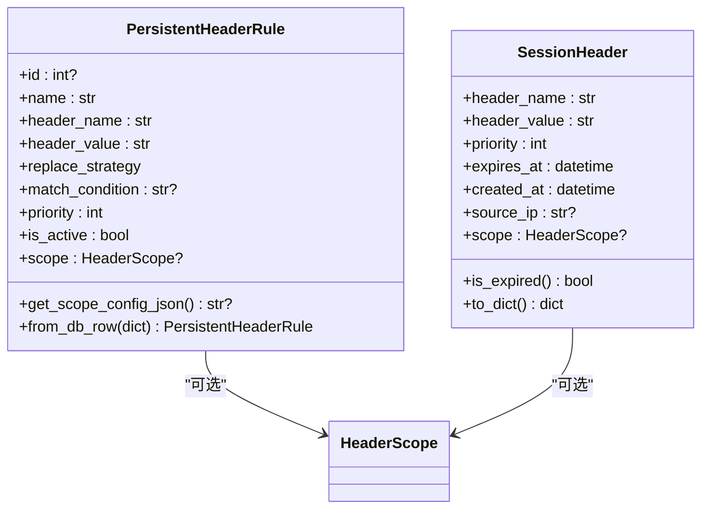
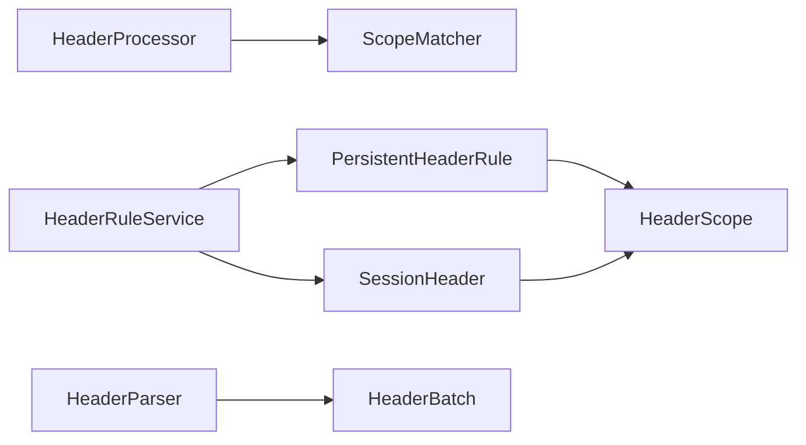

# 请求头作用域配置

<cite>
**本文引用的文件**
- [src/backEnd/model/HeaderScope.py](file://src/backEnd/model/HeaderScope.py)
- [src/backEnd/model/PersistentHeaderRule.py](file://src/backEnd/model/PersistentHeaderRule.py)
- [src/backEnd/model/SessionHeader.py](file://src/backEnd/model/SessionHeader.py)
- [src/backEnd/utils/scope_matcher.py](file://src/backEnd/utils/scope_matcher.py)
- [src/backEnd/utils/header_processor.py](file://src/backEnd/utils/header_processor.py)
- [src/backEnd/service/headerRuleService.py](file://src/backEnd/service/headerRuleService.py)
- [src/backEnd/utils/header_parser.py](file://src/backEnd/utils/header_parser.py)
- [src/backEnd/model/HeaderBatch.py](file://src/backEnd/model/HeaderBatch.py)
- [doc/HEADER_CONFIG_USER_GUIDE.md](file://doc/HEADER_CONFIG_USER_GUIDE.md)
- [doc/HEADER_CONFIG_UI_IMPLEMENTATION.md](file://doc/HEADER_CONFIG_UI_IMPLEMENTATION.md)
- [src/backEnd/doc/SCOPE_FEATURE_SUMMARY.md](file://src/backEnd/doc/SCOPE_FEATURE_SUMMARY.md)
</cite>

## 目录
1. [简介](#简介)
2. [项目结构](#项目结构)
3. [核心组件](#核心组件)
4. [架构总览](#架构总览)
5. [详细组件分析](#详细组件分析)
6. [依赖关系分析](#依赖关系分析)
7. [性能考量](#性能考量)
8. [故障排查指南](#故障排查指南)
9. [结论](#结论)
10. [附录](#附录)

## 简介
本文件围绕“请求头作用域配置”进行系统化说明，涵盖数据模型、匹配逻辑、处理流程、前后端交互与最佳实践。目标读者包括开发人员、测试工程师以及需要精细化控制请求头生效范围的使用者。文档基于仓库中的后端实现与配套文档，确保内容与代码一致。

## 项目结构
后端采用分层架构：
- 模型层：定义请求头规则、会话头、作用域等数据模型
- 工具层：作用域匹配器、请求头处理器、解析器等
- 服务层：持久化规则的CRUD与预览处理
- 文档：用户指南、UI实现说明、功能总结

图示来源
- [src/backEnd/model/HeaderScope.py](file://src/backEnd/model/HeaderScope.py#L1-L187)
- [src/backEnd/model/PersistentHeaderRule.py](file://src/backEnd/model/PersistentHeaderRule.py#L1-L104)
- [src/backEnd/model/SessionHeader.py](file://src/backEnd/model/SessionHeader.py#L1-L71)
- [src/backEnd/utils/scope_matcher.py](file://src/backEnd/utils/scope_matcher.py#L1-L346)
- [src/backEnd/utils/header_processor.py](file://src/backEnd/utils/header_processor.py#L1-L292)
- [src/backEnd/utils/header_parser.py](file://src/backEnd/utils/header_parser.py#L1-L343)
- [src/backEnd/service/headerRuleService.py](file://src/backEnd/service/headerRuleService.py#L1-L976)
- [src/backEnd/model/HeaderBatch.py](file://src/backEnd/model/HeaderBatch.py#L1-L86)

章节来源
- [src/backEnd/model/HeaderScope.py](file://src/backEnd/model/HeaderScope.py#L1-L187)
- [src/backEnd/utils/scope_matcher.py](file://src/backEnd/utils/scope_matcher.py#L1-L346)
- [src/backEnd/utils/header_processor.py](file://src/backEnd/utils/header_processor.py#L1-L292)
- [src/backEnd/service/headerRuleService.py](file://src/backEnd/service/headerRuleService.py#L1-L976)
- [src/backEnd/utils/header_parser.py](file://src/backEnd/utils/header_parser.py#L1-L343)
- [src/backEnd/model/PersistentHeaderRule.py](file://src/backEnd/model/PersistentHeaderRule.py#L1-L104)
- [src/backEnd/model/SessionHeader.py](file://src/backEnd/model/SessionHeader.py#L1-L71)
- [src/backEnd/model/HeaderBatch.py](file://src/backEnd/model/HeaderBatch.py#L1-L86)

## 核心组件
- HeaderScope：定义作用域的多维匹配规则（协议、主机名、IP、端口、路径），支持关键字与正则两种匹配模式，并提供空作用域判定与序列化/反序列化能力。
- ScopeMatcher：执行作用域匹配，支持URL解析缓存、正则编译缓存、早期退出等性能优化。
- HeaderProcessor：将原始请求头转换为字典，应用持久化规则与会话头，支持匹配条件与替换策略，并在处理过程中传递target_url以供作用域匹配。
- PersistentHeaderRule/SessionHeader：分别承载持久化规则与会话头的数据结构，均支持可选的scope字段。
- HeaderRuleService：提供规则的CRUD与预览处理，支持批量解析与创建，内部将scope序列化为JSON存储并在查询时反序列化。
- HeaderParser/HeaderBatch：解析多格式请求头文本，支持批量创建请求头规则或会话头。

章节来源
- [src/backEnd/model/HeaderScope.py](file://src/backEnd/model/HeaderScope.py#L1-L187)
- [src/backEnd/utils/scope_matcher.py](file://src/backEnd/utils/scope_matcher.py#L1-L346)
- [src/backEnd/utils/header_processor.py](file://src/backEnd/utils/header_processor.py#L1-L292)
- [src/backEnd/model/PersistentHeaderRule.py](file://src/backEnd/model/PersistentHeaderRule.py#L1-L104)
- [src/backEnd/model/SessionHeader.py](file://src/backEnd/model/SessionHeader.py#L1-L71)
- [src/backEnd/service/headerRuleService.py](file://src/backEnd/service/headerRuleService.py#L1-L976)
- [src/backEnd/utils/header_parser.py](file://src/backEnd/utils/header_parser.py#L1-L343)
- [src/backEnd/model/HeaderBatch.py](file://src/backEnd/model/HeaderBatch.py#L1-L86)

## 架构总览
请求头处理的整体流程如下：
- 用户通过前端配置持久化规则与会话头，可选配置作用域
- 后端服务接收请求，持久化规则与会话头均支持scope
- 处理阶段将原始请求头标准化为字典，按优先级应用持久化规则与会话头
- 应用前进行作用域匹配，仅对匹配的URL应用对应规则
- 最终将字典转回列表格式返回给调用方

图示来源
- [src/backEnd/service/headerRuleService.py](file://src/backEnd/service/headerRuleService.py#L1-L976)
- [src/backEnd/utils/header_processor.py](file://src/backEnd/utils/header_processor.py#L1-L292)
- [src/backEnd/utils/scope_matcher.py](file://src/backEnd/utils/scope_matcher.py#L1-L346)

## 详细组件分析

### HeaderScope 数据模型
- 字段维度：协议、主机名、IP、端口、路径；支持use_regex开关
- 匹配语义：
  - scope为空/null时，表示全局生效
  - 非空字段间为AND逻辑；空字段表示不限制该维度
  - protocol_pattern默认支持http/https；端口支持多值与通配符
- 序列化/反序列化：to_dict/from_dict，便于持久化与响应
- 校验规则：长度限制、协议合法性、端口范围校验、正则字符识别

图示来源
- [src/backEnd/model/HeaderScope.py](file://src/backEnd/model/HeaderScope.py#L1-L187)

章节来源
- [src/backEnd/model/HeaderScope.py](file://src/backEnd/model/HeaderScope.py#L1-L187)

### ScopeMatcher 作用域匹配器
- 匹配逻辑：
  - scope为None或空时，全局匹配
  - 逐维度匹配（协议、主机名、IP、端口、路径），任一不匹配即返回不匹配
  - 支持关键字与正则两种模式
- 性能优化：
  - URL解析缓存（最多50条）
  - 正则编译缓存（最多100条）
  - 早期退出策略
- 边界处理：默认端口、主机名解析失败、IP格式判断

图示来源
- [src/backEnd/utils/scope_matcher.py](file://src/backEnd/utils/scope_matcher.py#L1-L346)

章节来源
- [src/backEnd/utils/scope_matcher.py](file://src/backEnd/utils/scope_matcher.py#L1-L346)

### HeaderProcessor 请求头处理器
- 标准化与格式化：将列表转字典再转回列表，保证与下游工具兼容
- 规则应用顺序：按优先级降序；作用域匹配通过target_url传入
- 会话头应用：过滤过期会话头，按优先级升序（高优先级后执行以覆盖低优先级）
- 替换策略：REPLACE/APPEND/PREPEND/CONDITIONAL/UPSERT
- 匹配条件：支持正则表达式（忽略大小写）

图示来源
- [src/backEnd/utils/header_processor.py](file://src/backEnd/utils/header_processor.py#L1-L292)
- [src/backEnd/utils/scope_matcher.py](file://src/backEnd/utils/scope_matcher.py#L1-L346)

章节来源
- [src/backEnd/utils/header_processor.py](file://src/backEnd/utils/header_processor.py#L1-L292)

### HeaderRuleService 规则服务
- CRUD与预览：创建、查询、更新、删除持久化规则；预览处理结果
- scope序列化：创建/更新时将scope对象序列化为JSON存储
- 查询反序列化：查询时将scope_config反序列化为HeaderScope对象
- 批量解析与创建：支持从原始文本批量解析请求头并创建规则或会话头

图示来源
- [src/backEnd/service/headerRuleService.py](file://src/backEnd/service/headerRuleService.py#L1-L976)
- [src/backEnd/utils/header_processor.py](file://src/backEnd/utils/header_processor.py#L1-L292)

章节来源
- [src/backEnd/service/headerRuleService.py](file://src/backEnd/service/headerRuleService.py#L1-L976)

### 持久化规则与会话头模型
- PersistentHeaderRule：包含规则名称、请求头名称与值、替换策略、匹配条件、优先级、启用状态、可选scope
- SessionHeader：包含请求头名称与值、优先级、过期时间、来源IP、可选scope
- 两者均支持scope字段，作用域匹配在处理阶段生效

图示来源
- [src/backEnd/model/PersistentHeaderRule.py](file://src/backEnd/model/PersistentHeaderRule.py#L1-L104)
- [src/backEnd/model/SessionHeader.py](file://src/backEnd/model/SessionHeader.py#L1-L71)
- [src/backEnd/model/HeaderScope.py](file://src/backEnd/model/HeaderScope.py#L1-L187)

章节来源
- [src/backEnd/model/PersistentHeaderRule.py](file://src/backEnd/model/PersistentHeaderRule.py#L1-L104)
- [src/backEnd/model/SessionHeader.py](file://src/backEnd/model/SessionHeader.py#L1-L71)
- [src/backEnd/model/HeaderScope.py](file://src/backEnd/model/HeaderScope.py#L1-L187)

### 批量解析与创建
- HeaderParser：支持HTTP、键值对、JSON、cURL等多种格式解析，自动检测格式，清洗与验证头部名称与值
- HeaderBatch：定义批量解析与创建的请求/响应模型，支持默认优先级与TTL等参数

章节来源
- [src/backEnd/utils/header_parser.py](file://src/backEnd/utils/header_parser.py#L1-L343)
- [src/backEnd/model/HeaderBatch.py](file://src/backEnd/model/HeaderBatch.py#L1-L86)

## 依赖关系分析
- HeaderProcessor依赖ScopeMatcher进行作用域匹配
- HeaderRuleService在创建/更新时序列化scope，在查询时反序列化scope
- 模型层的PersistentHeaderRule与SessionHeader均持有HeaderScope引用
- HeaderParser与HeaderBatch为批量导入提供基础能力

图示来源
- [src/backEnd/utils/header_processor.py](file://src/backEnd/utils/header_processor.py#L1-L292)
- [src/backEnd/utils/scope_matcher.py](file://src/backEnd/utils/scope_matcher.py#L1-L346)
- [src/backEnd/service/headerRuleService.py](file://src/backEnd/service/headerRuleService.py#L1-L976)
- [src/backEnd/model/PersistentHeaderRule.py](file://src/backEnd/model/PersistentHeaderRule.py#L1-L104)
- [src/backEnd/model/SessionHeader.py](file://src/backEnd/model/SessionHeader.py#L1-L71)
- [src/backEnd/model/HeaderScope.py](file://src/backEnd/model/HeaderScope.py#L1-L187)
- [src/backEnd/utils/header_parser.py](file://src/backEnd/utils/header_parser.py#L1-L343)
- [src/backEnd/model/HeaderBatch.py](file://src/backEnd/model/HeaderBatch.py#L1-L86)

章节来源
- [src/backEnd/utils/header_processor.py](file://src/backEnd/utils/header_processor.py#L1-L292)
- [src/backEnd/utils/scope_matcher.py](file://src/backEnd/utils/scope_matcher.py#L1-L346)
- [src/backEnd/service/headerRuleService.py](file://src/backEnd/service/headerRuleService.py#L1-L976)
- [src/backEnd/model/PersistentHeaderRule.py](file://src/backEnd/model/PersistentHeaderRule.py#L1-L104)
- [src/backEnd/model/SessionHeader.py](file://src/backEnd/model/SessionHeader.py#L1-L71)
- [src/backEnd/model/HeaderScope.py](file://src/backEnd/model/HeaderScope.py#L1-L187)
- [src/backEnd/utils/header_parser.py](file://src/backEnd/utils/header_parser.py#L1-L343)
- [src/backEnd/model/HeaderBatch.py](file://src/backEnd/model/HeaderBatch.py#L1-L86)

## 性能考量
- 缓存策略：URL解析缓存与正则编译缓存，限制最大容量并定期清理
- 早期退出：任一维度不匹配立即返回，减少不必要的计算
- 优先级排序：规则按优先级降序处理，会话头按优先级升序处理，避免多次遍历
- 正则匹配：对非法正则进行捕获与告警，防止异常导致性能问题

章节来源
- [src/backEnd/utils/scope_matcher.py](file://src/backEnd/utils/scope_matcher.py#L1-L346)
- [src/backEnd/utils/header_processor.py](file://src/backEnd/utils/header_processor.py#L1-L292)

## 故障排查指南
- 规则创建失败
  - 检查必填字段与唯一性约束（名称重复）
  - 检查数据库连接状态
- 规则不生效
  - 检查规则启用状态
  - 检查作用域配置是否与目标URL匹配
  - 检查优先级是否被更高优先级规则覆盖
- 会话头不可见
  - 检查是否已过期
  - 检查浏览器会话或后端重启导致的丢失
- 预览结果异常
  - 确认target_url格式正确
  - 检查正则表达式是否有效

章节来源
- [doc/HEADER_CONFIG_USER_GUIDE.md](file://doc/HEADER_CONFIG_USER_GUIDE.md#L1-L345)
- [src/backEnd/service/headerRuleService.py](file://src/backEnd/service/headerRuleService.py#L1-L976)
- [src/backEnd/utils/scope_matcher.py](file://src/backEnd/utils/scope_matcher.py#L1-L346)

## 结论
请求头作用域配置通过可选的HeaderScope与ScopeMatcher实现了灵活而高效的多维匹配，配合HeaderProcessor与HeaderRuleService，既保证了向后兼容，又提供了强大的控制能力。结合前端UI与批量导入能力，用户可以在不同场景下精准地控制请求头的应用范围与时机。

## 附录
- 使用建议
  - 大多数情况下无需配置scope，保持全局生效
  - 仅在需要限制规则仅对特定目标生效时配置scope
  - 优先使用关键字模式，除非必要否则不使用正则表达式
  - 避免过度限制，以免规则无法生效
- 典型场景
  - 全局通用请求头：不填写scope字段
  - 特定域名认证：配置host_pattern
  - 内网IP段：配置ip_pattern
  - API版本隔离：配置path_pattern
  - HTTPS专属头：配置protocol_pattern
  - 生产/测试环境隔离：组合配置

章节来源
- [src/backEnd/doc/SCOPE_FEATURE_SUMMARY.md](file://src/backEnd/doc/SCOPE_FEATURE_SUMMARY.md#L1-L219)
- [doc/HEADER_CONFIG_USER_GUIDE.md](file://doc/HEADER_CONFIG_USER_GUIDE.md#L1-L345)
- [doc/HEADER_CONFIG_UI_IMPLEMENTATION.md](file://doc/HEADER_CONFIG_UI_IMPLEMENTATION.md#L1-L374)